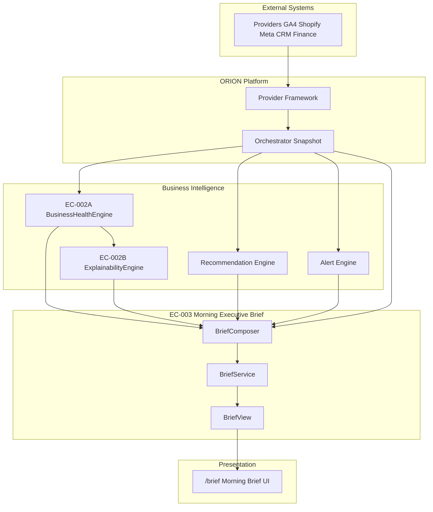
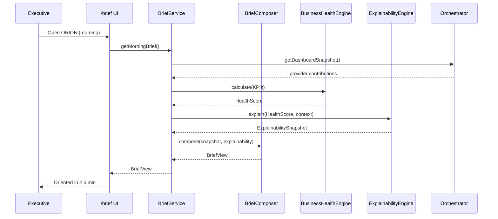

# BP-003 — Morning Executive Brief

**Blueprint ID:** BP-003  
**Executive Capability:** EC-003 — Morning Executive Brief  
**Classification:** Product Blueprint  
**Version:** 1.0.0  
**Status:** Approved for Architecture Review  
**Author:** ORION CTO  
**Audience:** Founder · Chief Architect · Product · Design · Engineering  

**Governed by:**

- [ORION Constitution (Ratified)](../09_Standards/ORION_Constitution_Ratified.md)
- [ORION Architecture Handbook](../03_Architecture/ORION_Architecture_Handbook.md)
- [ORION Engineering Principles](../09_Standards/ORION_Engineering_Principles.md)
- [ORION North Star](../00_Strategy/Founders_Manifesto.md)

**Related specifications:**

- [EC-001 Morning Executive Brief (Product)](../05_Product/EC-001_Morning_Executive_Brief.md) — product narrative source
- [ES-011 — Morning Executive Brief](../01_Engineering/ES-011-Morning-Executive-Brief.md)
- [DC-011 — Morning Executive Brief](../01_Engineering/DC-011-Morning-Executive-Brief.md)
- [Morning Executive Brief UI](../04_Design/Morning_Executive_Brief_UI.md)
- [EC-002A — Business Health Engine Core](../07_Engineering/EC-002A_Business_Health_Engine_Core.md)
- [EC-002B Release Review](../01_Engineering/EC-002B_Release_Review.md)

---

# North Star Question

> *"What do I need to know before I start my day?"*

The Morning Executive Brief is ORION's daily opening ritual — a **decision-ready narrative**, not a dashboard.

---

# Purpose

EC-003 delivers the executive intelligence surface that compresses business condition, material changes, critical alerts, and top actions into a **≤ 5 minute morning orientation**.

The Brief exists to protect executive attention. Every section must reduce uncertainty, surface risk, or accelerate a decision. Anything that does not change what the executive does next does not belong on this screen.

## Business value

| Stakeholder | Value |
|-------------|-------|
| **Executive** | Starts the day oriented, not overwhelmed |
| **Organisation** | Faster response to revenue, operational, and customer risks |
| **ORION Platform** | Daily habit that justifies integrations and intelligence investment |

## Executive outcome

After consuming the Morning Brief, the executive can articulate:

1. Overall business condition — healthy, stable, or under pressure  
2. The one thing that cannot wait today  
3. What changed since yesterday / last view  
4. Where to focus first  
5. What can safely wait  

---

# Scope

## In scope (EC-003 V1)

| Area | Description |
|------|-------------|
| Morning Brief surface | `/brief` route — default executive entry (target) |
| Deterministic composition | Health, alerts, changes, priorities, end summary |
| EC-002A integration | Business Health Score from `BusinessHealthEngine` |
| EC-002B integration | Explainability via `ExplainabilityEngine` |
| Brief lifecycle | Fresh · updated · stale · incomplete · offline |
| Progressive disclosure | Anomaly-driven expansion; compact healthy domains |
| Accessibility | WCAG 2.2 AA |
| Performance | Sub-2s meaningful paint; orchestrated snapshot |

## Out of scope (EC-003 V1)

| Area | Rationale |
|------|-----------|
| AI Copilot conversational drill-down | EC-005 |
| Full recommendation engine rewrite | Existing `lib/intelligence/recommendation-engine.ts` consumed, not replaced |
| Voice briefing | V3 roadmap |
| Email digest delivery | V2 roadmap |
| Provider implementation | Provider Framework / normalizers |
| Score calculation changes | EC-002A frozen |

---

# Architecture overview



## Layer placement

Per Architecture Handbook:

```
Business Intelligence Layer
  EC-002A Business Health Engine      ✓ implemented
  EC-002B Explainability Engine       ✓ implemented
  Recommendation / Alert Engines      partial

Executive Intelligence Layer
  EC-003 Morning Executive Brief      ← this blueprint

Presentation Layer
  /brief · BriefPageContent           partial vertical slice
```

---

# Workflow

## Primary morning workflow



## Brief lifecycle workflow

| State | Trigger | Executive experience |
|-------|---------|-------------------|
| **Fresh** | First open of day | Full brief; morning greeting |
| **Updated** | Evidence changed since last view | Delta banner with change count |
| **Stale** | Sync older than SLA | Timestamp + sync CTA |
| **Incomplete** | Missing providers or insufficient confidence | Graceful degradation badges |
| **Offline** | Network unavailable | Cached brief + staleness label |

## Action workflow (V1)

1. Executive reads Top Recommendation  
2. Chooses: Act · Delegate · Snooze · Dismiss (intent captured)  
3. End-of-Brief Summary confirms condition · priority · first action  
4. Optional navigation to Command Center for drill-down  

---

# Components

| Component | Layer | Responsibility |
|-----------|-------|----------------|
| `BriefService` | EC-003 service | Public facade; repository selection |
| `BriefComposer` | EC-003 composition | Maps engines → `BriefView` |
| `BriefRepository` | EC-003 data | Snapshot source (orchestrator / mock) |
| `BusinessHealthEngine` | EC-002A | Deterministic health score |
| `ExplainabilityEngine` | EC-002B | Confidence + narrative + explanation items |
| `Recommendation Engine` | BI | Ranked action candidates |
| `Alert Engine` | BI | Critical alerts feed |
| `Orchestrator` | Platform | Unified snapshot aggregation |
| `BriefPageContent` | Presentation | Section layout and accessibility |

---

# Deterministic behaviour

Per ORION Constitution Article IV:

| Rule | Requirement |
|------|-------------|
| Health score | Always from EC-002A; never UI-calculated |
| Confidence | Always from EC-002B; displayed with level badge |
| Executive narrative (deterministic) | EC-002B template narrative for health drawer |
| Section ordering | Fixed urgency order; not user-configurable in V1 |
| AI summary | Async optional layer; template fallback if validation fails |
| Same snapshot input | Same deterministic Brief sections (excluding AI async) |

AI may summarise and recommend in V1 **only** with evidence grounding and deterministic fallback. AI shall not alter health or confidence calculations.

---

# Data contracts

Primary consumer contract: **`BriefView`** (`types/executive/snapshot.ts`).

| Field | Source engine | Deterministic |
|-------|---------------|---------------|
| `businessHealth` | EC-002A + EC-002B mapping | Yes |
| `criticalAlerts` | Alert / orchestrator | Yes |
| `overnightChanges` | Delta service (V1: orchestrator) | Yes |
| `recommendations` | Recommendation engine | Yes |
| `priorities` | Brief prioritizer | Yes |
| `aiSummary` | AI service with template fallback | Partial |
| `endSummary` | Template composition from top signals | Yes |
| `greeting` | Time + health narrative | Yes |

Explainability drill-down contract: **`ExplainabilitySnapshot`** from `@/lib/explainability`.

---

# Performance goals

| Metric | Target (V1) | Measurement |
|--------|-------------|-------------|
| Time-to-first-meaningful-paint | ≤ 1.5s | `/brief` server render |
| Full deterministic brief ready | ≤ 2.0s | BriefService p95 |
| Explainability pipeline | ≤ 250ms | EC-002B budget (embedded) |
| AI summary (async) | ≤ 5.0s | Non-blocking stream |
| Brief session orientation | ≤ 90s | Product metric |
| Lighthouse Performance | ≥ 85 | Mobile executive profile |

---

# Accessibility

- WCAG 2.2 AA compliance  
- Severity never conveyed by colour alone  
- Landmark regions for each brief section  
- Live region for sync / lifecycle updates  
- Full keyboard parity for recommendation actions  
- `prefers-reduced-motion` respected  
- Minimum 44×44px touch targets on mobile  

---

# Testing strategy

| Layer | Approach |
|-------|----------|
| Unit | BriefComposer mapping, lifecycle rules, template fallbacks |
| Integration | Orchestrator → BHE → EE → BriefView |
| Contract | `BriefView` shape validation against EC-003 schema |
| E2E | Playwright: load brief · expand health · act on recommendation |
| Determinism | Golden tests for composed sections with fixed fixtures |
| Performance | BriefService budget test (< 2s) |
| Accessibility | axe-core on `/brief` |

---

# Extension points

| Extension | Mechanism |
|-----------|-----------|
| Additional brief sections | `BriefComposer` section registry |
| Provider contributions | Orchestrator snapshot schema |
| Custom greeting templates | Brief config templates |
| Density modes | V2 BriefView variant |
| Email / voice delivery | BriefRepository adapters |
| Plugin panels | Architecture Handbook extension points |

---

# Success metrics

| Metric | V1 target |
|--------|-----------|
| Brief completion rate | ≥ 80% |
| Time-to-orientation | ≤ 90 seconds |
| Action conversion | ≥ 60% |
| Executive trust (in-app) | ≥ 4.2 / 5 |
| Evidence coverage on recommendations | 100% |
| False urgency rate | ≤ 10% |

---

# Roadmap alignment

| Version | Focus |
|---------|-------|
| **V1** | Deterministic brief + EC-002A/002B wiring + `/brief` vertical slice |
| **V1.1** | Since-last-view delta engine; reasoning drawer |
| **V2** | Real-time alerts; email brief; density modes |
| **V3** | Voice briefing; predictive narrative; board export |

---

# Document governance

| Field | Value |
|-------|--------|
| **Owner** | ORION CTO |
| **Reviewers** | Founder · Chief Architect · Design Lead |
| **Implementation** | ES-011 · DC-011 |
| **Status** | Approved for Architecture Review — await Founder approval before implementation planning |

---

## Version history

| Version | Date | Author | Changes |
|---------|------|--------|---------|
| 1.0.0 | 26 July 2026 | ORION CTO | Initial blueprint · EC-003 Morning Executive Brief |
