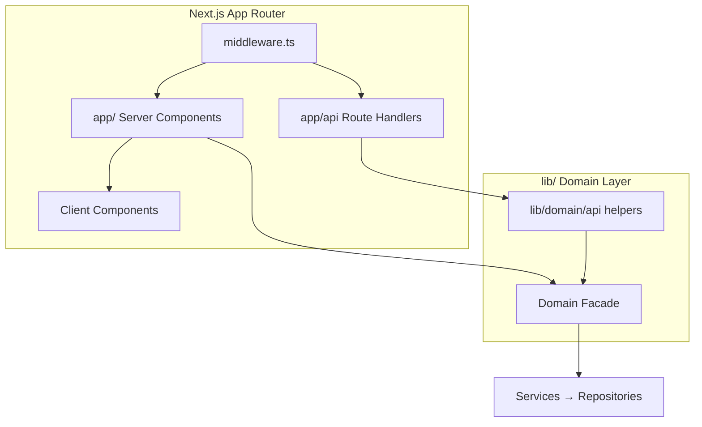

# ES-090 — ORION Next.js Enterprise Standards

**Document ID:** ES-090  
**Mission:** P-013.2 — ORION Next.js Enterprise Standards  
**Version:** 1.0  
**Status:** Ratified — Governing Engineering Standard  
**Classification:** Engineering Specification  
**Authority:** Chief Enterprise Architect  
**Effective Date:** August 2026  
**Architecture Baseline:** v1.0 Candidate  

**Parent:** [ORION Enterprise Architecture Handbook v1.0](./ORION_Enterprise_Architecture_Handbook_v1.0.md)  
**Related:** [G-001 Governance Charter](../11_Governance/Governance/G-001-Enterprise-Architecture-Governance-Charter.md) · [Business Workspace Pattern](../03_Architecture/BUSINESS_WORKSPACE_PATTERN.md) · [Engineering Standards](../09_Standards/Engineering_Standards.md) · [ES-HCM-001 REST/API patterns](../HCM/Engineering/HCM-API-Catalogue.md)

---

## Executive Summary

This specification defines the **official Next.js engineering standard** for all ORION web applications — Finance, CRM, Hospitality, HCM, and every future domain workspace.

ORION runs a **single Next.js application** with:

- **App Router** for pages and API route handlers
- **Domain facades** in `lib/` for all business logic
- **Organization-scoped** authentication and service context
- **Standard REST envelopes** for API responses
- **Vitest** for unit and integration testing

Presentation lives in `app/` and `components/`. Business rules **never** live in React components or route handlers beyond HTTP mapping.

> **Important:** ORION uses Next.js 16 with breaking changes from common training data. Before implementing Next.js features, consult `node_modules/next/dist/docs/` and heed deprecation notices ([AGENTS.md](../../AGENTS.md)).

---

## 1. Technology Stack

| Layer | Technology | Version (Baseline) | Purpose |
|-------|------------|-------------------|---------|
| Framework | **Next.js** (App Router) | 16.x | Routing, SSR, API, build |
| UI | **React** | 19.x | Components |
| Language | **TypeScript** | 5.x | Strict typing |
| Styling | **Tailwind CSS** | 4.x | Design tokens, utility classes |
| Runtime | **Node.js** | 20 LTS+ | Server, build, tests |
| Testing | **Vitest** + Testing Library | 4.x | Unit, integration |
| Lint | **ESLint** + eslint-config-next | 9.x | Static analysis |

### Stack Rules

1. Do not add alternate frameworks (no parallel Express apps for domain logic).
2. Do not bypass TypeScript strict mode for domain code.
3. Prefer platform and domain packages in `lib/` over inline route logic.
4. Pin Next.js and React to approved versions in `package.json` — upgrade via ADR.

---

## 2. Folder Structure

```
orion-app/
├── app/                          # App Router — pages, layouts, API routes
│   ├── (auth)/                   # Route group — login, public auth
│   ├── (platform)/               # Route group — authenticated workspaces
│   │   ├── crm/
│   │   ├── finance/
│   │   ├── hospitality/
│   │   └── …                     # Future: hcm/, inventory/, etc.
│   ├── api/                      # REST route handlers by domain
│   │   ├── hcm/
│   │   ├── finance/
│   │   ├── crm/
│   │   └── …
│   ├── layout.tsx                # Root layout
│   ├── loading.tsx               # Root loading UI
│   └── error.tsx                 # Root error boundary
├── components/
│   ├── ui/                       # Atomic design system (Card, Button, …)
│   ├── platform/                 # Cross-cutting platform components
│   ├── globals/                  # Executive shell (layout, header, footer)
│   ├── executive/                # Brief, command center
│   ├── crm/                      # Domain presentation components
│   ├── finance/
│   ├── hospitality/
│   └── …
├── lib/                          # Business logic — facades, services, platform
│   ├── hcm/                      # Domain package (facade, wiring, api helpers)
│   ├── finance/
│   ├── crm/
│   ├── hospitality/
│   ├── platform/                 # IIL, workflow, data, identity
│   ├── identity/                 # Session, middleware auth
│   ├── security/                 # Headers, CSP
│   └── decisions/                # ServiceContext helpers
├── hooks/                        # Shared React hooks (client)
├── types/                        # Shared TypeScript types
├── docs/                         # Engineering and governance docs
├── tests/                        # Vitest suites (mirror lib/ structure)
├── public/                       # Static assets
├── middleware.ts                 # Auth, security headers, tenant routing
└── package.json
```

### Folder Rules

| Rule | Description |
|------|-------------|
| **Thin routes** | `app/` pages compose components; call facades or API — no business rules |
| **Fat lib** | Domain logic in `lib/<domain>/` per [Enterprise Architecture Handbook §15](./ORION_Enterprise_Architecture_Handbook_v1.0.md#chapter-15--coding-standards) |
| **No lib → app imports** | `lib/` never imports from `app/` or `components/` |
| **Domain components** | `components/<domain>/` — presentation only |
| **Co-located API helpers** | `lib/<domain>/api/` for response envelopes (see HCM) |

---

## 3. App Router Standards

### 3.1 Route Groups

Route groups `(name)` organize layouts **without** affecting the URL:

| Group | Purpose |
|-------|---------|
| `(auth)` | Login, forgot password, unauthorized |
| `(platform)` | Authenticated executive workspaces |

Future domains add `app/(platform)/<workspace>/` following [Business Workspace Pattern](../03_Architecture/BUSINESS_WORKSPACE_PATTERN.md).

### 3.2 Layouts

| Layout | Responsibility |
|--------|----------------|
| `app/layout.tsx` | HTML shell, fonts, global providers |
| `app/(platform)/layout.tsx` | Executive shell (`ExecutiveLayout`) |
| `app/(platform)/<domain>/layout.tsx` | Workspace sub-navigation only |

**Rules:**

- Do not duplicate the executive shell inside domain layouts.
- Layouts are Server Components by default.
- Pass minimal props — fetch data in pages or child server components.

### 3.3 Nested Layouts

```
app/(platform)/crm/layout.tsx          → CrmSubNav + children
app/(platform)/crm/opportunities/page.tsx
```

Nested layouts inherit parent boundaries. Domain-specific `error.tsx` and `loading.tsx` may exist per section (e.g. `brief/`, `dashboard/`).

### 3.4 Loading UI

- Provide `loading.tsx` at root and heavy route segments.
- Use skeleton patterns from design system — avoid layout shift.
- Loading UI must be Server-compatible (no client-only assumptions).

### 3.5 Error UI

- `error.tsx` must be Client Components (`"use client"`) — Next.js requirement.
- Display user-safe messages; log details server-side.
- Offer recovery actions (retry, navigate home).
- Domain errors from facades map to friendly copy — never expose stack traces.

### 3.6 Not Found

- `not-found.tsx` under `(platform)/` for workspace-level 404.
- Call `notFound()` from Server Components when entity missing.
- API routes return JSON `{ success: false, error: "NOT_FOUND" }` with HTTP 404 — not HTML.

---

## 4. Server Components

### 4.1 When to Use (Default)

Use Server Components for:

- Page and layout composition
- Initial data loading from facades (direct import in server context)
- Static and streaming content
- SEO-relevant executive workspace pages

### 4.2 When Not to Use

Add `"use client"` only when required:

- Browser APIs (localStorage, window events)
- React hooks (`useState`, `useEffect`, `useContext`)
- Event handlers (onClick, onChange)
- Third-party client-only libraries

**Rule:** Push `"use client"` to the smallest leaf component (container/presenter split).

### 4.3 Performance

- Prefer parallel data fetching with `Promise.all` in pages.
- Avoid waterfall fetches across nested server components when combinable.
- Do not import heavy client libraries into server component trees.

### 4.4 Caching

| Data Type | Strategy |
|-----------|----------|
| User-specific / tenant data | **No cache** — `dynamic = "force-dynamic"` |
| Reference data (rarely changes) | `fetch` cache or React `cache()` with revalidation |
| Static marketing/public | Static generation where applicable |

Authenticated platform routes default to **dynamic rendering**.

---

## 5. Client Components

### 5.1 Rules

1. Mark with `"use client"` at file top.
2. No direct repository or store access — call API routes or receive props from server parents.
3. No embedded business rules — validation UI only; authoritative validation on server.
4. Prefer composition: Server Component wrapper fetches, Client Component interacts.

### 5.2 State Management

| State Type | Approach |
|------------|----------|
| URL state | Search params, Next.js router |
| Form state | Controlled components or form library |
| Global UI | React Context sparingly (`SessionProvider`, shell providers) |
| Server state | Fetch from API; revalidate on mutation |

Avoid Redux/Zustand unless ADR-approved for specific high-complexity workspace.

### 5.3 Performance

- Lazy-load heavy client bundles with `dynamic(() => import(...), { ssr: false })` when justified.
- Memoize expensive client computations.
- Use `WebVitalsReporter` pattern for production monitoring.

---

## 6. Server Actions

### 6.1 Usage

Server Actions (`"use server"`) are permitted for:

- Platform integration mutations (e.g. connector execution)
- Form submissions that map 1:1 to facade operations
- Internal admin operations with strict auth

**Prefer REST route handlers** for domain APIs consumed by multiple clients or for consistency with existing ORION patterns.

### 6.2 Security

1. Always verify session inside the action.
2. Resolve `ServiceContext` from authenticated session — never trust client-supplied `organizationId`.
3. Re-check permissions before facade call.

### 6.3 Validation

- Validate input with schema or typed guards before facade invocation.
- Return structured errors — not thrown stack traces to client.

### 6.4 Error Handling

```typescript
// Pattern: return result object
return { success: false, error: "VALIDATION_FAILED" };
```

Align error codes with domain facade conventions.

---

## 7. REST API Standards

Aligned with [Enterprise Architecture Handbook §9](./ORION_Enterprise_Architecture_Handbook_v1.0.md#chapter-9--rest-api-standards).

### 7.1 Route Handlers

Location: `app/api/<domain>/.../route.ts`

```typescript
import { NextResponse } from "next/server";
import { hcmFacade } from "@/lib/hcm";
import { getHcmApiContext, hcmOk, hcmFromError } from "@/lib/hcm/api";

export const dynamic = "force-dynamic";

export async function GET(request: Request) {
  const { context } = await getHcmApiContext();
  // … map query params, call facade, return envelope
}
```

**Rules:**

1. Every handler delegates to **domain facade only** — never repositories.
2. Export `dynamic = "force-dynamic"` for authenticated tenant routes.
3. Dynamic segments: `{ params: Promise<{ id: string }> }` (Next.js 15+).

### 7.2 Versioning

| Scope | Convention |
|-------|--------------|
| Current platform | Unversioned `/api/<domain>/` |
| Future public API | `/api/v1/<domain>/` when external consumers require stability |

Breaking API changes require ADR + semver major bump.

### 7.3 Response Envelope

Success:

```json
{ "success": true, "data": { } }
```

Error:

```json
{ "success": false, "error": "DOMAIN_ERROR_CODE" }
```

Use shared helpers per domain (`lib/<domain>/api/`).

### 7.4 Pagination

```json
{
  "success": true,
  "data": {
    "items": [],
    "pagination": { "page": 1, "pageSize": 50, "total": 0 }
  }
}
```

Query: `page`, `pageSize`. Defaults: 1 and 50.

### 7.5 Filtering and Sorting

- Filters as query parameters matching domain search query types.
- Document supported filters in domain API Catalogue.
- Sort: `sortBy`, `sortOrder` where repository supports — document per resource.

### 7.6 Error HTTP Mapping

| Code Pattern | HTTP |
|--------------|------|
| `*_NOT_FOUND` | 404 |
| `DUPLICATE_*` | 409 |
| `INVALID_*`, `MISSING_PARAMS` | 400 |
| Policy / circular reference | 422 |

---

## 8. Authentication

### 8.1 Session Model

- Cookie-based session via `lib/identity/server-session.ts`
- API routes use `getDecisionServiceContext()` or domain-specific `getHcmApiContext()` wrapper
- Development fallback context documented per domain — **never in production without explicit config**

### 8.2 Middleware

`middleware.ts` at project root:

1. Bypass auth for health and auth API paths
2. Redirect unauthenticated users to `/login`
3. Role-based path access via `canAccessPathWithPayload`
4. Apply security headers on every response

### 8.3 Authorization

| Layer | Responsibility |
|-------|----------------|
| Middleware | Route-level role access |
| API handler | ServiceContext resolution |
| Domain facade | Organization isolation |
| Future | Domain permission matrix (TD-HCM-005 pattern) |

### 8.4 Organization Isolation

- `ServiceContext.organizationId` from session — not from request body
- Reject cross-tenant ID parameters unless platform admin role (future ADR)

### 8.5 Permission Hooks

Platform permission matrix at `/api/permissions/matrix`. Domain-specific permission hooks attach at API layer before facade calls — **required before production** for sensitive domains.

---

## 9. Middleware

### 9.1 Responsibilities

| Concern | Implementation |
|---------|----------------|
| Authentication | Session payload validation |
| Authorization | Path-based role checks |
| Security headers | `applySecurityHeaders()` |
| Tenant context | Session carries `organizationId` |

### 9.2 Matcher

Exclude static assets and Next.js internals:

```typescript
export const config = {
  matcher: ["/((?!_next/static|_next/image|favicon.ico|.*\\.(?:svg|png|jpg|jpeg|gif|webp)$).*)"],
};
```

### 9.3 Logging

- Log authentication failures at warn level — no credential content.
- Correlation IDs for API errors (future platform standard).

### 9.4 Localization

- Default locale: English (en).
- i18n routing deferred — when added, resolve locale in middleware with ADR.

### 9.5 Migration Note

Next.js may deprecate `middleware.ts` in favor of `proxy` convention. Monitor `node_modules/next/dist/docs/` and migrate via ADR when platform upgrades.

---

## 10. Performance

### 10.1 Image Optimization

- Use `next/image` for all non-trivial images.
- Provide `width`, `height`, and meaningful `alt`.
- Static assets in `public/`.

### 10.2 Streaming

- Use `<Suspense>` boundaries with `loading.tsx` fallbacks.
- Stream executive dashboard sections independently where beneficial.

### 10.3 Caching

| Route Type | Policy |
|------------|--------|
| Authenticated workspace | Dynamic (`force-dynamic`) |
| Public auth pages | Static or dynamic per security review |
| API routes (tenant data) | `force-dynamic` |

### 10.4 ISR (Incremental Static Regeneration)

Use ISR **only** for:

- Public marketing content (if added)
- Reference documentation pages

**Not** for tenant-specific or role-specific data.

### 10.5 Dynamic Rendering

Default for ORION platform: **dynamic** — executive data is user- and organization-specific.

---

## 11. Component Standards

### 11.1 Atomic Components (`components/ui/`)

- Card, Button, Badge, CollapsibleSection, etc.
- No domain imports
- Accept props only — no facade calls

### 11.2 Reusable Components

- `components/workspace/` — sub-nav, section headers
- `components/search/` — command palette, empty states
- `components/data/` — freshness indicators

### 11.3 Platform Components

- `components/globals/` — ExecutiveLayout, header, footer
- `components/platform/` — providers, offline banner, web vitals

### 11.4 Domain Components

- `components/<domain>/` — CRM, Finance, Hospitality, HCM (future)
- May receive typed props from server pages
- Client interactivity in leaf components only
- Naming: `<Domain><Feature>.tsx`, `<Domain>SubNav.tsx`

### 11.5 Component Rules

1. One primary export per file for domain components.
2. Co-locate tiny helpers — do not create single-use abstraction layers.
3. Use `WORKSPACE_*` layout constants from `lib/constants.ts`.
4. Follow [Business Workspace Pattern](../03_Architecture/BUSINESS_WORKSPACE_PATTERN.md) section mapping.

---

## 12. Forms

### 12.1 Validation

- Client: immediate UX feedback (required fields, format hints)
- Server: authoritative validation via facade/rules engine
- Never trust client-only validation for mutations

### 12.2 Accessibility

- Associate labels with inputs (`htmlFor` / `id`)
- Announce errors with `aria-live` regions
- Focus management on validation failure

### 12.3 Error Handling

- Display domain error codes as human-readable messages via lookup map.
- Preserve form state on recoverable errors.
- Use consistent inline error styling from design system.

---

## 13. State Management

### 13.1 Server State

- Primary source of truth: domain facades + persistent store
- Pages fetch on server; mutate via API routes or Server Actions
- Revalidate path or tag after mutation (`revalidatePath`, `revalidateTag`)

### 13.2 Client State

- UI toggles, modal open state, filter UI — local component state
- Session context via `SessionProvider` for client-aware auth display

### 13.3 Caching

- React `cache()` for deduplicating server fetches within a request
- No client-side cache of sensitive tenant data in localStorage

---

## 14. Testing

### 14.1 Unit Tests

- Location: `tests/lib/<domain>/`, `tests/components/`
- Framework: Vitest
- Rules engines, facades, API helpers — no Next.js runtime required

### 14.2 Integration Tests

- Facade + in-memory repositories
- API route handlers with mocked `get*ApiContext()`
- IIL event and workflow integration

### 14.3 API Tests

- Import `GET`/`POST` from `app/api/.../route.ts`
- Mock session context to avoid `cookies()` outside request scope
- Assert envelope shape and HTTP status codes

### 14.4 E2E Tests

- Deferred to dedicated QA infrastructure
- When added: Playwright against staging environment
- Cover critical executive flows: login, brief, one workspace mutation per domain

### 14.5 Required Gates

```bash
npm run typecheck
npm run lint
npm test
npm run build
```

---

## 15. Accessibility

### 15.1 WCAG Target

- **WCAG 2.1 Level AA** for all executive workspace surfaces
- Executive Brief and Command Center are priority audit surfaces

### 15.2 Keyboard Navigation

- Command palette (`CommandPalette`) accessible via keyboard shortcut
- All interactive elements reachable by Tab
- Skip links for main content where applicable

### 15.3 ARIA

- Use semantic HTML first (`nav`, `main`, `button`)
- ARIA roles only when semantics insufficient
- Live regions for dynamic brief updates and alerts

---

## 16. Security

### 16.1 Headers

Applied via `applySecurityHeaders()` in middleware:

- `X-Content-Type-Options: nosniff`
- `X-Frame-Options: DENY`
- `Referrer-Policy: strict-origin-when-cross-origin`
- Content Security Policy via `buildContentSecurityPolicy()`

### 16.2 CSRF

- Cookie-based session with SameSite policy
- Mutations via POST/PATCH/DELETE — not GET
- Server Actions use built-in Next.js CSRF protection

### 16.3 XSS

- React auto-escapes rendered content
- Never use `dangerouslySetInnerHTML` without sanitization ADR
- API returns JSON — not HTML fragments with user content

### 16.4 Secrets

- Secrets in environment variables only — never committed
- No secrets in client bundles (`NEXT_PUBLIC_*` is public by definition)
- `.env.local` gitignored; document required vars in operational guides

### 16.5 Environment Variables

| Prefix | Visibility |
|--------|------------|
| `NEXT_PUBLIC_` | Browser-exposed — non-sensitive only |
| No prefix | Server-only — secrets, API keys |

Reference: [ES-059 Platform Security](../02_Engineering/ES-059-ORION-Platform-Security-Zero-Trust-Architecture.md)

---

## 17. Deployment

### 17.1 Environment Strategy

| Environment | Purpose |
|-------------|---------|
| **Development** | Local `next dev`, in-memory stores |
| **Staging** | Pre-production validation, RC certification |
| **Production** | GA releases, persistent stores (future) |

### 17.2 Build

```bash
npm run build    # next build — must pass in CI
npm run start    # production server
```

Build validates TypeScript and collects routes. All API routes must compile.

### 17.3 Production

- Enable production CSP (stricter connect-src)
- Disable development session fallbacks
- Monitor via `/api/health`, `/api/health/readiness`, `/api/health/metrics`

### 17.4 Rollback

- Roll back to previous deployment tag
- RC/GA tags per [G-001 Release Governance](../11_Governance/Governance/G-001-Release-Governance-Guide.md)
- Database migrations (future) require backward-compatible rollback plan

---

## 18. Future Evolution

### 18.1 React Updates

- Upgrade React with Next.js compatibility matrix
- Test all client components and providers after major React bump
- Run full Vitest + build before merge

### 18.2 Next.js Upgrades

1. Read `node_modules/next/dist/docs/` migration guide
2. Run codemods if provided
3. Address deprecation warnings (e.g. middleware → proxy)
4. Full certification gates + smoke test executive flows
5. ADR for breaking routing or caching behavior changes

### 18.3 Migration Strategy

| From | To | Approach |
|------|-----|----------|
| Pages Router (legacy) | App Router | Mission-per-domain; no big-bang |
| Direct service imports in API | Facade-only | Align with HCM S-002.7 pattern |
| Inline API responses | Shared envelope helpers | Introduce `lib/<domain>/api/` |
| Client-heavy pages | Server-first | Extract client leaf components incrementally |

New domains (Inventory, Procurement, Analytics, AI) **shall comply with ES-090 from first commit**.

---

## Appendix A — Architecture Summary



**Golden rule:** `app/` is thin. `lib/` is authoritative.

---

## Appendix B — Best Practices Checklist

New workspace or API mission checklist:

- [ ] Routes under `app/(platform)/<workspace>/` with layout + sub-nav
- [ ] Components under `components/<workspace>/` — presentation only
- [ ] Business logic in `lib/<domain>/` facade
- [ ] API routes delegate to facade with standard envelope
- [ ] `export const dynamic = "force-dynamic"` on tenant routes
- [ ] `ServiceContext` from session — not client input
- [ ] `loading.tsx` and `error.tsx` for heavy sections
- [ ] Vitest coverage for facade and API helpers
- [ ] Documentation in domain ES/API catalogue
- [ ] All four validation gates pass

---

## Appendix C — Cross-Reference Index

| Topic | Document |
|-------|----------|
| Enterprise layering | [Architecture Handbook §3–7](./ORION_Enterprise_Architecture_Handbook_v1.0.md) |
| REST envelopes | [Architecture Handbook §9](./ORION_Enterprise_Architecture_Handbook_v1.0.md#chapter-9--rest-api-standards) |
| Workspace pattern | [BUSINESS_WORKSPACE_PATTERN](../03_Architecture/BUSINESS_WORKSPACE_PATTERN.md) |
| HCM API reference | [HCM API Catalogue](../HCM/Engineering/HCM-API-Catalogue.md) |
| Certification gates | [G-001 Certification](../11_Governance/Governance/G-001-Certification-Process.md) |
| Next.js agent rules | [AGENTS.md](../../AGENTS.md) |

---

*ORION Enterprise Platform · ES-090 · Next.js Enterprise Standards v1.0 · Mission P-013.2*
