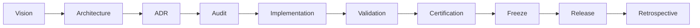

# ES-091 — ORION Enterprise Development Standards

**Document ID:** ES-091  
**Mission:** P-013.3 — ORION Enterprise Development Standards  
**Version:** 1.0  
**Status:** Ratified — Governing Engineering Standard  
**Classification:** Engineering Specification · Governance  
**Authority:** Chief Enterprise Architect  
**Effective Date:** August 2026  
**Architecture Baseline:** v1.0 Candidate  

**Parent:** [ORION Enterprise Architecture Handbook v1.0](./ORION_Enterprise_Architecture_Handbook_v1.0.md)  
**Related:** [G-001 Enterprise Architecture Governance Charter](../11_Governance/Governance/G-001-Enterprise-Architecture-Governance-Charter.md) · [ES-090 Next.js Enterprise Standards](./ES-090-ORION-NextJS-Enterprise-Standards.md) · [Engineering Standards](../09_Standards/Engineering_Standards.md) · [OS-001 Naming Standards](../09_Standards/OS-001-Naming-Standards.md) · [ADR-004 Technical Debt Governance](../11_Governance/ADR/ADR-004-Technical-Debt-Governance.md)

---

## Executive Summary

This specification defines the **official ORION Enterprise Development Standards** — the mandatory engineering rules that govern all software development across the ORION Platform.

These standards apply equally to:

- **Human developers**
- **AI assistants** (Cursor, automation agents, CI bots)
- **Automation** (pipelines, codemods, release tooling)
- **Future contributors** (partners, contractors, acquired teams)

ES-091 is the **operational development constitution**. It does not replace [G-001](../11_Governance/Governance/G-001-Enterprise-Architecture-Governance-Charter.md) or the [ORION Canon](../00_FOUNDATION/ORION_CANON_v1.md). It **implements** them as day-to-day engineering rules. Where ES-091 specifies framework detail, [ES-090](./ES-090-ORION-NextJS-Enterprise-Standards.md) is authoritative for Next.js.

**Hierarchy of authority:**

```
ORION Canon  →  G-001 Charter  →  Architecture Handbook  →  ES-091 (this document)  →  Domain ES-xxx
```

---

## 1. Engineering Philosophy

ORION engineering is governed by five foundational values. Every decision — human or AI — shall be evaluated against them.

| # | Value | Rule |
|---|-------|------|
| 1 | **Quality over quantity** | Ship fewer, certified capabilities rather than many untested features. Feature count is not a success metric. |
| 2 | **Architecture before implementation** | Gates 1–4 of G-001 complete before code. No "prototype in production." |
| 3 | **Evidence before decisions** | Claims require proof: tests, benchmarks, certification reports, ADRs — not opinion or model confidence. |
| 4 | **Maintainability before optimization** | Readable, layered, documented code beats premature performance tuning. Optimize only with measured need. |
| 5 | **Explainability** | Business outcomes must be traceable. No black-box domain logic. |

### 1.1 Supporting Principles

From the [Enterprise Architecture Handbook](./ORION_Enterprise_Architecture_Handbook_v1.0.md#engineering-principles-summary):

- **Single public facade** per domain
- **Organization isolation** on every operation
- **Event-driven integration** across domains (IIL)
- **Rules in engines** — not in routes or UI
- **Certification before release**
- **Documentation is deliverable**
- **Technical debt is governed**

### 1.2 Anti-Patterns (Prohibited)

| Anti-Pattern | Why Forbidden |
|--------------|---------------|
| Business logic in React components or API routes | Untestable; violates layering |
| Cross-domain repository imports | Breaks bounded context isolation |
| Undocumented public API changes | Breaks consumer contracts |
| Silent technical debt | Invisible risk; blocks release planning |
| Skipping validation gates | Unverified code must not merge |
| AI-generated code without review | No accountability; architecture drift |

---

## 2. Development Lifecycle

Every domain initiative, platform module, and major feature follows the same lifecycle. No stage may be skipped without documented exception per [G-001 §3.2](../11_Governance/Governance/G-001-Enterprise-Architecture-Governance-Charter.md#32-exceptions).



| Phase | Deliverable | Authority | Gate |
|-------|-------------|-----------|------|
| **Vision** | Product mission, scope boundary, success criteria | Product / Domain Lead | — |
| **Architecture** | Blueprint (D-xxx), domain model, integration map | Chief Enterprise Architect | Gate 1–2 |
| **ADR** | Architecture Decision Record for material choices | Chief Architect | As required |
| **Audit** | Architecture review checklist completed | Architecture Review Board | Gate 3–4 |
| **Implementation** | Code, tests, wiring, inline docs | Engineering Lead | Gate 5 |
| **Validation** | typecheck · lint · test · build | CI / Engineer | Pre-merge |
| **Certification** | Independent GO / CONDITIONAL GO / NO-GO | Certification Authority | Gate 6 |
| **Freeze** | Architecture baseline tag, feature freeze | Chief Architect | Pre-RC |
| **Release** | Semantic version tag, release notes, RR-xxx | Founder / Chief Architect | Gate 7 |
| **Retrospective** | Debt register update, lessons learned | Domain Lead | Post-release |

### 2.1 Lifecycle Rules

1. **No implementation before Gate 4** — Engineering Specification (ES-xxx) approved.
2. **No release before Gate 6** — Certification report with explicit decision.
3. **No production tag before Gate 7** — Founder or Chief Architect approval.
4. **Every sprint ends with traceable artifacts** — commit, docs update, debt register review.
5. **Retrospective is mandatory** — Update technical debt, capture ADR candidates.

### 2.2 Mission Identification

All work is traceable by mission ID:

| Prefix | Meaning | Example |
|--------|---------|---------|
| `P-xxx.x` | Platform / cross-cutting mission | P-013.3 Development Standards |
| `S-xxx.x` | Domain sprint / epic | S-002.7 HCM API Rationalization |
| `G-xxx` | Governance document | G-001 Charter |
| `ES-xxx` | Engineering specification | ES-HCM-001 |
| `D-xxx` | Domain blueprint | D-HCM-001 |

Reference mission IDs in commits, PR descriptions, certification reports, and release notes.

---

## 3. Coding Standards

Coding standards ensure consistency across human and AI contributors. Domain-specific detail defers to [OS-001](../09_Standards/OS-001-Naming-Standards.md) and [ES-090 §3–§6](./ES-090-ORION-NextJS-Enterprise-Standards.md).

### 3.1 Naming

| Element | Convention | Example |
|---------|------------|---------|
| React components | PascalCase files and exports | `EmployeeList.tsx` |
| Utility / platform modules | kebab-case files | `date-utils.ts`, `response-envelope.ts` |
| Types / interfaces | PascalCase | `ServiceContext`, `EmployeeRecord` |
| Functions / variables | camelCase | `listEmployees`, `organizationId` |
| Constants | SCREAMING_SNAKE_CASE | `MAX_PAGE_SIZE` |
| Domain packages | lowercase single word | `lib/hcm/`, `lib/finance/` |
| Test files | mirror source + `.test.ts` | `HcmFacade.test.ts` |

**Rules:**

- Use domain ubiquitous language — not generic names (`data`, `item`, `handler`).
- Avoid abbreviations unless industry-standard (HCM, API, ADR, IIL).
- Public facade exports use stable names — breaking renames require ADR.

### 3.2 Folder Structure

```
lib/<domain>/
├── index.ts              # Public facade — ONLY external import point
├── wiring.ts             # Dependency injection / composition root
├── facade/               # Facade implementation
├── services/             # Business services
├── repositories/         # Repository interfaces + implementations
├── rules/                # Rules engines (status transitions, validation)
├── api/                  # REST helpers (envelopes, query parsing)
├── types/                # Domain-internal types (if not in types/)
└── events/               # Event publishers / handlers

app/api/<domain>/         # Thin HTTP mapping only
components/<domain>/      # Presentation only — no business rules
tests/lib/<domain>/       # Mirror lib/ structure
docs/<Domain>/Engineering/ # ES-xxx, catalogues, guides
```

New domains **shall** adopt this structure from first commit. See [ES-090 §2](./ES-090-ORION-NextJS-Enterprise-Standards.md#2-folder-structure) for Next.js app layout.

### 3.3 Imports

| Rule | Detail |
|------|--------|
| **Path aliases** | Use `@/` for project imports — no deep relative paths (`../../../`) |
| **Public facade only** | External code imports `@/lib/<domain>` — never internal service/repository paths |
| **No cross-domain internals** | Domain A imports Domain B facade only |
| **Type-only imports** | Use `import type { … }` where applicable |
| **Barrel discipline** | `index.ts` exports curated public API — not wildcard re-exports of internals |
| **Side-effect free** | Modules shall not execute business logic at import time |

### 3.4 Formatting

- **TypeScript strict mode** — enabled project-wide; no `@ts-ignore` without ADR exception.
- **Prettier / ESLint** — project config is authoritative; run `npm run lint` before commit.
- **Line length** — prefer readability; break long signatures and chains.
- **Trailing commas** — follow ESLint config for cleaner diffs.
- **Semicolons** — follow project ESLint rules consistently.

### 3.5 Comments

Comments explain **why**, not **what**.

| Use Comments For | Do Not Comment |
|------------------|----------------|
| Non-obvious business rules | Self-evident code |
| Workarounds with TD-xxx reference | Every function |
| Security or tenancy invariants | Generated boilerplate |
| Algorithm rationale | Restating type signatures |

```typescript
// TD-HCM-001: In-memory store — replace before GA (target v1.1)
```

### 3.6 Documentation (Inline)

Every public facade method and exported type shall have:

- **Purpose** — one-line summary
- **Parameters** — `@param` with business meaning
- **Returns** — `@returns` with shape reference
- **Throws** — domain errors the caller must handle
- **Scope** — organization isolation requirements where non-obvious

Domain catalogues (API, Event) are maintained in `docs/<Domain>/Engineering/` — not duplicated in code comments.

---

## 4. Architecture Rules

Architecture rules are **non-negotiable** unless changed via ADR and baseline update. Full detail: [Architecture Handbook Ch. 3–7](./ORION_Enterprise_Architecture_Handbook_v1.0.md).

### 4.1 Layering

Standard call chain:

```
REST API route  →  Domain Facade  →  Business Service  →  Repository  →  Store
```

| Layer | Responsibility | May Not |
|-------|----------------|---------|
| **API route** | HTTP mapping, auth context, envelope | Contain business rules |
| **Facade** | Orchestration, public contract | Access store directly |
| **Service** | Business logic, rules engine invocation | Import another domain's repository |
| **Repository** | Persistence, queries, org scoping | Contain UI or HTTP concerns |
| **Store** | Data access (memory, DB, external API) | Enforce business rules |

**Invariant:** No layer may skip adjacent layers downward.

### 4.2 Repository Pattern

- Define repository **interfaces** in domain package.
- Implementations live in `repositories/` — swappable for tests and production stores.
- All queries scoped by `organizationId` from `ServiceContext`.
- API routes **never** import repositories — facade only.

### 4.3 Rules Engine

- Status transitions, validation chains, and eligibility logic live in **rules engines** under `lib/<domain>/rules/`.
- Services invoke rules engines — routes and components do not.
- Rules must be **deterministic**: same input → same output.
- Rule changes require tests and, if behavior is contract-visible, ADR.

### 4.4 Facade

- One **public entry point** per domain: `lib/<domain>/index.ts`.
- External consumers (API routes, other domains, tests) import facade only.
- Facade methods map to use cases — not CRUD mirrors of repositories.
- Reference: [HCM Facade pattern](../HCM/Engineering/HCM-Architecture-Guide.md).

### 4.5 Dependency Injection

- Services receive dependencies via **constructor injection**.
- Composition root in `wiring.ts` — not scattered `new` calls.
- Tests inject mocks/stubs without global state.
- No service locators or hidden singletons for domain logic.

### 4.6 Organization Isolation

Every mutating and querying operation shall:

1. Accept `ServiceContext` with validated `organizationId`
2. Enforce scope at repository layer minimum
3. Never trust client-supplied org IDs without session verification
4. Reject cross-tenant access with domain-appropriate error (403/404)

Reference: `@/lib/decisions` helpers and middleware session resolution per ES-090.

---

## 5. Engineering Practices

### 5.1 Small Commits

- One logical change per commit.
- Commit frequently during implementation — not one giant end-of-sprint dump.
- Each commit should pass typecheck (ideal) and never break the build on main/release branches.

### 5.2 Atomic Changes

- A PR addresses **one mission scope** or tightly related fix set.
- Do not mix refactoring, features, and unrelated fixes in one PR.
- Documentation updates for the same mission may ship in the same PR.

### 5.3 Peer Review

- All code changes require **at least one reviewer** before merge.
- Reviewer verifies: layering, org isolation, tests, docs, debt registration.
- AI-authored PRs require **human review** — no auto-merge without approval.

### 5.4 Architecture Review

Required when:

- New domain or platform module
- Public facade or REST contract change
- Cross-domain integration pattern
- Store/persistence technology change
- Security model change

Use [G-001 Architecture Review Checklist](../11_Governance/Governance/G-001-Architecture-Review-Checklist.md).

### 5.5 Technical Debt Management

- Register debt before merge if compromise is intentional.
- Reference `TD-xxx` in code and PR description.
- Every debt item requires **owner** and **target release**.
- P0 debt blocks GA release per ADR-004.

---

## 6. Git Standards

### 6.1 Branch Naming

| Pattern | Purpose | Example |
|---------|---------|---------|
| `main` | Integration trunk | — |
| `feature/<mission>-<short-desc>` | Feature / mission work | `feature/s002-7-hcm-api` |
| `fix/<ticket-or-desc>` | Bug fix | `fix/hcm-pagination-envelope` |
| `release/v<semver>` | Release stabilization | `release/v1.0.0-rc1` |
| `hotfix/v<semver>-<desc>` | Production emergency | `hotfix/v1.0.1-auth-session` |
| `docs/<mission>-<desc>` | Documentation-only | `docs/p013-3-dev-standards` |

**Rules:**

- Lowercase, hyphen-separated descriptors.
- Include mission ID when applicable.
- Release branches are created from certified commit — not from unvalidated feature branches.

### 6.2 Commit Messages

Follow [Conventional Commits](https://www.conventionalcommits.org/) adapted for ORION:

```
<type>(<scope>): <subject>

[optional body]

[optional footer: mission, TD-xxx, BREAKING CHANGE]
```

| Type | Use |
|------|-----|
| `feat` | New capability |
| `fix` | Bug fix |
| `refactor` | Code change without behavior change |
| `docs` | Documentation only |
| `test` | Test additions or fixes |
| `chore` | Tooling, deps, CI |
| `release` | Release freeze / version bump |

**Examples:**

```
feat(hcm): add paginated employee list API (S-002.7)

docs(governance): ratify ES-091 development standards (P-013.3)

release(hcm): freeze Enterprise HCM v1.0 RC1
```

**Rules:**

- Subject line ≤ 72 characters.
- Imperative mood ("add" not "added").
- Reference mission ID in body or footer.
- One logical change per commit.

### 6.3 Release Branches

1. Certification complete (Gate 6) with GO or CONDITIONAL GO.
2. Create `release/v<semver>` from certified commit.
3. Feature freeze — only P0/P1 fixes allowed on release branch.
4. All four validation gates pass on release branch before tag.

```bash
git checkout -b release/v1.0.0-rc1
# stabilization fixes only
git tag -a v1.0.0-rc1 -m "Enterprise HCM Release Candidate 1"
git push origin release/v1.0.0-rc1
git push origin v1.0.0-rc1
```

### 6.4 Tagging

| Stage | Tag Pattern | Example |
|-------|-------------|---------|
| Alpha | `v<major>.<minor>.<patch>-alpha` | `v1.0.0-alpha` |
| Beta | `v<major>.<minor>.<patch>-beta` | `v1.0.0-beta` |
| RC | `v<major>.<minor>.<patch>-rc<n>` | `v1.0.0-rc1` |
| GA | `v<major>.<minor>.<patch>` | `v1.0.0` |
| LTS | `v<major>.<minor>.<patch>-lts` | `v1.0.0-lts` |

Tags are **annotated** (`-a`) with release summary. Tags are immutable — never force-move release tags.

### 6.5 Versioning

- **Semantic Versioning** (SemVer) for all ORION releases.
- **Major** — breaking public API or architecture baseline change (requires ADR + migration guide).
- **Minor** — additive features within approved ES scope.
- **Patch** — bug fixes, security patches, documentation corrections that do not change contracts.

Pre-1.0 versions may use `0.x.y` with explicit instability per [G-001 Release Guide](../11_Governance/Governance/G-001-Release-Governance-Guide.md).

---

## 7. Testing Standards

Testing proves correctness. Untested code is unverified code.

### 7.1 Unit Tests

| Target | Location | Requirement |
|--------|----------|-------------|
| Services | `tests/lib/<domain>/services/` | All business rules |
| Rules engines | `tests/lib/<domain>/rules/` | All transitions and edge cases |
| Facade | `tests/lib/<domain>/` | Public contract methods |
| Utilities | `tests/lib/` | Pure functions |

- Use **Vitest** — project standard.
- Mock repositories — never hit real stores in unit tests unless explicitly integration.
- Tests must be **deterministic** — no time/random without injection.

### 7.2 Integration Tests

- Test facade + wiring + in-memory store together.
- Verify organization isolation across operations.
- Location: `tests/lib/<domain>/*Integration.test.ts`

### 7.3 API Tests

- Route handlers tested with mocked facade or context.
- Verify HTTP status codes, envelope shape `{ success, data }` / `{ success: false, error }`.
- Verify auth and org context propagation.
- Reference: [HCM API Integration tests](../../tests/lib/hcm/HcmApiIntegration.test.ts)

### 7.4 Architecture Tests

- Documentation certification tests enforce ES/catalogue presence.
- Import boundary tests (where implemented) verify facade-only external access.
- Layer violation = test failure or architecture review block.

### 7.5 Certification Tests

Certification suites validate release readiness:

```bash
npm run typecheck   # TypeScript — zero errors
npm run lint        # ESLint — zero errors (warnings tracked)
npm test            # Full Vitest suite
npm run build       # Next.js production build
```

Domain-specific certification tests live under `tests/lib/<domain>/` and `tests/docs/`.

### 7.6 Coverage Expectations

| Layer | Minimum Target | Notes |
|-------|----------------|-------|
| Services | 80% line coverage | Business logic priority |
| Rules engines | 90% branch coverage | Transition completeness |
| Facade | 70% line coverage | Public contract |
| API routes | Route-per-endpoint test | Envelope + error paths |
| UI components | Best effort | Focus on critical paths |

Coverage is a **floor**, not a ceiling. Missing tests on business rules block certification.

---

## 8. Documentation Standards

Documentation is a **first-class deliverable**. Code without docs is incomplete.

### 8.1 Engineering Specifications (ES-xxx)

Required for every domain and platform module:

| Section | Content |
|---------|---------|
| Scope | In/out of bounds |
| Architecture | Layer diagram, facade contract |
| Data model | Entities, relationships |
| API catalogue | REST endpoints (or reference) |
| Event catalogue | IIL events published/consumed |
| NFRs | Performance, security, tenancy |
| Certification criteria | GO/NO-GO checklist |

Template reference: [ES-HCM-001](../HCM/Engineering/ES-HCM-001_Enterprise_HCM_Engineering_Specification.md).

### 8.2 Architecture Guides

- Domain architecture guide in `docs/<Domain>/Engineering/`.
- Explains layering, wiring, extension points.
- Updated when facade or integration patterns change.

### 8.3 Developer Guides

- Onboarding path: package guide → developer guide → API catalogue.
- Include local setup, test commands, common patterns.
- AI-assist section: what agents may and may not modify.

### 8.4 Release Notes

- Per release stage (alpha, beta, RC, GA).
- Sections: Features, Fixes, Known Limitations, Breaking Changes, Debt Remediation.
- Reference mission IDs and TD-xxx items resolved.

### 8.5 ADR Requirements

Architecture Decision Records required when:

- Choosing persistence technology
- Changing public facade or REST contract
- Introducing cross-domain integration pattern
- Accepting P0/P1 technical debt
- Upgrading major framework versions (Next.js, React)

Format: [ES-052 ADR Framework](../02_Engineering/ES-052-Architecture-Decision-Record-Framework.md). Store under `docs/11_Governance/ADR/`.

---

## 9. AI Development Standards

AI assistants are first-class contributors — subject to the **same rules** as human engineers.

### 9.1 Prompt Quality

Effective AI development requires:

| Requirement | Detail |
|-------------|--------|
| **Mission ID** | Every AI task references P-xxx / S-xxx |
| **Scope boundary** | Explicit in/out of scope |
| **Architecture context** | Point to ES-xxx, facade, layering rules |
| **Evidence requirement** | Run validation gates; report results |
| **No production code unless requested** | Documentation missions stay docs-only |

Poor prompts produce non-compliant code. Engineers shall treat prompt authoring as specification work.

### 9.2 Architecture Verification

Before AI-generated code merges:

- [ ] Imports only public facade externally
- [ ] Business logic in services/rules — not routes/components
- [ ] Organization scoping enforced
- [ ] Standard API envelope used
- [ ] Tests added for new behavior
- [ ] Documentation updated if public contract changed

Consult [AGENTS.md](../../AGENTS.md) and [ES-090](./ES-090-ORION-NextJS-Enterprise-Standards.md) before implementing Next.js features.

### 9.3 Evidence-First Development

AI assistants shall:

1. **Read** relevant ES, handbook, and existing code before writing.
2. **Run** typecheck, lint, test, build — report pass/fail counts.
3. **Cite** file paths and line references in review summaries.
4. **Not claim** success without command output evidence.

### 9.4 Review Before Merge

- AI-authored changes require **human review** — always.
- Reviewer checks architecture compliance, not just syntax.
- Large AI diffs shall be split into reviewable PRs per §5.2.

### 9.5 Human Approval for Architectural Changes

AI assistants **must not** merge without human approval when change involves:

- Public facade signature changes
- New domain package structure
- REST contract changes
- Security or auth model changes
- Persistence layer changes
- Dependency major version upgrades
- Governance document ratification

---

## 10. Quality Gates

Quality gates are **automated and manual checkpoints**. All must pass before merge to `main` or any release branch.

### 10.1 Automated Gates (Mandatory)

```bash
npm run typecheck   # Gate 1 — TypeScript strict, zero errors
npm run lint        # Gate 2 — ESLint, zero errors
npm test            # Gate 3 — Vitest, zero failures
npm run build       # Gate 4 — Next.js production build
```

| Gate | Block Merge If | Owner |
|------|----------------|-------|
| **Typecheck** | Any TS error | Engineer / CI |
| **Lint** | Any ESLint error | Engineer / CI |
| **Tests** | Any test failure | Engineer / CI |
| **Build** | Build failure or missing routes | Engineer / CI |

Warnings are tracked but do not block unless escalated to error by team decision.

### 10.2 Manual Gates (Mandatory for Release)

| Gate | When | Authority |
|------|------|-----------|
| **Architecture review** | Gate 4 ES, major PR | Chief Enterprise Architect |
| **Security review** | Auth, tenancy, external integration | Security Architect |
| **Documentation review** | Gate 6 certification | Domain Lead |
| **Certification** | Pre-release | Chief Architect |
| **Release approval** | Pre-tag | Founder / Chief Architect |

### 10.3 Certification Gate

Independent certification produces one of:

| Decision | Meaning | Release Action |
|----------|---------|----------------|
| **GO** | Approved for release at declared scope | Proceed to tag |
| **CONDITIONAL GO** | Approved with numbered remediation before production | RC allowed; GA blocked until remediated |
| **NO-GO** | Blocking defects | No tag; return to implementation |

Example: Enterprise HCM v1.0 RC1 — **CONDITIONAL GO** pending TD-HCM-001 (persistent store) and TD-HCM-005 (permissions).

---

## 11. Technical Debt

Technical debt is **managed, visible, and governed** — never silent.

Authority: [ADR-004](../11_Governance/ADR/ADR-004-Technical-Debt-Governance.md) · [Technical Debt Register](../11_Governance/TECHNICAL_DEBT.md)

### 11.1 Classification

| Priority | Definition | Release Impact |
|----------|------------|----------------|
| **P0 — Blocker** | Prevents production deployment or violates security/tenancy | Blocks GA; must have remediation plan for RC |
| **P1 — High** | Significant functional gap or operational risk | Blocks GA; may allow RC with CONDITIONAL GO |
| **P2 — Medium** | Known limitation with workaround | Documented in release notes |
| **P3 — Low** | Cosmetic, minor refactor, nice-to-have | Tracked; no release block |

### 11.2 Tracking

Every debt item records:

| Field | Required |
|-------|----------|
| ID | `TD-<DOM>-nnn` (e.g. TD-HCM-001) |
| Title | Short description |
| Priority | P0–P3 |
| Owner | Named engineer or lead |
| Target Release | Semver when debt will be resolved |
| Status | Open · In Progress · Resolved · Accepted |
| References | Code locations, PRs, missions |

Canonical register: [docs/11_Governance/TECHNICAL_DEBT.md](../11_Governance/TECHNICAL_DEBT.md). Domain registers (e.g. [HCM](../HCM/Engineering/HCM-Technical-Debt-Register.md)) extend the canonical register.

Inline code reference:

```typescript
// TD-HCM-001: In-memory store — production requires persistent repository
```

### 11.3 Approval

- **P0/P1 debt creation** requires Engineering Lead acknowledgment in PR.
- **Accepted debt** (will not fix) requires ADR + Chief Architect approval.
- **CTO/Founder release blocked** if any P0 item lacks owner and target release.

### 11.4 Remediation

1. Debt item assigned to mission in target release.
2. Remediation PR references `TD-xxx` and closes or updates register entry.
3. Certification re-run after P0/P1 resolution before GA promotion.
4. Retrospective confirms register accuracy.

---

## 12. Release Governance

Release governance ensures only **certified, documented** software reaches production.

Full detail: [G-001 Release Governance Guide](../11_Governance/Governance/G-001-Release-Governance-Guide.md)

### 12.1 Release Candidates

| Rule | Detail |
|------|--------|
| Entry | Beta exit criteria met; feature freeze declared |
| Scope | P0 fixes only — no new features |
| Tag | `v<semver>-rc<n>` annotated tag |
| Validation | Full four automated gates + certification report |
| Exit | Two consecutive RC cycles with zero P0/P1 regressions |

### 12.2 Production (GA)

| Rule | Detail |
|------|--------|
| Entry | RC exit criteria; Gate 7 approval; zero open P0 debt |
| Tag | `v<major>.<minor>.<patch>` — semver commitment begins |
| Artifacts | Release record (RR-xxx), GA release notes, changelog |
| Rollback | Previous GA tag deployable; rollback plan documented |

### 12.3 Hotfixes

Emergency production fixes:

1. Branch from GA tag: `hotfix/v<semver>-<desc>`
2. Minimal scope — correctness or security only
3. Gates 1–4 pass on hotfix branch
4. Patch version bump: `v1.0.0` → `v1.0.1`
5. Post-incident: ADR or debt entry within 5 business days if architectural gap exposed

Hotfixes may bypass Gates 1–4 of **new feature** governance — not validation gates.

### 12.4 Patch Releases

- **Patch** (`z` bump): bug fixes, security patches — no new features.
- **Minor** (`y` bump): additive features within approved ES — no breaking changes.
- **Major** (`x` bump): breaking changes — ADR, migration guide, architecture baseline update.

---

## Output — Development Standard Summary

ES-091 establishes the **ORION Enterprise Development Standard**:

| Pillar | Standard |
|--------|----------|
| Philosophy | Quality, architecture, evidence, maintainability, explainability |
| Lifecycle | Vision → Architecture → ADR → Audit → Implementation → Validation → Certification → Freeze → Release → Retrospective |
| Code | OS-001 naming, layered folders, facade imports, strict TypeScript |
| Architecture | API → Facade → Service → Repository → Store; DI; rules engines; org isolation |
| Practice | Small atomic commits, peer review, architecture review, governed debt |
| Git | Conventional commits, mission branches, annotated semver tags |
| Testing | Unit, integration, API, architecture, certification — with coverage floors |
| Documentation | ES-xxx, guides, release notes, ADRs — ship with code |
| AI | Same rules as humans; evidence-first; human approval for architecture |
| Quality | Four automated gates + manual certification and release approval |
| Debt | Classified, tracked, owned, remediated — P0 blocks GA |
| Release | Alpha → Beta → RC → GA → LTS with explicit entry/exit criteria |

---

## Output — Engineering Rules (Quick Reference)

**Must always:**

1. Complete G-001 Gates 1–4 before implementation.
2. Import domain code via public facade only.
3. Scope every operation by `organizationId`.
4. Put business rules in services and rules engines.
5. Use standard REST API envelopes.
6. Write tests for business logic.
7. Register intentional debt with TD-xxx, owner, and target release.
8. Pass all four automated gates before merge.
9. Obtain certification before release tag.
10. Update documentation when public contracts change.

**Must never:**

1. Put business logic in React components or API routes.
2. Import another domain's repositories or internal services.
3. Skip validation gates or certification.
4. Merge AI code without human review.
5. Release with unowned P0 technical debt.
6. Force-push release tags.
7. Change public API without ADR.

---

## Output — Quality Gates

```bash
# Pre-merge (every PR)
npm run typecheck && npm run lint && npm test && npm run build

# Pre-release (certification)
npm run typecheck && npm run lint && npm test && npm run build
# + architecture review + documentation review + certification report
```

| Stage | Automated | Manual |
|-------|-----------|--------|
| PR merge | 4 gates | Code review |
| RC tag | 4 gates | Certification ≥ CONDITIONAL GO |
| GA tag | 4 gates | Gate 7 approval · P0 debt = 0 |
| Hotfix | 4 gates | Incident post-mortem if architectural |

---

## Output — Governance Summary

| Document | Role |
|----------|------|
| [ORION Canon](../00_FOUNDATION/ORION_CANON_v1.md) | Supreme authority |
| [G-001 Charter](../11_Governance/Governance/G-001-Enterprise-Architecture-Governance-Charter.md) | Constitutional governance |
| [Architecture Handbook](./ORION_Enterprise_Architecture_Handbook_v1.0.md) | Enterprise architecture patterns |
| **ES-091 (this document)** | **Development standards — daily engineering rules** |
| [ES-090](./ES-090-ORION-NextJS-Enterprise-Standards.md) | Next.js / App Router implementation detail |
| Domain ES-xxx | Domain-specific contracts and catalogues |

**Applicability:** All ORION engineers, AI assistants, automation, and future contributors — effective immediately upon ratification.

**Compliance verification:** Mission certification tests, CI pipelines, architecture review checklists, and release certification reports.

---

## Certification — ES-091 Ratification

Self-assessment for Mission P-013.3:

| Criterion | Result |
|-----------|--------|
| All 12 required sections documented | ✅ Pass |
| Aligned with G-001, Handbook, ES-090 | ✅ Pass |
| AI development standards included | ✅ Pass |
| Quality gates defined with commands | ✅ Pass |
| Technical debt governance cross-referenced | ✅ Pass |
| Release governance aligned with G-001 | ✅ Pass |
| Enterprise readability and future-proof structure | ✅ Pass |
| No production code changes (docs-only mission) | ✅ Pass |

### Decision: **GO**

ES-091 is **ratified** as the official ORION Enterprise Development Standards document, effective August 2026.

---

## Appendix A — Cross-Reference Index

| Topic | Document |
|-------|----------|
| Governance gates | [G-001 Charter](../11_Governance/Governance/G-001-Enterprise-Architecture-Governance-Charter.md) |
| Certification process | [G-001 Certification](../11_Governance/Governance/G-001-Certification-Process.md) |
| Release lifecycle | [G-001 Release Guide](../11_Governance/Governance/G-001-Release-Governance-Guide.md) |
| Architecture patterns | [Architecture Handbook](./ORION_Enterprise_Architecture_Handbook_v1.0.md) |
| Next.js implementation | [ES-090](./ES-090-ORION-NextJS-Enterprise-Standards.md) |
| Naming | [OS-001](../09_Standards/OS-001-Naming-Standards.md) |
| Technical debt | [ADR-004](../11_Governance/ADR/ADR-004-Technical-Debt-Governance.md) · [Register](../11_Governance/TECHNICAL_DEBT.md) |
| ADR format | [ES-052](../02_Engineering/ES-052-Architecture-Decision-Record-Framework.md) |
| AI agent rules | [AGENTS.md](../../AGENTS.md) |
| HCM reference implementation | [ES-HCM-001](../HCM/Engineering/ES-HCM-001_Enterprise_HCM_Engineering_Specification.md) |

---

## Appendix B — New Contributor Checklist

- [ ] Read G-001 Charter (gates and principles)
- [ ] Read Architecture Handbook (layering and lifecycle)
- [ ] Read ES-091 (this document)
- [ ] Read ES-090 (Next.js patterns)
- [ ] Read domain ES-xxx for assigned domain
- [ ] Run `npm run typecheck && npm run lint && npm test && npm run build`
- [ ] Locate Technical Debt Register before accepting compromises

---

*ORION Enterprise Platform · ES-091 · Enterprise Development Standards v1.0 · Mission P-013.3*
