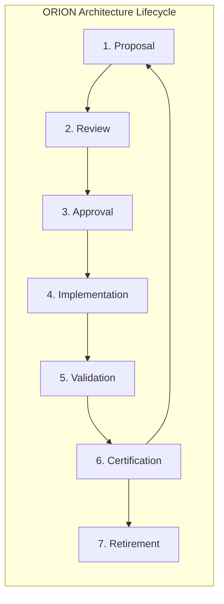

# ES-092 — Enterprise Architecture Lifecycle Standard

**Document ID:** ES-092  
**Mission:** P-016.4 — ORION v2.0 Governance Framework Completion  
**Program:** P-016 — ORION Enterprise Platform v2.0  
**Version:** 1.0  
**Status:** Ratified — Governing Engineering Standard  
**Classification:** Enterprise Architecture · Governance · Lifecycle  
**Authority:** Chief Enterprise Architect  
**Effective Date:** 2 August 2026  
**Architecture Baseline:** v1.0 GA Candidate → v2.0 Multi-Domain Baseline

**Parent:** [ORION Enterprise Architecture Handbook v1.0](./ORION_Enterprise_Architecture_Handbook_v1.0.md)  
**Related:** [G-001 Enterprise Architecture Governance Charter](../11_Governance/Governance/G-001-Enterprise-Architecture-Governance-Charter.md) · [ES-097 ADR Policy](./ES-097-ORION-Architecture-Governance-ADR-Policy.md) · [ES-094 Architecture Compliance](./ES-094-Enterprise-Architecture-Compliance-Standard.md) · [ES-096 Testing & Certification](./ES-096-ORION-Enterprise-Testing-Certification-Standards.md) · [P-016.2 Architecture Charter](./P-016.2-ORION-v2-Architecture-Charter.md)

**Remediates:** [TD-PLATFORM-004](../11_Governance/TECHNICAL_DEBT.md) (partial — lifecycle standard component)

---

## Executive Summary

This specification defines the **official ORION Enterprise Architecture Lifecycle** — the mandatory end-to-end process for proposing, reviewing, approving, implementing, validating, certifying, and retiring architectural assets across the ORION Enterprise Platform.

ES-092 operationalizes [G-001 Gate 1–7](../11_Governance/Governance/G-001-Enterprise-Architecture-Governance-Charter.md) as a repeatable lifecycle applicable to domains, platform services, ADRs, and cross-cutting capabilities.

**Hierarchy of authority:**

```
ORION Canon → G-001 Charter → Architecture Handbook → ES-092 (this document) → Domain Blueprints / ES-xxx
```

---

## 1. Purpose and Scope

### 1.1 Purpose

Every architectural change — whether a new Finance domain, durable IIL transport, or facade extension — shall follow the same lifecycle. ES-092 prevents ad-hoc architecture, scope creep, and ungoverned implementation.

### 1.2 Applicability

| Asset Type | Lifecycle Applies |
|------------|-------------------|
| Business domains (Finance, CRM, HCM, Hospitality, Operations) | Yes |
| Platform services (IIL, Workflow, PlatformStore, RBAC) | Yes |
| Architecture Decision Records (ADR-xxx) | Yes — ADR lifecycle per ES-097 |
| Engineering specifications (ES-xxx) | Yes |
| Major facade or event catalogue changes | Yes |
| Emergency production fixes | Partial — see §8 Retirement / Exceptions via ES-094 |

### 1.3 Roles

| Role | Lifecycle Responsibility |
|------|-------------------------|
| **Author / Domain Lead** | Proposes architecture · owns deliverables |
| **Chief Enterprise Architect** | Gate 1–4 approval · ARB chair |
| **Chief Architect** | Gate 4–6 technical approval |
| **Architecture Review Board** | Cross-domain review · ADR approval |
| **Engineering Lead** | Gate 5 implementation oversight |
| **Certification Lead** | Gate 6 independent evaluation |
| **Founder** | Gate 7 release approval |

---

## 2. Architecture Lifecycle Overview



| Phase | G-001 Gate Alignment | Primary Output |
|-------|---------------------|----------------|
| **Proposal** | Pre-Gate 1 | Vision · scope · problem statement |
| **Review** | Gates 1–3 | Blueprint · domain model · governance rules |
| **Approval** | Gate 4 | Engineering specification · accepted ADRs |
| **Implementation** | Gate 5 | Code · tests · documentation |
| **Validation** | Gate 5 exit | Four validation gates green |
| **Certification** | Gate 6 | GO / CONDITIONAL GO / NO-GO report |
| **Retirement** | Post-LTS | Supersession · archive · ADR status update |

**Hard rule (v2.0):** No Gate 5 implementation until Gates 1–4 complete and required ADRs **Accepted** per [P-016.2 Charter](./P-016.2-ORION-v2-Architecture-Charter.md).

---

## 3. Phase 1 — Proposal

### 3.1 Purpose

Establish the architectural intent, business justification, and scope boundary before design investment.

### 3.2 Entry Criteria

| Criterion | Required |
|-----------|----------|
| Mission ID assigned (P-xxx.x or ADR-xxx) | Yes |
| Product or platform need documented | Yes |
| Dependencies identified | Yes |
| Charter / roadmap alignment stated | Yes |

### 3.3 Deliverables

| Deliverable | Owner | Storage |
|-------------|-------|---------|
| Problem statement | Author | Mission doc or ADR Context |
| Scope boundary (in / out) | Domain Lead | Blueprint draft |
| Stakeholder list | Program Director | Mission record |
| Dependency map | Architect | Mission doc |
| Preliminary risk register | Author | Mission doc |

### 3.4 Exit Criteria

- [ ] Scope approved by Domain Lead and Program Director
- [ ] No overlap with existing bounded context without ADR
- [ ] Proposal recorded with mission ID
- [ ] ARB notified for Gate 1 scheduling

---

## 4. Phase 2 — Review

### 4.1 Purpose

Evaluate architectural design against ORION principles before engineering specification and implementation.

### 4.2 Gate Mapping

| Review Stage | G-001 Gate | Deliverable |
|--------------|------------|-------------|
| Blueprint review | **Gate 1** | Business Domain Blueprint (D-xxx) |
| Domain model review | **Gate 2** | Entity model · relationships · aggregates |
| Governance rules review | **Gate 3** | Rules engines · permission matrix draft · event catalogue outline |

### 4.3 Review Checklist (Summary)

Per [G-001 Architecture Review Checklist](../11_Governance/Governance/G-001-Architecture-Review-Checklist.md):

| Principle | Verification |
|-----------|--------------|
| Single public facade | One `lib/<domain>/index.ts` entry |
| Layered architecture | API → Facade → Service → Repository → Store |
| Organization isolation | `ServiceContext.organizationId` on all operations |
| Event-driven integration | IIL only · no cross-domain repository reads |
| Platform consumption | Identity · IIL · Workflow · PlatformStore — not duplicated |
| ADR coverage | Required ADRs Proposed or Accepted |

### 4.4 Review Authority

| Scope | Review Body |
|-------|-------------|
| Single domain | Chief Enterprise Architect + Domain Lead |
| Cross-domain | ARB full quorum |
| Platform-wide | ARB + Platform Engineering Lead |
| Security-sensitive | + Security Architect |

### 4.5 Exit Criteria

- [ ] Gates 1–3 artifacts signed
- [ ] Architecture Review Checklist complete
- [ ] Required ADRs identified (Proposed minimum)
- [ ] No unresolved P0 architecture risks

---

## 5. Phase 3 — Approval

### 5.1 Purpose

Ratify the engineering specification and architectural decisions before any Gate 5 code.

### 5.2 Gate Mapping

| Approval | G-001 Gate | Deliverable |
|----------|------------|-------------|
| Engineering specification | **Gate 4** | ES-xxx complete |
| ADR acceptance | Pre-Gate 5 | Required ADRs **Accepted** |
| Implementation plan | Gate 4 annex | Wave plan · resource estimate |

### 5.3 v2.0 Approval Blockers

Per [P-016.3 ADR Program](./P-016.3-ORION-v2-ADR-Program.md):

| Program | Required Before Gate 5 |
|---------|------------------------|
| Finance (P-009) | ADR-013 · ADR-014 · ADR-015 · ADR-020 **Accepted** |
| CRM (P-008 II) | ADR-013 **Implemented** · ADR-015 · ADR-020 **Accepted** |
| Platform IIL | ADR-013 **Accepted** |
| ES-092–095 | **Ratified** (this program) |

### 5.4 Approval Record

Each Gate 4 approval produces:

| Field | Required |
|-------|----------|
| Mission ID | Yes |
| Approver name and role | Yes |
| Date | Yes |
| ADR references | Yes |
| Verdict | GO / CONDITIONAL GO / NO-GO |
| Conditions (if conditional) | Numbered · owner · target date |

### 5.5 Exit Criteria

- [ ] ES-xxx Gate 4 signed
- [ ] All blocking ADRs **Accepted**
- [ ] ES-094 compliance checkpoint CP-G4 passed
- [ ] Implementation branch identified

---

## 6. Phase 4 — Implementation

### 6.1 Purpose

Build the approved architecture with traceable mission IDs, facade boundaries, and documentation.

### 6.2 Gate Mapping

**Gate 5 — Implementation**

### 6.3 Implementation Rules

| Rule | Source |
|------|--------|
| Import facade only from outside domain | Architecture Handbook |
| Publish IIL events from facade wrapper | P-006 · ADR-013 |
| Permission catalog before REST routes | ADR-009 |
| PlatformStore for authoritative persistence | ADR-007 |
| Reference ADR in commits and PRs | ES-097 |
| No silent technical debt | ADR-004 · ES-093 |

### 6.4 Implementation Phases (Typical Domain)

| Phase | Deliverable |
|-------|-------------|
| I1 | Domain model · repository interfaces |
| I2 | PlatformStore persister · migrations |
| I3 | Facade · services · rules engines |
| I4 | REST APIs · RBAC middleware |
| I5 | IIL event catalogue · workflow triggers |
| I6 | Documentation · certification tests |

### 6.5 Exit Criteria

- [ ] All Gate 4 scope implemented
- [ ] No scope creep without ADR or Gate 4 amendment
- [ ] TECHNICAL_DEBT.md updated for any new debt
- [ ] Ready for validation phase

---

## 7. Phase 5 — Validation

### 7.1 Purpose

Prove implementation correctness through automated and manual evidence before independent certification.

### 7.2 Mandatory Validation Gates

Per [ES-096](./ES-096-ORION-Enterprise-Testing-Certification-Standards.md):

```bash
npm run typecheck
npm run lint
npm test
npm run build
```

| Gate | Blocking | Evidence |
|------|----------|----------|
| Typecheck | Yes | Zero errors |
| Lint | Yes | Zero errors (warnings per ENG-LINT policy) |
| Test | Yes | Full suite pass count recorded |
| Build | Yes | Production build success |

### 7.3 Architecture Validation

| Check | Method |
|-------|--------|
| Facade boundary | Architecture tests · import lint |
| Documentation paths | Doc certification tests |
| Event catalogue | Event schema tests |
| RBAC routes | Permission matrix tests |
| Organization isolation | Repository integration tests |

### 7.4 Exit Criteria

- [ ] Four validation gates green on target branch
- [ ] Full test count recorded (not domain-scoped only)
- [ ] No P0 debt introduced
- [ ] Validation report attached to certification request

---

## 8. Phase 6 — Certification

### 8.1 Purpose

Independent evaluation producing GO / CONDITIONAL GO / NO-GO verdict for release consideration.

### 8.2 Gate Mapping

**Gate 6 — Certification** · **Gate 7 — Release Approval**

### 8.3 Certification Types

| Type | Scope | Reference |
|------|-------|-----------|
| Domain certification | Single bounded context | ES-096 §4 |
| Platform certification | Shared services | P-015.8–P-015.11 |
| Operational certification | Runbooks · DR · health | GA-001 |
| Security certification | RBAC · compliance | P-015.10 |
| Performance certification | Benchmarks · load | P-015.9 |

### 8.4 Verdict Definitions

| Verdict | Meaning | Release |
|---------|---------|---------|
| **GO** | All criteria met · no P0 debt | Eligible for Gate 7 |
| **CONDITIONAL GO** | Material gaps with numbered remediation | Release with documented conditions |
| **NO-GO** | P0 blockers · failed validation · missing ADRs | Blocked |

### 8.5 Gate 7 — Release Approval

| Requirement | Authority |
|-------------|-----------|
| Gate 6 GO or accepted CONDITIONAL GO | Chief Architect |
| Founder sign-off | Founder |
| Semantic tag with certification reference | Release Board |
| RELEASE_HISTORY update | Program Director |

### 8.6 Exit Criteria

- [ ] Certification report published under `docs/00_Governance/` or `docs/06_Releases/`
- [ ] Verdict recorded with evidence
- [ ] Gate 7 complete for GA tags
- [ ] Historical archive updated at major version (P-016.3)

---

## 9. Phase 7 — Retirement

### 9.1 Purpose

Govern the end-of-life, supersession, or deprecation of architectural assets without destroying institutional memory.

### 9.2 Retirement Triggers

| Trigger | Action |
|---------|--------|
| ADR superseded | Update ADR status · link replacement · ES-097 §2.5 |
| Domain feature deprecated | Deprecation ADR · migration guide · semver policy |
| API removed | Breaking change ADR · consumer notification |
| Platform module replaced | Parallel run period · cutover certification |
| LTS branch end | Security-only · archive documentation |

### 9.3 Retirement Process

| Step | Action | Owner |
|------|--------|-------|
| 1 | Retirement proposal with impact analysis | Domain Lead |
| 2 | ADR or DL documenting decision | Author |
| 3 | ARB review | ARB |
| 4 | Migration guide published | Domain Lead |
| 5 | Consumer deadline communicated | Program Director |
| 6 | Code removal or feature flag off | Engineering Lead |
| 7 | Certification of retirement state | Certification Lead |
| 8 | Archive update | Historical record (P-016.3) |

### 9.4 Prohibited Actions

| Action | Rule |
|--------|------|
| Delete superseded ADRs | Forbidden — ES-097 |
| Remove certification reports | Forbidden — permanent record |
| Silent API removal | Forbidden — requires ADR |
| Skip migration guide for breaking changes | Forbidden |

### 9.5 Exit Criteria

- [ ] Supersession documented
- [ ] Consumers migrated or deadline passed
- [ ] TECHNICAL_DEBT.md updated
- [ ] No orphaned references in certification tests

---

## 10. Lifecycle Metrics

| Metric | Target |
|--------|--------|
| Gate 1–4 completion before Gate 5 | 100% of v2.0 programs |
| Average Gate 4 → Gate 6 duration | Tracked per program |
| Certification verdict accuracy (post-release defects) | ≤ 2 P0 per GA release |
| ADR acceptance before implementation | 100% |
| Retirement with migration guide | 100% of breaking changes |

---

## 11. Related Documents

| Document | Location |
|----------|----------|
| G-001 Charter | [G-001-Enterprise-Architecture-Governance-Charter.md](../11_Governance/Governance/G-001-Enterprise-Architecture-Governance-Charter.md) |
| ES-097 ADR Policy | [ES-097-ORION-Architecture-Governance-ADR-Policy.md](./ES-097-ORION-Architecture-Governance-ADR-Policy.md) |
| ES-094 Compliance | [ES-094-Enterprise-Architecture-Compliance-Standard.md](./ES-094-Enterprise-Architecture-Compliance-Standard.md) |
| P-016.2 Charter | [P-016.2-ORION-v2-Architecture-Charter.md](./P-016.2-ORION-v2-Architecture-Charter.md) |
| Architecture Handbook | [ORION_Enterprise_Architecture_Handbook_v1.0.md](./ORION_Enterprise_Architecture_Handbook_v1.0.md) |

---

## 12. Version History

| Version | Date | Author | Changes |
|---------|------|--------|---------|
| 1.0 | 2026-08-02 | Chief Enterprise Architect | Ratified — P-016.4 |

---

*ES-092 — Enterprise Architecture Lifecycle Standard · P-016.4 · Governance only*
