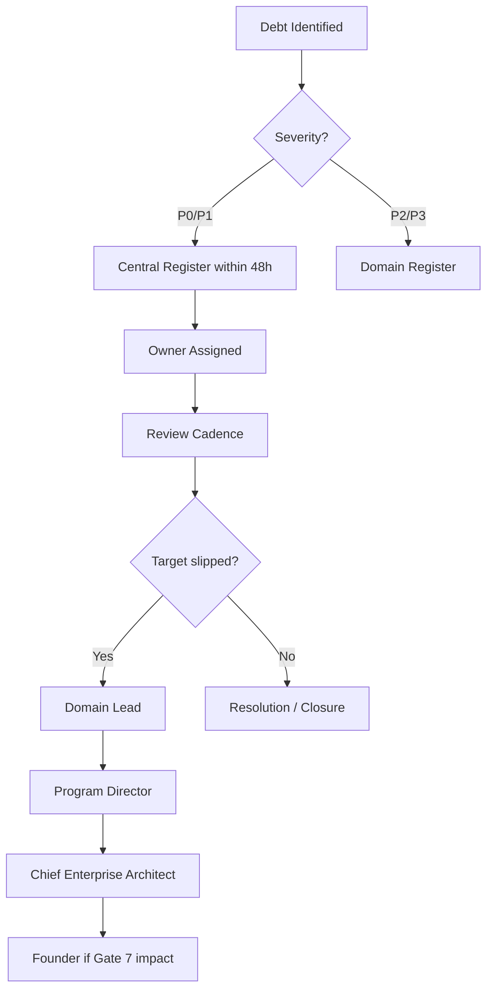

# ES-093 — Enterprise Technical Debt Management Standard

**Document ID:** ES-093  
**Mission:** P-016.4 — ORION v2.0 Governance Framework Completion  
**Program:** P-016 — ORION Enterprise Platform v2.0  
**Version:** 1.0  
**Status:** Ratified — Governing Engineering Standard  
**Classification:** Enterprise Architecture · Governance · Technical Debt  
**Authority:** Chief Enterprise Architect  
**Effective Date:** 2 August 2026  
**Architecture Baseline:** v1.0 GA Candidate → v2.0 Multi-Domain Baseline

**Parent:** [ORION Enterprise Architecture Handbook v1.0](./ORION_Enterprise_Architecture_Handbook_v1.0.md)  
**Implements:** [ADR-004 Technical Debt Governance](../11_Governance/ADR/ADR-004-Technical-Debt-Governance.md) · [G-001 §8](../11_Governance/Governance/G-001-Enterprise-Architecture-Governance-Charter.md)  
**Related:** [ES-092 Architecture Lifecycle](./ES-092-Enterprise-Architecture-Lifecycle-Standard.md) · [ES-094 Architecture Compliance](./ES-094-Enterprise-Architecture-Compliance-Standard.md) · [ES-097 ADR Policy](./ES-097-ORION-Architecture-Governance-ADR-Policy.md) · [TECHNICAL_DEBT.md](../11_Governance/TECHNICAL_DEBT.md)

**Remediates:** [TD-PLATFORM-004](../11_Governance/TECHNICAL_DEBT.md) (partial — debt governance component)

---

## Executive Summary

This specification defines the **official ORION Enterprise Technical Debt Management Standard** — the mandatory framework for identifying, classifying, owning, reviewing, escalating, resolving, and reporting technical debt across the ORION Enterprise Platform.

ES-093 operationalizes [ADR-004](../11_Governance/ADR/ADR-004-Technical-Debt-Governance.md) and [G-001 §8](../11_Governance/Governance/G-001-Enterprise-Architecture-Governance-Charter.md) as repeatable governance rules for v2.0 and beyond.

**Canonical register:** [docs/11_Governance/TECHNICAL_DEBT.md](../11_Governance/TECHNICAL_DEBT.md)

**Hierarchy of authority:**

```
ORION Canon → G-001 Charter → ADR-004 → ES-093 (this document) → TECHNICAL_DEBT.md → Domain registers
```

---

## 1. Purpose and Philosophy

### 1.1 Purpose

Technical debt is a **governed engineering liability**, not an invisible compromise. Every conscious deferral requires registration, ownership, and a resolution path. Silent debt is prohibited.

### 1.2 Core Principles

| # | Principle | Rule |
|---|-----------|------|
| 1 | **Visibility** | All debt in a register — central or domain with central promotion |
| 2 | **Accountability** | Every item has an owner and target release |
| 3 | **Proportionality** | Severity drives review cadence and release blocking |
| 4 | **Evidence** | Closure requires verification — not assertion |
| 5 | **No silent debt** | Undocumented compromise = governance violation |

---

## 2. Debt Categories

| Category | ID Prefix | Description | Examples |
|----------|-----------|-------------|----------|
| **Platform** | TD-PLATFORM-xxx | Shared infrastructure · IIL · persistence · CI | TD-PLATFORM-003 IIL in-process |
| **Domain** | TD-HCM-xxx · TD-FIN-xxx · TD-DOMAIN-xxx | Bounded context debt | TD-DOMAIN-PERSIST-001 CRM in-memory |
| **Security** | SEC-xxx · TD-PLATFORM-002 | Auth · RBAC · tenancy · PII | Fail-open API context |
| **Governance** | REG-xxx | Register drift · standards gap | TD-PLATFORM-004 ES-092–095 |
| **Engineering** | ENG-xxx · DEP-xxx | Lint · CI · tooling | ENG-LINT-001 · DEP-002 |
| **Architecture** | AG-xxx | Undocumented architectural deferral | AG-002 durable IIL plan |
| **Operations** | OPS-xxx | Runbooks · DR · staging | OPS-001 operational maturity |
| **Intelligence** | TD-003 (platform) | AI · Brief · pipeline | Dual intelligence pipeline |

### 2.1 Category Rules

| Rule | Requirement |
|------|-------------|
| **Single source of truth** | P0/P1 items MUST appear in central register |
| **Domain registers** | Allowed for domain-scoped Low/Medium · promote P0/P1 at discovery |
| **ADR resolution** | High platform debt MAY resolve via ADR (e.g., ADR-013 → TD-PLATFORM-003) |
| **Accepted debt** | Low severity MAY be explicitly accepted with rationale |

---

## 3. Severity Levels

| Severity | Label | Definition | Release Impact |
|----------|-------|------------|----------------|
| **P0** | Critical | Blocks GA · security breach · data loss · certification failure | **Blocks Gate 6 GO** |
| **P1** | High | Major capability gap · significant operational risk | **Blocks v2.0 GA · CONDITIONAL GO only with plan** |
| **P2** | Medium | Functional gap · workaround exists | Does not block GA · must have target release |
| **P3** | Low | Quality · polish · incremental improvement | Accepted or deferred with owner |
| **Accepted** | Explicit deferral | Consciously accepted with documented rationale | Does not block · reviewed annually |

### 3.1 Severity Assignment Criteria

| Criterion | P0 | P1 | P2 | P3 |
|-----------|----|----|----|-----|
| Data loss on restart | ✓ | | | |
| Security fail-open in production | ✓ | | | |
| Certification test failure | ✓ | | | |
| Blocks domain Gate 5 | | ✓ | | |
| Blocks cross-domain integration | | ✓ | | |
| Governance standards missing | | ✓ | | |
| Incomplete API surface | | | ✓ | |
| Lint warnings | | | | ✓ |

### 3.2 v2.0 Known Debt Disposition

| ID | Severity | Resolution Path | Target |
|----|----------|-----------------|--------|
| TD-PLATFORM-003 | P1 | ADR-013 Implemented | Wave 1 |
| TD-PLATFORM-004 | P1 | P-016.4 ES-092–095 ratified | Wave 1 |
| TD-DOMAIN-PERSIST-001 | P2 | P-009 · P-008 II · ADR-015 | Wave 2–3 |
| TD-003 | P2 | ADR-018 | Wave 4 |
| AG-002 | P2 | ADR-013 Accepted | Wave 1 |
| OPS-001 | P1 | Persistent staging · APM | Wave 1 |
| ENG-LINT-001 | P3 | Accepted · incremental | Ongoing |

---

## 4. Ownership

| Role | Responsibility |
|------|----------------|
| **Owner (named engineer or lead)** | Remediation · status updates · evidence on closure |
| **Chief Enterprise Architect** | Central register integrity · P0/P1 escalation |
| **Domain Lead** | Domain register accuracy · promotion to central |
| **Program Director** | Target release alignment · wave planning |
| **Release Board** | Gate 6 debt audit · blocker enforcement |

### 4.1 Ownership Rules

| Rule | Requirement |
|------|-------------|
| Every item has exactly one owner | Named person or role — not "TBD" at merge |
| Owner change requires register update | Within 5 business days |
| Unowned P0/P1 | Automatic escalation to CEA |
| ADR-linked debt | Platform Engineering or ADR author as owner |

---

## 5. Review Cadence

| Severity | Cadence | Forum |
|----------|---------|-------|
| **P0** | Weekly | Engineering standup + CEA review |
| **P1** | Bi-weekly | ARB or program review |
| **P2** | Monthly | Domain lead review |
| **P3 / Accepted** | Quarterly | Portfolio review |
| **Central register audit** | Every wave exit | P-016 · P-015 model |
| **Full register reconciliation** | Every Gate 6 | Certification mission |

### 5.1 Review Agenda

1. Open P0/P1 status
2. Target release slip detection
3. New debt from merged PRs
4. Register drift (domain vs central)
5. ADR resolution progress
6. Accepted debt revalidation

---

## 6. Escalation



| Escalation Level | Trigger | Action |
|------------------|---------|--------|
| **L1** | P2 target slip > 30 days | Domain Lead reassignment |
| **L2** | P1 target slip > 14 days | Program Director briefing |
| **L3** | P0 open at Gate 6 | **NO-GO** · executive review |
| **L4** | Register drift (REG-class) | Governance sprint · same wave closure |
| **L5** | Repeated deferral without ADR | ARB mandatory review |

---

## 7. Resolution Workflow

| Step | Action | Owner | Evidence |
|------|--------|-------|----------|
| 1 | **Identify** — debt discovered or introduced | Author | PR · mission doc · audit |
| 2 | **Register** — TD-xxx entry with severity · owner · target | Owner | TECHNICAL_DEBT.md |
| 3 | **Plan** — remediation path · ADR if architectural | Owner + Architect | ADR · mission plan |
| 4 | **Implement** — fix or ADR Accepted → Implemented | Engineering | PR · tests |
| 5 | **Verify** — independent validation | Certification | Test output · cert report |
| 6 | **Close** — status Closed · date · evidence link | Owner | Register update |
| 7 | **Audit** — Gate 6 confirms zero undeclared P0 | Certification Lead | Gate 6 report |

### 7.1 Resolution Paths

| Path | When | Example |
|------|------|---------|
| **Direct fix** | Implementation resolves debt | TD-HCM-001 PostgreSQL migration |
| **ADR resolution** | Architectural decision required | ADR-013 → TD-PLATFORM-003 |
| **Program resolution** | Multi-mission effort | P-016.4 → TD-PLATFORM-004 |
| **Acceptance** | Low impact · documented rationale | ENG-LINT-001 |
| **Supersession** | Debt obsolete due to scope change | Close with reference |

---

## 8. Acceptance Criteria (Debt Closure)

An item may be marked **Closed** only when ALL applicable criteria are met:

| # | Criterion | Evidence |
|---|-----------|----------|
| AC-1 | Root cause addressed — not masked | Code · config · or ADR |
| AC-2 | Validation gates green | typecheck · lint · test · build |
| AC-3 | Certification tests updated if doc/path debt | Test PR reference |
| AC-4 | No regression in full suite | Recorded pass count |
| AC-5 | Central register updated same commit/PR | Git diff |
| AC-6 | ADR status Implemented if ADR resolution | ADR header |
| AC-7 | Domain register synced if promoted item | Cross-reference |

**Prohibited closure:** Closing P0/P1 with "deferred" status — must be Open · Accepted · or Closed.

---

## 9. Governance Rules

| # | Rule | Enforcement |
|---|------|-------------|
| G-1 | No merge introducing conscious debt without TD entry | Code review |
| G-2 | No Gate 6 GO with open P0 | Certification |
| G-3 | No v2.0 GA with open P1 platform debt without CONDITIONAL GO | Gate 6 |
| G-4 | Every wave exit updates central register | Program Director |
| G-5 | Domain persistence debt cannot defer past Finance Gate 7 | P-016.2 Charter |
| G-6 | ADR-013 blocks v2.0 tag until TD-PLATFORM-003 Closed | Release Board |
| G-7 | REG-class drift closed within same wave discovered | ES-094 |
| G-8 | Inline code reference `// TD-xxx:` for in-code debt | Code review |
| G-9 | Release record includes debt summary | ADR-012 |
| G-10 | Accepted debt revalidated quarterly | Portfolio review |

---

## 10. Reporting Metrics

| Metric | Definition | Target |
|--------|------------|--------|
| **Open P0 count** | Central register P0 open | **0 at Gate 6** |
| **Open P1 count** | Central register P1 open | Trending down · ≤ 3 at v2.0 GA |
| **Debt age (P1)** | Days since identification | ≤ 180 days |
| **Register accuracy** | Domain vs central reconciliation | 100% P0/P1 match |
| **Closure rate** | Items closed / items opened per wave | ≥ 1.0 net reduction per hardening wave |
| **ADR-linked resolution** | High debt closed via ADR | 100% platform High debt |
| **Target slip rate** | Items missing target release | ≤ 10% per quarter |
| **Accepted debt ratio** | Accepted / total | ≤ 20% · reviewed quarterly |

### 10.1 Reporting Cadence

| Report | Audience | Frequency |
|--------|----------|-----------|
| Debt dashboard | Engineering | Weekly (P0/P1) |
| Wave exit debt summary | ARB · Program Director | Per wave |
| Gate 6 debt audit | Certification | Per release |
| Portfolio debt review | Founder · CEA | Quarterly |

---

## 11. Related Documents

| Document | Location |
|----------|----------|
| TECHNICAL_DEBT.md | [docs/11_Governance/TECHNICAL_DEBT.md](../11_Governance/TECHNICAL_DEBT.md) |
| ADR-004 | [ADR-004-Technical-Debt-Governance.md](../11_Governance/ADR/ADR-004-Technical-Debt-Governance.md) |
| ES-053 | [ES-053-ORION-Risk-Management-Technical-Debt-Framework.md](../02_Engineering/ES-053-ORION-Risk-Management-Technical-Debt-Framework.md) |
| P-016.3 ADR Program | [P-016.3-ORION-v2-ADR-Program.md](./P-016.3-ORION-v2-ADR-Program.md) |

---

## 12. Version History

| Version | Date | Author | Changes |
|---------|------|--------|---------|
| 1.0 | 2026-08-02 | Chief Enterprise Architect | Ratified — P-016.4 |

---

*ES-093 — Enterprise Technical Debt Management Standard · P-016.4 · Governance only*
