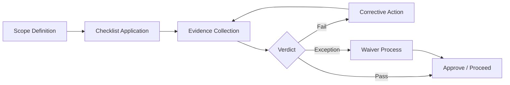

# ES-094 — Enterprise Architecture Compliance Standard

**Document ID:** ES-094  
**Mission:** P-016.4 — ORION v2.0 Governance Framework Completion  
**Program:** P-016 — ORION Enterprise Platform v2.0  
**Version:** 1.0  
**Status:** Ratified — Governing Engineering Standard  
**Classification:** Enterprise Architecture · Governance · Compliance  
**Authority:** Chief Enterprise Architect  
**Effective Date:** 2 August 2026  
**Architecture Baseline:** v1.0 GA Candidate → v2.0 Multi-Domain Baseline

**Parent:** [ORION Enterprise Architecture Handbook v1.0](./ORION_Enterprise_Architecture_Handbook_v1.0.md)  
**Related:** [G-001 Enterprise Architecture Governance Charter](../11_Governance/Governance/G-001-Enterprise-Architecture-Governance-Charter.md) · [ES-092 Architecture Lifecycle](./ES-092-Enterprise-Architecture-Lifecycle-Standard.md) · [ES-093 Technical Debt Management](./ES-093-Enterprise-Technical-Debt-Management-Standard.md) · [ES-097 ADR Policy](./ES-097-ORION-Architecture-Governance-ADR-Policy.md) · [ES-096 Testing & Certification](./ES-096-ORION-Enterprise-Testing-Certification-Standards.md) · [P-016.2 Architecture Charter](./P-016.2-ORION-v2-Architecture-Charter.md)

**Remediates:** [TD-PLATFORM-004](../11_Governance/TECHNICAL_DEBT.md) (partial — compliance standard component)

---

## Executive Summary

This specification defines the **official ORION Enterprise Architecture Compliance Standard** — the mandatory framework for compliance reviews, architecture checkpoints, gate verification, ADR compliance, audits, exceptions, waivers, and corrective actions.

ES-094 ensures that every ORION program — human or AI-assisted — conforms to ratified architecture, governance, and certification rules before implementation and release.

**Hierarchy of authority:**

```
ORION Canon → G-001 Charter → Architecture Handbook → ES-094 (this document) → Checklists / Certification
```

---

## 1. Purpose and Scope

### 1.1 Purpose

Compliance is not optional documentation. It is **verified conformance** to G-001 gates, ES standards, accepted ADRs, and the Architecture Handbook — with recorded evidence and accountable exceptions.

### 1.2 Applicability

| Subject | Compliance Required |
|---------|---------------------|
| Domain programs (P-009, P-008, P-007) | Yes |
| Platform missions (IIL, PlatformStore, RBAC) | Yes |
| ADR proposals and implementations | Yes |
| Release candidates and GA tags | Yes |
| AI-assisted development (Cursor, agents) | Yes — same rules as human engineers |
| Emergency production fixes | Partial — waiver process §7 |

---

## 2. Compliance Reviews

### 2.1 Review Types

| Review | Timing | Authority | Output |
|--------|--------|-----------|--------|
| **Architecture compliance review** | Gate 1–4 | ARB · CEA | Checklist · verdict |
| **Implementation compliance review** | Gate 5 · major PRs | Engineering Lead · Architect | PR approval |
| **Pre-certification compliance audit** | Gate 6 entry | Certification Lead | Audit report |
| **Release compliance audit** | Gate 7 | Release Board | Release record |
| **Periodic platform audit** | Quarterly | CEA | Platform compliance score |
| **ADR compliance audit** | ADR → Implemented | Validator | ADR status update |

### 2.2 Compliance Review Process



| Step | Action |
|------|--------|
| 1 | Define compliance scope (mission · gate · release) |
| 2 | Apply mandatory checkpoints (§3) |
| 3 | Collect evidence (commands · reports · signed artifacts) |
| 4 | Record verdict: **Compliant** · **Non-Compliant** · **Compliant with Waiver** |
| 5 | Non-compliant → corrective action plan (§8) |
| 6 | Store audit record under `docs/00_Governance/` or certification folder |

---

## 3. Mandatory Architecture Checkpoints

### 3.1 Checkpoint Matrix

| Checkpoint | Gate | Verification | Blocking |
|------------|------|--------------|----------|
| **CP-G1** Blueprint conforms to domain map | Gate 1 | Architecture Review Checklist | Yes |
| **CP-G2** Domain model isolation verified | Gate 2 | Entity scoping · no cross-domain entities | Yes |
| **CP-G3** Rules in engines · permission draft | Gate 3 | Governance rules doc | Yes |
| **CP-G4** ES-xxx complete · ADRs Accepted | Gate 4 | Signed ES · ADR index | Yes |
| **CP-G5** Facade-only external imports | Gate 5 | Architecture tests | Yes |
| **CP-G5b** IIL events from facade wrapper | Gate 5 | Code review · ADR-013 when applicable | Yes |
| **CP-G5c** RBAC before routes | Gate 5 | Permission matrix exists | Yes |
| **CP-G6** Four validation gates green | Pre-Gate 6 | CI evidence · full suite count | Yes |
| **CP-G6b** Zero P0 debt | Gate 6 | TECHNICAL_DEBT.md audit | Yes |
| **CP-G6c** Doc certification tests pass | Gate 6 | Test output | Yes |
| **CP-G7** Gate 6 report · Founder sign-off | Gate 7 | Certification + approval doc | Yes |

### 3.2 v2.0 Additional Checkpoints

Per [P-016.2 Charter](./P-016.2-ORION-v2-Architecture-Charter.md) and [P-016.3 ADR Program](./P-016.3-ORION-v2-ADR-Program.md):

| Checkpoint | Requirement |
|------------|-------------|
| **CP-V2-ADR** | Required ADRs Accepted before Gate 5 |
| **CP-V2-IIL** | ADR-013 Implemented before CRM Gate 5 |
| **CP-V2-ES** | ES-092–095 ratified before multi-domain Gate 5 |
| **CP-V2-CHAIN** | Cross-domain event chain demonstrated before v2.0 GA |
| **CP-V2-REG** | Central debt register reconciled at wave exit |

---

## 4. Gate Verification

### 4.1 Gate Verification Authority

| Gate | Verifier | Evidence Location |
|------|----------|-------------------|
| Gate 1 | Chief Enterprise Architect | D-xxx blueprint |
| Gate 2 | Chief Enterprise Architect | Domain model doc |
| Gate 3 | CEA + Compliance | Governance rules |
| Gate 4 | Chief Architect + Engineering Lead | ES-xxx |
| Gate 5 | Engineering Lead + Code Review | PR history |
| Gate 6 | Certification Lead (independent) | Certification report |
| Gate 7 | Founder + Chief Architect | Gate 7 approval doc |

### 4.2 Gate Verification Record

Each gate verification SHALL record:

| Field | Required |
|-------|----------|
| Mission ID | Yes |
| Gate number | Yes |
| Verifier name and role | Yes |
| Date | Yes |
| Checklist reference | Yes |
| Verdict | PASS / FAIL / WAIVED |
| Evidence links | Yes |
| Conditions (if conditional) | Numbered |

### 4.3 Automated Gate Verification (CI)

| Check | Workflow | Branch |
|-------|----------|--------|
| Quality gate | `quality-gate.yml` | main · release/* · develop/v2.0 |
| GA staging cert | `ga-staging-certification.yml` | release/* |
| Doc certification | `npm test` doc tests | All PRs |
| ADR path tests | Governance certification | develop/v2.0 |

CI green is **necessary but not sufficient** — manual gate verification still required for Gates 1–4 and Gate 7.

---

## 5. ADR Compliance

### 5.1 ADR Compliance Rules

Per [ES-097](./ES-097-ORION-Architecture-Governance-ADR-Policy.md):

| Rule | Compliance Check |
|------|------------------|
| No implementation before ADR **Accepted** | PR review · ARB record |
| Implementation matches Accepted decision | Code review · certification |
| ADR referenced in commits/PRs | Git history |
| Superseded ADRs linked · not deleted | ADR repository audit |
| Status → **Implemented** only after validation | Validator sign-off |
| Breaking changes have ADR + migration guide | Gate 6 audit |

### 5.2 v2.0 ADR Compliance Matrix

| ADR | Compliance Trigger | Verification |
|-----|-------------------|--------------|
| ADR-013 | Finance Gate 5 · v2.0 GA | Durable IIL · restart survival test |
| ADR-014 | Multi-domain events | Event contract certification tests |
| ADR-015 | Domain Gate 5 | Facade boundary architecture tests |
| ADR-007 | Authoritative persistence | PostgreSQL CI certification |
| ADR-009 | Domain REST APIs | Permission matrix · fail-closed tests |

### 5.3 ADR Non-Compliance

| Violation | Severity | Action |
|-----------|----------|--------|
| Code merged before ADR Accepted | **Critical** | Revert or emergency waiver |
| Implementation diverges from ADR | **High** | Stop work · ARB session |
| ADR deleted | **Critical** | Restore from git · governance review |
| AI implements without human ADR approval | **High** | Revert · ES-097 violation |

---

## 6. Audit Process

### 6.1 Audit Types

| Audit | Scope | Frequency |
|-------|-------|-----------|
| **Gate audit** | Single gate deliverables | Per gate |
| **Wave audit** | Program wave exit | Per wave |
| **Platform audit** | Shared services conformance | Quarterly |
| **Release audit** | RC/GA readiness | Per release |
| **Debt register audit** | TECHNICAL_DEBT.md accuracy | Gate 6 |
| **AI development audit** | Agent PR compliance | Monthly sample |

### 6.2 Audit Procedure

| Phase | Activity |
|-------|----------|
| **Plan** | Scope · checklist · auditor assignment (independent of implementer) |
| **Execute** | Evidence collection · interviews · command runs |
| **Report** | Findings · severity · compliance score |
| **Remediate** | Corrective actions · owners · dates |
| **Verify** | Re-audit closed findings |
| **Close** | Audit record archived |

### 6.3 Audit Evidence Requirements

| Evidence Type | Acceptable | Not Acceptable |
|---------------|------------|----------------|
| Test results | Command output with pass count | "Tests pass" without output |
| Gate sign-off | Named approver · date · document | Verbal approval |
| ADR status | Header status field | Assumed acceptance |
| Debt status | Register entry | Issue tracker only |
| CI status | Workflow run URL · green | Local-only claim |

### 6.4 Audit Scoring

| Score | Definition |
|-------|------------|
| **Compliant** | All mandatory checkpoints pass · no open Critical findings |
| **Compliant with Minor Findings** | No Critical · Medium findings with remediation plan |
| **Non-Compliant** | Any Critical finding or Gate blocker failed |
| **Compliant with Waiver** | Documented approved exception (§7) |

---

## 7. Exceptions and Waiver Process

### 7.1 Exception Categories

| Category | Example | Default |
|----------|---------|---------|
| **Emergency production fix** | Security patch · data corruption hotfix | Gate 1–4 bypass allowed per G-001 §3.2 |
| **Time-bound pilot** | Design partner vertical | CONDITIONAL GO with expiry |
| **Technical impossibility** | Third-party blocker | Waiver with ADR or DL |
| **Accepted technical debt** | ENG-LINT-001 | ES-093 acceptance |

### 7.2 Waiver Request

| Field | Required |
|-------|----------|
| Waiver ID | WVR-YYYY-NNN |
| Mission / release affected | Yes |
| Checkpoint waived | CP-xxx |
| Justification | Business + technical |
| Risk assessment | Yes |
| Compensating controls | Yes |
| Expiry date | Yes — max 90 days for Gate waivers |
| Approver | Per §7.3 |

### 7.3 Waiver Approval Authority

| Waiver Scope | Approver |
|--------------|----------|
| CP-G5 implementation detail | Engineering Lead + Architect |
| Gate 4 skip (emergency) | Chief Enterprise Architect |
| Gate 6 checkpoint | Chief Architect |
| ADR implementation deferral | ARB + CEA |
| Gate 7 / release | Founder |
| v2.0 ADR blocker waiver | **Not permitted** — P-016.2 hard rules |

### 7.4 Waiver Record

Waivers stored in `docs/10_Decisions/decisions/DL-*.md` or mission certification annex. Referenced in Gate 6 report if release-affecting.

### 7.5 Prohibited Waivers (v2.0)

| Checkpoint | Waiver |
|------------|--------|
| ADR-013 before Finance Gate 5 | **Prohibited** |
| Zero P0 at Gate 6 | **Prohibited** |
| Fail-closed RBAC | **Prohibited** |
| Cross-domain repository reads | **Prohibited** |
| Full suite green claim without evidence | **Prohibited** |

---

## 8. Corrective Actions

### 8.1 Corrective Action Process

| Step | Action | Owner | SLA |
|------|--------|-------|-----|
| 1 | Finding logged with severity | Auditor | Immediate |
| 2 | Root cause analysis | Owner | 5 business days |
| 3 | Corrective action plan | Owner + Architect | 10 business days |
| 4 | Implementation | Engineering | Per plan |
| 5 | Verification re-audit | Independent auditor | Before gate proceed |
| 6 | Close finding | Certification Lead | Evidence attached |

### 8.2 Severity and Response

| Severity | Response | Gate Impact |
|----------|----------|-------------|
| **Critical** | Stop gate progression | NO-GO until closed |
| **High** | Remediation before Gate 6 | CONDITIONAL GO max |
| **Medium** | Plan before release | GO with conditions |
| **Low** | Backlog · target release | GO |

### 8.3 Corrective Action Template

| Field | Content |
|-------|---------|
| Finding ID | AUD-xxx |
| Description | Non-compliance observed |
| Standard violated | ES-xxx · G-001 · ADR-xxx |
| Root cause | |
| Corrective action | |
| Owner | |
| Target date | |
| Verification method | |
| Status | Open / Closed |

---

## 9. Compliance Metrics

| Metric | Target |
|--------|--------|
| Gate verification records complete | 100% |
| Gate 5 before Gate 4 approval | 0 violations |
| ADR compliance (implementation matches ADR) | 100% |
| P0 debt at Gate 6 | 0 |
| Waiver expiry compliance | 100% closed or renewed before expiry |
| Audit finding closure within SLA | ≥ 90% |
| Register reconciliation accuracy | 100% P0/P1 |
| AI PR compliance sample pass rate | ≥ 95% |

---

## 10. Related Documents

| Document | Location |
|----------|----------|
| G-001 Architecture Review Checklist | [G-001-Architecture-Review-Checklist.md](../11_Governance/Governance/G-001-Architecture-Review-Checklist.md) |
| G-001 Certification Process | [G-001-Certification-Process.md](../11_Governance/Governance/G-001-Certification-Process.md) |
| ES-092 Lifecycle | [ES-092-Enterprise-Architecture-Lifecycle-Standard.md](./ES-092-Enterprise-Architecture-Lifecycle-Standard.md) |
| ES-093 Debt | [ES-093-Enterprise-Technical-Debt-Management-Standard.md](./ES-093-Enterprise-Technical-Debt-Management-Standard.md) |
| ES-097 ADR Policy | [ES-097-ORION-Architecture-Governance-ADR-Policy.md](./ES-097-ORION-Architecture-Governance-ADR-Policy.md) |

---

## 11. Version History

| Version | Date | Author | Changes |
|---------|------|--------|---------|
| 1.0 | 2026-08-02 | Chief Enterprise Architect | Ratified — P-016.4 |

---

*ES-094 — Enterprise Architecture Compliance Standard · P-016.4 · Governance only*
