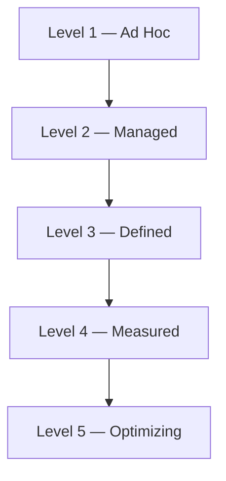

# ES-095 — Enterprise Architecture Maturity Assessment

**Document ID:** ES-095  
**Mission:** P-016.4 — ORION v2.0 Governance Framework Completion  
**Program:** P-016 — ORION Enterprise Platform v2.0  
**Version:** 1.0  
**Status:** Ratified — Governing Engineering Standard  
**Classification:** Enterprise Architecture · Governance · Maturity  
**Authority:** Chief Enterprise Architect  
**Effective Date:** 2 August 2026  
**Architecture Baseline:** v1.0 GA Candidate → v2.0 Multi-Domain Baseline

**Parent:** [ORION Enterprise Architecture Handbook v1.0](./ORION_Enterprise_Architecture_Handbook_v1.0.md)  
**Related:** [G-001 Enterprise Architecture Governance Charter](../11_Governance/Governance/G-001-Enterprise-Architecture-Governance-Charter.md) · [ES-092 Architecture Lifecycle](./ES-092-Enterprise-Architecture-Lifecycle-Standard.md) · [ES-094 Architecture Compliance](./ES-094-Enterprise-Architecture-Compliance-Standard.md) · [P-016.2 Architecture Charter](./P-016.2-ORION-v2-Architecture-Charter.md) · [P-016.1 Strategic Planning](./P-016.1-ORION-v2-Strategic-Planning.md)

**Remediates:** [TD-PLATFORM-004](../11_Governance/TECHNICAL_DEBT.md) (partial — maturity assessment component)

---

## Executive Summary

This specification defines the **official ORION Enterprise Architecture Maturity Model** — a five-level framework for assessing, scoring, and improving architecture maturity across the ORION Enterprise Platform.

ES-095 enables evidence-based maturity measurement at domain, platform, and program levels — supporting Gate 6 certification, v2.0 readiness scoring, and continuous improvement roadmaps.

**Hierarchy of authority:**

```
ORION Canon → G-001 Charter → Architecture Handbook → ES-095 (this document) → Assessment Reports
```

---

## 1. Purpose and Scope

### 1.1 Purpose

Maturity assessment answers: *Where is ORION today? Where must it be for v2.0 GA? What evidence proves it?*

### 1.2 Assessment Subjects

| Subject | Assessment Scope |
|---------|------------------|
| **Platform** | IIL · PlatformStore · RBAC · Workflow · Release |
| **Domain** | HCM · Finance · CRM · Hospitality · Operations |
| **Governance** | Gates · ADRs · ES standards · debt register |
| **Operations** | Runbooks · DR · staging · observability |
| **Commercial** | Design partner readiness · bundle credibility |

### 1.3 Assessment Authority

| Role | Responsibility |
|------|----------------|
| **Chief Enterprise Architect** | Model owner · platform assessment |
| **Domain Lead** | Domain self-assessment |
| **Certification Lead** | Independent validation at Gate 6 |
| **Program Director** | Program-level rollup |
| **Founder** | Gate 7 maturity acceptance |

---

## 2. Maturity Model Overview



| Level | Name | Summary |
|-------|------|---------|
| **1** | **Ad Hoc** | Reactive · inconsistent · hero-dependent |
| **2** | **Managed** | Basic governance · project-level discipline |
| **3** | **Defined** | Standardized · handbook-aligned · repeatable |
| **4** | **Measured** | Evidence-driven · metrics · certification |
| **5** | **Optimizing** | Continuous improvement · predictive · industry-leading |

### 2.1 ORION Target Maturity by Horizon

| Horizon | Platform | Domains | Governance | Operations |
|---------|----------|---------|------------|------------|
| **v1.0 exit (Aug 2026)** | Level 3–4 | HCM Level 4 | Level 3 | Level 3 |
| **v2.0 Wave 1 exit** | Level 4 | HCM Level 4 | **Level 4** | Level 3–4 |
| **v2.0 GA (2029 target)** | **Level 4–5** | Auth domains Level 4 | Level 4–5 | Level 4 |

**v2.0 minimum for GA:** Platform Level 4 · at least three authoritative domains at Level 4 · Governance Level 4.

---

## 3. Level Definitions

### Level 1 — Ad Hoc

| Dimension | Characteristics |
|-----------|-----------------|
| **Process** | No standard lifecycle · decisions undocumented |
| **Architecture** | Patterns vary · cross-domain coupling common |
| **Testing** | Manual · incomplete · domain-scoped claims |
| **Debt** | Unregistered · invisible |
| **Release** | Ad-hoc tags · no certification |
| **Evidence** | Anecdotal |

**ORION historical example:** Early executive platform phase — in-memory persistence · permissive API defaults.

---

### Level 2 — Managed

| Dimension | Characteristics |
|-----------|-----------------|
| **Process** | Project plans exist · some gate discipline |
| **Architecture** | G-001 introduced · partial handbook conformance |
| **Testing** | Unit tests · not always full suite |
| **Debt** | ADR-004 adopted · register exists but may drift |
| **Release** | RC process · CONDITIONAL GO culture emerging |
| **Evidence** | Partial documentation |

**ORION historical example:** Architecture Freeze v0.3 · domain certifications · 794/800 test state at RC.

---

### Level 3 — Defined

| Dimension | Characteristics |
|-----------|-----------------|
| **Process** | ES-092 lifecycle followed · Gates 1–7 defined |
| **Architecture** | Handbook v1.0 · HCM reference domain · facade law |
| **Testing** | Four validation gates · certification framework |
| **Debt** | ES-093 rules · central register · owners assigned |
| **Release** | Release branch CI · GA staging certification |
| **Evidence** | Signed gate artifacts · certification reports |

**ORION v1.0 exit state:** P-013 governance · P-015 hardening · 930/930 tests · production readiness 87/100.

---

### Level 4 — Measured

| Dimension | Characteristics |
|-----------|-----------------|
| **Process** | ES-094 compliance audits · waiver tracking |
| **Architecture** | ADR program · durable IIL · multi-domain patterns |
| **Testing** | Full suite authority · doc certification · operational tests |
| **Debt** | Metrics · closure rates · zero P0 at Gate 6 |
| **Release** | Evidence-based GO/NO-GO · Gate 7 · semantic tags |
| **Evidence** | Command output · CI URLs · audit scores |

**ORION v2.0 Wave 1 target:** ADR-013 Accepted/Implemented · ES-092–095 ratified · persistent staging.

---

### Level 5 — Optimizing

| Dimension | Characteristics |
|-----------|-----------------|
| **Process** | Predictive program planning · retrospective-driven improvement |
| **Architecture** | Cross-domain chains at scale · ADR-019 scalability operational |
| **Testing** | Continuous certification · production SLO validation |
| **Debt** | Proactive prevention · low accepted ratio |
| **Release** | Multi-domain GA · commercial SaaS credible |
| **Evidence** | Production metrics · design partner outcomes · AUD-002 refresh |

**ORION v2.0 GA aspiration:** Finance + CRM + HCM bundle · authoritative Brief · ERP replacement narrative.

---

## 4. Assessment Criteria

### 4.1 Assessment Dimensions

| # | Dimension | Weight | Level 3 Indicator | Level 4 Indicator |
|---|-----------|--------|-------------------|-------------------|
| D1 | **Architecture conformance** | 20% | Handbook · facade · IIL law | ADR compliance · architecture tests green |
| D2 | **Lifecycle discipline** | 15% | Gates 1–7 documented | ES-092 lifecycle · gate records 100% |
| D3 | **Persistence & integration** | 20% | PlatformStore on one domain | Multi-domain PostgreSQL · durable IIL |
| D4 | **Security & RBAC** | 15% | Fail-closed on reference domain | All domain APIs · audit trail |
| D5 | **Testing & certification** | 15% | Full suite green · Gate 6 | Operational · security · performance cert |
| D6 | **Governance & debt** | 10% | ES-090–097 · register exists | ES-092–095 · zero P0 · audit pass |
| D7 | **Operations** | 5% | Runbooks · health endpoints | Persistent staging · live DR drill |

### 4.2 Dimension Scoring Rubric

Each dimension scored **1–5** mapped to maturity levels:

| Score | Level | Criteria |
|-------|-------|----------|
| 1 | Ad Hoc | No standard · critical gaps |
| 2 | Managed | Partial · inconsistent |
| 3 | Defined | Standard documented · reference implementation exists |
| 4 | Measured | Evidence · metrics · certification |
| 5 | Optimizing | Continuous improvement · production proof |

---

## 5. Scoring Model

### 5.1 Weighted Score Calculation

```
Maturity Score = Σ (Dimension Score × Weight) / 5 × 100
```

**Result:** 0–100 scale · mapped to nearest level.

| Score Range | Maturity Level |
|-------------|----------------|
| 0–39 | Level 1 — Ad Hoc |
| 40–54 | Level 2 — Managed |
| 55–69 | Level 3 — Defined |
| 70–84 | Level 4 — Measured |
| 85–100 | Level 5 — Optimizing |

### 5.2 ORION Baseline Scores (August 2026)

Derived from [P-016.1 Platform Assessment](./P-016.1-ORION-v2-Strategic-Planning.md) and P-015/GA-001 evidence:

| Dimension | Score (1–5) | Weighted Contribution |
|-----------|-------------|----------------------|
| D1 Architecture conformance | 4.0 | 16.0 |
| D2 Lifecycle discipline | 4.0 | 12.0 |
| D3 Persistence & integration | 3.5 | 14.0 |
| D4 Security & RBAC | 4.0 | 12.0 |
| D5 Testing & certification | 4.5 | 13.5 |
| D6 Governance & debt | 3.5 | 7.0 |
| D7 Operations | 3.5 | 3.5 |
| **Total** | | **78.0 / 100** |

**Baseline maturity:** **Level 4 — Measured** (lower bound) · Governance dimension at Level 3 pending ES-092–095 (now ratified by P-016.4).

### 5.3 v2.0 GA Target Scores

| Dimension | v2.0 GA Target (1–5) |
|-----------|---------------------|
| D1 Architecture conformance | ≥ 4.5 |
| D2 Lifecycle discipline | ≥ 4.5 |
| D3 Persistence & integration | ≥ 4.5 |
| D4 Security & RBAC | ≥ 4.5 |
| D5 Testing & certification | ≥ 4.5 |
| D6 Governance & debt | ≥ 4.5 |
| D7 Operations | ≥ 4.0 |
| **Overall** | **≥ 85 (Level 5 threshold) or ≥ 80 with Level 4 minimum per dimension** |

---

## 6. Evidence Requirements

### 6.1 Evidence by Level

| Level | Minimum Evidence |
|-------|------------------|
| **Level 2** | Project plan · partial tests |
| **Level 3** | Signed ES · gate artifacts · certification report |
| **Level 4** | CI URLs · full test count · debt audit · ADR status |
| **Level 5** | Production metrics · design partner outcomes · cross-domain chain demo |

### 6.2 Mandatory Evidence Artifacts

| Artifact | Proves | Location |
|----------|--------|----------|
| Gate sign-off records | Lifecycle discipline | `docs/00_Governance/` |
| Certification report | Gate 6 verdict | `docs/00_Governance/` · `docs/06_Releases/` |
| CI workflow runs | Validation evidence | GitHub Actions |
| TECHNICAL_DEBT.md | Debt governance | `docs/11_Governance/` |
| ADR index with status | ADR compliance | `docs/11_Governance/ADR/` |
| Test output (full count) | Testing maturity | CI · local with recorded output |
| Production readiness score | Platform maturity | P-015.11 · GA-001 |
| Cross-domain chain trace | Integration maturity | Certification demo · correlation IDs |

### 6.3 Evidence Anti-Patterns

| Anti-Pattern | Impact |
|--------------|--------|
| Domain-only test green claim | Score capped at Level 2 for D5 |
| Undocumented gate approval | Score capped at Level 2 for D2 |
| Open P0 at assessment | Score capped at Level 3 overall |
| Register drift (REG-class) | D6 score capped at Level 2 |

---

## 7. Assessment Process

### 7.1 Assessment Cadence

| Assessment | Timing | Owner |
|------------|--------|-------|
| **Self-assessment** | Wave entry | Domain Lead / Platform Lead |
| **Independent assessment** | Gate 6 | Certification Lead |
| **Program rollup** | Wave exit | Program Director |
| **Platform maturity review** | Quarterly | Chief Enterprise Architect |
| **Gate 7 maturity acceptance** | Pre-GA tag | Founder |

### 7.2 Assessment Procedure

| Step | Action |
|------|--------|
| 1 | Select scope (platform · domain · program) |
| 2 | Score each dimension 1–5 with evidence links |
| 3 | Calculate weighted score |
| 4 | Map to maturity level |
| 5 | Identify gaps vs target |
| 6 | Publish improvement roadmap (§8) |
| 7 | Independent validator confirms or adjusts |
| 8 | Record in assessment report |

### 7.3 Assessment Report Template

| Section | Content |
|---------|---------|
| Assessment ID | MAT-YYYY-NNN |
| Scope | Platform / Domain / Program |
| Date | |
| Assessor | |
| Dimension scores | D1–D7 with evidence |
| Weighted score | 0–100 |
| Maturity level | 1–5 |
| Gap analysis | vs target |
| Improvement roadmap | Prioritized actions |
| Verdict | Meets target / Below target |

---

## 8. Improvement Roadmap

### 8.1 v2.0 Wave 1 Improvement (Post P-016.4)

| Gap | Current | Target | Action | Program |
|-----|---------|--------|--------|---------|
| Governance Level 2 → 4 | ES-092–095 pending | Ratified | P-016.4 complete | ✅ |
| IIL durability | In-process | ADR-013 Implemented | Platform Wave 1 | ADR-013 |
| ES-092–095 enforcement | Ratified | Measured compliance | ES-094 audits | Wave 1 |
| Persistent staging | CI only | Operational host | Ops mission | Wave 1 |
| Multi-domain persistence | HCM only | HCM + Finance | P-009 | Wave 2 |

### 8.2 v2.0 GA Improvement Path

| Priority | Improvement | Target Level | Program |
|----------|-------------|--------------|---------|
| P0 | ADR-013 Implemented · cross-domain chains | D3 Level 4+ | Platform |
| P0 | Finance + CRM authoritative persistence | D3 Level 4+ | P-009 · P-008 |
| P1 | All domain APIs fail-closed RBAC | D4 Level 4+ | ADR-009 extension |
| P1 | Production readiness ≥ 90/100 | Overall | Gate 6 |
| P2 | Analytics read models | D3 Level 5 | ADR-017 |
| P2 | Unified intelligence pipeline | D1 Level 5 | ADR-018 |
| P3 | Multi-region planning | D7 Level 5 | ADR-019 |

### 8.3 Improvement Tracking

| Metric | Review |
|--------|--------|
| Dimension score delta per wave | Wave exit report |
| Overall maturity score trend | Quarterly platform review |
| Gap closure rate | Program Director dashboard |
| Level regression | Triggers corrective action (ES-094 §8) |

---

## 9. Maturity and Certification Integration

| Certification Verdict | Minimum Maturity |
|----------------------|------------------|
| **Gate 6 GO** | No dimension below Level 3 · overall ≥ 70 |
| **Gate 6 CONDITIONAL GO** | No dimension below Level 2 · numbered remediation to Level 4 |
| **Gate 6 NO-GO** | Any dimension at Level 1 · or overall < 55 |
| **v2.0 GA (Gate 7)** | Platform Level 4+ · three domains Level 4+ · overall ≥ 80 |

---

## 10. Related Documents

| Document | Location |
|----------|----------|
| P-016.1 Strategic Planning | [P-016.1-ORION-v2-Strategic-Planning.md](./P-016.1-ORION-v2-Strategic-Planning.md) |
| P-016.2 Charter | [P-016.2-ORION-v2-Architecture-Charter.md](./P-016.2-ORION-v2-Architecture-Charter.md) |
| P-015.1 Assessment | [P-015.1-Enterprise-Production-Readiness-Assessment.md](./P-015.1-Enterprise-Production-Readiness-Assessment.md) |
| ES-092 Lifecycle | [ES-092-Enterprise-Architecture-Lifecycle-Standard.md](./ES-092-Enterprise-Architecture-Lifecycle-Standard.md) |
| ES-094 Compliance | [ES-094-Enterprise-Architecture-Compliance-Standard.md](./ES-094-Enterprise-Architecture-Compliance-Standard.md) |
| Platform Retrospective | [ORION_Platform_Retrospective_v1.0.md](./ORION_Platform_Retrospective_v1.0.md) |

---

## 11. Version History

| Version | Date | Author | Changes |
|---------|------|--------|---------|
| 1.0 | 2026-08-02 | Chief Enterprise Architect | Ratified — P-016.4 |

---

*ES-095 — Enterprise Architecture Maturity Assessment · P-016.4 · Governance only*
