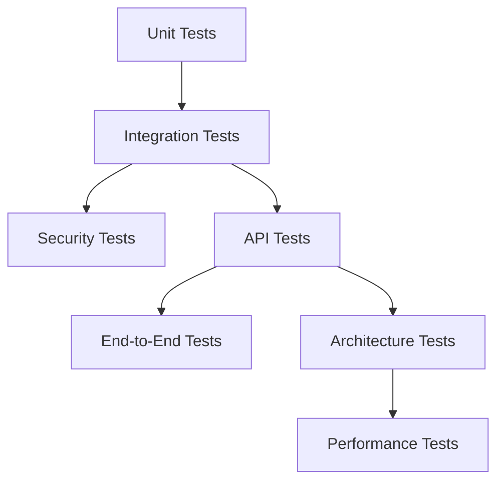
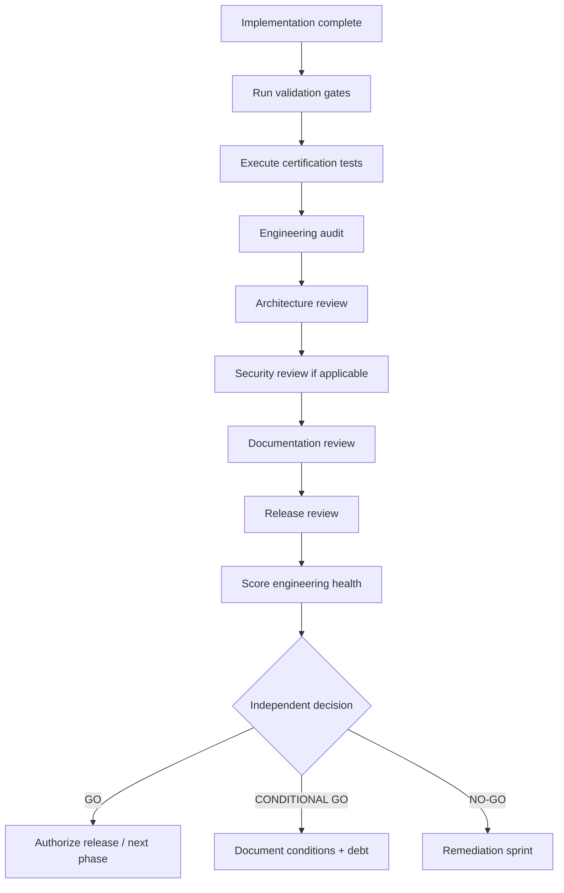
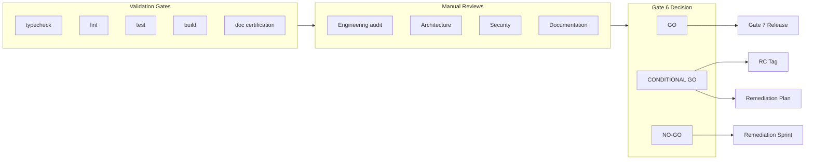

# ES-096 — ORION Enterprise Testing & Certification Standards

**Document ID:** ES-096  
**Mission:** P-013.8 — ORION Enterprise Testing & Certification Standards  
**Version:** 1.0  
**Status:** Ratified — Governing Engineering Standard  
**Classification:** Engineering Specification · Governance · Quality Assurance  
**Authority:** Chief Enterprise Architect  
**Effective Date:** August 2026  
**Architecture Baseline:** v1.0 Candidate  

**Parent:** [ORION Enterprise Architecture Handbook v1.0](./ORION_Enterprise_Architecture_Handbook_v1.0.md)  
**Related:** [G-001 Enterprise Architecture Governance Charter](../11_Governance/Governance/G-001-Enterprise-Architecture-Governance-Charter.md) · [G-001 Certification Process](../11_Governance/Governance/G-001-Certification-Process.md) · [ES-091 Enterprise Development Standards](./ES-091-ORION-Enterprise-Development-Standards.md) · [ES-090 Next.js Enterprise Standards](./ES-090-ORION-NextJS-Enterprise-Standards.md) · [ADR-004 Technical Debt Governance](../11_Governance/ADR/ADR-004-Technical-Debt-Governance.md) · [S-001.1 Engineering Health Audit](../03_Quality/S-001.1-Engineering-Health-Audit.md)

---

## Executive Summary

This specification defines the **official ORION Enterprise Testing & Certification Standards** — the mandatory quality assurance, validation, certification, and release approval framework for every ORION domain and platform module.

These standards apply equally to:

- **Human developers**
- **AI assistants** (Cursor, automation agents, CI bots)
- **Automation** (pipelines, certification scripts, release tooling)
- **Future contributors** (partners, contractors, acquired teams)

ES-096 is the **operational quality constitution**. It does not replace [G-001](../11_Governance/Governance/G-001-Enterprise-Architecture-Governance-Charter.md) Gate 6 or the [ORION Canon](../00_FOUNDATION/ORION_CANON_v1.md). It **implements** them as repeatable, evidence-driven testing and certification rules.

**Hierarchy of authority:**

```
ORION Canon  →  G-001 Charter  →  Architecture Handbook  →  ES-096 (this document)  →  Domain Testing Guides
```

**Reference implementation:** [Enterprise HCM Testing Guide](../HCM/Engineering/HCM-Testing-Guide.md) · `tests/lib/hcm/*`

---

## 1. Testing Philosophy

ORION quality assurance is governed by four foundational values. Every validation decision — human or AI — shall be evaluated against them.

| # | Value | Rule |
|---|-------|------|
| 1 | **Quality-first engineering** | Tests and certification gates are deliverables — not optional follow-ups. Untested code is unverified code. |
| 2 | **Evidence-driven validation** | Claims require command output: pass/fail counts, coverage, gate results — not opinion or model confidence. |
| 3 | **Independent certification** | Certification missions evaluate scope without modifying code under review. |
| 4 | **Regression prevention** | Every bug fix includes a test. Every release re-runs the full validation matrix. |

### 1.1 Supporting Principles

From the [Enterprise Architecture Handbook](./ORION_Enterprise_Architecture_Handbook_v1.0.md#chapter-11--testing):

- **Testability by design** — business logic runs without UI or framework dependencies
- **Deterministic core** — same input → same output; tests must not depend on wall-clock randomness without injection
- **Architecture tests** — facade boundaries, event catalogues, and documentation inventory are enforced in CI
- **Certification before release** — GO / CONDITIONAL GO / NO-GO with recorded evidence
- **Technical debt is governed** — P0 debt blocks GA; CONDITIONAL GO requires numbered remediation

### 1.2 Anti-Patterns (Prohibited)

| Anti-Pattern | Why Forbidden |
|--------------|---------------|
| Skipping validation gates before merge | Unverified code must not integrate |
| Certification without recorded results | No audit trail; blocks Gate 7 |
| Tests that assert implementation details only | Brittle; miss business behavior |
| Mocking away organization isolation | Tenancy bugs reach production |
| AI claiming pass without running commands | Violates evidence-first rule |
| Disabling tests to green the build | Regression debt; NO-GO |

---

## 2. Testing Pyramid

ORION uses a layered test pyramid. Lower layers run faster and more frequently; upper layers validate end-to-end behavior.



| Level | Scope | Location | Tooling |
|-------|-------|----------|---------|
| **Unit tests** | Rules engines, pure functions, validators | `tests/lib/<domain>/` | Vitest |
| **Integration tests** | Facade + wiring + store; IIL publish/subscribe | `tests/lib/<domain>/*Integration.test.ts` | Vitest |
| **API tests** | Route handlers, envelopes, HTTP status, org context | `tests/lib/<domain>/*Api*.test.ts` | Vitest (mocked context) |
| **Architecture tests** | Facade surface, import boundaries, catalogue uniqueness | `tests/lib/<domain>/*Certification*.test.ts` | Vitest + filesystem checks |
| **End-to-end tests** | Critical executive flows across UI + API | `tests/e2e/` (when infrastructure exists) | Playwright (planned) |
| **Performance tests** | Response time budgets, load thresholds | Mission-specific / staging | Benchmark harness (planned) |
| **Security tests** | Permission matrix, org isolation, input validation | Co-located + dedicated security suite | Vitest |

### 2.1 Minimum Domain Test Suite

Every certified domain **shall** include at minimum:

| File Pattern | Purpose |
|--------------|---------|
| `*Operations.test.ts` or `*Services.test.ts` | Business rules, CRUD, org isolation |
| `*Repository.test.ts` | Persistence contracts |
| `*FacadeIntegration.test.ts` | Public facade; no repository leakage |
| `*Certification.test.ts` | Documentation inventory, domain status flags |
| `*EventsIntegration.test.ts` | IIL publication (if domain publishes events) |
| `*ApiIntegration.test.ts` | REST envelopes (if domain exposes HTTP API) |

Reference: [HCM test suites](../HCM/Engineering/HCM-Testing-Guide.md#test-suites).

### 2.2 Test Naming and Structure

- Mirror `lib/` structure under `tests/lib/`
- Use mission IDs in `describe()` blocks: `describe("HCM API Rationalization (S-002.7)", …)`
- One assertion theme per test — avoid mega-tests
- Use unique `organizationId` values for isolation tests

### 2.3 ServiceContext Test Fixture

```typescript
const CONTEXT: ServiceContext = {
  organizationId: "org-test-isolated",
  workspaceId: "ws-test",
  userId: "user-test",
  role: "executive",
};
```

Never reuse production organization IDs in tests.

---

## 3. Coverage Standards

Coverage is a **floor**, not a ceiling. Missing tests on business rules block certification regardless of aggregate percentage.

### 3.1 Minimum Coverage Expectations

| Layer | Line Coverage Target | Branch Coverage Target | Priority |
|-------|---------------------|------------------------|----------|
| **Rules engines** | 90% | 90% | Critical |
| **Services** | 80% | 75% | Critical |
| **Repositories** | 70% | 65% | High |
| **Facade (public methods)** | 70% | — | High |
| **API route handlers** | Per-endpoint test | Error paths required | High |
| **Workflow orchestrators** | Trigger mapping + dispatch | — | Medium |
| **UI components** | Best effort | Critical paths only | Medium |

### 3.2 Critical Path Coverage

The following **must** have explicit tests before domain certification:

| Critical Path | Test Requirement |
|---------------|------------------|
| Organization isolation | Cross-tenant read/write rejection |
| Public facade contract | Every exported method invoked at least once |
| Status transitions | All rules engine transitions including invalid paths |
| API envelopes | `{ success, data }` and `{ success: false, error }` |
| Event publication | At least one publish per event catalogue category |
| Workflow triggers | Event → template mapping for declared triggers |
| Error HTTP mapping | `*_NOT_FOUND` → 404, `DUPLICATE_*` → 409, etc. |

### 3.3 Domain Coverage Matrix

| Domain Component | Unit | Integration | API | Events | Certification |
|------------------|------|-------------|-----|--------|---------------|
| Services | Required | Required | — | If publishes | Required |
| Repositories | Required | Required | — | — | Recommended |
| Facade | — | Required | — | — | Required |
| REST routes | — | — | Required | — | Route inventory |
| Workflow orchestrator | Required | Required | — | Required | Trigger map |
| Documentation | — | — | — | — | Required |

### 3.4 Coverage Measurement

```bash
npm test -- --coverage
```

| Release Stage | Coverage Gate |
|---------------|---------------|
| Alpha | Recommended; no hard block |
| Beta | Domain services ≥ 70% |
| RC | Domain services ≥ 80%; rules engines ≥ 90% |
| GA | Full targets in §3.1; zero P0 gaps |

Record coverage percentage in certification reports when available.

---

## 4. Validation Gates

Validation gates are **automated checkpoints** that must pass before merge and before certification.

### 4.1 Mandatory Automated Gates

```bash
npm run typecheck   # Gate 1 — TypeScript strict, zero errors
npm run lint        # Gate 2 — ESLint, zero errors
npm test            # Gate 3 — Vitest full suite, zero failures
npm run build       # Gate 4 — Next.js production build
```

| Gate | Command | Block Merge | Block Certification | Block GA |
|------|---------|-------------|---------------------|----------|
| **TypeScript** | `npm run typecheck` | Yes | Yes | Yes |
| **Lint** | `npm run lint` | Yes (errors) | Yes (errors) | Yes (errors) |
| **Unit + integration tests** | `npm test` | Yes | Yes | Yes |
| **Production build** | `npm run build` | Yes | Yes | Yes |
| **Documentation validation** | Certification test suites | No | Yes | Yes |
| **Coverage** | `npm test -- --coverage` | No | Recommended | Yes (RC+) |

**Lint warnings** are tracked but do not block unless escalated to error by team decision.

### 4.2 Pre-Merge Checklist (Every PR)

- [ ] All four automated gates pass locally or in CI
- [ ] New behavior has tests
- [ ] Organization isolation tested if tenancy touched
- [ ] Public facade/API changes have documentation updates
- [ ] Technical debt registered if compromise intentional (`TD-xxx`)

### 4.3 Pre-Certification Checklist

- [ ] Full validation matrix recorded with timestamps
- [ ] Domain certification tests pass
- [ ] Architecture review checklist complete
- [ ] Documentation suite complete for certified scope
- [ ] Technical debt register current
- [ ] Certification report drafted per [G-001 template](../11_Governance/Governance/G-001-Certification-Process.md#9-certification-report-template)

### 4.4 AI-Assisted Development Gates

AI assistants **shall** run and report all four commands before claiming completion:

```
typecheck: PASS | FAIL (N errors)
lint: PASS | FAIL (N errors, M warnings)
test: PASS | FAIL (X/Y passed)
build: PASS | FAIL
```

No certification attestation without command evidence.

---

## 5. Certification Process

Certification is **Gate 6** of G-001. It produces an independent GO / CONDITIONAL GO / NO-GO decision with recorded evidence.

### 5.1 Certification Types

| Type | Scope | Example |
|------|-------|---------|
| **Domain certification** | Full business domain | Enterprise HCM v1.0 |
| **Mission certification** | Single P-xxx.x / S-xxx mission | S-002.7 HCM API Rationalization |
| **Platform certification** | Cross-cutting platform module | P-010.6 Compliance Platform |
| **Release certification** | Tagged platform release | v1.0.0-rc1 |
| **Sprint certification** | Stabilization / audit sprint | S-001 Green Dashboard |

### 5.2 Certification Workflow



### 5.3 Review Responsibilities

| Review | Authority | Evidence |
|--------|-----------|----------|
| **Engineering audit** | Engineering Lead | Test results, gate logs, debt register |
| **Architecture review** | Chief Enterprise Architect | [Architecture Review Checklist](../11_Governance/Governance/G-001-Architecture-Review-Checklist.md) |
| **Security review** | Security Architect | Tenancy, auth, sensitive data (if in scope) |
| **Documentation review** | Domain Lead | ES-xxx, catalogues, guides, release notes |
| **Release review** | Chief Architect | Scope, semver, rollback plan |
| **Independent certification** | Certification Authority | Signed certification report |

### 5.4 Engineering Health Scoring

For platform and sprint certifications, calculate score using [S-001.1 dimensions](../03_Quality/S-001.1-Engineering-Health-Audit.md):

| Dimension | Weight |
|-----------|--------|
| Build & type safety | 15% |
| Test reliability | 20% |
| Lint & code hygiene | 10% |
| Architecture consistency | 20% |
| Public API boundaries | 10% |
| Domain isolation | 10% |
| Documentation accuracy | 10% |
| Dead code / completeness | 5% |

| Score | Grade | Typical Decision |
|-------|-------|------------------|
| ≥ 85 | A | GO |
| 75–84 | B+ | GO or CONDITIONAL GO |
| 65–74 | C+ | CONDITIONAL GO |
| < 65 | D or below | NO-GO |

### 5.5 Certification Report Storage

Store reports in:

- `docs/11_Governance/Certification/` — domain and release certifications
- `docs/03_Quality/` — sprint audits

Use the [G-001 certification report template](../11_Governance/Governance/G-001-Certification-Process.md#9-certification-report-template).

---

## 6. Release Readiness

Release readiness is expressed as one of three objective decisions. No release tag without a recorded decision.

### 6.1 GO

**Approved for release at declared scope.**

| Criterion | Required |
|-----------|----------|
| All validation gates pass | Yes |
| Zero P0 test failures | Yes |
| Architecture review approved | Yes |
| Documentation complete for scope | Yes |
| No unresolved P0 technical debt | Yes |
| Public facade conforms to layering rules | Yes |
| Engineering health ≥ 75 (or domain equivalent) | Yes |

**Release action:** Proceed to Gate 7 release approval and tag.

### 6.2 CONDITIONAL GO

**Approved with numbered remediation before production (GA).**

| Criterion | Required |
|-----------|----------|
| Validation gates pass | Yes |
| P1 issues enumerated with owner + target release | Yes |
| Core capability demonstrably works | Yes |
| P0 debt has remediation plan (may block GA only) | Yes |
| Acceptable for Beta or RC | Yes |

**Examples:**

- Enterprise HCM v1.0 RC1 — **CONDITIONAL GO** pending TD-HCM-001 (persistent store) and TD-HCM-005 (HCM permissions)
- Partial platform epic with documented P1 debt
- Missing non-blocking documentation with remediation plan

**Release action:** RC tag permitted; GA blocked until conditions resolved and re-certified.

### 6.3 NO-GO

**Blocking defects — no release.**

| Trigger | Action |
|---------|--------|
| Any validation gate fails | Fix and re-run full matrix |
| P0 test failures unresolved | Remediation sprint |
| Architecture boundary violations | Refactor before re-certification |
| Missing Gate 1–4 artifacts | Complete governance before code |
| Undocumented breaking public API change | ADR + migration before release |
| Engineering health < 65 | Remediation sprint |

**Release action:** Block tag; return to implementation.

### 6.4 Decision Matrix

| Stage | Minimum Decision | P0 Debt | P1 Debt |
|-------|------------------|---------|---------|
| Alpha | CONDITIONAL GO acceptable | Documented | Allowed |
| Beta | CONDITIONAL GO minimum | Plan required | Documented |
| RC | GO or CONDITIONAL GO | Blocks GA | Documented |
| GA | GO only | Zero open | Remediated or accepted via ADR |

Reference: [G-001 Release Governance Guide](../11_Governance/Governance/G-001-Release-Governance-Guide.md)

---

## 7. Technical Debt

Technical debt directly affects certification outcomes. All debt is classified, tracked, and governed.

Authority: [ADR-004](../11_Governance/ADR/ADR-004-Technical-Debt-Governance.md) · [Technical Debt Register](../11_Governance/TECHNICAL_DEBT.md)

### 7.1 Classification

| Priority | Definition | Certification Impact |
|----------|------------|---------------------|
| **P0 — Blocker** | Prevents production or violates security/tenancy | Blocks GA; blocks GO if unowned |
| **P1 — High** | Significant functional gap or operational risk | Allows CONDITIONAL GO with plan |
| **P2 — Medium** | Known limitation with workaround | Document in release notes |
| **P3 — Low** | Cosmetic, minor refactor | Tracked; no release block |

### 7.2 Severity and Acceptance

- **P0/P1 creation** requires Engineering Lead acknowledgment in PR
- **Accepted debt** (will not fix) requires ADR + Chief Architect approval
- **CTO/Founder release blocked** if any P0 item lacks owner and target release

### 7.3 Deferral

Deferred debt **shall** record:

| Field | Required |
|-------|----------|
| ID | `TD-<DOM>-nnn` |
| Owner | Named engineer or lead |
| Target Release | Semver |
| Mitigation | Workaround until remediated |
| Certification impact | GO / CONDITIONAL GO / NO-GO note |

### 7.4 Release Blockers

The following **always** block GA (GO):

- Open P0 technical debt without accepted ADR
- `readyForEnterprise*Certification: false` when domain claims GA readiness
- Missing persistent storage for stateful production domains (e.g. TD-HCM-001)
- Missing permission enforcement for sensitive domains (e.g. TD-HCM-005)

Domain registers extend the canonical register (e.g. [HCM Technical Debt Register](../HCM/Engineering/HCM-Technical-Debt-Register.md)).

---

## 8. Regression Management

Regression management ensures fixes stay fixed and releases do not reintroduce known defects.

### 8.1 Regression Detection

| Mechanism | When |
|-----------|------|
| Full test suite on every PR | CI / pre-merge |
| Full suite on release branch | Pre-tag |
| Certification test suites | Gate 6 |
| Domain status flags | `getDomainStatus()` in certification tests |
| Documentation inventory tests | `existsSync` checks on ES/catalogues |

### 8.2 Root Cause Analysis

When a regression is found:

1. Identify failing test or missing test coverage
2. Classify: logic bug · architecture violation · test gap · environment
3. File TD-xxx if systemic compromise accepted temporarily
4. Document in certification report if found during Gate 6

### 8.3 Remediation

1. Fix root cause — not symptom
2. Add regression test reproducing the failure
3. Re-run full validation matrix
4. Update release notes and debt register if applicable

### 8.4 Verification

Regression fix is verified when:

- New test fails on prior commit, passes on fix commit
- Full `npm test` green
- Affected domain certification tests pass
- No new lint or typecheck errors introduced

---

## 9. Performance Validation

Performance validation ensures ORION meets operational expectations under load.

### 9.1 Response Time Targets

| Operation | Target (p95) | Stage Required |
|-----------|--------------|----------------|
| GET (API) | < 200 ms | GA |
| POST / PATCH (API) | < 500 ms | GA |
| Search / list (paginated) | < 300 ms | GA |
| Facade inquiry (in-process) | < 50 ms | RC |
| Intelligence pipeline | Tracked per engine | Beta |

Internal service timing ≠ HTTP latency. Measure both where applicable.

### 9.2 Scalability

- Pagination mandatory for list APIs — no unbounded responses
- Repository queries scoped by `organizationId`
- Load testing on staging before GA for domains with > 10k entities/org

### 9.3 Load Testing

| Stage | Requirement |
|-------|-------------|
| Alpha | Not required |
| Beta | Smoke load on critical paths (recommended) |
| RC | Documented load test plan |
| GA | Executed load test with results in certification report |

### 9.4 Stress Testing

Stress tests validate degradation behavior:

- Rate limiting response (429) when implemented
- Graceful failure under store unavailability
- No data corruption under concurrent mutations

**Current state:** HTTP load/stress infrastructure planned. In-process performance tracked via observability layer (`/api/health/metrics`).

---

## 10. Security Validation

Security validation is mandatory for domains handling PII, financial data, or cross-tenant operations.

### 10.1 Permission Testing

| Test | Requirement |
|------|-------------|
| Authenticated access | API routes reject unauthenticated requests |
| Role-based access | Sensitive operations require appropriate role (when implemented) |
| Domain permission matrix | HCM, Finance — before GA (see TD-HCM-005) |
| Admin override | Super-admin paths explicitly tested |

### 10.2 Organization Isolation

**Mandatory for every domain certification:**

```typescript
const record = facade.createEntity(input, CONTEXT_ORG_A);
expect(facade.getEntity(record.id, CONTEXT_ORG_B)).toBeNull();
```

- Repository layer enforces scope minimum
- API routes derive org from session — never trust client override without authorization
- Integration tests use two distinct `organizationId` values

### 10.3 Input Validation

- Invalid input returns stable domain error codes — not 500
- `INVALID_*`, `MISSING_PARAMS` → HTTP 400
- No stack traces in API error envelopes
- SQL/injection N/A for in-memory store; validate when persistent layer added

### 10.4 Audit Verification

Material mutations shall:

- Record `actorId`, timestamps where applicable
- Publish IIL events with correlation ID
- Appear in audit service when platform audit subscribed

Verify via event integration tests and audit subscriber tests.

Reference: [ES-059 Platform Security](../02_Engineering/ES-059-ORION-Platform-Security-Zero-Trust-Architecture.md)

---

## 11. Documentation Validation

Documentation is a **certified deliverable**. Certification tests enforce inventory completeness.

### 11.1 Required Documentation Suite

Every certified domain ships:

| Document | ID Pattern | Validated By |
|----------|------------|--------------|
| Engineering Specification | ES-`<DOM>`-001 | Certification test |
| Architecture Guide | `<DOM>-Architecture-Guide` | Certification test |
| Package Guide | `<DOM>-Package-Guide` | Certification test |
| Developer Guide | `<DOM>-Developer-Guide` | Certification test |
| Dependency Matrix | `<DOM>-Dependency-Matrix` | Certification test |
| API Catalogue | `<DOM>-API-Catalogue` | Route + facade inventory test |
| Event Catalogue | `<DOM>-Event-Catalogue` | Event uniqueness test |
| Testing Guide | `<DOM>-Testing-Guide` | Manual + certification |
| Operational Guide | `<DOM>-Operational-Guide` | Certification test |
| Technical Debt Register | `<DOM>-Technical-Debt-Register` | Certification test |
| Release Notes | `<DOM>-Release-Notes` | Release certification |

Reference: [Architecture Handbook Ch. 12](./ORION_Enterprise_Architecture_Handbook_v1.0.md#chapter-12--documentation-standards)

### 11.2 Documentation Certification Test Pattern

```typescript
import { existsSync } from "node:fs";
import { join } from "node:path";

const DOCS_ROOT = join(process.cwd(), "docs/HCM/Engineering");

it("ships required engineering documentation", () => {
  expect(existsSync(join(DOCS_ROOT, "ES-HCM-001_Enterprise_HCM_Engineering_Specification.md"))).toBe(true);
  // ... additional inventory checks
});
```

Reference: [HcmDocumentationCertification.test.ts](../../tests/lib/hcm/HcmDocumentationCertification.test.ts)

### 11.3 Catalogue Accuracy

- API catalogue routes match `app/api/<domain>/` structure
- Event catalogue matches code constants (`assertUniqueHcmEventCatalog()`)
- Facade method tables match public `index.ts` exports
- Stale mission docs point to authoritative catalogues — not duplicate inventories

### 11.4 Release Notes Validation

Release certification verifies:

- Features, fixes, known limitations sections present
- Mission IDs referenced
- TD-xxx items resolved or carried forward
- Breaking changes with migration notes (if any)

---

## 12. Continuous Improvement

Quality is iterative. Every certification cycle feeds the next.

### 12.1 Retrospectives

Post-release retrospective **shall** update:

- Technical debt register
- Testing guide gaps discovered during certification
- Architecture review checklist amendments (via ADR if structural)

### 12.2 Lessons Learned

Capture in certification report **Rationale** section:

- What blocked or nearly blocked release
- Test gaps discovered
- Documentation inaccuracies found
- Recommended process changes

### 12.3 Quality Metrics

Track over time:

| Metric | Source |
|--------|--------|
| Test pass rate | `npm test` output |
| Suite size | Vitest test count |
| Lint warning trend | `npm run lint` |
| Coverage percentage | `--coverage` reports |
| P0/P1 debt count | Technical debt register |
| Certification decision history | `docs/11_Governance/Certification/` |
| Mean time to remediate NO-GO | Release records |

### 12.4 Certification History

Maintain chronological certification records:

```
docs/11_Governance/Certification/
├── HCM-v1.0-RC1-Certification-Report.md
├── CRM-P-008.x-Certification-Report.md
└── ...
```

Each record links to: validation logs · test summary · decision · debt snapshot · engineering health score.

---

## Output — Testing Standard Summary

ES-096 establishes the **ORION Enterprise Testing Standard**:

| Pillar | Standard |
|--------|----------|
| Philosophy | Quality-first, evidence-driven, independent certification, regression prevention |
| Pyramid | Unit → Integration → API → Architecture → E2E / Performance / Security |
| Coverage | Layer-specific floors; critical paths mandatory |
| Gates | typecheck · lint · test · build · documentation certification |
| Certification | Gate 6 workflow with engineering health scoring |
| Release | GO · CONDITIONAL GO · NO-GO with objective criteria |
| Debt | P0 blocks GA; CONDITIONAL GO requires numbered remediation |
| Regression | Fix + test + full matrix re-run |
| Security | Org isolation, permissions, audit — tested not assumed |
| Documentation | Inventory enforced by certification tests |
| Improvement | Retrospectives, metrics, certification history |

---

## Output — Certification Framework



| Phase | Automated | Manual | Output |
|-------|-----------|--------|--------|
| PR merge | 4 gates | Code review | Merged code |
| Mission complete | 4 gates + domain tests | Architecture (if applicable) | Mission sign-off |
| Domain certification | Full suite + certification tests | All reviews | Certification report |
| Release tag | Full suite on release branch | Gate 7 approval | Annotated semver tag |

---

## Output — Quality Gates

```bash
# Pre-merge (every PR)
npm run typecheck && npm run lint && npm test && npm run build

# Pre-certification (domain or release)
npm run typecheck && npm run lint && npm test && npm run build
# + domain *Certification.test.ts
# + architecture review checklist
# + documentation review
# + certification report

# Pre-GA (additional)
npm test -- --coverage   # meet §3.1 targets
# + security review
# + load test evidence (if applicable)
# + P0 debt = 0
```

| Gate | PR | Certification | GA |
|------|-----|---------------|-----|
| Typecheck | Block | Block | Block |
| Lint errors | Block | Block | Block |
| Full test suite | Block | Block | Block |
| Build | Block | Block | Block |
| Doc certification tests | — | Block | Block |
| Architecture review | Major changes | Block | Block |
| Security review | If scope requires | If scope requires | Block |
| Coverage targets | — | Recommended | Block |
| P0 debt = 0 | — | For GO | Block |

---

## Output — Release Governance

| Document | Role |
|----------|------|
| [ORION Canon](../00_FOUNDATION/ORION_CANON_v1.md) | Supreme authority |
| [G-001 Charter](../11_Governance/Governance/G-001-Enterprise-Architecture-Governance-Charter.md) | Gate 6 constitutional authority |
| [G-001 Certification Process](../11_Governance/Governance/G-001-Certification-Process.md) | Operational certification workflow |
| [Architecture Handbook Ch. 11](./ORION_Enterprise_Architecture_Handbook_v1.0.md#chapter-11--testing) | Enterprise testing patterns |
| **ES-096 (this document)** | **Testing & certification standard — daily QA rules** |
| [ES-091 Development Standards](./ES-091-ORION-Enterprise-Development-Standards.md) | Development lifecycle and gates |
| Domain Testing Guides | Domain-specific suite inventory |

**Applicability:** All ORION engineers, AI assistants, automation, and future contributors — effective immediately upon ratification.

---

## Certification — ES-096 Ratification

Self-assessment for Mission P-013.8:

| Criterion | Result |
|-----------|--------|
| All 12 required sections documented | ✅ Pass |
| Consistent terminology with G-001 and Handbook | ✅ Pass |
| Aligned with ES-091 development gates | ✅ Pass |
| API, event, workflow testing requirements covered | ✅ Pass |
| AI evidence-first requirements included | ✅ Pass |
| GO / CONDITIONAL GO / NO-GO criteria objective | ✅ Pass |
| HCM reference implementation cited | ✅ Pass |
| No production code changes (docs-only mission) | ✅ Pass |

### Decision: **GO**

ES-096 is **ratified** as the official ORION Enterprise Testing & Certification Standards document, effective August 2026.

---

## Appendix A — Cross-Reference Index

| Topic | Document |
|-------|----------|
| Gate 6 certification | [G-001 Certification Process](../11_Governance/Governance/G-001-Certification-Process.md) |
| Release lifecycle | [G-001 Release Guide](../11_Governance/Governance/G-001-Release-Governance-Guide.md) |
| Architecture review | [G-001 Architecture Review Checklist](../11_Governance/Governance/G-001-Architecture-Review-Checklist.md) |
| Development gates | [ES-091 §10](./ES-091-ORION-Enterprise-Development-Standards.md#10-quality-gates) |
| Handbook testing | [Architecture Handbook Ch. 11](./ORION_Enterprise_Architecture_Handbook_v1.0.md#chapter-11--testing) |
| Technical debt | [ADR-004](../11_Governance/ADR/ADR-004-Technical-Debt-Governance.md) |
| Engineering health | [S-001.1 Audit](../03_Quality/S-001.1-Engineering-Health-Audit.md) |
| HCM test reference | [HCM Testing Guide](../HCM/Engineering/HCM-Testing-Guide.md) |
| HCM certification example | [HCM Technical Debt Register](../HCM/Engineering/HCM-Technical-Debt-Register.md) |
| REST API test patterns | [HCM API Integration tests](../../tests/lib/hcm/HcmApiIntegration.test.ts) |
| Event test patterns | [HCM Events Integration tests](../../tests/lib/hcm/HcmEventsIntegration.test.ts) |

---

## Appendix B — New Domain Certification Checklist

- [ ] Operations + Repository + Facade integration tests
- [ ] Certification test file with documentation inventory
- [ ] API integration tests (if REST exposed)
- [ ] Events integration tests (if IIL publisher)
- [ ] Workflow trigger tests (if workflow integrated)
- [ ] Organization isolation tests (two org contexts)
- [ ] All four validation gates pass
- [ ] Technical debt register published
- [ ] Certification report stored in `docs/11_Governance/Certification/`
- [ ] GO / CONDITIONAL GO / NO-GO decision recorded

---

*ORION Enterprise Platform · ES-096 · Enterprise Testing & Certification Standards v1.0 · Mission P-013.8*
