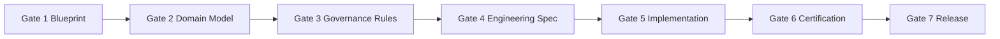
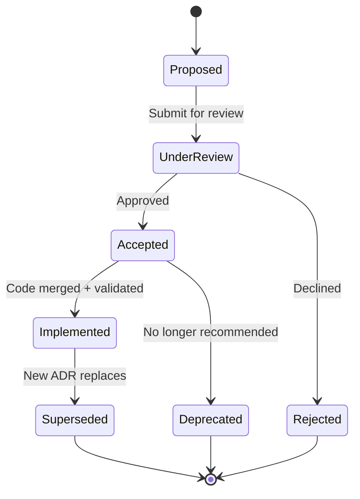
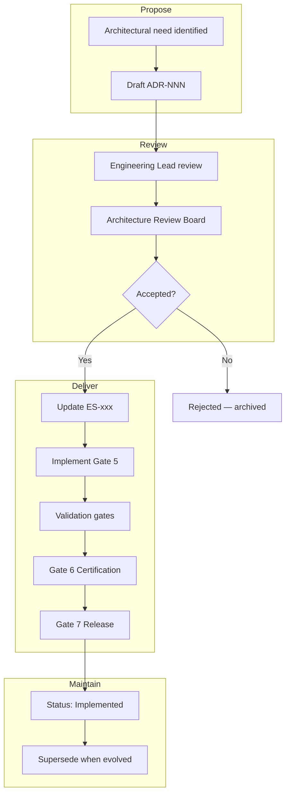

# ES-097 — ORION Architecture Governance & ADR Policy

**Document ID:** ES-097  
**Mission:** P-013.9 — ORION Architecture Governance & Architecture Decision Records (ADR)  
**Version:** 1.0  
**Status:** Ratified — Governing Engineering Standard  
**Classification:** Enterprise Architecture · Governance  
**Authority:** Chief Enterprise Architect  
**Effective Date:** August 2026  
**Architecture Baseline:** v1.0 Candidate  

**Parent:** [ORION Enterprise Architecture Handbook v1.0](./ORION_Enterprise_Architecture_Handbook_v1.0.md)  
**Related:** [G-001 Enterprise Architecture Governance Charter](../11_Governance/Governance/G-001-Enterprise-Architecture-Governance-Charter.md) · [G-001 Architecture Decision Process](../11_Governance/Governance/G-001-Architecture-Decision-Process.md) · [ES-052 ADR Framework](../02_Engineering/ES-052-Architecture-Decision-Record-Framework.md) · [ES-091 Enterprise Development Standards](./ES-091-ORION-Enterprise-Development-Standards.md) · [ES-096 Testing & Certification Standards](./ES-096-ORION-Enterprise-Testing-Certification-Standards.md) · [ADR-004 Technical Debt Governance](../11_Governance/ADR/ADR-004-Technical-Debt-Governance.md) · [ORION Decision Log](../10_Decisions/ORION_Decision_Log.md)

---

## Executive Summary

This specification defines the **official ORION Architecture Governance Framework and Architecture Decision Record (ADR) Policy** — the mandatory process for proposing, evaluating, approving, documenting, reviewing, and evolving architectural decisions across the ORION Platform.

These standards apply equally to:

- **Human architects and engineers**
- **AI assistants** (Cursor, automation agents)
- **Domain leads and platform owners**
- **Future contributors** (partners, contractors, acquired teams)

ES-097 is the **operational architecture governance constitution**. It does not replace [G-001](../11_Governance/Governance/G-001-Enterprise-Architecture-Governance-Charter.md) or the [ORION Canon](../00_FOUNDATION/ORION_CANON_v1.md). It **implements** them as repeatable governance rules and consolidates [ES-052](../02_Engineering/ES-052-Architecture-Decision-Record-Framework.md) into the v1.0 governance suite.

**Hierarchy of authority:**

```
ORION Canon  →  G-001 Charter  →  Architecture Handbook  →  ES-097 (this document)  →  ADR-xxx records
```

**Canonical ADR repository:** `docs/11_Governance/ADR/ADR-*.md`  
**Decision Log (broader decisions):** `docs/10_Decisions/decisions/DL-*.md`  
**ADR template:** [docs/ADR/ADR-TEMPLATE.md](../ADR/ADR-TEMPLATE.md)

---

## 1. Architecture Governance Philosophy

ORION architecture governance is governed by four foundational values. Every architectural decision — human or AI — shall be evaluated against them.

| # | Value | Rule |
|---|-------|------|
| 1 | **Long-term maintainability** | Prefer decisions that reduce future change cost over short-term convenience. |
| 2 | **Evidence-based decisions** | Architecture choices require documented rationale, alternatives, and risks — not opinion or model confidence alone. |
| 3 | **Platform consistency** | New domains and modules conform to established patterns unless an ADR documents justified deviation. |
| 4 | **Controlled evolution** | Change is welcome when governed: ADR → ES update → implementation → certification. |

### 1.1 Non-Negotiable Architectural Principles

From [G-001 §4](../11_Governance/Governance/G-001-Enterprise-Architecture-Governance-Charter.md#4-architectural-principles) — change only via ADR and architecture baseline update:

| Principle | Requirement |
|-----------|-------------|
| **Facade pattern** | Single public entry per domain (`lib/<domain>/index.ts`) |
| **Layered architecture** | API → Facade → Service → Repository → Store |
| **Organization isolation** | All operations scoped by `ServiceContext.organizationId` |
| **Event-driven integration** | Cross-domain communication via IIL — no direct repository reads |
| **Repository pattern** | Persistence behind interfaces |
| **Rules in engines** | Business validation in rules engines — not routes, UI, or orchestrators |
| **Dependency injection** | Constructor injection; composition root in wiring |

### 1.2 Governance Gates (Summary)

No implementation before Gates 1–4. No release before Gate 6 certification. No production tag before Gate 7.



ADRs may be required **before Gate 4** when the ES introduces architectural choices not covered by existing decisions.

### 1.3 Anti-Patterns (Prohibited)

| Anti-Pattern | Why Forbidden |
|--------------|---------------|
| Undocumented breaking API or facade change | Breaks consumer contracts |
| Architecture change without ADR when mandatory | No audit trail; blocks certification |
| Deleting superseded ADRs | Destroys institutional memory |
| AI implementing architectural change without human approval | No accountability |
| Silent technical debt instead of ADR/TD entry | Invisible risk |
| Bypassing Gates 1–4 without documented exception | Un governed scope creep |

---

## 2. Architecture Decision Records (ADR)

### 2.1 Purpose

ADRs preserve **why** ORION is built the way it is. They:

- Capture context, decision, alternatives, and consequences
- Enable onboarding without repeated debates
- Provide audit evidence for certification and release
- Link implementation to approved architecture

ADRs complement **Engineering Specifications (ES-xxx)** — ES documents *what* to build; ADRs document *why* a structural choice was made.

### 2.2 ADR Lifecycle



| Status | Meaning | May Implement? |
|--------|---------|----------------|
| **Proposed** | Draft under development | No |
| **Under Review** | Submitted to Architecture Review | No |
| **Accepted** | Approved for implementation | Yes |
| **Implemented** | Reflected in codebase; validated in release | Yes (maintain) |
| **Superseded** | Replaced by newer ADR | Follow new ADR only |
| **Deprecated** | Discouraged; retained for history | Migrate away |
| **Rejected** | Not adopted; rationale preserved | No |

### 2.3 Ownership

| Role | Responsibility |
|------|----------------|
| **Author** | Drafts ADR; identifies alternatives and risks |
| **Domain Lead** | Validates domain impact and business alignment |
| **Chief Architect** | Primary approver for most ADRs |
| **Chief Enterprise Architect** | Co-approver for cross-domain and platform ADRs |
| **Founder** | Approver for Canon-level or breaking strategic decisions |
| **Security Architect** | Required reviewer for auth, tenancy, PII ADRs |

### 2.4 Approval Process

| Step | Actor | Action |
|------|-------|--------|
| 1 | Author | Copy [ADR template](../ADR/ADR-TEMPLATE.md); assign next sequential number |
| 2 | Author | Complete Context, Problem, Decision, Alternatives, Consequences, Risks |
| 3 | Author | Submit PR with ADR in `docs/11_Governance/ADR/` |
| 4 | Engineering Lead | Technical feasibility review |
| 5 | Chief Architect (+ CEA if cross-domain) | Architecture review |
| 6 | Approver | Set status to **Accepted** |
| 7 | Implementer | Implement; reference ADR in PR, ES, and commits |
| 8 | Validator | Confirm in release; update status to **Implemented** |

Reference: [G-001 Architecture Decision Process](../11_Governance/Governance/G-001-Architecture-Decision-Process.md)

### 2.5 Superseding ADRs

1. **Never delete** superseded ADRs — update header only
2. New ADR **must link** to superseded ADR(s) in `## Superseded ADRs`
3. Superseded ADR header updated: `Superseded by ADR-NNN`
4. Related ES documents updated to reference new decision
5. Migration guide required if implementation changed
6. Re-certification if public contract affected

### 2.6 Archiving

| Action | Rule |
|--------|------|
| **Superseded** | Retain file; status = Superseded; link to replacement |
| **Rejected** | Retain file; status = Rejected; preserve rationale |
| **Deprecated** | Retain file; mark discouraged; no new implementations |
| **Implemented** | Active reference; review on architecture baseline bump |

**Numbering:** ADR-001, ADR-002, … sequential. **Numbers are never reused.**  
**Next available:** ADR-013

### 2.7 Current ADR Index

| ADR | Title | Status | Date |
|-----|-------|--------|------|
| [ADR-001](../11_Governance/ADR/ADR-001-Executive-Shell.md) | Executive Shell | Accepted | 2026-07-22 |
| [ADR-002](../11_Governance/ADR/ADR-002-Advisor-Default-Landing.md) | Advisor Default Landing | Accepted | 2026-07-23 |
| [ADR-003](../11_Governance/ADR/ADR-003-Global-Command-Palette.md) | Global Command Palette | Accepted | 2026-07-23 |
| [ADR-004](../11_Governance/ADR/ADR-004-Technical-Debt-Governance.md) | Technical Debt Governance | Accepted | 2026-07-23 |
| [ADR-005](../11_Governance/ADR/ADR-005-Business-Workspace-Architecture.md) | Business Workspace Architecture | Accepted | 2026-07-23 |
| [ADR-006](../11_Governance/ADR/ADR-006-Executive-Intelligence-Provider-Framework.md) | Executive Intelligence Provider Framework | Accepted | 2026-07-24 |
| [ADR-007](../11_Governance/ADR/ADR-007-Production-Persistence-Strategy.md) | Production Persistence Strategy | Accepted | 2026-08-01 |
| [ADR-008](../11_Governance/ADR/ADR-008-Enterprise-Identity-Authentication-Strategy.md) | Enterprise Identity & Authentication Strategy | Accepted | 2026-08-01 |
| [ADR-009](../11_Governance/ADR/ADR-009-Role-Based-Access-Control.md) | Role-Based Access Control (RBAC) | Accepted | 2026-08-01 |
| [ADR-010](../11_Governance/ADR/ADR-010-Configuration-Secrets-Management.md) | Configuration & Secrets Management | Accepted | 2026-08-01 |
| [ADR-011](../11_Governance/ADR/ADR-011-Observability-Architecture.md) | Observability Architecture | Accepted | 2026-08-01 |
| [ADR-012](../11_Governance/ADR/ADR-012-Deployment-Release-Strategy.md) | Deployment & Release Strategy | Accepted | 2026-08-01 |

**Production baseline:** [P-015.3 ADR Program](./P-015.3-Production-Architecture-ADR-Program.md) · Mission P-015.3 · August 2026

**Backlog priority:** ADR-013 durable IIL transport · ADR-014 intelligence path unification (TD-003).

### 2.8 ADR vs Decision Log (DL)

| Format | ID | Scope | Location |
|--------|-----|-------|----------|
| **ADR** | ADR-NNN | Platform structure, patterns, technology, breaking contracts | `docs/11_Governance/ADR/` |
| **DL** | DL-YYYY-NNN | Product, process, design, business — broader than pure architecture | `docs/10_Decisions/decisions/` |

Cross-reference ADRs and DL entries when related. Index maintained in [ORION Decision Log](../10_Decisions/ORION_Decision_Log.md).

---

## 3. When ADRs Are Mandatory

Create an ADR **before implementation** when a decision affects any row below. When uncertain, create an ADR — over-documentation is preferable to silent architecture drift.

| Trigger Category | Mandatory ADR When… | Example |
|------------------|---------------------|---------|
| **New frameworks** | Adopting or replacing application framework | Next.js major upgrade with routing change |
| **Persistence strategy** | Database, cache, or store technology selection | In-memory → PostgreSQL (TD-HCM-001 remediation) |
| **Messaging architecture** | Event bus, broker, or IIL transport change | In-memory queue → durable message broker |
| **Security model** | Trust boundaries, Zero Trust scope change | New tenant isolation model |
| **Authentication** | Session, SSO, OAuth strategy change | Production auth replacing placeholder session |
| **Authorization** | RBAC/ABAC model, permission matrix architecture | HCM fine-grained permissions (TD-HCM-005) |
| **API breaking changes** | Removing or renaming public REST/facade contracts | Facade method signature break |
| **Repository changes** | Swapping persistence layer affecting contracts | New repository implementation pattern |
| **Workflow engine changes** | Approval routing model or platform workflow architecture | New orchestration engine |
| **Technology stack changes** | Major version bumps with architectural impact | React 19 · Next.js 16 migration |
| **Major UI architecture** | New shell, workspace pattern, or design system break | Replacing Executive Shell |
| **Cross-domain integration** | New integration pattern between bounded contexts | Direct domain coupling proposal |
| **Accepted technical debt** | P0/P1 debt accepted instead of remediated | ADR + TD-xxx required |

**Not required:** routine bug fixes · internal refactors within approved ES · additive event payload fields · additive facade methods (ES update sufficient).

---

## 4. Architecture Review Board

The **Architecture Review Board (ARB)** operationalizes ES-097 and G-001 Gate reviews.

### 4.1 Responsibilities

| Responsibility | Detail |
|----------------|--------|
| Review major ADRs | Accept, reject, or request revision |
| Approve strategic decisions | Cross-domain and Canon-impacting choices |
| Resolve conflicts | When ES, ADR, or domain patterns disagree |
| Ensure consistency | Facade, IIL, layering, tenancy invariants |
| Maintain ADR repository | Index accuracy; template compliance |
| Gate 4 sign-off | Engineering Specification architectural alignment |

### 4.2 Membership

| Role | Participation |
|------|---------------|
| **Chief Enterprise Architect** | Chair; Gates 1–3; cross-domain ADRs |
| **Chief Architect** | Primary approver; Gates 4–6 |
| **Domain Leads** | Domain-scoped ADRs; impact assessment |
| **Security Architect** | Security, auth, PII ADRs (required) |
| **Platform Engineering Lead** | API, performance, integration ADRs |
| **Founder** | Breaking strategic decisions; Gate 7 |

### 4.3 Review Cadence

| Review Type | Cadence |
|-------------|---------|
| **ADR submission** | Per PR — async review within 5 business days |
| **Architecture standup** | Weekly — pending ADRs, debt, gate blockers |
| **ARB formal session** | Monthly — strategic ADRs, backlog, compliance metrics |
| **Pre-RC architecture review** | Per release candidate — checklist mandatory |

### 4.4 Decision Authority

| ADR Impact | Approvers Required |
|------------|-------------------|
| Single domain, non-breaking | Chief Architect |
| Cross-domain or platform | Chief Architect + Chief Enterprise Architect |
| Breaking public API or Canon | Founder + Chief Enterprise Architect |
| Security architecture | Security Architect + Chief Architect |

### 4.5 Conflict Resolution

1. **Document hierarchy** resolves normative conflicts: Canon → G-001 → Handbook → ES-097 → ADR → ES-xxx
2. If ADRs conflict, newer **Accepted** ADR supersedes older unless explicitly complementary
3. Unresolved conflicts escalate to Founder with written options analysis
4. Emergency decisions (§4.6) require post-hoc ARB ratification within 5 business days

### 4.6 Emergency Approvals

Per [G-001 §3.2](../11_Governance/Governance/G-001-Enterprise-Architecture-Governance-Charter.md#32-exceptions):

1. No architectural or public API change — OR documented hotfix scope only
2. Correctness or security fix
3. Post-incident ADR or TD entry within **5 business days**
4. Founder or Chief Architect approves in writing

Emergency path does **not** exempt validation gates (typecheck, lint, test, build).

---

## 5. Decision Criteria

Every ADR shall evaluate options against these criteria. Include a summary table in the ADR body.

| Criterion | Questions to Answer |
|-----------|---------------------|
| **Business value** | Does this advance executive outcomes? Which domain KPIs improve? |
| **Technical value** | Does this reduce complexity, improve testability, or enable future domains? |
| **Risk** | What fails if wrong? Security, tenancy, data loss, operational outage? |
| **Complexity** | Implementation and operational burden? Team skill fit? |
| **Maintainability** | Can future engineers understand and extend this in 2 years? |
| **Performance** | Latency, throughput, resource impact — measured or estimated? |
| **Security** | Tenancy, auth, audit, PII classification impact? |
| **Future evolution** | Does this enable or block Inventory, Procurement, Analytics, AI domains? |

### 5.1 Trade-Off Analysis (Required)

Every ADR from ADR-007 onward shall include:

- **Alternatives considered** (minimum 2 + status quo)
- **Reason for rejection** per alternative
- **Risks table** with likelihood, impact, mitigation
- **Long-term implications** — migration, lock-in, operational cost

**Exemplars:** [ADR-005](../11_Governance/ADR/ADR-005-Business-Workspace-Architecture.md) · [ADR-006](../11_Governance/ADR/ADR-006-Executive-Intelligence-Provider-Framework.md)

### 5.2 AI-Assisted ADR Authoring

AI assistants may draft ADRs but **shall not**:

- Set status to Accepted without human approver
- Skip alternatives or risks sections
- Approve their own architectural changes

Human approver verifies alignment with G-001 principles and existing ADR index before merge.

---

## 6. Technical Debt Governance

Technical debt governance is inseparable from architecture governance. Authority: [ADR-004](../11_Governance/ADR/ADR-004-Technical-Debt-Governance.md).

### 6.1 Debt Decision Actions

| Action | When | Artifact |
|--------|------|----------|
| **Accept** | Conscious compromise with mitigation plan | TD-xxx + owner + target release |
| **Defer** | Cannot fix now; workaround exists | TD-xxx P1/P2 + target release |
| **Reject** | Proposed shortcut violates architecture | Document in ADR or PR review |
| **Track** | All accepted/deferred items | [Technical Debt Register](../11_Governance/TECHNICAL_DEBT.md) |
| **Review** | Every certification and ARB monthly session | Update status and priority |
| **Retire** | Remediated in mission | Close TD-xxx; reference in release notes |

### 6.2 Debt and ADR Relationship

| Scenario | Required Action |
|----------|-----------------|
| Architectural compromise | ADR (acceptance rationale) + TD-xxx |
| P0 debt | Blocks GA; remediation plan mandatory |
| Accepted P0/P1 without ADR | **Not permitted** for architectural gaps |
| Inline code reference | `// TD-HCM-001: description` |

### 6.3 Release Impact

| Debt Class | Release Impact |
|------------|----------------|
| **Release blocker (P0)** | Must resolve or ADR-accept before GA |
| **Deferred (P1)** | CONDITIONAL GO with numbered remediation |
| **Known limitation (P2–P3)** | Document in release notes |
| **Future enhancement** | Roadmap — not debt |

Reference: [ES-096 §7](./ES-096-ORION-Enterprise-Testing-Certification-Standards.md#7-technical-debt)

---

## 7. Change Management

### 7.1 Change Classification

| Class | Definition | Governance |
|-------|------------|------------|
| **Minor** | Additive, backward compatible, within approved ES | Code review + quality gates |
| **Major** | New domain module, new platform service, significant ES scope | Gates 1–4 + ADR if architectural |
| **Breaking** | Removes or changes public facade, API, or event contract | ADR + semver major + migration guide |

### 7.2 Minor Changes

- Additive facade methods
- Additive event payload fields
- Internal refactor preserving public contract
- Documentation corrections

**Required:** ES update if public contract documented · code review · four validation gates.

### 7.3 Major Changes

- New domain package under `lib/`
- New platform module (P-010.x)
- New REST namespace
- Workflow template families

**Required:** Gates 1–4 · architecture review checklist · domain ES · certification plan.

### 7.4 Breaking Changes

- Facade method removal or signature change
- Required event field removal
- REST contract break
- Store schema break (when persistent)

**Required:** ADR · semver major bump · migration guide · re-certification · deprecation period where consumers exist.

### 7.5 Migration Planning

Every breaking ADR shall specify:

| Element | Content |
|---------|---------|
| **Consumer impact** | Domains, APIs, events affected |
| **Migration steps** | Ordered upgrade path |
| **Dual-run period** | If applicable — old + new parallel |
| **Rollback** | How to revert if migration fails |
| **Validation** | Tests proving migration success |

Reference: [G-001 §5 Migration Policy](../11_Governance/Governance/G-001-Enterprise-Architecture-Governance-Charter.md)

### 7.6 Rollback Strategy

- Release tags remain deployable for rollback
- Breaking migrations require backward-compatible rollback plan until GA stable
- Post-rollback: ADR review if architecture assumption invalidated

---

## 8. Architecture Compliance

Architecture compliance is enforced through reviews, gates, and certification — not optional self-attestation.

### 8.1 Code Reviews

Every PR touching architecture shall verify:

- [ ] Layering respected (no route → repository skips)
- [ ] Public facade-only external imports
- [ ] Organization isolation preserved
- [ ] ADR referenced if architectural change
- [ ] TD-xxx filed if compromise accepted
- [ ] Tests added for new behavior

Reference: [G-001 Approval Workflow](../11_Governance/Governance/G-001-Approval-Workflow.md) · [CODE_REVIEW_CHECKLIST](../08_Standards/CODE_REVIEW_CHECKLIST.md)

### 8.2 Architecture Reviews

Mandatory when:

- Gate 4 ES approval
- New domain or platform module
- Public facade or REST contract change
- Pre-RC release
- ADR submission (Under Review → Accepted)

Checklist: [G-001 Architecture Review Checklist](../11_Governance/Governance/G-001-Architecture-Review-Checklist.md)

### 8.3 Certification Gates

Gate 6 certification verifies architecture compliance via:

- Facade integration tests (no repository leakage)
- Event catalogue uniqueness tests
- Documentation certification tests
- Engineering health scoring (architecture consistency 20%)

Reference: [ES-096](./ES-096-ORION-Enterprise-Testing-Certification-Standards.md) · [G-001 Certification Process](../11_Governance/Governance/G-001-Certification-Process.md)

### 8.4 Audit Requirements

| Audit Type | When | Evidence |
|------------|------|------------|
| **Architecture baseline** | Major release | Handbook version + ADR index |
| **ADR compliance** | Monthly ARB | Open Proposed ADRs; Implemented validation |
| **Debt audit** | Certification | Register current; P0 ownership |
| **Standards cross-check** | P-013 governance missions | No contradictory ES-090–ES-096 rules |

---

## 9. Governance Metrics

Track architecture health over time. Report at monthly ARB and in certification reports.

### 9.1 Architecture Health

| Metric | Source | Target |
|--------|--------|--------|
| Engineering health score | S-001.1 dimensions | ≥ 75 for RC; ≥ 85 for GO |
| Architecture consistency score | Certification dimension | ≥ 80% |
| Facade boundary violations | Architecture tests | 0 |
| Undocumented breaking changes | Release audit | 0 |

### 9.2 Technical Debt

| Metric | Source | Target |
|--------|--------|--------|
| Open P0 count | TECHNICAL_DEBT.md | 0 at GA |
| P1 with owner + target | Domain registers | 100% |
| Debt age > 2 releases | ARB review | Escalate or ADR-accept |

### 9.3 ADR Adoption

| Metric | Source | Target |
|--------|--------|--------|
| Pending ADRs (Proposed/Under Review) | ADR index | < 30 days average resolution |
| ADR-001–003 acceptance | Backlog | Accept or reject by next baseline |
| Implemented ADRs without code validation | Release audit | 0 |
| PRs with mandatory ADR missing ADR | Sample audit | 0 |

### 9.4 Standards Compliance

| Metric | Source |
|--------|--------|
| ES-090–ES-097 ratification status | Governance index |
| Domain ES completeness | Certification tests |
| Four validation gates pass rate | CI |

### 9.5 Quality Trends

| Metric | Source |
|--------|--------|
| Test pass rate | `npm test` |
| Certification decision history | `docs/11_Governance/Certification/` |
| Regression count per release | Release notes |

---

## 10. Future Evolution

### 10.1 Annual Review

Chief Enterprise Architect shall conduct **annual architecture governance review**:

- ES-097 and sibling standards (ES-090–ES-096) still accurate
- ADR index complete; stale Pending resolved
- Governance metrics trends
- Maturity assessment vs enterprise targets

### 10.2 Versioning

| Document | Version Policy |
|----------|----------------|
| ES-097 | Semver in header; major = structural governance change |
| ADR-xxx | Immutable content; supersede — do not edit Accepted decisions except status/links |
| Architecture baseline | Updated at GA releases |

### 10.3 Governance Maturity Roadmap

| Maturity Level | Characteristics |
|----------------|-----------------|
| **Level 1 — Documented** | ADRs exist; gates defined (**current**) |
| **Level 2 — Enforced** | PR checks reference ADRs; Pending backlog cleared |
| **Level 3 — Measured** | Metrics dashboard; ARB cadence consistent |
| **Level 4 — Optimized** | AI-assisted ADR drafting with human approval; automated compliance hints |

**Current gaps (tracked):** ADR-001–003 pending · PR ADR reference not CI-enforced · extended template not on all legacy ADRs.

### 10.4 Continuous Improvement

Post-release and post-certification:

1. Update ADR status to Implemented when validated
2. File ADR if retrospective reveals undocument architectural choice
3. Update ES-097 only via governed mission (P-xxx) with CEA approval
4. Capture lessons in certification report Rationale section

---

## Output — Architecture Governance Framework

ES-097 establishes the **ORION Architecture Governance Framework**:

| Pillar | Standard |
|--------|----------|
| Philosophy | Maintainability, evidence, consistency, controlled evolution |
| Gates | G-001 Gates 1–7 with ADR triggers at Gate 4 |
| ADR repository | `docs/11_Governance/ADR/` — sequential numbering |
| Review board | ARB membership, cadence, authority matrix |
| Debt | ADR-004 + TD-xxx integration |
| Change | Minor / major / breaking classification |
| Compliance | Code review · architecture review · certification |
| Metrics | Health, debt, ADR adoption, quality trends |
| Evolution | Annual review · maturity roadmap |

---

## Output — ADR Policy Summary

**Create ADR when:** frameworks · persistence · messaging · security · auth · API breaks · repository · workflow · stack · major UI · cross-domain integration · accepted P0/P1 architectural debt.

**Lifecycle:** Proposed → Under Review → Accepted → Implemented → (Superseded | Deprecated) | Rejected

**Template:** [ADR-TEMPLATE.md](../ADR/ADR-TEMPLATE.md) — full template required for ADR-007+

**Approval:** Chief Architect (domain) · + CEA (cross-domain) · + Founder (Canon/breaking)

**Never:** delete ADRs · merge without review · skip alternatives on new ADRs

---

## Output — Governance Lifecycle



---

## Output — Compliance Model

| Layer | Mechanism | Blocking? |
|-------|-----------|-----------|
| **Principles** | G-001 §4 non-negotiables | Yes — via review |
| **ADR policy** | ES-097 §3 mandatory triggers | Yes — before implement |
| **Gates 1–4** | Blueprint → ES approval | Yes — before code |
| **PR review** | Architecture checklist + ADR ref | Yes — merge |
| **Automated gates** | typecheck · lint · test · build | Yes — CI |
| **Gate 6** | Certification GO / CONDITIONAL GO / NO-GO | Yes — release |
| **Gate 7** | Founder / Chief Architect tag approval | Yes — production tag |
| **Metrics** | ARB monthly · annual review | No — accountability |

---

## Cross-Reference Index — Governance Standards Suite

| Document | ID | Scope |
|----------|-----|-------|
| [Enterprise Architecture Handbook](./ORION_Enterprise_Architecture_Handbook_v1.0.md) | EA-HANDBOOK-001 | Patterns, lifecycle, Ch. 14 governance |
| [Next.js Enterprise Standards](./ES-090-ORION-NextJS-Enterprise-Standards.md) | ES-090 | App Router, API, folder structure |
| [Enterprise Development Standards](./ES-091-ORION-Enterprise-Development-Standards.md) | ES-091 | Engineering lifecycle, git, quality gates |
| [Enterprise Testing & Certification Standards](./ES-096-ORION-Enterprise-Testing-Certification-Standards.md) | ES-096 | Validation, certification, release readiness |
| **Architecture Governance & ADR Policy (this document)** | **ES-097** | **ADR policy, ARB, change management** |
| [G-001 Charter](../11_Governance/Governance/G-001-Enterprise-Architecture-Governance-Charter.md) | G-001 | Constitutional authority |
| [G-001 Architecture Decision Process](../11_Governance/Governance/G-001-Architecture-Decision-Process.md) | G-001 | Operational ADR steps |
| [ES-052 ADR Framework](../02_Engineering/ES-052-Architecture-Decision-Record-Framework.md) | ES-052 | Extended ADR programme detail |
| [ADR-004 Technical Debt](../11_Governance/ADR/ADR-004-Technical-Debt-Governance.md) | ADR-004 | Debt register policy |

*Note: Missions P-013.4–P-013.7 (ES-092 UI/UX · ES-093 API · ES-094 Events · ES-095 Workflow) are planned siblings — ES-097 references Handbook chapters for those domains until ratified.*

---

## Certification — ES-097 Ratification

Self-assessment for Mission P-013.9:

| Criterion | Result |
|-----------|--------|
| All 10 required sections documented | ✅ Pass |
| Aligned with G-001, Handbook Ch. 14, ES-052 | ✅ Pass |
| Canonical ADR path unified (`docs/11_Governance/ADR/`) | ✅ Pass |
| No contradictory rules vs ES-091, ES-096 | ✅ Pass |
| ADR mandatory triggers comprehensive | ✅ Pass |
| ARB, debt, change management defined | ✅ Pass |
| AI-assisted governance rules included | ✅ Pass |
| Cross-reference index complete | ✅ Pass |
| No production code changes (docs-only mission) | ✅ Pass |

### Decision: **GO**

ES-097 is **ratified** as the official ORION Architecture Governance Framework and ADR Policy, effective August 2026.

**Recommended follow-up (non-blocking):** Accept ADR-001–003 · adopt extended template on next revision · add ES-097 to Handbook Appendix B index.

---

## Appendix A — New ADR Checklist

- [ ] Next sequential number assigned (ADR-007+)
- [ ] Template copied from [ADR-TEMPLATE.md](../ADR/ADR-TEMPLATE.md)
- [ ] Context, Problem, Decision, Alternatives, Risks completed
- [ ] Mandatory trigger category identified (§3)
- [ ] PR submitted to `docs/11_Governance/ADR/`
- [ ] Engineering Lead technical review
- [ ] Chief Architect (+ CEA if cross-domain) approval
- [ ] Status set to Accepted before implementation
- [ ] Related ES-xxx updated
- [ ] Implementation PR references ADR-NNN
- [ ] Release validation → status Implemented
- [ ] Decision Log index updated if applicable

---

## Appendix B — ADR Quality Gates (Pre-Acceptance)

Before setting status to **Accepted**, confirm:

| Gate | Required |
|------|----------|
| Problem clearly defined | Yes |
| Decision unambiguous | Yes |
| Alternatives evaluated (≥ 2 + status quo) | Yes — ADR-007+ |
| Risks documented with mitigation | Yes — ADR-007+ |
| Related ES/D/ADR links complete | Yes |
| Approvers identified and signed | Yes |
| Implementation impact section complete | Yes — ADR-007+ |
| Migration strategy if breaking | Yes — when applicable |

---

*ORION Enterprise Platform · ES-097 · Architecture Governance & ADR Policy v1.0 · Mission P-013.9*
