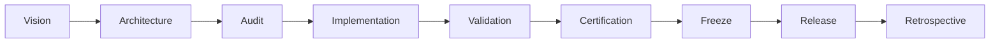
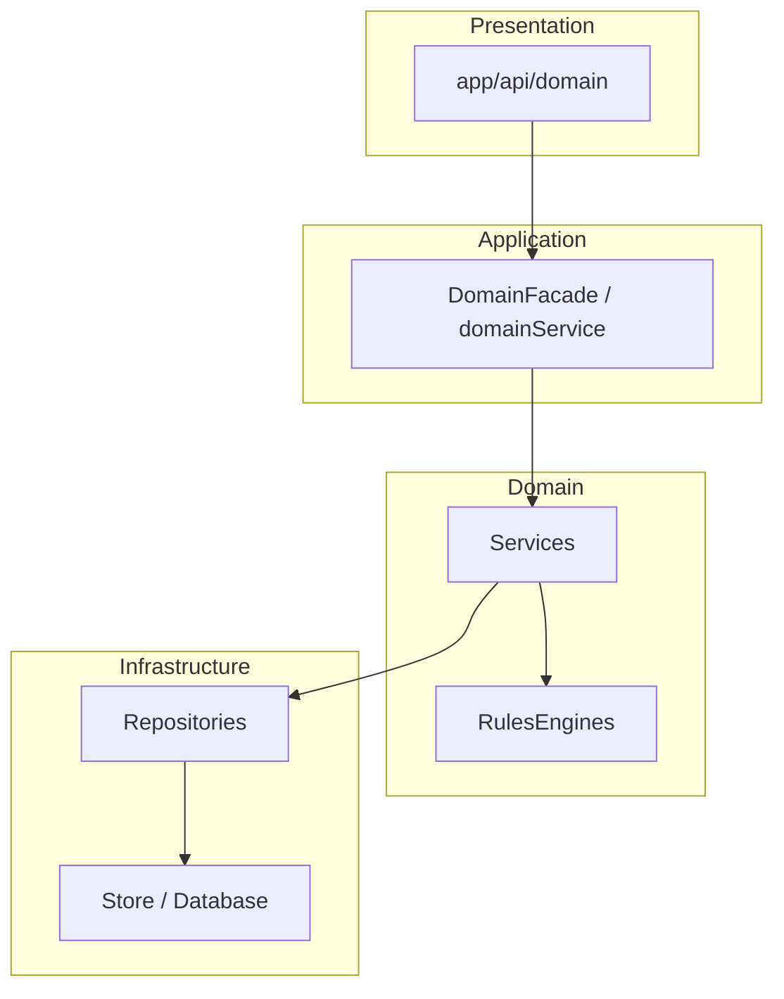
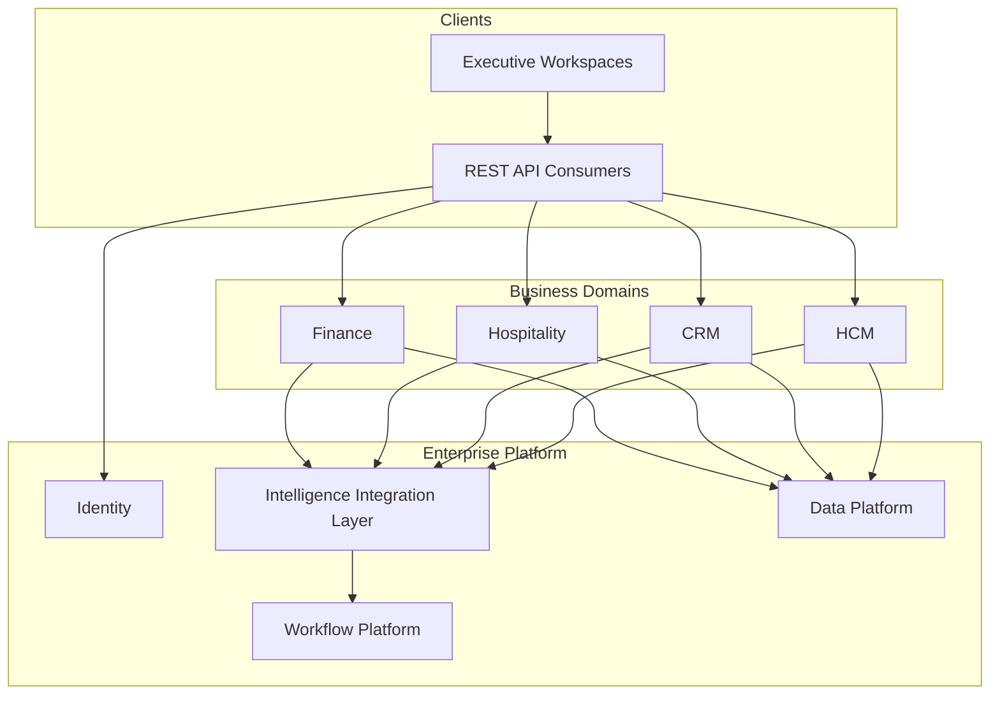

# ORION Enterprise Architecture Handbook

**Document ID:** EA-HANDBOOK-001  
**Version:** 1.0  
**Mission:** P-013.1 — ORION Enterprise Architecture Handbook  
**Status:** Ratified — Governing Engineering Standard  
**Classification:** Enterprise Architecture · Governance  
**Authority:** Chief Enterprise Architect  
**Effective Date:** August 2026  
**Architecture Baseline:** v1.0 Candidate  

**Supersedes:** Informal architecture guidance only — does not replace [G-001](../11_Governance/Governance/G-001-Enterprise-Architecture-Governance-Charter.md), ORION Canon, or domain engineering specifications  
**Complements:** [ORION Architecture Handbook (Product)](../03_Architecture/ORION_Architecture_Handbook.md) · [ORION Engineering Principles](../09_Standards/ORION_Engineering_Principles.md)

---

## Executive Summary

This handbook is the **official engineering standard** for the ORION Enterprise Platform. Every domain — Finance, Hospitality, Commercial (CRM), Human Capital Management, Data Platform, and all future domains — shall conform to the patterns, lifecycle, and governance rules defined herein.

ORION is an **Executive Operating System**: a multi-tenant enterprise platform that transforms operational data into explainable executive intelligence. Engineering success is measured not by feature count but by **architectural integrity**, **certification readiness**, and **release discipline**.

This document consolidates proven patterns from completed ORION missions:

| Pattern | Reference Implementation |
|---------|-------------------------|
| Facade + DI + Repository layering | [ES-HCM-001](../HCM/Engineering/ES-HCM-001_Enterprise_HCM_Engineering_Specification.md) · [ES-FIN-001](../Finance/Engineering/ES-FIN-001_Finance_Domain_Engineering_Specification.md) |
| Master data registry | [ES-DATA-001](../Data/Engineering/ES-DATA-001-Enterprise-Data-Platform-Engineering-Specification.md) |
| IIL event architecture | [P-006](../03_Architecture/P-006-Intelligence-Integration-Layer.md) |
| Governance & certification | [G-001](../11_Governance/Governance/G-001-Enterprise-Architecture-Governance-Charter.md) |
| Release management | [G-001 Release Guide](../11_Governance/Governance/G-001-Release-Governance-Guide.md) |

**Mandatory validation gates** for every mission:

```bash
npm run typecheck
npm run lint
npm test
npm run build
```

---

## Engineering Principles (Summary)

| # | Principle | Rule |
|---|-----------|------|
| 1 | **Single public facade** | External code imports one domain entry point only |
| 2 | **Layered dependency** | API → Facade → Service → Repository → Store |
| 3 | **Organization isolation** | Every operation scoped by `organizationId` |
| 4 | **Event-driven integration** | Cross-domain communication via IIL — never direct repository reads |
| 5 | **Rules in engines** | Status transitions and validation live in rules engines, not routes |
| 6 | **Certification before release** | Independent certification with GO / CONDITIONAL GO / NO-GO |
| 7 | **Documentation is deliverable** | ES-xxx specs and catalogues ship with code |
| 8 | **Explainability** | Business outcomes must be traceable — no black-box domain logic |
| 9 | **Deterministic core** | Same input → same output for business calculations |
| 10 | **Technical debt is governed** | All debt registered; release blockers classified explicitly |

Full product principles: [ORION Engineering Principles](../09_Standards/ORION_Engineering_Principles.md).

---

# Chapter 1 — Vision, Purpose, and Philosophy

## 1.1 Vision

ORION provides executives with a unified operating environment across finance, hospitality, commercial, workforce, and platform services. Each domain is a **bounded context** with a stable public contract, publishing events that feed intelligence, workflow, and cross-domain automation.

## 1.2 Purpose of This Handbook

This handbook answers:

- How ORION domains are structured
- How code shall be organized and reviewed
- How events, APIs, and security integrate
- How releases are certified and frozen

Domain-specific detail remains in **Engineering Specifications (ES-xxx)** and **Blueprints (D-xxx)**.

## 1.3 Engineering Philosophy

1. **Architecture before implementation** — Gates 1–4 of G-001 complete before coding.
2. **Contracts over convenience** — Public facades and event catalogues are versioned contracts.
3. **Testability by design** — Business logic runs without UI or framework dependencies.
4. **Progressive hardening** — Alpha → Beta → RC → GA with explicit entry/exit criteria.
5. **AI-assist compatible** — Clear folder conventions, naming, and layer rules enable safe automated development.

## 1.4 Enterprise Principles

| Principle | Description |
|-----------|-------------|
| Domain independence | Domains do not import each other's internal modules |
| Platform consumption | Domains consume certified platform services (Identity, IIL, Workflow, Data) |
| Tenant isolation | Organization scoping enforced at repository layer minimum |
| Auditability | Material mutations record actor and timestamp metadata |
| Backward-compatible events | Event payload changes require ADR unless additive |

---

# Chapter 2 — ORION Engineering Lifecycle

Every domain initiative follows the same lifecycle. No stage may be skipped without documented exception per G-001 §3.2.



| Phase | Deliverable | Authority |
|-------|-------------|-----------|
| **Vision** | Product mission, scope boundary | Product / Domain Lead |
| **Architecture** | Blueprint (D-xxx), domain model | Chief Enterprise Architect |
| **Audit** | Architecture review checklist | Architecture Review Board |
| **Implementation** | Code, tests, wiring | Engineering Lead |
| **Validation** | typecheck · lint · test · build | CI / Engineer |
| **Certification** | Independent GO / CONDITIONAL GO / NO-GO | Certification Authority |
| **Freeze** | Architecture baseline tag, feature freeze | Chief Architect |
| **Release** | Semantic version tag, release notes | Founder / Chief Architect |
| **Retrospective** | Debt register update, lessons learned | Domain Lead |

**Reference:** [G-001 Certification Process](../11_Governance/Governance/G-001-Certification-Process.md) · [G-001 Release Governance](../11_Governance/Governance/G-001-Release-Governance-Guide.md)

### Certification Outcomes

| Decision | Meaning |
|----------|---------|
| **GO** | Approved for release at declared scope |
| **CONDITIONAL GO** | Approved with numbered remediation before production |
| **NO-GO** | Blocking defects — no release |

Example: Enterprise HCM v1.0 RC1 certified **CONDITIONAL GO** pending persistent storage and permission hooks ([HCM Technical Debt](../HCM/Engineering/HCM-Technical-Debt-Register.md)).

---

# Chapter 3 — Domain Architecture

## 3.1 Bounded Contexts

Each ORION business domain is a bounded context with:

- Own package under `lib/<domain>/`
- Own types under `types/<domain>-*.ts` or `types/<domain>/`
- Own REST namespace under `app/api/<domain>/`
- Own engineering specification `ES-<DOM>-001`
- Own event catalogue

| Domain | Package | ES | Status |
|--------|---------|-----|--------|
| Finance | `lib/finance/` | ES-FIN-001 | Implemented |
| Hospitality | `lib/hospitality/` | ES (workspace) | Implemented |
| Commercial (CRM) | `lib/crm/` | ES-027 + missions | Implemented |
| HCM | `lib/hcm/` | ES-HCM-001 | v1.0 RC |
| Data Platform | `lib/platform/data/` | ES-DATA-001 | Implemented |
| Platform (IIL, Workflow) | `lib/platform/` | P-006 | Implemented |

Future domains (Inventory, Procurement, Analytics, AI) **must** follow the same structure before Gate 5 approval.

## 3.2 Layered Architecture

Standard call chain for all domains:

```
REST API route  →  Domain Facade  →  Business Service  →  Repository Interface  →  Repository  →  Store
```



**Invariant:** No layer may skip adjacent layers downward.

## 3.3 Domain Independence

| Allowed | Forbidden |
|---------|-----------|
| Import domain public facade | Import domain repositories |
| Publish/subscribe IIL events | Direct SQL/API calls to another domain's store |
| Consume platform services | Embed another domain's business rules |

## 3.4 Organization Isolation

Every repository method accepts `organizationId` as a scope parameter. Services derive scope from `ServiceContext.organizationId`. Cross-tenant access returns null or empty — never foreign records.

```typescript
type ServiceContext = {
  organizationId: string;
  workspaceId: string;
  userId: string;
  role: string;
};
```

---

# Chapter 4 — Repository Pattern

## 4.1 Purpose

Repositories abstract persistence. Domain services depend on **interfaces**, not storage technology.

## 4.2 Interface Rules

| Rule | Description |
|------|-------------|
| Domain discriminator | `readonly domain: "<domain>"` on repository type |
| Org-scoped queries | First parameter `organizationId: string` |
| Immutable returns | Prefer `readonly` arrays and records |
| No business rules | Repositories persist and query — do not validate transitions |
| Contract first | Interface defined before implementation |

## 4.3 Implementations

| Environment | Implementation |
|-------------|----------------|
| Development / CI | In-memory store (e.g. `InMemoryHcmStore`) |
| Production | Database-backed adapter (future — same interface) |

Factory pattern example: `createFoundationRepositories(store)` in HCM.

## 4.4 Persistence Independence

Swapping in-memory for PostgreSQL (or other) requires **zero changes** to services or facade signatures when repository contracts are respected.

## 4.5 Repository Rules (Summary)

1. One repository interface per aggregate or aggregate group.
2. No repository exported from public domain index.
3. No Next.js or React imports in repositories.
4. Search methods support pagination parameters where lists are large.
5. Count methods accompany search when API pagination requires totals.

**Reference:** [HCM Foundation Repository tests](../../tests/lib/hcm/FoundationRepository.test.ts) · [ES-DATA-001 § Repository Architecture](../Data/Engineering/ES-DATA-001-Enterprise-Data-Platform-Engineering-Specification.md)

---

# Chapter 5 — Business Services

## 5.1 Responsibilities

Services orchestrate use cases:

- Load aggregates via repositories
- Invoke rules engines for validation and transitions
- Persist changes
- Publish domain events (or delegate to event-aware facade wrapper)
- Throw domain errors with stable `SCREAMING_SNAKE_CASE` codes

Services **shall not**:

- Handle HTTP concerns
- Import from `app/`
- Bypass rules engines for status changes

## 5.2 Validation

Validation occurs in two layers:

| Layer | Responsibility |
|-------|----------------|
| **Rules engine** | Invariants, state machines, cross-field rules |
| **Service** | Orchestration, existence checks, orchestrating multiple repos |

## 5.3 Dependency Injection

Central wiring function per domain constructs the object graph:

| Domain | Wiring Module |
|--------|---------------|
| HCM | `lib/hcm/createHcmWiring.ts` |
| Finance | `lib/finance/` (facade constructor) |

Wiring responsibilities:

1. Bootstrap seed/reference data
2. Instantiate repositories
3. Instantiate services with repository dependencies
4. Register IIL subscribers
5. Return wiring consumed by facade constructor

## 5.4 Service Rules (Summary)

1. Accept `ServiceContext` as final parameter.
2. Use `organizationId` from context for all repository calls.
3. Throw `Error` with domain code — never generic strings without code.
4. Keep services focused — one service per aggregate or capability group.

---

# Chapter 6 — Rules Engine Pattern

## 6.1 Purpose

Rules engines encapsulate **pure business rules**: validation, state transition guards, and calculation preconditions. They have no I/O, no repository access, and no side effects.

## 6.2 Responsibilities

| Responsibility | Example |
|----------------|---------|
| Status transitions | `assertStatusTransition(from, to)` |
| Format validation | Email, date range, code format |
| Hierarchy rules | Circular reporting detection |
| Policy guards | Leave balance, payroll period state |

## 6.3 Examples (HCM)

| Engine | Module |
|--------|--------|
| `OrganizationRulesEngine` | Org hierarchy, duplicate codes |
| `EmployeeRulesEngine` | Identity validation, employee status |
| `EmploymentRulesEngine` | Employment lifecycle transitions |
| `RecruitmentRulesEngine` | Candidate/application/offer transitions |
| `OnboardingRulesEngine` | Process and document rules |
| `TimeRulesEngine` | Attendance, leave, roster policies |

## 6.4 Rules

1. Rules engines are **internal** — never exported from public domain index.
2. Unit test rules engines in isolation.
3. All status changes pass through rules engine assertion.
4. Error codes thrown by rules engines propagate to API layer unchanged.

---

# Chapter 7 — Facade Pattern

## 7.1 Purpose

The domain facade is the **sole public entry point** for all domain operations.

```typescript
import { hcmFacade } from "@/lib/hcm";
import { financeService } from "@/lib/finance";
```

## 7.2 Public API Structure

| Style | Use Case |
|-------|----------|
| Flat methods | Foundation operations (`createEmployee`, `listOrgUnits`) |
| Grouped services | Operational modules (`hcmFacade.attendance`, `hcmFacade.payroll`) |
| Metadata methods | `getDomainStatus()`, `getWorkspaceBootstrap(context)` |

## 7.3 Internal Encapsulation

**Not exported** from public domain index:

- Repositories and store
- Rules engines
- Internal facades (e.g. `HcmFoundationFacade`)
- Wiring factories
- Repository implementations

Verification: facade integration tests assert internal symbols are `undefined` on public surface.

## 7.4 Facade Rules

1. One singleton or factory export per domain (`hcmFacade`, `financeService`).
2. Every public method accepts `ServiceContext`.
3. Foundation mutations may use event-aware wrappers that publish IIL events after success.
4. Facade shall not contain business rules — delegate to services.
5. Breaking facade changes require ADR and semver major bump.

**Reference:** [HCM Facade Integration tests](../../tests/lib/hcm/HcmFacadeIntegration.test.ts)

---

# Chapter 8 — Enterprise Events

## 8.1 Intelligence Integration Layer (IIL)

IIL is the **sole cross-domain event bus**. Domains publish events; consumers subscribe. Direct database reads between domains are prohibited.

**Reference:** [P-006 — IIL Architecture](../03_Architecture/P-006-Intelligence-Integration-Layer.md)

## 8.2 Event Envelope

| Field | Purpose |
|-------|---------|
| `eventType` | Platform type (`CustomEvent`, `DecisionCreated`, …) |
| `sourceService` | Publisher service ID (e.g. `hcm-workspace`) |
| `sourceWorkspace` | Originating workspace |
| `organizationId` | Tenant scope |
| `entityType` / `entityId` | Business entity reference |
| `actorId` | Authenticated user |
| `correlationId` | Trace related operations |
| `payload` | Domain-specific data including domain discriminator |

Domain events typically use `CustomEvent` with `payload.<domain>EventType` discriminator (e.g. `payload.hcmEventType`).

## 8.3 Publishers

| Publisher Type | When |
|----------------|------|
| Event-aware facade wrapper | Foundation lifecycle mutations (HCM pattern) |
| Domain service | Operational events (time, payroll, talent) |
| Dedicated publisher class | `HcmEventPublisher` — centralizes payload shape |

## 8.4 Subscribers

Register via domain wiring:

```typescript
service.subscribe({ subscriberId, eventTypes, priority }, handler);
```

Example: `workflow-platform` subscriber filters `sourceService = hcm-workspace` and dispatches workflow requests.

## 8.5 Workflow Integration

`HcmWorkflowOrchestrator` pattern (applicable to all domains):

1. Receive IIL event
2. Map event type to workflow template key
3. Dispatch `WorkflowRequested` — **no business validation, no persistence**

Workflow orchestrators are **integration adapters**, not domain services.

## 8.6 Event Catalogue

Every domain maintains an **Event Catalogue** document listing:

- Event name
- Publisher
- Trigger
- Payload fields
- Workflow template (if any)
- Subscribers

Catalogue uniqueness enforced in code (e.g. `assertUniqueHcmEventCatalog()`).

**Reference:** [HCM Event Catalogue](../HCM/Engineering/HCM-Event-Catalogue.md) · [D-008 Financial Event Model](../Finance/Blueprints/D-008_Enterprise_Financial_Event_Model.md)

---

# Chapter 9 — REST API Standards

## 9.1 Routing

| Rule | Convention |
|------|------------|
| Namespace | `/api/<domain>/` |
| Resources | Plural nouns (`/employees`, `/organization/units`) |
| Actions | Verb subpaths (`/activate`, `/terminate`, `/publish`) |
| Dynamic IDs | `[id]` route segments |
| Delegation | **Every route calls domain facade only** |

## 9.2 Response Envelope

Success:

```json
{ "success": true, "data": { } }
```

Created:

```json
{ "success": true, "data": { } }
```

HTTP 201 for creates.

Error:

```json
{ "success": false, "error": "DOMAIN_ERROR_CODE" }
```

No stack traces. No internal details.

## 9.3 Error HTTP Mapping

| Error Pattern | HTTP Status |
|---------------|-------------|
| `*_NOT_FOUND` | 404 |
| `DUPLICATE_*` | 409 |
| `INVALID_*`, `MISSING_PARAMS` | 400 |
| `CIRCULAR_*`, policy violations | 422 |
| Unhandled | 400 (with stable code) |

Shared helpers: `lib/<domain>/api/` (see HCM: `hcmOk`, `hcmError`, `hcmFromError`).

## 9.4 Pagination

List responses:

```json
{
  "success": true,
  "data": {
    "items": [],
    "pagination": { "page": 1, "pageSize": 50, "total": 0 }
  }
}
```

Query parameters: `page`, `pageSize`. Defaults: page 1, pageSize 50.

## 9.5 Filtering and Sorting

- Filters via query parameters matching search query types
- Sorting conventions documented per resource in API Catalogue
- Organization scope implicit from session — never accept override `organizationId` from client without authorization

## 9.6 Security (API Layer)

- Resolve `ServiceContext` from authenticated session
- Reject or default safely when session absent (development defaults documented)
- Validate required body fields before facade call
- Return 404 for missing resources — not 500

**Reference:** [HCM API Catalogue](../HCM/Engineering/HCM-API-Catalogue.md)

---

# Chapter 10 — Security

## 10.1 Organization Isolation

Primary multi-tenancy control. Enforced at repository layer; verified by integration tests with two organization contexts.

## 10.2 Permissions

Platform session provides `userId` and `role`. Fine-grained domain permission matrices are **recommended before production** for sensitive domains (HCM, Finance).

Permission hooks attach at API route layer or platform middleware — not inside repositories.

## 10.3 Audit Metadata

Domain records include where applicable:

- `createdAt`, `updatedAt`
- `createdBy`, `updatedBy`
- `version` (optimistic concurrency)

Material mutations publish IIL events with `actorId`.

## 10.4 Sensitive Data

- API returns domain records — classify endpoints in operational guides
- PII fields governed by [D-013 Data Governance](../Data/Governance/D-013_Enterprise_Data_Governance.md)
- Error responses expose domain codes only

**Reference:** [ES-059 Platform Security](../02_Engineering/ES-059-ORION-Platform-Security-Zero-Trust-Architecture.md)

---

# Chapter 11 — Testing

## 11.1 Test Pyramid

| Level | Scope | Location |
|-------|-------|----------|
| **Unit** | Rules engines, pure functions | `tests/lib/<domain>/` |
| **Service** | Business operations with mock repos | `tests/lib/<domain>/` |
| **Repository** | Contract, org isolation | `tests/lib/<domain>/` |
| **Facade integration** | Public surface, no leakage | `tests/lib/<domain>/` |
| **Events** | IIL publication, subscribers | `tests/lib/<domain>/` |
| **API integration** | Response envelopes, route handlers | `tests/lib/<domain>/` or `tests/app/api/` |
| **Certification** | Doc inventory, domain status | `tests/lib/<domain>/*Certification*` |

## 11.2 Architecture Tests

Assert:

- Facade does not expose repositories or stores
- Event catalogue has no duplicates
- Required documentation files exist on disk
- Domain status flags align with implementation

## 11.3 Certification Tests

Independent certification missions produce GO / CONDITIONAL GO / NO-GO without modifying code under review.

## 11.4 Required Gates

All four commands must pass before certification:

```bash
npm run typecheck && npm run lint && npm test && npm run build
```

Lint **errors** block release. Warnings tracked but do not block unless escalated.

**Reference:** [HCM Testing Guide](../HCM/Engineering/HCM-Testing-Guide.md) · [G-001 Certification Process](../11_Governance/Governance/G-001-Certification-Process.md)

---

# Chapter 12 — Documentation Standards

Every certified domain ships a **documentation suite**:

| Document | ID Pattern | Purpose |
|----------|------------|---------|
| Engineering Specification | ES-`<DOM>`-001 | Authoritative engineering contract |
| Architecture Guide | `<DOM>-Architecture-Guide` | Layering, DI, integration diagrams |
| Package Guide | `<DOM>-Package-Guide` | Folder layout, naming |
| Developer Guide | `<DOM>-Developer-Guide` | Getting started, examples |
| Dependency Matrix | `<DOM>-Dependency-Matrix` | Allowed/forbidden imports |
| API Catalogue | `<DOM>-API-Catalogue` | Facade + REST inventory |
| Event Catalogue | `<DOM>-Event-Catalogue` | Outbound events, workflow triggers |
| Testing Guide | `<DOM>-Testing-Guide` | Test suites, gates |
| Operational Guide | `<DOM>-Operational-Guide` | Runtime, troubleshooting |
| Technical Debt Register | `<DOM>-Technical-Debt-Register` | Classified debt |
| Release Notes | `<DOM>-Release-Notes` | Version delivery summary |

Legacy mission docs may point to authoritative catalogues (see P-012.6 → HCM-API-Catalogue pattern).

Documentation is validated by certification tests (`existsSync` checks).

---

# Chapter 13 — Release Management

## 13.1 Semantic Versioning

| Component | Meaning |
|-----------|---------|
| **MAJOR** | Breaking public facade or event contract |
| **MINOR** | Additive features, backward compatible |
| **PATCH** | Bug fixes, no contract change |

Pre-release tags: `-alpha`, `-beta`, `-rc.n`

## 13.2 Release Candidates

RC rules:

1. Feature freeze declared
2. All quality gates pass for domain scope
3. Independent certification ≥ CONDITIONAL GO
4. Tag pattern: `v<major>.<minor>.<patch>-rc<n>` or domain-specific RC tag
5. Only P0/P1 fixes permitted on RC branch

Example workflow:

```bash
git checkout -b release/v1.0.0-rc1
# certification commit
git tag -a v1.0.0-rc1 -m "Enterprise HCM Release Candidate 1"
git push origin release/v1.0.0-rc1
git push origin v1.0.0-rc1
```

## 13.3 Production Releases

GA requires:

- Gate 7 release approval
- Two consecutive RC cycles without P0/P1 regressions (per G-001)
- Technical debt register current
- Release notes published

## 13.4 Hotfixes

Hotfixes branch from GA tag. May bypass Gates 1–4 only when:

1. No architectural or public API change
2. Correctness or security fix only
3. ADR exception recorded if facade touched

**Reference:** [G-001 Release Governance Guide](../11_Governance/Governance/G-001-Release-Governance-Guide.md)

---

# Chapter 14 — Architecture Governance

## 14.1 ADR Process

Architecture Decision Records required when decisions affect platform structure, persistence, auth, public API, or cross-domain integration.

| Status | Meaning |
|--------|---------|
| Proposed | Under discussion |
| Accepted | Approved — may implement |
| Implemented | Merged to codebase |
| Superseded | Replaced by newer ADR |
| Deprecated | No longer recommended |

Storage: `docs/11_Governance/ADR/ADR-*.md`  
Template: [ADR Template](../ADR/ADR-TEMPLATE.md)  
Process: [G-001 Architecture Decision Process](../11_Governance/Governance/G-001-Architecture-Decision-Process.md)

## 14.2 Technical Debt

All debt entries in [Technical Debt Register](../11_Governance/TECHNICAL_DEBT.md) with classification:

| Class | Release Impact |
|-------|----------------|
| **Release blocker** | Must resolve before production |
| **Deferred** | Documented; facade/API workaround exists |
| **Known limitation** | Accepted for current version |
| **Future enhancement** | Not debt — roadmap item |

Governance: [ADR-004 Technical Debt](../11_Governance/ADR/ADR-004-Technical-Debt-Governance.md)

## 14.3 Architecture Reviews

Use [Architecture Review Checklist](../11_Governance/Governance/G-001-Architecture-Review-Checklist.md) at Gate 1 and before RC.

## 14.4 Change Approval

| Change Type | Approval |
|-------------|----------|
| New domain | Gates 1–7 full cycle |
| Additive facade method | ES update + code review |
| Breaking facade change | ADR + major version |
| Event payload breaking change | ADR + migration plan |
| Emergency hotfix | Engineering Lead + post-hoc review |

---

# Chapter 15 — Coding Standards

## 15.1 Folder Structure

```
lib/<domain>/
├── index.ts                 # Public facade export ONLY
├── constants.ts
├── create<Domain>Wiring.ts  # DI bootstrap
├── api/                     # REST shared helpers (optional)
├── common/                  # IDs, time utilities
├── events/                  # Publishers, subscribers, catalog
├── workflow/                # Workflow orchestrators
├── <module>/
│   ├── services/
│   ├── repositories/
│   └── <Module>RulesEngine.ts
└── data/                    # Store, seeds, repo factories

app/api/<domain>/            # REST routes

types/<domain>-*.ts          # Domain types

tests/lib/<domain>/          # Domain tests

docs/<Domain>/Engineering/   # ES-xxx and guides
```

## 15.2 Naming

| Artifact | Convention |
|----------|------------|
| Service | `<Domain>Service` or capability name |
| Repository | `<Entity>Repository` |
| In-memory repo | `InMemory<Entity>Repository` |
| Rules engine | `<Domain>RulesEngine` |
| Facade | `<Domain>Facade` or `<domain>Service` |
| Error codes | `SCREAMING_SNAKE_CASE` |
| Events | PascalCase verb phrase |
| Missions | `P-<epic>.<n>` implementation · `S-<sprint>.<n>` integration |

## 15.3 Imports

**External consumers:**

```typescript
import { hcmFacade } from "@/lib/hcm";           // ✓
import { EmployeeService } from "@/lib/hcm/..."; // ✗
```

**API routes:**

```typescript
import { hcmFacade } from "@/lib/hcm";           // ✓
import { getHcmApiContext } from "@/lib/hcm/api"; // ✓
```

Domain dependency matrices document allowed imports per layer.

## 15.4 Dependencies

- Domains depend on `@/types/*` and `@/lib/platform/*` — not other domains
- Platform does not depend on business domains
- Shared utilities live in platform or domain `common/` — not duplicated

## 15.5 Next.js Conventions

- API routes: `app/api/<domain>//**/route.ts`
- `export const dynamic = "force-dynamic"` for authenticated routes
- Route params: `{ params: Promise<{ id: string }> }` (Next.js 15+ pattern)
- No business logic in React components — delegate to facades via server actions or API

## 15.6 TypeScript Rules

- Strict mode enabled project-wide
- Prefer `readonly` on domain records and arrays
- Explicit return types on public facade methods
- No `any` in domain services
- Domain error codes as string literals — not magic numbers

**Reference:** [Engineering Standards](../09_Standards/Engineering_Standards.md)

---

# Chapter 16 — Platform Evolution

## 16.1 How Future Domains Must Be Built

Every new domain **shall** complete before production:

1. Blueprint (D-xxx) — Gate 1
2. Domain model types — Gate 2
3. Governance rules — Gate 3
4. Engineering Specification (ES-xxx) — Gate 4
5. Implementation with full layer stack — Gate 5
6. Certification — Gate 6
7. Release — Gate 7

Minimum deliverables matching HCM v1.0 reference:

- [ ] Public facade singleton
- [ ] Central wiring / DI
- [ ] Repository interfaces + in-memory implementations
- [ ] Rules engines for all status transitions
- [ ] IIL event catalogue + unique guard
- [ ] Workflow subscriptions (if applicable)
- [ ] REST API with standard envelopes (or documented facade-only scope)
- [ ] Full documentation suite (Chapter 12)
- [ ] Certification test file
- [ ] Technical debt register

## 16.2 Domain Roadmap

| Domain | Epic | Handbook Compliance |
|--------|------|---------------------|
| **Finance** | P-009 | ES-FIN-001 aligned — facade, events, GL pipeline |
| **CRM / Commercial** | P-008 | Workspace + party model — extend ES formalization |
| **Hospitality** | P-007 | Service-oriented — migrate toward facade pattern where gaps exist |
| **HCM** | P-012 | **Reference implementation** — ES-HCM-001 certified RC |
| **Data Platform** | P-011 | ES-DATA-001 — registry, sync, validation |
| **Inventory** | Planned | Must adopt handbook before Gate 5 |
| **Procurement** | Planned | Must adopt handbook before Gate 5 |
| **Analytics** | Planned | Read-only consumers of IIL + domain facades |
| **AI / Copilot** | Planned | Explains deterministic core — never mutates ledger or HR state directly |

## 16.3 Convergence Strategy

Existing domains with pre-handbook patterns shall converge during major version bumps:

1. Introduce or unify public facade
2. Move business logic behind services
3. Add event catalogues
4. Rationalize REST envelopes
5. Certify independently

No big-bang rewrites — mission-by-mission convergence.

---

# Appendix A — Architecture Diagram (Platform)



---

# Appendix B — Cross-Reference Index

| Topic | Document |
|-------|----------|
| Governance charter | [G-001](../11_Governance/Governance/G-001-Enterprise-Architecture-Governance-Charter.md) |
| Certification | [G-001 Certification](../11_Governance/Governance/G-001-Certification-Process.md) |
| Release lifecycle | [G-001 Release](../11_Governance/Governance/G-001-Release-Governance-Guide.md) |
| Architecture review | [G-001 Checklist](../11_Governance/Governance/G-001-Architecture-Review-Checklist.md) |
| Technical debt | [TECHNICAL_DEBT](../11_Governance/TECHNICAL_DEBT.md) |
| HCM reference ES | [ES-HCM-001](../HCM/Engineering/ES-HCM-001_Enterprise_HCM_Engineering_Specification.md) |
| Finance reference ES | [ES-FIN-001](../Finance/Engineering/ES-FIN-001_Finance_Domain_Engineering_Specification.md) |
| Data reference ES | [ES-DATA-001](../Data/Engineering/ES-DATA-001-Enterprise-Data-Platform-Engineering-Specification.md) |
| IIL architecture | [P-006](../03_Architecture/P-006-Intelligence-Integration-Layer.md) |
| Product architecture | [ORION Architecture Handbook](../03_Architecture/ORION_Architecture_Handbook.md) |
| Engineering principles | [ORION Engineering Principles](../09_Standards/ORION_Engineering_Principles.md) |
| Architecture freeze | [ARCHITECTURE_FREEZE_v0.3](../11_Governance/Architecture/ARCHITECTURE_FREEZE_v0.3.md) |

---

# Appendix C — Terminology

| Term | Definition |
|------|------------|
| **Facade** | Single public domain entry point |
| **ServiceContext** | Tenant-scoped operation context |
| **IIL** | Intelligence Integration Layer — event bus |
| **ES-xxx** | Domain engineering specification |
| **D-xxx** | Architecture blueprint |
| **G-001** | Enterprise architecture governance charter |
| **ADR** | Architecture Decision Record |
| **RC** | Release Candidate |
| **GA** | General Availability |

---

*ORION Enterprise Platform · Enterprise Architecture Handbook v1.0 · Mission P-013.1 · Governing standard for all domains*
