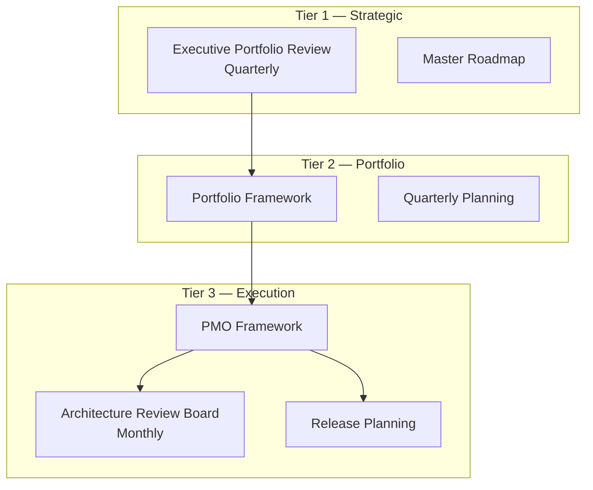
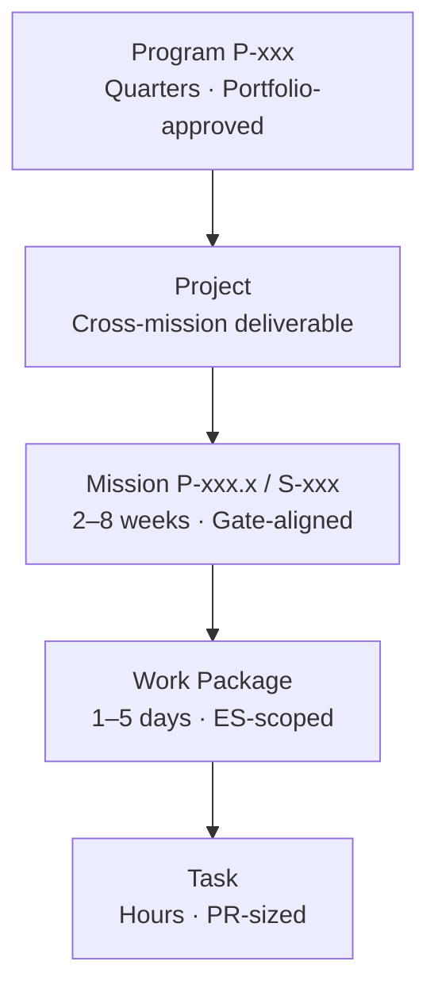
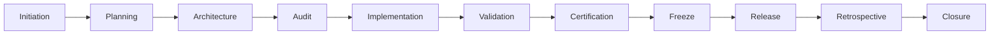
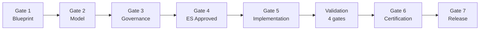
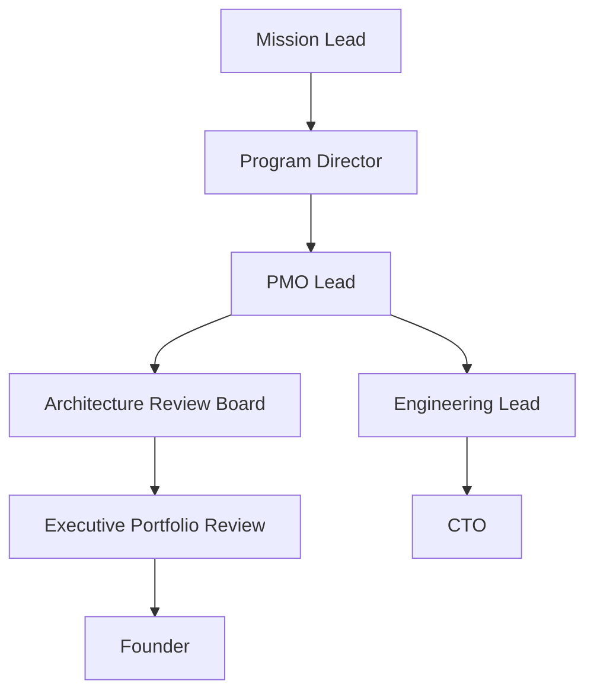

# ORION Enterprise Program Management Office (PMO) Framework

**Document ID:** PMO-001  
**Mission:** P-014.4 — ORION Enterprise Program Management Office Framework  
**Version:** 1.0  
**Status:** Ratified — Governing Program Management Standard  
**Classification:** Executive PMO · Program Governance · Execution  
**Authority:** Chief Enterprise Architect  
**Effective Date:** August 2026  
**Planning Horizon:** 2026–2031  
**Architecture Baseline:** v1.0 Candidate (RC)

**Parent:** [Portfolio Management Framework](./ORION_Enterprise_Portfolio_Management_Framework.md) · [G-001 Enterprise Architecture Governance Charter](../11_Governance/Governance/G-001-Enterprise-Architecture-Governance-Charter.md)  
**Baseline Sources:** [Enterprise Architecture Handbook v1.0](./ORION_Enterprise_Architecture_Handbook_v1.0.md) · [Master Roadmap v1.0](./ORION_Enterprise_Platform_Master_Roadmap_v1.0.md) · [ES-097 ADR Policy](./ES-097-ORION-Architecture-Governance-ADR-Policy.md) · [Release Policy](../06_Releases/Release-Policy.md) · [ES-091 Development Standards](./ES-091-ORION-Enterprise-Development-Standards.md) · [ES-096 Testing & Certification Standards](./ES-096-ORION-Enterprise-Testing-Certification-Standards.md)

**Hierarchy of authority:**

```
ORION Canon → G-001 Charter → Master Roadmap → Portfolio Framework → PMO Framework (this document) → Program Charters → Missions
```

---

## Executive Summary

ORION executes work through **engineering programs**, **missions**, and **releases** governed by G-001 gates, portfolio prioritization, and certification standards. The [Portfolio Framework](./ORION_Enterprise_Portfolio_Management_Framework.md) defines *what* to invest in; the PMO defines *how* that work is planned, executed, monitored, reported, and closed.

This document is the **official ORION Enterprise Program Management Office (PMO) Framework**. It establishes the execution model, roles, lifecycle phases, quality gates, reporting cadence, metrics, and risk management practices for all ORION engineering programs, architecture initiatives, and strategic projects.

### PMO Scope

| In Scope | Out of Scope |
|----------|--------------|
| Engineering programs (P-xxx) | Product discovery and market research |
| Missions (P-xxx.x · S-xxx) | Non-engineering business operations |
| Release execution and certification | Legal, HR, and finance administration |
| Architecture initiatives and ADRs | Vendor procurement (unless integration program) |
| Governance missions (P-013.x · P-014.x) | Customer support ticket management |

### Current Execution State (August 2026)

| Dimension | State |
|-----------|-------|
| **Critical program** | P-015 — Platform Production Readiness |
| **Active release line** | v1.0.1-rc1 · stabilization branch |
| **Gate 5 constraint** | No new domain Gate 5 until P-015 GO |
| **Validation gates** | typecheck · lint · test · build — mandatory |
| **Certification** | CONDITIONAL GO · 794/800 full suite |

### Executive Decision

| Assessment | Decision |
|------------|----------|
| **P-014.4 PMO Framework mission** | **GO** — ratified as official program management standard |
| **Execution model and lifecycle** | **GO** — aligned with G-001 · ES-091 · Portfolio Framework |
| **Current program execution readiness** | **CONDITIONAL GO** — P-015 authorized; all other Gate 5 domain work deferred |
| **GA release execution today** | **NO-GO** — P0 debt blocks Gate 7 GA promotion |

---

## 1. PMO Vision, Mission, Objectives, and Governance

### 1.1 PMO Vision

Deliver every ORION program with **predictable execution**, **architectural integrity**, and **certification-ready outcomes** — so executives can trust that engineering progress translates to platform and commercial milestones.

**PMO vision statement:**

> The ORION PMO ensures that every program and mission moves through governed lifecycle phases with traceable mission IDs, evidence-based quality gates, and explicit GO / CONDITIONAL GO / NO-GO decisions before release.

### 1.2 PMO Mission

**Operationalize the Master Roadmap and Portfolio Framework through disciplined program execution.**

The PMO exists to:

- Translate portfolio priorities into executable program charters and mission plans
- Enforce G-001 Gates 1–7 and ES-091 lifecycle phases
- Maintain visibility through status reporting and dashboards
- Surface risks early and drive escalation to the Architecture Review Board and executive review
- Close programs with retrospectives, debt updates, and portfolio record refresh

### 1.3 PMO Objectives

| # | Objective | Success Measure | Owner |
|---|-----------|-----------------|-------|
| PMO-1 | **Zero ungoverned implementation** | 100% Gate 5 work has approved Gate 4 ES | Chief Enterprise Architect |
| PMO-2 | **Traceable execution** | 100% commits/PRs reference mission IDs | Engineering Lead |
| PMO-3 | **Predictable releases** | Release variance ≤ 14 days RC | Chief Architect |
| PMO-4 | **Certification discipline** | 100% releases have Gate 6 report | Certification Authority |
| PMO-5 | **Risk visibility** | Active program risk register reviewed weekly | PMO Lead |
| PMO-6 | **Closed-loop improvement** | Retrospective filed for every closed program ≥ P-010 | PMO Lead |
| PMO-7 | **P-015 GA path** | P-015 exit criteria met by 2027 H1 target | Program Director (P-015) |

### 1.4 PMO Governance

The PMO operates under a **three-tier governance model**:



| Tier | Body | PMO Relationship |
|------|------|------------------|
| **Strategic** | Executive Portfolio Review | PMO reports program RAG · escalates blockers |
| **Portfolio** | Quarterly Planning | PMO converts approved priorities into program charters |
| **Execution** | PMO + ARB + Release Planning | PMO owns day-to-day execution governance |

**PMO Lead:** Chief Enterprise Architect (or delegate) — accountable for framework compliance, reporting, and program health.

**Escalation path:** Mission Lead → Program Director → PMO Lead → ARB → Executive Portfolio Review → Founder

---

## 2. Program Structure

ORION decomposes work into a **five-level hierarchy**. Each level has a defined owner, duration, and artifact set.



### 2.1 Programs

| Field | Definition |
|-------|------------|
| **ID** | `P-xxx` |
| **Scope** | Multi-mission epic spanning one or more quarters |
| **Approval** | Chief Enterprise Architect + Executive (Critical tier) |
| **Charter** | Program plan with exit criteria, investment category, owner |
| **Example** | P-015 Platform Production Readiness · P-009 Enterprise Finance · P-012 Enterprise HCM |

**Program charter minimum contents:**

- Mission statement and Master Roadmap linkage
- Investment category (Portfolio Framework §3)
- Exit criteria and Gate 6/7 targets
- Mission breakdown and dependency map
- Risk register (initial)
- Resource allocation estimate

### 2.2 Projects

| Field | Definition |
|-------|------------|
| **Scope** | Named deliverable grouping multiple missions within a program |
| **Duration** | Typically one quarter |
| **Approval** | Program Director + Engineering Lead |
| **Example** | P-015 Project: Persistence Layer · P-009 Project: GL Foundation |

Projects are optional grouping units — used when a program needs interim milestones between missions.

### 2.3 Missions

| Field | Definition |
|-------|------------|
| **ID** | `P-xxx.x` (platform/cross-cutting) · `S-xxx.x` (domain sprint) |
| **Scope** | Deliverable completable in 2–8 weeks |
| **Approval** | Engineering Lead + Domain Lead · Gate 4 ES before Gate 5 |
| **Example** | P-015.1 Persistence ADR · S-002.7 HCM API Rationalization |

**Mission is the atomic governed unit** — all PMO tracking, certification, and reporting rolls up at mission level minimum.

### 2.4 Work Packages

| Field | Definition |
|-------|------------|
| **Scope** | ES-defined work unit — typically one facade area, API group, or test suite |
| **Duration** | 1–5 engineering days |
| **Approval** | Mission Lead |
| **Example** | HCM attendance REST routes · Finance event processor module |

Work packages map to PRs or PR groups — each references parent mission ID.

### 2.5 Tasks

| Field | Definition |
|-------|------------|
| **Scope** | Individual engineering action — commit-sized |
| **Duration** | Hours |
| **Tracking** | Issue tracker or mission checklist |
| **Rule** | Every task belongs to exactly one work package and mission |

### 2.6 Structure Mapping to G-001 Gates

| Work Level | Typical Gate Coverage |
|------------|----------------------|
| **Program** | Spans Gates 1–7 · multiple certifications |
| **Project** | Spans subset of gates within program |
| **Mission** | Usually one gate phase dominant (e.g., Gate 5 implementation mission) |
| **Work Package** | Gate 5 implementation detail |
| **Task** | Validation gate execution (typecheck, test, lint) |

---

## 3. Execution Lifecycle

Every program and mission follows the **ORION Engineering Lifecycle** — aligned with [ES-091 §2](./ES-091-ORION-Enterprise-Development-Standards.md#2-development-lifecycle) and G-001 Gates 1–7.



### 3.1 Phase Definitions

| Phase | Purpose | Key Deliverables | G-001 Gate | Exit Criteria |
|-------|---------|------------------|------------|-----------------|
| **Initiation** | Authorize work within portfolio | Program charter · business case · owner assignment | — | Approved at quarterly planning or executive review |
| **Planning** | Decompose into missions · schedule · risks | Mission plan · dependency map · risk register · milestones | — | Missions defined with acceptance criteria |
| **Architecture** | Define bounded context and design | Blueprint (D-xxx) · domain model · integration map | **Gate 1–2** | ARB acknowledges architecture scope |
| **Audit** | Governance and ES approval | Governance rules · ES-xxx draft → approved | **Gate 3–4** | **Gate 4 ES approved — no code before this** |
| **Implementation** | Build per ES scope | Code · tests · docs · wiring | **Gate 5** | Four validation gates pass locally |
| **Validation** | Automated quality verification | CI green · peer review complete | Pre-Gate 6 | typecheck · lint · test · build |
| **Certification** | Independent quality decision | Certification report | **Gate 6** | GO / CONDITIONAL GO / NO-GO recorded |
| **Freeze** | Stabilize for release candidate | Feature freeze · P0 plan · baseline update | Pre-RC | RC scope locked |
| **Release** | Ship versioned artifact | Git tag · release notes · RR-xxx | **Gate 7** | Founder/Chief Architect approval |
| **Retrospective** | Capture lessons · update debt | Retrospective doc · TD-xxx updates · ADR candidates | Post-release | Artifacts filed in `docs/` |
| **Closure** | Close program/mission formally | Portfolio record update · program closed state | — | All exit criteria met |

### 3.2 Phase Rules (Non-Negotiable)

1. **No Implementation before Audit (Gate 4)** — ES-xxx approved and signed
2. **No Release before Certification (Gate 6)** — explicit certification decision
3. **No GA tag before Gate 7** — zero open P0 debt
4. **No skipping Retrospective** — mandatory for programs ≥ P-010 and all Gate 6+ missions
5. **Emergency bypass** — only per [G-001 §3.2](../11_Governance/Governance/G-001-Enterprise-Architecture-Governance-Charter.md#32-exceptions) with post-incident ADR within 5 business days

### 3.3 Lifecycle by Program Type

| Program Type | Architecture Phases | Typical Duration |
|--------------|--------------------|--------------------|
| **Governance (P-013.x · P-014.x)** | Planning → Audit (ES doc) → Validation (self-assessment) → Release (ratification) | 2–6 weeks |
| **Platform (P-015 · P-010.x · P-011)** | Full lifecycle · ADR mandatory for structural change | 1–4 quarters |
| **Domain (P-009 · P-012 · P-008)** | Full Gates 1–7 · domain certification | 2–6 quarters |
| **Release stabilization** | Implementation → Validation → Certification → Freeze | 2–8 weeks |

### 3.4 Reference Lifecycle — Program P-015

| Phase | P-015 Activity | Target |
|-------|----------------|--------|
| Initiation | Executive approval · program charter | 2026 Q3 ✅ |
| Planning | Missions P-015.1–P-015.5 defined | 2026 Q3 |
| Architecture | ES-036 persistence ADR · RBAC ADR | 2026 Q3–Q4 |
| Audit | Gate 4 ES updates for platform modules | 2026 Q4 |
| Implementation | HCM persistent store · permission service | 2026 Q4 – 2027 Q1 |
| Validation | Full suite 800/800 · four gates | 2027 Q1 |
| Certification | GA GO certification report | 2027 Q1–Q2 |
| Freeze | v1.0.x RC freeze | 2027 Q2 |
| Release | v1.0.x GA tag · Gate 7 | 2027 Q2 |
| Retrospective | P-015 lessons learned | 2027 Q2 |
| Closure | Portfolio promotion · Enterprise Platform v2 milestone | 2027 Q2 |

---

## 4. Roles and Responsibilities

### 4.1 Role Matrix

| Role | Primary Accountability | PMO Activities |
|------|------------------------|----------------|
| **Founder** | Vision · Gate 7 business sign-off (GA+) | Approves GA releases · strategic program authorization |
| **CTO** | Engineering capacity · technology strategy | Aligns hiring and tooling to program plans |
| **Chief Architect** (Chief Enterprise Architect) | Architecture integrity · Gate 6–7 technical sign-off | PMO Lead · ARB chair · program escalation |
| **Engineering Lead** | Delivery · code quality · mission assignment | Weekly status · validation gate enforcement |
| **Domain Lead** | Domain ES · blueprint · domain certification | Gate 1–4 ownership · mission acceptance |
| **Program Director** | Single program delivery end-to-end | Program charter · risk register · milestone RAG |
| **Mission Lead** | Single mission delivery | Work packages · daily execution · PR quality |
| **QA / Certification Authority** | Independent Gate 6 evaluation | Certification reports · test evidence review |
| **AI Engineering** | Governed AI-assisted development | Mission-scoped prompts · human review · ES-091 compliance |
| **Architecture Review Board (ARB)** | ADR decisions · Gate 4 architecture approval | Monthly review · blocks non-compliant promotion |

### 4.2 Founder

| Responsibility | Detail |
|----------------|--------|
| Gate 7 business approval | GA and LTS releases |
| Strategic program authorization | Critical tier programs (P-015 · P-009) |
| Exception approval | G-001 §3.2 emergency bypass |
| Portfolio vision alignment | Master Roadmap milestone endorsement |

### 4.3 CTO

| Responsibility | Detail |
|----------------|--------|
| Engineering capacity planning | Quarterly mission commitment feasibility |
| Technology investment | Tooling · CI · infrastructure aligned to PMO metrics |
| Escalation receiver | Resource conflicts between programs |

### 4.4 Chief Architect (Chief Enterprise Architect)

| Responsibility | Detail |
|----------------|--------|
| PMO framework ownership | This document · compliance audits |
| ARB chair | Monthly architecture governance |
| Gate 4 co-approval | ES-xxx with Engineering Lead |
| Gate 6–7 technical sign-off | Certification and release |
| Portfolio ↔ execution bridge | Translates roadmap to program charters |

### 4.5 Engineering

| Responsibility | Detail |
|----------------|--------|
| Mission execution | Gate 5 implementation per ES scope |
| Four validation gates | typecheck · lint · test · build before merge |
| Mission ID traceability | Commits · PRs · tests reference P-xxx.x / S-xxx |
| Code review | [CODE_REVIEW_CHECKLIST](../08_Standards/CODE_REVIEW_CHECKLIST.md) |
| Debt registration | TD-xxx filed when compromise accepted |

### 4.6 QA

| Responsibility | Detail |
|----------------|--------|
| Gate 6 certification | Independent GO / CONDITIONAL GO / NO-GO per [ES-096](./ES-096-ORION-Enterprise-Testing-Certification-Standards.md) |
| Test evidence review | Operations · Facade · Certification test suites |
| Regression tracking | Release notes regression count |
| Documentation certification | Doc tests pass before RC |

### 4.7 AI Engineering

| Responsibility | Detail |
|----------------|--------|
| Mission-scoped AI work | Every AI task references P-xxx.x / S-xxx |
| Human review mandatory | No AI merge without engineer review per ES-091 |
| Architecture compliance | AI output conforms to handbook layering |
| Prompt handoff | Mission ID enables continuity across sessions |

*Reference: [Retrospective §14 — AI development practices](./ORION_Platform_Retrospective_v1.0.md)*

### 4.8 Architecture Review Board (ARB)

| Responsibility | Detail |
|----------------|--------|
| ADR lifecycle | Proposed → Under Review → Accepted/Rejected/Superseded per [ES-097](./ES-097-ORION-Architecture-Governance-ADR-Policy.md) |
| Gate 4 architecture approval | Checklist completion before implementation |
| Pre-RC architecture review | Facade · IIL · tenancy verification |
| Block authority | May block portfolio/mission promotion for architecture violations |

**ARB membership:** Chief Enterprise Architect (chair) · Chief Architect · Domain Leads (as needed) · Platform Engineering Lead · Security Architect (when applicable)

**Cadence:** Monthly · ad hoc for Gate 4 and breaking changes

### 4.9 RACI Summary — Key PMO Decisions

| Decision | Founder | CTO | Chief Architect | Eng Lead | Domain Lead | ARB | QA |
|----------|---------|-----|-----------------|----------|-------------|-----|-----|
| Program approval (Critical) | A | C | R | C | C | C | I |
| Mission Gate 4 ES | I | I | A | R | R | C | I |
| Gate 5 merge | I | I | C | A | C | I | C |
| Gate 6 certification | I | I | A | C | C | C | R |
| Gate 7 GA release | A | C | R | C | C | C | C |
| ADR acceptance | I | I | A | C | C | R | I |

*R = Responsible · A = Accountable · C = Consulted · I = Informed*

---

## 5. Planning Standards

### 5.1 Mission IDs

All work shall be traceable by mission ID per [ES-091 §2.2](./ES-091-ORION-Enterprise-Development-Standards.md#22-mission-identification):

| Prefix | Meaning | Example |
|--------|---------|---------|
| `P-xxx` | Program | P-015 |
| `P-xxx.x` | Platform / cross-cutting mission | P-015.1 |
| `S-xxx.x` | Domain sprint / epic | S-002.7 |
| `G-xxx` | Governance document | G-001 |
| `ES-xxx` | Engineering specification | ES-HCM-001 |
| `D-xxx` | Domain blueprint | D-008 |

**Mandatory references:** commits · PR titles/descriptions · certification reports · release notes · AI prompts · test file headers (where applicable)

### 5.2 Engineering Specifications

| Rule | Detail |
|------|--------|
| **Gate 4 deliverable** | ES-xxx approved before any Gate 5 code |
| **Scope boundary** | ES defines in-scope and out-of-scope explicitly |
| **Handbook conformance** | ES must reference handbook patterns or ADR deviation |
| **Domain ES location** | `docs/<Domain>/Engineering/ES-<DOM>-xxx.md` |
| **Platform ES location** | `docs/00_Governance/` or `docs/02_Engineering/` |

### 5.3 Acceptance Criteria

Every mission plan shall define **testable acceptance criteria** before Gate 5:

| Criterion Type | Example |
|----------------|---------|
| **Functional** | All P-015.1 repository operations persist across process restart |
| **Quality** | Four validation gates pass · no new lint errors |
| **Architecture** | Facade integration tests pass · no repository leakage |
| **Documentation** | API catalogue updated · mission referenced in changelog |
| **Certification** | Gate 6 report filed with explicit decision |

**Format:** Given / When / Then or numbered checklist — stored in mission plan or ES-xxx acceptance section.

### 5.4 Risk Register

Each active program maintains a **risk register** reviewed weekly:

| Field | Description |
|-------|-------------|
| **Risk ID** | R-PMO-xxx sequential |
| **Description** | Clear statement of risk |
| **Category** | Technical · Schedule · Resource · Architecture · Commercial |
| **Probability** | Low / Medium / High |
| **Impact** | Low / Medium / High / Critical |
| **Mitigation** | Action plan with owner |
| **Status** | Open · Mitigating · Accepted · Closed |
| **Escalation trigger** | When mitigation fails or impact increases |

**PMO rule:** Critical impact risks escalate to ARB within 24 hours · schedule risks > 2 weeks variance escalate to Executive Portfolio Review.

### 5.5 Dependencies

| Dependency Type | Documentation | Review |
|-----------------|-----------------|--------|
| **Program → Program** | P-015 blocks P-009 Gate 5 | Quarterly planning |
| **Mission → Mission** | P-015.1 before P-015.2 | Mission plan |
| **External system** | Integration ADR | ARB |
| **Third-party library** | ES dependency section | Engineering Lead |

**Dependency matrix reference:** [Master Roadmap §5](./ORION_Enterprise_Platform_Master_Roadmap_v1.0.md#5-dependency-matrix)

### 5.6 Milestones

| Milestone Type | Definition | Example |
|----------------|------------|---------|
| **Gate milestone** | G-001 gate completion | Gate 4 ES approved |
| **Program milestone** | Significant program deliverable | P-015 persistence ADR accepted |
| **Release milestone** | Tagged version | v1.0.x GA |
| **Executive milestone** | Platform generation | Enterprise Platform v2 |
| **Portfolio milestone** | Product line status change | ORION People RC → GA |

**Milestone tracking:** RAG status (Green / Amber / Red) in weekly status and executive dashboard.

---

## 6. Quality Gates

Quality gates are **mandatory checkpoints** — not optional reviews. No gate may be bypassed without documented G-001 exception.

### 6.1 Gate Overview



### 6.2 Architecture Review (Gates 1–4 · ARB)

| Checkpoint | Checklist | Authority |
|------------|-----------|-----------|
| Gate 1–2 | Blueprint + domain model complete | Chief Enterprise Architect |
| Gate 3 | Governance rules · compliance scope | Chief Enterprise Architect + Compliance |
| Gate 4 | ES-xxx approved · [Architecture Review Checklist](../11_Governance/Governance/G-001-Architecture-Review-Checklist.md) | ARB + Engineering Lead |
| ADR required changes | ES-097 §3 mandatory ADR list | ARB |

### 6.3 Code Review (Gate 5)

Every PR shall verify per [ES-091](./ES-091-ORION-Enterprise-Development-Standards.md) and [CODE_REVIEW_CHECKLIST](../08_Standards/CODE_REVIEW_CHECKLIST.md):

- [ ] Mission ID in PR description
- [ ] Layering respected — no route → repository skip
- [ ] Organization isolation preserved
- [ ] Public facade-only external imports
- [ ] Tests added for new behavior
- [ ] TD-xxx filed if compromise accepted
- [ ] ADR referenced if architectural change

**Merge rule:** Minimum one engineer approval · four validation gates CI green.

### 6.4 Testing (Validation Phase)

Mandatory four validation gates — every merge · every release candidate:

```bash
npm run typecheck
npm run lint
npm test
npm run build
```

| Test Layer | Scope | Standard |
|------------|-------|----------|
| **Operations tests** | Service behavior · CRUD · org isolation | ES-096 §4 |
| **Facade tests** | Public API · no repository leakage | ES-096 §4 |
| **Certification tests** | Doc presence · event uniqueness · engineering health | ES-096 §5 |
| **Integration tests** | Cross-module within domain | Domain ES |
| **E2E tests** | Executive flows | Planned · v1.2+ |

### 6.5 Certification (Gate 6)

Independent evaluation per [ES-096](./ES-096-ORION-Enterprise-Testing-Certification-Standards.md) and [G-001 Certification Process](../11_Governance/Governance/G-001-Certification-Process.md):

| Decision | Meaning | Release Impact |
|----------|---------|----------------|
| **GO** | All criteria met · proceed to Gate 7 | RC/GA eligible |
| **CONDITIONAL GO** | Minor gaps · documented remediation plan | RC eligible · GA requires plan closure |
| **NO-GO** | Material failure · rework required | No release promotion |

**GA requirement:** **GO** with **zero open P0 debt**.

### 6.6 Release Approval (Gate 7)

Per [Release Policy](../06_Releases/Release-Policy.md):

| Release Stage | Gate 7 Approver | Certification Minimum |
|---------------|-----------------|----------------------|
| Alpha | Chief Architect | CONDITIONAL GO acceptable |
| Beta | Chief Architect | CONDITIONAL GO · P1 documented |
| RC | Chief Architect | GO or CONDITIONAL GO · P0 plan for GA |
| **GA** | **Founder + Chief Architect** | **GO · zero P0** |
| LTS | Founder | GA + LTS declaration |

---

## 7. Reporting

### 7.1 Weekly Status Report

**Owner:** Engineering Lead · **Audience:** PMO Lead · Program Directors · **Cadence:** Weekly (Friday)

| Section | Content |
|---------|---------|
| **Program RAG** | Green/Amber/Red per active program |
| **Missions completed** | Gate 6+ missions closed this week |
| **Missions in progress** | Gate phase · blockers |
| **Validation gate status** | CI pass rate · failing tests |
| **Risk summary** | New · escalated · closed risks |
| **Next week focus** | Planned missions and milestones |

**Template location:** `docs/00_Governance/PMO/Weekly-Status-YYYY-Www.md` *(create on first reporting cycle)*

### 7.2 Engineering Dashboard

**Owner:** Engineering Lead · **Audience:** Engineering · ARB · **Cadence:** Continuous (CI) + weekly summary

| Metric | Source |
|--------|--------|
| Four validation gates pass rate | CI pipeline |
| Open PR count by mission | GitHub |
| Test pass rate (full suite) | `npm test` |
| Mission completion rate | PMO tracker |
| Code review turnaround | PR metrics |
| TD-xxx open count by priority | TECHNICAL_DEBT.md |

### 7.3 Executive Dashboard

**Owner:** PMO Lead · **Audience:** Executive Portfolio Review · **Cadence:** Monthly + quarterly

| Metric | Source | Target |
|--------|--------|--------|
| Master Roadmap milestone RAG | Roadmap §11 | On track |
| Program exit criteria progress | Program charters | P-015 % complete |
| Certification history | Gate 6 reports | Trend improving |
| Platform maturity score | Roadmap §7.7 | ≥ 4.0 at GA |
| Commercial readiness | Portfolio Framework §2 | Design partner → GA path |
| Investment category actual vs plan | Quarterly plan | ± 10% |

### 7.4 Risk Dashboard

**Owner:** PMO Lead · **Audience:** ARB · Executive · **Cadence:** Weekly review · monthly summary

| View | Content |
|------|---------|
| **Open risks by program** | Count · highest impact |
| **Escalated risks** | Critical impact · > 2 week schedule variance |
| **Mitigation overdue** | Actions past due date |
| **Accepted risks** | ADR-linked acceptances |
| **Risk trend** | Open count quarter over quarter |

---

## 8. Program Metrics

PMO metrics align with [Portfolio Framework §7](./ORION_Enterprise_Portfolio_Management_Framework.md#7-portfolio-metrics) and [Master Roadmap §7](./ORION_Enterprise_Platform_Master_Roadmap_v1.0.md#7-platform-kpis).

### 8.1 Velocity

| Metric | Definition | Use |
|--------|------------|-----|
| Missions completed / month | Gate 6+ closures | Capacity calibration |
| Gate 4 → Gate 6 cycle time | Days ES approval to certification | Process efficiency |
| Work packages completed / mission | PR throughput | Mission sizing |
| Program milestone hit rate | On-time / total milestones | Schedule predictability |

**Anti-pattern:** Velocity targets shall never override quality gate enforcement.

### 8.2 Quality

| Metric | RC Target | GA Target |
|--------|-----------|-----------|
| Full test pass rate | 100% (800/800) | 100% |
| Certification first-pass rate | ≥ 80% | ≥ 90% |
| Regression count per release | ≤ 2 | 0 |
| PR rejection rate (architecture) | Trending down | Near 0 |

### 8.3 Architecture Health

| Metric | Source | Target |
|--------|--------|--------|
| Engineering health score | S-001.1 | ≥ 75 RC · ≥ 85 GA |
| Facade boundary violations | Architecture tests | 0 |
| Pending ADR age | ADR index | < 30 days avg |
| Gate 4 without ES approval → Gate 5 incidents | PMO audit | 0 |

### 8.4 Technical Debt

| Metric | Target |
|--------|--------|
| Open P0 | 0 at GA |
| P1 with owner + target | 100% |
| Debt remediated per program | Trending down |
| Debt introduced without TD-xxx | 0 |

### 8.5 Release Predictability

| Metric | Target |
|--------|--------|
| Planned vs actual RC date | ≤ 14 days variance |
| Planned vs actual GA date | ≤ 21 days variance |
| Release artifact completeness | 100% (notes + cert + changelog) |
| Gate 7 approval cycle time | ≤ 5 business days post Gate 6 GO |

---

## 9. Risk Management

### 9.1 Risk Identification

Risks are identified at:

| Trigger | Owner |
|---------|-------|
| Program initiation | Program Director |
| Mission planning | Mission Lead |
| Gate 4 ES review | ARB |
| Weekly status | Engineering Lead |
| Certification failure | QA / Certification Authority |
| Retrospective | All participants |

**Common ORION risk categories (August 2026 baseline):**

| Risk | Program | Mitigation |
|------|---------|------------|
| In-memory persistence blocks GA | P-015 | ES-036 ADR · HCM persistent implementation |
| Permission matrix incomplete | P-015 | Platform RBAC service · domain hooks |
| Full suite not green | P-015 | CRM/Finance doc cert remediation |
| Domain Gate 5 before P-015 GO | Portfolio | Hard constraint · PMO block |
| ADR backlog (ADR-001–003) | Governance | ARB dedicated session |
| AI architecture drift | All Gate 5 | Human review · mission IDs · ES-091 |

### 9.2 Mitigation

| Impact | Mitigation SLA | Escalation |
|--------|----------------|------------|
| Critical | Mitigation plan within 24 hours | ARB + Executive |
| High | Plan within 3 business days | PMO Lead |
| Medium | Plan within 1 week | Program Director |
| Low | Track in register | Mission Lead |

**Accepted risks** require ADR or explicit executive acceptance — never silent acceptance.

### 9.3 Escalation



| Level | Trigger | Response Time |
|-------|---------|---------------|
| **L1** | Mission blocker | Mission Lead resolves · 1 day |
| **L2** | Program schedule risk > 1 week | Program Director · 2 days |
| **L3** | Architecture violation · Critical risk | ARB · 24 hours |
| **L4** | GA blocker · portfolio constraint breach | Executive Portfolio Review · next session or ad hoc |
| **L5** | Strategic direction conflict | Founder decision |

### 9.4 Lessons Learned

Captured in **Retrospective phase** — mandatory artifacts:

| Artifact | Location | When |
|----------|----------|------|
| Program retrospective | `docs/00_Governance/` or program folder | Program closure |
| Mission lessons | Mission plan appendix | Mission closure (optional) |
| Platform retrospective | [ORION_Platform_Retrospective_v1.0.md](./ORION_Platform_Retrospective_v1.0.md) | Major platform milestone |
| ADR candidates | ADR index Proposed | Retrospective findings |

**Lessons learned feed:** Process improvements (§10) · standards updates · risk register · engineering principles

---

## 10. Continuous Improvement

### 10.1 Retrospectives

| Scope | Cadence | Required Attendees |
|-------|---------|-------------------|
| **Mission** | End of every Gate 6+ mission | Mission Lead · engineers |
| **Program** | Program closure · quarterly for programs > 1 quarter | Program Director · Domain Lead · PMO Lead |
| **Release** | Post-RC and post-GA | Chief Architect · QA · Engineering Lead |
| **Platform** | Major milestones (RC · GA · v2/v3/v4) | Executive · Architecture · Engineering |

**Retrospective format:** What went well · What didn't · Action items (owner + date) · Debt/ADR updates

### 10.2 Process Improvements

| Source | Process | Owner |
|--------|---------|-------|
| Retrospective action items | PMO process updates | PMO Lead |
| Gate 6 failures | Checklist enhancement | QA + Chief Architect |
| CI friction | Validation gate optimization | Engineering Lead |
| AI handoff gaps | Mission ID · prompt standards | AI Engineering |

Process changes that affect G-001 or ES-xxx require ADR or standards revision — not informal adoption.

### 10.3 Standards Updates

| Standard | Review Cadence | Trigger |
|----------|----------------|---------|
| ES-090–097 | Annual · ES-097 §10.1 | Governance maturity gap |
| Domain ES-xxx | Per domain major release | Breaking change |
| PMO Framework (this doc) | Annual · P-014.x mission | Master Roadmap revision |
| Portfolio Framework | Annual | Investment model change |

### 10.4 Governance Reviews

| Review | Cadence | Output |
|--------|---------|--------|
| ARB | Monthly | ADR decisions · Gate 4 approvals |
| PMO compliance audit | Quarterly | Gate bypass incidents · mission ID coverage |
| Executive Portfolio Review | Quarterly | Program authorization · investment reallocation |
| Annual governance review | Yearly | ES-097 §10.1 · maturity Level 1–4 assessment |
| Master Roadmap refresh | Annual | Roadmap vX.Y |

---

## 11. Output — PMO Framework Summary

### PMO Framework

| Element | Standard |
|---------|----------|
| **Vision** | Predictable · architecturally integrity · certification-ready execution |
| **Structure** | Program → Project → Mission → Work Package → Task |
| **Lifecycle** | 12 phases — Initiation through Closure |
| **Roles** | Founder · CTO · Chief Architect · Engineering · QA · AI Engineering · ARB |
| **Planning** | Mission IDs · ES · acceptance criteria · risk register · dependencies · milestones |
| **Quality** | G-001 Gates 1–7 · four validation gates · ES-096 certification |
| **Reporting** | Weekly · engineering · executive · risk dashboards |
| **Metrics** | Velocity · quality · architecture · debt · release predictability |
| **Improvement** | Retrospectives · process · standards · governance reviews |

### Program Governance

| Decision | Authority |
|----------|-----------|
| Program approval (Critical) | Founder + Chief Enterprise Architect |
| Gate 4 ES | ARB + Engineering Lead |
| Gate 6 certification | Chief Architect + QA |
| Gate 7 GA | Founder + Chief Architect |
| Portfolio constraint override | Executive Portfolio Review only |

### Execution Model

**Current authorized execution:**

```
CRITICAL PATH ONLY (August 2026)
├── P-015 Platform Production Readiness (Active)
│   ├── P-015.1 Persistence ADR + implementation
│   ├── P-015.2 Platform RBAC
│   ├── P-015.3 Full suite remediation
│   ├── P-015.4 GA certification
│   └── P-015.5 Durable IIL plan
├── P-013 completion ES-092–095 (Parallel · Maintenance/Platform)
└── P-009 Gates 1–4 ONLY (Architecture · no Gate 5)
```

### Engineering Lifecycle

Aligned with ES-091:

```
Initiation → Planning → Architecture → Audit → Implementation → Validation
→ Certification → Freeze → Release → Retrospective → Closure
```

**Three rules every engineer and AI agent must follow:**

1. No code before Gate 4 ES approval  
2. No release before Gate 6 certification  
3. Every artifact references a mission ID  

---

## 12. Certification — P-014.4 PMO Framework Mission

| Criterion | Result |
|-----------|--------|
| PMO vision, mission, objectives, governance documented | ✅ Pass |
| Program structure (5 levels) defined | ✅ Pass |
| Execution lifecycle (12 phases) with G-001 alignment | ✅ Pass |
| Roles (Founder · CTO · Chief Architect · Engineering · QA · AI · ARB) | ✅ Pass |
| Planning standards (mission IDs · ES · acceptance · risk · dependencies · milestones) | ✅ Pass |
| Quality gates (architecture · code · testing · certification · release) | ✅ Pass |
| Reporting (weekly · engineering · executive · risk dashboards) | ✅ Pass |
| Program metrics (velocity · quality · architecture · debt · predictability) | ✅ Pass |
| Risk management (identification · mitigation · escalation · lessons learned) | ✅ Pass |
| Continuous improvement (retrospectives · process · standards · governance) | ✅ Pass |
| Aligned with Handbook · Roadmap · Portfolio · ES-097 · Release · ES-091 · ES-096 | ✅ Pass |
| No production code changes | ✅ Pass |

### Executive Decisions

| Decision Area | Verdict | Notes |
|---------------|---------|-------|
| **PMO Framework ratification (P-014.4)** | **GO** | Official program management standard effective August 2026 |
| **Execution model and lifecycle** | **GO** | Implements Portfolio Framework and G-001 |
| **Current program execution** | **CONDITIONAL GO** | P-015 authorized · enforce Gate 5 constraint |
| **GA release execution** | **NO-GO** | P0 debt · 794/800 tests · awaiting P-015 |
| **PMO reporting activation** | **CONDITIONAL GO** | Begin weekly status Q4 2026 · dashboards at first ARB |

### Immediate Actions

1. **Ratify** this PMO Framework as execution companion to Portfolio and Master Roadmap  
2. **Assign Program Director** for P-015 with published program charter  
3. **Activate weekly status reporting** starting 2026 Q4  
4. **Conduct ARB session** for ADR-001–003 and P-015 Gate 4 ES approvals  
5. **Enforce Gate 5 block** on all domain programs except P-015 until GO certification  

---

## Appendix A — Cross-Reference Index

| Topic | Document |
|-------|----------|
| Portfolio management | [ORION_Enterprise_Portfolio_Management_Framework.md](./ORION_Enterprise_Portfolio_Management_Framework.md) |
| Master Roadmap | [ORION_Enterprise_Platform_Master_Roadmap_v1.0.md](./ORION_Enterprise_Platform_Master_Roadmap_v1.0.md) |
| Architecture handbook | [ORION_Enterprise_Architecture_Handbook_v1.0.md](./ORION_Enterprise_Architecture_Handbook_v1.0.md) |
| Governance charter | [G-001](../11_Governance/Governance/G-001-Enterprise-Architecture-Governance-Charter.md) |
| ADR policy | [ES-097](./ES-097-ORION-Architecture-Governance-ADR-Policy.md) |
| Development standards | [ES-091](./ES-091-ORION-Enterprise-Development-Standards.md) |
| Testing & certification | [ES-096](./ES-096-ORION-Enterprise-Testing-Certification-Standards.md) |
| Release policy | [Release-Policy.md](../06_Releases/Release-Policy.md) |
| Platform retrospective | [ORION_Platform_Retrospective_v1.0.md](./ORION_Platform_Retrospective_v1.0.md) |
| Certification process | [G-001 Certification Process](../11_Governance/Governance/G-001-Certification-Process.md) |
| Architecture review checklist | [G-001 Architecture Review Checklist](../11_Governance/Governance/G-001-Architecture-Review-Checklist.md) |

---

## Appendix B — Glossary

| Term | Definition |
|------|------------|
| **PMO** | Program Management Office — execution governance function |
| **Program Director** | Accountable owner for end-to-end program delivery |
| **Mission Lead** | Accountable owner for single mission delivery |
| **Gate 5 block** | Portfolio constraint — no domain Gate 5 until P-015 GO |
| **Four validation gates** | typecheck · lint · test · build |
| **RAG** | Red · Amber · Green status reporting |
| **Program charter** | Authorizing document for a P-xxx program |

---

*ORION Enterprise Platform · Enterprise PMO Framework v1.0 · Mission P-014.4 · August 2026*
