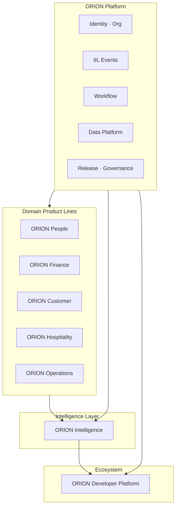
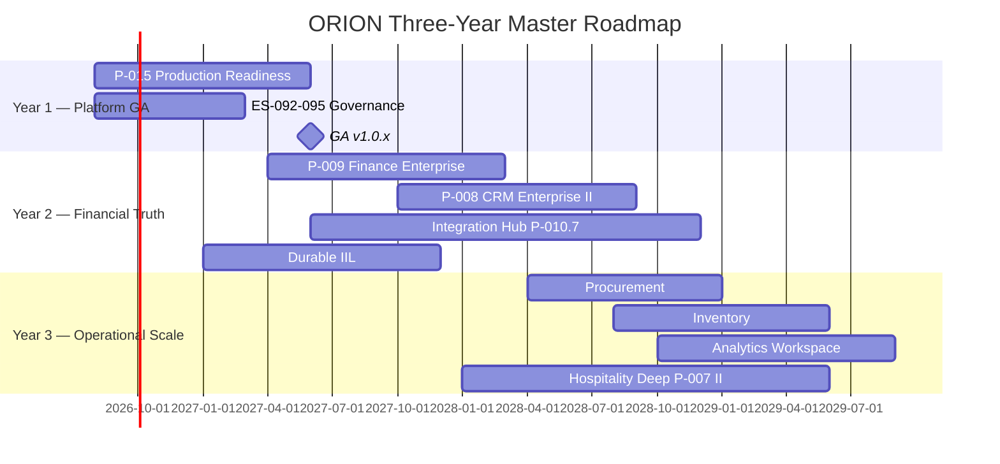
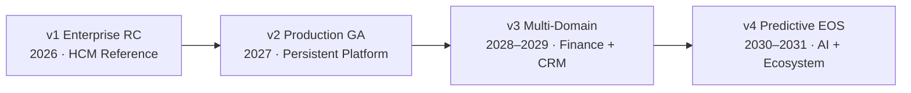

# ORION Enterprise Platform Master Roadmap

**Document ID:** ROADMAP-PLATFORM-001  
**Mission:** P-014.2 — ORION Enterprise Platform Master Roadmap  
**Version:** 1.0  
**Status:** Ratified — Executive Planning Reference  
**Classification:** Executive Roadmap · Platform Planning · Governance  
**Authority:** Chief Enterprise Architect  
**Effective Date:** August 2026  
**Planning Horizon:** 2026–2029 (Three-Year) · 2026–2031 (Five-Year Context)  
**Architecture Baseline:** v1.0 Candidate (RC)

**Supersedes:** Informal roadmap fragments — consolidates [P-014.1 Strategy](./ORION_Enterprise_Platform_Strategy_v1.0.md) into the official master plan  
**Baseline Sources:** [Enterprise Governance (G-001)](../11_Governance/Governance/G-001-Enterprise-Architecture-Governance-Charter.md) · [Enterprise Architecture Handbook v1.0](./ORION_Enterprise_Architecture_Handbook_v1.0.md) · [Enterprise HCM RC1](../06_Releases/v1.0.1-rc1-Certification.md) · [Platform Retrospective v1.0](./ORION_Platform_Retrospective_v1.0.md) · [Platform Strategy v1.0](./ORION_Enterprise_Platform_Strategy_v1.0.md) · [Release Framework](../06_Releases/Release-Policy.md) · **[P-016.7 v2.0 Readiness Sync](./P-016.7-Enterprise-Readiness-Update.md)** *(August 2026 addendum)*

---

## v2.0 August 2026 Baseline Addendum (P-016.7)

| Milestone | Status | Reference |
|-----------|--------|-----------|
| Wave 1 ADR acceptance (013·014·015·020) | ✅ Accepted | [P-016.5](./P-016.5-Architecture-Review-Board-Ratification.md) |
| ADR-013 Durable IIL | ✅ Implemented | P-009.16 · `9cddb12` |
| Finance Gate 5 Wave A engineering | ✅ CONDITIONAL GO | [Finance-Gate5-Closure-Program](../Finance/Certification/Finance-Gate5-Closure-Program.md) |
| CRM Gate 5 Wave B + persistence + wiring | ✅ CONDITIONAL GO | P-008.17 · P-008.18 · `b4853d7` |
| CRM → Finance enterprise reference chain | ✅ Certified | P-009.19 · `3f259d9` · **CRM-R-003 CLOSED** |
| HCM → Finance enterprise reference chain | ✅ Certified | P-009.9 · P-009.15 |
| v2.0 GA release | ❌ NO-GO | FIN-R-001 GL PostgreSQL |

**Authoritative baseline:** [ORION-v2.0-Baseline.md](../99_History/ORION-v2.0-Baseline.md) · [ORION-v2.0-Milestone-CRM-Finance.md](../99_History/ORION-v2.0-Milestone-CRM-Finance.md) · [P-016.7 Readiness Update](./P-016.7-Enterprise-Readiness-Update.md)

---

## v2.0 August 2026 Baseline Addendum (P-016.6 — superseded by P-016.7 for scores)

| Milestone | Status | Reference |
|-----------|--------|-----------|
| Wave 1 ADR acceptance (013·014·015·020) | ✅ Accepted | [P-016.5](./P-016.5-Architecture-Review-Board-Ratification.md) |
| ADR-013 Durable IIL | ✅ Implemented | P-009.16 · `9cddb12` |
| Finance Gate 5 Wave A engineering | ✅ CONDITIONAL GO | [Finance-Gate5-Closure-Program](../Finance/Certification/Finance-Gate5-Closure-Program.md) |
| Finance GA-001 operational path | ✅ CONDITIONAL GO | P-009.17 · `65da475` |
| v2.0 GA release | ❌ NO-GO | FIN-R-001 GL PostgreSQL |

**Authoritative baseline:** [ORION-v2.0-Baseline.md](../99_History/ORION-v2.0-Baseline.md) · [ORION-v2.0-Milestone-2026-08.md](../99_History/ORION-v2.0-Milestone-2026-08.md)

---

## Executive Summary

ORION has completed its **enterprise foundation phase**: governance (P-013), reference domain architecture (HCM RC1), data platform Phase I, event and workflow platforms, and release discipline. The platform is **architecturally credible** at Release Candidate maturity (**v1.0.1-rc1 · CONDITIONAL GO**) but **not commercially GA-ready** until persistent storage, permission enforcement, and full-suite certification are resolved.

This Master Roadmap transforms the ratified [P-014.1 Enterprise Platform Strategy](./ORION_Enterprise_Platform_Strategy_v1.0.md) into the **official executive planning reference** for all future platform development. It defines eight major product lines, a three-year delivery sequence, release and governance cadence, dependency rules, platform KPIs, and executive milestones through Enterprise Platform v4.

### Strategic Conclusions

| Conclusion | Implication |
|------------|-------------|
| **Platform before domains** | Program **P-015 — Platform Production Readiness** is the sole engineering priority before new domain Gate 5 work |
| **Finance is next domain** | Epic **P-009 — Enterprise Finance** follows P-015 GO — executive OS requires financial truth |
| **CRM elevation third** | P-008 Phase II converges certified workspace to HCM reference architecture |
| **Intelligence is platform capability** | Analytics and AI mature after operational domains publish authoritative IIL events |
| **Hospitality is vertical accelerator** | Design partner value; not primary enterprise sequence driver |

### Recommended Immediate Actions

1. **Approve Program P-015** — persistence, RBAC, GA certification (2026 H2 – 2027 H1)
2. **Complete ES-092–095** — close governance standards gap (parallel with P-015)
3. **Prepare P-009 Gates 1–4** — architecture only during P-015; Gate 5 after GO
4. **Maintain v1.0.1-rc1 stabilization** — P0 fixes only until GA path clear

### Executive Decision

| Assessment | Decision |
|------------|----------|
| **P-014.2 Master Roadmap mission** | **GO** — ratified as official planning reference |
| **Platform architecture direction** | **GO** — evidence-based, handbook-aligned |
| **Current commercial GA readiness** | **NO-GO** — TD-HCM-001 persistence · TD-HCM-005 permissions block production |
| **Recommended execution path** | **CONDITIONAL GO** — proceed P-015 immediately; commercial GA path via P-015 → P-009 |

---

## 1. Platform Vision, Mission, and Goals

### 1.1 Platform Vision

ORION is the **Executive Operating System** — a unified, multi-tenant enterprise platform that transforms operational data from finance, workforce, commercial, hospitality, and supply operations into **explainable executive intelligence** and **actionable guidance**.

Every executive opening ORION should understand in less than sixty seconds: what happened, what requires attention, why it matters, what to do first, and what can wait.

### 1.2 Mission

**Build the world's most trusted Executive Operating System.**

ORION shall become the daily operating environment for founders, CEOs, and executive teams — where business health is understood, priorities are clear, recommendations are explainable, and action is one deliberate step away.

*Aligned with [Platform Vision PV-001](../00_PROJECT/ORION_Platform_Vision_and_Roadmap_v1.md) and [Enterprise Architecture Handbook §1.1](./ORION_Enterprise_Architecture_Handbook_v1.0.md#11-vision).*

### 1.3 Business Goals

| # | Goal | Success Measure | Horizon |
|---|------|-----------------|---------|
| B1 | **Reduce executive cognitive load** | Executive Brief engagement · time-to-insight < 60s | Ongoing |
| B2 | **Improve decision quality** | Explainable recommendations with evidence on every priority | Ongoing |
| B3 | **Accelerate execution** | Workflow completion rate · action-to-resolution time | 2027+ |
| B4 | **Unify enterprise operations** | Cross-domain IIL event chain (HCM → Finance → CRM) | 2027–2028 |
| B5 | **Enable design partner revenue** | Signed partner agreements post-GA | 2027 H1+ |
| B6 | **Credible ERP replacement path** | Finance + CRM + HCM GA bundle | 2028–2029 |
| B7 | **Vertical differentiation** | Hospitality design partner pilots with PMS integration | 2027–2028 |

### 1.4 Technology Goals

| # | Goal | Success Measure | Program |
|---|------|-----------------|---------|
| T1 | **Reference architecture for all domains** | HCM pattern replicated: facade · repository · IIL · certification | P-015 · P-009 · P-008 II |
| T2 | **Production persistence** | ES-036 repository abstraction · zero in-memory domain stores at GA | P-015 |
| T3 | **Platform RBAC** | Permission matrix on all domain APIs · audit trail | P-015 |
| T4 | **Durable event transport** | IIL queue replacement ADR + implementation | P-015.5 · 2027 |
| T5 | **Full test suite green** | 800/800 tests · four validation gates pass | P-015 |
| T6 | **Governance maturity Level 2** | ES-090–097 enforced · ADR backlog cleared | P-013 · P-015 |
| T7 | **Data platform Phase II** | Master data registry consumed by all domains | P-011 · 2028 |
| T8 | **Analytics read models** | Event projections for executive metrics | 2029 |

### 1.5 Commercial Goals

| # | Goal | Segment | Target State |
|---|------|---------|--------------|
| C1 | **Design partner HCM** | Workforce-only pilots | GO post-P-015 GA |
| C2 | **Design partner bundle** | HCM + Finance + CRM | GO post-P-009 RC |
| C3 | **Hospitality vertical** | PMS-integrated operators | Pilot 2027 · suite 2029 |
| C4 | **Commercial SaaS GA** | Broad market | Roadmap credible 2028 · GA 2029+ |
| C5 | **Partner ecosystem** | Developer extensions | Marketplace 2030+ |
| C6 | **Product score refresh** | AUD-002 post-GA | Target ≥ 80/100 |

*Commercial readiness today: **NO-GO** for broad GA · **CONDITIONAL GO** for HCM-only design partners. Reference: [P-014.1 §9](./ORION_Enterprise_Platform_Strategy_v1.0.md#9-commercial-readiness-assessment).*

---

## 2. Major Product Lines

ORION organizes capabilities into **eight major product lines**. Each line maps to bounded contexts, workspaces, and engineering programs. Product lines share platform services (identity, IIL, workflow, data) — they do not duplicate infrastructure.



---

### 2.1 ORION Platform

| Field | Definition |
|-------|------------|
| **Purpose** | Core multi-tenant platform services, governance, release discipline, and shared infrastructure that all product lines consume |
| **Scope** | Identity · Organization · IIL · Workflow · Data Platform · Audit · Search · Notifications · Release framework |

**Capabilities**

| Capability | State | Reference |
|------------|-------|-----------|
| Identity & organization isolation | Functional | G-001 · ServiceContext |
| Intelligence Integration Layer (IIL) | Functional · in-memory transport | P-006 |
| Workflow Platform | Functional · HCM integrated | P-010.2 |
| Enterprise Data Platform Phase I | Alpha · CONDITIONAL GO | P-011 · v0.4.1-alpha |
| Governance framework (ES-090–097) | Ratified · enforcement partial | P-013 |
| Release management | Consolidated | P-013.11 · `docs/06_Releases/` |
| Persistent storage abstraction | **Not GA** — P0 blocker | ES-036 · P-015 |
| Platform RBAC | **Incomplete** — P0 blocker | P-015 |

**Dependencies:** None (foundation layer)

**Architecture readiness:** **Strong** — handbook v1.0 · certification framework · HCM reference proves patterns

**Estimated implementation phases**

| Phase | Timeline | Deliverables |
|-------|----------|--------------|
| **P-015 Production Readiness** | 2026 H2 – 2027 H1 | Persistence · RBAC · GA GO |
| **P-011 Phase II** | 2027–2028 | Reference data · metadata · registry consumption |
| **Durable IIL** | 2027 H2 – 2028 | Queue transport ADR + implementation |
| **Integration Hub (P-010.7)** | 2027–2028 | ERP/PMS connector framework |

**Commercial opportunities:** Platform GA unlocks all product line sales · reduces per-domain integration cost · enables SaaS multi-tenancy credibility

---

### 2.2 ORION People

| Field | Definition |
|-------|------------|
| **Purpose** | Workforce management — organization structure, time, attendance, payroll events, talent, and HR intelligence for executives |
| **Scope** | HCM domain (`lib/hcm/`) · People workspace · workforce IIL events |

**Capabilities**

| Capability | State |
|------------|-------|
| Foundation (org, positions, employees) | RC · certified |
| Time & attendance | RC · certified |
| Payroll event publishing | RC · events only |
| Talent management | RC · certified |
| 48 REST APIs · 67+ IIL events · 13 workflow triggers | Delivered v1.0.1-rc1 |
| Persistent store | **P0 debt** — TD-HCM-001 |
| Permission matrix | **P0 debt** — TD-HCM-005 |

**Dependencies:** ORION Platform (identity, IIL, workflow, persistence post-P-015)

**Architecture readiness:** **Reference domain — 5/5** · ES-HCM-001 · certification template for all domains

**Estimated implementation phases**

| Phase | Timeline | Deliverables |
|-------|----------|--------------|
| **RC1 stabilization** | 2026 H2 | P0 fixes · doc cert alignment |
| **GA hardening (P-015)** | 2027 H1 | Persistent HCM · RBAC · GO certification |
| **API expansion** | 2027 H2 | Payroll/talent REST (TD-HCM-002) |
| **LTS** | 2029+ | Long-term support declaration post-multi-domain GA |

**Commercial opportunities:** HRIS replacement for SMB/mid-market · workforce cost events feed Finance · design partner entry product

---

### 2.3 ORION Finance

| Field | Definition |
|-------|------------|
| **Purpose** | Authoritative financial truth — general ledger, AR/AP, cash, and financial intelligence driven by cross-domain IIL events |
| **Scope** | Finance domain (`lib/finance/`) · Finance workspace · D-007/D-008/D-009 · ES-FIN-001 |

**Capabilities**

| Capability | State |
|------------|-------|
| Finance workspace UI (Missions 15A–15C) | Delivered · placeholder data |
| Financial event model (D-008) | Blueprint approved · priority contracts implemented |
| GL / sub-ledger design (D-007, D-009) | Posting stack delivered · **GL PostgreSQL pending** (FIN-R-001) |
| ES-FIN-001 engineering spec | Draft |
| Enterprise domain implementation | **Wave A complete** — P-009.5–P-009.17 · **CONDITIONAL GO** |
| HCM → Finance durable event chain | ✅ Certified — ADR-013 Implemented · P-009.15/16 |
| Finance RBAC fail-closed | ✅ P-009.14 |
| Master data PostgreSQL | ✅ P-009.13 |

**Dependencies:** ORION Platform (persistence, RBAC, durable IIL) · ORION People (workforce cost events — **implemented**) · ORION Customer (revenue events) · ORION Hospitality (folio events, future)

**Architecture readiness:** **4.5/5** — Wave A engineering complete · GL durability + ADR-014 registry remain

**Estimated implementation phases**

| Phase | Timeline | Deliverables |
|-------|----------|--------------|
| **Gates 1–4 (architecture)** | 2026 H2 | ✅ Complete |
| **P-009 Gate 5 Wave A** | Aug 2026 | ✅ Posting · validation · consumer · cert — **CONDITIONAL GO** |
| **P-009.12 GL PostgreSQL** | 2026 H2 | FIN-R-001 closure → Full GO path |
| **Gate 6 cross-domain** | 2027 Q1 | CRM/Hospitality · ADR-014 registry · outbound events |
| **GA** | 2028–2029 | Finance domain GO · ERP credibility |

**Commercial opportunities:** Highest TAM — every enterprise requires financial intelligence · unlocks Procurement/Inventory · executive OS financial truth completes product story

---

### 2.4 ORION Customer

| Field | Definition |
|-------|------------|
| **Purpose** | Commercial relationship management — accounts, opportunities, pipeline, customer intelligence, and revenue event publishing |
| **Scope** | CRM domain (`lib/crm/`) · CRM workspace · commercial IIL events · future Marketing and Customer Service |

**Capabilities**

| Capability | State |
|------------|-------|
| CRM workspace (Missions 16A–16D) | Certified · CONDITIONAL GO (P-008.8) |
| Customer intelligence · relationship AI readiness | Delivered |
| Party model · opportunity management | Functional · pre-handbook patterns |
| Enterprise facade convergence | **Pending** — P-008 Phase II |
| Revenue → Finance event chain | Designed (D-008) · not implemented |

**Dependencies:** ORION Platform · ORION Finance (revenue recognition · authoritative ledger)

**Architecture readiness:** **4/5** — workspace certified · needs HCM reference convergence

**Estimated implementation phases**

| Phase | Timeline | Deliverables |
|-------|----------|--------------|
| **Maintain certification** | 2026 H2 | Doc cert test fixes |
| **P-008 Phase II** | 2027 H2 – 2028 H1 | Facade · repository · IIL catalogue · REST API |
| **Finance integration** | 2028 | Opportunity → Finance event chain |
| **Marketing / Customer Service** | 2029–2030 | Medium priority extensions |

**Commercial opportunities:** CRM replacement · sales pipeline intelligence · design partner bundle with HCM + Finance

---

### 2.5 ORION Hospitality

| Field | Definition |
|-------|------------|
| **Purpose** | Property and guest operations — reservations, folio, billing, revenue operations for hotels and hospitality operators |
| **Scope** | Hospitality domain (`lib/hospitality/`) · Hospitality workspace · P-007 program |

**Capabilities**

| Capability | State |
|------------|-------|
| Hospitality workspace | Certified · CONDITIONAL GO (P-007.8) |
| PMS-oriented operations | Functional |
| Billing, folio & revenue (P-007.6) | Architecture defined |
| Finance event publishing | Designed · future integration |
| Deep PMS integrations | **Pending** — P-007 Phase II |

**Dependencies:** ORION Platform · ORION Finance (enterprise accounting) · ORION Customer (guest as party, optional)

**Architecture readiness:** **4/5** — certified workspace · vertical-specific extensions pending

**Estimated implementation phases**

| Phase | Timeline | Deliverables |
|-------|----------|--------------|
| **Pilot maintenance** | 2026–2027 | Design partner support post-GA |
| **P-007 Phase II (parallel)** | 2028 | Deep integrations · folio → Finance events |
| **Vertical suite** | 2029 | Full hospitality operator package |

**Commercial opportunities:** Vertical SaaS for boutique/mid-scale hotels · design partner accelerator · PMS integration partnerships

---

### 2.6 ORION Operations

| Field | Definition |
|-------|------------|
| **Purpose** | Supply chain and operational execution — procurement, inventory, supply chain orchestration, and cross-functional operations health |
| **Scope** | Procurement · Inventory · Supply Chain · Operations workspace (future) · ES-058 operations framework |

**Capabilities**

| Capability | State |
|------------|-------|
| Operations framework (ES-058) | Approved · ITSM reference |
| Procurement domain | **Not started** |
| Inventory / warehouse | **Not started** |
| Supply chain orchestration | **Not started** |
| Operations workspace | Backlog (PB-080) |

**Dependencies:** ORION Platform · ORION Finance (sub-ledgers, cost posting) · ORION People (approver workflows, optional)

**Architecture readiness:** **2/5** — framework only · domains require Finance first

**Estimated implementation phases**

| Phase | Timeline | Deliverables |
|-------|----------|--------------|
| **Procurement** | 2028 H1 | Purchase-to-pay · Finance integration |
| **Inventory** | 2028 H2 – 2029 | Warehouse · cost posting |
| **Supply Chain** | 2029 | Orchestration across Proc + Inv + Finance |
| **Operations workspace** | 2029 | Executive operational health view |

**Commercial opportunities:** Mid-market ERP completeness · manufacturing/distribution verticals · operational cost intelligence for executives

---

### 2.7 ORION Intelligence

| Field | Definition |
|-------|------------|
| **Purpose** | Executive intelligence layer — Brief, decision engines, analytics projections, and governed AI that explains without corrupting deterministic cores |
| **Scope** | Executive Brief · Intelligence Platform · Analytics workspace · AI Platform (ES-039) · Decision Intelligence |

**Capabilities**

| Capability | State |
|------------|-------|
| Executive Brief · Shell · Command Palette | Delivered (Phase I) |
| Intelligence Provider Framework (ADR-006) | Accepted |
| Executive Intelligence Engines (ES-020/021) | Delivered |
| Dual intelligence pipeline | TD-003 · unification pending |
| Analytics workspace | **Not started** — requires domain events |
| Governed AI agents (ES-039) | Assistive today · predictive future |

**Dependencies:** All domain product lines (authoritative IIL events) · ORION Platform (IIL, search, memory)

**Architecture readiness:** **3.5/5** — strong UX and provider framework · analytics and durable projections pending

**Estimated implementation phases**

| Phase | Timeline | Deliverables |
|-------|----------|--------------|
| **Brief enhancement** | 2027 | Authoritative Finance + HCM signals post-P-009 |
| **Analytics workspace** | 2028 H2 – 2029 | Event projections · cross-domain metrics |
| **AI Platform maturation** | 2029–2030 | Governed agents on authoritative data |
| **Predictive EOS** | 2031 | Forecast scenarios · executive simulation |

**Commercial opportunities:** Primary differentiation vs dashboards · explainable AI as sales narrative · executive retention driver

---

### 2.8 ORION Developer Platform

| Field | Definition |
|-------|------------|
| **Purpose** | Partner and extension ecosystem — APIs, webhooks, connector framework, marketplace, and governed third-party modules |
| **Scope** | Public API surface · Integration Platform (P-010.7) · ES-060 marketplace · extension certification |

**Capabilities**

| Capability | State |
|------------|-------|
| Domain REST APIs (HCM) | 48 endpoints · RC |
| Facade-only import contract | Enforced · handbook |
| Integration connector framework | **Planned** — P-010.7 |
| Developer portal · marketplace | **Future** — ES-060 |
| Extension certification | Framework via ES-096 · no marketplace yet |

**Dependencies:** ORION Platform GA · at least two authoritative domain APIs · Integration Hub

**Architecture readiness:** **2/5** — API patterns proven in HCM · ecosystem infrastructure deferred

**Estimated implementation phases**

| Phase | Timeline | Deliverables |
|-------|----------|--------------|
| **Integration Hub foundation** | 2027–2028 | P-010.7 · ERP/PMS connectors |
| **Public API catalogue** | 2028 | Unified developer documentation |
| **Marketplace alpha** | 2030 | Partner extension certification |
| **Ecosystem GA** | 2031 | Revenue share · partner program |

**Commercial opportunities:** Platform network effects · reduces professional services cost · vertical partner accelerators

---

## 3. Three-Year Roadmap

Planning window: **August 2026 – July 2029**. Aligned with [P-014.1 §6](./ORION_Enterprise_Platform_Strategy_v1.0.md#6-three-year-roadmap-20262029).



### Year 1 — Platform GA (Aug 2026 – Jul 2027)

**Theme:** Production readiness · governance completion · HCM GA path

| Quarter | Milestone | Product Lines |
|---------|-----------|---------------|
| **2026 Q3** | ES-092–095 ratification · v1.0.1-rc1 stabilization | Platform · People |
| **2026 Q4** | P-015.1 persistence ADR · HCM persistent implementation start | Platform · People |
| **2027 Q1** | Platform RBAC · full suite green (800/800) | Platform |
| **2027 Q2** | **GA v1.0.x GO certification** · design partner program launch | Platform · People |
| **2027 Q2** | P-009 Gates 1–4 complete · Finance domain lead assigned | Finance |

**Year 1 exit criteria:** GO certification · zero open P0 debt · persistent HCM · platform RBAC · ES-090–097 enforced

### Year 2 — Financial Truth (Aug 2027 – Jul 2028)

**Theme:** Finance enterprise · CRM elevation · integration foundation

| Quarter | Milestone | Product Lines |
|---------|-----------|---------------|
| **2027 Q3** | P-009 Gate 5 — event processor + GL foundation | Finance · Intelligence |
| **2027 Q4** | P-008 Phase II start · durable IIL transport | Customer · Platform |
| **2028 Q1** | Finance CONDITIONAL GO minimum · Executive Brief financial signals | Finance · Intelligence |
| **2028 Q2** | CRM enterprise facade · opportunity → Finance events | Customer · Finance |
| **2028 Q3–Q4** | Integration Hub · P-011 Phase II · design partner bundle | Platform · Developer |

**Year 2 exit criteria:** Finance domain RC · CRM converged to reference architecture · multi-domain IIL event chain operational

### Year 3 — Operational Scale (Aug 2028 – Jul 2029)

**Theme:** Supply foundation · analytics native · vertical depth

| Quarter | Milestone | Product Lines |
|---------|-----------|---------------|
| **2028 Q3** | Procurement alpha · purchase-to-pay | Operations · Finance |
| **2028 Q4** | Analytics workspace RC · cross-domain projections | Intelligence |
| **2029 Q1** | Inventory alpha · Hospitality deep integrations | Operations · Hospitality |
| **2029 Q2** | Supply chain orchestration design · Finance GA path | Operations |
| **2029 Q3** | Analytics GA · AI governed agents assistive | Intelligence |

**Year 3 exit criteria:** Procurement + Inventory alpha · Analytics RC · credible ERP replacement narrative for mid-market

---

## 4. Major Release Timeline

Canonical release authority: [Release-Policy.md](../06_Releases/Release-Policy.md) · [RELEASE_HISTORY.md](../06_Releases/RELEASE_HISTORY.md) · [ORION-Architecture-Baselines.md](../06_Releases/ORION-Architecture-Baselines.md)

### 4.1 Architecture Baselines

| Baseline | Date | Status | Governs | Next Action |
|----------|------|--------|---------|-------------|
| **Phase I** | Jul 2026 | Frozen | Executive UX · Finance/CRM workspaces · Intelligence | Superseded by v1.0 Candidate for RC |
| **v0.3 Enterprise Freeze** | Jul 2026 | Frozen | Platform services · Hospitality · CRM pre-Finance | Reference for workspace certification |
| **v1.0 Candidate** | Aug 2026 | **Active RC** | Handbook · HCM reference · governance ES-090–097 | Update at GA with persistence ADR |
| **v1.0 GA Baseline** | Target 2027 H1 | Planned | Persistent stores · RBAC · GO certification | P-015 exit |
| **v2.0 Multi-Domain Baseline** | Target 2028 | Planned | Finance + CRM authoritative · IIL event chain | P-009 + P-008 II exit |

### 4.2 Release Candidates and Production Releases

| Version | Target | Stage | Scope | Certification Target |
|---------|--------|-------|-------|---------------------|
| **v1.0.1-rc1** | Aug 2026 | RC · **Current** | HCM · Governance · P-013 | CONDITIONAL GO ✅ |
| **v1.0.1** (patch) | 2026 Q4 | RC patch | Doc cert fixes · P0 stabilization | CONDITIONAL GO |
| **v1.0.x GA** | 2027 Q2 | **Production GA** | Platform · HCM persistent · RBAC | **GO** |
| **v1.1.x** | 2027 H2 | Minor | HCM API expansion · Finance alpha | GO / CONDITIONAL GO |
| **v1.2.x** | 2028 | Minor | Finance RC · CRM enterprise | CONDITIONAL GO → GO |
| **v2.0.0** | 2028–2029 | Major | Multi-domain authoritative · breaking ADRs if required | GO |

### 4.3 Governance Reviews

| Review | Cadence | Authority | Purpose |
|--------|---------|-----------|---------|
| **Architecture Review Board (ARB)** | Monthly | Chief Enterprise Architect | ADR acceptance · ADR-001–003 backlog |
| **Release certification (Gate 6)** | Per RC/GA | Certification lead | GO / CONDITIONAL GO / NO-GO evidence |
| **Platform KPI dashboard** | Monthly | ARB · ES-097 §9 | Architecture health · debt · test trends |
| **Annual governance review** | Yearly | Chief Enterprise Architect | ES-090–097 accuracy · maturity assessment |
| **Product audit refresh (AUD-002)** | Post-GA 2027 | Product · Architecture | Commercial score vs AUD-001 baseline |
| **Master Roadmap review** | Annual | Executive · Architecture | P-014.2 revision · horizon refresh |

### 4.4 Consolidated Release Roadmap

```
2026 Aug    v1.0.1-rc1 (CURRENT) — HCM RC · Governance
2026 Q4     v1.0.1 patch — doc cert · stabilization
2027 Q2     v1.0.x GA — P-015 GO
2027 H2     v1.1.x — Finance Gate 5 · durable IIL
2028        v1.2.x — Finance RC · CRM enterprise
2028–2029   v2.0.0 — Multi-domain baseline
2029+       v2.x — Operations · Analytics GA path
2030–2031   v3.x / v4.x — Predictive platform (see §8)
```

---

## 5. Dependency Matrix

**Legend:** ● = hard dependency · ○ = soft / event consumer · — = not applicable

### 5.1 Product Line → Platform Capability

| Product Line | Identity | IIL | Workflow | Data Platform | Persistence | RBAC | Release Cert |
|--------------|----------|-----|----------|---------------|-------------|------|--------------|
| **ORION Platform** | ● | ● | ● | ● | ● (P-015) | ● (P-015) | ● |
| **ORION People** | ● | ● | ● | ○ | ● (P-015) | ● (P-015) | ● |
| **ORION Finance** | ● | ● | ○ | ● | ● | ● | ● |
| **ORION Customer** | ● | ● | ○ | ○ | ● | ● | ● |
| **ORION Hospitality** | ● | ● | ○ | ○ | ● | ● | ● |
| **ORION Operations** | ● | ● | ● | ● | ● | ● | ● |
| **ORION Intelligence** | ● | ● | ○ | ○ | ○ | ○ | ○ |
| **ORION Developer Platform** | ● | ● | — | ○ | ● | ● | ● |

### 5.2 Product Line → Product Line

| Consumer → Provider | People | Finance | Customer | Hospitality | Operations | Intelligence |
|---------------------|--------|---------|----------|-------------|------------|--------------|
| **ORION People** | — | — | — | — | — | ○ |
| **ORION Finance** | ● events | — | ● events | ○ events | ○ events | ○ |
| **ORION Customer** | ○ | ● ledger | — | — | — | ○ |
| **ORION Hospitality** | ○ | ● accounting | ○ | — | — | ○ |
| **ORION Operations** | ○ | ● sub-ledger | ○ | ○ | — | ○ |
| **ORION Intelligence** | ● events | ● events | ● events | ● events | ● events | — |
| **ORION Developer Platform** | ● API | ● API | ● API | ● API | ● API | ○ API |

### 5.3 Dependency Rules (Non-Negotiable)

1. **No domain Gate 5 before P-015 GO** — persistence and RBAC are shared prerequisites
2. **Finance before Procurement, Inventory, Supply Chain** — sub-ledgers and cost posting required
3. **Authoritative domain events before Analytics** — read-only projections only
4. **AI never mutates ledger or HR state without human approval** — explainability layer only
5. **Cross-domain integration via IIL only** — no direct repository reads between domains
6. **Single public facade per domain** — `@/lib/<domain>` import contract

---

## 6. Recommended Build Sequence

Derived from [P-014.1 §5](./ORION_Enterprise_Platform_Strategy_v1.0.md#5-recommended-build-sequence) and domain assessment matrix.

### Critical (2026 H2 – 2027 H2)

| Priority | Item | Program | Rationale |
|----------|------|---------|-----------|
| **C1** | Platform Production Readiness | **P-015** | Blocks GA · all domains · commercial credibility |
| **C2** | Persistent storage (ES-036) | P-015.1 | TD-HCM-001 pattern · Finance requires durable repository |
| **C3** | Platform RBAC | P-015.2 | TD-HCM-005 pattern · enterprise security requirement |
| **C4** | GA certification (GO) | P-015.4 | Release policy · zero P0 at GA |
| **C5** | Enterprise Finance | **P-009** | Executive OS financial truth · marked NEXT at v0.3 freeze |
| **C6** | Integration Platform foundation | **P-010.7** | Parallel with Finance · connector cost reduction |

### High (2027 H2 – 2029)

| Priority | Item | Program | Rationale |
|----------|------|---------|-----------|
| **H1** | CRM Enterprise Elevation | P-008 Phase II | Highest ROI retrofit · certified workspace exists |
| **H2** | Durable IIL transport | P-015.5 · ADR | Production event reliability |
| **H3** | Governance standards completion | ES-092–095 | Close P-013 gap · enforcement |
| **H4** | Analytics / BI workspace | Intelligence | Executive differentiation · event projections |
| **H5** | AI Platform maturation | ES-039 | Governed agents · commercial narrative |
| **H6** | Procurement | Operations | Natural Finance extension · purchase-to-pay |
| **H7** | Inventory / Warehouse | Operations | Depends on Procurement + Finance |
| **H8** | Hospitality Deep | P-007 Phase II | Vertical accelerator · design partners |

### Medium (2028 – 2030)

| Priority | Item | Rationale |
|----------|------|-----------|
| **M1** | Supply Chain orchestration | Requires Proc + Inv + Finance |
| **M2** | Marketing workspace | Lower priority vs operational core |
| **M3** | Customer Service | CRM extension |
| **M4** | Document Management | P-010.4 · HCM onboarding · Finance contracts |
| **M5** | Mobile executive shell | Field executive use cases |
| **M6** | Asset Management | Niche operational |
| **M7** | Data Platform Phase II | P-011 reference data completion |

### Future (2030 – 2031)

| Priority | Item | Rationale |
|----------|------|-----------|
| **F1** | Developer Platform / marketplace | ES-060 · partner ecosystem |
| **F2** | Project Management domain | Niche · defer until core ERP complete |
| **F3** | Predictive AI / forecasting | Requires authoritative multi-domain data |
| **F4** | Standalone reservations | Part of Hospitality — not separate domain |

---

## 7. Platform KPIs

Executive dashboard metrics. Sources: [ES-097 §9](./ES-097-ORION-Architecture-Governance-ADR-Policy.md#9-governance-metrics) · [ES-096](./ES-096-ORION-Enterprise-Testing-Certification-Standards.md) · [Retrospective §14](./ORION_Platform_Retrospective_v1.0.md#14-maturity-assessment)

### 7.1 Architecture Health

| KPI | Current (RC) | RC Target | GA Target | Source |
|-----|--------------|-----------|-----------|--------|
| Engineering health score | ~75 | ≥ 75 | ≥ 85 | S-001.1 audit |
| Architecture consistency | 80%+ (HCM) | ≥ 80% | ≥ 90% | Certification dimension |
| Facade boundary violations | 0 | 0 | 0 | Architecture tests |
| Undocumented breaking changes | 0 | 0 | 0 | Release audit |
| Governance maturity level | 1+ → 2 | Level 2 | Level 2 enforced | ES-097 |

### 7.2 Quality Score

| KPI | Current (RC) | RC Target | GA Target | Source |
|-----|--------------|-----------|-----------|--------|
| Full test pass rate | 794/800 (99.25%) | 100% | 100% | `npm test` |
| HCM domain tests | 79/79 | 100% | 100% | HCM cert |
| Four validation gates | Pass | Pass | Pass | CI pipeline |
| Regression count per release | Tracked | ≤ 2 | 0 at GA | Release notes |
| Certification decision | CONDITIONAL GO | CONDITIONAL GO | **GO** | Gate 6 reports |

### 7.3 Release Quality

| KPI | RC Target | GA Target |
|-----|-----------|-----------|
| Open P0 debt at release | Documented + plan | **0** |
| P1 debt with owner + target | 100% | 100% |
| Release notes + cert report published | 100% | 100% |
| ADR linked for architectural changes | 100% | 100% |

### 7.4 Test Coverage

| KPI | Current | Target |
|-----|---------|--------|
| Domain Operations tests | HCM complete | All GA domains |
| Facade integration tests | HCM complete | All GA domains |
| Event catalogue uniqueness | HCM complete | All event publishers |
| Documentation certification | CRM/Finance gaps | 100% pass |
| E2E executive flows | Not implemented | Playwright · v1.2+ |

### 7.5 Technical Debt

| KPI | Current | GA Target |
|-----|---------|-----------|
| Open P0 count | 2 (TD-HCM-001, TD-HCM-005) | **0** |
| P1 with owner + target release | Partial | 100% |
| Debt age > 2 releases | ARB escalation | 0 unresolved |

### 7.6 Documentation Completeness

| KPI | Current | Target |
|-----|---------|--------|
| ES-090–097 ratified | 4/8 (092–095 planned) | 8/8 at GA |
| Domain ES per GA domain | HCM only | All GA domains |
| API + Event catalogues | HCM complete | All GA domains |
| Handbook ↔ implementation alignment | Strong (HCM) | All GA domains |

### 7.7 Platform Maturity

| Dimension | Current (1–5) | GA Target | Year 3 Target |
|-----------|---------------|-----------|---------------|
| Overall platform maturity | **3.4** | **4.0** | **4.5** |
| Persistence / security | 2.0 | 4.0 | 4.5 |
| Enterprise domains | 4.0 (HCM) | 4.0 (HCM GA) | 4.0 (multi-domain) |
| Commercial readiness | 2.5 | 3.5 | 4.0 |
| Product score (AUD) | 68/100 | ≥ 75 | ≥ 80 |

---

## 8. Executive Milestones — Enterprise Platform Generations

Executive milestones represent **strategic platform generations**, not individual semver tags. Semver releases map into these generations per [Release-Policy.md](../06_Releases/Release-Policy.md).

### Enterprise Platform v2 — Production GA Platform

| Field | Value |
|-------|-------|
| **Target** | 2027 H1 – 2027 H2 |
| **Trigger** | P-015 GO certification · v1.0.x GA tag |
| **Platform state** | Persistent · secured · governance enforced |
| **Product lines GA** | ORION Platform · ORION People (HCM) |
| **Product lines RC** | ORION Intelligence (Brief) · workspaces (Finance/CRM UI) |
| **Executive outcome** | First production-ready enterprise platform · design partner HCM agreements |
| **Architecture baseline** | v1.0 GA Baseline — persistence ADR · RBAC ADR |

### Enterprise Platform v3 — Multi-Domain Operator

| Field | Value |
|-------|-------|
| **Target** | 2028 – 2029 |
| **Trigger** | P-009 Finance RC/GA · P-008 CRM enterprise · Procurement alpha |
| **Platform state** | Cross-domain IIL event chain · durable transport · Integration Hub |
| **Product lines GA** | Platform · People · Finance · Customer (enterprise) |
| **Product lines RC** | Operations (Procurement/Inventory) · Hospitality (deep) · Intelligence (Analytics) |
| **Executive outcome** | Authoritative financial truth · commercial design partner bundle · ERP replacement credibility |
| **Architecture baseline** | v2.0 Multi-Domain Baseline |

### Enterprise Platform v4 — Predictive Enterprise Platform

| Field | Value |
|-------|-------|
| **Target** | 2030 – 2031 |
| **Trigger** | Analytics GA · governed AI agents · Developer marketplace |
| **Platform state** | Event projections · integration at scale · partner ecosystem |
| **Product lines GA** | All core lines · Operations supply chain · Intelligence predictive |
| **Product lines RC/GA** | Developer Platform marketplace · Mobile executive |
| **Executive outcome** | Predictive EOS — forecast scenarios · partner extensions · mobile field executive |
| **Architecture baseline** | v3.0 Predictive Baseline (future ADR) |



---

## 9. Product Line Strategy — Summary

| Product Line | Strategic Role | 2027 | 2028 | 2029 | Commercial Priority |
|--------------|----------------|------|------|------|---------------------|
| **ORION Platform** | Foundation | GA | Scale | Optimize | Enabler — not sold separately initially |
| **ORION People** | Reference domain | GA | GA + API expansion | LTS | **High** — design partner entry |
| **ORION Finance** | Financial truth | Gate 5 start | RC/GA | GA | **Critical** — highest TAM |
| **ORION Customer** | Commercial hub | Maintain | Enterprise | GA | **High** — bundle component |
| **ORION Hospitality** | Vertical accelerator | Pilot | Deep | Suite | **Medium** — vertical SaaS |
| **ORION Operations** | ERP completeness | — | Alpha | RC | **Medium** — mid-market ERP |
| **ORION Intelligence** | Differentiation | Brief enhanced | Analytics RC | Analytics GA | **High** — retention driver |
| **ORION Developer Platform** | Ecosystem | Foundation | Hub | Marketplace alpha | **Low** until GA ecosystem |

---

## 10. Platform Evolution Plan

| Stage | Period | Platform State | Key Evidence |
|-------|--------|----------------|--------------|
| **Enterprise RC** | 2026 | HCM reference · governance codified · in-memory | v1.0.1-rc1 · CONDITIONAL GO |
| **Production GA (v2)** | 2027 | Persistent · secured · one domain production-ready | P-015 GO · v1.0.x GA |
| **Multi-Domain (v3)** | 2028–2029 | Finance + CRM authoritative · IIL event chain | P-009 · P-008 II |
| **Operational** | 2029 | Supply chain · analytics projections | Procurement · Inventory · Analytics |
| **Predictive (v4)** | 2030–2031 | AI-assisted forecasting · partner ecosystem · mobile | ES-039 · ES-060 |

### Architecture Evolution (Cross-Cutting)

| Horizon | Change | ADR Required |
|---------|--------|--------------|
| 2026 H2 | Persistent store abstraction | Yes — ES-036 |
| 2027 H1 | Platform permission matrix | Yes — auth |
| 2027 H2 | Finance event processor + GL pipeline | Yes — D-008 implementation |
| 2028 | Master data registry consumption | Extend P-011 |
| 2028 | Durable IIL transport | Yes — messaging |
| 2029 | Analytics read models (CQRS) | Yes |
| 2030 | Integration connector framework | Yes — P-010.7 |

**Invariants (all phases):** Single facade · IIL-only cross-domain · organization isolation · certification before release · AI never mutates ledger/HR without approval.

---

## 11. Master Roadmap — Consolidated View

```
PHASE 0 — PRODUCTION READINESS (Critical)
  2026 H2 – 2027 H1 │ P-015 │ ES-092–095 │ GA v1.0.x GO
  Product lines: Platform · People

PHASE 1 — FINANCIAL TRUTH (Critical)
  2027 H1 – 2028 Q1 │ P-009 Enterprise Finance
  Product lines: Finance · Intelligence (Brief signals)

PHASE 2 — COMMERCIAL ENTERPRISE (High)
  2027 H2 – 2028 H1 │ P-008 Phase II CRM Elevation
  Product lines: Customer · Finance (revenue chain)

PHASE 3 — SUPPLY & OPERATIONS (High)
  2028 – 2029 │ Procurement · Inventory · Supply Chain
  Product lines: Operations · Finance

PHASE 4 — INTELLIGENCE & SCALE (High)
  2028 H2 – 2029 │ Analytics · Integration Hub · Hospitality Deep
  Product lines: Intelligence · Hospitality · Developer (foundation)

PHASE 5 — ECOSYSTEM (Future)
  2030 – 2031 │ AI Platform · Mobile · Developer Marketplace
  Product lines: Intelligence · Developer Platform
```

---

## 12. Output — GO / CONDITIONAL GO / NO-GO

### P-014.2 Master Roadmap Mission Certification

| Criterion | Result |
|-----------|--------|
| Platform vision, mission, and goals defined | ✅ Pass |
| Eight product lines documented with purpose, capabilities, dependencies, readiness, phases, commercial opportunities | ✅ Pass |
| Three-year roadmap (Year 1–3) | ✅ Pass |
| Major release timeline with baselines, RCs, GA, governance reviews | ✅ Pass |
| Dependency matrix (platform + product line) | ✅ Pass |
| Build sequence (Critical / High / Medium / Future) | ✅ Pass |
| Platform KPIs defined | ✅ Pass |
| Executive milestones (Enterprise Platform v2 / v3 / v4) | ✅ Pass |
| Evidence-based · aligned with P-014.1 · handbook · retrospective · HCM RC1 | ✅ Pass |
| No production code changes | ✅ Pass |

### Executive Decisions

| Decision Area | Verdict | Notes |
|---------------|---------|-------|
| **Master Roadmap ratification (P-014.2)** | **GO** | Official executive planning reference effective August 2026 |
| **Architecture and build sequence** | **GO** | P-015 → P-009 → P-008 II sequence ratified |
| **Three-year plan feasibility** | **CONDITIONAL GO** | Achievable if P-015 completes on schedule; Finance Gates 1–4 during P-015 recommended |
| **Commercial GA today** | **NO-GO** | TD-HCM-001 · TD-HCM-005 · 794/800 tests · ES-092–095 incomplete |
| **Design partner (HCM-only) today** | **CONDITIONAL GO** | Explicit RC scope · not production multi-domain |
| **Commercial SaaS GA path** | **CONDITIONAL GO** | Credible via P-015 → P-009 → design partner bundle 2027–2028 |

### Immediate Executive Approval Requested

1. **Ratify** this Master Roadmap as the governing planning document for ORION Enterprise Platform development
2. **Authorize Program P-015** as sole Gate 5 engineering priority through 2027 H1
3. **Assign Finance Domain Lead** and approve P-009 Gates 1–4 (architecture preparation only) during P-015
4. **Schedule ARB** to accept or reject ADR-001–003 before next architecture baseline

---

## Appendix A — Cross-Reference Index

| Topic | Document |
|-------|----------|
| Strategic source | [ORION_Enterprise_Platform_Strategy_v1.0.md](./ORION_Enterprise_Platform_Strategy_v1.0.md) |
| Platform retrospective | [ORION_Platform_Retrospective_v1.0.md](./ORION_Platform_Retrospective_v1.0.md) |
| Architecture handbook | [ORION_Enterprise_Architecture_Handbook_v1.0.md](./ORION_Enterprise_Architecture_Handbook_v1.0.md) |
| Product vision | [ORION_Platform_Vision_and_Roadmap_v1.md](../00_PROJECT/ORION_Platform_Vision_and_Roadmap_v1.md) |
| HCM certification | [v1.0.1-rc1-Certification.md](../06_Releases/v1.0.1-rc1-Certification.md) |
| Release framework | [Release-Policy.md](../06_Releases/Release-Policy.md) · [RELEASE_HISTORY.md](../06_Releases/RELEASE_HISTORY.md) |
| Architecture baselines | [ORION-Architecture-Baselines.md](../06_Releases/ORION-Architecture-Baselines.md) |
| Finance engineering | [ES-FIN-001](../Finance/Engineering/ES-FIN-001_Finance_Domain_Engineering_Specification.md) |
| HCM reference | [ES-HCM-001](../HCM/Engineering/ES-HCM-001_Enterprise_HCM_Engineering_Specification.md) |
| Governance charter | [G-001](../11_Governance/Governance/G-001-Enterprise-Architecture-Governance-Charter.md) |
| Testing standards | [ES-096](./ES-096-ORION-Enterprise-Testing-Certification-Standards.md) |
| ADR policy | [ES-097](./ES-097-ORION-Architecture-Governance-ADR-Policy.md) |

---

## Appendix B — Glossary

| Term | Definition |
|------|------------|
| **Gate 5** | First implementation mission of a domain — requires active architecture baseline conformance |
| **GO / CONDITIONAL GO / NO-GO** | Certification decisions per ES-096 |
| **IIL** | Intelligence Integration Layer — sole cross-domain integration bus |
| **P-015** | Platform Production Readiness & GA Path program |
| **P-009** | Enterprise Finance Domain epic |
| **Reference domain** | HCM — template for facade, repository, events, certification |
| **Product line** | Commercial and architectural grouping of related domains and workspaces |
| **Enterprise Platform v2/v3/v4** | Executive milestone generations — see §8 |

---

*ORION Enterprise Platform · Master Roadmap v1.0 · Mission P-014.2 · August 2026*
