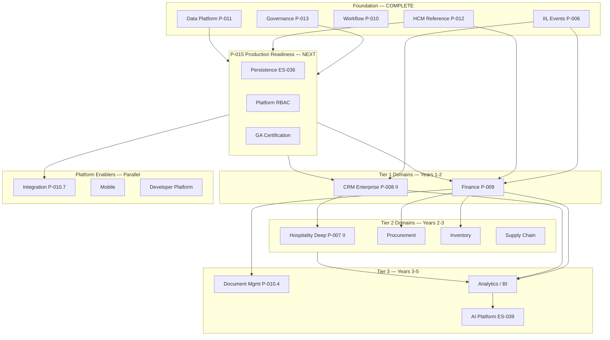
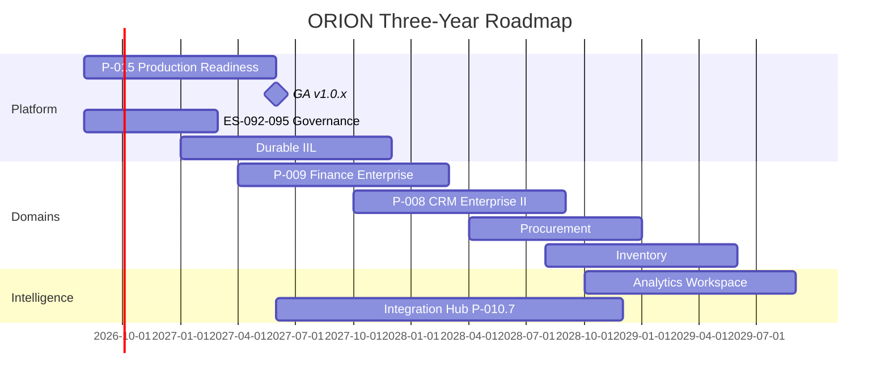

# ORION Enterprise Platform Strategy

**Document ID:** STRAT-PLATFORM-001  
**Mission:** P-014.1 — Enterprise Platform Strategy & Domain Prioritization  
**Version:** 1.0  
**Status:** Ratified — Strategic Planning Document  
**Classification:** Executive Strategy · Platform Planning  
**Authority:** Chief Enterprise Architect  
**Effective Date:** August 2026  
**Planning Horizon:** 2026–2031 (3–5 years)  
**Architecture Baseline:** v1.0 Candidate (RC)

**Related:** [Platform Retrospective v1.0](./ORION_Platform_Retrospective_v1.0.md) · [Platform Vision and Roadmap v1.0](../00_PROJECT/ORION_Platform_Vision_and_Roadmap_v1.0.md) · [Enterprise Architecture Handbook v1.0](./ORION_Enterprise_Architecture_Handbook_v1.0.md) · [ORION-Architecture-Baselines.md](../06_Releases/ORION-Architecture-Baselines.md) · [Release-Policy.md](../06_Releases/Release-Policy.md) · [ES-051 Technical Roadmap](../02_Engineering/ES-051-ORION-Technical-Roadmap-Product-Evolution-Strategy.md)

---

## 1. Executive Summary

ORION has completed its **enterprise foundation phase**: governance (P-013), reference domain architecture (HCM RC1), data platform Phase I, event and workflow platforms, and release discipline. The platform is **architecturally credible** at Release Candidate maturity but **not commercially GA-ready** until persistent storage, permission enforcement, and full-suite certification are resolved.

This strategy recommends a **two-track roadmap**:

| Track | Focus | Timeline |
|-------|-------|----------|
| **Track A — Platform Production Readiness** | Persistence, RBAC, governance completion, GA certification | **2026 H2 – 2027 H1** |
| **Track B — Domain Enterprise Programs** | Finance → CRM elevation → Supply chain → Analytics | **2027 – 2031** |

### Strategic Conclusions

1. **Do not start a new greenfield domain before Platform Production Readiness.** Every domain inherits in-memory storage and permission gaps.
2. **Enterprise Finance (P-009) is the recommended next domain program** after hardening — explicitly marked "next" at Architecture Freeze v0.3, executive OS requires financial truth, blueprints and ES-FIN-001 exist, and HCM/IIL events enable workforce-cost integration.
3. **CRM enterprise elevation (P-008 Phase II)** follows Finance — highest commercial surface already delivered; convergence to HCM reference architecture is the highest ROI retrofit.
4. **Analytics and AI are platform capabilities**, not competing domain priorities — mature after operational domains publish authoritative events.
5. **Hospitality remains a vertical accelerator** for design partners but not the primary enterprise sequence driver.

### Recommended Next Engineering Program

**Program P-015 — Platform Production Readiness & GA Path**

Objective: Achieve **GO** certification for ORION v1.0.x GA by remediating cross-cutting P0 debt, completing governance standards (ES-092–095), and establishing persistent storage patterns reusable by all domains.

**Recommended next domain (after P-015 Gate 1 exit):** **Enterprise Finance Domain (Epic P-009)**

### Strategic Decision

| Assessment | Decision |
|------------|----------|
| **P-014.1 strategy mission** | **GO** — evidence-based, architecture-aligned |
| **Current commercial GA readiness** | **NO-GO** — persistence and RBAC block production |
| **Recommended program direction** | **CONDITIONAL GO** — proceed P-015 immediately; defer P-009 Gate 5 until P-015 persistence pattern certified |

---

## 2. Platform Maturity Assessment

Baseline as of **v1.0.1-rc1** (August 2026). Evidence: [Retrospective](./ORION_Platform_Retrospective_v1.0.md) · [v1.0.1-rc1-Certification](../06_Releases/v1.0.1-rc1-Certification.md).

### 2.1 Completed Foundation (Mission Baseline)

| Capability | Status | Maturity |
|------------|--------|----------|
| Enterprise Governance Framework (P-013) | ES-090–091, 096–097 ratified | **Strong** |
| Enterprise Architecture Handbook | v1.0 ratified | **Strong** |
| Enterprise HCM (P-012) | RC1 · CONDITIONAL GO | **Reference domain** |
| Enterprise Data Platform (P-011 Phase I) | v0.4.1-alpha · CONDITIONAL GO | **Alpha** |
| Intelligence Integration Layer (P-006) | Implemented · in-memory transport | **Functional** |
| Workflow Platform (P-010.2) | Implemented · HCM integrated | **Functional** |
| Release Management (P-013.11) | Consolidated framework | **Strong** |
| Architecture Governance (P-013.9) | ES-097 · ADR policy | **Documented → Enforcing** |
| Platform Retrospective (P-013.12) | Complete | **Strong** |

### 2.2 Maturity by Layer

| Layer | Score (1–5) | State |
|-------|-------------|-------|
| Executive Experience | 4.0 | Brief, shell, command palette delivered |
| Intelligence Platform | 3.5 | Dual paths; provider framework strong |
| Business Workspaces | 3.0 | Finance/CRM UI; placeholder data |
| Enterprise Domains | 4.0 (HCM only) | One reference; others pre-enterprise |
| Data Platform | 2.5 | Phase I only |
| Event / Workflow | 3.5 | Patterns proven; durable transport pending |
| Governance | 4.0 | Standards ratified; enforcement partial |
| Persistence / Security | 2.0 | In-memory; RBAC incomplete |
| Commercial readiness | 2.5 | Design partner RC; not GA |

**Overall platform maturity: 3.4 / 5.0 — Enterprise RC stage**

### 2.3 GA Blockers (Cross-Cutting)

| Blocker | Impact | Program |
|---------|--------|---------|
| In-memory persistence (TD-HCM-001 pattern) | All domains | P-015 |
| Domain permission matrix (TD-HCM-005 pattern) | API security | P-015 |
| Full test suite not green (794/800) | Release credibility | P-015 |
| ES-092–095 incomplete | Governance gaps | P-013 completion |
| ADR-001–003 pending | Shell governance debt | ARB backlog |

---

## 3. Enterprise Domain Dependency Diagram



**Dependency rules:**

- **Finance** consumes HCM workforce events, CRM commercial events, Hospitality operational events (future).
- **Procurement and Inventory** require Finance sub-ledgers and master data registry.
- **Analytics** is a read-only consumer — requires authoritative domain events first.
- **AI Platform** explains and recommends — never mutates ledger or HR state without human approval.

---

## 4. Domain Assessment Matrix

Scoring: **Business value**, **Platform dependency**, **Architecture readiness**, **Reuse**, **Commercial potential**, **Effort**, **Strategic importance**, **Operational impact**, **AI opportunity** — each rated 1–5. **Priority** derived from weighted assessment.

| Domain / Capability | Biz Value | Platform Dep | Arch Ready | Reuse | Commercial | Effort ↓ | Strategic | Ops Impact | AI Opp | **Priority** |
|---------------------|-----------|--------------|------------|-------|------------|----------|-----------|------------|--------|--------------|
| **Platform Production Readiness** | 5 | — | 5 | 5 | 5 | 3 | 5 | 5 | 2 | **Critical** |
| **Finance / Accounting** | 5 | 4 | 4 | 4 | 5 | 2 | 5 | 5 | 4 | **Critical** |
| **Integration Platform** | 4 | 5 | 3 | 5 | 4 | 3 | 5 | 4 | 3 | **Critical** |
| **CRM / Sales** | 5 | 3 | 4 | 4 | 5 | 4 | 5 | 4 | 5 | **High** |
| **Analytics / BI / Reporting** | 5 | 5 | 2 | 5 | 4 | 3 | 5 | 4 | 5 | **High** |
| **AI Platform** | 5 | 4 | 3 | 4 | 5 | 3 | 5 | 3 | — | **High** |
| **Procurement** | 4 | 4 | 2 | 4 | 4 | 2 | 4 | 5 | 3 | **High** |
| **Inventory / Warehouse** | 4 | 4 | 2 | 4 | 4 | 2 | 4 | 5 | 3 | **High** |
| **Hospitality / PMS** | 4 | 3 | 4 | 3 | 4 | 4 | 3 | 4 | 4 | **High** |
| **Supply Chain** | 4 | 4 | 1 | 3 | 3 | 1 | 4 | 5 | 3 | **Medium** |
| **Marketing** | 3 | 2 | 2 | 3 | 3 | 4 | 3 | 3 | 4 | **Medium** |
| **Customer Service** | 3 | 2 | 3 | 4 | 3 | 4 | 3 | 3 | 3 | **Medium** |
| **Document Management** | 3 | 3 | 2 | 4 | 3 | 3 | 3 | 4 | 2 | **Medium** |
| **Mobile Platform** | 4 | 3 | 3 | 4 | 4 | 3 | 4 | 3 | 2 | **Medium** |
| **Asset Management** | 3 | 3 | 1 | 3 | 3 | 2 | 3 | 4 | 2 | **Medium** |
| **Project Management** | 2 | 2 | 1 | 2 | 2 | 3 | 2 | 3 | 2 | **Low** |
| **Developer Platform** | 3 | 2 | 2 | 3 | 3 | 2 | 3 | 2 | 2 | **Low** |
| **Reservations** (standalone) | — | — | — | — | — | — | — | — | — | *Part of Hospitality* |
| **Property Management** | — | — | — | — | — | — | — | — | — | *Part of Hospitality* |

*Effort ↓ = higher score means lower effort (more ready).*

---

## 5. Recommended Build Sequence

### Phase 0 — Production Readiness (2026 H2 – 2027 H1)

**Program P-015 — Platform Production Readiness**

| Mission | Deliverable |
|---------|-------------|
| P-015.1 | Persistent repository pattern (ES-036) — HCM first, platform abstraction |
| P-015.2 | Platform RBAC + domain permission hooks |
| P-015.3 | Complete ES-092–095 governance standards |
| P-015.4 | Full suite green + v1.0.x GA certification (GO) |
| P-015.5 | Durable IIL message transport ADR + implementation plan |

**Exit:** GO certification · `readyForEnterprise*Certification: true` pattern established.

### Phase 1 — Financial Truth (2027 H1 – 2027 H2)

**Epic P-009 — Enterprise Finance Domain**

| Sequence | Rationale |
|----------|-----------|
| Gate 1–4: D-007/D-008/D-009 + ES-FIN-001 approval | Blueprints exist; marked next at v0.3 freeze |
| P-009.1 Event processor + GL foundation | Subscribes to HCM, CRM, Hospitality IIL events |
| P-009.2 AR/AP + cash management | Workspace already shows receivables/payables |
| P-009.3 Financial intelligence facade | Executive Brief financial signals become authoritative |
| P-009.4 REST API + certification | HCM reference pattern |

**Exit:** Finance domain CONDITIONAL GO minimum; workspace consumes `financeFacade` not placeholder data.

### Phase 2 — Commercial Enterprise (2027 H2 – 2028 H1)

**Epic P-008 Phase II — CRM Enterprise Elevation**

| Sequence | Rationale |
|----------|-----------|
| Converge `lib/crm/` to facade + repository + IIL catalogue | P-008.8 certified but pre-handbook patterns |
| Party model REST API | Commercial integration hub |
| Opportunity → Finance event chain | Revenue recognition path (D-008) |
| Fix doc certification test failures | Full suite green maintenance |

### Phase 3 — Supply & Operations (2028 – 2029)

| Order | Domain | Rationale |
|-------|--------|-----------|
| 1 | **Procurement** | Natural Finance extension; purchase-to-pay |
| 2 | **Inventory / Warehouse** | Depends on Procurement + Finance cost posting |
| 3 | **Supply Chain** | Orchestrates Proc + Inv + Finance |
| 4 | **Hospitality Deep (P-007 II)** | Vertical accelerator; parallel if design partner driven |

### Phase 4 — Intelligence & Platform Scale (2029 – 2030)

| Order | Capability | Rationale |
|-------|------------|-----------|
| 1 | **Analytics / BI workspace** | Read-only aggregation of domain events |
| 2 | **Integration Platform (P-010.7)** | ERP/PMS/CRM connectors at scale |
| 3 | **Document Management (P-010.4)** | HCM onboarding docs; Finance contracts |
| 4 | **AI Platform maturation (ES-039)** | Governed agents on authoritative data |

### Phase 5 — Ecosystem (2030 – 2031)

| Capability | Rationale |
|------------|-----------|
| Mobile executive shell | Field executive use cases |
| Developer Platform / marketplace | Partner extensions (ES-060) |
| Marketing workspace full | Lower priority vs operational core |
| Project Management | Niche; defer until core ERP complete |

---

## 6. Three-Year Roadmap (2026–2029)



| Year | Theme | Key Outcomes |
|------|-------|--------------|
| **2026 H2** | Governance completion + RC stabilization | ES-092–095 · v1.0.1-rc1 hardened |
| **2027 H1** | **Platform GA** | Persistence · RBAC · GO certification |
| **2027 H2** | **Finance enterprise** | P-009 Gate 5–7 · authoritative ledger events |
| **2028** | **Commercial + supply foundation** | CRM elevation · Procurement · Inventory alpha |
| **2029** | **Operational intelligence** | Analytics · Supply chain · Hospitality deep |

---

## 7. Five-Year Vision (2026–2031)

ORION evolves from **Executive Operating System with one reference domain** to **Predictive Enterprise Platform** covering finance, commercial, workforce, supply chain, and hospitality — with governed AI that explains without corrupting deterministic cores.

| Year | Vision State |
|------|--------------|
| **2026** | Enterprise RC — HCM reference · governance codified |
| **2027** | **GA Platform** — Finance enterprise · live executive financial truth |
| **2028** | **Multi-domain operator** — CRM + Procurement + Inventory integrated |
| **2029** | **Analytics-native** — cross-domain executive metrics from IIL |
| **2030** | **Automation platform** — workflow + integration hub + governed AI agents |
| **2031** | **Predictive EOS** — forecast scenarios · partner ecosystem · mobile executive |

### Five-Year Domain Coverage Target

| Domain | 2027 | 2029 | 2031 |
|--------|------|------|------|
| HCM | GA | GA | GA + LTS |
| Finance | Enterprise RC | GA | GA |
| CRM | Enterprise RC | GA | GA |
| Hospitality | Certified workspace | Deep + integrations | Vertical suite |
| Procurement / Inventory | — | Alpha–RC | GA |
| Analytics | — | RC | GA |
| AI Platform | Assistive | Governed agents | Predictive |

Aligned with [Platform Vision PV-001 Phase 1–5](../00_PROJECT/ORION_Platform_Vision_and_Roadmap_v1.0.md#5-five-year-roadmap) — updated for enterprise architecture reality post-P-013.

---

## 8. Architecture Evolution Plan

| Horizon | Architecture Change | ADR Required |
|---------|---------------------|--------------|
| **2026 H2** | Persistent store abstraction shared by domains | Yes — ES-036 |
| **2027 H1** | Platform permission matrix on all domain APIs | Yes — auth |
| **2027 H2** | Finance event processor + GL posting pipeline | Yes — D-008 implementation |
| **2028** | Master data registry consumption by all domains | Extend P-011 |
| **2028** | Durable IIL transport (queue replacement) | Yes — messaging |
| **2029** | Analytics read models (event projections) | Yes — CQRS pattern |
| **2030** | Integration connector framework (P-010.7) | Yes — extensibility |
| **Ongoing** | Domain convergence to HCM reference pattern | Per-domain |

**Non-negotiable invariants (all phases):**

- Single public facade per domain
- IIL-only cross-domain integration
- Organization isolation on every operation
- Certification before release
- AI never mutates ledger or HR state without approval

Reference: [Enterprise Architecture Handbook](./ORION_Enterprise_Architecture_Handbook_v1.0.md) · [ES-097 ADR Policy](./ES-097-ORION-Architecture-Governance-ADR-Policy.md)

---

## 9. Commercial Readiness Assessment

| Segment | Readiness Today | After P-015 GA | After P-009 Finance |
|---------|-----------------|----------------|---------------------|
| **Internal / engineering** | RC ready | GA ready | Strong |
| **Design partner (HCM-only)** | CONDITIONAL GO | GO | Strong |
| **Design partner (multi-domain)** | NO-GO | CONDITIONAL GO | GO |
| **Commercial SaaS GA** | NO-GO | CONDITIONAL GO | GO path clear |
| **Enterprise ERP replacement** | NO-GO | NO-GO | Roadmap credible |
| **Hospitality vertical** | Pilot possible | Pilot | Strong vertical |

**Product audit reference (AUD-001, Jul 2026):** 68/100 — Brief + CRM strong; auth and data fragmentation weak. P-015 and P-009 directly address highest commercial gaps.

**Commercial recommendation:** Target **design partner agreements** in 2027 H1 (post-GA) for **Finance + HCM + CRM** bundle — not broad market GA until Finance enterprise certifies.

---

## 10. Technology Investment Priorities

| Priority | Investment | ROI |
|----------|------------|-----|
| **1** | Persistent storage layer (PostgreSQL or approved store) | Unblocks GA and every domain |
| **2** | Platform RBAC + audit enforcement | Enterprise security sales requirement |
| **3** | Finance domain engineering (P-009) | Executive OS financial truth |
| **4** | IIL durable transport | Production event reliability |
| **5** | Integration connector framework | Reduces per-domain integration cost |
| **6** | Analytics projection layer | Executive differentiation at scale |
| **7** | E2E test infrastructure (Playwright) | Release confidence |
| **8** | Mobile shell | Field executive expansion |
| **9** | Developer platform / marketplace | Long-term ecosystem — defer |

**Defer:** Project management domain · standalone reservations · developer marketplace until core ERP path certified.

---

## 11. Executive Recommendations

### Immediate (2026 H2)

1. **Approve Program P-015 — Platform Production Readiness** as the sole engineering priority before new domain Gate 5 work.
2. **Complete ES-092–095** to close governance suite gaps.
3. **Accept or reject ADR-001–003** at next ARB — close shell governance debt.
4. **Maintain v1.0.1-rc1** stabilization branch — P0 fixes only.

### Near-Term (2027 H1)

5. **Achieve GO certification** for ORION v1.0.x GA.
6. **Approve Epic P-009 Gate 1–4** for Enterprise Finance — assign Finance Domain Lead.
7. **Launch design partner program** with explicit RC/GA scope boundaries.

### Medium-Term (2027–2028)

8. **Execute P-009 then P-008 Phase II** in sequence — do not parallelize both at Gate 5.
9. **Invest in Integration Platform (P-010.7)** in parallel with Finance implementation.
10. **Refresh product audit (AUD-002)** after GA.

### Strategic Guardrails

- No domain bypasses G-001 Gates 1–4.
- No GA tag with open P0 debt.
- Finance posting never bypasses IIL event contracts (D-008).
- AI remains explainability layer — not authority for financial or HR mutations.

---

## Recommended Next Engineering Program

### Program P-015 — Platform Production Readiness & GA Path

| Field | Value |
|-------|-------|
| **Priority** | **Critical** |
| **Timeline** | 2026 H2 – 2027 H1 |
| **Precedes** | All new domain Gate 5 work |

**Objective justification:**

| Criterion | Evidence |
|-----------|----------|
| **Blocks GA** | TD-HCM-001 persistence · TD-HCM-005 permissions — [v1.0.1-rc1-Certification](../06_Releases/v1.0.1-rc1-Certification.md) |
| **Blocks all domains** | Every domain uses in-memory store pattern today |
| **Retrospective top priority** | [Retrospective §15](./ORION_Platform_Retrospective_v1.0.md#15-next-strategic-priorities) |
| **Finance depends on it** | Ledger requires persistent storage — ES-FIN-001 assumes durable repository |
| **Commercial blocker** | AUD-001: auth and data fragmentation — GA not credible without fix |
| **Reuse multiplier** | One persistence abstraction benefits HCM, CRM, Finance, Data Platform |

**P-015 mission outline:**

| Mission | Deliverable |
|---------|-------------|
| P-015.1 | Repository persistence ADR + HCM persistent implementation |
| P-015.2 | Platform permission service + domain hook pattern |
| P-015.3 | Full suite remediation (CRM/Finance doc cert tests) |
| P-015.4 | GA certification (GO) + v1.0.x tag |
| P-015.5 | ES-092–095 ratification (parallel) |

---

## Recommended Next Domain

### Epic P-009 — Enterprise Finance Domain

| Field | Value |
|-------|-------|
| **Priority** | **Critical** (first domain after P-015) |
| **Earliest Gate 5** | 2027 Q2 (after P-015 GO) |
| **Priority rank** | #1 domain |

**Objective justification:**

| Criterion | Evidence |
|-----------|----------|
| **Architecture freeze mandate** | Finance marked **NEXT** at [ARCHITECTURE_FREEZE v0.3](../11_Governance/Architecture/ARCHITECTURE_FREEZE_v0.3.md) |
| **Executive OS requirement** | PV-001: financial truth drives executive priorities |
| **Blueprint readiness** | D-007, D-008, D-009 approved · [ES-FIN-001](../Finance/Engineering/ES-FIN-001_Finance_Domain_Engineering_Specification.md) drafted |
| **Workspace exists** | Finance workspace Missions 15A–15C — placeholder data ready for facade swap |
| **Event integration designed** | D-008: Finance subscribes to HCM, CRM, Hospitality via IIL |
| **Commercial potential** | Highest — every enterprise requires financial intelligence |
| **HCM synergy** | Payroll/workforce cost events already published by HCM |
| **Handbook alignment** | [Handbook §16.2](./ORION_Enterprise_Architecture_Handbook_v1.0.md#162-domain-roadmap) lists P-009 as ES-FIN-001 aligned |

**Why not CRM or Hospitality first?**

| Alternative | Why Secondary |
|-------------|---------------|
| **CRM** | Already workspace-certified; elevation important but Finance provides cross-domain financial truth CRM lacks |
| **Hospitality** | Vertical-specific; smaller TAM for platform-first strategy |
| **Inventory** | Requires Finance sub-ledgers first |
| **Analytics** | Read-only — needs authoritative domain events from Finance and CRM |

---

## Output — Strategic Roadmap Summary

```
2026 H2   P-015 Platform Production Readiness + ES-092–095
2027 H1   GA v1.0.x (GO)
2027 H2   P-009 Enterprise Finance (Gate 5 start)
2028      P-008 CRM Enterprise + Procurement
2029      Inventory · Supply Chain · Analytics
2030–31   AI Platform · Integration · Mobile · Ecosystem
```

---

## Output — Platform Evolution Plan

| Stage | Platform State |
|-------|----------------|
| **Today (RC)** | HCM reference · governance codified · in-memory |
| **GA (2027)** | Persistent · secured · one domain production-ready |
| **Multi-domain (2028)** | Finance + CRM authoritative · IIL event chain |
| **Operational (2029)** | Supply chain · analytics projections |
| **Predictive (2031)** | AI-assisted forecasting on authoritative data |

---

## Output — Priority Summary

| Priority | Items |
|----------|-------|
| **Critical** | P-015 Production Readiness · Finance P-009 · Integration Platform foundation |
| **High** | CRM Enterprise II · Analytics · AI Platform · Procurement · Inventory · Hospitality Deep |
| **Medium** | Supply Chain · Marketing · Customer Service · Document Mgmt · Mobile · Asset Mgmt |
| **Low** | Project Management · Developer Platform (until GA ecosystem) |

---

## Certification — P-014.1 Strategy Mission

| Criterion | Result |
|-----------|--------|
| All 10 sections documented | ✅ Pass |
| All candidate domains assessed | ✅ Pass |
| Evidence-based (retrospective, cert, freeze, handbook) | ✅ Pass |
| Dependency diagram provided | ✅ Pass |
| 3-year and 5-year roadmaps | ✅ Pass |
| Next program + next domain with justification | ✅ Pass |
| Priority tiers assigned | ✅ Pass |
| No production code changes | ✅ Pass |

### Decision: **GO**

P-014.1 Enterprise Platform Strategy is **ratified**. Execute **Program P-015** immediately; approve **Epic P-009** Gates 1–4 during P-015 for parallel architecture preparation only.

**Platform commercial GA:** **NO-GO today** · **CONDITIONAL GO path** via P-015 → P-009 sequence.

---

## Appendix — Cross-Reference Index

| Topic | Document |
|-------|----------|
| Platform retrospective | [ORION_Platform_Retrospective_v1.0.md](./ORION_Platform_Retrospective_v1.0.md) |
| Product vision | [ORION_Platform_Vision_and_Roadmap_v1.0.md](../00_PROJECT/ORION_Platform_Vision_and_Roadmap_v1.0.md) |
| Architecture handbook | [ORION_Enterprise_Architecture_Handbook_v1.0.md](./ORION_Enterprise_Architecture_Handbook_v1.0.md) |
| Finance engineering | [ES-FIN-001](../Finance/Engineering/ES-FIN-001_Finance_Domain_Engineering_Specification.md) |
| Financial events | [D-008](../Finance/Blueprints/D-008_Enterprise_Financial_Event_Model.md) |
| HCM reference | [ES-HCM-001](../HCM/Engineering/ES-HCM-001_Enterprise_HCM_Engineering_Specification.md) |
| Release planning | [v1.0.1-Planning.md](../06_Releases/v1.0.1-Planning.md) |
| Technical roadmap | [ES-051](../02_Engineering/ES-051-ORION-Technical-Roadmap-Product-Evolution-Strategy.md) |
| Product audit | [ORION_Product_Audit_v1.md](../00_PROJECT/ORION_Product_Audit_v1.md) |

---

*ORION Enterprise Platform · Enterprise Platform Strategy v1.0 · Mission P-014.1 · August 2026*
