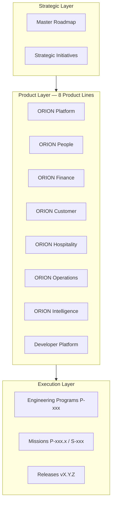
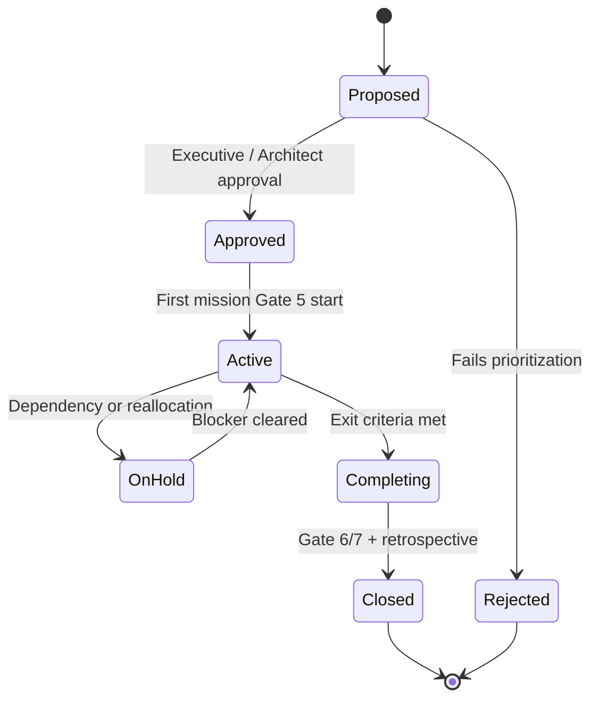

# ORION Enterprise Portfolio Management Framework

**Document ID:** PORTFOLIO-001  
**Mission:** P-014.3 — ORION Enterprise Portfolio Management Framework  
**Version:** 1.0  
**Status:** Ratified — Governing Portfolio Standard  
**Classification:** Executive Portfolio · Governance · Planning  
**Authority:** Chief Enterprise Architect  
**Effective Date:** August 2026  
**Planning Horizon:** 2026–2031  
**Architecture Baseline:** v1.0 Candidate (RC)

**Parent:** [G-001 Enterprise Architecture Governance Charter](../11_Governance/Governance/G-001-Enterprise-Architecture-Governance-Charter.md)  
**Baseline Sources:** [Enterprise Architecture Handbook v1.0](./ORION_Enterprise_Architecture_Handbook_v1.0.md) · [Master Roadmap v1.0](./ORION_Enterprise_Platform_Master_Roadmap_v1.0.md) · [Platform Strategy v1.0](./ORION_Enterprise_Platform_Strategy_v1.0.md) · [ES-097 ADR Policy](./ES-097-ORION-Architecture-Governance-ADR-Policy.md) · [Release Policy](../06_Releases/Release-Policy.md) · [Platform Retrospective v1.0](./ORION_Platform_Retrospective_v1.0.md)

**Hierarchy of authority:**

```
ORION Canon → G-001 Charter → Master Roadmap → Portfolio Framework (this document) → Programs / Missions
```

---

## Executive Summary

ORION manages a growing portfolio of **eight product lines**, **cross-cutting platform services**, **engineering programs**, and **strategic initiatives** spanning executive intelligence, enterprise domains, and future ecosystem capabilities. Without a unified portfolio framework, prioritization drifts toward visible features, domain work begins before platform readiness, and investment cannot be traced to commercial or architectural outcomes.

This document is the **official ORION Enterprise Portfolio Management Framework**. It defines how product lines, domains, releases, investments, engineering programs, and strategic initiatives are **planned, governed, prioritized, and measured**.

### Framework Purpose

| Question | This Framework Answers |
|----------|------------------------|
| What belongs in the portfolio? | Eight product lines + platform programs + strategic initiatives |
| How do we prioritize? | Weighted prioritization model — business value, readiness, risk, reuse, ROI |
| How do we invest? | Six investment categories with allocation guardrails |
| How do we govern? | Executive, architecture, quarterly, annual, and release planning cadence |
| How do we execute? | Program and mission lifecycle aligned to G-001 Gates 1–7 |
| How do we measure success? | Portfolio metrics dashboard — health, quality, debt, velocity, reuse |

### Current Portfolio State (August 2026)

| Dimension | State |
|-----------|-------|
| **Active release** | v1.0.1-rc1 · CONDITIONAL GO |
| **Reference domain** | ORION People (HCM) — certification template |
| **Critical program** | **P-015 — Platform Production Readiness** |
| **Next domain epic** | **P-009 — Enterprise Finance** (Gates 1–4 during P-015) |
| **Governance maturity** | Level 1+ → Level 2 transition |
| **Commercial GA** | **NO-GO** — persistence and RBAC block production |

### Executive Decision

| Assessment | Decision |
|------------|----------|
| **P-014.3 Portfolio Framework mission** | **GO** — ratified as official portfolio governance standard |
| **Portfolio structure and prioritization model** | **GO** — aligned with Master Roadmap and G-001 |
| **Current portfolio execution readiness** | **CONDITIONAL GO** — proceed under P-015 constraint; no new domain Gate 5 until GO |
| **Broad commercial portfolio GA** | **NO-GO** — design partner scope only until P-015 + P-009 path clear |

---

## 1. Portfolio Vision, Objectives, and Alignment

### 1.1 Portfolio Vision

ORION's portfolio exists to deliver a **coherent Executive Operating System** — not a collection of disconnected products. Every portfolio item must either strengthen the platform foundation, deliver authoritative domain truth for executives, or enable governed intelligence and ecosystem growth.

**Portfolio vision statement:**

> Manage ORION investments as a unified enterprise portfolio where platform readiness precedes domain expansion, architecture gates precede implementation, and every release advances measurable executive and commercial outcomes.

### 1.2 Portfolio Objectives

| # | Objective | Success Measure | Horizon |
|---|-----------|-----------------|---------|
| O1 | **Maximize executive outcome per engineering dollar** | Executive Brief signal quality · time-to-insight | Ongoing |
| O2 | **Maintain architectural integrity at scale** | Facade violations = 0 · certification pass rate | Ongoing |
| O3 | **Sequence investments by dependency** | No Gate 5 domain work before P-015 GO | 2026–2027 |
| O4 | **Enable credible commercial progression** | Design partner → bundle → GA milestones | 2027–2029 |
| O5 | **Govern technical debt explicitly** | P0 = 0 at GA · 100% P1 ownership | Per release |
| O6 | **Increase platform reuse across domains** | Reuse Index ≥ target (§8) | 2027+ |
| O7 | **Predictable release delivery** | Release predictability score ≥ 80% | 2027+ |

### 1.3 Business Alignment

Portfolio decisions shall align to [Master Roadmap business goals](./ORION_Enterprise_Platform_Master_Roadmap_v1.0.md#13-business-goals):

| Business Goal | Portfolio Implication |
|---------------|----------------------|
| Reduce executive cognitive load | Intelligence and Brief investments prioritized over raw data features |
| Improve decision quality | Explainability required for all AI and intelligence portfolio items |
| Unify enterprise operations | Cross-domain IIL investments before standalone domain silos |
| Enable design partner revenue | People + Platform GA before broad multi-domain sales |
| Credible ERP replacement | Finance + Customer + People bundle sequencing enforced |
| Vertical differentiation | Hospitality as accelerator — not primary sequence driver |

**Business alignment rule:** No portfolio item enters Gate 5 without documented linkage to at least one Master Roadmap business goal or an approved ADR exception.

### 1.4 Technology Alignment

Portfolio decisions shall align to [Master Roadmap technology goals](./ORION_Enterprise_Platform_Master_Roadmap_v1.0.md#14-technology-goals) and [Handbook engineering principles](./ORION_Enterprise_Architecture_Handbook_v1.0.md):

| Technology Goal | Portfolio Implication |
|-----------------|----------------------|
| Reference architecture for all domains | HCM pattern is mandatory template — retrofits before greenfield |
| Production persistence (ES-036) | P-015 receives Critical investment category until GO |
| Platform RBAC | Shared platform investment — not per-domain one-offs |
| Durable IIL transport | Platform program — parallel with Finance, not deferred indefinitely |
| Governance Level 2 | ES-092–095 completion in Maintenance + Platform categories |
| Full test suite green | Release quality gate — blocks GA portfolio promotion |

**Technology alignment rule:** Architecture Review Board (ARB) may **block** portfolio promotion if an item violates handbook invariants or lacks required ADR coverage per [ES-097](./ES-097-ORION-Architecture-Governance-ADR-Policy.md).

---

## 2. Portfolio Structure

ORION organizes the enterprise portfolio into **three layers**:



| Layer | Unit | Example | Owner |
|-------|------|---------|-------|
| **Strategic** | Roadmap milestone · initiative | Enterprise Platform v3 | Chief Enterprise Architect |
| **Product** | Product line | ORION Finance | Domain Lead + Product |
| **Execution** | Program → Mission → Release | P-009 → P-009.1 → v1.2.x | Engineering Lead |

### Product Line Registry

Each product line maintains a **portfolio record** updated at quarterly planning. Fields below reflect **August 2026 baseline**.

---

### 2.1 ORION Platform

| Field | Value |
|-------|-------|
| **Purpose** | Core multi-tenant services, governance, release discipline, shared infrastructure |
| **Capabilities** | Identity · Organization · IIL · Workflow · Data Platform · Audit · Search · Notifications · Release framework |
| **Dependencies** | None (foundation) |
| **Owner** | Chief Enterprise Architect · Platform Engineering Lead |
| **Architecture Status** | **Strong** — Handbook v1.0 · ES-090–097 (partial enforcement) |
| **Commercial Status** | Enabler — not sold separately initially |
| **Technology Readiness** | **TRL 7** — functional RC; persistence/RBAC not GA |
| **Strategic Priority** | **Critical** — P-015 blocks entire portfolio |

**Active programs:** P-015 · P-011 Phase II · P-010.7 (planned) · P-013 completion (ES-092–095)

---

### 2.2 ORION People

| Field | Value |
|-------|-------|
| **Purpose** | Workforce management — org structure, time, attendance, payroll events, talent, HR intelligence |
| **Capabilities** | HCM domain · 48 REST APIs · 67+ IIL events · 13 workflow triggers · People workspace |
| **Dependencies** | ORION Platform (identity, IIL, workflow, persistence post-P-015) |
| **Owner** | HCM Domain Lead |
| **Architecture Status** | **Reference domain** — ES-HCM-001 · v1.0.1-rc1 CONDITIONAL GO |
| **Commercial Status** | Design partner RC · HCM-only pilots CONDITIONAL GO |
| **Technology Readiness** | **TRL 8** — RC complete; P0 debt (TD-HCM-001, TD-HCM-005) |
| **Strategic Priority** | **Critical** — certification template · GA with P-015 |

**Active programs:** P-012 stabilization · P-015 HCM persistence/RBAC

---

### 2.3 ORION Finance

| Field | Value |
|-------|-------|
| **Purpose** | Authoritative financial truth — GL, AR/AP, cash, financial intelligence via IIL |
| **Capabilities** | Finance workspace UI · D-007/D-008/D-009 blueprints · ES-FIN-001 draft |
| **Dependencies** | Platform (persistence, RBAC) · People (workforce events) · Customer (revenue events) |
| **Owner** | Finance Domain Lead *(to be assigned)* |
| **Architecture Status** | **Ready for Gates 1–4** — blueprints approved · Gate 5 blocked until P-015 GO |
| **Commercial Status** | Workspace demo · placeholder data · NO-GO production |
| **Technology Readiness** | **TRL 4** — design complete · implementation not started |
| **Strategic Priority** | **Critical** — first domain after P-015 · highest TAM |

**Active programs:** P-009 (architecture preparation) · Missions 15A–15C (workspace — delivered)

---

### 2.4 ORION Customer

| Field | Value |
|-------|-------|
| **Purpose** | Commercial relationships — accounts, pipeline, customer intelligence, revenue events |
| **Capabilities** | CRM workspace · party model · opportunity management · P-008.8 certified |
| **Dependencies** | Platform · Finance (revenue recognition · authoritative ledger) |
| **Owner** | Commercial Domain Lead |
| **Architecture Status** | **Certified workspace** — pre-handbook patterns · P-008 Phase II planned |
| **Commercial Status** | CONDITIONAL GO workspace · bundle component post-Finance |
| **Technology Readiness** | **TRL 6** — functional · needs facade/repository convergence |
| **Strategic Priority** | **High** — third in build sequence after P-009 |

**Active programs:** P-008 Phase II (planned 2027 H2) · doc cert remediation

---

### 2.5 ORION Hospitality

| Field | Value |
|-------|-------|
| **Purpose** | Property and guest operations — reservations, folio, billing, revenue operations |
| **Capabilities** | Hospitality workspace · P-007 program · P-007.6 billing architecture |
| **Dependencies** | Platform · Finance (enterprise accounting) · Customer (optional party link) |
| **Owner** | Hospitality Domain Lead |
| **Architecture Status** | **Certified workspace** — P-007.8 CONDITIONAL GO |
| **Commercial Status** | Vertical pilot possible · not primary enterprise sequence |
| **Technology Readiness** | **TRL 6** — workspace functional · deep integrations pending |
| **Strategic Priority** | **High** — vertical accelerator · parallel if design partner driven |

**Active programs:** P-007 maintenance · P-007 Phase II (2028+)

---

### 2.6 ORION Operations

| Field | Value |
|-------|-------|
| **Purpose** | Supply chain and operational execution — procurement, inventory, supply chain, operations health |
| **Capabilities** | ES-058 operations framework · Procurement/Inventory/SCM — not started |
| **Dependencies** | Platform · Finance (sub-ledgers, cost posting) |
| **Owner** | Operations Domain Lead *(future assignment)* |
| **Architecture Status** | **Framework only** — domains require Finance first |
| **Commercial Status** | Not market-ready · mid-market ERP completeness play |
| **Technology Readiness** | **TRL 2** — concept and framework |
| **Strategic Priority** | **Medium** — 2028–2029 after Finance GA path |

**Active programs:** None at Gate 5 · PB-080 Operations workspace in backlog

---

### 2.7 ORION Intelligence

| Field | Value |
|-------|-------|
| **Purpose** | Executive intelligence — Brief, engines, analytics, governed AI |
| **Capabilities** | Executive Brief · Shell · Command Palette · Provider Framework · ES-020/021 engines |
| **Dependencies** | All domain product lines (authoritative IIL events) · Platform (IIL, search, memory) |
| **Owner** | Chief Architect · Intelligence Platform Lead |
| **Architecture Status** | **Strong UX** · TD-003 dual pipeline · analytics not started |
| **Commercial Status** | Differentiation layer · bundled with platform |
| **Technology Readiness** | **TRL 6** — assistive AI today · predictive future |
| **Strategic Priority** | **High** — retention driver · Analytics after domain events |

**Active programs:** Brief enhancement (2027) · Analytics workspace (2028–2029) · ES-039 AI Platform

---

### 2.8 Developer Platform

| Field | Value |
|-------|-------|
| **Purpose** | Partner ecosystem — APIs, connectors, marketplace, extension certification |
| **Capabilities** | HCM REST API surface · facade contract · P-010.7 planned · ES-060 future |
| **Dependencies** | Platform GA · ≥2 authoritative domain APIs · Integration Hub |
| **Owner** | Platform Engineering Lead |
| **Architecture Status** | **API patterns proven** · ecosystem infrastructure deferred |
| **Commercial Status** | Not revenue-ready · long-term network effects |
| **Technology Readiness** | **TRL 3** — foundation only |
| **Strategic Priority** | **Low** until GA ecosystem · **Medium** from 2028 for Integration Hub |

**Active programs:** P-010.7 Integration Hub (2027–2028)

---

## 3. Investment Strategy

### 3.1 Investment Categories

All portfolio work shall be classified into **one primary** and **optional secondary** investment category for traceability and allocation reporting.

| Category | Definition | Typical Work | Allocation Guardrail |
|----------|------------|--------------|---------------------|
| **Strategic** | Advances Master Roadmap milestones and executive platform generations (v2/v3/v4) | P-009 Finance · P-008 Phase II · design partner program | 40–50% of engineering capacity |
| **Platform** | Cross-cutting capabilities consumed by all product lines | P-015 · persistence · RBAC · IIL durable transport · P-011 | 25–35% until GA; then 15–25% |
| **Innovation** | New capability with unproven ROI but strategic option value | Analytics projections · AI agents · mobile shell | ≤ 15% |
| **Maintenance** | Sustains certified releases — patches, dependency updates, RC stabilization | v1.0.1-rc1 fixes · security patches | 10–15% |
| **Technical Debt** | Remediation of TD-xxx register items | TD-HCM-001 · TD-HCM-005 · doc cert failures | P0: unlimited until closed; P1: planned |
| **Research** | Spikes, prototypes, ADR alternatives — no production commitment | Persistence store evaluation · CQRS spike | ≤ 5% |

### 3.2 Investment Allocation Rules

1. **P0 technical debt overrides category caps** — TD-HCM-001 and TD-HCM-005 are Strategic + Technical Debt until closed
2. **No Strategic domain Gate 5** while Platform category cannot fund P-015 exit
3. **Innovation + Research combined ≤ 20%** until platform GA (Enterprise Platform v2)
4. **Maintenance increases post-GA** — LTS product lines require explicit maintenance budget
5. **Every program declares primary category** in its charter document

### 3.3 Investment Approval Authority

| Investment Size | Scope | Approver |
|-----------------|-------|----------|
| Mission (P-xxx.x) | Single deliverable | Engineering Lead + Domain Lead |
| Program (P-xxx) | Multi-mission epic | Chief Enterprise Architect |
| Strategic initiative | Cross-program · roadmap milestone | Founder / Chief Architect |
| Category reallocation > 10% | Quarterly plan change | Executive portfolio review |

---

## 4. Prioritization Model

Portfolio items compete for capacity. ORION uses a **weighted scoring model** derived from [P-014.1 domain assessment](./ORION_Enterprise_Platform_Strategy_v1.0.md#4-domain-assessment-matrix) and Master Roadmap build sequence.

### 4.1 Scoring Dimensions

Each candidate item is scored **1–5** on seven dimensions:

| Dimension | Weight | Score 5 (Best) | Score 1 (Worst) |
|-----------|--------|----------------|-----------------|
| **Business Value** | 20% | Direct executive outcome · high TAM | Niche · indirect value |
| **Architecture Readiness** | 20% | Gates 1–4 complete · patterns exist | Greenfield · no blueprint |
| **Risk (inverse)** | 15% | Low dependency · proven pattern | High dependency · novel architecture |
| **Customer Value** | 15% | Design partner committed · revenue path | Internal only · speculative |
| **Platform Reuse** | 15% | Benefits all domains (e.g., persistence) | Single-domain · no reuse |
| **Engineering Effort (inverse)** | 10% | Low effort · high readiness | Multi-year · high uncertainty |
| **ROI** | 5% | Revenue enablement within 12 months | Long payback · cost center |

**Priority Score** = Σ (dimension score × weight)

### 4.2 Priority Tiers

| Tier | Score Range | Portfolio Action |
|------|-------------|------------------|
| **Critical** | ≥ 4.2 | Approved for immediate execution · may preempt lower tiers |
| **High** | 3.5 – 4.19 | Scheduled in current or next quarter · resource committed |
| **Medium** | 2.8 – 3.49 | Backlog · Gates 1–4 may proceed if capacity allows |
| **Low** | < 2.8 | Deferred · research or future horizon only |

### 4.3 Hard Constraints (Override Scores)

These rules **override** prioritization scores regardless of calculated rank:

| Constraint | Rule |
|------------|------|
| **P-015 gate** | No domain Gate 5 until P-015 GO certification |
| **Finance before Operations** | Procurement, Inventory, SCM cannot enter Gate 5 before Finance sub-ledger path |
| **Events before Analytics** | Analytics workspace blocked until authoritative domain events exist |
| **P0 debt** | Open P0 blocks GA promotion for affected product line |
| **G-001 gates** | No implementation before Gate 4 ES approval |
| **AI safety** | AI portfolio items cannot mutate ledger/HR without human approval |

### 4.4 Reference Prioritization (August 2026)

| Rank | Item | Tier | Score (est.) |
|------|------|------|--------------|
| 1 | P-015 Platform Production Readiness | **Critical** | 4.8 |
| 2 | P-009 Enterprise Finance (Gates 1–4) | **Critical** | 4.5 |
| 3 | ES-092–095 Governance completion | **High** | 4.1 |
| 4 | P-008 CRM Enterprise Phase II | **High** | 3.9 |
| 5 | P-010.7 Integration Hub foundation | **High** | 3.8 |
| 6 | P-011 Data Platform Phase II | **Medium** | 3.4 |
| 7 | Analytics workspace | **Medium** | 3.2 |
| 8 | Developer marketplace | **Low** | 2.4 |

---

## 5. Portfolio Governance Model

### 5.1 Governance Bodies

| Body | Chair | Cadence | Scope |
|------|-------|---------|-------|
| **Executive Portfolio Review** | Founder / Chief Architect | Quarterly | Roadmap alignment · investment allocation · commercial GO/NO-GO |
| **Architecture Review Board (ARB)** | Chief Enterprise Architect | Monthly | ADRs · Gate 4 approvals · architecture compliance |
| **Quarterly Planning** | Chief Enterprise Architect + Engineering Lead | Quarterly | Program commitment · capacity · next quarter missions |
| **Annual Planning** | Executive team | Annual | Master Roadmap refresh · budget · hiring · milestone v2/v3/v4 |
| **Release Planning** | Chief Architect | Per RC/GA | Release scope · certification · tag approval |

### 5.2 Executive Reviews

**Purpose:** Align portfolio execution to business outcomes and commercial readiness.

| Agenda Item | Input | Output |
|-------------|-------|--------|
| Master Roadmap progress | Roadmap §11 consolidated view | Milestone status RAG |
| Product line commercial status | §2 portfolio records | Design partner / GA decisions |
| Investment allocation | §3 category report | Reallocation if >10% shift |
| Portfolio metrics | §8 dashboard | Action items for red metrics |
| Strategic blockers | P0 debt · certification | Escalation and resource assignment |

**Cadence:** Quarterly · additional session before GA or major release  
**Artifact:** Executive Portfolio Review minutes · stored `docs/00_Governance/Reviews/`

### 5.3 Architecture Reviews

**Purpose:** Enforce handbook invariants and ADR policy before and during implementation.

| Trigger | Checklist | Authority |
|---------|-----------|-----------|
| Gate 4 ES approval | [G-001 Architecture Review Checklist](../11_Governance/Governance/G-001-Architecture-Review-Checklist.md) | ARB |
| Pre-RC release | Facade · IIL · tenancy · test evidence | Chief Enterprise Architect |
| ADR submission | [ES-097 §3](./ES-097-ORION-Architecture-Governance-ADR-Policy.md) | ARB |
| Portfolio promotion | Architecture readiness + dependency matrix | ARB recommendation → Executive |

**Cadence:** Monthly ARB · ad hoc for Gate 4 and breaking changes

### 5.4 Quarterly Planning

**Purpose:** Commit programs and missions for the next 90 days.

| Step | Activity | Owner |
|------|----------|-------|
| 1 | Review portfolio metrics and open P0/P1 debt | Engineering Lead |
| 2 | Score backlog items (§4 prioritization model) | Domain Leads |
| 3 | Allocate capacity by investment category (§3) | Chief Enterprise Architect |
| 4 | Assign missions with mission IDs (P-xxx.x / S-xxx) | Engineering Lead |
| 5 | Publish quarterly portfolio plan | Portfolio office |

**Output:** Quarterly Portfolio Plan — programs, missions, capacity %, deferred items with rationale

### 5.5 Annual Planning

**Purpose:** Refresh strategic horizon and investment thesis.

| Activity | Timing | Output |
|----------|--------|--------|
| Master Roadmap review / revision | Q3 each year | Roadmap vX.Y update |
| Product line strategy refresh | Q3 | Updated §2 portfolio records |
| Investment category targets | Q4 | Next year allocation guardrails |
| Executive milestone declaration | Q4 | v2/v3/v4 target confirmation |
| Governance maturity assessment | Q4 | Level 1–4 score vs ES-097 |

### 5.6 Release Planning

**Purpose:** Govern what ships, when, and under what certification decision.

Aligned with [Release Policy](../06_Releases/Release-Policy.md) and [G-001 Release Governance Guide](../11_Governance/Governance/G-001-Release-Governance-Guide.md):

| Stage | Portfolio Gate | Certification Minimum |
|-------|----------------|----------------------|
| Alpha | Internal program complete | CONDITIONAL GO acceptable |
| Beta | Design partner scope defined | CONDITIONAL GO · P1 documented |
| RC | Feature freeze · P0 plan for GA | GO or CONDITIONAL GO |
| GA | **Portfolio promotion** | **GO · zero open P0** |
| LTS | Product line maintenance declaration | GA + LTS policy |

**Release portfolio rule:** A product line cannot advance commercial status (e.g., RC → GA) without matching release certification and updated portfolio record.

---

## 6. Engineering Programs and Missions

### 6.1 Definitions

| Term | ID Pattern | Scope | Example |
|------|------------|-------|---------|
| **Program** | P-xxx | Multi-mission epic spanning quarters | P-015 Platform Production Readiness |
| **Mission** | P-xxx.x · S-xxx | Deliverable unit completable in 2–8 weeks | P-015.1 Persistence ADR |
| **Initiative** | Named strategic effort | Cross-program · executive milestone | Enterprise Platform v2 GA |

### 6.2 Program Lifecycle



| State | Entry Criteria | Exit Criteria |
|-------|----------------|---------------|
| **Proposed** | Business case · category · owner | Approval or rejection at quarterly planning |
| **Approved** | Executive or architect sign-off · capacity allocated | First mission begins |
| **Active** | ≥1 mission in Gate 5 | All missions complete or transferred |
| **On Hold** | Dependency blocker documented | Blocker cleared · ADR if needed |
| **Completing** | All mission deliverables done | Certification + documentation |
| **Closed** | Exit criteria verified | Retrospective filed · portfolio record updated |

### 6.3 Mission Lifecycle

Every mission follows [G-001 Gates 1–7](../11_Governance/Governance/G-001-Enterprise-Architecture-Governance-Charter.md#3-mandatory-review-gates):

| Phase | Gate | Portfolio Checkpoint |
|-------|------|---------------------|
| Discovery | 1–2 | Blueprint + domain model approved |
| Design | 3–4 | ES-xxx approved — **no code before Gate 4** |
| Build | 5 | Implementation · four validation gates pass |
| Verify | 6 | Certification report — GO / CONDITIONAL GO / NO-GO |
| Ship | 7 | Release tag · portfolio commercial status update |

**Mission identification rule:** Every mission, prompt, commit, and test references its mission ID per [ES-091 §2.2](./ES-091-ORION-Enterprise-Development-Standards.md).

### 6.4 Approval Gates Summary

| Gate | Deliverable | Portfolio Role |
|------|-------------|----------------|
| **1** | Business Domain Blueprint (D-xxx) | Confirms product line fit |
| **2** | Domain Model | Confirms bounded context |
| **3** | Governance Rules | Confirms compliance scope |
| **4** | Engineering Specification (ES-xxx) | **Investment committed to build** |
| **5** | Implementation | Capacity consumed · velocity tracked |
| **6** | Certification | Quality and architecture verified |
| **7** | Release approval | Commercial and portfolio status advanced |

### 6.5 Program Completion Criteria

A program closes when **all** of the following are satisfied:

| Criterion | Evidence |
|-----------|----------|
| All missions Gate 6+ complete | Certification reports in `docs/11_Governance/Certification/` |
| Exit criteria from program charter met | Documented in program plan |
| Documentation deliverable complete | ES-xxx · catalogues · release notes |
| Technical debt addressed or governed | TD-xxx closed or accepted with ADR |
| Portfolio record updated | §2 product line status refreshed |
| Retrospective filed (programs ≥ P-010) | Lessons learned document |

**Reference program — P-015 exit criteria:** GO certification · persistent HCM · platform RBAC · 800/800 tests · ES-092–095 ratified.

---

## 7. Portfolio Metrics

Portfolio metrics roll up from [Master Roadmap KPIs](./ORION_Enterprise_Platform_Master_Roadmap_v1.0.md#7-platform-kpis) and [ES-097 §9 governance metrics](./ES-097-ORION-Architecture-Governance-ADR-Policy.md#9-governance-metrics). Report at monthly ARB and quarterly executive review.

### 7.1 Platform Health

| Metric | Source | RC Target | GA Target |
|--------|--------|-----------|-----------|
| Overall platform maturity (1–5) | Retrospective · Roadmap §7.7 | ≥ 3.4 | ≥ 4.0 |
| Open P0 count | TECHNICAL_DEBT.md | Documented | **0** |
| Governance maturity level | ES-097 | Level 2 in progress | Level 2 enforced |
| Product audit score | AUD-001 / AUD-002 | ≥ 68 | ≥ 75 |

### 7.2 Architecture Quality

| Metric | Source | Target |
|--------|--------|--------|
| Engineering health score | S-001.1 | ≥ 75 RC · ≥ 85 GA |
| Architecture consistency | Certification dimension | ≥ 80% RC · ≥ 90% GA |
| Facade boundary violations | Architecture tests | **0** |
| Pending ADR age | ADR index | < 30 days average |
| Undocumented breaking changes | Release audit | **0** |

### 7.3 Technical Debt

| Metric | Source | Target |
|--------|--------|--------|
| P0 open | Debt register | 0 at GA |
| P1 with owner + target release | Debt register | 100% |
| Debt age > 2 releases | ARB | Escalate or ADR-accept |
| Debt remediated per quarter | Portfolio report | Trending down |

### 7.4 Documentation Quality

| Metric | Source | Target |
|--------|--------|--------|
| ES-090–097 ratification | Governance index | 8/8 at GA |
| Domain ES per GA product line | Certification tests | 100% |
| API + Event catalogues complete | Domain docs | All GA lines |
| Documentation certification pass | `npm test` doc tests | 100% |

### 7.5 Release Predictability

| Metric | Definition | Target |
|--------|------------|--------|
| Planned vs actual release date | Days variance from release plan | ≤ 14 days RC · ≤ 7 days patch |
| Certification first-pass rate | GO or CONDITIONAL GO without rework | ≥ 80% |
| Regression count per release | New failures introduced | 0 at GA |
| Release artifact completeness | Notes + cert + changelog | 100% |

### 7.6 Velocity

| Metric | Definition | Use |
|--------|------------|-----|
| Missions completed / quarter | Gate 6+ missions closed | Capacity planning |
| Gate 4 → Gate 6 cycle time | Days from ES approval to certification | Process efficiency |
| Four validation gates pass rate | CI green on merge | Quality trend |
| Program milestone hit rate | % roadmap milestones on time | Executive RAG |

*Velocity is a **planning signal**, not a performance target — quality gates are never bypassed to increase velocity.*

### 7.7 Reuse Index

| Metric | Definition | Target |
|--------|------------|--------|
| **Reuse Index** | % of domain capabilities using shared platform abstractions (persistence, RBAC, IIL, workflow) | ≥ 70% at GA · ≥ 85% at v3 |
| Shared test pattern adoption | Domains using Operations + Facade + Cert test template | All GA domains |
| Cross-domain event consumers | Domains subscribing via IIL (not direct reads) | 100% |
| Platform service consumption | Domains using identity, org, audit | 100% |

**Reuse Index calculation:**

```
Reuse Index = (shared abstraction touchpoints) / (total domain integration touchpoints) × 100
```

Measured per product line at quarterly planning; platform average reported to executive review.

---

## 8. Future Expansion

The following expansion areas are **in portfolio horizon** but **not current execution priorities**. Each requires Master Roadmap amendment and executive approval before program approval.

| Expansion Area | Product Line | Earliest Horizon | Prerequisite |
|----------------|--------------|------------------|--------------|
| **Partner Ecosystem** | Developer Platform | 2030 | Platform GA · ≥2 domain APIs · Integration Hub |
| **Marketplace** | Developer Platform | 2030–2031 | ES-060 · extension certification framework |
| **Developer SDK** | Developer Platform | 2028 | Public API catalogue · P-010.7 |
| **Cloud Services** | ORION Platform | 2029+ | Multi-tenant GA · ops runbooks · SLA framework |
| **AI Platform (predictive)** | ORION Intelligence | 2029–2030 | Authoritative multi-domain data · ES-039 maturation |

### Expansion Governance Rules

1. **No expansion program at Gate 5** until Critical tier items (P-015, P-009) achieve defined exit criteria
2. **Expansion items default to Innovation or Research category** until commercial case approved
3. **Partner-facing APIs require Gate 4 ES** with backward-compatibility ADR
4. **Marketplace extensions must pass ES-096 certification** — same quality bar as internal domains
5. **AI expansion must comply with deterministic core principle** — explainability layer only until explicit executive approval for governed agents

---

## 9. Output — Portfolio Framework Summary

### Portfolio Framework

| Element | Standard |
|---------|----------|
| **Structure** | 3 layers — Strategic · Product (8 lines) · Execution (Program → Mission → Release) |
| **Investment** | 6 categories with allocation guardrails |
| **Prioritization** | 7-dimension weighted model + hard constraints |
| **Execution** | G-001 Gates 1–7 · program/mission lifecycle |
| **Measurement** | 7 metric domains · quarterly reporting |

### Governance Model

| Cadence | Body | Primary Output |
|---------|------|----------------|
| Monthly | ARB | ADR decisions · Gate 4 approvals |
| Quarterly | Executive Portfolio Review | Investment allocation · commercial status |
| Quarterly | Planning session | Quarterly Portfolio Plan |
| Annual | Executive team | Roadmap refresh · milestone targets |
| Per release | Release planning | Certification · tag · portfolio promotion |

### Investment Strategy (2026 H2 – 2027 H1)

| Category | Priority Allocation | Focus |
|----------|---------------------|-------|
| **Strategic + Technical Debt** | 50%+ | P-015 · TD-HCM-001 · TD-HCM-005 |
| **Platform** | 25% | ES-092–095 · IIL durability planning |
| **Maintenance** | 15% | v1.0.1-rc1 stabilization |
| **Innovation + Research** | ≤ 10% | Finance Gate 1–4 prep only |

### Prioritization Model

**Formula:** 7 weighted dimensions → tier (Critical / High / Medium / Low) → hard constraint validation → quarterly commitment

**Current Critical path:** P-015 → P-009 (Gates 1–4) → P-009 Gate 5 (post-GO)

---

## 10. Certification — P-014.3 Portfolio Framework Mission

| Criterion | Result |
|-----------|--------|
| Portfolio vision, objectives, business and technology alignment | ✅ Pass |
| Eight product lines with purpose, capabilities, dependencies, owner, status fields, priority | ✅ Pass |
| Six investment categories with guardrails | ✅ Pass |
| Prioritization model (7 dimensions + tiers + constraints) | ✅ Pass |
| Portfolio governance (executive, architecture, quarterly, annual, release) | ✅ Pass |
| Engineering program and mission lifecycle with G-001 gates | ✅ Pass |
| Portfolio metrics (7 domains) | ✅ Pass |
| Future expansion defined with prerequisites | ✅ Pass |
| Evidence-based · aligned with Master Roadmap · handbook · G-001 · ES-097 · Release Policy · Retrospective | ✅ Pass |
| No production code changes | ✅ Pass |

### Executive Decisions

| Decision Area | Verdict | Notes |
|---------------|---------|-------|
| **Portfolio Framework ratification (P-014.3)** | **GO** | Official portfolio governance standard effective August 2026 |
| **Governance model and prioritization** | **GO** | Operates under Master Roadmap and G-001 |
| **Current portfolio execution** | **CONDITIONAL GO** | Execute under P-015 constraint · quarterly plans required |
| **Commercial portfolio GA** | **NO-GO** | Same blockers as Master Roadmap — persistence · RBAC · test suite |
| **Design partner portfolio (HCM)** | **CONDITIONAL GO** | Explicit RC scope · quarterly executive review |

### Immediate Actions

1. **Ratify** this framework as the portfolio governance companion to the Master Roadmap
2. **Establish** quarterly Executive Portfolio Review starting 2026 Q4
3. **Publish** Q4 2026 Quarterly Portfolio Plan with P-015 as sole Critical program
4. **Assign** Finance Domain Lead and classify P-009 as Strategic investment (Gates 1–4)
5. **Initialize** portfolio metrics dashboard from §7 baselines at first ARB after ratification

---

## Appendix A — Cross-Reference Index

| Topic | Document |
|-------|----------|
| Master Roadmap | [ORION_Enterprise_Platform_Master_Roadmap_v1.0.md](./ORION_Enterprise_Platform_Master_Roadmap_v1.0.md) |
| Platform strategy | [ORION_Enterprise_Platform_Strategy_v1.0.md](./ORION_Enterprise_Platform_Strategy_v1.0.md) |
| Architecture handbook | [ORION_Enterprise_Architecture_Handbook_v1.0.md](./ORION_Enterprise_Architecture_Handbook_v1.0.md) |
| Governance charter | [G-001](../11_Governance/Governance/G-001-Enterprise-Architecture-Governance-Charter.md) |
| ADR policy | [ES-097](./ES-097-ORION-Architecture-Governance-ADR-Policy.md) |
| Release policy | [Release-Policy.md](../06_Releases/Release-Policy.md) |
| Platform retrospective | [ORION_Platform_Retrospective_v1.0.md](./ORION_Platform_Retrospective_v1.0.md) |
| Technical debt | [TECHNICAL_DEBT.md](../TechnicalDebt/TECHNICAL_DEBT.md) |
| Testing & certification | [ES-096](./ES-096-ORION-Enterprise-Testing-Certification-Standards.md) |

---

## Appendix B — Glossary

| Term | Definition |
|------|------------|
| **Product line** | Commercial and architectural grouping — see §2 |
| **Program** | Multi-mission engineering epic (P-xxx) |
| **Mission** | Deliverable unit (P-xxx.x or S-xxx) |
| **Investment category** | Strategic · Platform · Innovation · Maintenance · Technical Debt · Research |
| **Reuse Index** | % shared platform abstraction adoption — §7.7 |
| **TRL** | Technology Readiness Level — 1 (concept) to 9 (proven production) |
| **Portfolio promotion** | Advancing product line commercial or architecture status after certified release |

---

*ORION Enterprise Platform · Enterprise Portfolio Management Framework v1.0 · Mission P-014.3 · August 2026*
