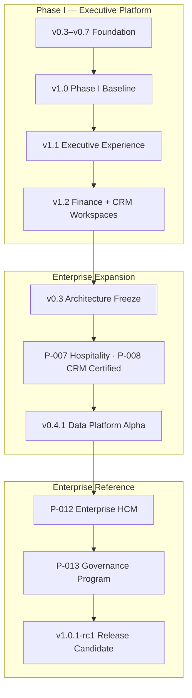

# ORION Platform Retrospective

**Document ID:** RETRO-PLATFORM-001  
**Mission:** P-013.12 — ORION Platform Retrospective & Lessons Learned  
**Version:** 1.0  
**Status:** Ratified — Executive Engineering Review  
**Classification:** Governance · Retrospective  
**Authority:** Chief Enterprise Architect  
**Effective Date:** August 2026  
**Review Period:** Platform inception through Enterprise HCM RC1 and P-013 Governance Program  

**Related:** [Enterprise Architecture Handbook v1.0](./ORION_Enterprise_Architecture_Handbook_v1.0.md) · [RELEASE_HISTORY.md](../06_Releases/RELEASE_HISTORY.md) · [ORION-Architecture-Baselines.md](../06_Releases/ORION-Architecture-Baselines.md) · [v1.0.1-rc1-Certification.md](../06_Releases/v1.0.1-rc1-Certification.md) · [G-001 Charter](../11_Governance/Governance/G-001-Enterprise-Architecture-Governance-Charter.md) · [ORION Engineering Principles](../09_Standards/ORION_Engineering_Principles.md)

---

## Executive Summary

ORION began as an **Executive Operating System** vision — transform operational data into explainable executive intelligence — and evolved through three distinct maturity phases in under twelve months of intensive engineering:

1. **Foundation & Executive Experience** (v0.3–v1.2) — shell, brief, workspaces, intelligence engines  
2. **Enterprise Platform Expansion** (v0.4.x) — data platform, domain certification, architecture freeze  
3. **Enterprise Reference Architecture** (v1.0.1-rc1, P-013) — HCM as the gold-standard domain, governance codified  

**The platform succeeded** where it committed to architecture before scale: the Business Workspace Pattern (ADR-005), Intelligence Integration Layer (P-006), and the HCM facade layering model produced a domain that AI assistants, human engineers, and certification tests could all validate consistently.

**The platform struggled** where governance lagged implementation: in-memory persistence accepted too long, release documentation scattered across folders, ADR-001–003 left pending, and full-suite test health masked by domain-scoped green runs.

**Current state:** ORION v1.0.1-rc1 is **architecturally certified (CONDITIONAL GO)** — ready for RC stabilization and design-partner deployment with documented limitations. **Not ready for GA** until persistent storage, permission enforcement, and full-suite certification are green.

This retrospective captures what worked, what failed, and what every future domain must inherit.

### Retrospective Verdict

| Assessment | Decision |
|------------|----------|
| **P-013.12 retrospective mission** | **GO** — complete and actionable |
| **Platform enterprise readiness (GA)** | **CONDITIONAL GO** — RC authorized; GA blocked on P0 debt |
| **Governance program (P-013)** | **GO** — standards ratified; operational enforcement partial |
| **HCM reference domain** | **GO** — architecture certified; production persistence pending |

---

## 1. Timeline of ORION Evolution

| Period | Version / Mission | Theme |
|--------|-------------------|-------|
| Early 2026 | v0.3–v0.7 | Persistence contracts, design system, command center |
| Jul 2026 | v1.0.0 · v1.1.0 · v1.2.0 | Phase I freeze — Executive UX + Finance/CRM workspaces |
| Jul 2026 | ARCHITECTURE_FREEZE v0.3 | Enterprise domain map; Hospitality + CRM certified |
| Jul 2026 | v0.4.1-alpha · P-011 | Enterprise Data Platform Phase I |
| Jul–Aug 2026 | P-012 · S-002.3–S-002.9 | Enterprise HCM — full domain lifecycle |
| Aug 2026 | P-013.1–P-013.12 | Enterprise governance program + this retrospective |
| Aug 2026 | v1.0.1-rc1 | First enterprise release candidate |

---

## 2. Major Milestones

| Milestone | Date | Significance |
|-----------|------|--------------|
| ORION Canon v1.0 ratified | Jul 2026 | Supreme engineering constitution |
| Executive Shell + Brief (Missions 14A–14C) | Jul 2026 | Default executive landing; command palette |
| Finance Workspace (Missions 15A–15C) | Jul 2026 | First business workspace reference |
| CRM / Customer Intelligence (16A–16D) | Jul 2026 | Second workspace; intelligence pipeline consumer |
| Executive Intelligence Platform (17A–17B) | Jul 2026 | Provider-driven engines |
| G-001 Governance Charter | 31 Jul 2026 | Constitutional engineering gates |
| ARCHITECTURE_FREEZE v0.3 | 30 Jul 2026 | Pre-Finance enterprise freeze |
| Enterprise Data Platform v0.4.1-alpha | 31 Jul 2026 | Master data registry + sync engine |
| Intelligence Integration Layer (P-006) | Production-ready | Cross-domain event bus |
| Enterprise HCM v1.0 (P-012) | Aug 2026 | Reference domain — facade, API, events, workflow |
| Enterprise Architecture Handbook | Aug 2026 | P-013.1 — platform patterns codified |
| ES-090–ES-097 governance suite | Aug 2026 | Development, testing, ADR standards |
| Release framework consolidation | Aug 2026 | P-013.11 — single `docs/06_Releases/` |
| v1.0.1-rc1 tagged | Aug 2026 | HCM + governance RC |

---

## 3. Major Successes

### 3.1 Architecture & Engineering

| Success | Evidence | Impact |
|---------|----------|--------|
| **Single public facade per domain** | `hcmFacade` · `@/lib/crm` · `DataPlatformFacade` | Testable boundaries; AI-safe imports |
| **Layered call chain** | API → Facade → Service → Repository → Store | Consistent across HCM, Data Platform |
| **IIL event-driven integration** | 67+ HCM events; workflow-platform subscriber | Loose coupling; no cross-domain repo reads |
| **Workflow orchestrator pattern** | `HcmWorkflowOrchestrator` — no business rules | Clean separation of process from domain |
| **Business Workspace Pattern** | ADR-005; Finance, CRM, Hospitality | Predictable UX; shared shell |
| **Documentation certification tests** | `HcmDocumentationCertification.test.ts` | Docs cannot drift silently |
| **Organization isolation** | Repository-scoped queries; integration tests | Multi-tenant foundation |

### 3.2 Governance & Quality

| Success | Evidence | Impact |
|---------|----------|--------|
| **G-001 seven gates** | Blueprint → ES → Implementation → Certification → Release | Prevents ungoverned scope |
| **Honest CONDITIONAL GO** | HCM RC1, Data Platform alpha | Trustworthy release decisions |
| **Technical debt register** | ADR-004; TD-HCM-001–006 | Visible compromises |
| **P-013 governance suite** | Handbook + ES-090–ES-097 | AI and human share one rulebook |
| **Four validation gates** | typecheck · lint · test · build | Repeatable quality bar |

### 3.3 Product & Executive Experience

| Success | Evidence | Impact |
|---------|----------|--------|
| **Morning Executive Brief** | `/brief` canonical landing | Executive-first IA |
| **Explainability** | Confidence, factors, drawers | No black-box recommendations |
| **Command Palette** | Universal search; keyboard shortcuts | Power-user efficiency |
| **Design tokens** | `lib/design-tokens.ts` · CSS variables | Visual consistency foundation |

---

## 4. Major Challenges

| Challenge | Root Cause | Current Status |
|-----------|------------|----------------|
| **In-memory persistence everywhere** | Speed of iteration; deferred ES-036 | TD-HCM-001 blocks GA |
| **No production RBAC on domain APIs** | Platform session only | TD-HCM-005 blocks GA |
| **Dual intelligence paths** | Brief Bus vs Orchestrator evolution | TD-003 · consolidation needed |
| **Fragmented release documentation** | Organic growth across `docs/releases/` | **Resolved** P-013.11 |
| **Pending ADR acceptance** | ADR-001–003 never formalized | Backlog · ES-097 tracks |
| **Full suite not green** | Doc certification failures in CRM/Finance | 794/800 at HCM cert |
| **Incomplete domain REST coverage** | Payroll/talent facade-only | TD-HCM-002 documented |
| **Early workspace demo data** | Placeholder-first delivery | Finance/CRM static data |
| **Governance lag** | Code before ES on early missions | Corrected from P-012 onward |

---

## 5. Most Successful Engineering Decisions

Decisions that **proved valuable** and must be preserved for all future domains.

| Decision | When | Why It Worked |
|----------|------|---------------|
| **Facade + DI + Repository layering** | P-012 HCM | Testable without UI; AI respects boundaries |
| **Event-aware facade wrapper** | HCM foundation | Events publish after successful mutations — no missed lifecycle |
| **CustomEvent + domain discriminator** | IIL (`payload.hcmEventType`) | One bus; infinite domain event types |
| **Shared API envelope helpers** | S-002.7 `lib/hcm/api/` | Consistent REST; mappable HTTP status |
| **Mission IDs on everything** | S-002.x, P-013.x | Traceability in tests, docs, commits |
| **Certification before RC tag** | S-002.9 | Prevented premature GA narrative |
| **Architecture Handbook before next domain** | P-013.1 | HCM patterns became platform law |
| **CONDITIONAL GO as first-class outcome** | G-001, ES-096 | Honest staging; numbered remediation |
| **Business Workspace Pattern** | ADR-005 | Finance/CRM/Hospitality share shell DNA |
| **Provider independence** | Intelligence platform | ORION owns logic; providers supply data |

---

## 6. Engineering Decisions That Should Never Be Repeated

| Anti-Pattern | Example | Correct Approach |
|--------------|---------|------------------|
| **Business logic in React components** | Early workspace pages | Facade/service only; UI is presentation |
| **Cross-domain repository imports** | Avoided in HCM; risk in early code | IIL events only |
| **Undocumented public API changes** | Pre-facade HCM time routes | ES update + migration notes |
| **Silent technical debt** | Early placeholder stores | TD-xxx before merge |
| **Skipping Gates 1–4** | Early sprint velocity | Blueprint + ES before code |
| **Scattered release docs** | `docs/releases/` vs `06_Releases/` | Single canonical folder |
| **Claiming green without full suite** | Domain-only test reporting | Report full `npm test` counts |
| **Duplicate platform shells** | Prevented by ADR-005 | Executive Shell only |
| **AI merge without human review** | ES-091 §9.4 | Architecture review mandatory |
| **Accepting in-memory as "temporary" without target release** | Multiple domains | Owner + target release on every TD item |

---

## 7. Architecture Improvements Over the Journey

| Phase | Before | After |
|-------|--------|-------|
| **Workspace delivery** | Ad-hoc pages | ADR-005 standard sections |
| **Domain access** | Scattered service imports | Single facade export |
| **Cross-domain** | Direct coupling risk | IIL-only integration |
| **Approvals** | UI placeholders | Workflow platform + orchestrators |
| **API shape** | Inconsistent responses | Standard `{ success, data }` envelope |
| **Governance** | Informal CTO review | G-001 gates + ES-097 ADR policy |
| **Testing** | Ad-hoc unit tests | Pyramid + certification tests |
| **Documentation** | Optional | Deliverable validated in CI |
| **Release process** | Fragmented notes | Release-Policy + RELEASE_HISTORY |

---

## 8. Quality Improvements

| Area | Early State | Current State |
|------|-------------|---------------|
| **Type safety** | Progressive strictness | TypeScript strict project-wide |
| **Test count** | ~84 (Sprint 4) | 800+ full suite |
| **HCM coverage** | N/A | 79 tests · architecture + API + events + docs |
| **Lint gate** | Intermittent | Zero errors required for RC |
| **Build gate** | Manual | Required pre-merge |
| **Doc validation** | Manual | `existsSync` certification tests |
| **Certification** | Informal | GO / CONDITIONAL GO / NO-GO with reports |
| **Debt tracking** | Ad-hoc | ADR-004 register + inline TD-xxx |

**Remaining quality gaps:** full suite 794/800 · coverage not enforced repo-wide · E2E/Playwright deferred · load testing planned not executed.

---

## 9. Lessons from Certification

### 9.1 What Certification Taught Us

1. **Domain-scoped green is insufficient** — full-suite failures (CRM/Finance doc tests) undermine platform RC credibility even when HCM is perfect.
2. **CONDITIONAL GO is the honest RC outcome** — architecture can pass while production blockers (persistence, permissions) remain.
3. **Certification tests enforce doc discipline** — without them, catalogues drift from code within one sprint.
4. **Facade integration tests catch leakage** — repositories must not appear on public surface.
5. **Event catalogue uniqueness tests prevent duplicate workflow triggers** — `assertUniqueHcmEventCatalog()` caught real risks.
6. **Independent certification missions must not modify code under review** — S-002.9 validated this discipline.
7. **Engineering health scoring (S-001.1) surfaces architecture debt** — use it at every platform certification.

### 9.2 Certification Anti-Patterns Observed

| Anti-Pattern | Consequence |
|--------------|-------------|
| Certifying without recorded gate output | No audit trail |
| Treating lint warnings as acceptable at RC | Noise hides real regressions |
| NO-GO without remediation plan | S1E beta — blocked but actionable |
| Certifying UI without auth review | Security gap at API layer |

### 9.3 Certification Decision History

| Release / Domain | Decision | Key Lesson |
|------------------|----------|------------|
| S1E Platform Beta | NO-GO | Decision lifecycle gap blocked RC |
| v0.4.1 Data Platform | CONDITIONAL GO | Phase I scope honest; Phase II required |
| Enterprise HCM v1.0.1-rc1 | CONDITIONAL GO | Architecture reference; persistence pending |
| Hospitality P-007 | CONDITIONAL GO | Workspace certified; operational data gaps |
| Commercial P-008 | CONDITIONAL GO | Domain certified; doc tests still fail |

Reference: [G-001 Certification Process](../11_Governance/Governance/G-001-Certification-Process.md) · [ES-096](./ES-096-ORION-Enterprise-Testing-Certification-Standards.md)

---

## 10. Lessons from AI-Assisted Development

ORION was built substantially with **Cursor AI-assisted engineering**. The P-013 program explicitly codified rules for human and AI contributors.

### 10.1 Prompt Engineering Lessons

| Lesson | Detail |
|--------|--------|
| **Mission ID in every prompt** | `P-012.7`, `S-002.8`, `P-013.3` — scopes AI work precisely |
| **Explicit in/out of scope** | Prevents drive-by refactors |
| **Point to ES-xxx before coding** | AI reads handbook patterns; output conforms |
| **Require gate evidence in output** | "typecheck PASS" without command output is rejected |
| **Documentation-only missions stay docs-only** | P-013.x never touched production code — correct |
| **One mission per conversation arc** | Large epics split (S-002.7 API, S-002.8 docs, S-002.9 cert) |

### 10.2 Cursor Collaboration Lessons

| Lesson | Detail |
|--------|--------|
| **Read before write** | AI must inspect `lib/hcm/` before adding routes |
| **Follow AGENTS.md for Next.js** | Next 16 breaking changes — consult `node_modules/next/dist/docs/` |
| **Prefer small atomic diffs** | ES-091 — one logical change; easier human review |
| **Use codebase search for conventions** | Match existing `hcmOk`, `hcmFromError` patterns |
| **Conversation handoffs need summaries** | Long epics (P-012) require mission state in docs |
| **Don't trust model confidence** | Evidence-first — run `npm test` |

### 10.3 AI-Assisted Engineering Lessons

| What Works | What Fails |
|------------|------------|
| Generating tests mirroring `lib/` structure | Generating architecture without ADR |
| Refactoring routes to shared API helpers | Changing facade signatures without human approval |
| Creating governance docs from patterns | Skipping certification gates |
| Documentation certification tests | Auto-merge AI PRs |
| HCM as reference for next domain | "Fix" unrelated lint warnings across repo |

**Codified in:** [ES-091 §9](./ES-091-ORION-Enterprise-Development-Standards.md#9-ai-development-standards) · [ES-096 §4.4](./ES-096-ORION-Enterprise-Testing-Certification-Standards.md#44-ai-assisted-development-gates)

---

## 11. Release Management Lessons

| Lesson | Detail |
|--------|--------|
| **Consolidate early** | P-013.11 should have preceded first RC — scattered docs caused confusion |
| **One CHANGELOG authority** | `docs/06_Releases/CHANGELOG.md` |
| **RELEASE_HISTORY for executives** | Version timeline without reading RR-xxx archives |
| **Architecture baselines track maturity** | Phase I → v0.3 → v1.0 Candidate progression visible |
| **RC before GA — always** | v1.0.1-rc1 validates stabilization branch discipline |
| **Tag annotated with meaning** | `v1.0.1-rc1` message describes scope |
| **CONDITIONAL GO in release notes** | Never oversell GA readiness |
| **Cross-link certification reports** | Release notes → cert → debt register chain |
| **Supersede tags explicitly** | v1.0.0-rc1 → v1.0.1-rc1 documented |

Reference: [Release-Policy.md](../06_Releases/Release-Policy.md)

---

## 12. Technical Debt Patterns

Recurring debt themes — not one-off mistakes — that future missions must address systematically.

| Pattern | Manifestation | Domains Affected | Remediation Strategy |
|---------|---------------|------------------|----------------------|
| **In-memory store** | Data lost on restart | HCM, CRM, Data Platform, Audit | ES-036 persistence mission; repository swap |
| **Permission gap** | Session but no domain RBAC | HCM API, Finance (future) | Platform permission matrix integration |
| **Incomplete REST surface** | Facade without HTTP | HCM payroll/talent | S-002.x follow-on per ES scope |
| **Dual code paths** | Brief Bus vs Orchestrator | Intelligence | Unification ADR + migration |
| **Doc drift** | Catalogue ≠ code | CRM, Finance | Certification tests (HCM model) |
| **Pending ADRs** | ADR-001–003 Proposed | Executive shell | Accept or reject — do not leave pending |
| **Placeholder data** | Demo in workspace UI | Finance, Hospitality | Provider integration missions |
| **Test suite fragmentation** | Domain green, platform partial | Platform-wide | Fix CRM/Finance doc cert failures |

**Governance rule:** Every pattern above has TD-xxx or ADR — never silent recurrence.

---

## 13. Recommendations for Future Domains

Every new domain (Inventory, Procurement, Analytics, AI) **shall** follow the HCM reference model:

### 13.1 Before Code (Gates 1–4)

1. Domain Blueprint (D-xxx) approved  
2. Engineering Specification (ES-`<DOM>`-001) approved  
3. Event and API catalogues planned  
4. ADR for any deviation from Handbook patterns  

### 13.2 Implementation Checklist

- [ ] `lib/<domain>/` with facade, wiring, services, repositories, rules, events, workflow  
- [ ] `@/lib/<domain>` facade-only external imports  
- [ ] `ServiceContext.organizationId` on every operation  
- [ ] IIL events for material mutations  
- [ ] Workflow orchestrator (integration adapter — no business rules)  
- [ ] REST routes via `lib/<domain>/api/` helpers  
- [ ] Operations + Facade + Events + API + Certification tests  
- [ ] Documentation suite with certification test inventory  
- [ ] Technical debt register before RC  

### 13.3 Do Not Reinvent

| Need | Use |
|------|-----|
| Shell / navigation | Executive Shell + workspace sub-nav (ADR-005) |
| Events | IIL publish/subscribe (P-006) |
| Approvals | Workflow platform (P-010.2) |
| Master entities | Data Platform registry (P-011.1) when ready |
| Standards | ES-090–ES-097 |

---

## 14. Platform Maturity Assessment

Assessment against ES-097 governance maturity levels and enterprise readiness dimensions.

### 14.1 Governance Maturity

| Level | Description | ORION Status |
|-------|-------------|--------------|
| **Level 1 — Documented** | Gates and ADRs exist | **Achieved** · P-013 complete |
| **Level 2 — Enforced** | PR checks, ADR backlog cleared | **Partial** · ADR-001–003 pending |
| **Level 3 — Measured** | Metrics dashboard, ARB cadence | **Starting** · ES-097 §9 defined |
| **Level 4 — Optimized** | AI-assisted compliance hints | **Future** |

**Governance maturity: Level 1+ → Level 2 transition**

### 14.2 Engineering Maturity by Dimension

| Dimension | Score (1–5) | Notes |
|-----------|-------------|-------|
| Architecture consistency | **4.5** | HCM reference; early workspaces lag |
| Test discipline | **4.0** | Strong domain tests; full suite gap |
| Documentation | **4.5** | HCM suite exemplary; CRM/Finance drift |
| Release discipline | **3.5** | Improved P-013.11; first RC recent |
| Security / tenancy | **3.0** | Org isolation yes; RBAC incomplete |
| Persistence | **2.0** | In-memory dominant |
| Production readiness | **2.5** | RC appropriate; not GA |
| AI-assist compatibility | **4.5** | Governance enables safe automation |

**Weighted engineering maturity: 3.6 / 5.0 — Enterprise RC stage**

### 14.3 Product Maturity (Reference)

Product Audit AUD-001 (Jul 2026): **68/100** — strong Brief/CRM; constrained beta recommended. Enterprise HCM and governance work since audit improves engineering score; product score refresh recommended post-RC.

---

## 15. Next Strategic Priorities

Ordered by impact on GA path and platform evolution.

| Priority | Mission / Item | Rationale | Target |
|----------|----------------|-----------|--------|
| **P0** | TD-HCM-001 persistent store | GA blocker | v1.1.0 |
| **P0** | TD-HCM-005 permission hooks | Production security | v1.1.0 |
| **P1** | Fix CRM/Finance doc certification tests | Full suite green | v1.0.1 patch |
| **P1** | Accept ADR-001–003 or reject | Close governance backlog | Next ARB |
| **P1** | Complete ES-092–ES-095 (P-013.4–7) | UI/API/Event/Workflow standards | v1.0.2 |
| **P2** | Intelligence path unification | TD-003 dual pipeline | ADR + mission |
| **P2** | P-011 Phase II (reference data, metadata) | Data platform completion | v0.4.2+ |
| **P2** | TD-HCM-002 payroll/talent REST | External HTTP consumers | v1.1.0 |
| **P3** | E2E Playwright infrastructure | Executive flow validation | v1.2.0 |
| **P3** | ES-036 production persistence platform-wide | Beyond HCM | Platform mission |
| **Strategic** | Next domain (Inventory or Finance enterprise) | Apply HCM reference model | Gate 1 start |

---

## ORION Engineering Principles

Enduring principles that emerged from inception through Enterprise HCM RC1 and the P-013 Governance Program. These **summarize and extend** [ORION Engineering Principles](../09_Standards/ORION_Engineering_Principles.md) for the enterprise era.

### Product Principles

| # | Principle | Rule |
|---|-----------|------|
| P1 | **Executive first** | Every feature must improve executive decision-making |
| P2 | **Intelligence over information** | Transform data into explainable insight |
| P3 | **Explainability** | No black-box scores, alerts, or recommendations |
| P4 | **Deterministic core** | Same input → same output; AI explains, never alters calculations |

### Architecture Principles

| # | Principle | Rule |
|---|-----------|------|
| A1 | **Architecture before implementation** | Gates 1–4 complete before code |
| A2 | **Single public facade** | One entry point per domain — `@/lib/<domain>` |
| A3 | **Layered dependency** | API → Facade → Service → Repository → Store |
| A4 | **Organization isolation** | Every operation scoped by `ServiceContext.organizationId` |
| A5 | **Event-driven integration** | IIL for cross-domain communication — never direct repository reads |
| A6 | **Rules in engines** | Business validation in rules engines — not routes, UI, or orchestrators |
| A7 | **Workflow coordinates only** | Orchestrators map events to templates — no persistence or validation |

### Quality Principles

| # | Principle | Rule |
|---|-----------|------|
| Q1 | **Evidence before decisions** | Tests, gates, certification reports — not opinion |
| Q2 | **Certification before release** | GO / CONDITIONAL GO / NO-GO with recorded evidence |
| Q3 | **Documentation is deliverable** | ES-xxx, catalogues, guides ship with code |
| Q4 | **Technical debt is governed** | TD-xxx with owner and target release — P0 blocks GA |
| Q5 | **Regression prevention** | Every fix includes a test; full matrix on release |

### Collaboration Principles (Human + AI)

| # | Principle | Rule |
|---|-----------|------|
| C1 | **Mission-scoped work** | Every task traces to P-xxx / S-xxx |
| C2 | **Read standards before write** | Handbook, ES-xxx, domain guides first |
| C3 | **Human approval for architecture** | Facade, API, auth, persistence changes |
| C4 | **Review before merge** | AI-authored code requires human review — always |
| C5 | **Honest certification** | CONDITIONAL GO when production blockers exist |

### Release Principles

| # | Principle | Rule |
|---|-----------|------|
| R1 | **Semantic versioning** | Major · minor · patch with pre-release suffixes |
| R2 | **RC before GA** | Feature freeze on release branch; P0 fixes only |
| R3 | **Single release authority** | `docs/06_Releases/` canonical |
| R4 | **Architecture baseline on GA** | Update baselines when structure changes |

---

## Output — Retrospective Report Summary

| Section | Key Finding |
|---------|-------------|
| Timeline | Foundation → Enterprise Expansion → Reference Architecture in ~12 months |
| Successes | HCM reference domain, IIL, governance suite, honest certification |
| Challenges | Persistence, permissions, doc drift, fragmented releases (fixed) |
| Architecture | Facade layering and events proved decisive |
| Quality | 79/79 HCM tests; 794/800 platform suite |
| Certification | CONDITIONAL GO is the correct RC posture |
| AI development | Mission IDs + evidence-first + human review essential |
| Release | Consolidated framework in P-013.11 |
| Maturity | 3.6/5 engineering · Level 1+ governance |
| Priorities | Persistence, permissions, full suite green, ES-092–095 |

---

## Output — Lessons Learned (Top 10)

1. **Architecture before scale** — HCM succeeded because ES and layering preceded volume.  
2. **Facade is the AI contract** — single import point enables safe automation.  
3. **CONDITIONAL GO builds trust** — honest limits beat oversold GA.  
4. **Documentation tests prevent drift** — catalogue accuracy requires CI enforcement.  
5. **Consolidate release docs early** — one folder, one policy, one history.  
6. **Full suite matters** — domain green hides platform debt.  
7. **In-memory is not temporary without a date** — always TD-xxx + target release.  
8. **Mission IDs enable AI continuity** — scope survives conversation handoffs.  
9. **Orchestrators are not domain services** — workflow maps events; services own rules.  
10. **Governance program P-013 was necessary** — informal CTO review did not scale to enterprise.

---

## Output — Engineering Maturity Assessment

| Category | Rating | Trend |
|----------|--------|-------|
| Overall platform | **Enterprise RC** | ↑ from Beta prototype |
| Reference domain (HCM) | **Certified architecture** | ↑ strong |
| Governance | **Documented → Enforcing** | ↑ P-013 |
| Production readiness | **Not GA** | → blocked on P0 debt |
| AI-assist readiness | **High** | ↑ standards codified |

---

## Output — Strategic Recommendations

1. **Complete GA blockers** — TD-HCM-001 and TD-HCM-005 before v1.0.1 GA tag.  
2. **Green the full suite** — fix six CRM/Finance documentation certification failures.  
3. **Close ADR backlog** — accept or reject ADR-001–003 at next ARB.  
4. **Finish P-013 standards** — ES-092 through ES-095 for complete governance suite.  
5. **Launch next domain using HCM playbook** — Gates 1–4 before any Inventory/Procurement code.  
6. **Platform persistence mission** — ES-036 beyond HCM alone.  
7. **Refresh product audit** — post-RC score update for executive stakeholders.  
8. **Operationalize governance Level 2** — PR ADR references, ARB monthly cadence.

---

## Certification — P-013.12 Retrospective Mission

| Criterion | Result |
|-----------|--------|
| All 12 sections documented | ✅ Pass |
| Major successes and challenges identified | ✅ Pass |
| Architecture decisions evaluated | ✅ Pass |
| Technical debt patterns documented | ✅ Pass |
| AI / Cursor / prompt lessons captured | ✅ Pass |
| Release management lessons captured | ✅ Pass |
| ORION Engineering Principles summarized | ✅ Pass |
| Cross-references to governance and release docs | ✅ Pass |
| No production code changes | ✅ Pass |

### Decision: **GO**

P-013.12 retrospective is **complete** and ratified as the executive engineering review for the ORION Platform through Enterprise HCM RC1 and the P-013 Governance Program.

**Platform GA readiness remains CONDITIONAL GO** — see [v1.0.1-rc1-Certification.md](../06_Releases/v1.0.1-rc1-Certification.md).

---

## Appendix — Cross-Reference Index

| Topic | Document |
|-------|----------|
| Architecture patterns | [Enterprise Architecture Handbook](./ORION_Enterprise_Architecture_Handbook_v1.0.md) |
| Development standards | [ES-091](./ES-091-ORION-Enterprise-Development-Standards.md) |
| Testing & certification | [ES-096](./ES-096-ORION-Enterprise-Testing-Certification-Standards.md) |
| ADR policy | [ES-097](./ES-097-ORION-Architecture-Governance-ADR-Policy.md) |
| Release framework | [Release-Policy.md](../06_Releases/Release-Policy.md) |
| Release timeline | [RELEASE_HISTORY.md](../06_Releases/RELEASE_HISTORY.md) |
| HCM RC certification | [v1.0.1-rc1-Certification.md](../06_Releases/v1.0.1-rc1-Certification.md) |
| HCM debt | [HCM Technical Debt Register](../HCM/Engineering/HCM-Technical-Debt-Register.md) |
| Product audit | [ORION Product Audit v1](../00_PROJECT/ORION_Product_Audit_v1.md) |
| Original principles | [ORION Engineering Principles](../09_Standards/ORION_Engineering_Principles.md) |

---

*ORION Enterprise Platform · Platform Retrospective v1.0 · Mission P-013.12 · August 2026*
