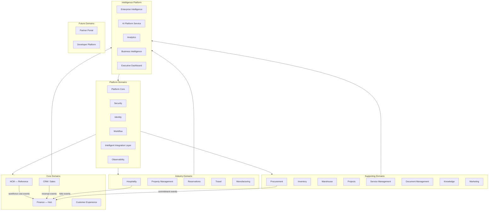
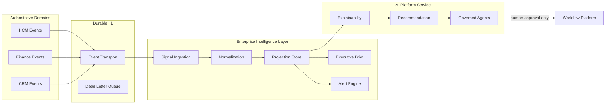
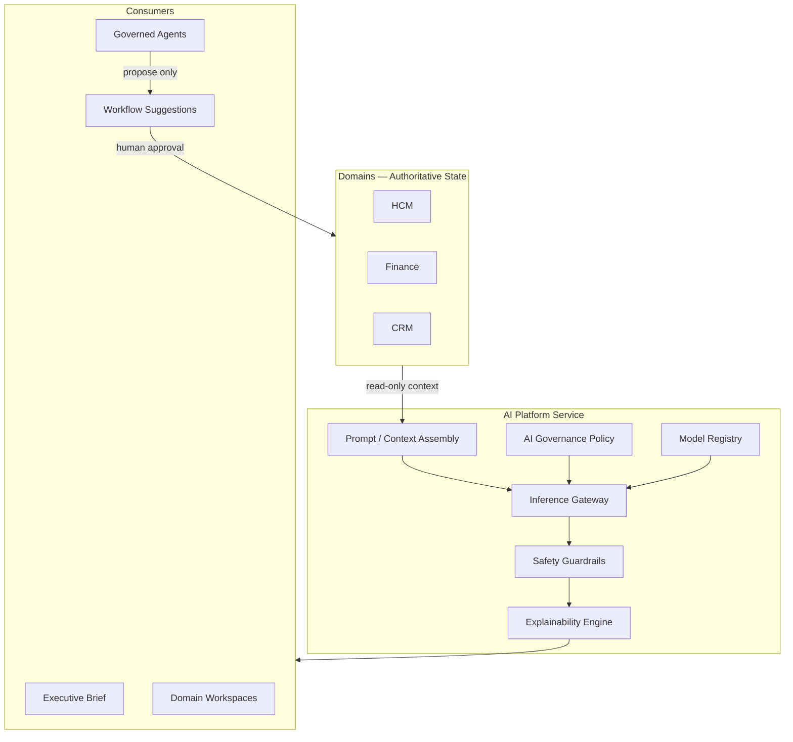
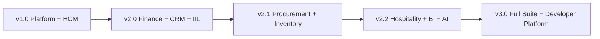

# P-014.1 — ORION Enterprise Domain Strategy

**Document ID:** STRAT-DOMAIN-001  
**Mission:** P-014.1 — ORION Enterprise Domain Strategy  
**Program:** P-014 — Enterprise Platform Planning  
**Version:** 1.0  
**Status:** Ratified — Master Domain Blueprint  
**Classification:** Enterprise Architecture · Domain Strategy · Governance  
**Authority:** Chief Enterprise Architect · Architecture Review Board  
**Effective Date:** 4 August 2026  
**Planning Horizon:** 2026–2031  
**Architecture Baseline:** v2.0 Multi-Domain Baseline ([P-016.7](./P-016.7-Enterprise-Readiness-Update.md) @ `3f259d9`)

**Related:** [ORION Enterprise Platform Strategy v1.0](./ORION_Enterprise_Platform_Strategy_v1.0.md) · [Master Roadmap v1.0](./ORION_Enterprise_Platform_Master_Roadmap_v1.0.md) · [P-016.2 v2.0 Architecture Charter](./P-016.2-ORION-v2-Architecture-Charter.md) · [Architecture Handbook v1.0](./ORION_Enterprise_Architecture_Handbook_v1.0.md) · [ES-097 ADR Policy](./ES-097-ORION-Architecture-Governance-ADR-Policy.md)

**Scope:** Architecture only — no production code · no implementation authorization  
**Audience:** Architecture Review Board · Domain Leads · Platform Engineering · Executive Planning

---

## 15. Executive Summary

ORION is an **Executive Operating System** — a governed multi-domain enterprise platform where authoritative business domains publish versioned events, Finance holds financial truth, and Intelligence consumes certified signals rather than placeholder data.

This document is the **master architectural blueprint for every future ORION domain**. It defines the enterprise operating model, domain taxonomy, dependency law, shared platform services, cross-domain contracts, and version roadmap through v3.0.

| Assessment | Verdict |
|------------|---------|
| **P-014.1 domain strategy mission** | **GO** |
| **Enterprise domain model completeness** | **GO** |
| **Alignment with v2.0 baseline (P-016.6)** | **GO** |
| **Immediate greenfield domain expansion** | **CONDITIONAL GO** — FIN-R-001 · ADR-014 registry · CRM facade unification |
| **v3.0 full ERP domain coverage** | **CONDITIONAL GO** — sequential build · Finance hub first |

**Strategic imperatives:**

1. **Replicate the HCM reference pattern** — facade · repository · PlatformStore · RBAC · IIL catalogue — for every authoritative domain.
2. **Finance is the integration hub** — workforce cost, revenue, folio, and procurement events converge on Finance; no cross-domain repository reads.
3. **Platform services before domain Gate 5** — Identity, IIL, Workflow, Security, Persistence must be certified before domain implementation.
4. **AI is a platform service** — explain, recommend, and orchestrate; never mutate authoritative state without human approval.
5. **Events before analytics** — BI and Executive Dashboard consume read-only projections of certified domain events.

---

## 1. Enterprise Vision

### 1.1 Purpose

ORION replaces fragmented point solutions with a **single governed operating environment** where executives see authoritative signals, operators work in domain workspaces, and integration occurs through durable event contracts — not bespoke point-to-point APIs.

### 1.2 Enterprise Positioning

| Dimension | Today (v2.0 Baseline) | v2.0 GA Target | v3.0 Vision |
|-----------|----------------------|----------------|-------------|
| **Domains authoritative** | HCM (reference) · Finance (Wave A) · CRM (Wave B) | HCM + Finance + CRM GA bundle | Full operational + industry suite |
| **Integration** | Durable IIL · HCM→Finance · CRM→Finance certified | Multi-domain event registry | Enterprise-wide contract catalogue |
| **Intelligence** | Brief + assistive AI | Authoritative domain signals | Governed AI platform service |
| **Commercial narrative** | HCM design partner | HCM + Finance + CRM bundle | Credible mid-market ERP replacement |
| **Governance maturity** | Level 2 (ES-092–097) | Enforced Gate certification | Self-service domain onboarding |

### 1.3 Operating Model Principles

| # | Principle | Domain Implication |
|---|-----------|-------------------|
| **P1** | Architecture First | Gates 1–4 before Gate 5 on every domain |
| **P2** | Platform First | Shared services hardened before domain build |
| **P3** | One Facade Per Domain | `@/lib/<domain>` public contract only |
| **P4** | Events Over Integration | Cross-domain via IIL ([ADR-013](../11_Governance/ADR/ADR-013-Durable-Intelligent-Integration-Layer.md) · [ADR-014](../11_Governance/ADR/ADR-014-Cross-Domain-Event-Contracts.md)) |
| **P5** | Finance Hub | Financial truth centralizes cross-domain monetary flows |
| **P6** | Reference Replication | HCM pattern is the template — not a special case |
| **P7** | Evidence-Based Delivery | ADR + certification + doc tests for every domain Gate 5 |

---

## 2. Business Capability Map

Capabilities grouped by enterprise function. **Bold** = authoritative domain owner today or planned v2.x.

| Capability Group | Capabilities | Domain Owner | Maturity |
|------------------|--------------|--------------|----------|
| **Workforce** | Org structure · Time · Payroll events · Talent · Recruitment | **HCM** (Reference) | ✅ RC1 |
| **Financial** | GL · Journals · CoA · Posting · Budget · Tax · Reconciliation | **Finance** | ✅ Wave A (CONDITIONAL GO) |
| **Commercial** | Accounts · Opportunities · Pipeline · Revenue events | **CRM / Sales** | ✅ Gate 5 Wave B (CONDITIONAL GO) |
| **Customer** | Service cases · Experience journeys · Loyalty | Customer Experience · Service Management | ⏳ Future |
| **Supply Chain** | Procurement · Inventory · Warehouse · Manufacturing | Operations suite | ⏳ Post-Finance |
| **Industry Ops** | Reservations · Folio · Housekeeping · Property | **Hospitality** · Property Management | ◐ Prototype |
| **Projects** | Project accounting · Resource planning | Projects | ⏳ Future |
| **Marketing** | Campaigns · Attribution · Lead scoring | Marketing | ⏳ Future |
| **Travel** | Travel booking · Expense integration | Travel | ⏳ Future |
| **Knowledge** | Articles · Search · Expertise | Knowledge | ⏳ Future |
| **Documents** | Contracts · Records · Retention | Document Management | ⏳ P-010.4 |
| **Analytics** | KPIs · Dashboards · Projections | Analytics · BI | ◐ Platform capability |
| **Executive** | Brief · Command center · Decisions | Executive Dashboard · Intelligence | ◐ Assistive |
| **Platform** | Identity · Security · Workflow · IIL · Persistence | Platform · Security | ✅ v1.0 core |
| **Ecosystem** | APIs · SDK · Partner apps | Developer Platform · Partner Portal | ⏳ v3.0 |

---

## 3. Domain Map

### 3.1 Domain Topology



### 3.2 Domain Registry

| Domain | Code | Classification | Product Line | v2.0 Status |
|--------|------|----------------|--------------|-------------|
| **Platform Core** | `platform` | Platform Domain | ORION Platform | ✅ Production core |
| **Security** | `security` | Platform Domain | ORION Platform | ✅ RBAC · compliance |
| **Identity** | `identity` | Platform Domain | ORION Platform | ✅ ServiceContext · sessions |
| **Workflow** | `workflow` | Platform Domain | ORION Platform | ✅ HCM integrated |
| **Intelligent Integration Layer** | `iil` | Platform Domain | ORION Platform | ✅ Durable (ADR-013) |
| **Enterprise Intelligence** | `intelligence` | Platform Domain | ORION Intelligence | ◐ Dual-path · authoritative migration |
| **AI Platform Service** | `ai` | Platform Domain | ORION Intelligence | ◐ ES-039 framework |
| **Analytics** | `analytics` | Platform Domain | ORION Intelligence | ⏳ Event projections |
| **Business Intelligence** | `bi` | Platform Domain | ORION Intelligence | ⏳ Post-domain events |
| **Executive Dashboard** | `executive` | Platform Domain | ORION Intelligence | ◐ Brief delivered |
| **HCM** | `hcm` | **Reference Domain** | ORION People | ✅ RC1 certified |
| **Finance** | `finance` | **Core Domain** | ORION Finance | ✅ Gate 5 Wave A |
| **CRM** | `crm` | **Core Domain** | ORION Customer | ✅ Gate 5 Wave B · CRM→Finance chain |
| **Sales** | `sales` | **Core Domain** | ORION Customer | ◐ Part of CRM workspace |
| **Customer Experience** | `cx` | Core Domain | ORION Customer | ⏳ Future |
| **Marketing** | `marketing` | Supporting Domain | ORION Customer | ⏳ Future |
| **Procurement** | `procurement` | Supporting Domain | ORION Operations | ⏳ Post-Finance |
| **Inventory** | `inventory` | Supporting Domain | ORION Operations | ⏳ Future |
| **Warehouse** | `warehouse` | Supporting Domain | ORION Operations | ⏳ Future |
| **Manufacturing** | `manufacturing` | Industry Domain | ORION Operations | ⏳ Future |
| **Projects** | `projects` | Supporting Domain | ORION Operations | ⏳ Future |
| **Service Management** | `service` | Supporting Domain | ORION Customer | ⏳ Future |
| **Hospitality** | `hospitality` | Industry Domain | ORION Hospitality | ◐ Prototype |
| **Property Management** | `property` | Industry Domain | ORION Hospitality | ⏳ Future |
| **Reservations** | `reservations` | Industry Domain | ORION Hospitality | ◐ Sub-capability of Hospitality |
| **Travel** | `travel` | Industry Domain | ORION Operations | ⏳ Future |
| **Document Management** | `documents` | Supporting Domain | ORION Platform | ⏳ P-010.4 |
| **Knowledge** | `knowledge` | Supporting Domain | ORION Platform | ⏳ Future |
| **Partner Portal** | `partner` | Future Domain | ORION Developer Platform | ⏳ v3.0 |
| **Developer Platform** | `developer` | Platform Domain | ORION Developer Platform | ⏳ ES-060 |

### 3.3 Classification Definitions

| Classification | Definition | Examples | Gate Expectations |
|----------------|------------|----------|-------------------|
| **Reference Domain** | Gold-standard bounded context; all domains replicate its pattern | HCM | Full Gate 1–7 certification |
| **Core Domain** | Authoritative business truth; executive OS depends on it | Finance · CRM · Sales | Full certification · IIL publish/subscribe |
| **Supporting Domain** | Operational extension; consumes core domain events | Procurement · Inventory · Projects | Standard Gates · Finance integration required |
| **Industry Domain** | Vertical-specific; optional for horizontal ERP bundle | Hospitality · Property · Travel | Industry certification track |
| **Platform Domain** | Shared infrastructure; no business aggregates | Platform · Identity · IIL · Security | Platform missions · ADR-governed |
| **Future Domain** | Planned; no Gate 1 authorization until dependency chain met | Partner Portal · Manufacturing | Architecture spike only |

---

## 4. Domain Dependency Matrix

**Legend:** ● = hard dependency (must exist) · ○ = soft / event consumer · — = not applicable

### 4.1 Domain → Platform Services

| Domain | Platform | Identity | Security | IIL | Workflow | Persistence | RBAC | Observability |
|--------|----------|----------|----------|-----|----------|-------------|------|---------------|
| HCM | ● | ● | ● | ● | ● | ● | ● | ● |
| Finance | ● | ● | ● | ● | ○ | ● | ● | ● |
| CRM / Sales | ● | ● | ● | ● | ○ | ● | ● | ● |
| Customer Experience | ● | ● | ● | ● | ○ | ● | ● | ○ |
| Procurement | ● | ● | ● | ● | ● | ● | ● | ○ |
| Inventory | ● | ● | ● | ● | ○ | ● | ● | ○ |
| Hospitality | ● | ● | ● | ● | ○ | ● | ● | ○ |
| Intelligence / AI | ● | ● | ○ | ● | ○ | ○ | ○ | ● |
| Analytics / BI | ● | ● | ○ | ● | — | ○ | ○ | ● |
| Developer Platform | ● | ● | ● | ● | — | ● | ● | ● |

### 4.2 Domain → Domain (Cross-Domain)

| Consumer ↓ / Provider → | HCM | Finance | CRM | Hospitality | Procurement | Intelligence |
|-------------------------|-----|---------|-----|-------------|-------------|--------------|
| **HCM** | — | ○ | — | — | — | ● events |
| **Finance** | ● events | — | ● events | ○ events | ○ events | ● events |
| **CRM** | ○ | ● ledger | — | — | — | ● events |
| **Hospitality** | ○ | ● accounting | ○ | — | ○ | ● events |
| **Procurement** | ○ | ● sub-ledger | ○ | — | — | ○ |
| **Inventory** | — | ● cost posting | — | ○ | ● receipts | ○ |
| **Intelligence** | ● | ● | ● | ● | ○ | — |
| **Analytics / BI** | ● | ● | ● | ● | ○ | ○ |

### 4.3 Dependency Rules (Constitutional)

1. **No domain Gate 5 without PlatformStore + RBAC certified** on that domain's API surface.
2. **No cross-domain repository reads** — IIL events only ([ADR-015](../11_Governance/ADR/ADR-015-Domain-Service-Boundaries.md)).
3. **Finance before Procurement, Inventory, Manufacturing** — sub-ledger and cost posting required.
4. **Authoritative domain events before Analytics/BI** — read-only projections only.
5. **AI never mutates ledger, payroll, or approval state** without explicit human workflow action.
6. **Single public facade per domain** — architecture import tests enforce boundary law.
7. **Industry domains may defer horizontal certification** but must conform to IIL contract law when integrated.

### 4.4 Critical Path (v2.0 → v2.2)

```
Platform Core (v1.0) → HCM Reference → Durable IIL → Finance Wave A
    → Finance GL Persist (P-009.12) → CRM Facade Convergence → ADR-014 Registry
    → Gate 6 Multi-Domain Cert → CRM Revenue → Finance Chain
    → Hospitality Folio → Finance → Intelligence Authoritative Brief
```

---

## 5. Reference Domains

### 5.1 HCM — The Reference Domain

HCM ([ES-HCM-001](../HCM/Engineering/ES-HCM-001_Enterprise_HCM_Engineering_Specification.md)) is the **mandatory replication template** for every authoritative domain.

| Pattern Element | HCM Implementation | Replication Requirement |
|-----------------|---------------------|-------------------------|
| Public facade | `hcmFacade` / `HcmFoundationFacade` | Single `@/lib/hcm` entry |
| Layering | API → Facade → Service → Repository → Store | Identical call chain |
| Persistence | `PlatformStore` + PostgreSQL persister | Per-entity persister modules |
| RBAC | Permission catalog + fail-closed API context | Domain permission matrix |
| Events | IIL catalogue · canonical types | ADR-014 envelope compliance |
| Workflow | Domain trigger bindings | Approval flows per entity |
| Certification | Doc tests · domain test suite · Gate report | Gate 1–7 evidence package |
| Documentation | ES-xxx · event catalogue · D-xxx blueprints | Required at Gate 4 |

### 5.2 Finance — The Integration Hub

Finance is the **second reference implementation** for cross-domain integration — it demonstrates inbound event consumption, posting stack authority, and outbound intelligence signals (Wave B).

| Role | Responsibility |
|------|----------------|
| **Financial truth** | GL · journals · CoA · fiscal periods |
| **Event sink** | HCM workforce cost · CRM revenue · Hospitality folio |
| **Event source** | `finance.journal.posted` · `finance.period.closed` (Wave B) |
| **Hub constraint** | No domain reads Finance repositories directly |

### 5.3 Replication Checklist (New Domain Gate 4 Exit)

- [ ] D-xxx blueprint approved (Gate 1)
- [ ] Domain model documented (Gate 2)
- [ ] ES-xxx engineering specification (Gate 3)
- [ ] Facade + repository + PlatformStore wiring (Gate 4)
- [ ] RBAC permission catalog
- [ ] IIL event catalogue registered
- [ ] Architecture boundary tests pass
- [ ] Domain certification test suite green

---

## 6. Shared Platform Services

All domains consume these services — **never duplicate**.

| Service | Responsibility | Key ADR/Program | Domain Consumption |
|---------|----------------|-----------------|-------------------|
| **Platform Core** | Bootstrap · context · result types · errors | ADR-007 | All domains |
| **Identity** | ServiceContext · sessions · org tenancy | ADR-008 | All API routes |
| **Security / RBAC** | Authorization · permission catalog · fail-closed | ADR-008 · ADR-009 | All REST surfaces |
| **PlatformStore** | In-memory + PostgreSQL persistence abstraction | ADR-007 | All authoritative domains |
| **IIL** | Durable event transport · DLQ · replay | ADR-013 | All cross-domain integration |
| **Workflow** | State machines · approval bindings | P-010.2 | HCM · Finance · CRM · Procurement |
| **Data Platform** | Master data registry · reference data | P-011 | Finance · CRM · Operations |
| **Observability** | Metrics · health · structured logging | ADR-011 | Platform + domain ops |
| **Notification** | Enterprise notification service | Platform | Workflow · alerts |
| **Search** | Platform search repository | Platform | Knowledge · CRM · Documents |
| **Compliance** | Audit · assessment hooks | Platform | Security · Finance |

**Rule:** Domain teams implement **business logic only**. Infrastructure belongs to Platform Engineering until explicitly delegated via ADR.

---

## 7. Cross-Domain Contracts

Governed by [ADR-014](../11_Governance/ADR/ADR-014-Cross-Domain-Event-Contracts.md) and [ADR-020](../11_Governance/ADR/ADR-020-Versioning-and-Domain-Compatibility.md).

### 7.1 Contract Envelope (Required)

| Field | Purpose |
|-------|---------|
| `eventId` | Unique event identifier |
| `eventType` | Canonical namespaced type (`domain.entity.action`) |
| `eventVersion` | Schema version for compatibility |
| `idempotencyKey` | Dedup at consumer |
| `orgId` | Tenancy scope |
| `occurredAt` | Business timestamp |
| `payload` | Versioned schema body |
| `metadata` | Trace · correlation · classification |

### 7.2 Priority Contract Catalogue (v2.0)

| Event Type | Publisher | Consumer | Status |
|------------|-----------|----------|--------|
| `hcm.workforce.cost.recorded` | HCM | Finance | ✅ Implemented |
| `hcm.expense.approved` | HCM | Finance | ✅ Implemented |
| `finance.journal.posted` | Finance | Intelligence · Analytics | ⏳ Wave B |
| `finance.period.closed` | Finance | Intelligence · Reporting | ⏳ Wave B |
| `crm.opportunity.won` | CRM | Finance | ⏳ Gate 6 |
| `crm.revenue.recognized` | CRM | Finance | ✅ P-009.19 |
| `crm.salesorder.confirmed` | CRM | Finance | ✅ P-009.19 |
| `hospitality.folio.posted` | Hospitality | Finance | ⏳ Industry track |
| `procurement.po.approved` | Procurement | Finance | ⏳ v2.2 |

### 7.3 Registry Location

**Target:** `docs/11_Governance/EventContracts/` — JSON Schema per contract · lifecycle **Draft → Registered → Active → Deprecated**.

**Current state:** Code-level contracts only — registry population is a Gate 6 blocker ([P-016.6 §4.2](./P-016.6-Architecture-Baseline.md)).

---

## 8. Enterprise Intelligence Layer

The Enterprise Intelligence Layer (EIL) is a **platform capability track**, not a greenfield domain. It subscribes to authoritative IIL events and projects executive signals.

### 8.1 Architecture



### 8.2 Intelligence Principles

| # | Principle | Enforcement |
|---|-----------|-------------|
| **I1** | Consume, don't duplicate | No authoritative aggregates in Intelligence |
| **I2** | Events before projections | Projections rebuild from IIL replay |
| **I3** | Explainability required | Every AI recommendation cites source events |
| **I4** | Fail-closed on stale data | Brief marks signals without fresh domain events |
| **I5** | Separation from domains | Intelligence team does not own Finance/HCM rules |

---

## 9. Workflow Architecture

Workflow is a **platform domain** providing state machines and approval bindings consumed by authoritative domains.

| Capability | Owner | Domain Binding Pattern |
|------------|-------|------------------------|
| State machine engine | Platform (`lib/platform/workflow/`) | Domain registers entity triggers |
| Approval chains | Platform + domain permissions | RBAC-gated transitions |
| Compensation / saga | Platform (future ADR) | Cross-domain long-running flows |
| Audit trail | Platform compliance | Immutable transition log |

**Domain responsibilities:** Define triggers (e.g., `journal.submit`, `expense.approve`, `opportunity.stage.change`). Platform responsibilities: execution, persistence, notification, timeout handling.

**v2.0 state:** HCM workflow integrated · Finance approval bindings planned Gate 6 · CRM pipeline stages partial.

---

## 10. Reporting Architecture

Reporting is **read-only** — never mutates authoritative domain state.

| Layer | Technology Pattern | Data Source |
|-------|-------------------|-------------|
| **Operational reports** | Domain query services | Domain repositories (same bounded context) |
| **Cross-domain reports** | Analytics projection store | IIL event replay · materialized views |
| **Executive dashboards** | Brief + KPI registry | Intelligence projections |
| **Regulatory / compliance** | Document Management + Finance | Certified snapshots · immutable exports |

**Rule:** Cross-domain reporting **must not** join repositories across domain boundaries at query time. Use event-sourced projections or certified snapshot exports.

**v2.0 deliverables:** Finance trial balance (Wave B) · Executive KPI registry (platform) · BI workspace (v2.2).

---

## 11. Security Architecture

Security spans **Platform Domain** services applied uniformly to every domain.

| Layer | Mechanism | ADR |
|-------|-----------|-----|
| **Identity** | ServiceContext · session · org tenancy | ADR-008 |
| **Authorization** | RBAC permission catalog · route middleware | ADR-008 · ADR-009 |
| **API security** | Fail-closed default · 401/403 mapping | P-015.6 · P-009.14 |
| **Event security** | Classification metadata · PII minimization on envelopes | ADR-014 |
| **Secrets** | Configuration secrets management | ADR-010 |
| **Compliance** | Audit · assessment · backup/DR | GA-001 · P-015.8 |

**Domain obligation:** Every Gate 5 domain ships a permission matrix, API context adapter, and security certification tests mirroring HCM and Finance.

---

## 12. AI Architecture

AI is a **platform service** — not an application feature embedded in domain UIs.

### 12.1 AI Platform Service Model



### 12.2 AI Service Layers

| Layer | Responsibility | Mutates State? |
|-------|----------------|----------------|
| **Inference Gateway** | Route requests · rate limit · audit | No |
| **Context Assembly** | Pull authorized read-only domain context | No |
| **Explainability** | Cite sources · confidence · reasoning chain | No |
| **Recommendation** | Suggest actions · surface anomalies | No |
| **Governed Agents** | Multi-step orchestration proposals | No — proposes to Workflow only |
| **Workflow Action** | Human-approved execution | Yes — via existing domain APIs |

### 12.3 AI Governance Rules

1. **No direct ledger mutation** — Finance posting requires human or certified workflow action.
2. **No training on customer data without ADR** — data classification policy enforced.
3. **Model registry** — every production model versioned and approved.
4. **Prompt audit trail** — inference requests logged with org scope.
5. **Fallback to deterministic** — AI enhancement never replaces certified business rules.

**Program:** ES-039 AI Platform · Intelligence provider framework (ADR-006 extension).

---

## 13. Implementation Roadmap

Phased domain delivery aligned with [Master Roadmap §6](./ORION_Enterprise_Platform_Master_Roadmap_v1.0.md#6-recommended-build-sequence).

### Phase 0 — Foundation (Complete)

| Item | Program | Status |
|------|---------|--------|
| Governance framework | P-013 | ✅ |
| HCM reference domain | P-012 | ✅ RC1 |
| Platform persistence + RBAC | P-015 | ✅ |
| GA-001 operational certification | GA-001 | ✅ |

### Phase 1 — v2.0 Core (2026 H2 – 2027 H1)

| Priority | Domain / Mission | Dependency | Target |
|----------|------------------|------------|--------|
| **P0** | Finance GL PostgreSQL (P-009.12) | Finance Wave A | 2026 Q3 |
| **P0** | ADR-014 event contract registry | ADR-014 partial | 2026 Q3 |
| **P1** | CRM facade convergence (P-008 II) | ADR-015 | 2026 Q4 |
| **P1** | CRM → Finance revenue chain | Finance + registry | 2027 Q1 |
| **P1** | Gate 6 multi-domain certification | Above | 2027 Q1 |
| **P2** | Finance outbound events (Wave B) | FIN-R-010 | 2027 Q1 |

### Phase 2 — v2.1 Operational Extension (2027 H2 – 2028)

| Priority | Domain / Mission | Dependency | Target |
|----------|------------------|------------|--------|
| **P1** | Procurement domain | Finance sub-ledger | 2027 Q3 |
| **P1** | Document Management (P-010.4) | Platform | 2027 Q4 |
| **P2** | Inventory + Warehouse | Procurement + Finance | 2028 Q1 |
| **P2** | Analytics projection layer | Domain events | 2028 Q1 |
| **P2** | AI Platform maturation (ES-039) | Intelligence ingest | 2028 Q2 |

### Phase 3 — v2.2 Industry + Intelligence (2028 – 2029)

| Priority | Domain / Mission | Dependency | Target |
|----------|------------------|------------|--------|
| **P1** | Hospitality folio → Finance | Finance hub | 2028 Q2 |
| **P2** | Service Management | CRM + Workflow | 2028 Q3 |
| **P2** | BI workspace | Analytics | 2028 Q4 |
| **P3** | Marketing | CRM events | 2029 Q1 |
| **P3** | Projects domain | Finance + HCM | 2029 Q2 |

### Phase 4 — v3.0 Enterprise Suite (2029 – 2031)

| Priority | Domain / Mission | Dependency | Target |
|----------|------------------|------------|--------|
| **P1** | Manufacturing | Inventory + Finance | 2029 |
| **P2** | Supply Chain orchestration | Proc + Inv + Finance | 2030 |
| **P2** | Developer Platform (ES-060) | Stable domain APIs | 2030 |
| **P3** | Partner Portal | Developer Platform | 2031 |
| **P3** | Travel · Property Management | Industry foundation | 2031 |

---

## 14. Version Roadmap

| Version | Theme | Domains Delivered | Platform Capabilities | Gate Target |
|---------|-------|-------------------|------------------------|-------------|
| **v1.0.x** | Platform + Reference Domain | HCM | In-process IIL · Workflow · Identity | GA-001 GO |
| **v2.0.0** | Multi-Domain Baseline | HCM · Finance · CRM | Durable IIL · ADR-013–020 · RBAC all domains | Gate 6 GO |
| **v2.1.0** | Operational ERP Core | + Procurement · Documents · Inventory | Analytics ingest · AI gateway | Gate 7 |
| **v2.2.0** | Industry + Intelligence | + Hospitality · Service · BI | Authoritative Brief · governed agents | Commercial bundle |
| **v3.0.0** | Enterprise Suite | + Manufacturing · SCM · Developer Platform | Partner ecosystem · full contract registry | ERP credibility |

### 14.1 v2.0 Exit Criteria (from P-016.2)

- [ ] HCM + Finance + CRM on PlatformStore/PostgreSQL
- [ ] Durable IIL certified (✅ ADR-013 Implemented)
- [ ] Cross-domain HCM → Finance → Intelligence chain demonstrated
- [ ] ADR-014 registry populated for all active contracts
- [ ] Zero P0 technical debt · Gate 6 certification GO
- [ ] v2.0.0 Multi-Domain Baseline tag

### 14.2 Version Dependency Graph



---

## Appendix A — Domain Quick Reference Card

| Domain | Class | Depends On | Publishes To | Gate Status |
|--------|-------|------------|--------------|-------------|
| HCM | Reference | Platform full stack | Finance · Intelligence | Gate 7 pending |
| Finance | Core | Platform · HCM events | Intelligence · Analytics | Gate 5 CONDITIONAL GO |
| CRM | Core | Platform · Finance ledger | Finance · Intelligence | Gate 4–5 |
| Hospitality | Industry | Platform · Finance | Finance · Intelligence | Gate 2–3 |
| Procurement | Supporting | Finance · Workflow | Finance | Not started |
| Intelligence | Platform | IIL events from all domains | Brief · Alerts · AI | Capability track |
| AI | Platform | Intelligence projections | Recommendations only | ES-039 |

---

## Appendix B — Governance Cross-References

| Topic | Document |
|-------|----------|
| Platform strategy & prioritization | [ORION_Enterprise_Platform_Strategy_v1.0.md](./ORION_Enterprise_Platform_Strategy_v1.0.md) |
| Executive timeline & KPIs | [ORION_Enterprise_Platform_Master_Roadmap_v1.0.md](./ORION_Enterprise_Platform_Master_Roadmap_v1.0.md) |
| v2.0 constitutional architecture | [P-016.2-ORION-v2-Architecture-Charter.md](./P-016.2-ORION-v2-Architecture-Charter.md) |
| Current baseline & ADR matrix | [P-016.6-Architecture-Baseline.md](./P-016.6-Architecture-Baseline.md) |
| Durable integration | [ADR-013](../11_Governance/ADR/ADR-013-Durable-Intelligent-Integration-Layer.md) |
| Event contracts | [ADR-014](../11_Governance/ADR/ADR-014-Cross-Domain-Event-Contracts.md) |
| Domain boundaries | [ADR-015](../11_Governance/ADR/ADR-015-Domain-Service-Boundaries.md) |
| Versioning | [ADR-020](../11_Governance/ADR/ADR-020-Versioning-and-Domain-Compatibility.md) |

---

*P-014.1 — Enterprise Domain Strategy · docs/00_Governance/ · Architecture only · No implementation*
