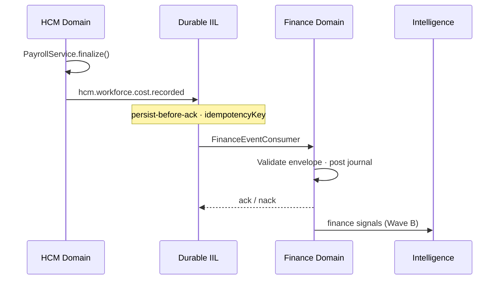
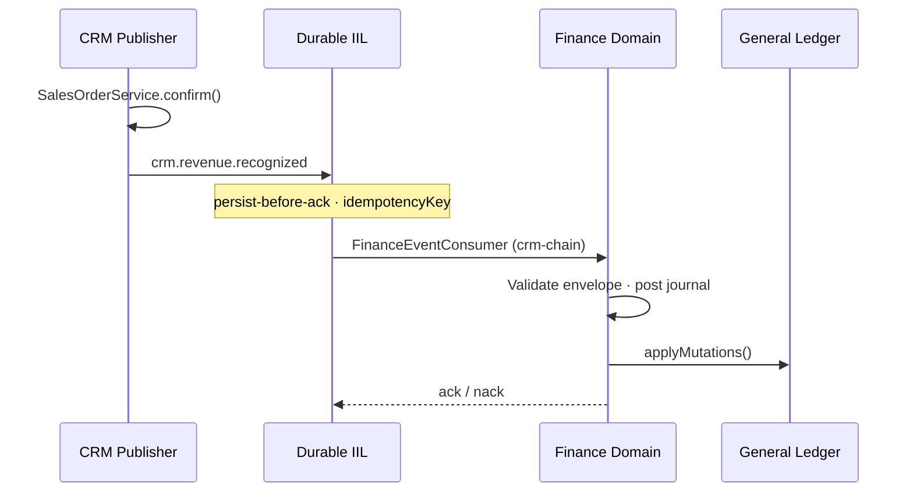
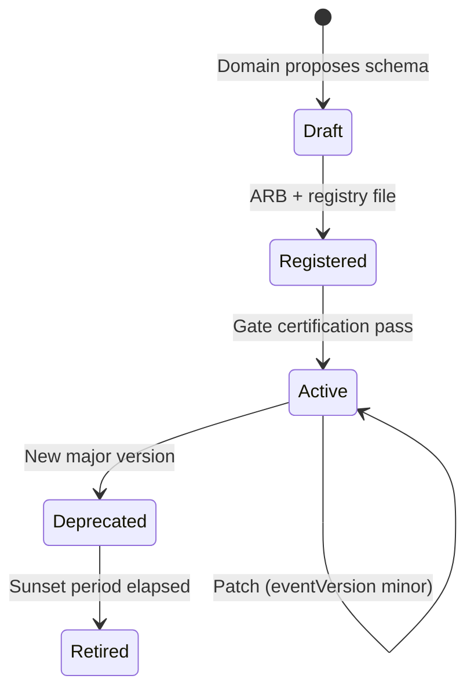
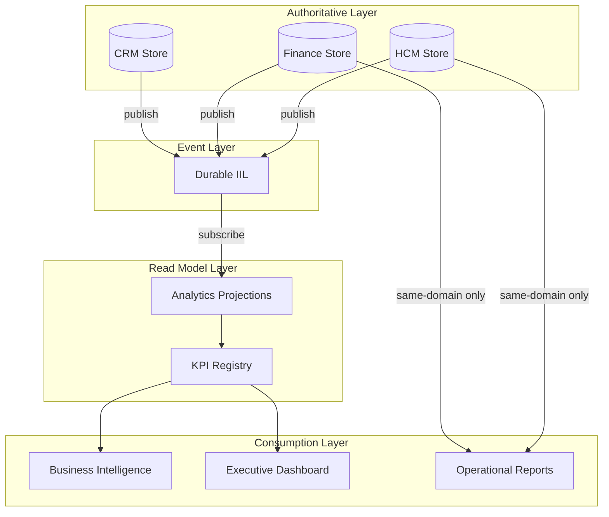
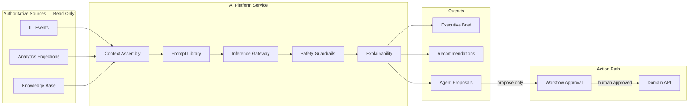
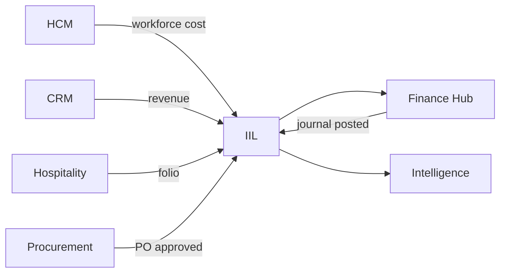
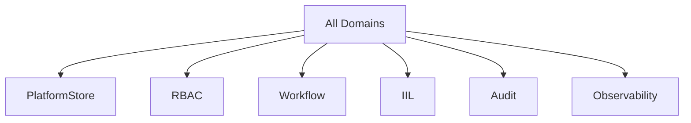
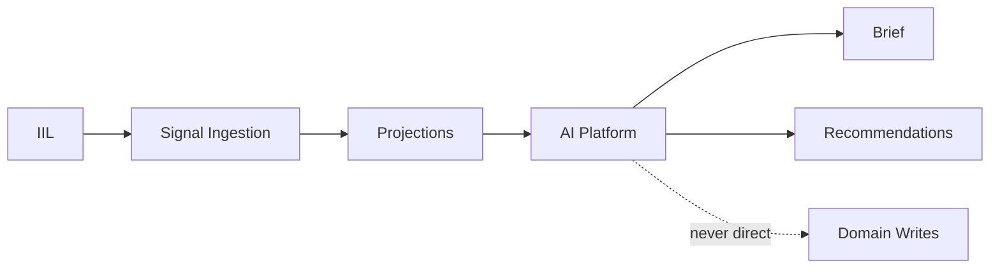
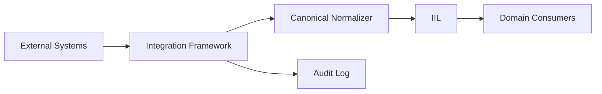
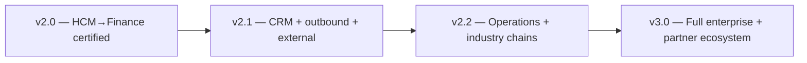

# P-014.3 — ORION Enterprise Integration & Data Flow Architecture

**Document ID:** STRAT-INTEGRATION-001  
**Mission:** P-014.3 — Enterprise Integration & Data Flow Architecture  
**Program:** P-014 — Enterprise Platform Planning  
**Version:** 1.0  
**Status:** Ratified — Constitutional Integration Blueprint  
**Classification:** Enterprise Architecture · Integration Strategy · Governance  
**Authority:** Chief Enterprise Architect · Architecture Review Board  
**Effective Date:** 4 August 2026  
**Planning Horizon:** 2026–2031  
**Architecture Baseline:** v2.0 Multi-Domain Baseline ([P-016.7](./P-016.7-Enterprise-Readiness-Update.md) @ `3f259d9`)

**Related:** [P-014.1 Enterprise Domain Strategy](./P-014.1-Enterprise-Domain-Strategy.md) · [P-014.2 Enterprise Capability Matrix](./P-014.2-Enterprise-Capability-Matrix.md) · [Master Roadmap v1.0](./ORION_Enterprise_Platform_Master_Roadmap_v1.0.md) · [P-016.2 v2.0 Architecture Charter](./P-016.2-ORION-v2-Architecture-Charter.md) · [Durable IIL Architecture](../Platform/IIL/Durable-IIL-Architecture.md)

**Constitutional ADRs:** [ADR-013](../11_Governance/ADR/ADR-013-Durable-Intelligent-Integration-Layer.md) · [ADR-014](../11_Governance/ADR/ADR-014-Cross-Domain-Event-Contracts.md) · [ADR-015](../11_Governance/ADR/ADR-015-Domain-Service-Boundaries.md) · [ADR-020](../11_Governance/ADR/ADR-020-Versioning-and-Domain-Compatibility.md)

**Scope:** Architecture only — no production code · no ADR modification · no implementation authorization  
**Authority statement:** This document is the **constitutional integration blueprint** governing all future ORION domain development.

---

## 15. Executive Summary

ORION integrates through a **governed event-driven architecture** — authoritative domains own their data, publish versioned contracts on the Durable Intelligent Integration Layer (IIL), and consume platform services instead of building point-to-point integrations.

| Assessment | Verdict |
|------------|---------|
| **P-014.3 integration architecture mission** | **GO** |
| **Constitutional alignment (ADR-013–015 · ADR-020)** | **GO** |
| **HCM → Finance reference chain** | **GO** — certified |
| **CRM → Finance reference chain** | **GO** — certified (P-009.19) |
| **Enterprise-wide integration readiness** | **CONDITIONAL GO** — ADR-014 registry · FIN-R-001 · Hospitality chain |
| **Direct cross-domain repository access** | **NO-GO** — permanently forbidden |

**Integration strategy in one sentence:** Domains **own** authoritative state · **publish** canonical IIL events · **consume** platform capabilities · **never** share databases or cross-write aggregates.

**Enterprise readiness (v2.0):** Durable transport certified · **two production cross-domain chains live** (HCM → Finance · CRM → Finance) · Finance hub pattern established · full multi-domain catalogue and external connector platform deferred to v2.1+.

---

## 1. Enterprise Integration Principles

| # | Principle | Definition | Enforcement |
|---|-----------|------------|-------------|
| **I1** | **Loose coupling** | Domains depend on contracts, not implementations | ADR-014 schemas · facade-only imports |
| **I2** | **Event-driven architecture** | Cross-domain state propagation via asynchronous IIL events | ADR-013 · no synchronous cross-domain mutation |
| **I3** | **Platform-first integration** | All integration infrastructure is a platform capability | [P-014.2](./P-014.2-Enterprise-Capability-Matrix.md) consumption law |
| **I4** | **Canonical contracts** | Every cross-domain message uses registered ADR-014 envelope | Schema registry · certification tests |
| **I5** | **Domain ownership** | One authoritative owner per aggregate; consumers are read-only or event-driven | ADR-015 boundary matrix |
| **I6** | **Finance hub** | Monetary convergence flows through Finance — not peer domain writes | ES-FIN-002 · D-008 event model |
| **I7** | **Fail-closed security** | Unauthenticated or unauthorized integration attempts rejected | ADR-008/009 · API middleware |
| **I8** | **Evidence-based certification** | Every integration chain has Gate certification tests | GA-001 · domain cert suites |
| **I9** | **Read-only intelligence** | Analytics, BI, and AI consume projections — never authoritative writes | P-014.1 §8 · §9 |
| **I10** | **Recoverable by design** | Persist-before-ack · DLQ · replay · restart survival | ADR-013 · GA-001 |

---

## 2. Canonical Data Ownership

Each authoritative domain owns its aggregates. Other domains access data **only** via facade APIs (same-domain or approved query) or **IIL events/projections** — never via foreign repository imports.

### 2.1 Enterprise Data Ownership Matrix

| Domain | Authoritative Owner Of | Published Entities (IIL) | Read Models (Consumers) | Direct Consumers |
|--------|------------------------|--------------------------|-------------------------|------------------|
| **HCM** | Employees · org units · time · payroll runs · expenses · talent | `hcm.workforce.cost.recorded` · `hcm.expense.approved` · workforce lifecycle events | Workforce cost projections | Finance · Intelligence · Analytics |
| **Finance** | GL · journals · CoA · fiscal periods · posting rules | `finance.journal.posted` *(Wave B)* · `finance.period.closed` *(Wave B)* | Trial balance · ledger snapshots | Intelligence · BI · Executive Dashboard |
| **CRM** | Accounts · opportunities · pipeline · commercial parties | `crm.revenue.recognized` · `crm.salesorder.confirmed` · `crm.opportunity.closed` | Pipeline projections · revenue forecasts | Finance · Intelligence · Marketing |
| **Hospitality** | Reservations · folios · rooms · housekeeping | `hospitality.folio.posted` *(planned)* | Occupancy · RevPAR projections | Finance · Intelligence |
| **Procurement** | POs · vendors · requisitions | `procurement.po.approved` *(planned)* | Commitment registers | Finance · Inventory |
| **Inventory** | Stock levels · locations · movements | `inventory.movement.recorded` *(planned)* | Stock projections | Finance · Procurement · Manufacturing |
| **Projects** | Projects · tasks · resource assignments | `projects.cost.allocated` *(planned)* | Project P&L projections | Finance · HCM |
| **Platform** | Tenants · config · IIL transport · audit | Platform lifecycle events | Health · metrics dashboards | Operations · all domains |
| **Intelligence** | **None authoritative** | Alert · recommendation events *(derived)* | Brief · KPI tiles | Executive users only |

**Rule:** If a row lists a consumer, that consumer receives **events or projections** — not direct repository access to the owner's collections.

### 2.2 Ownership vs. Consumption Law

| Pattern | Allowed | Forbidden |
|---------|---------|-----------|
| Domain A publishes event → Domain B consumes | ✅ | — |
| Domain B reads Domain A facade (approved query API) | ✅ (rare · synchronous) | — |
| Domain B imports Domain A repository | — | ❌ ADR-015 violation |
| Shared PostgreSQL table across domains | — | ❌ No shared database |
| Domain B writes Domain A aggregate | — | ❌ No cross-domain writes |
| Intelligence writes Finance journal | — | ❌ Human/workflow approval only |

---

## 3. Domain Communication Patterns

### 3.1 Pattern Catalogue

| Pattern | Mechanism | Latency | Consistency | Use Case |
|---------|-----------|---------|-------------|----------|
| **Synchronous** | Domain REST facade · same-request | Immediate | Strong (within domain) | UI operations · same-domain queries |
| **Asynchronous** | IIL publish → durable transport → consumer | Seconds | Eventual | Cross-domain state propagation |
| **Workflow** | Platform workflow engine · domain triggers | Minutes–days | Process-governed | Approvals · multi-step chains |
| **Query** | Consumer facade read API | Immediate | Read-your-writes (domain) | Approved cross-domain lookups (sparse) |
| **Projection** | Event replay → materialized read model | Near real-time | Eventual | Analytics · BI · Brief |
| **Read-only** | Intelligence/Analytics subscribe | Near real-time | Eventual | Executive signals · KPIs |

**Default for cross-domain:** **Asynchronous (IIL)**. Synchronous cross-domain calls require ADR approval and are discouraged.

### 3.2 Reference Integration Chains

#### HCM → Finance *(certified v2.0)*



| Stage | Pattern | Component |
|-------|---------|-----------|
| Trigger | Synchronous (domain) | `PayrollService.finalize()` |
| Cross-domain | Asynchronous | `HcmCanonicalFinancePublisher` → IIL |
| Consumption | Asynchronous | `FinanceEventConsumer` → `FinanceInboundProcessor` |
| Intelligence | Projection (Wave B) | Brief financial provider |

#### CRM → Finance *(certified v2.0 · P-009.19)*



| Stage | Pattern | Component |
|-------|---------|-----------|
| Trigger | Synchronous (domain) | `SalesOrderService.confirm()` |
| Cross-domain | Asynchronous | `CrmCanonicalEventPublisher` → IIL |
| Consumption | Asynchronous | `FinanceEventConsumer.consumeCrm()` → `FinanceInboundProcessor` |
| Posting | Synchronous (Finance UoW) | PostingValidationPipeline → JournalPostingService |

| Event | Status |
|-------|--------|
| `crm.revenue.recognized` | ✅ Certified |
| `crm.salesorder.confirmed` | ✅ Certified |
| Other `crm.*` | Graceful `UNSUPPORTED_EVENT` |

**Documentation:** [Finance-CRM-Revenue-Integration.md](../Finance/Integration/Finance-CRM-Revenue-Integration.md)

#### CRM → Finance *(legacy planning note — superseded)*

| Stage | Pattern | Event |
|-------|---------|-------|
| Opportunity closed-won | Workflow + Async | `crm.opportunity.won` |
| Revenue recognition | Async | `crm.revenue.recognized` |
| Finance posting | Async consume | Journal via Finance ACL |
| CRM ledger inquiry | Query (read-only) | Finance facade balance query — not repo read |

#### Hospitality → Finance *(planned v2.2)*

| Stage | Pattern | Event |
|-------|---------|-------|
| Folio checkout | Async | `hospitality.folio.posted` |
| Finance AR/revenue | Async consume | Sub-ledger posting |
| Guest PII | Envelope classification | ADR-014 metadata |

#### Inventory → Procurement *(planned v2.2)*

| Stage | Pattern | Event |
|-------|---------|-------|
| Stock below threshold | Async | `inventory.reorder.triggered` |
| PO creation | Workflow | Procurement approval flow |
| Receipt | Async | `inventory.receipt.recorded` → Finance |

#### Projects → Finance *(planned v2.2)*

| Stage | Pattern | Event |
|-------|---------|-------|
| Timesheet/cost allocation | Async | `projects.cost.allocated` |
| HCM workforce link | Async | Optional `hcm.workforce.cost.recorded` correlation |
| Finance WIP posting | Async consume | Project cost journal |

---

## 4. Intelligent Integration Layer (IIL)

Governed by [ADR-013](../11_Governance/ADR/ADR-013-Durable-Intelligent-Integration-Layer.md) · implemented P-009.16 · documented in [Durable IIL Architecture](../Platform/IIL/Durable-IIL-Architecture.md).

### 4.1 Architecture

```
Domain Publisher
      │
      ▼
IntelligenceIntegrationService.publish()
      ├── Authorization (ServiceRegistry)
      ├── ADR-014 envelope enrichment
      └── DurableTransportAdapter.persistAndEnqueue()  ← persist BEFORE ack
                │
    ┌───────────┴───────────┐
    ▼                       ▼
InMemoryDurableTransport   PostgresDurableTransport
(dev · unit tests)         (production · iil_entities)
                │
                ▼
        Delivery loop → EventRouter → Subscribers
                │
        ack / nack → RetryPolicy → DeadLetterQueue
                │
        ReplayService (operator recovery)
```

### 4.2 IIL Capability Matrix

| Capability | Behavior | Configuration |
|------------|----------|---------------|
| **Durable transport** | Events survive process restart | `ORION_IIL_TRANSPORT=memory\|durable` |
| **Persist-before-ack** | Write to store before `publish()` returns | Postgres / in-memory backing |
| **At-least-once delivery** | Pending deliveries recovered on restart | Delivery loop |
| **Idempotency** | Consumer dedupe via `eventId` + `idempotencyKey` | 24h window (Finance consumer) |
| **Ordering** | Partition-key serial delivery | `{orgId}:{entityType}:{entityId}` |
| **Retry** | Exponential backoff + jitter | 5 attempts (Postgres path) · 1s–300s |
| **Dead Letter Queue** | Failed events quarantined for operator action | `DeadLetterQueue` · replay API |
| **Replay** | Operator-initiated re-delivery | `ReplayService` |
| **Metrics** | Delivery latency · DLQ depth · retry counts | `TransportMetrics` |
| **Recovery** | Restart survival · pending drain | GA-001 · Finance GA-001 certified |

### 4.3 IIL Integration Rules

1. All cross-domain publishers MUST use `IntelligenceIntegrationService.publish()`.
2. Consumers MUST be idempotent — at-least-once implies duplicate delivery.
3. Consumers MUST validate ADR-014 envelope before mutating domain state.
4. Nack triggers retry; exhausted retries route to DLQ — never silent drop.
5. Production cutover requires `ORION_IIL_TRANSPORT=durable` with PostgreSQL backing.

---

## 5. Enterprise Event Architecture

### 5.1 Canonical Event Lifecycle



| Phase | Actor | Action | Artifact |
|-------|-------|--------|----------|
| **1. Design** | Domain Lead | Define event type · payload schema | ADR-014 draft · D-xxx blueprint |
| **2. Register** | Platform Eng | Add schema to registry | `docs/11_Governance/EventContracts/` |
| **3. Publish** | Domain service | State transition triggers publish | Domain `*-events.ts` · canonical publisher |
| **4. Transport** | IIL | Persist · enqueue · deliver | ADR-013 durable transport |
| **5. Validate** | Consumer ACL | Envelope + schema + idempotency check | e.g. `FinanceEventConsumer` |
| **6. Persist** | Consumer domain | Authoritative write in owning domain | Domain repository · PlatformStore |
| **7. Ack/Nack** | Consumer | Confirm or reject delivery | Retry / DLQ path |
| **8. Project** | Intelligence | Read-only projection update | Analytics · Brief |
| **9. Certify** | QA | Chain integration test | GA-001 · domain cert suite |
| **10. Replay** | Operator | Recovery from DLQ or disaster | `ReplayService` |

### 5.2 Event Flow Matrix

| Event Type | Publisher | Transport | Subscriber(s) | Validation | Persistence | Certification |
|------------|-----------|-----------|---------------|------------|-------------|---------------|
| `hcm.workforce.cost.recorded` | HCM | Durable IIL | Finance | ✅ Envelope + idempotency | Finance journal | ✅ GA-001 Finance |
| `hcm.expense.approved` | HCM | Durable IIL | Finance | ✅ Envelope + idempotency | Finance journal | ✅ GA-001 Finance |
| `finance.journal.posted` | Finance | Durable IIL | Intelligence · Analytics | ⏳ Wave B | Projection store | ⏳ Planned |
| `finance.period.closed` | Finance | Durable IIL | Intelligence · Reporting | ⏳ Wave B | Snapshot export | ⏳ Planned |
| `crm.opportunity.won` | CRM | Durable IIL | Finance | ⏳ Gate 6 | Finance journal | ⏳ Planned |
| `crm.revenue.recognized` | CRM | Durable IIL | Finance | ⏳ Gate 6 | Finance journal | ⏳ Planned |
| `hospitality.folio.posted` | Hospitality | Durable IIL | Finance | ⏳ v2.2 | Finance sub-ledger | ⏳ Planned |
| `procurement.po.approved` | Procurement | Durable IIL | Finance · Inventory | ⏳ v2.2 | Commitment register | ⏳ Planned |

### 5.3 Envelope Contract (ADR-014)

| Field | Required | Purpose |
|-------|----------|---------|
| `eventId` | ✅ | Globally unique delivery identifier |
| `eventType` | ✅ | Canonical `domain.entity.action` |
| `eventVersion` | ✅ | Schema compatibility ([ADR-020](../11_Governance/ADR/ADR-020-Versioning-and-Domain-Compatibility.md)) |
| `idempotencyKey` | ✅ | Consumer deduplication |
| `orgId` | ✅ | Tenant isolation |
| `occurredAt` | ✅ | Business timestamp |
| `payload` | ✅ | Versioned JSON body |
| `metadata` | ✅ | Correlation · trace · classification · PII flags |

---

## 6. API Strategy

### 6.1 Protocol Layers

| Layer | Protocol | Scope | Versioning | Status |
|-------|----------|-------|------------|--------|
| **Domain REST** | HTTPS JSON | Internal domain operations | Path prefix `/api/{domain}/v1/` (target) | ✅ Implemented |
| **Platform REST** | HTTPS JSON | Health · ops · platform services | `/api/platform/` | ✅ Implemented |
| **Internal APIs** | REST via facade | Same-domain service-to-service | Domain package version | ✅ Implemented |
| **External APIs** | REST + API keys | Partner · integrator access | Versioned · rate-limited | ⏳ v2.1 |
| **Partner APIs** | REST webhooks + polling | Bi-directional integration | Contract per partner | ⏳ P-010.7 |
| **GraphQL** | GraphQL | Flexible partner queries | Schema per domain facade | ⏳ v3.0 |

### 6.2 API Gateway Pattern

```
Client → Next.js API Route → Auth Middleware → RBAC Middleware → Domain Handler → Facade → Service → Repository
                                      │                │
                                      ▼                ▼
                                 Identity          Permission Catalog
                                 (ADR-008)         (ADR-009)
```

| Concern | Implementation | ADR |
|---------|----------------|-----|
| Authentication | Session · API context | ADR-008 |
| Authorization | Permission catalog · fail-closed | ADR-009 |
| Error mapping | 401 · 403 · 422 standard | ES-FIN-002 pattern |
| Observability | Request metrics · correlation ID | ADR-011 |
| Versioning | Major path segment · ADR-020 windows | ADR-020 |

### 6.3 API vs. Event Decision Matrix

| Scenario | Use API | Use IIL Event |
|----------|---------|---------------|
| User initiates action in UI | ✅ | Optional side-effect publish |
| Cross-domain state propagation | ❌ | ✅ |
| Real-time dashboard refresh | ✅ (read API) or projection | ✅ (preferred at scale) |
| Bulk historical sync | ✅ (import/export) | ✅ (replay) |
| External partner notification | ✅ (webhook) | ✅ (internal fan-out) |

---

## 7. External Integration Model

External systems integrate through the **Integration Framework** ([P-014.2](./P-014.2-Enterprise-Capability-Matrix.md) · P-010.7 planned) — never direct domain repository access.

### 7.1 External Integration Matrix

| External System | Integration Pattern | Platform Owner | Domain Consumer | Direction | Roadmap |
|-----------------|---------------------|----------------|-----------------|-----------|---------|
| **Payment gateways** | Webhook + REST adapter | Integration Framework | Finance | Inbound events | v2.1 |
| **Banks / treasury** | File import · API poll | Integration Framework | Finance | Inbound | v2.2 |
| **Government / tax** | Scheduled export/import | Integration Framework | Finance | Bidirectional | v2.2 |
| **Identity providers (SSO)** | OIDC/SAML | Identity Platform | All domains | Inbound auth | v2.0 ADR |
| **Email providers** | SMTP/API adapter | Notifications | Workflow · domains | Outbound | v2.1 |
| **SMS providers** | API adapter | Notifications | Workflow · alerts | Outbound | v2.1 |
| **Maps / geo** | REST adapter | Integration Framework | Hospitality · CRM | Outbound query | v2.2 |
| **Travel (GDS/OTA)** | Partner API + webhook | Integration Framework | Travel · Hospitality | Bidirectional | v3.0 |
| **Hospitality partners (PMS/CRS)** | IIL ingress + export | Integration Framework | Hospitality · Finance | Bidirectional | v2.2 |
| **ERP (SAP/NetSuite)** | Canonical event mapping | Integration Framework | Finance · CRM | Bidirectional | v2.2–v3.0 |

### 7.2 External Integration Principles

1. **Normalize to canonical events** — external payloads map to ADR-014 contracts at the integration boundary.
2. **Never bypass IIL** — external events enter through Integration Framework → IIL → domain consumer.
3. **Secrets in platform vault** — partner credentials via Secrets Management (ADR-010).
4. **Audit every external call** — inbound and outbound logged with org scope.
5. **Idempotent ingress** — external message IDs map to `idempotencyKey`.

### 7.3 Anti-Patterns (Forbidden)

| Anti-Pattern | Why Forbidden |
|--------------|---------------|
| Direct ERP → Finance database write | Violates domain ownership |
| Domain-specific payment SDK in Finance service | Violates platform-first integration |
| Shared external webhook endpoint per domain | Split Integration Framework adapters |
| Storing partner tokens in domain code | Secrets Management violation |

---

## 8. Reporting & Analytics Flow

### 8.1 Data Flow Layers



### 8.2 Flow Rules

| Data Type | Source | Flow | Mutability |
|-----------|--------|------|------------|
| **Operational data** | Domain PlatformStore | Same-domain query only | Read/write in owning domain |
| **Read models** | IIL event replay | Projection store | Read-only · rebuildable |
| **Analytics projections** | IIL + KPI registry | Materialized aggregates | Read-only |
| **BI dashboards** | Analytics projections | BI workspace queries | Read-only |
| **Executive Dashboard** | Intelligence + projections | Brief engine | Read-only |
| **Cross-domain reports** | Certified snapshot export | Batch — not live join | Immutable at export time |

**Rule:** Cross-domain reporting MUST NOT join repositories at query time. Use projections or certified exports.

---

## 9. AI Data Flow

AI operates as a **read-only platform service** with human-gated actions ([P-014.1 §12](./P-014.1-Enterprise-Domain-Strategy.md)).

### 9.1 AI Integration Architecture



### 9.2 AI Data Flow Rules

| Flow | Direction | Mutates State? | Approval |
|------|-----------|------------------|----------|
| Event → projection → Brief | Read | No | — |
| Prompt execution | Read context → inference | No | Audit logged |
| Knowledge retrieval (RAG) | Read | No | Classification check |
| Recommendation | Read → suggest | No | User accepts manually |
| Agent proposal | Read → workflow task | No | **Human approval required** |
| Approved workflow action | Workflow → domain API | Yes | Workflow + RBAC |

**Permanent prohibition:** AI inference endpoints MUST NOT call domain write APIs directly.

---

## 10. Enterprise Data Flow Diagrams

### 10.1 Domain → Domain (Event-Driven)



### 10.2 Domain → Platform



### 10.3 Platform → AI



### 10.4 External → Platform



---

## 11. Security Boundaries

### 11.1 Security Model

| Boundary | Mechanism | Scope | ADR |
|----------|-----------|-------|-----|
| **Authentication** | Session · ServiceContext · API context | All REST · IIL publish | ADR-008 |
| **Authorization** | RBAC permission catalog · route middleware | Domain APIs · sensitive operations | ADR-009 |
| **Tenant isolation** | `orgId` on context · store scoping · event partition | All data paths | ADR-007 |
| **Encryption in transit** | HTTPS TLS | All external and internal API | Platform standard |
| **Encryption at rest** | PostgreSQL · managed storage | PlatformStore · IIL entities | ADR-007 · ADR-013 |
| **Secrets** | Environment · vault integration | Connectors · AI keys · DB | ADR-010 |
| **Audit** | Immutable audit trail · authorization audit | Security events · integration calls | Platform audit |
| **Event classification** | PII flags on envelope metadata | ADR-014 payloads | ADR-014 |

### 11.2 Integration Security Rules

1. Every IIL publisher MUST be authorized via ServiceRegistry.
2. Every REST integration endpoint MUST enforce fail-closed RBAC.
3. External webhooks MUST validate signatures and map to org scope.
4. Cross-tenant event delivery is impossible — partition keys include `orgId`.
5. DLQ and replay operations require operator RBAC permissions.

---

## 12. Integration Governance Rules

Constitutional rules — violations block merge at architecture review.

| # | Rule | Rationale |
|---|------|-----------|
| **G1** | **No direct repository access** across domains | ADR-015 |
| **G2** | **Facade-only domain access** — import `@/lib/{domain}` public API only | Single bounded context |
| **G3** | **IIL-only cross-domain communication** for state propagation | Loose coupling |
| **G4** | **Canonical contracts only** — no ad-hoc payload conventions | ADR-014 |
| **G5** | **No shared database** — one PlatformStore namespace per domain | Data ownership |
| **G6** | **No cross-domain writes** — consumer creates own aggregates from events | Event-driven law |
| **G7** | **Registry before production** — events must be Registered → Active | Governance lifecycle |
| **G8** | **Certification before Gate 6** — chain tests for every active contract | ES-096 |
| **G9** | **Version compatibility** — dual-major windows per ADR-020 | Safe rollout |
| **G10** | **Platform capability consumption** — no local infra duplication | P-014.2 |

### 12.1 Enterprise Integration Matrix

| Integration Path | Pattern | Status | Governance |
|------------------|---------|--------|------------|
| HCM → Finance (workforce cost) | IIL async | ✅ Certified | ADR-013/014/015 |
| HCM → Finance (expense) | IIL async | ✅ Certified | ADR-013/014/015 |
| Finance → Intelligence | IIL async | ⏳ Wave B | ADR-014 registry |
| CRM → Finance | IIL async | ⏳ Gate 6 | Facade + events |
| Hospitality → Finance | IIL async | ⏳ v2.2 | Industry track |
| Inventory → Procurement | IIL async | ⏳ v2.2 | Operations |
| External ERP → Finance | Integration Framework | ⏳ v2.2 | P-010.7 |
| Intelligence → Domain write | Workflow only | ✅ Policy | Human approval |
| Analytics → Domain store | Projection read | ⏳ v2.1 | Read-only |
| Any → Cross-domain repo | — | ❌ Forbidden | ADR-015 |

---

## 13. Failure & Recovery

### 13.1 Failure Handling Matrix

| Failure Mode | Detection | Response | Recovery | Certification |
|--------------|-----------|----------|----------|---------------|
| **Transient consumer error** | Nack from consumer | Retry with exponential backoff | Automatic (5 attempts) | Unit + integration tests |
| **Persistent consumer error** | Retry exhaustion | Route to DLQ | Operator replay via `ReplayService` | DLQ tests |
| **Transport crash mid-delivery** | Pending delivery on restart | Drain pending queue | At-least-once redelivery | GA-001 restart |
| **Duplicate delivery** | Idempotency key collision | Consumer skip | Idempotent handler | Finance consumer tests |
| **Schema validation failure** | Envelope validator | Nack → DLQ | Fix schema · replay | ADR-014 cert |
| **Domain restart** | Health check failure | Ops recovery | PlatformStore + IIL pending drain | GA-001 |
| **PostgreSQL outage** | Persistence health probe | Fail-closed · queue or reject | DR restore · replay | P-015.8 DR |
| **Cross-domain compensation** | Business rule violation | Saga/workflow rollback *(future)* | Manual + event reversal | Gate 6+ |

### 13.2 Recovery Procedures

| Scenario | Procedure | Owner |
|----------|-----------|-------|
| **DLQ depth alert** | Inspect · fix consumer · replay events | Platform Ops |
| **Missed events after outage** | Replay from durable store · verify idempotency | Platform Eng |
| **Schema migration** | Dual-version window · ADR-020 compatibility | Domain + Platform |
| **Certification regression** | Block release · fix chain · re-certify | QA / Certification Lead |

### 13.3 Restart Survival Requirements

All Gate 5+ domains MUST certify:

1. Authoritative state survives process restart (PlatformStore PostgreSQL).
2. In-flight IIL events are not lost (durable transport).
3. Consumers remain idempotent after redelivery.
4. GA-001 operational scenarios pass (platform + domain path).

---

## 14. Version Roadmap

### 14.1 Current State (v2.0 Baseline — August 2026)

| Integration Capability | Status |
|------------------------|--------|
| Durable IIL (ADR-013) | ✅ Implemented · Certified |
| HCM → Finance chain | ✅ Certified |
| ADR-014 envelope (priority events) | ✅ Partial (code-level) |
| ADR-014 schema registry | ❌ Not populated |
| Finance outbound events | ⏳ Wave B |
| CRM → Finance | ⏳ Gate 6 |
| External Integration Framework | ⏳ Prototype |
| Analytics projections | ⏳ Prototype |
| AI governed data flow | ⏳ Policy defined · gateway v2.1 |

### 14.2 Version Integration Targets

| Version | Integration Milestones |
|---------|------------------------|
| **v2.0** | Finance GL persist · CRM facade · ADR-014 registry · Gate 6 multi-domain cert · SSO ADR |
| **v2.1** | Finance outbound events · CRM → Finance chain · Integration Platform (P-010.7) · Analytics ingest · AI gateway · email/SMS adapters |
| **v2.2** | Hospitality → Finance · Procurement → Finance · Inventory chain · BI projections · partner webhooks |
| **v3.0** | Full event catalogue · ERP bidirectional sync · GraphQL partner API · Developer Platform SDK · Travel/GDS integration |

### 14.3 Integration Readiness Progression



---

## Appendix A — Capability Consumption Matrix

How integration-related platform capabilities are consumed by domains ([P-014.2](./P-014.2-Enterprise-Capability-Matrix.md)).

| Capability | HCM | Finance | CRM | Hospitality | Intelligence | External |
|------------|:---:|:-------:|:---:|:-----------:|:------------:|:--------:|
| **IIL (publish)** | ✅ | ⏳ Wave B | ⏳ | ⏳ | — | via IF |
| **IIL (consume)** | — | ✅ | — | — | ✅ | via IF |
| **PlatformStore** | ✅ | ✅ | ◐ | ◐ | — | — |
| **RBAC** | ✅ | ✅ | ⏳ | ◐ | ✅ | API keys |
| **Workflow** | ✅ | ◐ | ◐ | ◐ | — | — |
| **Audit** | ✅ | ✅ | ◐ | ◐ | ✅ | ✅ |
| **Integration Framework** | — | ◐ | ◐ | ◐ | — | ✅ target |
| **Analytics projections** | ◐ | ◐ | ◐ | ◐ | ✅ | — |
| **AI Platform** | — | — | — | — | ✅ | — |
| **Certification Framework** | ✅ | ✅ | ◐ | ◐ | ◐ | — |

---

## Appendix B — Governance Cross-References

| Topic | Document |
|-------|----------|
| Domain taxonomy · dependency law | [P-014.1](./P-014.1-Enterprise-Domain-Strategy.md) |
| Platform capability catalog | [P-014.2](./P-014.2-Enterprise-Capability-Matrix.md) |
| Current baseline · ADR status | [P-016.6](./P-016.6-Architecture-Baseline.md) |
| Durable transport detail | [Durable IIL Architecture](../Platform/IIL/Durable-IIL-Architecture.md) |
| HCM → Finance reference chain | [HCM-Canonical-Event-Publishers](../HCM/Integration/HCM-Canonical-Event-Publishers.md) |
| Executive timeline | [Master Roadmap v1.0](./ORION_Enterprise_Platform_Master_Roadmap_v1.0.md) |
| Financial event model | [D-008](../Finance/Blueprints/D-008_Enterprise_Financial_Event_Model.md) |

---

*P-014.3 — Enterprise Integration & Data Flow Architecture · docs/00_Governance/ · Constitutional integration blueprint · Architecture only · No implementation*
