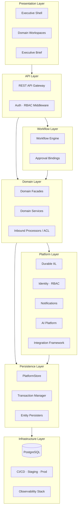
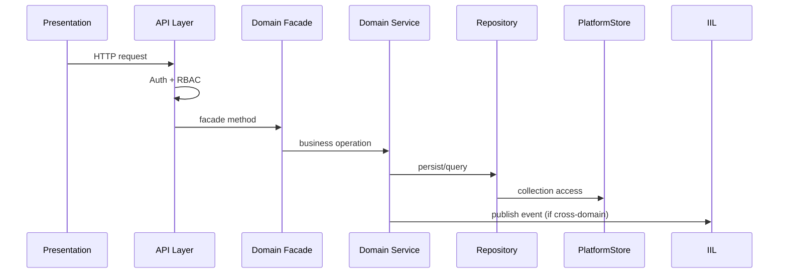
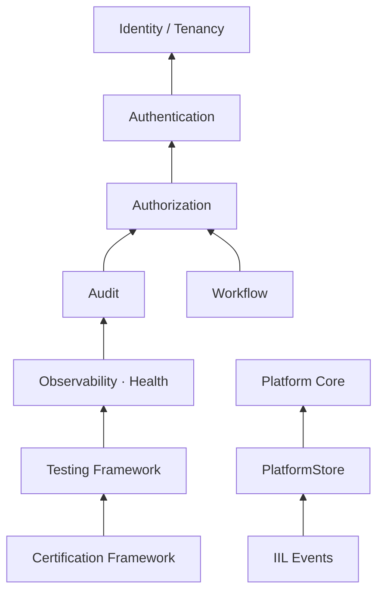
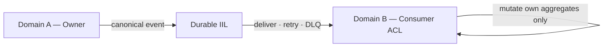
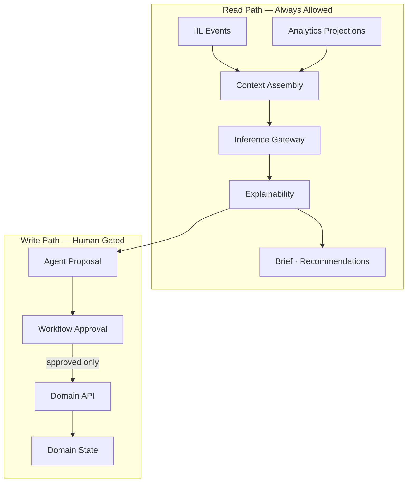
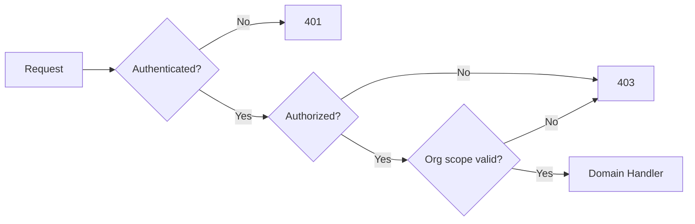
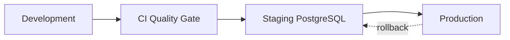
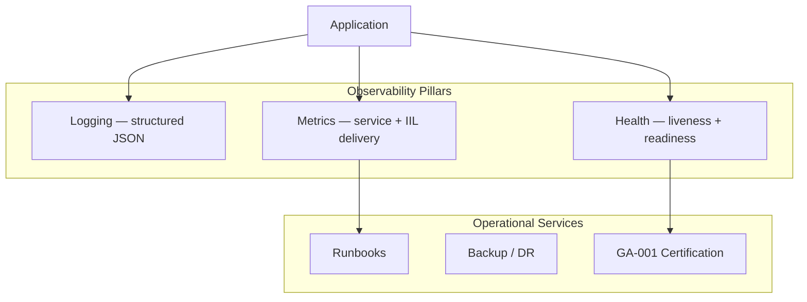
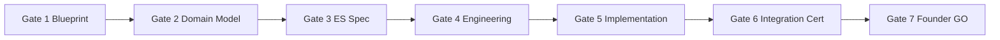
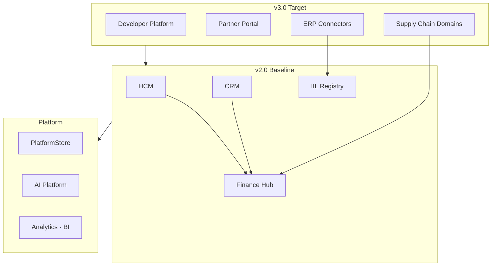

# P-014.4 — ORION Enterprise Reference Architecture

**Document ID:** REF-ARCH-001  
**Mission:** P-014.4 — ORION Enterprise Reference Architecture  
**Program:** P-014 — Enterprise Platform Planning  
**Version:** 1.0  
**Status:** Ratified — Constitutional Technical Blueprint  
**Classification:** Enterprise Architecture · Reference Architecture · Governance  
**Authority:** Chief Enterprise Architect · Architecture Review Board  
**Effective Date:** 4 August 2026  
**Planning Horizon:** 2026–2031  
**Architecture Baseline:** v2.0 Multi-Domain Baseline ([P-016.7](./P-016.7-Enterprise-Readiness-Update.md) @ `3f259d9`)

**Synthesizes:** [P-014.1 Domain Strategy](./P-014.1-Enterprise-Domain-Strategy.md) · [P-014.2 Capability Matrix](./P-014.2-Enterprise-Capability-Matrix.md) · [P-014.3 Integration Architecture](./P-014.3-Enterprise-Integration-Architecture.md) · [P-016.6 Baseline](./P-016.6-Architecture-Baseline.md) · [ADR-013](../11_Governance/ADR/ADR-013-Durable-Intelligent-Integration-Layer.md) · [ADR-014](../11_Governance/ADR/ADR-014-Cross-Domain-Event-Contracts.md) · [ADR-015](../11_Governance/ADR/ADR-015-Domain-Service-Boundaries.md) · [ADR-020](../11_Governance/ADR/ADR-020-Versioning-and-Domain-Compatibility.md)

**Related:** [P-016.2 v2.0 Architecture Charter](./P-016.2-ORION-v2-Architecture-Charter.md) · [Architecture Handbook v1.0](./ORION_Enterprise_Architecture_Handbook_v1.0.md) · [ES-097 ADR Policy](./ES-097-ORION-Architecture-Governance-ADR-Policy.md) · [Master Roadmap v1.0](./ORION_Enterprise_Platform_Master_Roadmap_v1.0.md)

**Scope:** Architecture only — no production code · no implementation authorization  
**Audience:** Every ORION engineer · domain lead · platform engineer · certification lead

> **Constitutional statement:** This document is the **definitive technical blueprint** for ORION. When implementation choices conflict with this reference architecture, the implementation is wrong unless an accepted ADR explicitly supersedes it.

---

## Executive Summary

ORION Enterprise Platform v2.0 is a **layered, event-driven Executive Operating System** built on shared platform capabilities, reference domain patterns, and constitutional integration law.

| Assessment | Verdict |
|------------|---------|
| **P-014.4 reference architecture mission** | **GO** |
| **Synthesis of P-014.1–014.3 + P-016.6 + ADRs** | **GO** |
| **Engineering law completeness** | **GO** |
| **Platform ready for unconstrained domain build** | **CONDITIONAL GO** — FIN-R-001 · ADR-014 registry · CRM facade unification |
| **Bypass reference patterns** | **NO-GO** |

**One-page architecture:** Presentation → API → Workflow → **Domain (facade)** → **Platform (IIL · RBAC · Store)** → Persistence → Infrastructure. Cross-domain = **IIL events only**. AI = **read-only** until workflow approval.

---

## 1. Architecture Principles

Derived from [G-001](../11_Governance/Governance/G-001-Enterprise-Architecture-Governance-Charter.md), [P-016.2](./P-016.2-ORION-v2-Architecture-Charter.md), and [ES-097](./ES-097-ORION-Architecture-Governance-ADR-Policy.md).

| # | Principle | Reference |
|---|-----------|-----------|
| **AP1** | **Architecture First** | Gates 1–4 before Gate 5 on every domain |
| **AP2** | **Platform First** | Shared capabilities before domain features |
| **AP3** | **Single Source of Truth** | One authoritative owner per aggregate |
| **AP4** | **Event-Driven Integration** | IIL for cross-domain state — ADR-013/014 |
| **AP5** | **Domain Boundaries** | Facade-only access — ADR-015 |
| **AP6** | **Finance Hub** | Monetary convergence through Finance |
| **AP7** | **Reference Replication** | HCM pattern is mandatory template |
| **AP8** | **Fail-Closed Security** | Deny by default — ADR-008/009 |
| **AP9** | **Evidence-Based Engineering** | ADR + certification + doc tests |
| **AP10** | **Backward Compatibility** | Versioned contracts — ADR-020 |
| **AP11** | **Recoverable by Design** | Persist-before-ack · DLQ · replay |
| **AP12** | **AI Read-Only by Default** | Human approval for mutations |

### 1.1 Engineering Laws (Constitutional)

These laws are **non-negotiable**. Violations block architecture review and merge.

| Law | Statement | Enforcement |
|-----|-----------|-------------|
| **L1 — Single Source of Truth** | Every aggregate has exactly one authoritative domain owner | ADR-015 · data ownership matrix |
| **L2 — No Direct Repository Access** | Domains MUST NOT import another domain's repository or store | Architecture import tests |
| **L3 — Platform Capabilities Only** | Domains MUST NOT reimplement persistence, auth, events, or AI infra | P-014.2 consumption law |
| **L4 — Facade-Only Domain Access** | Cross-package domain access via `@/lib/{domain}` public facade only | ESLint · architecture CI |
| **L5 — IIL-Only Integration** | Cross-domain state propagation via IIL canonical events only | ADR-013/014 |
| **L6 — Fail-Closed Security** | Unauthenticated or unauthorized requests return 401/403 — never default context | ADR-008/009 |
| **L7 — AI Read-Only by Default** | AI MUST NOT mutate authoritative state without workflow-approved human action | P-014.3 §9 |
| **L8 — Events Before Analytics** | Analytics/BI consume projections — never authoritative domain writes | P-014.1 §5 |
| **L9 — Certification Before Production** | Gate 5+ domains require certification evidence before production authorization | ES-096 · G-001 |
| **L10 — ADR Before Breaking Change** | Breaking facade, event, or API changes require accepted ADR | ES-097 |

---

## 2. Enterprise Layer Model

ORION is organized in **seven horizontal layers**. Dependencies flow **downward only** — upper layers consume lower layers, never the reverse.



### 2.1 Layer Responsibilities

| Layer | Responsibility | Owns | Must NOT |
|-------|----------------|------|----------|
| **Presentation** | UX · workspaces · executive views | UI components · layout | Business rules · persistence |
| **API** | HTTP entry · auth · routing | Route handlers · middleware | Domain aggregates |
| **Workflow** | State machines · approvals | Trigger registry · transitions | Domain business logic |
| **Domain** | Business rules · aggregates · facades | Entities · services · repositories | Platform infra duplication |
| **Platform** | Shared enterprise services | IIL · identity · RBAC · AI gateway | Authoritative business aggregates |
| **Persistence** | Storage abstraction · migrations | PlatformStore · persisters | Cross-domain queries |
| **Infrastructure** | Runtime · database · deploy · monitor | PostgreSQL · CI · health endpoints | Application logic |

### 2.2 Layer Dependency Diagram

```
Presentation ──→ API ──→ Domain Facade ──→ Domain Service ──→ Repository ──→ PlatformStore ──→ PostgreSQL
                │              │
                │              └──→ IIL publish/consume (cross-domain)
                └──→ Workflow (approvals)
Platform Layer spans: API middleware · IIL · Workflow engine · Notifications · AI · Integration
```

---

## 3. Reference Domain Pattern

The **HCM reference domain** ([ES-HCM-001](../HCM/Engineering/ES-HCM-001_Enterprise_HCM_Engineering_Specification.md)) is the mandatory template. Finance is the **second reference** for cross-domain integration.

### 3.1 Reference Domain Structure

```
lib/{domain}/
├── index.ts                    ← public facade (ONLY external import point)
├── {Domain}Facade.ts           ← orchestration entry
├── services/                   ← business logic
├── repositories/               ← PlatformStore access
├── models/                     ← domain entities
├── events/                     ← IIL catalogue + publishers
├── persistence/                ← entity persisters
├── api/                        ← API context + permission catalog
└── data/                       ← seed data (non-production)
```

### 3.2 Reference Call Chain



| Layer | HCM Reference | Finance Reference |
|-------|---------------|-------------------|
| Facade | `hcmFacade` | `createFinanceWiring` |
| RBAC | `getHcmApiContext` · permission catalog | Finance API middleware · catalog |
| Persistence | `HcmEntityPersister` | `FinanceEntityPersister` |
| Events | `HcmCanonicalFinancePublisher` | `FinanceEventConsumer` |
| Certification | RC1 · GA-001 | Gate 5 Wave A · GA-001 Finance |

### 3.3 Reference Domains Summary

| Domain | Role | Gate Status | Replication Mandate |
|--------|------|-------------|---------------------|
| **HCM** | Gold-standard bounded context | RC1 certified | Template for all domains |
| **Finance** | Integration hub · financial truth | Gate 5 CONDITIONAL GO | Template for event consume/post |
| **CRM** | Core commercial domain | Gate 5 Wave B CONDITIONAL GO | Composition root certified · CRM→Finance chain live |

---

## 4. Reference Capability Pattern

Every domain **consumes** platform capabilities from [P-014.2](./P-014.2-Enterprise-Capability-Matrix.md) — never reimplements.

### 4.1 Mandatory Capability Stack



### 4.2 Reference Capabilities (Certified v2.0)

| Capability | Component | Maturity | Reference Consumer |
|------------|-----------|----------|-------------------|
| **PlatformStore** | `lib/platform/store/` | Certified | HCM · Finance |
| **Persistence** | `lib/platform/persistence/` | Certified | HCM · Finance |
| **Durable IIL** | `lib/platform/iil/` | Certified | HCM publish · Finance consume |
| **RBAC** | `lib/platform/security/` | Certified | HCM · Finance APIs |
| **Observability** | `lib/platform/operations/` | Certified | GA-001 |
| **Health Monitoring** | `/api/health/*` | Certified | GA-001 |
| **Testing Framework** | Vitest · helpers | Certified | All domains |
| **Certification Framework** | G-001 · GA-001 | Certified | HCM · Finance |

### 4.3 Reference Capability Pattern (Checklist)

New domain Gate 4 exit MUST demonstrate:

- [ ] PlatformStore wiring with domain persister
- [ ] RBAC permission catalog + fail-closed API context
- [ ] IIL event catalogue (publish and/or consume)
- [ ] Workflow trigger bindings (if approval flows exist)
- [ ] Audit event subscription
- [ ] Health probe registration
- [ ] Domain test suite + doc certification tests
- [ ] Gate certification report

---

## 5. Cross-Domain Communication Pattern

Governed by [P-014.3](./P-014.3-Enterprise-Integration-Architecture.md) · [ADR-013](../11_Governance/ADR/ADR-013-Durable-Intelligent-Integration-Layer.md) · [ADR-014](../11_Governance/ADR/ADR-014-Cross-Domain-Event-Contracts.md) · [ADR-015](../11_Governance/ADR/ADR-015-Domain-Service-Boundaries.md).

### 5.1 The Only Approved Cross-Domain Pattern



| Step | Responsibility |
|------|----------------|
| 1. State transition in Domain A | Domain A service |
| 2. Build ADR-014 envelope | Domain A publisher |
| 3. Persist-before-ack on IIL | Platform (ADR-013) |
| 4. Validate envelope + idempotency | Domain B ACL (e.g. `FinanceInboundProcessor`) |
| 5. Mutate Domain B aggregates | Domain B service/repository |
| 6. Ack/Nack | Domain B consumer |
| 7. Project to Intelligence | Read-only subscriber |

### 5.2 Forbidden Patterns

| Pattern | Violation |
|---------|-----------|
| `import { HcmRepository } from '@/lib/hcm/repositories/...'` | L2 — No direct repository access |
| Synchronous cross-domain service call mutating foreign aggregate | L2 · L5 |
| Shared database table between domains | L1 · L3 |
| Custom in-domain message bus for cross-domain | L3 · L5 |
| CRM writes Finance journal directly | L1 · Finance hub |

### 5.3 Certified Enterprise Reference Chains

**HCM → Finance:** `hcm.workforce.cost.recorded` · `hcm.expense.approved` — GA-001 Finance certified (`P-009.17`).

**CRM → Finance:** `crm.revenue.recognized` · `crm.salesorder.confirmed` — integration certified (`P-009.19` · `FinanceCrmRevenueConsumer.test.ts`).

**Documentation:** [HCM-Finance-Event-Chain.md](../Finance/Integration/HCM-Finance-Event-Chain.md) · [Finance-CRM-Revenue-Integration.md](../Finance/Integration/Finance-CRM-Revenue-Integration.md)

---

## 6. AI Platform Pattern

AI is a **platform layer service** — not embedded domain logic ([P-014.1 §12](./P-014.1-Enterprise-Domain-Strategy.md) · [P-014.3 §9](./P-014.3-Enterprise-Integration-Architecture.md)).



| Rule | Detail |
|------|--------|
| **Read** | AI pulls authorized context from projections and events |
| **Recommend** | AI outputs suggestions with source citations |
| **Propose** | Agents create workflow tasks — not domain writes |
| **Act** | Only after human approval via Workflow → Domain API |
| **Audit** | Every inference logged with org scope |

---

## 7. Data Ownership Model

| Domain | Authoritative Aggregates | Published Events | Consumers |
|--------|-------------------------|------------------|-----------|
| **HCM** | Employee · org · time · payroll · expense | `hcm.*` | Finance · Intelligence |
| **Finance** | Journal · GL · CoA · period | `finance.*` *(Wave B)* | Intelligence · BI |
| **CRM** | Account · opportunity · pipeline | `crm.revenue.recognized` · `crm.salesorder.confirmed` | Finance · Intelligence |
| **Platform** | Tenant config · IIL transport · audit | Platform events | Operations |
| **Intelligence** | **None** | Derived alerts only | Executive UI |

**Read models:** Analytics projections and BI dashboards are **rebuildable from IIL replay** — never authoritative.

---

## 8. Security Model

| Layer | Control | ADR | Pattern |
|-------|---------|-----|---------|
| **Edge** | HTTPS TLS | Platform standard | All routes |
| **API** | Authentication | ADR-008 | Session · ServiceContext |
| **API** | Authorization | ADR-009 | Permission catalog · fail-closed |
| **Domain** | Tenancy | ADR-007 | `orgId` scoping on all stores |
| **Events** | Publisher authorization | ADR-013 | ServiceRegistry |
| **Events** | PII classification | ADR-014 | Envelope metadata |
| **Secrets** | Vault/env | ADR-010 | No secrets in domain code |
| **Audit** | Immutable trail | Platform | Authorization + activity audit |
| **Integration** | Webhook validation | P-014.3 | Signature + org mapping |



---

## 9. Deployment Architecture

Per [ADR-012](../11_Governance/ADR/ADR-012-Deployment-Release-Strategy.md) · [Release Policy](../06_Releases/Release-Policy.md).

### 9.1 Environment Topology



| Environment | Purpose | Persistence | IIL Transport | Certification |
|-------------|---------|-------------|---------------|---------------|
| **Development** | Local engineer | In-memory or local PG | `memory` | Unit tests |
| **CI** | PR/push gates | Ephemeral PG (GA-001) | `memory` / `durable` | Full suite |
| **Staging** | Pre-production | PostgreSQL | `durable` | GA-001 live PG optional |
| **Production** | Customer-facing | PostgreSQL | `durable` | Gate 6+ GO required |

### 9.2 Deployment Principles

| # | Principle |
|---|-----------|
| **D1** | Semver-gated releases per ADR-012 |
| **D2** | CI quality gate MUST pass before merge to protected branches |
| **D3** | `develop/v2.0` is v2.0 integration branch; `release/v1.0.1` frozen |
| **D4** | Environment promotion: CI → Staging → Production — no skip |
| **D5** | Rollback documented and tested per release |
| **D6** | `ORION_IIL_TRANSPORT=durable` required in staging/production |
| **D7** | `DATABASE_URL` required for production-authoritative paths |

### 9.3 Branch & Release Model

| Branch | Role |
|--------|------|
| `develop/v2.0` | v2.0 multi-domain integration |
| `release/v1.0.1` | v1.0.x frozen baseline @ `12af9c4` |
| Feature branches | Domain missions · platform missions |
| Tags | `v2.0.0` Multi-Domain Baseline (Gate 6 target) |

---

## 10. Observability Model

Per [ADR-011](../11_Governance/ADR/ADR-011-Observability-Architecture.md) · [P-014.2 §4.5](./P-014.2-Enterprise-Capability-Matrix.md).

### 10.1 Three Pillars



| Pillar | Implementation | Endpoints / Artifacts |
|--------|----------------|----------------------|
| **Logging** | Structured JSON · correlation ID | `X-Correlation-Id` propagation |
| **Metrics** | `OperationalMetrics` · `TransportMetrics` | `/api/health/metrics` |
| **Health** | Liveness + readiness probes | `/api/health` · `/api/health/readiness` |
| **Tracing** | Correlation via context | Planned v2.1 APM |
| **Alerting** | Alert engine · Brief surfacing | Intelligence platform |

### 10.2 Observability Requirements by Layer

| Layer | Required Telemetry |
|-------|-------------------|
| API | Request count · 401/403 rate · latency |
| Domain | Business operation outcomes · validation failures |
| IIL | Publish ack · delivery latency · DLQ depth · retry count |
| Persistence | Store health · migration status · connection pool |
| Platform | GA-001 operational scenarios · restart recovery |

---

## 11. Scalability Strategy

| Dimension | v2.0 Strategy | Future (v2.2+) |
|-----------|---------------|----------------|
| **Horizontal scale** | Stateless API tier · shared PostgreSQL | Read replicas · connection pooling |
| **Event throughput** | IIL partition ordering per entity | Dedicated transport scaling |
| **Domain isolation** | Bounded contexts · independent deploy units | Domain microservice split (ADR-gated) |
| **Read scale** | Analytics projections · materialized views | Caching layer (Redis) |
| **Multi-tenancy** | orgId partition on all collections | Row-level security audit |
| **Performance** | Benchmark · load · stress frameworks (P-015.9) | Production SLO enforcement |

**Principle:** Scale **read paths** (projections, caches) before scaling **write paths** (authoritative domains). Never scale by sharing databases across domains.

---

## 12. Certification Strategy

Per [ES-096](../11_Governance/ES-096-ORION-Enterprise-Testing-Certification-Standards.md) · G-001 seven gates · GA-001 operational certification.

### 12.1 Gate Model



| Gate | Deliverable | Reference Architecture Element |
|------|-------------|-------------------------------|
| **Gate 1** | D-xxx blueprint | Domain in layer model |
| **Gate 2** | Entity model | Data ownership |
| **Gate 3** | ES-xxx specification | Reference domain pattern |
| **Gate 4** | Wiring + ADRs accepted | Capability consumption |
| **Gate 5** | Implementation + tests | Full call chain |
| **Gate 6** | Cross-domain cert | IIL chain · security · ops |
| **Gate 7** | Executive authorization | Production GO |

### 12.2 Certification Evidence Package

Every Gate 5+ domain MUST produce:

- Domain test suite (100% pass)
- Doc certification tests
- RBAC permission matrix
- IIL event catalogue
- GA-001 domain scenarios (where applicable)
- Gate certification report with GO/CONDITIONAL GO/NO-GO

### 12.3 Current Certification Posture (P-016.6)

| Scope | Verdict |
|-------|---------|
| Platform GA-001 | GO |
| HCM RC1 | CONDITIONAL GO |
| Finance Gate 5 Wave A | CONDITIONAL GO |
| Finance GA-001 | CONDITIONAL GO |
| v2.0 GA | NO-GO |

---

## 13. Technology Standards

| Category | Standard | Notes |
|----------|----------|-------|
| **Language** | TypeScript (strict) | All platform and domain code |
| **Runtime** | Node.js · Next.js App Router | API routes + UI |
| **Persistence** | PostgreSQL via PlatformStore | ADR-007 · in-memory dev fallback |
| **Events** | Durable IIL (ADR-013) | In-memory transport for dev/test only |
| **API** | REST JSON | GraphQL v3.0 future |
| **Testing** | Vitest | Unit · integration · certification |
| **CI** | GitHub Actions | quality-gate · ga-staging-certification |
| **Version control** | Git · semver tags | ADR-012 |
| **Documentation** | Markdown ES-xxx · ADR · Gate reports | Doc certification tests |
| **Package imports** | `@/lib/{domain}` facade only | Architecture boundary |

---

## 14. Engineering Standards

| Standard | ID | Scope |
|----------|-----|-------|
| Platform Services Foundation | ES-011 | Platform layer contracts |
| Persistence | ES-036 / ADR-007 | PlatformStore pattern |
| Identity & Authentication | ADR-008 | ServiceContext · sessions |
| Authorization | ADR-009 | RBAC catalogs |
| Event Contracts | ADR-014 | Cross-domain envelopes |
| Domain Boundaries | ADR-015 | Facade · import law |
| Versioning | ADR-020 | eventVersion · API majors |
| Deployment | ADR-012 | Environments · rollback |
| Observability | ADR-011 | Logging · metrics · health |
| Certification | ES-096 | Gate process · GA-001 |
| ADR Governance | ES-097 | Propose → Accept → Implement |
| Architecture Lifecycle | ES-092 | Gate lifecycle |
| Technical Debt | ES-093 | Debt register promotion |
| Architecture Compliance | ES-094 | Compliance verification |
| Maturity Assessment | ES-095 | Architecture health scoring |

**Hierarchy:** ORION Canon → G-001 → Architecture Handbook → ES-097 → ADR-xxx → ES-xxx → Implementation

---

## 15. Future Evolution

### 15.1 Version Roadmap

| Version | Architecture Evolution |
|---------|------------------------|
| **v2.0** *(current)* | Multi-domain baseline · durable IIL · HCM+Finance certified chain · ADR-014 registry |
| **v2.1** | CRM reference completion · Finance outbound events · Analytics ingest · AI gateway · Integration Platform |
| **v2.2** | Operations domains · Hospitality chain · BI projections · caching · governed agents |
| **v3.0** | Full event catalogue · Developer SDK · GraphQL · partner ecosystem · ERP sync |

### 15.2 Evolution Principles

1. **Extend, don't rewrite** — v2.0 builds on v1.0 PlatformStore and HCM reference.
2. **ADR-gated breaking changes** — no silent facade or event breakage.
3. **Certification follows architecture** — new patterns certified before production.
4. **Platform absorbs complexity** — domains stay thin as platform matures.
5. **Finance hub persists** — new domains integrate through Finance for monetary flows.

### 15.3 Future Architecture Diagram



---

## Appendix A — Architecture Decision Summary

| ADR | Decision | Status | Reference Architecture Impact |
|-----|----------|--------|------------------------------|
| **ADR-007** | PlatformStore / PostgreSQL persistence | Accepted | Persistence Layer |
| **ADR-008** | Identity & authentication | Accepted | API Layer · Security |
| **ADR-009** | Enterprise RBAC | Accepted | API Layer · Security |
| **ADR-010** | Configuration & secrets | Accepted | Infrastructure · Security |
| **ADR-011** | Observability | Accepted | Observability Model |
| **ADR-012** | Deployment & release | Accepted | Deployment Architecture |
| **ADR-013** | Durable IIL | **Implemented** | Platform Layer · Integration |
| **ADR-014** | Cross-domain event contracts | Accepted · Partial | Cross-Domain Pattern |
| **ADR-015** | Domain service boundaries | Accepted · Partial | Domain Layer · Engineering Laws |
| **ADR-020** | Versioning & compatibility | Accepted · Partial | API · Events · Evolution |

---

## Appendix B — Reference Services Map

| Service | Layer | Package | Status |
|---------|-------|---------|--------|
| Executive Shell | Presentation | `app/` · executive components | Delivered |
| Domain Workspaces | Presentation | `app/` workspaces | Delivered |
| REST API Gateway | API | `app/api/` | Implemented |
| Auth Middleware | API | `lib/auth/` · domain API context | Implemented |
| Workflow Engine | Workflow | `lib/platform/workflow/` | Implemented |
| HCM Facade | Domain | `lib/hcm/` | Certified |
| Finance Wiring | Domain | `lib/finance/` | CONDITIONAL GO |
| Durable IIL | Platform | `lib/platform/iil/` | Certified |
| RBAC | Platform | `lib/platform/security/` | Certified |
| Intelligence / Brief | Platform | `lib/intelligence/` | Implemented |
| AI Providers | Platform | `lib/intelligence/ai-providers.ts` | Prototype |
| PlatformStore | Persistence | `lib/platform/store/` | Certified |
| Entity Persisters | Persistence | `lib/platform/persistence/` | Certified |
| PostgreSQL | Infrastructure | `DATABASE_URL` | Production path |
| Health Endpoints | Infrastructure | `app/api/health/` | Certified |
| CI Quality Gate | Infrastructure | `.github/workflows/` | Certified |

---

## Appendix C — Reference Patterns Index

| Pattern | Document | Law |
|---------|----------|-----|
| Reference Domain | §3 · P-014.1 §5 | L7 — Reference Replication |
| Reference Capability | §4 · P-014.2 | L3 — Platform Capabilities Only |
| Cross-Domain Event | §5 · P-014.3 §5 | L5 — IIL-Only Integration |
| AI Platform | §6 · P-014.3 §9 | L7 — AI Read-Only by Default |
| Data Ownership | §7 · P-014.3 §2 | L1 — Single Source of Truth |
| Fail-Closed Security | §8 | L6 — Fail-Closed Security |
| Facade Boundary | §3.1 · ADR-015 | L4 — Facade-Only Domain Access |
| Persist-Before-Ack | ADR-013 · P-014.3 §4 | L11 — Recoverable by Design |
| Gate Certification | §12 · ES-096 | L9 — Certification Before Production |
| Version Compatibility | ADR-020 | L10 — ADR Before Breaking Change |

---

## Appendix D — P-014 Program Synthesis Map

| Document | Role in Reference Architecture |
|----------|-------------------------------|
| **P-014.1** | Domain taxonomy · ownership · roadmap · AI/workflow/reporting strategy |
| **P-014.2** | Capability catalog · consumption law · maturity · platform services |
| **P-014.3** | Integration patterns · event lifecycle · external model · failure/recovery |
| **P-014.4** *(this document)* | **Unified constitutional blueprint for engineers** |
| **P-016.6** | Current baseline · ADR status · certification posture · blockers |

---

*P-014.4 — Enterprise Reference Architecture · docs/00_Governance/ · Constitutional technical blueprint · Architecture only · No implementation*
