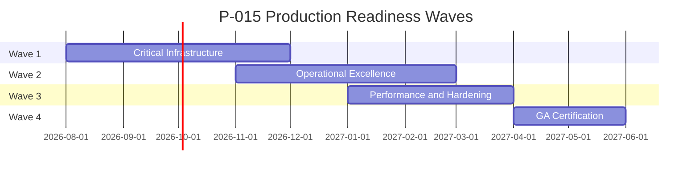

# P-015.1 — Enterprise Production Readiness Architecture & Gap Analysis

**Document ID:** PRA-015.1-001  
**Mission:** P-015.1 — Enterprise Production Readiness Architecture & Gap Analysis  
**Program:** P-015 — Platform Production Readiness & GA Path  
**Version:** 1.0  
**Status:** Assessment Complete — Planning & Certification  
**Classification:** Executive Assessment · Architecture · Operations  
**Authority:** Chief Enterprise Architect  
**Assessment Date:** August 2026  
**Baseline Release:** v1.0.1-rc1 · commit `03ec4b2` · tag `v1.0.1-rc1`  
**Architecture Baseline:** v1.0 Candidate (RC)

**Baseline Sources:** [Enterprise Architecture Handbook v1.0](./ORION_Enterprise_Architecture_Handbook_v1.0.md) · [Master Roadmap v1.0](./ORION_Enterprise_Platform_Master_Roadmap_v1.0.md) · [PMO Framework](./ORION_Enterprise_PMO_Framework.md) · [Portfolio Framework](./ORION_Enterprise_Portfolio_Management_Framework.md) · [v1.0.1-rc1 Certification](../06_Releases/v1.0.1-rc1-Certification.md) · [ES-096 Testing & Certification](./ES-096-ORION-Enterprise-Testing-Certification-Standards.md) · [ES-097 ADR Policy](./ES-097-ORION-Architecture-Governance-ADR-Policy.md) · [Release Policy](../06_Releases/Release-Policy.md) · [ES-036 Persistence Architecture](../02_Engineering/ES-036-Database-Persistence-Architecture.md) · [Platform Retrospective v1.0](./ORION_Platform_Retrospective_v1.0.md)

---

## 1. Executive Summary

This assessment evaluates the gap between ORION's current **Release Candidate baseline (v1.0.1-rc1 · CONDITIONAL GO)** and **Enterprise General Availability (GA)** requirements defined by G-001 Gate 6/7, ES-096, and the [Master Roadmap GA exit criteria](./ORION_Enterprise_Platform_Master_Roadmap_v1.0.md#year-1--platform-ga-aug-2026--jul-2027).

### Key Findings

ORION is **architecturally certified** for its declared HCM RC scope. Layering, facade boundaries, organization isolation, IIL events, workflow integration, and governance documentation are **strong**. The platform is **not operationally ready for production GA** due to cross-cutting infrastructure gaps that affect every domain:

| Finding | Severity | GA Impact |
|---------|----------|-----------|
| **In-memory persistence** across HCM, CRM, Finance, Data Platform, Decisions | **Critical** | Data loss on restart · no durable enterprise deployment |
| **No domain-level permission enforcement** on APIs (platform session only) | **Critical** | Authenticated users can invoke domain operations without fine-grained RBAC |
| **Full test suite not green** (794/800 at RC cert) | **High** | Release credibility · doc certification drift in CRM/Finance |
| **Central debt register stale** vs domain registers | **High** | Governance visibility gap · ADR-004 compliance risk |
| **ES-036 persistence not implemented** (spec approved · construction pending) | **Critical** | No shared repository abstraction in production |
| **Operational maturity partial** (DR, backup, deployment runbooks, durable IIL) | **High** | Enterprise ops requirements unmet |
| **Governance standards incomplete** (ES-092–095 planned) | **Medium** | Level 2 enforcement gap |
| **Data Platform Phase I only** (CONDITIONAL GO alpha) | **Medium** | Master data not production-authoritative |

### Production Readiness Score

**Overall GA Readiness: 58 / 100 — NOT GA READY**

| Layer | Score | Weight | Weighted |
|-------|-------|--------|----------|
| Architecture & design | 82 | 20% | 16.4 |
| Application quality (HCM) | 85 | 15% | 12.8 |
| Platform infrastructure | 35 | 20% | 7.0 |
| Security & authorization | 48 | 15% | 7.2 |
| Operations & observability | 42 | 15% | 6.3 |
| Release & certification | 55 | 10% | 5.5 |
| Documentation & governance | 78 | 5% | 3.9 |
| **Total** | | **100%** | **59.1 → 58** |

*Rounded executive score: **58/100**. RC architecture score ~82; production operations score ~40.*

### Assessment Decision

| Decision | Verdict | Rationale |
|----------|---------|-----------|
| **P-015.1 assessment mission** | **GO** | Evidence-based gap analysis complete |
| **Architecture direction for GA** | **GO** | HCM reference patterns · ES-036 path · handbook alignment |
| **Production GA today** | **NO-GO** | Critical persistence and authorization gaps |
| **RC stabilization and Wave 1 execution** | **CONDITIONAL GO** | Proceed P-015 Waves 1–4 per this assessment |

### Recommended Immediate Actions

1. **Ratify ES-036 implementation ADR** — technology-neutral store selection · migration strategy · HCM-first rollout  
2. **Promote TD-HCM-001 and TD-HCM-005 to P0** in central register with P-015 owners  
3. **Launch Wave 1 (Critical Infrastructure)** — persistence abstraction · platform RBAC · API context hardening  
4. **Remediate 6 doc certification test failures** — full suite 800/800  
5. **Sync central TECHNICAL_DEBT.md** with HCM and platform debt registers  

---

## 2. Production Readiness Score — Detail

### 2.1 Scoring Methodology

Scores use **0–100** per layer, derived from evidence in certification reports, code review, ES-036 status, and [S-001.1 Engineering Health Audit](../03_Quality/S-001.1-Engineering-Health-Audit.md). GA target per layer: **≥ 85** except Architecture (≥ 90).

### 2.2 Layer Breakdown

| Layer | Score | GA Target | Gap | Primary Evidence |
|-------|-------|-----------|-----|------------------|
| Architecture & design | 82 | 90 | −8 | v1.0.1-rc1 cert · Handbook v1.0 · HCM reference |
| Application quality | 85 | 85 | 0 | HCM 79/79 · four validation gates pass |
| Platform infrastructure | 35 | 85 | −50 | In-memory stores · no DB · IIL in-process |
| Security & authorization | 48 | 90 | −42 | Session middleware · no domain RBAC · API fallback context |
| Operations & observability | 42 | 80 | −38 | Health endpoints exist · no DR/backup/deploy runbooks |
| Release & certification | 55 | 90 | −35 | CONDITIONAL GO · 794/800 tests · debt register drift |
| Documentation & governance | 78 | 85 | −7 | ES-090–097 ratified · ES-092–095 pending |

### 2.3 Certification Alignment

| Criterion (ES-096 / G-001) | RC State | GA Requirement | Met |
|----------------------------|----------|----------------|-----|
| Four validation gates pass | ✅ HCM scope | Full platform | Partial |
| Architecture certified | ✅ HCM | All GA domains | Partial |
| Zero open P0 debt | ❌ | Required | **No** |
| GO certification decision | ❌ CONDITIONAL GO | GO | **No** |
| Persistent storage | ❌ | Required | **No** |
| Permission enforcement | ❌ | Required | **No** |
| Release artifacts complete | ✅ v1.0.1-rc1 | Per release | Yes |

---

## 3. Architecture Gap Matrix

Assessment of platform architecture vs Enterprise GA requirements.  
**Legend:** ✅ Ready · ⚠ Partial · ❌ Gap · 🔲 Planned

| Capability | RC State | GA Requirement | Gap ID | Priority | Effort | Dependency |
|------------|----------|----------------|--------|----------|--------|------------|
| Domain facade pattern | ✅ HCM reference | All GA domains | — | — | — | — |
| Layered architecture | ✅ | Enforced | — | — | — | — |
| Organization isolation | ✅ Repositories + tests | All APIs | AG-001 | Low | S | — |
| IIL cross-domain events | ⚠ In-process EventBus | Durable transport | AG-002 | High | L | ES-036 · ADR |
| Workflow integration | ✅ HCM | Domain hooks | — | — | — | — |
| Repository abstraction | ⚠ Interfaces exist | Shared platform impl | AG-003 | **Critical** | L | ES-036 ADR |
| Master data registry | ⚠ Phase I alpha | Phase II consumption | AG-004 | Medium | L | P-011 |
| Business workspace pattern | ✅ ADR-005 | Maintained | — | — | — | — |
| Intelligence dual pipeline | ⚠ TD-003 | Unified path | AG-005 | Medium | M | ADR |
| ES-092–095 standards | 🔲 Planned | Ratified + enforced | AG-006 | Medium | M | P-013 |
| Domain ES for all GA lines | ⚠ HCM only | Finance · Platform | AG-007 | High | M | P-009 prep |
| ADR governance process | ✅ ES-097 | ADR-001–003 validated | AG-008 | Low | S | ARB session |

---

## 4. Infrastructure Readiness Matrix

| Infrastructure Area | RC State | Evidence | GA Requirement | Gap ID | Priority | Effort | Risk |
|---------------------|----------|----------|----------------|--------|----------|--------|------|
| **Persistence** | ❌ In-memory dominant | `InMemoryHcmStore`, CRM/Finance repos, Data Platform repos, `InMemoryDecisionRepository` | Durable transactional store per ES-036 | INF-001 | **Critical** | XL | Data loss |
| **Identity** | ⚠ Demo + session | `lib/identity/` · demo users · JWT session cookie | Production IdP-ready · no demo fallback in prod | INF-002 | High | M | Wrong tenant context |
| **Authentication** | ⚠ Session middleware | `middleware.ts` · `verifySessionToken` | MFA-ready path · SSO extensibility (TD-004) | INF-003 | High | M | Session compromise |
| **Authorization** | ❌ Route-level only | `canAccessPathWithPayload` · no domain matrix | Platform RBAC + domain hooks (TD-HCM-005) | INF-004 | **Critical** | L | Privilege escalation |
| **Configuration** | ⚠ Env validation | `lib/config/env.ts` · `validateEnvironment()` | 12-factor · environment-specific config service | INF-005 | Medium | S | Misconfiguration |
| **Secrets management** | ⚠ Env vars | `ORION_SESSION_SECRET` validation in prod | Secret manager integration · rotation | INF-006 | High | M | Secret leakage |
| **Monitoring** | ⚠ Basic | `HealthStatusService` · `PerformanceMonitor` · IIL `HealthMonitor` | APM integration · SLA dashboards | INF-007 | High | M | Blind spots |
| **Logging** | ⚠ Application-level | Structured patterns partial | Centralized log aggregation · correlation IDs | INF-008 | High | M | Incident response |
| **Health checks** | ✅ Endpoints | `/api/health` · `/readiness` · `/metrics` | K8s/load-balancer integration documented | INF-009 | Low | S | — |
| **Audit** | ⚠ Partial | `ComplianceService` · platform audit hooks | Immutable audit trail for domain mutations | INF-010 | High | M | Compliance failure |
| **Disaster recovery** | ❌ Not defined | ES-036 § DR planned only | RTO/RPO targets · DR runbook | INF-011 | High | L | Business continuity |
| **Backup strategy** | ❌ Not defined | No backup infrastructure | Automated backup · restore tested | INF-012 | High | L | Data loss |
| **Deployment** | ⚠ Build only | `npm run build` · Next.js | Blue/green or canary · rollback procedure | INF-013 | High | M | Failed deploy |
| **CI/CD** | ⚠ Partial | `.github/workflows/quality-gate.yml` on `main` | Release branch gates · deploy pipeline · staging | INF-014 | Medium | M | Untested releases |
| **Observability** | ⚠ Partial | Web vitals · health report | Distributed tracing · alerting | INF-015 | Medium | M | Debug latency |
| **Performance** | ⚠ Unbenchmarked | Readiness service assumes pass | Load tests · response budgets per ES-096 | INF-016 | Medium | M | SLA breach |
| **Scalability** | ⚠ Single-process | In-memory stores · in-process IIL | Horizontal scale design · state externalization | INF-017 | High | L | INF-001 |
| **Security headers** | ✅ | `applySecurityHeaders` in middleware | Maintain · security audit cadence | — | Low | S | — |

---

## 5. Security Readiness

### 5.1 Current State

| Control | Status | Evidence | GA Gap |
|---------|--------|----------|--------|
| Session-based authentication | ⚠ Functional | Cookie JWT · middleware redirect | Production secret enforcement ✅ in `env.ts` |
| Route-level RBAC (UI) | ⚠ Partial | `canAccessRoute` · role permissions map | Not enforced on all API routes uniformly |
| Domain API authorization | ❌ Missing | HCM routes: org isolation only (TD-HCM-005) | Domain permission matrix required |
| Organization isolation | ✅ | Repository-scoped queries | Maintain under persistent store |
| API unauthenticated fallback | ❌ Risk | `getDecisionServiceContext()` returns `DEFAULT_CONTEXT` when no session | **Must fail closed for domain APIs in production** |
| Input validation | ⚠ Partial | API envelope patterns · rules engines | Formal ES-093 API standards pending |
| Dependency audit | ✅ CI | `npm run audit:production` in quality gate | Maintain |
| SSO / enterprise IdP | ❌ | TD-004 in readiness service | Future · not GA blocker if session hardened |
| Encryption at rest | ❌ | ES-036 planned | Required with persistent store |
| Zero-trust architecture | 🔲 | ES-059 referenced in G-001 | Formal alignment pending |

### 5.2 Security Gap Summary

| Gap ID | Description | Priority | Effort | Wave |
|--------|-------------|----------|--------|------|
| SEC-001 | Domain permission matrix (TD-HCM-005 pattern platform-wide) | **Critical** | L | 1 |
| SEC-002 | API fail-closed — no default ServiceContext on domain REST | **Critical** | S | 1 |
| SEC-003 | Secrets manager integration beyond env vars | High | M | 2 |
| SEC-004 | Immutable audit trail for financial/HR mutations | High | M | 2 |
| SEC-005 | ES-093 API security standards ratification | Medium | M | 2 |
| SEC-006 | Penetration test / security audit pre-GA | Medium | S | 3 |

### 5.3 Security Readiness Score: **48 / 100**

---

## 6. Operations Readiness

### 6.1 Operational Capabilities

| Capability | Status | Notes |
|------------|--------|-------|
| Health endpoints for LB | ✅ | `/api/health`, `/api/health/readiness`, `/api/health/metrics` |
| Release readiness API | ⚠ | `ReadinessAssessmentService` — uses static debt list · optimistic test score |
| Runbooks | ❌ | No production ops runbook in `docs/06_Releases/` |
| Incident response | ❌ | Not documented for platform |
| On-call / escalation | ❌ | PMO escalation defined · ops on-call not defined |
| Multi-environment | ⚠ | dev/staging/prod implied · not fully documented |
| LTS support policy | ✅ | [Release Policy](../06_Releases/Release-Policy.md) defines LTS stage |

### 6.2 Operations Gap Summary

| Gap ID | Description | Priority | Effort | Wave |
|--------|-------------|----------|--------|------|
| OPS-001 | Production deployment runbook | High | M | 2 |
| OPS-002 | DR plan with RTO/RPO (ES-036 alignment) | High | L | 2 |
| OPS-003 | Backup and restore procedure | High | L | 2 |
| OPS-004 | Centralized logging and alerting | High | M | 2 |
| OPS-005 | Update ReadinessAssessmentService with live gate results | Medium | S | 2 |
| OPS-006 | Staging environment certification path | Medium | M | 3 |

### 6.3 Operations Readiness Score: **42 / 100**

---

## 7. Deployment Readiness

### 7.1 Current Deployment Posture

| Item | State | Evidence |
|------|-------|----------|
| Production build | ✅ | `npm run build` passes at RC |
| CI quality gate | ⚠ | Runs on `main` PR/push — verify `release/v1.0.1` coverage |
| Container / IaC | 🔲 | Not assessed in repo — technology-neutral gap |
| Environment validation | ✅ | `validateEnvironment()` blocks weak prod secrets |
| Rollback | ⚠ | Git tags deployable per ES-097 — procedure not documented |
| Release branch discipline | ✅ | `release/v1.0.1` · tag `v1.0.1-rc1` |

### 7.2 Deployment Gap Summary

| Gap ID | Description | Priority | Effort | Wave |
|--------|-------------|----------|--------|------|
| DEP-001 | Documented deployment and rollback runbook | High | M | 2 |
| DEP-002 | CI gates on release branches | Medium | S | 1 |
| DEP-003 | Staging deploy before GA tag | High | M | 3 |
| DEP-004 | Post-deploy smoke tests (health + HCM API) | Medium | S | 3 |

### 7.3 Deployment Readiness Score: **50 / 100**

---

## 8. Technical Debt Register

Consolidated from [HCM Technical Debt Register](../HCM/Engineering/HCM-Technical-Debt-Register.md), [v1.0.1-rc1 Certification](../06_Releases/v1.0.1-rc1-Certification.md), [ReadinessAssessmentService](../../lib/observability/ReadinessAssessmentService.ts), [Platform Retrospective](./ORION_Platform_Retrospective_v1.0.md), and [Data Platform Certificate](../Data/Engineering/ENTERPRISE_DATA_PLATFORM_CERTIFICATE.md).

**Governance note:** [docs/11_Governance/TECHNICAL_DEBT.md](../11_Governance/TECHNICAL_DEBT.md) states *"No technical debt formally identified"* — **out of sync** with domain registers. **Gap REG-001 — Critical governance debt.**

### 8.1 P0 — GA Blockers

| ID | Domain | Description | Priority | Effort | Dependencies | Risk | Owner | Wave |
|----|--------|-------------|----------|--------|--------------|------|-------|------|
| **TD-HCM-001** | People / Platform | All HCM repositories use `InMemoryHcmStore` — no survive restart | **Critical** | XL | ES-036 ADR · store selection | Data loss | Platform Eng | 1 |
| **TD-HCM-005** | People / Platform | No HCM-specific permission matrix on API routes | **Critical** | L | Platform RBAC service | Privilege escalation | Platform Eng | 1 |
| **REG-001** | Governance | Central TECHNICAL_DEBT.md empty vs domain registers | **Critical** | S | — | Invisible P0 | CEA | 1 |

### 8.2 P1 — High (Pre-GA Required)

| ID | Domain | Description | Priority | Effort | Dependencies | Risk | Owner | Wave |
|----|--------|-------------|----------|--------|--------------|------|------|-------|
| **TD-PLATFORM-001** | Platform | Full test suite 794/800 — CRM/Finance doc cert failures | High | M | Domain leads | Release credibility | Eng Lead | 1 |
| **TD-PLATFORM-002** | Platform | API default ServiceContext when unauthenticated | High | S | SEC-002 | Wrong org data | Platform Eng | 1 |
| **TD-002** | Customer | CRM in-memory repository — persistence pending | High | L | INF-001 | Data loss | Commercial Lead | 1 |
| **TD-005** | Platform | Decision repository in-memory | High | L | INF-001 | Decision data loss | Platform Eng | 1 |
| **TD-PLATFORM-003** | Platform | IIL EventBus in-process only — no durable queue | High | L | ADR · Wave 2 | Event loss on crash | Platform Eng | 2 |
| **TD-PLATFORM-004** | Governance | ES-092–095 not ratified | High | M | P-013.4–7 | Enforcement gap | CEA | 2 |
| **TD-DP-001** | Data Platform | P-011 Phase II not implemented · D-012 absent | High | L | P-011 program | MDM incomplete | Platform Eng | 2 |

### 8.3 P2 — Medium

| ID | Domain | Description | Priority | Effort | Wave |
|----|--------|-------------|----------|--------|------|
| **TD-HCM-002** | People | No payroll/talent REST routes | Medium | M | 3 |
| **TD-003** | Intelligence | Dual intelligence paths (Brief Bus vs Orchestrator) | Medium | M | 3 |
| **TD-001** | Finance | Finance workspace placeholder data | Medium | M | 2* |
| **TD-004** | Identity | SSO providers not implemented | Medium | L | Future |
| **TD-HCM-003** | People | Event publication pattern inconsistency | Low | S | 3 |
| **TD-HCM-004** | People | Interview repository stub | Low | S | Future |
| **TD-HCM-006** | People | D-015/D-016 domain model docs pending | Low | M | 3 |

*TD-001 Finance placeholder addressed by P-009 — not GA blocker for HCM-only GA bundle.*

### 8.4 Open ADRs & Architecture Decisions

| ADR | Title | Status | GA Impact | Action |
|-----|-------|--------|-----------|--------|
| ADR-001 | Executive Shell | Accepted | None | Validate implementation vs ADR |
| ADR-002 | Advisor Default Landing | Accepted | None | Validate |
| ADR-003 | Global Command Palette | Accepted | None | Validate |
| ADR-004 | Technical Debt Governance | Accepted | REG-001 violates | Sync central register |
| ADR-005 | Business Workspace | Accepted | None | — |
| ADR-006 | Intelligence Provider Framework | Accepted | TD-003 related | Wave 3 |
| **Pending** | ES-036 production store selection | **Required** | **Blocks Wave 1 impl** | **P-015.2 mission** |
| **Pending** | Platform RBAC model | **Required** | **Blocks Wave 1** | **P-015.2 mission** |
| **Pending** | Durable IIL transport | Planned | Wave 2 | P-015.5 |

*Retrospective reference to "ADR-001–003 pending" is **stale** — files show Accepted; remaining gap is **implementation validation** and **process audit**, not acceptance.*

### 8.5 Outstanding Certification Findings

| Report | Decision | Open Findings | GA Blocker |
|--------|----------|---------------|------------|
| [v1.0.1-rc1](../06_Releases/v1.0.1-rc1-Certification.md) | CONDITIONAL GO | TD-HCM-001 · TD-HCM-005 · 794/800 tests | **Yes** |
| [Data Platform P-011.8](../Data/Engineering/ENTERPRISE_DATA_PLATFORM_CERTIFICATE.md) | CONDITIONAL GO Phase I | 5/8 missions not implemented · in-memory · D-012 absent | Partial |
| [P-008.8 CRM](../11_Governance/Certification/P-008.8-Commercial-Domain-Certification.md) | CONDITIONAL GO | In-memory · P-008.4 deferred | Bundle GA only |
| [P-007.8 Hospitality](../11_Governance/Certification/P-007.8-Hospitality-Workspace-Certification.md) | CONDITIONAL GO | Vertical pilot scope | No for platform GA |
| [S1E RC1 Beta](../11_Governance/Certification/S1E-v1.0-RC1-Beta-Certification-Report.md) | NO-GO | Superseded by v1.0.1-rc1 scope | Historical |

### 8.6 Known Release Blockers (GA)

| # | Blocker | Gap IDs | Must Close Before |
|---|---------|---------|-------------------|
| 1 | No persistent domain storage | TD-HCM-001 · INF-001 | GA tag |
| 2 | No domain API permission enforcement | TD-HCM-005 · INF-004 · SEC-001 | GA tag |
| 3 | Open P0 in governance register | REG-001 | GA tag |
| 4 | Full test suite not green | TD-PLATFORM-001 | GA tag |
| 5 | Gate 6 GO (not CONDITIONAL GO) | Certification | GA tag |
| 6 | Gate 7 Founder approval with evidence | Release Policy | GA tag |
| 7 | ES-036 implementation ADR accepted | AG-003 | Wave 1 start |

---

## 9. Recommended Engineering Waves

Aligned with [PMO Framework P-015 reference lifecycle](./ORION_Enterprise_PMO_Framework.md#34-reference-lifecycle--program-p-015) and [Master Roadmap build sequence](./ORION_Enterprise_Platform_Master_Roadmap_v1.0.md#6-recommended-build-sequence).

### Wave 1 — Critical Infrastructure (2026 Q3 – Q4)

**Objective:** Remove GA blockers · establish persistent platform foundation on HCM reference domain.

| Mission | Deliverable | Gap IDs | Effort | Dependencies |
|---------|-------------|---------|--------|--------------|
| **P-015.2** | ES-036 implementation ADR — store selection · migration · rollback | AG-003 · INF-001 | M | ARB approval |
| **P-015.1** | Persistent repository abstraction (`PlatformStore` / domain adapters) | INF-001 | L | P-015.2 ADR |
| **P-015.1 cont.** | HCM persistent implementation (first consumer) | TD-HCM-001 | L | Abstraction |
| **P-015.2** | Platform RBAC service + domain permission hooks | SEC-001 · TD-HCM-005 | L | ADR |
| **P-015.3** | API fail-closed · remove DEFAULT_CONTEXT on domain REST | SEC-002 · TD-PLATFORM-002 | S | — |
| **P-015.3** | Full suite green — CRM/Finance doc cert fixes | TD-PLATFORM-001 | M | Domain leads |
| **P-015.3** | Sync central TECHNICAL_DEBT.md | REG-001 | S | — |
| **P-015.3** | CI quality gate on `release/v1.0.1` branch | DEP-002 | S | — |

**Wave 1 exit:** HCM survives restart · permission checks on HCM APIs · 800/800 tests · P0 register accurate.

### Wave 2 — Operational Excellence (2026 Q4 – 2027 Q1)

**Objective:** Enterprise operability · governance completion · event reliability plan.

| Mission | Deliverable | Gap IDs | Effort |
|---------|-------------|---------|--------|
| **P-015.5** | Durable IIL transport ADR + implementation plan | AG-002 · TD-PLATFORM-003 | M |
| **P-013.4–7** | ES-092–095 ratification | AG-006 · TD-PLATFORM-004 | M |
| **Ops** | Deployment + rollback runbook | DEP-001 · OPS-001 | M |
| **Ops** | DR/BCP document with RTO/RPO | OPS-002 · INF-011 | M |
| **Ops** | Backup strategy (aligned to ES-036 store) | OPS-003 · INF-012 | M |
| **Ops** | Logging aggregation design + correlation ID standard | OPS-004 · INF-008 | M |
| **Platform** | Secrets manager integration pattern | SEC-003 · INF-006 | M |
| **Platform** | Audit trail hardening for domain mutations | SEC-004 · INF-010 | M |
| **Data** | P-011 Phase II planning (reference data · D-012) | TD-DP-001 | M |

**Wave 2 exit:** Runbooks published · ES-092–095 ratified · IIL durability path approved · ops checklist green.

### Wave 3 — Performance & Hardening (2027 Q1 – Q2)

**Objective:** Validate production posture · extend persistence pattern · staging certification.

| Mission | Deliverable | Gap IDs | Effort |
|---------|-------------|---------|--------|
| **Platform** | Staging environment + deploy pipeline | DEP-003 · OPS-006 | M |
| **Platform** | Post-deploy smoke test suite | DEP-004 | S |
| **Platform** | Load/performance benchmarks (HCM API budgets) | INF-016 | M |
| **Platform** | CRM/Decision persistence (pattern replication) | TD-002 · TD-005 | L |
| **Intelligence** | TD-003 unification ADR + plan | AG-005 | M |
| **Security** | Pre-GA security review / pen test | SEC-006 | S |
| **HCM** | Payroll/talent REST (optional for GA — TD-HCM-002) | TD-HCM-002 | M |

**Wave 3 exit:** Staging RC deployed · performance baselines documented · security review complete.

### Wave 4 — General Availability Certification (2027 Q2)

**Objective:** GO certification · GA tag · Enterprise Platform v2 milestone.

| Step | Deliverable | Authority |
|------|-------------|-----------|
| 1 | Feature freeze · v1.0.x RC | Chief Architect |
| 2 | Full regression — 800/800 tests · four gates | CI |
| 3 | Gate 6 certification report — **GO** | Chief Architect + QA |
| 4 | Architecture baseline update (v1.0 GA) | ARB |
| 5 | Release notes · changelog · RR-xxx | PMO |
| 6 | Gate 7 GA approval | Founder + Chief Architect |
| 7 | Tag `v1.0.x` · portfolio promotion | PMO |
| 8 | P-015 retrospective + closure | Program Director |

---

## 10. GA Exit Criteria

Formal criteria for ORION v1.0.x **General Availability** — derived from ES-096, Release Policy, Master Roadmap, and this assessment.

### 10.1 Mandatory (All Required — NO-GO if Any Fail)

| # | Criterion | Evidence | Owner |
|---|-----------|----------|-------|
| G1 | **Gate 6 certification decision: GO** | Certification report in `docs/06_Releases/` | Chief Architect |
| G2 | **Gate 7 release approval** | Signed approval · release notes | Founder + Chief Architect |
| G3 | **Zero open P0 technical debt** | TECHNICAL_DEBT.md · domain registers | CEA |
| G4 | **Persistent HCM storage operational** | Integration tests · restart survival | Platform Eng |
| G5 | **Platform RBAC on HCM domain APIs** | Permission tests · TD-HCM-005 closed | Platform Eng |
| G6 | **Full test suite green** | 800/800 · `npm test` | Engineering Lead |
| G7 | **Four validation gates pass** | typecheck · lint · test · build | CI |
| G8 | **ES-036 implementation ADR accepted and implemented** | ADR + code | ARB |
| G9 | **API fail-closed for unauthenticated domain access** | SEC-002 verified | Platform Eng |
| G10 | **Central debt register synchronized** | REG-001 closed | CEA |
| G11 | **Release artifacts complete** | Notes · cert · changelog · baseline update | PMO |
| G12 | **No undocumented breaking changes** | Release audit | ARB |

### 10.2 Strongly Required (CONDITIONAL GO GA Not Permitted)

| # | Criterion | Evidence |
|---|-----------|----------|
| S1 | Deployment and rollback runbook published | `docs/06_Releases/` or ops docs |
| S2 | DR/BCP document with RTO/RPO | Ops docs |
| S3 | Backup strategy documented and tested | Ops evidence |
| S4 | ES-092–095 ratified | Governance index |
| S5 | Engineering health score ≥ 85 | S-001.1 refresh |
| S6 | Staging RC validated before GA tag | Deploy evidence |

### 10.3 GA Scope Declaration (v1.0.x)

**In scope for first GA:**

- ORION Platform core (identity session · org isolation · IIL in-process · workflow)
- ORION People (HCM) — persistent · permissioned · 48 REST APIs
- Executive Experience (Shell · Brief · Command Palette)
- Governance framework ES-090–097 (+ ES-092–095)

**Explicitly out of scope for v1.0.x GA (documented limitations):**

- Finance enterprise domain (P-009 Gate 5)
- CRM/Finance authoritative data (workspace UI may remain demo)
- Durable IIL queue transport (Wave 2 plan acceptable if documented)
- SSO / enterprise IdP
- Multi-region HA

### 10.4 GA Decision Matrix

| Condition | Decision |
|-----------|----------|
| All G1–G12 met · S1–S6 met | **GO — GA approved** |
| All G1–G12 met · some S items open with remediation plan | **CONDITIONAL GO — not permitted for GA per Release Policy** |
| Any G item failed | **NO-GO** |
| Current state (August 2026) | **NO-GO** |

---

## 11. Output Summary

### Production Readiness Assessment

| Dimension | Score | GA Ready |
|-----------|-------|----------|
| **Overall** | **58 / 100** | **No** |
| Architecture | 82 | Conditional |
| HCM application quality | 85 | Yes (scope) |
| Platform infrastructure | 35 | No |
| Security | 48 | No |
| Operations | 42 | No |

### Gap Analysis

- **47 tracked gaps** across architecture, infrastructure, security, operations, deployment, and debt registers  
- **3 P0 GA blockers:** TD-HCM-001 · TD-HCM-005 · REG-001  
- **7 mandatory GA exit criteria** currently failing  

### Engineering Waves

| Wave | Theme | Target |
|------|-------|--------|
| **1** | Critical Infrastructure | Persistence · RBAC · tests · debt sync |
| **2** | Operational Excellence | Runbooks · DR · ES-092–095 · IIL plan |
| **3** | Performance & Hardening | Staging · load tests · security review |
| **4** | GA Certification | GO · tag · Enterprise Platform v2 |

### GA Exit Criteria

12 mandatory gates (G1–G12) · 6 strongly required (S1–S6) · explicit GA scope boundary documented in §10.3.

---

## 12. Certification — P-015.1 Assessment Mission

| Criterion | Result |
|-----------|--------|
| Platform infrastructure assessed (18 areas) | ✅ Pass |
| HCM and platform technical debt reviewed | ✅ Pass |
| Open ADRs and certification findings reviewed | ✅ Pass |
| All items classified Critical/High/Medium/Low with effort · dependencies · risk | ✅ Pass |
| Executive summary and production readiness score | ✅ Pass |
| Architecture · infrastructure · security · ops · deployment matrices | ✅ Pass |
| Technical debt register consolidated | ✅ Pass |
| Four engineering waves defined | ✅ Pass |
| GA exit criteria defined | ✅ Pass |
| Evidence-based · architecture-first · technology-neutral where practical | ✅ Pass |
| No production code changes | ✅ Pass |

### Executive Decisions

| Decision Area | Verdict | Notes |
|---------------|---------|-------|
| **P-015.1 assessment mission** | **GO** | Assessment complete · ready to drive P-015.2+ |
| **Wave 1 authorization** | **GO** | Critical infrastructure — immediate execution |
| **GA readiness today** | **NO-GO** | Score 58/100 · 3 P0 blockers |
| **RC continued stabilization** | **CONDITIONAL GO** | v1.0.1-rc1 · design partner HCM-only scope |
| **Wave 2–4 planning** | **CONDITIONAL GO** | Proceed after Wave 1 ADR acceptance |

### Recommended Next Missions

| Mission | Title | Dependency |
|---------|-------|------------|
| **P-015.2** | Persistent Store ADR & Platform RBAC ADR | This assessment |
| **P-015.1 impl.** | Platform repository abstraction + HCM persistent store | P-015.2 ADR |
| **P-015.3** | Test remediation · API hardening · debt register sync | Parallel Wave 1 |

---

## Appendix A — Evidence Index

| Source | Path |
|--------|------|
| v1.0.1-rc1 certification | [docs/06_Releases/v1.0.1-rc1-Certification.md](../06_Releases/v1.0.1-rc1-Certification.md) |
| HCM debt register | [docs/HCM/Engineering/HCM-Technical-Debt-Register.md](../HCM/Engineering/HCM-Technical-Debt-Register.md) |
| Central debt register | [docs/11_Governance/TECHNICAL_DEBT.md](../11_Governance/TECHNICAL_DEBT.md) |
| ES-036 persistence spec | [docs/02_Engineering/ES-036-Database-Persistence-Architecture.md](../02_Engineering/ES-036-Database-Persistence-Architecture.md) |
| Data platform cert | [docs/Data/Engineering/ENTERPRISE_DATA_PLATFORM_CERTIFICATE.md](../Data/Engineering/ENTERPRISE_DATA_PLATFORM_CERTIFICATE.md) |
| Engineering health audit | [docs/03_Quality/S-001.1-Engineering-Health-Audit.md](../03_Quality/S-001.1-Engineering-Health-Audit.md) |
| Readiness service | [lib/observability/ReadinessAssessmentService.ts](../../lib/observability/ReadinessAssessmentService.ts) |
| Health endpoints | [app/api/health/route.ts](../../app/api/health/route.ts) |
| CI workflow | [.github/workflows/quality-gate.yml](../../.github/workflows/quality-gate.yml) |
| Master Roadmap GA criteria | [ORION_Enterprise_Platform_Master_Roadmap_v1.0.md](./ORION_Enterprise_Platform_Master_Roadmap_v1.0.md) |

---

## Appendix B — Effort Scale

| Size | Engineering Duration | Typical Scope |
|------|---------------------|---------------|
| **S** | 1–5 days | Config · docs · small fix |
| **M** | 1–3 weeks | Single mission · test suite |
| **L** | 1–2 months | Platform capability · RBAC |
| **XL** | 2–4 months | Persistence platform-wide · HCM migration |

---

*ORION Enterprise Platform · P-015.1 Production Readiness Assessment v1.0 · August 2026*
