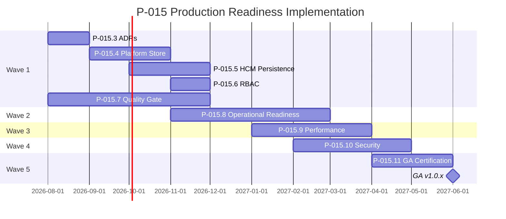

# P-015.2 — Production Readiness Implementation Plan

**Document ID:** PIP-015.2-001  
**Mission:** P-015.2 — Production Readiness Implementation Plan  
**Program:** P-015 — Platform Production Readiness & GA Path  
**Version:** 1.0  
**Status:** Ratified — Execution Roadmap  
**Classification:** Engineering Program Plan · Architecture · Operations  
**Authority:** Chief Enterprise Architect  
**Effective Date:** August 2026  
**Target GA:** 2027 Q2 (v1.0.x)  
**Baseline Release:** v1.0.1-rc1 · CONDITIONAL GO · score **58/100**

**Parent Assessment:** [P-015.1 Production Readiness Assessment](./P-015.1-Enterprise-Production-Readiness-Assessment.md)  
**Baseline Sources:** [Enterprise Architecture Handbook v1.0](./ORION_Enterprise_Architecture_Handbook_v1.0.md) · [Master Roadmap v1.0](./ORION_Enterprise_Platform_Master_Roadmap_v1.0.md) · [PMO Framework](./ORION_Enterprise_PMO_Framework.md) · [Release Policy](../06_Releases/Release-Policy.md) · [ES-096 Testing & Certification](./ES-096-ORION-Enterprise-Testing-Certification-Standards.md) · [v1.0.1-rc1 Certification](../06_Releases/v1.0.1-rc1-Certification.md) · [ES-036 Persistence](../02_Engineering/ES-036-Database-Persistence-Architecture.md)

**Mission ID convention (P-015 program):**

| ID | Mission |
|----|---------|
| **P-015** | Program — Platform Production Readiness |
| **P-015.1** | Production Readiness Assessment ✅ Complete |
| **P-015.2** | Implementation Plan ✅ This document |
| **P-015.3 – P-015.11** | Execution missions (below) |

---

## Executive Summary

This plan converts the [P-015.1 assessment](./P-015.1-Enterprise-Production-Readiness-Assessment.md) (**58/100 · NO-GO for GA**) into a **five-wave engineering program** targeting **GO certification** and **v1.0.x GA** by **2027 Q2**.

### Program Objective

Move ORION from **Release Candidate** to **Enterprise General Availability** by closing all P0 gaps, achieving production persistence and authorization on the HCM reference domain, establishing operational readiness, validating performance and security, and passing Gate 6/7 certification.

### Wave Overview

| Wave | Theme | Period | Readiness Target |
|------|-------|--------|------------------|
| **1** | Critical Infrastructure | 2026 Q3 – Q4 | 68 → 72 |
| **2** | Operational Readiness | 2026 Q4 – 2027 Q1 | 72 → 78 |
| **3** | Performance & Scalability | 2027 Q1 – Q2 | 78 → 83 |
| **4** | Security & Compliance | 2027 Q1 – Q2 | 83 → 88 |
| **5** | GA Certification | 2027 Q2 | **≥ 85 · GO** |

### Critical Path

```
P-015.3 ADRs → P-015.4 Platform Store → P-015.5 HCM Persistence → P-015.6 RBAC
→ P-015.7 Quality Gate → P-015.8 Operations → P-015.9 Performance
→ P-015.10 Security → P-015.11 GA Certification
```

### Executive Decision

| Assessment | Verdict |
|------------|---------|
| **P-015.2 implementation plan** | **GO** — ratified execution roadmap |
| **Wave 1 immediate start** | **GO** — P-015.3 ADRs authorized |
| **GA today** | **NO-GO** — unchanged from P-015.1 |
| **Program execution (P-015.3+)** | **CONDITIONAL GO** — proceed wave-by-wave; each wave exit required before next |

---

## 1. Program Context

### 1.1 Starting Baseline (August 2026)

| Dimension | State |
|-----------|-------|
| Release | v1.0.1-rc1 · tag pushed · `release/v1.0.1` |
| Certification | **CONDITIONAL GO** — architecture certified · production blocked |
| HCM tests | 79/79 domain · 794/800 full suite |
| P0 debt | TD-HCM-001 · TD-HCM-005 · REG-001 |
| Persistence | In-memory across HCM · CRM · Finance · Data Platform · Decisions |
| Authorization | Session middleware · no domain permission matrix |
| Production readiness score | **58/100** |

### 1.2 GA Scope (v1.0.x — Unchanged from P-015.1 §10.3)

**In scope:** ORION Platform core · ORION People (HCM persistent + permissioned) · Executive Experience · ES-090–097 (+ ES-092–095)

**Out of scope:** P-009 Finance Gate 5 · CRM/Finance authoritative data · durable IIL queue (plan only) · SSO · multi-region HA

### 1.3 Program Governance

| Role | Accountability |
|------|----------------|
| **Program Director** | P-015 end-to-end delivery |
| **Chief Enterprise Architect** | ADR approval · ARB · Gate 6 sign-off |
| **Platform Engineering Lead** | Waves 1–3 infrastructure |
| **HCM Domain Lead** | HCM persistence · permission integration |
| **QA / Certification Authority** | Gate 6 · Wave 5 |
| **Founder** | Gate 7 GA approval |

**Hard constraint:** No P-009 Gate 5 or other domain greenfield work until P-015 Wave 5 GO.

---

## 2. Engineering Waves

---

### Wave 1 — Critical Infrastructure

**Period:** August 2026 – December 2026  
**Readiness score target:** 58 → **72**  
**Theme:** Remove P0 blockers · establish persistent platform foundation on HCM

#### Objectives

1. Accept ES-036 implementation ADR and Platform RBAC ADR at ARB  
2. Deliver shared repository abstraction with HCM as first persistent consumer  
3. Enforce domain API fail-closed authentication  
4. Achieve full test suite green and synchronized debt register  

#### Deliverables

| Mission | Deliverable | Owner |
|---------|-------------|-------|
| **P-015.3** | ADR-007 (or successor): Production store selection · migration · rollback | CEA |
| **P-015.3** | ADR-008 (or successor): Platform RBAC model · domain hook contract | CEA |
| **P-015.3** | Gate 4 ES update: ES-036 implementation annex | Platform Eng |
| **P-015.4** | `PlatformStore` / repository adapter interfaces | Platform Eng |
| **P-015.4** | Migration tooling design · seed/data bootstrap strategy | Platform Eng |
| **P-015.5** | HCM persistent repositories (replace `InMemoryHcmStore`) | HCM + Platform |
| **P-015.5** | Restart-survival integration tests | HCM Lead |
| **P-015.6** | Platform permission service + HCM domain hooks | Platform Eng |
| **P-015.6** | Permission integration tests on HCM REST APIs | QA |
| **P-015.7** | API fail-closed — remove `DEFAULT_CONTEXT` on domain REST | Platform Eng |
| **P-015.7** | CRM/Finance doc certification test remediation | Domain Leads |
| **P-015.7** | Central `TECHNICAL_DEBT.md` synchronized (REG-001 closed) | CEA |
| **P-015.7** | CI quality gate extended to `release/v1.0.1` | Eng Lead |

#### Dependencies

| Dependency | Blocks |
|------------|--------|
| ARB acceptance of P-015.3 ADRs | P-015.4 Gate 5 start |
| P-015.4 abstraction stable | P-015.5 HCM migration |
| P-015.6 RBAC ADR | P-015.6 implementation |
| None | P-015.7 test/debt work (parallel from week 1) |

#### Risks

| ID | Risk | Mitigation |
|----|------|------------|
| W1-R1 | Store technology choice delays Wave 1 | Time-box ADR to 2 weeks · evaluate PostgreSQL + SQLite dev adapter |
| W1-R2 | HCM migration breaks 79/79 tests | Parallel in-memory adapter until cutover gate · feature flag |
| W1-R3 | RBAC scope creep | HCM-only permission matrix for v1.0.x GA per P-015.1 scope |

#### Estimated Effort

| Mission | Effort | Duration |
|---------|--------|----------|
| P-015.3 | M | 2–3 weeks |
| P-015.4 | L | 4–6 weeks |
| P-015.5 | L | 4–6 weeks (overlaps P-015.4 tail) |
| P-015.6 | L | 3–5 weeks |
| P-015.7 | M | 2–4 weeks (parallel) |
| **Wave 1 total** | **~16–20 engineer-weeks** | **~16 weeks calendar** |

#### Exit Criteria

| # | Criterion | Evidence |
|---|-----------|----------|
| W1-E1 | ADR-007 + ADR-008 **Accepted** | `docs/11_Governance/ADR/` |
| W1-E2 | HCM data survives process restart | Integration test suite |
| W1-E3 | TD-HCM-001 **Closed** | Debt register |
| W1-E4 | TD-HCM-005 **Closed** on HCM APIs | Permission tests |
| W1-E5 | REG-001 **Closed** | Central TECHNICAL_DEBT.md |
| W1-E6 | Full suite **800/800** green | CI |
| W1-E7 | API fail-closed verified | SEC-002 test |
| W1-E8 | Wave 1 architecture review **PASS** | ARB minutes |

**Wave 1 certification checkpoint:** Internal **CONDITIONAL GO** readiness review — not GA.

---

### Wave 2 — Operational Readiness

**Period:** November 2026 – March 2027  
**Readiness score target:** 72 → **78**  
**Theme:** Enterprise operability · CI/CD · observability · governance completion

#### Objectives

1. Publish deployment, DR, and backup documentation aligned to ES-036 store  
2. Establish logging, monitoring, and alerting standards  
3. Complete durable IIL transport ADR (implementation may follow GA)  
4. Ratify ES-092–095 governance standards  
5. Operational CI/CD path for release branch  

#### Deliverables

| Mission | Deliverable | Owner |
|---------|-------------|-------|
| **P-015.8** | Production deployment runbook + rollback procedure | Platform Eng |
| **P-015.8** | DR/BCP document with RTO/RPO targets | CEA + Ops |
| **P-015.8** | Backup and restore procedure (store-specific) | Platform Eng |
| **P-015.8** | Staging environment definition | CTO + Eng Lead |
| **P-015.8** | Durable IIL transport ADR (P-015.5 scope from PMO) | CEA |
| **P-015.8** | Centralized logging design · correlation ID standard | Platform Eng |
| **P-015.8** | Monitoring/alerting runbook (health + IIL metrics) | Platform Eng |
| **P-015.8** | Secrets manager integration pattern (beyond env vars) | Platform Eng |
| **P-015.8** | ES-092–095 ratification (P-013.4–7 parallel program) | CEA |
| **P-015.8** | Deploy pipeline: build → staging → smoke test | Eng Lead |

#### Dependencies

| Dependency | Blocks |
|------------|--------|
| Wave 1 exit (persistence operational) | Backup/restore validation |
| P-015.3 store ADR | Backup strategy detail |
| Wave 1 CI green | Deploy pipeline confidence |

#### Risks

| ID | Risk | Mitigation |
|----|------|------------|
| W2-R1 | ES-092–095 delays governance Level 2 | Parallel P-013 track · do not block Wave 3 on all four |
| W2-R2 | No staging infra budget | Docker-compose staging minimum viable |
| W2-R3 | DR doc without tested restore | Mandatory restore drill before Wave 5 |

#### Estimated Effort

| Mission | Effort | Duration |
|---------|--------|----------|
| P-015.8 | L | 8–10 weeks |
| **Wave 2 total** | **~10–12 engineer-weeks** | **~12 weeks calendar** (overlaps Wave 1 tail) |

#### Exit Criteria

| # | Criterion | Evidence |
|---|-----------|----------|
| W2-E1 | Deployment + rollback runbook published | `docs/06_Releases/` or ops docs |
| W2-E2 | DR/BCP with RTO/RPO documented | Ops doc |
| W2-E3 | Backup procedure documented | Ops doc |
| W2-E4 | Restore drill executed successfully | Drill log |
| W2-E5 | Logging + monitoring runbooks published | Ops doc |
| W2-E6 | Durable IIL ADR **Accepted** (plan sufficient for GA) | ADR index |
| W2-E7 | ES-092–095 **Ratified** | Governance index |
| W2-E8 | Staging deploy + smoke test green | CI/deploy log |
| W2-E9 | CI/CD pipeline operational on release branch | CI config |

---

### Wave 3 — Performance & Scalability

**Period:** January 2027 – April 2027  
**Readiness score target:** 78 → **83**  
**Theme:** Validate production posture under load · extend persistence pattern · staging RC

#### Objectives

1. Define and execute HCM API performance benchmarks  
2. Deploy release candidate to staging and validate  
3. Replicate persistence pattern to Decision repository (platform scope)  
4. Document horizontal scalability constraints and path  
5. Resolve TD-003 intelligence path ADR (plan acceptable for GA)  

#### Deliverables

| Mission | Deliverable | Owner |
|---------|-------------|-------|
| **P-015.9** | HCM API performance benchmark harness + budgets | Platform Eng |
| **P-015.9** | Load test report (foundation + time APIs) | QA + Platform |
| **P-015.9** | Staging RC deployment (post-Wave 1 persistence) | Eng Lead |
| **P-015.9** | Post-deploy smoke test suite (health + HCM CRUD) | QA |
| **P-015.9** | Decision repository persistence (TD-005) | Platform Eng |
| **P-015.9** | Scalability ADR: single-node GA · horizontal path documented | CEA |
| **P-015.9** | TD-003 intelligence unification ADR | CEA |
| **P-015.9** | ReadinessAssessmentService wired to live CI gate results | Platform Eng |

#### Dependencies

| Dependency | Blocks |
|------------|--------|
| Wave 1 exit | Performance tests on persistent store |
| Wave 2 staging | Staging RC deploy |
| Wave 2 backup/DR | Load test data safety |

#### Risks

| ID | Risk | Mitigation |
|----|------|------------|
| W3-R1 | Performance regressions from persistence layer | Baseline before/after · index tuning in ADR |
| W3-R2 | Staging environment drift from prod | Infrastructure-as-code or documented parity checklist |
| W3-R3 | Scope creep into CRM persistence | Defer TD-002 to post-GA · document limitation |

#### Estimated Effort

| Mission | Effort | Duration |
|---------|--------|----------|
| P-015.9 | L | 6–8 weeks |
| **Wave 3 total** | **~8–10 engineer-weeks** | **~8 weeks calendar** |

#### Exit Criteria

| # | Criterion | Evidence |
|---|-----------|----------|
| W3-E1 | HCM API p95 response within documented budgets | Benchmark report |
| W3-E2 | Staging RC deployed and smoke tests pass | Deploy + test log |
| W3-E3 | TD-005 **Closed** (Decision persistence) | Debt register |
| W3-E4 | Scalability ADR **Accepted** | ADR index |
| W3-E5 | TD-003 ADR **Accepted** (plan) | ADR index |
| W3-E6 | Engineering health score refresh **≥ 80** | S-001.2 audit |
| W3-E7 | No P0/P1 debt without owner + target | Debt audit |

---

### Wave 4 — Security & Compliance

**Period:** February 2027 – May 2027  
**Readiness score target:** 83 → **88**  
**Theme:** Security validation · audit trail · compliance readiness for GA

#### Objectives

1. Complete pre-GA security review and remediation  
2. Harden immutable audit trail for HCM domain mutations  
3. Validate identity and authorization under adversarial test cases  
4. Align with ES-059 zero-trust direction (documented gap acceptance where needed)  
5. Confirm compliance platform hooks for GA scope  

#### Deliverables

| Mission | Deliverable | Owner |
|---------|-------------|-------|
| **P-015.10** | Pre-GA security assessment report | Security Architect |
| **P-015.10** | Penetration test or structured security review | External or Security Architect |
| **P-015.10** | HCM mutation audit trail hardening | Platform Eng |
| **P-015.10** | Authorization adversarial test suite (permission bypass attempts) | QA |
| **P-015.10** | Session security validation (secret rotation procedure) | Platform Eng |
| **P-015.10** | ES-093 API security standards alignment checklist | CEA |
| **P-015.10** | Compliance platform integration verification (audit events) | Platform Eng |
| **P-015.10** | Security remediation backlog — all Critical/High closed | Eng Lead |

#### Dependencies

| Dependency | Blocks |
|------------|--------|
| Wave 1 RBAC | Authorization testing |
| Wave 1 persistence | Audit trail at store level |
| Wave 2 secrets pattern | Secret rotation validation |

#### Risks

| ID | Risk | Mitigation |
|----|------|------------|
| W4-R1 | Pen test finds Critical issues late | Start review at Wave 3 mid-point |
| W4-R2 | SSO gap flagged as blocker | Document explicit GA limitation per P-015.1 |
| W4-R3 | Audit trail incomplete | Scope to HCM mutations for v1.0.x GA |

#### Estimated Effort

| Mission | Effort | Duration |
|---------|--------|----------|
| P-015.10 | M | 4–6 weeks |
| **Wave 4 total** | **~6–8 engineer-weeks** | **~6 weeks calendar** (overlaps Wave 3) |

#### Exit Criteria

| # | Criterion | Evidence |
|---|-----------|----------|
| W4-E1 | Security assessment complete · no open Critical findings | Security report |
| W4-E2 | Pen test / structured review complete · High remediated | Report + fixes |
| W4-E3 | HCM audit trail verified for CRUD mutations | Test evidence |
| W4-E4 | Authorization adversarial tests pass | QA report |
| W4-E5 | Security readiness score **≥ 85** | P-015.1 layer re-score |
| W4-E6 | SEC-001 through SEC-004 gaps **Closed** | Gap matrix |

---

### Wave 5 — GA Certification

**Period:** April 2027 – June 2027  
**Readiness score target:** **≥ 85 · GO**  
**Theme:** Feature freeze · Gate 6 GO · Gate 7 · v1.0.x tag · program closure

#### Objectives

1. Execute full regression on frozen RC scope  
2. Achieve Gate 6 **GO** certification  
3. Obtain Gate 7 Founder approval  
4. Tag v1.0.x GA and update architecture baseline  
5. Close P-015 program with retrospective  

#### Deliverables

| Mission | Deliverable | Owner |
|---------|-------------|-------|
| **P-015.11** | v1.0.x RC feature freeze declaration | Chief Architect |
| **P-015.11** | Full regression — 800/800 tests · four validation gates | CI + QA |
| **P-015.11** | Gate 6 certification report — **GO** | Chief Architect + QA |
| **P-015.11** | v1.0 GA architecture baseline update | CEA |
| **P-015.11** | Release notes · changelog · certification · RR-xxx | PMO |
| **P-015.11** | Gate 7 GA approval | Founder + Chief Architect |
| **P-015.11** | Git tag `v1.0.x` (no suffix) | Eng Lead |
| **P-015.11** | Portfolio + Master Roadmap status update | CEA |
| **P-015.11** | P-015 program retrospective | Program Director |
| **P-015.11** | Enterprise Platform v2 milestone declaration | Executive |

#### Dependencies

| Dependency | Blocks |
|------------|--------|
| Wave 1–4 exit criteria | Wave 5 start |
| All G1–G12 (below) | Gate 6 GO |
| Gate 6 GO | Gate 7 |

#### Risks

| ID | Risk | Mitigation |
|----|------|------------|
| W5-R1 | Last-minute regression failures | Wave 3 staging continuous regression |
| W5-R2 | Founder Gate 7 delay | Pre-brief at Wave 4 completion |
| W5-R3 | Scope creep into v1.0.x GA | Change control — defer to v1.1.0 |

#### Estimated Effort

| Mission | Effort | Duration |
|---------|--------|----------|
| P-015.11 | M | 4–6 weeks |
| **Wave 5 total** | **~4–6 engineer-weeks** | **~6 weeks calendar** |

#### Exit Criteria

| # | Criterion | Evidence |
|---|-----------|----------|
| W5-E1 | Gate 6 **GO** | [Certification report](../06_Releases/) |
| W5-E2 | Gate 7 approval | Signed release record |
| W5-E3 | Tag `v1.0.x` GA | Git + RELEASE_HISTORY |
| W5-E4 | Production readiness score **≥ 85** | Re-assessment |
| W5-E5 | Zero open P0 debt | TECHNICAL_DEBT.md |
| W5-E6 | P-015 program **Closed** | Retrospective filed |
| W5-E7 | `hcmFacade.getDomainStatus().readyForEnterpriseHcmCertification: true` | HCM facade |

---

## 3. Implementation Timeline



### 3.1 Mission Schedule

| Mission | Title | Wave | Start | Target Complete | Gate |
|---------|-------|------|-------|-----------------|------|
| **P-015.3** | Production ADRs (Persistence + RBAC) | 1 | 2026-08 | 2026-09 | ARB Gate 4 |
| **P-015.4** | Platform Store Abstraction | 1 | 2026-09 | 2026-11 | Gate 5 |
| **P-015.5** | HCM Persistent Implementation | 1 | 2026-10 | 2026-12 | Gate 5 |
| **P-015.6** | Platform RBAC Implementation | 1 | 2026-11 | 2026-12 | Gate 5 |
| **P-015.7** | Quality Gate & Debt Sync | 1 | 2026-08 | 2026-12 | Validation |
| **P-015.8** | Operational Readiness | 2 | 2026-11 | 2027-03 | Gate 4 docs |
| **P-015.9** | Performance & Scalability | 3 | 2027-01 | 2027-04 | Gate 5/6 prep |
| **P-015.10** | Security & Compliance | 4 | 2027-02 | 2027-05 | Security sign-off |
| **P-015.11** | GA Certification & Release | 5 | 2027-04 | 2027-06 | Gate 6 + 7 |

### 3.2 Engineering Milestones

| Milestone | Target | Wave | Success Indicator |
|-----------|--------|------|-------------------|
| **M1** ADRs Accepted | 2026-09 | 1 | ARB sign-off |
| **M2** Platform Store MVP | 2026-10 | 1 | Unit tests pass |
| **M3** HCM Restart Survival | 2026-12 | 1 | Integration tests |
| **M4** 800/800 Tests Green | 2026-12 | 1 | CI |
| **M5** Ops Runbooks Published | 2027-02 | 2 | Docs merged |
| **M6** Staging RC Live | 2027-03 | 3 | Smoke tests |
| **M7** Security Sign-off | 2027-05 | 4 | No Critical open |
| **M8** Gate 6 GO | 2027-05 | 5 | Certification report |
| **M9** v1.0.x GA Tag | 2027-06 | 5 | Gate 7 |
| **M10** Enterprise Platform v2 | 2027-06 | 5 | Portfolio update |

### 3.3 Certification Checkpoints

| Checkpoint | When | Type | Decision |
|------------|------|------|----------|
| **CP-0** Baseline | 2026-08 | Assessment | P-015.1 CONDITIONAL GO (complete) |
| **CP-1** Wave 1 Review | 2026-12 | Internal | CONDITIONAL GO → proceed Wave 2 |
| **CP-2** Staging RC | 2027-03 | Pre-cert | CONDITIONAL GO acceptable |
| **CP-3** Security Review | 2027-05 | Pre-GA | Must pass for Wave 5 |
| **CP-4** Gate 6 | 2027-05 | Formal | **GO required** |
| **CP-5** Gate 7 | 2027-06 | Formal | **GO required for tag** |

### 3.4 Architecture Review Gates

| Review | Trigger | Authority | Wave |
|--------|---------|-----------|------|
| ARB-015.3 | P-015.3 ADR submission | ARB | 1 |
| ARB-015.4 | Platform Store ES / pre-implementation | ARB | 1 |
| ARB-015.5 | HCM persistence cutover plan | ARB | 1 |
| ARB-015.8 | DR + IIL ADRs | ARB | 2 |
| ARB-015.9 | Scalability + TD-003 ADRs | ARB | 3 |
| ARB-015.10 | Security assessment findings | ARB | 4 |
| ARB-015.11 | Pre-GA architecture baseline | ARB | 5 |

### 3.5 Release Gates

| Gate | Wave | Requirement | Policy Reference |
|------|------|-------------|------------------|
| **Gate 4** | 1 | ES-036 annex + RBAC ES approved before code | G-001 |
| **Gate 5** | 1–3 | Implementation complete · four validation gates | ES-091 |
| **Gate 6** | 5 | **GO** · zero P0 · 800/800 | ES-096 |
| **Gate 7** | 5 | Founder + Chief Architect GA approval | Release Policy |
| **RC freeze** | 5 | P0 fixes only | Release Policy |
| **GA tag** | 5 | Semver `v1.0.x` no suffix | Release Policy |

---

## 4. Success Metrics

Targets tracked at each wave exit and at GA. Baseline from [P-015.1 §2](./P-015.1-Enterprise-Production-Readiness-Assessment.md#2-production-readiness-score--detail).

### 4.1 Production Readiness Score

| Wave | Target Score | Primary Drivers |
|------|--------------|-----------------|
| Baseline | 58 | P-015.1 assessment |
| Wave 1 | 72 | Persistence + RBAC + tests |
| Wave 2 | 78 | Ops docs + CI/CD + ES-092–095 |
| Wave 3 | 83 | Performance + staging |
| Wave 4 | 88 | Security validation |
| **GA (Wave 5)** | **≥ 85** | All layers |

### 4.2 Architecture Health

| Metric | Baseline | Wave 1 | GA Target | Source |
|--------|----------|--------|-----------|--------|
| Engineering health score | 68–75 | ≥ 78 | **≥ 85** | S-001.x audit |
| Architecture consistency | 80% | ≥ 85% | **≥ 90%** | Certification |
| Facade violations | 0 | 0 | 0 | Arch tests |
| Open ADRs > 30 days | TBD | 0 blocking | 0 blocking | ADR index |
| Reuse Index | ~40% | ≥ 55% | **≥ 70%** | Portfolio Framework |

### 4.3 Test Completion

| Metric | Baseline | Wave 1 | GA Target |
|--------|----------|--------|-----------|
| Full suite pass rate | 794/800 | **800/800** | 800/800 |
| HCM domain tests | 79/79 | 79/79+ | 79/79+ |
| Permission tests | 0 | Full HCM API | Full HCM API |
| Persistence restart tests | 0 | Pass | Pass |
| Four validation gates | Pass (HCM) | Pass (full) | Pass (full) |
| Adversarial auth tests | — | — | Pass (Wave 4) |

### 4.4 Security Completion

| Metric | Baseline | Wave 1 | Wave 4 | GA Target |
|--------|----------|--------|--------|-----------|
| Security layer score | 48 | ≥ 65 | ≥ 85 | **≥ 85** |
| Domain RBAC enforced | No | HCM APIs | HCM APIs | HCM APIs |
| API fail-closed | No | Yes | Yes | Yes |
| Pen test Critical open | — | — | 0 | 0 |
| Audit trail (HCM) | Partial | Partial | Complete | Complete |

### 4.5 Documentation Completion

| Metric | Baseline | Wave 2 | GA Target |
|--------|----------|--------|-----------|
| ES-090–097 ratified | 4/8 gaps (092–095) | **8/8** | 8/8 |
| Ops runbooks | 0 | Published | Published |
| DR/BCP | 0 | Published | Published |
| ADR index current | Partial | Complete | Complete |
| Release artifacts | RC complete | Staging docs | GA complete |

### 4.6 Deployment Readiness

| Metric | Baseline | Wave 2 | Wave 3 | GA Target |
|--------|----------|--------|--------|-----------|
| Deployment readiness score | 50 | ≥ 70 | ≥ 80 | **≥ 85** |
| CI on release branch | Partial | Yes | Yes | Yes |
| Staging validated | No | Defined | **Deployed** | Deployed |
| Rollback tested | No | Documented | **Tested** | Tested |
| Restore drill | No | — | **Executed** | Executed |

---

## 5. GA Exit Criteria

Consolidated from [P-015.1 §10](./P-015.1-Enterprise-Production-Readiness-Assessment.md#10-ga-exit-criteria), user mission requirements, and [ES-096](./ES-096-ORION-Enterprise-Testing-Certification-Standards.md).

### 5.1 Mandatory — All Required (NO-GO if Any Fail)

| # | Criterion | Wave | Mission |
|---|-----------|------|---------|
| **G1** | All critical (P0) technical debt resolved | 1 | P-015.7 |
| **G2** | Production persistence operational (HCM) | 1 | P-015.5 |
| **G3** | Identity & authorization operational (session + domain RBAC) | 1 | P-015.6 |
| **G4** | Monitoring & logging operational (runbooks + health endpoints) | 2 | P-015.8 |
| **G5** | CI/CD operational (release branch + staging pipeline) | 2 | P-015.8 |
| **G6** | Disaster recovery documented (RTO/RPO + restore drill) | 2–3 | P-015.8 · P-015.9 |
| **G7** | Performance validated (benchmark report within budgets) | 3 | P-015.9 |
| **G8** | Security validated (assessment + no Critical open) | 4 | P-015.10 |
| **G9** | Full test suite green (800/800) | 1 | P-015.7 |
| **G10** | Four validation gates pass | 1–5 | All |
| **G11** | API fail-closed on domain REST | 1 | P-015.7 |
| **G12** | ES-036 implementation ADR accepted and implemented | 1 | P-015.3 · P-015.5 |
| **G13** | Central debt register synchronized | 1 | P-015.7 |
| **G14** | Certification **GO** (Gate 6) | 5 | P-015.11 |
| **G15** | Release approval (Gate 7) | 5 | P-015.11 |
| **G16** | Production readiness score **≥ 85** | 5 | P-015.11 |
| **G17** | Release artifacts complete | 5 | P-015.11 |
| **G18** | Architecture baseline v1.0 GA published | 5 | P-015.11 |

### 5.2 Strongly Required (GA Not Permitted Until Met — Release Policy)

| # | Criterion | Wave |
|---|-----------|------|
| S1 | Deployment + rollback runbook | 2 |
| S2 | Backup strategy documented and tested | 2–3 |
| S3 | ES-092–095 ratified | 2 |
| S4 | Engineering health score ≥ 85 | 5 |
| S5 | Staging RC validated before GA tag | 3 |
| S6 | `readyForEnterpriseHcmCertification: true` | 5 |

### 5.3 GA Decision Matrix

| State | Decision |
|-------|----------|
| All G1–G18 + S1–S6 met | **GO — GA approved** |
| Any G criterion unmet | **NO-GO** |
| G met · S partially met | **NO-GO** — Release Policy requires full strong requirements |
| Current (August 2026) | **NO-GO** — 0/18 mandatory criteria met |

---

## 6. Risk Register

Program-level risk register for P-015. Updated weekly per [PMO Framework §9](./ORION_Enterprise_PMO_Framework.md#9-risk-management).

| ID | Risk | Category | P×I | Wave | Mitigation | Owner | Status |
|----|------|----------|-----|------|------------|-------|--------|
| **R-015-001** | Store ADR delays block all Wave 1 implementation | Technical | H×H | 1 | 2-week time-box · PostgreSQL default candidate | CEA | Open |
| **R-015-002** | HCM persistence migration breaks certified behavior | Technical | M×H | 1 | Parallel adapters · incremental cutover · 79/79 gate | HCM Lead | Open |
| **R-015-003** | RBAC scope expands beyond GA timeline | Schedule | M×M | 1 | HCM-only matrix · defer CRM enforcement | Platform Eng | Open |
| **R-015-004** | CRM/Finance doc tests harder than estimated | Schedule | M×M | 1 | Dedicated domain lead sprint · P-015.7 priority | Eng Lead | Open |
| **R-015-005** | No staging environment delays Wave 3 | Resource | M×H | 2–3 | Docker-compose minimum · cloud budget request | CTO | Open |
| **R-015-006** | ES-092–095 not ratified by Wave 2 exit | Governance | M×M | 2 | Parallel P-013 program · executive escalation | CEA | Open |
| **R-015-007** | Late security Critical findings | Security | L×H | 4–5 | Early Wave 3 security review | Security Architect | Open |
| **R-015-008** | Team capacity split with P-009 Gates 1–4 | Resource | M×M | All | PMO Gate 5 block on P-009 · architecture only | Program Director | Open |
| **R-015-009** | Restore drill fails | Operational | L×H | 2–3 | Test early after Wave 1 · iterate backup procedure | Platform Eng | Open |
| **R-015-010** | Founder Gate 7 not granted | Commercial | L×H | 5 | Executive brief at Wave 4 · design partner narrative | Program Director | Open |

**Escalation:** Critical impact → ARB within 24h · Schedule slip > 2 weeks → Executive Portfolio Review.

---

## 7. Output Summary

### Implementation Plan

Five waves · nine execution missions (P-015.3–P-015.11) · August 2026 – June 2027 · targets v1.0.x GA and Enterprise Platform v2 milestone.

### Engineering Waves

| Wave | Focus | Key Missions |
|------|-------|--------------|
| 1 | Critical Infrastructure | P-015.3 – P-015.7 |
| 2 | Operational Readiness | P-015.8 |
| 3 | Performance & Scalability | P-015.9 |
| 4 | Security & Compliance | P-015.10 |
| 5 | GA Certification | P-015.11 |

### Timeline

| Milestone | Date |
|-----------|------|
| Wave 1 complete | 2026-12 |
| Wave 2 complete | 2027-03 |
| Wave 3 complete | 2027-04 |
| Wave 4 complete | 2027-05 |
| **GA v1.0.x** | **2027-06** |

### Risk Register

10 program risks identified · owners assigned · mitigations defined in §6.

### GA Exit Criteria

18 mandatory (G1–G18) · 6 strongly required (S1–S6) · explicit GA scope per P-015.1 §10.3.

---

## 8. Certification — P-015.2 Implementation Plan Mission

| Criterion | Result |
|-----------|--------|
| P-015.1 assessment converted to structured program | ✅ Pass |
| Five engineering waves with objectives · deliverables · dependencies · risks · effort · exit criteria | ✅ Pass |
| Implementation timeline with mission IDs · milestones · cert checkpoints · ARB · release gates | ✅ Pass |
| Success metrics defined (6 dimensions) | ✅ Pass |
| GA exit criteria aligned with P-015.1 · ES-096 · Release Policy · user mission | ✅ Pass |
| Risk register with 10 program risks | ✅ Pass |
| Evidence-based · architecture-first · enterprise-focused | ✅ Pass |
| No production code changes | ✅ Pass |

### Executive Decisions

| Decision Area | Verdict | Notes |
|---------------|---------|-------|
| **P-015.2 implementation plan** | **GO** | Ratified execution roadmap for P-015 |
| **Wave 1 start (P-015.3 ADRs)** | **GO** | Authorize immediately |
| **GA today** | **NO-GO** | Unchanged · 58/100 |
| **Full program to GA** | **CONDITIONAL GO** | Achievable if wave exits enforced · R-015-001 managed |
| **P-009 Gate 5 during P-015** | **NO-GO** | Architecture-only P-009 continues |

### Immediate Next Actions

1. **Assign Program Director** for P-015 if not already assigned  
2. **Schedule ARB** for P-015.3 within 2 weeks (persistence + RBAC ADRs)  
3. **Promote TD-HCM-001 · TD-HCM-005 · REG-001 to P0** in central register (P-015.7)  
4. **Begin P-015.7** test remediation and debt sync in parallel with P-015.3  
5. **Publish Wave 1 weekly status** per PMO Framework §7.1  

---

## Appendix A — Gap-to-Mission Traceability

| P-015.1 Gap ID | Mission | Wave |
|----------------|---------|------|
| TD-HCM-001 · INF-001 · AG-003 | P-015.3 · P-015.4 · P-015.5 | 1 |
| TD-HCM-005 · SEC-001 · INF-004 | P-015.3 · P-015.6 | 1 |
| SEC-002 · TD-PLATFORM-002 | P-015.7 | 1 |
| TD-PLATFORM-001 | P-015.7 | 1 |
| REG-001 | P-015.7 | 1 |
| DEP-002 · INF-014 | P-015.7 · P-015.8 | 1–2 |
| INF-011 · INF-012 · OPS-001–003 | P-015.8 | 2 |
| AG-002 · TD-PLATFORM-003 | P-015.8 | 2 |
| TD-PLATFORM-004 · AG-006 | P-015.8 | 2 |
| INF-016 · TD-005 · AG-005 | P-015.9 | 3 |
| SEC-004 · SEC-006 · INF-010 | P-015.10 | 4 |
| Gate 6 · Gate 7 · G1–G18 | P-015.11 | 5 |

---

## Appendix B — Cross-Reference Index

| Topic | Document |
|-------|----------|
| Gap analysis | [P-015.1 Assessment](./P-015.1-Enterprise-Production-Readiness-Assessment.md) |
| Master Roadmap | [ORION_Enterprise_Platform_Master_Roadmap_v1.0.md](./ORION_Enterprise_Platform_Master_Roadmap_v1.0.md) |
| PMO execution | [ORION_Enterprise_PMO_Framework.md](./ORION_Enterprise_PMO_Framework.md) |
| Persistence spec | [ES-036](../02_Engineering/ES-036-Database-Persistence-Architecture.md) |
| Certification standards | [ES-096](./ES-096-ORION-Enterprise-Testing-Certification-Standards.md) |
| Release policy | [Release-Policy.md](../06_Releases/Release-Policy.md) |
| HCM RC1 cert | [v1.0.1-rc1-Certification.md](../06_Releases/v1.0.1-rc1-Certification.md) |
| Handbook | [ORION_Enterprise_Architecture_Handbook_v1.0.md](./ORION_Enterprise_Architecture_Handbook_v1.0.md) |

---

*ORION Enterprise Platform · P-015.2 Production Readiness Implementation Plan v1.0 · August 2026*
