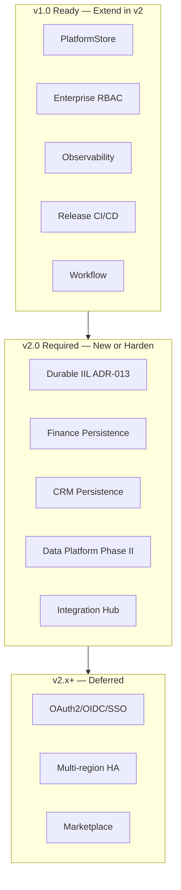
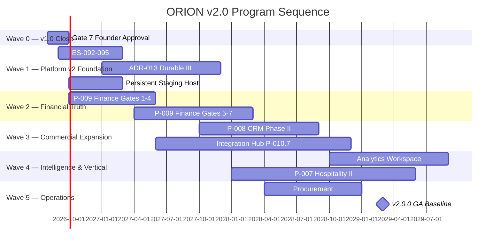

# P-016.1 — ORION v2.0 Strategic Planning

**Document ID:** P-016.1-STRAT-001  
**Program:** P-016 — ORION Enterprise Platform v2.0 Strategic Planning  
**Mission:** P-016.1 — v2.0 Strategic Planning Launch  
**Version:** 1.0  
**Status:** Ratified — Strategic Planning Document  
**Classification:** Executive Strategy · Architecture Planning · Governance  
**Authority:** Chief Enterprise Architect · Program Director  
**Planning Date:** 2 August 2026  
**Planning Horizon:** 2026 H2 – 2029 (v2.0 GA target)  
**Development Branch:** `develop/v2.0` (from `release/v1.0.1` @ `12af9c4`)  
**Architecture Baseline:** v1.0 GA Candidate → v2.0 Multi-Domain Baseline (planned)

**Baseline Inputs:** [P-014.1 Enterprise Platform Strategy](./ORION_Enterprise_Platform_Strategy_v1.0.md) · [Master Roadmap v1.0](./ORION_Enterprise_Platform_Master_Roadmap_v1.0.md) · [P-015.11 GA Certification](../00_Governance/P-015.11-General-Availability-Certification-Report.md) · [GA-001 Sprint Report](../06_Releases/GA-Readiness-Sprint-Report.md) · [GA Workflow Execution Report](../06_Releases/GA-Workflow-Execution-Report.md) · [Architecture Handbook v1.0](./ORION_Enterprise_Architecture_Handbook_v1.0.md) · [ES-097 ADR Policy](./ES-097-ORION-Architecture-Governance-ADR-Policy.md) · [Technical Debt Register](../11_Governance/TECHNICAL_DEBT.md)

---

## 1. Executive Summary

Mission P-016.1 launches strategic planning for **ORION Enterprise Platform v2.0** — the multi-domain authoritative baseline that transforms ORION from a **single reference-domain GA platform (HCM)** into an **Executive Operating System with financial truth, commercial intelligence, and durable cross-domain event integration**.

### v1.0 Exit State (Planning Baseline)

The P-015 Production Readiness Program delivered the v1.0 engineering foundation:

| Achievement | Evidence |
|-------------|----------|
| PlatformStore + PostgreSQL persistence | ADR-007 · `lib/platform/store/` · CI PostgreSQL certification |
| Enterprise RBAC (HCM) | ADR-008/009 · 38 HCM routes · fail-closed verified |
| Operational readiness framework | P-015.8 · runbooks · backup/DR · health endpoints |
| Release branch CI | `quality-gate.yml` · `ga-staging-certification.yml` — both green |
| Production readiness | **87/100** (GA-001 re-certification) |
| Test suite | **930/930** pass |

**v1.0 GA tag status:** Engineering ready · **Gate 7 Founder approval pending** · existing `v1.0.0` tag points to legacy advisor commit — requires executive retag decision.

### v2.0 Strategic Intent

| Dimension | v1.0 (Current) | v2.0 (Target) |
|-----------|----------------|---------------|
| **Scope** | Platform core + HCM reference domain | Multi-domain authoritative platform |
| **Persistence** | HCM on PostgreSQL | Finance + CRM on PlatformStore pattern |
| **Events** | In-process IIL | Durable IIL transport + cross-domain chains |
| **Intelligence** | Brief + assistive AI | Authoritative Finance/HCM/CRM signals |
| **Commercial** | HCM design partner | HCM + Finance + CRM bundle credibility |
| **Architecture baseline** | v1.0 GA | **v2.0 Multi-Domain Baseline** (2028–2029) |

### Executive Recommendation

| Decision | Verdict |
|----------|---------|
| **P-016.1 strategic planning mission** | **GO** |
| **Launch P-016 v2.0 program series** | **GO** |
| **Begin v2.0 implementation immediately** | **NO-GO** — complete v1.0 Gate 7 · ratify v2.0 charter first |
| **Overall v2.0 direction** | **CONDITIONAL GO** — proceed planning and architecture waves; Gate 5 domain work after v1.0 commercial closure |

**Recommended immediate action:** Ratify this plan · complete v1.0 Gate 7 · execute **P-016.2 v2.0 Architecture Charter** · parallel **ES-092–095** ratification · begin **P-009 Finance Gates 1–4** architecture only.

---

## 2. Platform Assessment

Scores reflect post-P-015 / GA-001 / GA-002.4 state (August 2026). Scale: 1–5 maturity · percentage where noted.

### 2.1 Current Platform Maturity

| Layer | v1.0 RC (P-014.1) | v1.0 GA Candidate (P-016.1) | v2.0 Target |
|-------|-------------------|----------------------------|-------------|
| **Overall platform maturity** | 3.4 / 5.0 | **4.1 / 5.0** | 4.6 / 5.0 |
| Executive Experience | 4.0 | 4.0 | 4.5 |
| Enterprise Domains | 4.0 (HCM only) | **4.2 (HCM persistent)** | 4.5 (HCM + Finance + CRM) |
| Persistence / Security | 2.0 | **4.0** | 4.5 |
| Event / Workflow | 3.5 | 3.5 | 4.5 |
| Governance | 4.0 | 4.2 | 4.8 |
| Operations / Release | 2.5 | **4.3** | 4.5 |
| Commercial readiness | 2.5 | **3.5** | 4.5 |

**Production Readiness Score:** 87/100 (GA-001) · Architecture Health: 90/100 · Security Health: 87/100 · Operations Health: 84/100

### 2.2 Reusable Platform Services Assessment

| Service | Maturity | v1.0 State | v2.0 Requirement | Gap |
|---------|----------|------------|------------------|-----|
| **PlatformStore** | **Strong** | HCM PostgreSQL certified in CI | All authoritative domains | Finance/CRM persister modules |
| **RBAC** | **Strong (HCM)** | Fail-closed · org isolation · 38 routes | All domain APIs | Finance/CRM permission catalogs |
| **Identity & Organization** | Strong | Multi-tenant ServiceContext | Unchanged | OAuth2/OIDC post-v2.0 |
| **IIL Event Platform** | Functional | In-process · events lost on crash | Durable transport | **TD-PLATFORM-003** — ADR-013 |
| **Workflow Platform** | Functional | HCM triggers integrated | Finance/CRM approval flows | Domain workflow bindings |
| **Data Platform (P-011)** | Alpha | Phase I registry | Phase II reference data consumption | Master data across domains |
| **Observability** | **Strong** | 6 health endpoints · structured logging · ops framework | Production APM · multi-region | Persistent staging host · APM adapter |
| **Release Process** | **Strong** | Quality gate · release branch CI · GA staging cert | v2.0 baseline tagging · develop branch governance | Gate 7 · v2.0 release policy extension |
| **Integration Hub** | Planned | Basic connectors | ERP/PMS connectors | P-010.7 program |
| **Search / Memory / Notifications** | Functional | Platform modules exist | Cross-domain intelligence feed | Analytics projections |

### 2.3 Shared Infrastructure Readiness for v2.0



---

## 3. Product Portfolio Review

Five product lines evaluated per P-016.1 scope. ORION People (HCM) is the v1.0 reference domain — included for context but not re-prioritized as a new v2.0 build.

### 3.1 ORION Finance

| Field | Assessment |
|-------|------------|
| **Purpose** | Authoritative financial truth — GL, AR/AP, cash, financial intelligence from cross-domain IIL events |
| **Business value** | **Highest** — completes Executive OS narrative · every enterprise requires financial intelligence · unlocks Operations and Procurement |
| **Dependencies** | PlatformStore · RBAC · durable IIL (soft) · HCM workforce cost events · CRM revenue events (future) |
| **Estimated effort** | **Large** — 12–18 months Gate 5–7 (P-009) · aligns with Master Roadmap Year 2 |
| **Architectural readiness** | **4/5** — D-007/D-008/D-009 blueprints · ES-FIN-001 draft · workspace UI exists · Gate 5 not started |
| **Commercial readiness** | **2/5** — placeholder data today · no authoritative ledger |
| **Recommended priority** | **P1 — First v2.0 domain program** |

**v2.0 role:** Primary domain expansion · first non-HCM authoritative persistence consumer · Executive Brief financial signal source.

---

### 3.2 ORION Customer (CRM)

| Field | Assessment |
|-------|------------|
| **Purpose** | Commercial relationships — accounts, pipeline, customer intelligence, revenue event publishing |
| **Business value** | **High** — largest existing workspace surface · sales pipeline intelligence · design partner bundle enabler |
| **Dependencies** | PlatformStore · RBAC · Finance (revenue recognition chain) · IIL event catalogue |
| **Estimated effort** | **Medium–Large** — 9–12 months P-008 Phase II · facade/repository convergence |
| **Architectural readiness** | **4/5** — P-008.8 CONDITIONAL GO · pre-handbook patterns · needs HCM reference convergence |
| **Commercial readiness** | **3/5** — certified workspace · not enterprise-persistent |
| **Recommended priority** | **P2 — Second v2.0 domain program** |

**v2.0 role:** Enterprise elevation · opportunity → Finance event chain · CRM persistence via PlatformStore.

---

### 3.3 ORION Hospitality

| Field | Assessment |
|-------|------------|
| **Purpose** | Property and guest operations — reservations, folio, billing, revenue for hotel operators |
| **Business value** | **Medium–High (vertical)** — design partner accelerator · PMS integration partnerships · not primary enterprise sequence driver |
| **Dependencies** | Finance (folio → ledger) · Customer (guest as party, optional) · Integration Hub (PMS) |
| **Estimated effort** | **Medium** — P-007 Phase II parallel track · 2028–2029 |
| **Architectural readiness** | **4/5** — P-007.8 CONDITIONAL GO · functional workspace |
| **Commercial readiness** | **3/5** — vertical pilot ready post-v1.0 GA |
| **Recommended priority** | **P4 — Parallel vertical track** (not sequence-critical) |

**v2.0 role:** Vertical depth after Finance foundation · folio → Finance events · PMS connector pilots.

---

### 3.4 ORION Operations

| Field | Assessment |
|-------|------------|
| **Purpose** | Supply chain execution — procurement, inventory, supply chain orchestration, operational health |
| **Business value** | **High (long-term)** — mid-market ERP completeness · operational cost intelligence |
| **Dependencies** | **Finance (hard)** — sub-ledgers · cost posting · Procurement before Inventory |
| **Estimated effort** | **Large** — Procurement 2028 H1 · Inventory 2028 H2–2029 · framework only today |
| **Architectural readiness** | **2/5** — ES-058 approved · domains not started |
| **Commercial readiness** | **1/5** — no product surface |
| **Recommended priority** | **P5 — Year 3 v2.x program** |

**v2.0 role:** Deferred to v2.1/v2.2 unless design partner demands procurement earlier.

---

### 3.5 ORION Intelligence

| Field | Assessment |
|-------|------------|
| **Purpose** | Executive intelligence — Brief, analytics, governed AI, cross-domain explainability |
| **Business value** | **Highest (differentiation)** — primary competitive moat vs dashboards · executive retention |
| **Dependencies** | **All authoritative domains** — Finance + HCM + CRM IIL events · durable transport · analytics projections |
| **Estimated effort** | **Medium (incremental)** — Brief enhancement 2027 · Analytics workspace 2028 H2–2029 |
| **Architectural readiness** | **3.5/5** — provider framework · dual pipeline debt · no analytics workspace |
| **Commercial readiness** | **3.5/5** — Brief delivered · signals not yet authoritative |
| **Recommended priority** | **P3 — Platform capability track** (parallel, not competing with Finance Gate 5) |

**v2.0 role:** Consume authoritative domain events · unify intelligence pipeline · analytics read models — **not a greenfield domain build**.

---

## 4. Priority Matrix

### 4.1 Weighted Scoring Model

Derived from [P-014.3 Portfolio Framework](./ORION_Enterprise_Portfolio_Management_Framework.md) · [P-014.1 Domain Assessment](./ORION_Enterprise_Platform_Strategy_v1.0.md#4-domain-assessment-matrix).

| Rank | Product Line | Business Value | Arch Readiness | Dependencies Met | Effort (inverse) | Commercial | **Score** |
|------|--------------|----------------|----------------|------------------|------------------|------------|-----------|
| **1** | **Platform (IIL + Governance)** | 5 | 4 | 5 | 3 | 4 | **21** |
| **2** | **Finance** | 5 | 4 | 4 | 2 | 2 | **17** |
| **3** | **Intelligence (capability)** | 5 | 3.5 | 2 | 4 | 3.5 | **18** |
| **4** | **CRM** | 4 | 4 | 3 | 3 | 3 | **17** |
| **5** | **Hospitality** | 3 | 4 | 2 | 3 | 3 | **15** |
| **6** | **Operations** | 4 | 2 | 1 | 2 | 1 | **10** |

*Platform infrastructure (durable IIL, ES-092–095) ranks first because all domain programs inherit its capabilities.*

### 4.2 Implementation Priority Order

| Priority | Program | Product Line | Timeline | Gate |
|----------|---------|--------------|----------|------|
| **P0** | v1.0 Gate 7 closure | Platform | 2026 Q3 | Founder approval · tag decision |
| **P1** | ES-092–095 ratification | Governance | 2026 Q3 – 2027 Q1 | P-013.4–7 |
| **P1** | ADR-013 Durable IIL | Platform | 2027 Q1 – Q4 | Architecture → implementation |
| **P2** | P-009 Finance Gates 1–4 | Finance | 2026 Q4 – 2027 Q2 | Architecture only during v1.0 close |
| **P2** | P-009 Finance Gates 5–7 | Finance | 2027 Q2 – 2028 Q1 | After v1.0 GA commercial |
| **P3** | Brief authoritative signals | Intelligence | 2027 Q3+ | After Finance alpha |
| **P3** | P-008 CRM Phase II | CRM | 2027 H2 – 2028 H1 | After Finance Gate 5 start |
| **P4** | P-011 Data Platform Phase II | Platform | 2027 – 2028 | Reference data consumption |
| **P4** | P-010.7 Integration Hub | Platform | 2027 – 2028 | ERP/PMS connectors |
| **P5** | P-007 Hospitality Phase II | Hospitality | 2028 – 2029 | Parallel vertical |
| **P5** | Analytics workspace | Intelligence | 2028 H2 – 2029 | Event projections |
| **P6** | Procurement / Inventory | Operations | 2028 – 2029 | Finance GA prerequisite |

### 4.3 Priority Matrix (Impact vs Effort)

```
                    HIGH IMPACT
                         │
    Intelligence ●       │    ● Finance
    (capability)         │    ● Platform IIL
                         │
    CRM ●                │
                         │
    Hospitality ●        │
                         │
    Operations ●         │
                         │
                    LOW IMPACT
         LOW EFFORT ─────┼───── HIGH EFFORT
```

**Quadrant guidance:** Finance and Platform IIL are high-impact, high-effort — schedule first. Intelligence enhancements are high-impact, lower incremental effort once domains publish events. Operations is high-effort, blocked — defer.

---

## 5. Architecture Direction for v2.0

### 5.1 v2.0 Architecture Thesis

ORION v2.0 shall be governed by five architectural commitments:

| # | Commitment | Rationale |
|---|------------|-----------|
| **A1** | **Replicate, do not reinvent** | Every new authoritative domain uses the HCM reference pattern: facade · repository · PlatformStore persister · RBAC catalog · IIL catalogue |
| **A2** | **Events before analytics** | No analytics workspace until Finance and CRM publish versioned IIL events on durable transport |
| **A3** | **Finance is the hub** | CRM revenue, HCM workforce cost, and Hospitality folio events converge on Finance event processor — not direct cross-domain repository reads |
| **A4** | **Governance before Gate 5** | ES-092–095 ratified and ADR-013 accepted before any v2.0 domain Gate 5 implementation |
| **A5** | **Breaking changes via ADR only** | v2.0 baseline may introduce breaking facade/event changes — each requires ADR per ES-097 |

### 5.2 Target v2.0 Architecture Baseline

| Component | v1.0 GA | v2.0 Target | ADR |
|-----------|---------|-------------|-----|
| PlatformStore | HCM PostgreSQL | HCM + Finance + CRM PostgreSQL | ADR-007 (extend) |
| RBAC | HCM 38 routes | All domain REST APIs | ADR-009 (extend) |
| IIL transport | In-process | Durable queue (Redis/Kafka/equivalent) | **ADR-013 (new)** |
| Identity | Session + fail-closed | Session + fail-closed · OIDC deferred v2.1 | ADR-008 |
| Data Platform | Phase I alpha | Phase II reference data | ADR-TBD |
| Integration | Basic | Integration Hub · ERP/PMS | ADR-TBD |
| Observability | Health endpoints | Health + APM + production staging | ADR-011 (extend) |
| Release | v1.0.x GA | **v2.0.0 Multi-Domain Baseline** tag | ADR-012 (extend) |

### 5.3 ADR Program for v2.0 (Planned)

| ADR | Title | Priority | Target |
|-----|-------|----------|--------|
| **ADR-013** | Durable IIL Event Transport | P1 | 2027 Q1 acceptance |
| **ADR-014** | Finance Domain Persistence Strategy | P2 | P-009 Gate 4 |
| **ADR-015** | CRM Enterprise Facade Convergence | P3 | P-008 Phase II Gate 4 |
| **ADR-016** | Cross-Domain Event Catalogue Versioning | P2 | P-009 Gate 3 |
| **ADR-017** | Analytics Read Model Architecture | P4 | 2028 |
| **ADR-018** | Integration Hub Connector Framework | P4 | P-010.7 |

Per [ES-097](./ES-097-ORION-Architecture-Governance-ADR-Policy.md): no Gate 5 implementation before Gates 1–4 and required ADRs are accepted.

### 5.4 Branch and Release Strategy

| Branch | Purpose |
|--------|---------|
| `release/v1.0.1` | v1.0 stabilization · GA tag target |
| `develop/v2.0` | v2.0 planning and architecture missions (P-016.x) · no Gate 5 until charter ratified |
| `feature/p-009-*` | Finance domain (future · branched from develop/v2.0) |

**v2.0.0 tag criteria (draft):** Finance RC minimum · CRM enterprise facade · durable IIL operational · multi-domain IIL chain demonstrated · zero P0 debt · Gate 6 GO · Gate 7 Founder approval.

---

## 6. Technical Debt Review

### 6.1 Deferred Items — v2.0 Disposition

| ID | Item | Severity | v1.0 Status | **v2.0 Recommendation** |
|----|------|----------|-------------|---------------------------|
| **TD-PLATFORM-003** | IIL EventBus in-process only | High | Open · deferred | **Resolve in v2.0 Wave 1** — ADR-013 · blocks cross-domain reliability |
| **TD-PLATFORM-004** | ES-092–095 not ratified | High | Open · deferred | **Resolve in v2.0 Wave 1** — P-013.4–7 · governance prerequisite |
| **OPS-001** | Operational maturity aggregate | High | Partial (GA-001/002) | **Continue in v2.0** — persistent staging host · production APM · live DR drills |
| **TD-DOMAIN-PERSIST-001** | CRM/Finance in-memory | Medium | Open | **Resolve in v2.0 Wave 2** — P-009 · P-008 II |
| **AG-002** | Durable IIL transport plan | Medium | Open | **Resolve** — merges into ADR-013 |
| **TD-HCM-002** | Payroll/talent REST APIs | Medium | Open | **Resolve in v2.0 Wave 1.5** — v1.1 HCM expansion · not blocking v2.0 |
| **TD-HCM-005-DEV** | In-memory dev default | Medium | Partial | **Continue deferring** — CI staging gate sufficient · enforce in v2.0 dev standards |
| **DEP-002** | CI on release branch | Medium | **Resolved** | Closed — GA-002.4 |
| **ENG-LINT-001** | 62 ESLint warnings | Low | Accepted | **Continue deferring** — incremental cleanup |
| **TD-HCM-003/004/006** | HCM low items | Low | Open | **Defer to v2.1** — not v2.0 blockers |

### 6.2 Deferred Roadmap Items (from P-015.11 / GA Certification)

| Item | v2.0 Disposition |
|------|------------------|
| OAuth2 / OIDC / SSO / MFA | **Defer to v2.1+** — post multi-domain GA |
| Cloud secret manager (ADR-010 adapter) | **Defer to v2.1** — env-first sufficient for v2.0 |
| CRM/Finance authoritative persistence | **Resolve in v2.0** — core v2.0 scope |
| Multi-region HA | **Defer to v3.0** — out of v2.0 scope |
| ES-092–095 ratification | **Resolve in v2.0 Wave 1** |
| Horizontal scale-out | **Defer to v2.2+** — ADR after durable IIL metrics |
| Marketplace / Developer Platform GA | **Defer to v2.5+** (2030 horizon) |
| Persistent staging host (R-015-005) | **Resolve in v2.0 Wave 1 ops** — infrastructure mission |

### 6.3 New v2.0 Debt Governance Rules

Per ES-097 and ADR-004:

1. Every v2.0 program exit shall update [TECHNICAL_DEBT.md](../11_Governance/TECHNICAL_DEBT.md)
2. No Gate 6 certification with open P0 debt
3. Domain persistence debt cannot be deferred past Finance Gate 7
4. ADR-013 is a **release blocker** for v2.0.0 tag

---

## 7. Business Opportunity

### 7.1 Market Position at v2.0

| Segment | v1.0 GA Offer | v2.0 Offer |
|---------|---------------|------------|
| **Design partner — HCM only** | Available post-Gate 7 | Maintained · LTS |
| **Design partner — HCM + Finance** | Not credible | **Primary v2.0 target** (2027 H2+) |
| **Design partner — full bundle** | Not available | CRM added 2028 · Hospitality vertical optional |
| **Commercial SaaS GA** | Not recommended | Credible narrative 2028 · GA 2029+ |
| **ERP replacement (mid-market)** | Not credible | Credible at v2.0 with Finance + CRM + HCM |

### 7.2 Revenue Enablement Sequence

```
2026 Q3   v1.0 Gate 7 → HCM design partner pilots
2027 Q2   Finance alpha → workforce cost intelligence demos
2027 H2   Finance RC → paid design partner Finance module
2028 Q1   CRM enterprise → pipeline + revenue intelligence bundle
2028 Q2   Multi-domain bundle → ERP replacement narrative
2029      v2.0 GA → commercial SaaS path credible
```

### 7.3 Competitive Differentiation (v2.0)

| Differentiator | v2.0 Evidence |
|----------------|---------------|
| Explainable executive intelligence | Brief with authoritative Finance + HCM signals |
| Unified operating system | Single platform · shared RBAC · shared events |
| Certification discipline | G-001 gates on every domain · ES-096 |
| Workforce + financial truth | HCM cost events → Finance GL |
| Vertical optionality | Hospitality without derailing enterprise sequence |

---

## 8. Recommended Program Sequence

### 8.1 P-016 Program Series (Planning & Architecture — No Gate 5)

| Mission | Title | Output | Timeline |
|---------|-------|--------|----------|
| **P-016.1** | v2.0 Strategic Planning | This document | Aug 2026 ✅ |
| **P-016.2** | v2.0 Architecture Charter | Scope · ADR program · baseline criteria | Sep 2026 |
| **P-016.3** | v2.0 ADR Program Launch | ADR-013–018 backlog ratified | Sep–Oct 2026 |
| **P-016.4** | v2.0 Governance Completion | ES-092–095 ratification | Oct 2026 – Jan 2027 |
| **P-016.5** | v2.0 Platform Wave Plan | IIL · Integration Hub · Data Phase II sequencing | Nov 2026 |
| **P-016.6** | v2.0 Domain Program Charters | P-009 · P-008 II · P-007 II charters | Dec 2026 – Jan 2027 |

### 8.2 Execution Waves (Post-Planning)



### 8.3 Resource Allocation Guidance

| Track | Allocation | Rule |
|-------|------------|------|
| **Platform engineering** | 40% | IIL · persistence patterns · integration · ops |
| **Finance (P-009)** | 35% | Primary domain after v1.0 close |
| **CRM / Hospitality / Intelligence** | 15% | Architecture + incremental · not Gate 5 until Finance alpha |
| **Governance / PMO** | 10% | ES-092–095 · ADR program · certification |

**Hard rule (from P-014.1):** No new domain Gate 5 until PlatformStore + RBAC patterns are certified on at least one domain (HCM ✅) and ADR-013 is accepted.

---

## 9. Risk Register (v2.0 Planning)

| ID | Risk | Severity | Mitigation |
|----|------|----------|------------|
| R-016-001 | v1.0 Gate 7 delay blocks commercial momentum | High | Executive briefing · Founder-Gate7-Approval record ready |
| R-016-002 | Finance scope creep before IIL durable | High | ADR-013 gate · P-016.5 platform wave plan |
| R-016-003 | CRM retrofit cost underestimated | Medium | P-008 Phase II charter · incremental convergence |
| R-016-004 | Dual intelligence pipeline (TD-003) | Medium | Unify in v2.0 Intelligence track · not new domain |
| R-016-005 | develop/v2.0 diverges from release/v1.0.1 | Medium | Merge policy · v1.0 patches cherry-pick to develop |
| R-016-006 | ES-092–095 further delayed | High | P-016.4 dedicated mission · parallel with ADR-013 design |
| R-016-007 | Existing v1.0.0 tag confusion | Medium | Executive retag decision · RELEASE_HISTORY update |

---

## 10. Executive Recommendation

### 10.1 Decision Matrix

| Question | Recommendation | Verdict |
|----------|----------------|---------|
| Is v2.0 strategically justified? | Yes — multi-domain authoritative platform is the commercial and architectural next step | **GO** |
| Is the platform ready to plan v2.0? | Yes — v1.0 engineering foundation complete · develop/v2.0 branch created | **GO** |
| Is the platform ready to implement v2.0 Gate 5 now? | No — complete v1.0 Gate 7 · ratify P-016.2 charter · ADR-013 first | **NO-GO** |
| Is the recommended program sequence sound? | Yes — Platform IIL + Governance → Finance → CRM → Intelligence → Vertical/Ops | **GO** |
| Should Hospitality or Operations jump the queue? | No — Finance first per P-014.1/Master Roadmap | **NO-GO** |

### 10.2 Final Verdict

| Assessment | Verdict |
|------------|---------|
| **P-016.1 Strategic Planning Mission** | **GO** |
| **ORION v2.0 Strategic Direction** | **GO** |
| **Immediate v2.0 Implementation** | **NO-GO** |
| **Overall Program Launch** | **CONDITIONAL GO** |

**Conditions for unconditional GO on v2.0 execution:**

1. v1.0 Gate 7 Founder approval recorded
2. P-016.2 Architecture Charter ratified by ARB
3. ADR-013 (Durable IIL) accepted
4. ES-092–095 ratification mission (P-016.4) underway
5. P-009 Finance Gates 1–4 complete before Gate 5 coding

### 10.3 Immediate Next Actions

| # | Action | Owner | Target |
|---|--------|-------|--------|
| 1 | Complete v1.0 Gate 7 Founder sign-off | Founder | Sep 2026 |
| 2 | Ratify P-016.2 v2.0 Architecture Charter | Chief Enterprise Architect | Sep 2026 |
| 3 | Launch ADR-013 durable IIL proposal | Platform Engineering | Oct 2026 |
| 4 | Assign P-016.4 ES-092–095 ratification mission | Governance | Oct 2026 |
| 5 | Begin P-009 Finance Gates 1–4 (architecture only) | Finance Domain Lead | Oct 2026 |
| 6 | Update Master Roadmap to v1.1 reflecting post-GA state | Program Director | Oct 2026 |

---

## 11. Sign-Off

| Role | Decision | Date |
|------|----------|------|
| Chief Enterprise Architect | **GO** — v2.0 direction ratified | 2 Aug 2026 |
| Program Director | **CONDITIONAL GO** — pending v1.0 Gate 7 | 2 Aug 2026 |
| Portfolio Management | **GO** — priority matrix accepted | 2 Aug 2026 |
| Founder | Pending | — |

---

## 12. Related Deliverables

| Document | Path |
|----------|------|
| Master Roadmap v1.0 | [ORION_Enterprise_Platform_Master_Roadmap_v1.0.md](./ORION_Enterprise_Platform_Master_Roadmap_v1.0.md) |
| Platform Strategy (P-014.1) | [ORION_Enterprise_Platform_Strategy_v1.0.md](./ORION_Enterprise_Platform_Strategy_v1.0.md) |
| Architecture Handbook | [ORION_Enterprise_Architecture_Handbook_v1.0.md](./ORION_Enterprise_Architecture_Handbook_v1.0.md) |
| GA Certification (P-015.11) | [P-015.11-General-Availability-Certification-Report.md](./P-015.11-General-Availability-Certification-Report.md) |
| Technical Debt Register | [TECHNICAL_DEBT.md](../11_Governance/TECHNICAL_DEBT.md) |
| develop/v2.0 branch | `origin/develop/v2.0` @ `12af9c4` |

---

*P-016.1 — Planning only · No implementation · No code changes · Next mission: P-016.2 v2.0 Architecture Charter*
