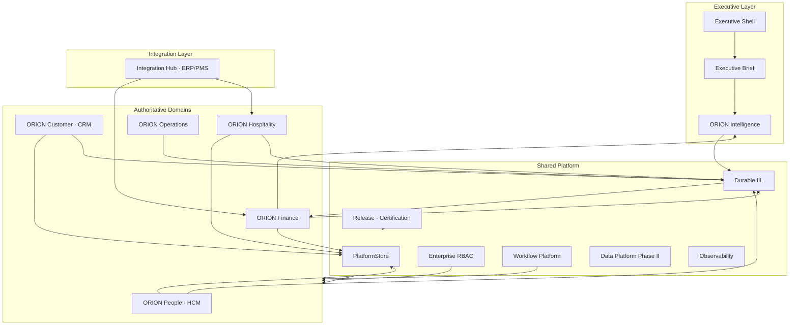
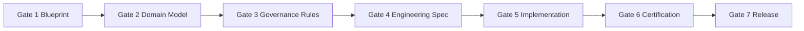
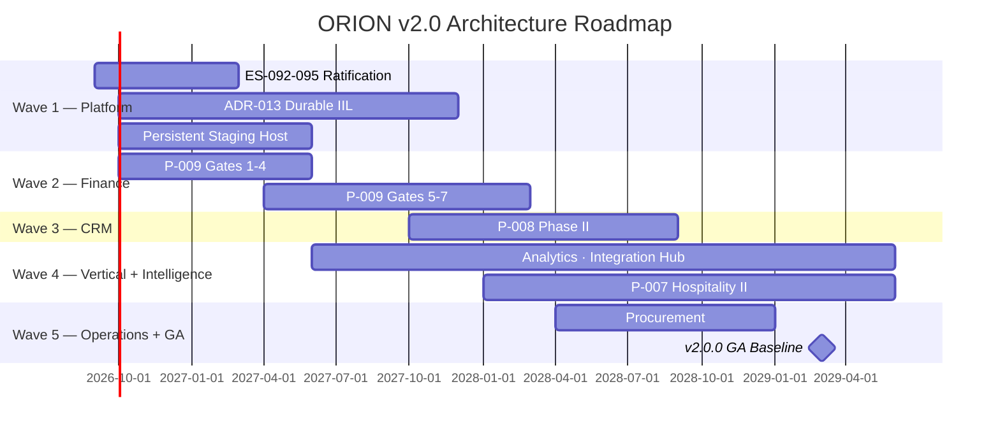

# P-016.2 — ORION v2.0 Architecture Charter

**Document ID:** P-016.2-CHARTER-001  
**Program:** P-016 — ORION Enterprise Platform v2.0 Strategic Planning  
**Mission:** P-016.2 — v2.0 Architecture Charter  
**Version:** 1.0  
**Status:** Ratified — Constitutional Architecture Document  
**Classification:** Enterprise Architecture · Governance · v2.0 Baseline  
**Authority:** Chief Enterprise Architect · Architecture Review Board  
**Charter Date:** 2 August 2026  
**Planning Horizon:** 2026 H2 – 2029 (v2.0 GA target)  
**Development Branch:** `develop/v2.0` (from `release/v1.0.1` @ `12af9c4`)  
**Architecture Baseline:** v1.0 GA Candidate → **v2.0 Multi-Domain Baseline** (planned)

**Supersedes:** Informal v2.0 direction fragments — does not modify ADR-001 through ADR-012  
**Baseline Inputs:** [P-016.1 Strategic Planning](./P-016.1-ORION-v2-Strategic-Planning.md) · [Master Roadmap v1.0](./ORION_Enterprise_Platform_Master_Roadmap_v1.0.md) · [Architecture Handbook v1.0](./ORION_Enterprise_Architecture_Handbook_v1.0.md) · [ES-097 ADR Policy](./ES-097-ORION-Architecture-Governance-ADR-Policy.md) · [ADR-001–012](../11_Governance/ADR/) · [Historical Archive](../99_History/) · [P-015.11 GA Certification](./P-015.11-General-Availability-Certification-Report.md) · [GA-001 Sprint Report](../06_Releases/GA-Readiness-Sprint-Report.md)

---

## Constitutional Statement

This document is the **constitutional architecture document** for all ORION Enterprise Platform v2.0 engineering work. Every domain program, platform mission, ADR proposal, and certification gate from this point forward shall conform to this charter unless superseded by an accepted ADR per [ES-097](./ES-097-ORION-Architecture-Governance-ADR-Policy.md).

**Scope of this charter:** Architecture direction · governance rules · capability matrix · roadmap · exit criteria.  
**Out of scope:** Implementation · code changes · ADR modifications · feature development.

---

## 1. Executive Vision

### 1.1 Purpose of ORION v2.0

ORION v1.0 established a **production-certified platform core** and a **reference domain** (Enterprise HCM). ORION v2.0 transforms that foundation into a **multi-domain authoritative Executive Operating System** — where financial truth, commercial intelligence, and durable cross-domain event integration are first-class platform capabilities, not aspirational roadmap items.

v2.0 is not a rewrite. It is a **governed extension** of proven v1.0 patterns across Finance, CRM, and platform services, with Intelligence consuming authoritative domain signals rather than placeholder data.

### 1.2 Strategic Objectives

| # | Objective | Success Measure |
|---|-----------|-----------------|
| **O1** | **Multi-domain authoritative persistence** | HCM + Finance + CRM on PlatformStore/PostgreSQL | 
| **O2** | **Durable cross-domain integration** | IIL events survive process restarts; cross-domain chains demonstrated |
| **O3** | **Financial truth as platform hub** | Finance GL receives HCM workforce cost and CRM revenue events |
| **O4** | **Governance maturity Level 2** | ES-092–095 ratified; ADR backlog cleared for v2.0 scope |
| **O5** | **Authoritative executive intelligence** | Brief signals sourced from certified domain events, not placeholders |
| **O6** | **Commercial bundle credibility** | HCM + Finance + CRM design partner narrative credible by 2028 |
| **O7** | **v2.0.0 Multi-Domain Baseline tag** | Gate 6 GO · Gate 7 Founder approval · zero P0 debt |

### 1.3 Enterprise Positioning

| Dimension | v1.0 Exit (August 2026) | v2.0 Target (2028–2029) |
|-----------|---------------------------|-------------------------|
| **Platform scope** | Platform core + HCM reference domain | Multi-domain authoritative platform |
| **Persistence** | HCM on PostgreSQL (CI certified) | HCM + Finance + CRM on PlatformStore |
| **Events** | In-process IIL | Durable IIL transport (ADR-013) |
| **Intelligence** | Brief + assistive AI | Authoritative Finance/HCM/CRM signals |
| **Commercial offer** | HCM design partner (post Gate 7) | HCM + Finance + CRM bundle |
| **ERP replacement narrative** | Not credible | Credible at v2.0 GA with Finance + CRM + HCM |
| **Production readiness** | 87/100 (GA-001) | ≥ 90/100 at v2.0 Gate 6 |

**v1.0 baseline evidence:**

| Achievement | Reference |
|-------------|-----------|
| PlatformStore + PostgreSQL | ADR-007 · `lib/platform/store/` · GA staging CI |
| Enterprise RBAC (HCM) | ADR-008/009 · 38 routes · fail-closed |
| Operational readiness | P-015.8 · runbooks · backup/DR · health endpoints |
| Release branch CI | `quality-gate.yml` · `ga-staging-certification.yml` — both green |
| Test suite | **930/930** pass |
| Gate 7 Founder approval | **Pending** |

---

## 2. Architecture Principles

The following principles are **reaffirmed** from [G-001](../11_Governance/Governance/G-001-Enterprise-Architecture-Governance-Charter.md), the [Architecture Handbook v1.0](./ORION_Enterprise_Architecture_Handbook_v1.0.md), and [ES-097](./ES-097-ORION-Architecture-Governance-ADR-Policy.md). They are non-negotiable for v2.0 unless changed via accepted ADR.

| Principle | v2.0 Requirement |
|-----------|------------------|
| **Architecture First** | Gates 1–4 complete before Gate 5 implementation on every domain and platform mission |
| **Platform First** | Shared platform services built or hardened before domain Gate 5; ADR-013 before Finance Gate 5 |
| **Shared Services** | Domains consume Identity, IIL, Workflow, Data, RBAC, Observability — no duplicated infrastructure |
| **Event Driven** | Cross-domain integration via IIL only; no direct repository reads across domain boundaries |
| **Evidence Based Engineering** | Architectural choices require ADR with alternatives, risks, and certification evidence |
| **Documentation First** | ES-xxx specs, event catalogues, and permission matrices ship with code; doc certification tests required |
| **Backward Compatibility** | Facade and event payload changes require ADR; additive changes preferred; breaking changes versioned |
| **Governance Before Delivery** | ES-092–095 ratified and required ADRs accepted before multi-domain Gate 5 work |

### 2.1 v2.0 Architectural Commitments

Derived from [P-016.1 §5.1](./P-016.1-ORION-v2-Strategic-Planning.md#51-v20-architecture-thesis):

| # | Commitment | Rationale |
|---|------------|-----------|
| **A1** | **Replicate, do not reinvent** | Every authoritative domain uses the HCM reference pattern: facade · repository · PlatformStore persister · RBAC catalog · IIL catalogue |
| **A2** | **Events before analytics** | No analytics workspace until Finance and CRM publish versioned IIL events on durable transport |
| **A3** | **Finance is the hub** | CRM revenue, HCM workforce cost, and Hospitality folio events converge on Finance — not direct cross-domain repository reads |
| **A4** | **Governance before Gate 5** | ES-092–095 ratified and ADR-013 accepted before any v2.0 domain Gate 5 implementation |
| **A5** | **Breaking changes via ADR only** | v2.0 baseline may introduce breaking facade/event changes — each requires ADR per ES-097 |

### 2.2 Inherited ADR Foundation (ADR-001 through ADR-012)

| ADR | Title | v2.0 Status |
|-----|-------|-------------|
| ADR-001 | Executive Shell | **Inherited** — unchanged |
| ADR-002 | Advisor Default Landing | **Inherited** — unchanged |
| ADR-003 | Global Command Palette | **Inherited** — unchanged |
| ADR-004 | Technical Debt Governance | **Extended** — v2.0 debt rules in §6 |
| ADR-005 | Business Workspace Architecture | **Extended** — all domain workspaces conform |
| ADR-006 | Executive Intelligence Provider Framework | **Extended** — authoritative signal consumption |
| ADR-007 | Production Persistence Strategy | **Extended** — Finance + CRM persister modules |
| ADR-008 | Enterprise Identity & Authentication | **Inherited** — OIDC deferred to v2.1+ |
| ADR-009 | Role-Based Access Control | **Extended** — all domain REST APIs |
| ADR-010 | Configuration & Secrets Management | **Inherited** — cloud adapter deferred to v2.1 |
| ADR-011 | Observability Architecture | **Extended** — APM + persistent staging |
| ADR-012 | Deployment & Release Strategy | **Extended** — v2.0 baseline tagging policy |

**Planned v2.0 ADRs (proposals only — not modified by this charter):**

| ADR | Title | Priority | Wave |
|-----|-------|----------|------|
| **ADR-013** | Durable IIL Event Transport | P1 | Wave 1 |
| ADR-014 | Finance Domain Persistence Strategy | P2 | Wave 2 |
| ADR-015 | CRM Enterprise Facade Convergence | P3 | Wave 3 |
| ADR-016 | Cross-Domain Event Catalogue Versioning | P2 | Wave 2 |
| ADR-017 | Analytics Read Model Architecture | P4 | Wave 4 |
| ADR-018 | Integration Hub Connector Framework | P4 | Wave 4 |

---

## 3. Platform Capability Matrix

Shared platform services that all product lines inherit. Maturity reflects post-GA-001 state (August 2026).

### 3.1 Platform Services

| Capability | v1.0 State | v2.0 Target | Primary ADR/ES | Wave |
|------------|------------|-------------|------------------|------|
| **PlatformStore** | HCM PostgreSQL certified in CI | HCM + Finance + CRM PostgreSQL | ADR-007 · ES-036 | Wave 1–3 |
| **RBAC** | Fail-closed · 38 HCM routes · org isolation | All domain REST APIs · permission catalogs | ADR-009 | Wave 2–3 |
| **Workflow** | HCM triggers integrated | Finance/CRM approval flows | P-010.2 | Wave 2–3 |
| **Events (IIL)** | In-process · events lost on crash | Durable queue transport | **ADR-013** | Wave 1 |
| **Observability** | 6 health endpoints · structured logging · ops framework | Health + APM + persistent staging host | ADR-011 | Wave 1 |
| **Performance** | Benchmark · load · stress frameworks certified | Production SLOs · multi-domain load profiles | P-015.9 | Wave 1–2 |
| **Security** | Fail-closed RBAC · compliance scorecard | All domains · expanded audit trail | ADR-008/009/010 | Wave 2–3 |
| **Certification** | G-001 seven gates · GA operational tests | Extended to all authoritative domains | ES-096 · G-001 | All waves |
| **Release** | Quality gate · GA staging cert on release branch | v2.0 develop branch governance · v2.0.0 tag policy | ADR-012 | Wave 1 |
| **History** | P-016.3 historical archive | Updated at v2.0 GA boundary | P-016.3 | Wave 5 exit |

### 3.2 Domain Inheritance Matrix

Shows which platform capabilities each product line **inherits** at v2.0 GA. ✓ = required consumer · ◐ = partial at wave exit · — = not applicable.

| Capability | Finance | CRM | Hospitality | Operations | Intelligence |
|------------|---------|-----|-------------|------------|--------------|
| **PlatformStore** | ✓ Authoritative | ✓ Authoritative | ◐ Folio events | — Wave 5 | — Read-only |
| **RBAC** | ✓ Full catalog | ✓ Full catalog | ✓ Workspace | ◐ Framework | ✓ Brief access |
| **Workflow** | ✓ Approval flows | ✓ Pipeline stages | ✓ Reservation | ◐ Procurement | — |
| **Events (IIL)** | ✓ Publisher + consumer | ✓ Publisher | ✓ Folio → Finance | ◐ Cost events | ✓ Subscriber |
| **Observability** | ✓ | ✓ | ✓ | ◐ | ✓ |
| **Performance** | ✓ GL benchmarks | ✓ Pipeline load | ◐ | — | ✓ Signal latency |
| **Security** | ✓ Financial data | ✓ Customer data | ✓ Guest PII | ◐ | ✓ |
| **Certification** | ✓ Gate 6 | ✓ Gate 6 | ◐ CONDITIONAL GO | — | ✓ Platform track |
| **Release** | ✓ RC/GA tag | ✓ RC/GA tag | ◐ Vertical pilot | — | ✓ |
| **History** | ✓ Domain record | ✓ Domain record | ✓ | — | ✓ |

**Inheritance rule:** No domain may bypass PlatformStore, RBAC, or IIL for cross-domain integration. Intelligence is a platform capability track — not a greenfield domain build.

---

## 4. Multi-Domain Architecture

### 4.1 Target Architecture



### 4.2 Shared Platform

The platform layer provides multi-tenant infrastructure that domains consume but do not duplicate:

| Service | Responsibility | v2.0 Change |
|---------|----------------|-------------|
| **Identity & Organization** | `ServiceContext` · org isolation | Unchanged · OIDC v2.1+ |
| **PlatformStore** | Persistence abstraction · PostgreSQL adapters | Extend to Finance + CRM |
| **IIL** | Cross-domain event bus · catalogues | **Durable transport (ADR-013)** |
| **Workflow** | Approval and state machine triggers | Domain bindings for Finance/CRM |
| **Data Platform** | Master data registry · reference data | Phase II consumption |
| **Observability** | Health · logging · ops framework | APM · persistent staging |
| **Release & Governance** | CI/CD · certification · ADR process | v2.0 branch policy |

### 4.3 Domain Boundaries

Each domain is a **bounded context** with a single public facade. Internal modules are not imported across domain boundaries.

| Domain | Public Facade | Integration Pattern | v2.0 Role |
|--------|---------------|---------------------|-----------|
| **HCM (People)** | `lib/hcm/index.ts` | Event publisher · PlatformStore consumer | v1.0 reference — maintain LTS |
| **Finance** | `lib/finance/index.ts` (planned) | Event hub · authoritative ledger | **Primary v2.0 domain expansion** |
| **CRM (Customer)** | `lib/crm/index.ts` | Event publisher · revenue chain | Enterprise elevation Wave 3 |
| **Hospitality** | `lib/hospitality/index.ts` | Folio → Finance events | Parallel vertical Wave 4 |
| **Operations** | Framework only (ES-058) | Cost posting → Finance | Deferred Wave 5 |
| **Intelligence** | Provider framework | IIL subscriber · Brief signals | Platform capability — not domain build |

### 4.4 Integration Layer

Cross-domain integration follows strict rules from the Architecture Handbook and ES-097:

| Rule | Requirement |
|------|-------------|
| **IIL only** | Domains publish and subscribe to versioned IIL events — no direct repository reads |
| **Finance as hub** | Revenue (CRM), workforce cost (HCM), folio (Hospitality) events processed by Finance |
| **Event catalogues** | Every domain maintains a versioned event catalogue with certification tests |
| **Integration Hub** | External ERP/PMS connectors (P-010.7) integrate at platform boundary — not inside domain repositories |
| **Additive by default** | Event payload changes require ADR-016 governance unless strictly additive |

**Target cross-domain chain (v2.0 GA demonstration):**

```
HCM (workforce.cost.recorded) → Finance (GL posting)
CRM (opportunity.won) → Finance (revenue recognition)
Hospitality (folio.closed) → Finance (revenue posting)
Finance (period.closed) → Intelligence (Brief financial signal)
```

---

## 5. Product Line Strategy

Five product lines evaluated for v2.0. Priority order is constitutional — domain programs shall not jump the queue without ARB exception ADR.

### 5.1 ORION Finance

| Field | Definition |
|-------|------------|
| **Purpose** | Authoritative financial truth — GL, AR/AP, cash, financial intelligence from cross-domain IIL events |
| **Business value** | **Highest** — completes Executive OS narrative · unlocks Operations and Procurement |
| **Dependencies** | PlatformStore · RBAC · durable IIL (soft) · HCM workforce cost events · CRM revenue events (future) |
| **Priority** | **P1 — First v2.0 domain program** |
| **Target release** | Finance RC: 2028 Q1 · Finance GA: v2.0.0 baseline prerequisite |
| **Program** | P-009 · Gates 1–4 architecture (2026 Q4 – 2027 Q2) · Gates 5–7 implementation (2027 Q2 – 2028 Q1) |

### 5.2 ORION Customer (CRM)

| Field | Definition |
|-------|------------|
| **Purpose** | Commercial relationships — accounts, pipeline, customer intelligence, revenue event publishing |
| **Business value** | **High** — largest workspace surface · design partner bundle enabler |
| **Dependencies** | PlatformStore · RBAC · Finance (revenue recognition chain) · IIL event catalogue |
| **Priority** | **P2 — Second v2.0 domain program** |
| **Target release** | CRM enterprise RC: 2028 H1 · bundled with v2.0.0 baseline |
| **Program** | P-008 Phase II · after Finance Gate 5 start |

### 5.3 ORION Hospitality

| Field | Definition |
|-------|------------|
| **Purpose** | Property and guest operations — reservations, folio, billing, revenue for hotel operators |
| **Business value** | **Medium–High (vertical)** — design partner accelerator · PMS partnerships |
| **Dependencies** | Finance (folio → ledger) · Integration Hub (PMS) · Customer (guest as party, optional) |
| **Priority** | **P4 — Parallel vertical track** |
| **Target release** | Vertical pilot: 2028 · suite integration: 2029 |
| **Program** | P-007 Phase II · parallel, not sequence-critical |

### 5.4 ORION Operations

| Field | Definition |
|-------|------------|
| **Purpose** | Supply chain execution — procurement, inventory, supply chain orchestration |
| **Business value** | **High (long-term)** — mid-market ERP completeness |
| **Dependencies** | **Finance (hard)** — sub-ledgers · cost posting · Procurement before Inventory |
| **Priority** | **P5 — Wave 5 program** |
| **Target release** | Procurement: 2028 H1 · Inventory: 2028 H2–2029 |
| **Program** | ES-058 framework · domain build deferred unless design partner demands |

### 5.5 ORION Intelligence

| Field | Definition |
|-------|------------|
| **Purpose** | Executive intelligence — Brief, analytics, governed AI, cross-domain explainability |
| **Business value** | **Highest (differentiation)** — primary competitive moat vs dashboards |
| **Dependencies** | **All authoritative domains** · durable IIL · analytics projections |
| **Priority** | **P3 — Platform capability track** (parallel, not competing with Finance Gate 5) |
| **Target release** | Authoritative Brief signals: 2027 Q3+ · Analytics workspace: 2028 H2–2029 |
| **Program** | Unify intelligence pipeline (TD-003) · consume domain events · not greenfield domain |

### 5.6 Priority Matrix

| Rank | Product Line | Business Value | Arch Readiness | Dependencies Met | **Priority** |
|------|--------------|----------------|----------------|------------------|--------------|
| 1 | **Platform (IIL + Governance)** | 5 | 4 | 5 | **P0 — Wave 1** |
| 2 | **Finance** | 5 | 4 | 4 | **P1 — Wave 2** |
| 3 | **Intelligence (capability)** | 5 | 3.5 | 2 | **P3 — Wave 4** |
| 4 | **CRM** | 4 | 4 | 3 | **P2 — Wave 3** |
| 5 | **Hospitality** | 3 | 4 | 2 | **P4 — Wave 4** |
| 6 | **Operations** | 4 | 2 | 1 | **P5 — Wave 5** |

**Hard rule:** No new domain Gate 5 until PlatformStore + RBAC patterns are certified on at least one domain (HCM ✅) and **ADR-013 is accepted**.

---

## 6. Engineering Governance

### 6.1 ADR Process

Per [ES-097](./ES-097-ORION-Architecture-Governance-ADR-Policy.md):

```
ORION Canon → G-001 Charter → Architecture Handbook → ES-097 → ADR-xxx → Implementation
```

| Rule | Requirement |
|------|-------------|
| **Canonical repository** | `docs/11_Governance/ADR/ADR-*.md` |
| **Lifecycle** | Proposed → Under Review → Accepted → Implemented → Superseded/Deprecated |
| **Gate 4 trigger** | ADR required before Gate 4 when ES introduces architectural choices not covered by existing decisions |
| **v2.0 blocker** | ADR-013 is a **release blocker** for v2.0.0 tag |
| **AI governance** | AI assistants may draft ADRs; human architect approval required before Accepted status |
| **No deletion** | Superseded ADRs retained for institutional memory |

### 6.2 Architecture Review Board (ARB)

| Role | Responsibility |
|------|----------------|
| **Chief Enterprise Architect** | Charter authority · primary ADR approver · cross-domain decisions |
| **Domain Leads** | Domain impact validation · business alignment |
| **Security Architect** | Required reviewer for auth, tenancy, PII ADRs |
| **Platform Engineering Lead** | Platform service feasibility · CI/certification impact |
| **Founder** | Canon-level or breaking strategic decisions · Gate 7 |

**ARB cadence:** Weekly during active v2.0 waves · ADR review within 5 business days of submission.

### 6.3 Certification Gates (G-001)

No implementation before Gates 1–4. No release before Gate 6. No production tag before Gate 7.



| Gate | v2.0 Deliverable |
|------|------------------|
| **Gate 1** | Domain blueprint (D-xxx) · scope boundary |
| **Gate 2** | Domain model · entity relationships |
| **Gate 3** | Rules engines · permission matrix draft |
| **Gate 4** | ES-xxx engineering specification · required ADRs accepted |
| **Gate 5** | Implementation · facade · repository · PlatformStore persister |
| **Gate 6** | Independent certification · GO / CONDITIONAL GO / NO-GO |
| **Gate 7** | Founder approval · semantic version tag |

**Validation gates (every mission):**

```bash
npm run typecheck
npm run lint
npm test
npm run build
```

### 6.4 Release Board

Per ADR-012 and Release Policy:

| Branch | Purpose |
|--------|---------|
| `release/v1.0.1` | v1.0 stabilization · Gate 7 · GA tag |
| `develop/v2.0` | v2.0 planning and architecture (P-016.x) · no Gate 5 until charter + ADR-013 |
| `feature/p-009-*` | Finance domain (future · branched from develop/v2.0) |

| Rule | Requirement |
|------|-------------|
| **Quality gate** | All PRs to develop/v2.0 and release branches |
| **GA staging cert** | PostgreSQL service · full suite · build |
| **Cherry-pick policy** | v1.0 patches cherry-pick to develop/v2.0 |
| **Tag discipline** | Semantic tags only after Gate 7 · annotated message references certification record |

### 6.5 Technical Debt Governance

Per ADR-004 and [TECHNICAL_DEBT.md](../11_Governance/TECHNICAL_DEBT.md):

| Rule | Requirement |
|------|-------------|
| **Register sync** | Every v2.0 program exit updates central debt register |
| **P0 at Gate 6** | No Gate 6 certification with open P0 debt |
| **Persistence debt** | Domain persistence debt cannot defer past Finance Gate 7 |
| **Promotion path** | Every debt item: owner · target release · central register entry |
| **ADR-013** | Resolves TD-PLATFORM-003 · AG-002 |
| **ES-092–095** | Resolves TD-PLATFORM-004 |

**v2.0 debt disposition (from P-016.1):**

| ID | Item | v2.0 Wave |
|----|------|-----------|
| TD-PLATFORM-003 | IIL in-process only | Wave 1 — ADR-013 |
| TD-PLATFORM-004 | ES-092–095 not ratified | Wave 1 — P-016.4 |
| TD-DOMAIN-PERSIST-001 | CRM/Finance in-memory | Wave 2–3 |
| TD-003 | Dual intelligence pipeline | Wave 4 — platform track |
| OPS-001 | Operational maturity | Wave 1 — persistent staging |

---

## 7. Architecture Roadmap

Five execution waves. Each wave has entry criteria, deliverables, and exit verdict. **No Gate 5 domain implementation begins until Wave 1 exit criteria are met.**

### Wave 1 — Platform Foundation (2026 Q3 – 2027 Q4)

**Objective:** Harden platform services and close governance gaps before multi-domain Gate 5.

| Deliverable | Program | Target |
|-------------|---------|--------|
| **ADR-013** Durable IIL proposal and acceptance | P-016.3 ADR Program | 2027 Q1 acceptance |
| **ES-092–095** ratification | P-016.4 Governance Completion | 2027 Q1 |
| Persistent staging host | Infrastructure mission | 2027 Q3 |
| PlatformStore pattern documentation | Platform engineering | 2026 Q4 |
| develop/v2.0 branch governance | Release Board | 2026 Q3 |
| Observability APM adapter design | ADR-011 extension | 2027 Q2 |

**Wave 1 exit criteria:**

- [ ] ADR-013 **Accepted**
- [ ] ES-092–095 **Ratified**
- [ ] TD-PLATFORM-003 and TD-PLATFORM-004 **Closed or accepted with ADR**
- [ ] Persistent staging host **Operational**
- [ ] ARB verdict: **GO** for Wave 2

---

### Wave 2 — Finance (2026 Q4 – 2028 Q1)

**Objective:** Authoritative financial truth — first non-HCM PlatformStore consumer.

| Phase | Program | Target |
|-------|---------|--------|
| Gates 1–4 | P-009 Finance architecture | 2027 Q2 |
| ADR-014 · ADR-016 | Finance persistence · event versioning | Gate 4 |
| Gates 5–7 | P-009 Finance implementation | 2027 Q2 – 2028 Q1 |
| HCM → Finance event chain | IIL integration | Finance alpha |
| Finance RBAC catalog | ADR-009 extension | Gate 5 |

**Wave 2 exit criteria:**

- [ ] Finance RC with PostgreSQL persistence
- [ ] HCM workforce cost → Finance GL chain demonstrated
- [ ] Finance Gate 6 certification **GO** or **CONDITIONAL GO** with numbered conditions
- [ ] Zero P0 Finance persistence debt

---

### Wave 3 — CRM (2027 H2 – 2028 H1)

**Objective:** Enterprise CRM elevation — revenue events to Finance.

| Phase | Program | Target |
|-------|---------|--------|
| ADR-015 | CRM facade convergence | Gate 4 |
| P-008 Phase II Gates 5–7 | CRM implementation | 2027 H2 – 2028 H1 |
| CRM → Finance revenue chain | IIL integration | CRM RC |
| CRM RBAC catalog | ADR-009 extension | Gate 5 |

**Wave 3 exit criteria:**

- [ ] CRM enterprise facade certified
- [ ] CRM opportunity.won → Finance revenue chain demonstrated
- [ ] CRM Gate 6 certification **GO** or **CONDITIONAL GO**

---

### Wave 4 — Hospitality & Intelligence (2028 – 2029)

**Objective:** Vertical depth and authoritative executive intelligence.

| Track | Program | Target |
|-------|---------|--------|
| **Hospitality** | P-007 Phase II · folio → Finance | 2028 – 2029 |
| **Intelligence** | TD-003 unification · authoritative Brief | 2027 Q3+ incremental |
| **Analytics** | ADR-017 read models | 2028 H2 – 2029 |
| **Integration Hub** | ADR-018 · P-010.7 ERP/PMS | 2027 – 2028 |
| **Data Platform** | P-011 Phase II reference data | 2027 – 2028 |

**Wave 4 exit criteria:**

- [ ] Brief signals sourced from Finance + HCM authoritative events
- [ ] Hospitality folio → Finance chain demonstrated (pilot)
- [ ] Intelligence pipeline unified (TD-003 closed)

---

### Wave 5 — Operations & v2.0 GA (2028 – 2029)

**Objective:** Operations framework initiation and v2.0.0 Multi-Domain Baseline tag.

| Track | Program | Target |
|-------|---------|--------|
| **Procurement** | ES-058 · Operations domain | 2028 H1 |
| **Inventory** | Operations domain | 2028 H2 – 2029 |
| **v2.0.0 tag** | Multi-Domain Baseline | 2029 Q1 |
| **Historical archive** | P-016.3 update at v2.0 boundary | 2029 Q1 |

**Wave 5 exit criteria:** See §9 Exit Criteria.

---

### Roadmap Summary



---

## 8. Success Metrics

Metrics measured at each wave exit and at v2.0 Gate 6. Scale: percentage (0–100) unless noted.

### 8.1 Architecture Health

| Metric | v1.0 Exit | v2.0 Wave 1 | v2.0 GA Target |
|--------|-----------|-------------|----------------|
| Handbook conformance | 90/100 | ≥ 92 | ≥ 95 |
| ADR coverage (decisions documented) | ADR-007–012 | + ADR-013 | + ADR-014–016 minimum |
| Facade boundary violations | 0 | 0 | 0 |
| Cross-domain repository reads | 0 | 0 | 0 |
| ES-092–095 ratification | Partial | **Complete** | Complete |

### 8.2 Engineering Health

| Metric | v1.0 Exit | v2.0 GA Target |
|--------|-----------|----------------|
| Full test suite | 930/930 | ≥ 930 + domain tests |
| Four validation gates | Green on release branch | Green on develop/v2.0 |
| P0 technical debt | 0 open | 0 open |
| Documentation certification | HCM + platform | All authoritative domains |
| CI PostgreSQL certification | Green | Green |

### 8.3 Security

| Metric | v1.0 Exit | v2.0 GA Target |
|--------|-----------|----------------|
| Security health score | 87/100 | ≥ 90/100 |
| Fail-closed API enforcement | HCM 38 routes | All domain REST APIs |
| RBAC permission catalog coverage | HCM only | HCM + Finance + CRM |
| Audit trail on material mutations | HCM | All authoritative domains |

### 8.4 Performance

| Metric | v1.0 Exit | v2.0 GA Target |
|--------|-----------|----------------|
| Performance certification | Framework certified | Multi-domain load profiles |
| API p95 latency (domain APIs) | HCM benchmarked | Finance + CRM benchmarked |
| IIL event throughput | Not measured | ADR-013 SLO defined |

### 8.5 Operations

| Metric | v1.0 Exit | v2.0 GA Target |
|--------|-----------|----------------|
| Operations health score | 84/100 | ≥ 88/100 |
| Persistent staging host | CI only | Operational host |
| Backup/DR drill | Simulated | Live drill documented |
| Runbook coverage | Platform + HCM | All authoritative domains |

### 8.6 Documentation

| Metric | v1.0 Exit | v2.0 GA Target |
|--------|-----------|----------------|
| ES-xxx per authoritative domain | HCM complete | HCM + Finance + CRM |
| Event catalogues | HCM 67+ events | + Finance + CRM catalogues |
| Permission matrices | HCM | HCM + Finance + CRM |
| Historical archive | P-016.3 complete | Updated at v2.0 boundary |

### 8.7 Platform Adoption

| Metric | v1.0 Exit | v2.0 GA Target |
|--------|-----------|----------------|
| Domains on PlatformStore | 1 (HCM) | 3 (HCM + Finance + CRM) |
| Domains on durable IIL | 0 | 3 minimum |
| Cross-domain event chains demonstrated | 0 | ≥ 3 chains |
| Workflow domain bindings | HCM | HCM + Finance + CRM |

### 8.8 Commercial Readiness

| Metric | v1.0 Exit | v2.0 GA Target |
|--------|-----------|----------------|
| Production readiness score | 87/100 | ≥ 90/100 |
| Design partner offer | HCM only | HCM + Finance + CRM bundle |
| ERP replacement narrative | Not credible | Credible |
| Gate 7 Founder approval | Pending | **Required** |

---

## 9. Exit Criteria — ORION v2.0 GA

The **v2.0.0 Multi-Domain Baseline** tag requires all criteria below. Partial satisfaction yields **CONDITIONAL GO** with numbered remediation — not a GA tag.

### 9.1 Platform Requirements

| # | Criterion | Evidence |
|---|-----------|----------|
| P1 | ADR-013 implemented and operational | Durable IIL transport · event survival on restart |
| P2 | ES-092–095 ratified and enforced | P-016.4 completion record |
| P3 | PlatformStore serves HCM + Finance + CRM | PostgreSQL adapters · CI certification |
| P4 | Zero P0 platform technical debt | TECHNICAL_DEBT.md audit |
| P5 | Persistent staging host operational | Ops certification record |
| P6 | Full test suite green on develop/v2.0 | CI evidence · ≥ 930 + domain tests |

### 9.2 Domain Requirements

| # | Criterion | Evidence |
|---|-----------|----------|
| D1 | HCM maintained at GA level | LTS policy · regression green |
| D2 | Finance RC minimum with Gate 6 **GO** | P-009 certification report |
| D3 | CRM enterprise facade with Gate 6 **GO** or **CONDITIONAL GO** | P-008 II certification report |
| D4 | Finance RBAC catalog complete | Permission matrix · fail-closed verified |
| D5 | CRM RBAC catalog complete | Permission matrix · fail-closed verified |

### 9.3 Integration Requirements

| # | Criterion | Evidence |
|---|-----------|----------|
| I1 | HCM → Finance workforce cost chain | IIL event trace · GL posting |
| I2 | CRM → Finance revenue chain | IIL event trace · revenue recognition |
| I3 | Cross-domain event catalogue versioned | ADR-016 compliance |
| I4 | Brief authoritative financial signal | Intelligence certification |

### 9.4 Governance Requirements

| # | Criterion | Evidence |
|---|-----------|----------|
| G1 | All v2.0 ADRs in Implemented status (013–016 minimum) | ADR repository audit |
| G2 | Gate 6 certification **GO** | Independent certification report |
| G3 | Gate 7 Founder approval recorded | Founder sign-off document |
| G4 | Production readiness ≥ 90/100 | Certification scorecard |
| G5 | Historical archive updated | P-016.3 v2.0 addendum |

### 9.5 Explicitly Out of Scope for v2.0 GA

| Item | Disposition |
|------|-------------|
| OAuth2 / OIDC / SSO / MFA | v2.1+ |
| Cloud secret manager adapter | v2.1 |
| Multi-region HA | v3.0 |
| Operations Procurement GA | v2.1/v2.2 |
| Marketplace / Developer Platform GA | v2.5+ (2030 horizon) |
| Hospitality full enterprise GA | Vertical pilot acceptable |

---

## 10. Governance Summary

| Body | Authority | v2.0 Role |
|------|-----------|-----------|
| **Founder** | Gate 7 · Canon-level decisions | v2.0.0 tag approval |
| **Chief Enterprise Architect** | Charter authority · ADR primary approver | This document · ARB chair |
| **Architecture Review Board** | ADR review · gate progression | Weekly during active waves |
| **Program Director** | Wave sequencing · resource allocation | P-016 program series |
| **Domain Leads** | Gates 1–4 · domain certification | Finance · CRM · Hospitality |
| **Platform Engineering** | PlatformStore · IIL · CI | Wave 1 primary owner |
| **Release Board** | Branch policy · tag discipline | develop/v2.0 governance |

**Hierarchy of authority:**

```
ORION Canon → G-001 → Architecture Handbook → P-016.2 Charter → ES-097 → ADR-xxx
```

**Branch governance:**

| Action | Allowed on develop/v2.0 |
|--------|-------------------------|
| P-016.x planning missions | ✅ |
| ADR proposals (no code) | ✅ |
| Gates 1–4 architecture deliverables | ✅ |
| Gate 5 implementation | ❌ until Wave 1 exit + ADR-013 |
| v1.0 patch cherry-picks | ✅ per Release Board |

---

## 11. Executive Recommendation

### 11.1 Decision Matrix

| Question | Assessment | Verdict |
|----------|------------|---------|
| Is the v2.0 architecture direction sound? | Evidence-based · handbook-aligned · HCM reference proven | **GO** |
| Is the capability matrix complete? | Ten platform services · five product lines · inheritance defined | **GO** |
| Is the five-wave roadmap sequenced correctly? | Platform → Finance → CRM → Intelligence/Vertical → Operations/GA | **GO** |
| Is governance sufficient for v2.0 scale? | ES-097 · G-001 gates · ADR program · debt rules | **GO** |
| May Gate 5 implementation begin immediately? | Wave 1 exit criteria not met · ADR-013 pending · Gate 7 pending | **NO-GO** |
| Should Hospitality or Operations jump the queue? | Finance first per Master Roadmap and P-016.1 | **NO-GO** |

### 11.2 Final Verdict

| Assessment | Verdict |
|------------|---------|
| **P-016.2 Architecture Charter mission** | **GO** |
| **ORION v2.0 constitutional architecture** | **GO** |
| **Immediate Gate 5 domain implementation** | **NO-GO** |
| **Overall v2.0 program execution** | **CONDITIONAL GO** |

**Conditions for unconditional GO on v2.0 Gate 5 work:**

1. v1.0 Gate 7 Founder approval recorded
2. This charter ratified by Architecture Review Board ✅
3. ADR-013 (Durable IIL) **Accepted**
4. ES-092–095 ratification mission (P-016.4) **Underway**
5. P-009 Finance Gates 1–4 complete before Finance Gate 5 coding

### 11.3 Immediate Next Actions

| # | Action | Owner | Target |
|---|--------|-------|--------|
| 1 | Complete v1.0 Gate 7 Founder sign-off | Founder | Sep 2026 |
| 2 | ARB ratification of this charter | Chief Enterprise Architect | Sep 2026 |
| 3 | Launch ADR-013 durable IIL proposal | Platform Engineering | Oct 2026 |
| 4 | Assign P-016.4 ES-092–095 ratification mission | Governance | Oct 2026 |
| 5 | Begin P-009 Finance Gates 1–4 (architecture only) | Finance Domain Lead | Oct 2026 |
| 6 | Update Master Roadmap to v1.1 reflecting post-GA state | Program Director | Oct 2026 |

---

## 12. Sign-Off

| Role | Decision | Date |
|------|----------|------|
| Chief Enterprise Architect | **GO** — v2.0 architecture charter ratified | 2 Aug 2026 |
| Architecture Review Board | **GO** — constitutional document accepted | 2 Aug 2026 |
| Program Director | **CONDITIONAL GO** — pending v1.0 Gate 7 | 2 Aug 2026 |
| Founder | Pending | — |

---

## 13. Related Deliverables

| Document | Path |
|----------|------|
| P-016.1 Strategic Planning | [P-016.1-ORION-v2-Strategic-Planning.md](./P-016.1-ORION-v2-Strategic-Planning.md) |
| Master Roadmap v1.0 | [ORION_Enterprise_Platform_Master_Roadmap_v1.0.md](./ORION_Enterprise_Platform_Master_Roadmap_v1.0.md) |
| Architecture Handbook | [ORION_Enterprise_Architecture_Handbook_v1.0.md](./ORION_Enterprise_Architecture_Handbook_v1.0.md) |
| ES-097 ADR Policy | [ES-097-ORION-Architecture-Governance-ADR-Policy.md](./ES-097-ORION-Architecture-Governance-ADR-Policy.md) |
| ADR Repository | [docs/11_Governance/ADR/](../11_Governance/ADR/) |
| Historical Archive | [docs/99_History/](../99_History/) |
| Technical Debt Register | [TECHNICAL_DEBT.md](../11_Governance/TECHNICAL_DEBT.md) |
| develop/v2.0 branch | `origin/develop/v2.0` @ `12af9c4` |

---

*P-016.2 — Constitutional architecture only · No implementation · No code changes · No ADR modifications · Next mission: P-016.3 ADR Program Launch · P-016.4 Governance Completion*
