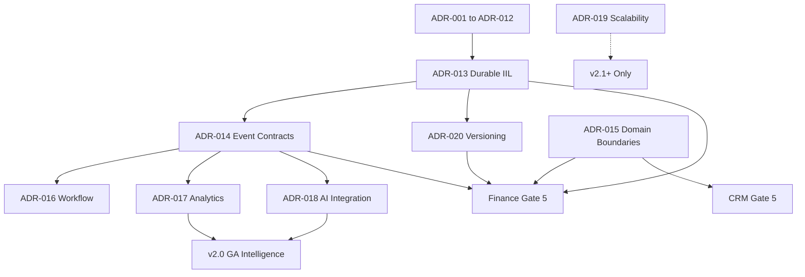
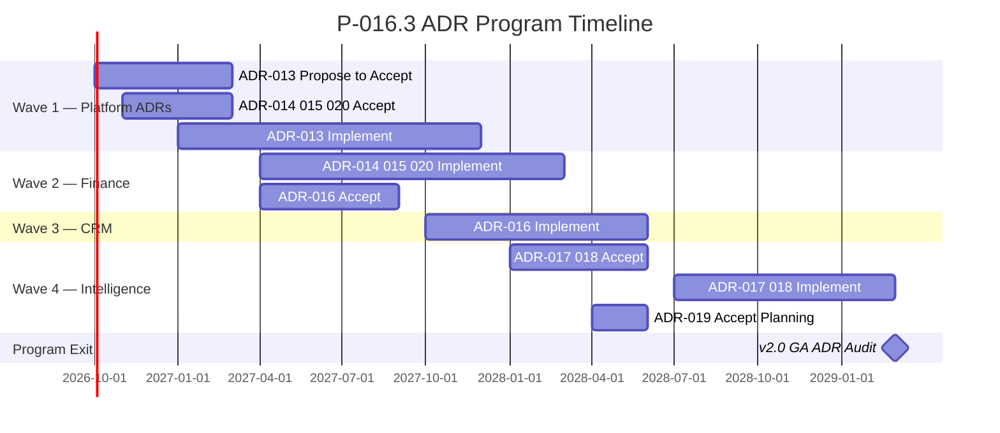

# P-016.3 — ORION v2.0 ADR Program

**Document ID:** P-016.3-ADR-001  
**Program:** P-016 — ORION Enterprise Platform v2.0 Strategic Planning  
**Mission:** P-016.3 — v2.0 ADR Program Launch  
**Version:** 1.0  
**Status:** Ratified — Governing ADR Program  
**Classification:** Enterprise Architecture · Governance · v2.0 Baseline  
**Authority:** Chief Enterprise Architect · Architecture Review Board  
**Program Date:** 2 August 2026  
**Planning Horizon:** 2026 H2 – 2029 (v2.0 GA target)  
**Development Branch:** `develop/v2.0` (from `release/v1.0.1` @ `12af9c4`)

**Supersedes:** Informal ADR backlog in P-016.1 §5.3 and P-016.2 §2.2 — consolidates into official v2.0 ADR sequence  
**Does not create:** ADR-013 through ADR-020 record files — proposals only  
**Baseline Inputs:** [P-016.1 Strategic Planning](./P-016.1-ORION-v2-Strategic-Planning.md) · [P-016.2 Architecture Charter](./P-016.2-ORION-v2-Architecture-Charter.md) · [ES-097 ADR Policy](./ES-097-ORION-Architecture-Governance-ADR-Policy.md) · [ADR-001–012](../11_Governance/ADR/) · [Architecture Handbook v1.0](./ORION_Enterprise_Architecture_Handbook_v1.0.md) · [TECHNICAL_DEBT.md](../11_Governance/TECHNICAL_DEBT.md) · [Master Roadmap v1.0](./ORION_Enterprise_Platform_Master_Roadmap_v1.0.md)

---

## Constitutional Statement

This document launches the **official Architecture Decision Record (ADR) program** for ORION Enterprise Platform v2.0. It defines the ADR roadmap, priority matrix, release blockers, review process, and success metrics governing all v2.0 architectural decisions.

**Scope:** ADR program governance · roadmap · blockers · ARB process · timeline.  
**Out of scope:** ADR record creation · implementation · code changes · feature development.

**Next mission after program approval:** Draft **ADR-013 — Durable Intelligent Integration Layer (IIL)** as the first v2.0 architecture decision proposal.

**Hierarchy of authority:**

```
ORION Canon → G-001 → Architecture Handbook → P-016.2 Charter → P-016.3 ADR Program → ES-097 → ADR-xxx
```

**Canonical ADR repository:** `docs/11_Governance/ADR/ADR-*.md`  
**Next available ADR number:** ADR-013 (per ES-097 §2.6)

---

## 1. Executive Summary

### 1.1 Purpose of the ADR Program

ORION v1.0 closed its production ADR cycle with ADR-007 through ADR-012 (persistence, identity, RBAC, observability, release). v2.0 introduces **eight new architectural decisions** (ADR-013 through ADR-020) that govern durable cross-domain integration, domain boundaries, workflow, analytics, AI, scalability, and compatibility.

The ADR program ensures that:

- Every v2.0 structural choice is **documented before implementation**
- Cross-domain integration evolves from in-process IIL to **durable, versioned event contracts**
- Domain programs (Finance, CRM, Hospitality) inherit **consistent boundaries and reuse patterns**
- Release gates block engineering until **required ADRs are Accepted**
- Technical debt (TD-PLATFORM-003, AG-002, TD-003) resolves through **governed decisions**, not ad-hoc fixes

### 1.2 Objectives

| # | Objective | Success Measure |
|---|-----------|-----------------|
| **O1** | Establish v2.0 ADR roadmap | ADR-013–020 sequenced with dependencies |
| **O2** | Unblock Wave 1 platform work | ADR-013 Accepted before Finance Gate 5 |
| **O3** | Govern cross-domain contracts | ADR-014 + ADR-020 Accepted before multi-domain event chains |
| **O4** | Define domain boundary law | ADR-015 Accepted before CRM/Hospitality Gate 5 |
| **O5** | Resolve platform technical debt | TD-PLATFORM-003 · AG-002 closed via ADR-013 |
| **O6** | Enable authoritative intelligence | ADR-017 + ADR-018 Accepted before analytics workspace |
| **O7** | Document v2.0 GA prerequisites | Release blockers mapped to ADR acceptance states |

### 1.3 Governance Model

Per [ES-097](./ES-097-ORION-Architecture-Governance-ADR-Policy.md) and [P-016.2 Charter](./P-016.2-ORION-v2-Architecture-Charter.md):

| Rule | Requirement |
|------|-------------|
| **Lifecycle** | Proposed → Under Review → Accepted → Implemented → Superseded/Deprecated |
| **Gate 4 trigger** | ADR required when ES introduces choices not covered by ADR-001–012 |
| **No Gate 5 without ADR** | Domain Gate 5 blocked until wave-required ADRs are **Accepted** |
| **No deletion** | Superseded ADRs retained; numbers never reused |
| **AI governance** | AI may draft ADRs; human architect approval required for Accepted status |
| **Debt sync** | Every Accepted ADR updates [TECHNICAL_DEBT.md](../11_Governance/TECHNICAL_DEBT.md) |
| **Implementation proof** | Status → Implemented only after code merged and certification validated |

**Inherited foundation (ADR-001 through ADR-012):** Unchanged. v2.0 ADRs **extend** — not replace — the v1.0 production baseline unless explicitly superseded.

---

## 2. ADR Roadmap

Planned ADR sequence for ORION v2.0. Each entry is a **program backlog item** — no ADR record file is created by this mission.

### 2.1 Roadmap Overview

```
ADR-013  Durable IIL                    ──► Wave 1 (Platform)
    │
    ├── ADR-014  Cross-Domain Event Contracts
    ├── ADR-015  Domain Service Boundaries
    └── ADR-020  Versioning & Compatibility
            │
            ├── ADR-016  Platform Workflow Engine     ──► Wave 2–3
            ├── ADR-017  Cross-Domain Reporting       ──► Wave 4
            ├── ADR-018  Platform AI Integration        ──► Wave 4
            └── ADR-019  Scalability & Multi-Region     ──► v2.1+ (planning only at v2.0)
```

### 2.2 ADR Definitions

#### ADR-013 — Durable Intelligent Integration Layer (IIL)

| Field | Definition |
|-------|------------|
| **Problem** | IIL EventBus is in-process only (TD-PLATFORM-003); events lost on process restart; cross-domain chains unreliable at scale |
| **Decision scope** | Durable transport selection (queue/stream) · delivery guarantees · retry/dead-letter · observability · migration from in-process bus |
| **Resolves** | TD-PLATFORM-003 · AG-002 |
| **Extends** | P-006 IIL architecture · ADR-007 persistence boundary |
| **Charter reference** | P-016.2 §2.2 · Commitment A4 |

---

#### ADR-014 — Cross-Domain Event Contracts

| Field | Definition |
|-------|------------|
| **Problem** | HCM publishes 67+ events; Finance and CRM require versioned, certified cross-domain contracts with schema governance |
| **Decision scope** | Event schema registry · naming conventions · payload versioning · certification tests · Finance-as-hub routing rules |
| **Resolves** | Informal event catalogue drift · enables HCM → Finance · CRM → Finance chains |
| **Extends** | ADR-013 transport · Architecture Handbook § event-driven integration |
| **Charter reference** | Commitment A3 (Finance is the hub) |

---

#### ADR-015 — Domain Service Boundaries

| Field | Definition |
|-------|------------|
| **Problem** | CRM and Finance pre-handbook patterns need convergence to HCM reference architecture; facade boundaries must be constitutional for multi-domain platform |
| **Decision scope** | Bounded context rules · facade import law · repository isolation · PlatformStore consumer pattern · anti-patterns (cross-domain repository reads) |
| **Resolves** | TD-DOMAIN-PERSIST-001 (architectural layer) · P-008 facade convergence |
| **Extends** | ADR-005 workspace · ADR-007 persistence · Architecture Handbook layering |
| **Charter reference** | Commitment A1 (replicate, do not reinvent) |

---

#### ADR-016 — Platform Workflow Engine

| Field | Definition |
|-------|------------|
| **Problem** | Workflow platform integrated with HCM (13 triggers); Finance and CRM require approval flows without domain-specific workflow engines |
| **Decision scope** | Shared workflow engine API · domain trigger bindings · state persistence · IIL event emission on workflow transitions |
| **Resolves** | Parallel workflow implementations in domain code |
| **Extends** | P-010.2 Workflow Platform · ADR-014 event contracts |
| **Charter reference** | Platform Capability Matrix — Workflow row |

---

#### ADR-017 — Cross-Domain Reporting & Analytics

| Field | Definition |
|-------|------------|
| **Problem** | No analytics workspace; executive metrics require read models fed by authoritative domain events — not placeholder or direct repository queries |
| **Decision scope** | Analytics read model architecture · event projections · CQRS boundaries · analytics workspace certification |
| **Resolves** | Master Roadmap T8 (analytics read models) |
| **Extends** | ADR-014 event contracts · ADR-006 intelligence framework |
| **Charter reference** | Commitment A2 (events before analytics) |

---

#### ADR-018 — Platform AI Integration Principles

| Field | Definition |
|-------|------------|
| **Problem** | Dual intelligence pipeline (TD-003): Brief Bus vs orchestrator; AI must consume authoritative domain signals with explainability and governance |
| **Decision scope** | Unified intelligence pipeline · provider framework extension · governed AI boundaries · signal sourcing rules · human-in-the-loop requirements |
| **Resolves** | TD-003 dual intelligence pipeline |
| **Extends** | ADR-006 Executive Intelligence Provider Framework |
| **Charter reference** | Intelligence platform capability track |

---

#### ADR-019 — Scalability & Multi-Region Strategy

| Field | Definition |
|-------|------------|
| **Problem** | v2.0 targets multi-domain load; horizontal scale-out and multi-region HA deferred from v1.0 require architectural planning before v3.0 |
| **Decision scope** | Horizontal scaling model · read replicas · multi-region topology · data residency · failover — **planning and principles only at v2.0** |
| **Resolves** | Master Roadmap multi-region deferral · horizontal scale-out backlog |
| **Extends** | ADR-011 observability · ADR-013 durable IIL |
| **Charter reference** | Explicitly out of v2.0 GA scope — Accepted status required for v2.1+ implementation |

---

#### ADR-020 — Versioning & Domain Compatibility

| Field | Definition |
|-------|------------|
| **Problem** | Multi-domain platform requires facade versioning, event payload compatibility rules, and breaking change governance across Finance, CRM, and HCM |
| **Decision scope** | Semantic versioning for facades · additive vs breaking event changes · deprecation policy · migration guides · certification impact |
| **Resolves** | Ad-hoc breaking changes risk across v2.0 waves |
| **Extends** | ADR-004 debt governance · ES-097 §2.5 superseding rules · ADR-012 release strategy |
| **Charter reference** | Commitment A5 (breaking changes via ADR only) |

---

### 2.3 Mapping to Prior Planning Documents

P-016.1 and P-016.2 used working titles for some ADRs. This program **ratifies the canonical v2.0 sequence** below:

| Prior Reference (P-016.1/2) | Canonical ADR (P-016.3) |
|-----------------------------|-------------------------|
| ADR-013 Durable IIL Event Transport | **ADR-013** Durable IIL |
| ADR-016 Cross-Domain Event Catalogue Versioning | **ADR-014** Cross-Domain Event Contracts + **ADR-020** Versioning |
| ADR-014 Finance Domain Persistence Strategy | Covered by **ADR-015** + ADR-007 extension (no separate ADR) |
| ADR-015 CRM Enterprise Facade Convergence | **ADR-015** Domain Service Boundaries |
| ADR-017 Analytics Read Model Architecture | **ADR-017** Cross-Domain Reporting & Analytics |
| ADR-018 Integration Hub Connector Framework | Deferred to P-010.7 DL/ADR backlog post-v2.0 Wave 4 |
| — | **ADR-016** Platform Workflow Engine (new) |
| — | **ADR-018** Platform AI Integration Principles (new) |
| — | **ADR-019** Scalability & Multi-Region Strategy (new) |

---

## 3. Priority Matrix

For every planned v2.0 ADR:

| ADR | Purpose | Priority | Dependencies | Target Wave | Release Impact | Implementation Timing |
|-----|---------|----------|--------------|-------------|----------------|----------------------|
| **ADR-013** | Durable IIL transport; event survival on restart | **P0 — Critical** | ADR-001–012 · P-006 IIL | Wave 1 | **Blocks Finance Gate 5 · v2.0 GA** | Accept: 2027 Q1 · Implement: 2027 Q1–Q4 |
| **ADR-014** | Versioned cross-domain event contracts; Finance-as-hub routing | **P1 — High** | ADR-013 Accepted | Wave 1–2 | **Blocks Finance Gate 5 · CRM Gate 5 · v2.0 GA** | Accept: 2027 Q1 · Implement: 2027 Q2–2028 Q1 |
| **ADR-015** | Domain facade boundaries; HCM reference replication law | **P1 — High** | ADR-007 · Handbook v1.0 | Wave 2–3 | **Blocks Finance Gate 5 · CRM Gate 5 · Hospitality Gate 5** | Accept: 2027 Q1 · Implement: 2027 Q2–2028 H1 |
| **ADR-016** | Shared workflow engine; domain trigger bindings | **P2 — Medium** | ADR-014 · P-010.2 | Wave 2–3 | Blocks Finance/CRM approval flows · soft blocker for Gate 6 | Accept: 2027 Q2 · Implement: 2027 Q3–2028 H1 |
| **ADR-017** | Analytics read models; event projections | **P2 — Medium** | ADR-013 · ADR-014 · Finance alpha | Wave 4 | **Blocks analytics workspace · v2.0 GA intelligence criterion** | Accept: 2028 Q1 · Implement: 2028 H2–2029 |
| **ADR-018** | Unified AI pipeline; governed intelligence sourcing | **P2 — Medium** | ADR-006 · ADR-014 · TD-003 | Wave 4 | Blocks authoritative Brief · soft v2.0 GA criterion | Accept: 2027 Q4 · Implement: 2028–2029 |
| **ADR-019** | Scalability and multi-region principles | **P4 — Planning** | ADR-013 · ADR-011 | Post-v2.0 | **Not a v2.0 GA blocker** — v2.1+ implementation | Accept: 2028 Q2 · Implement: v2.1+ |
| **ADR-020** | Facade/event versioning; breaking change law | **P1 — High** | ADR-004 · ADR-012 · ADR-014 | Wave 1–2 | **Blocks multi-domain event chains · v2.0 GA** | Accept: 2027 Q1 · Implement: 2027 Q2 ongoing |

### 3.1 Priority Legend

| Priority | Meaning |
|----------|---------|
| **P0 — Critical** | Release blocker · no Gate 5 without Accepted status |
| **P1 — High** | Required before domain Gate 5 or v2.0 GA |
| **P2 — Medium** | Required before Gate 6 on affected capability |
| **P4 — Planning** | Accepted for direction; implementation deferred |

### 3.2 Dependency Graph



---

## 4. Release Blockers

ADRs required before major v2.0 engineering milestones. **Accepted** status required unless noted.

### 4.1 Before Finance Gate 5

| Blocker | ADR | Rationale |
|---------|-----|-----------|
| Durable event transport | **ADR-013** | HCM → Finance workforce cost chain requires reliable delivery |
| Event contract governance | **ADR-014** | Finance event processor requires versioned inbound schemas |
| Domain boundary law | **ADR-015** | Finance facade/repository must conform before Gate 5 coding |
| Compatibility rules | **ADR-020** | Breaking facade/event changes governed from first Finance ES |

**Additional non-ADR prerequisites (P-016.2):**

- v1.0 Gate 7 Founder approval recorded
- P-016.2 Architecture Charter ratified
- ES-092–095 ratification underway (P-016.4)
- P-009 Finance Gates 1–4 complete

**Verdict if blockers open:** Finance Gate 5 = **NO-GO**

---

### 4.2 Before CRM Implementation (Gate 5)

| Blocker | ADR | Rationale |
|---------|-----|-----------|
| Durable IIL operational | **ADR-013 Implemented** | CRM revenue events must survive restarts |
| Revenue event contracts | **ADR-014 Accepted** | CRM → Finance opportunity.won chain |
| Facade convergence | **ADR-015 Accepted** | CRM pre-handbook patterns converge to HCM reference |
| Versioning policy | **ADR-020 Accepted** | CRM event catalogue versioned from first publication |
| Finance alpha minimum | P-009 progress | CRM revenue chain requires Finance event processor |

**Soft blockers (Gate 6, not Gate 5):**

| Blocker | ADR |
|---------|-----|
| CRM approval workflows | ADR-016 Accepted |

**Verdict if hard blockers open:** CRM Gate 5 = **NO-GO**

---

### 4.3 Before Hospitality Implementation (Gate 5)

| Blocker | ADR | Rationale |
|---------|-----|-----------|
| Finance Gate 5 minimum | P-009 | Folio → Finance ledger requires Finance event processor |
| Folio event contracts | **ADR-014 Accepted** | Hospitality folio.closed → Finance revenue posting |
| Domain boundaries | **ADR-015 Accepted** | Hospitality bounded context isolation |
| Durable IIL | **ADR-013 Implemented** | Folio events must not be lost |
| Versioning | **ADR-020 Accepted** | Vertical event catalogue governed |

**Verdict if blockers open:** Hospitality Gate 5 = **NO-GO**

---

### 4.4 Before v2.0 GA (v2.0.0 Multi-Domain Baseline Tag)

| Category | Required ADR State | Evidence |
|----------|-------------------|----------|
| **Platform** | ADR-013 **Implemented** | Durable transport operational · CI certification |
| **Integration** | ADR-014 **Implemented** | ≥ 3 cross-domain chains demonstrated |
| **Domains** | ADR-015 **Implemented** | HCM + Finance + CRM facade conformance |
| **Workflow** | ADR-016 **Implemented** | Finance + CRM workflow bindings |
| **Intelligence** | ADR-017 **Implemented** · ADR-018 **Implemented** | Authoritative Brief signals · unified pipeline |
| **Compatibility** | ADR-020 **Implemented** | Versioning policy enforced in certification |
| **Scalability** | ADR-019 **Accepted** (planning) | Principles documented · implementation v2.1+ |

**Additional GA requirements (non-ADR):**

- Gate 6 certification **GO**
- Gate 7 Founder approval
- Production readiness ≥ 90/100
- Zero P0 technical debt
- Full test suite green on `develop/v2.0`

**Verdict if blockers open:** v2.0 GA tag = **NO-GO**

---

### 4.5 Release Blocker Summary

| Milestone | Required ADRs (minimum Accepted) | Hard Blocker ADRs (must be Implemented) |
|-----------|----------------------------------|----------------------------------------|
| **Finance Gate 5** | ADR-013 · ADR-014 · ADR-015 · ADR-020 | — |
| **CRM Gate 5** | ADR-013 · ADR-014 · ADR-015 · ADR-020 | ADR-013 |
| **Hospitality Gate 5** | ADR-013 · ADR-014 · ADR-015 · ADR-020 | ADR-013 · Finance alpha |
| **v2.0 GA** | ADR-013–018 · ADR-020 | ADR-013 · ADR-014 · ADR-015 · ADR-016 · ADR-017 · ADR-018 · ADR-020 |

---

## 5. Architecture Review Board

### 5.1 Composition

| Role | Responsibility |
|------|----------------|
| **Chief Enterprise Architect** | ARB chair · primary approver · cross-domain ADRs |
| **Chief Architect** | Co-approver · technical feasibility |
| **Platform Engineering Lead** | Platform ADRs (013, 016, 019) |
| **Domain Leads** | Domain impact (Finance, CRM, Hospitality) |
| **Security Architect** | Required for ADR-013, 014, 015, 018 (PII, tenancy) |
| **Program Director** | Release blocker alignment · wave sequencing |
| **Founder** | Canon-level or breaking strategic ADRs only |

### 5.2 Meeting Cadence

| Period | Cadence | Focus |
|--------|---------|-------|
| **Program launch (Oct–Dec 2026)** | Weekly | ADR-013 proposal · backlog refinement |
| **Wave 1 active (2027 H1)** | Weekly | ADR-013–015 · ADR-020 review |
| **Wave 2–3 active (2027 H2 – 2028)** | Bi-weekly | ADR-016 · domain ADR extensions |
| **Wave 4+ (2028 – 2029)** | Monthly | ADR-017 · ADR-018 · ADR-019 planning |
| **Emergency review** | Within 3 business days | Release blocker escalation |

### 5.3 Approval Workflow

Per ES-097 §2.4:

| Step | Actor | Action | SLA |
|------|-------|--------|-----|
| 1 | Author | Copy [ADR template](../ADR/ADR-TEMPLATE.md); draft in `docs/11_Governance/ADR/` | — |
| 2 | Author | Complete Context · Problem · Decision · Alternatives · Consequences · Risks | — |
| 3 | Author | Submit PR · label `adr-review` | — |
| 4 | Engineering Lead | Technical feasibility review | 3 business days |
| 5 | Security Architect | Review if auth/PII/tenancy (ADR-013–015, 018) | 3 business days |
| 6 | ARB | Architecture review session | Next scheduled meeting |
| 7 | Approver(s) | Set status **Accepted** in ADR header | Same meeting |
| 8 | Implementer | Implement; reference ADR in commits | Per wave plan |
| 9 | Validator | Confirm in release; status → **Implemented** | Gate 6 |

### 5.4 Voting Model

| ADR Scope | Quorum | Approval Rule |
|-----------|--------|---------------|
| **Platform-only** (013, 016, 019) | CEA + Platform Lead + 1 architect | Majority of quorum · CEA tie-break |
| **Cross-domain** (014, 015, 020) | CEA + affected Domain Lead(s) + Security if PII | Unanimous Domain Leads · CEA final |
| **Intelligence** (017, 018) | CEA + Intelligence owner + Security | Majority · Founder notified |
| **Canon-level / breaking** | CEA + Founder | Founder approval required |

**Abstention:** Documented in ADR review record. Does not block if quorum met.

### 5.5 Escalation

| Trigger | Escalation Path | Resolution SLA |
|---------|-----------------|----------------|
| ARB disagreement (split vote) | CEA decision document · optional Founder review | 5 business days |
| Domain Lead blocks cross-domain ADR | Program Director mediation · P-016.2 charter appeal | 10 business days |
| Release blocker ADR overdue | Program Director → Executive briefing | Immediate |
| Security Architect rejects | Revised ADR or accepted risk ADR with compensating controls | 10 business days |
| Implementation diverges from Accepted ADR | Stop implementation · ARB emergency session | 3 business days |

### 5.6 Review Checkpoints

| Checkpoint | Timing | Deliverable |
|------------|--------|-------------|
| **CP-1 Program Launch** | Oct 2026 | ADR-013 Proposed · backlog ratified |
| **CP-2 Wave 1 Exit** | 2027 Q1 | ADR-013 · ADR-014 · ADR-015 · ADR-020 **Accepted** |
| **CP-3 Finance Gate 4** | 2027 Q2 | ADR-013 **Accepted** minimum · ADR-014/015/020 **Accepted** |
| **CP-4 Finance Gate 5 Entry** | 2027 Q2 | All Finance Gate 5 blockers **Accepted** |
| **CP-5 CRM Gate 5 Entry** | 2027 H2 | ADR-013 **Implemented** · ADR-016 **Accepted** |
| **CP-6 Wave 4 Entry** | 2028 Q1 | ADR-017 · ADR-018 **Accepted** |
| **CP-7 v2.0 GA Readiness** | 2029 Q1 | ADR-013–018 · ADR-020 **Implemented** · ADR-019 **Accepted** |

---

## 6. Success Metrics

Measured at each review checkpoint and at program completion.

### 6.1 ADR Completion

| Metric | Wave 1 Target | Wave 2 Target | v2.0 Program Exit |
|--------|---------------|---------------|-------------------|
| ADRs Proposed | 4 (013–015, 020) | +1 (016) | 8 total |
| ADRs Accepted | 4 | +1 | 8 Accepted minimum |
| ADRs Implemented | 1 (013) | +2 (014, 015) | 7 Implemented · 1 Accepted-only (019) |
| Average review cycle (Proposed → Accepted) | ≤ 21 days | ≤ 21 days | ≤ 21 days |
| Rejected ADRs | 0 (or documented rationale) | — | ≤ 1 |

### 6.2 Architecture Stability

| Metric | Target |
|--------|--------|
| Facade boundary violations introduced | 0 |
| Cross-domain repository reads | 0 |
| Undocumented breaking API changes | 0 |
| ADR-013 rollback events | 0 |
| Architecture Health score | ≥ 92 at Wave 1 exit · ≥ 95 at v2.0 GA |

### 6.3 Technical Debt Reduction

| Debt ID | Resolution ADR | Target Closure |
|---------|----------------|----------------|
| TD-PLATFORM-003 | ADR-013 | Wave 1 Implemented |
| AG-002 | ADR-013 | Wave 1 Accepted |
| TD-003 | ADR-018 | Wave 4 Implemented |
| TD-DOMAIN-PERSIST-001 | ADR-015 + ADR-007 | Wave 2–3 Implemented |
| Open P0 at any Gate 6 | — | 0 |

### 6.4 Platform Reuse

| Metric | Target |
|--------|--------|
| Domains using PlatformStore pattern | 3 at v2.0 GA (HCM + Finance + CRM) |
| Domains using shared IIL transport | 3 minimum |
| Domains with shared workflow bindings | 2 minimum (HCM + Finance or CRM) |
| Parallel persistence stacks created | 0 |

### 6.5 Domain Consistency

| Metric | Target |
|--------|--------|
| Domains conforming to ADR-015 boundary law | 100% of authoritative domains |
| Event catalogues with certification tests | HCM + Finance + CRM |
| Permission matrices before REST routes | 100% of new domain APIs |
| Handbook conformance at Gate 6 | ≥ 95/100 per domain |

---

## 7. Program Timeline

### 7.1 Wave 1 — Platform ADR Foundation (2026 Q4 – 2027 Q4)

| Period | ADR Activity | Status Target |
|--------|--------------|---------------|
| **Oct 2026** | ADR-013 Proposed · ARB review begins | Proposed |
| **Nov 2026** | ADR-014 · ADR-020 Proposed | Proposed |
| **Dec 2026** | ADR-015 Proposed | Proposed |
| **2027 Q1** | ADR-013 · ADR-014 · ADR-015 · ADR-020 **Accepted** | Accepted |
| **2027 Q1–Q4** | ADR-013 **Implemented** | Implemented |
| **2027 Q2+** | ADR-014 · ADR-020 implementation begins with Finance | In progress |

**Wave 1 exit verdict required:** **GO** for Wave 2 Finance Gate 5 planning

---

### 7.2 Wave 2 — Finance ADR Consumption (2027 Q2 – 2028 Q1)

| Period | ADR Activity | Status Target |
|--------|--------------|---------------|
| **2027 Q2** | ADR-016 Proposed · ADR-014/015/020 govern Finance Gate 5 | ADR-016 Proposed |
| **2027 Q2–Q3** | Finance Gate 5 under ADR-013–015 · ADR-020 | Implementing |
| **2027 Q3** | ADR-016 **Accepted** | Accepted |
| **2027 Q4 – 2028 Q1** | ADR-014 · ADR-015 **Implemented** (Finance + HCM chains) | Implemented |
| **2028 Q1** | ADR-018 Proposed (parallel intelligence track) | Proposed |

**Wave 2 exit:** Finance Gate 6 certification · cross-domain chains demonstrated

---

### 7.3 Wave 3 — CRM & Workflow ADR Consumption (2027 H2 – 2028 H1)

| Period | ADR Activity | Status Target |
|--------|--------------|---------------|
| **2027 H2** | CRM Gate 5 under ADR-013 Implemented · ADR-015 · ADR-020 | Implementing |
| **2027 H2 – 2028 H1** | ADR-016 **Implemented** (CRM workflow bindings) | Implemented |
| **2028 H1** | CRM Gate 6 · revenue → Finance chain certified | Implemented |

**Wave 3 exit:** CRM enterprise facade certified · ADR-016 Implemented

---

### 7.4 Wave 4 — Intelligence & Analytics ADRs (2028 – 2029)

| Period | ADR Activity | Status Target |
|--------|--------------|---------------|
| **2028 Q1** | ADR-017 · ADR-018 **Accepted** | Accepted |
| **2028 Q2** | ADR-019 **Accepted** (planning only) | Accepted |
| **2028 H2 – 2029** | ADR-017 · ADR-018 **Implemented** | Implemented |
| **2029 Q1** | v2.0 GA readiness review · all blockers Implemented | Program complete |

---

### 7.5 Expected Completion

| Milestone | Target Date |
|-----------|-------------|
| ADR Program launch (this document) | Aug 2026 |
| First ADR proposal (ADR-013) | Oct 2026 |
| Wave 1 ADR acceptance complete | 2027 Q1 |
| ADR-013 Implemented | 2027 Q4 |
| Finance ADR consumption complete | 2028 Q1 |
| CRM ADR consumption complete | 2028 H1 |
| Intelligence ADRs Implemented | 2029 |
| **P-016.3 ADR Program complete** | **2029 Q1** (v2.0 GA gate) |



---

## 8. Executive Recommendation

### 8.1 Decision Matrix

| Question | Assessment | Verdict |
|----------|------------|---------|
| Is the ADR-013–020 roadmap complete for v2.0? | Eight ADRs cover IIL · contracts · boundaries · workflow · analytics · AI · scale · versioning | **GO** |
| Is the priority matrix aligned with P-016.2 Charter? | ADR-013 P0 · Finance blockers mapped · GA criteria defined | **GO** |
| Are release blockers correctly identified? | Finance · CRM · Hospitality · v2.0 GA mapped to ADR states | **GO** |
| Is ARB process sufficient? | Cadence · voting · escalation · checkpoints defined | **GO** |
| May ADR-013 drafting begin now? | Program approved · ES-097 process ready · template available | **GO** |
| May ADR-013 implementation begin now? | ADR-013 not yet Proposed/Accepted | **NO-GO** |
| May Finance Gate 5 begin now? | ADR-013–015 · ADR-020 not Accepted | **NO-GO** |

### 8.2 Final Verdict

| Assessment | Verdict |
|------------|---------|
| **P-016.3 ADR Program Launch mission** | **GO** |
| **v2.0 ADR roadmap (ADR-013–020)** | **GO** |
| **ADR-013 proposal mission (next step)** | **GO** — proceed immediately after program ratification |
| **ADR-013 implementation** | **NO-GO** — requires Accepted status |
| **Finance Gate 5** | **NO-GO** — pending ADR blockers |
| **Overall v2.0 ADR program execution** | **CONDITIONAL GO** |

**Conditions for unconditional GO on ADR implementation:**

1. This program ratified by Architecture Review Board
2. v1.0 Gate 7 Founder approval recorded (commercial baseline)
3. ADR-013 progresses Proposed → Under Review → **Accepted**
4. P-016.4 ES-092–095 ratification underway in parallel
5. TECHNICAL_DEBT.md updated with ADR-013 as resolution path for TD-PLATFORM-003

### 8.3 Immediate Next Actions

| # | Action | Owner | Target |
|---|--------|-------|--------|
| 1 | ARB ratification of this ADR program | Chief Enterprise Architect | Sep 2026 |
| 2 | Assign ADR-013 author and review panel | Platform Engineering Lead | Oct 2026 |
| 3 | Draft ADR-013 (separate mission — not this document) | Platform Engineering | Oct 2026 |
| 4 | Schedule weekly ARB sessions for Q4 2026 | Program Director | Oct 2026 |
| 5 | Update TECHNICAL_DEBT.md with ADR-013 resolution link | Governance | Oct 2026 |
| 6 | Propose ADR-014 · ADR-015 · ADR-020 drafts | Domain + Platform architects | Nov–Dec 2026 |

---

## 9. Sign-Off

| Role | Decision | Date |
|------|----------|------|
| Chief Enterprise Architect | **GO** — ADR program ratified | 2 Aug 2026 |
| Architecture Review Board | **GO** — roadmap and blockers accepted | 2 Aug 2026 |
| Program Director | **CONDITIONAL GO** — pending v1.0 Gate 7 | 2 Aug 2026 |
| Founder | Pending | — |

---

## 10. Related Deliverables

| Document | Path |
|----------|------|
| P-016.1 Strategic Planning | [P-016.1-ORION-v2-Strategic-Planning.md](./P-016.1-ORION-v2-Strategic-Planning.md) |
| P-016.2 Architecture Charter | [P-016.2-ORION-v2-Architecture-Charter.md](./P-016.2-ORION-v2-Architecture-Charter.md) |
| ES-097 ADR Policy | [ES-097-ORION-Architecture-Governance-ADR-Policy.md](./ES-097-ORION-Architecture-Governance-ADR-Policy.md) |
| ADR Template | [docs/ADR/ADR-TEMPLATE.md](../ADR/ADR-TEMPLATE.md) |
| ADR Repository (001–012) | [docs/11_Governance/ADR/](../11_Governance/ADR/) |
| Technical Debt Register | [TECHNICAL_DEBT.md](../11_Governance/TECHNICAL_DEBT.md) |
| Master Roadmap v1.0 | [ORION_Enterprise_Platform_Master_Roadmap_v1.0.md](./ORION_Enterprise_Platform_Master_Roadmap_v1.0.md) |
| Architecture Handbook | [ORION_Enterprise_Architecture_Handbook_v1.0.md](./ORION_Enterprise_Architecture_Handbook_v1.0.md) |

---

*P-016.3 — ADR program governance only · No ADR-013 record created · No implementation · No code changes · Next mission: ADR-013 proposal (Platform Engineering)*
