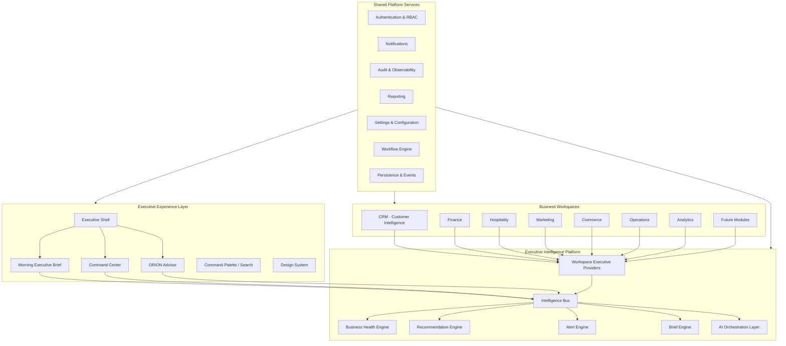

# ORION Platform Vision and Roadmap

**Document ID:** PV-001

**Version:** 1.0

**Status:** Approved for Review

**Classification:** Strategic Product Document

**Author:** Founder & Chief Architect

**Date:** 28 July 2026

**Audience:** Founder · CTO · Product · Engineering · Investors · Strategic Partners

---

> **This is not an engineering specification.**  
> It is the master product roadmap that guides future development.  
> Implementation detail lives in Engineering Specifications (ES-xxx), Architecture Baselines, and Release Records (RR-xxx).

**Related documents:**

| Document | Location |
|----------|----------|
| Product Constitution v1.0 | [ORION_Product_Constitution.md](../01_Product/ORION_Product_Constitution.md) |
| Engineering Manifesto v1.0 | [ORION_Engineering_Manifesto.md](../09_Standards/ORION_Engineering_Manifesto.md) |
| Project Charter | [ORION_Project_Charter.md](../00_BLUEPRINT/ORION_Project_Charter.md) |
| Architecture Baseline v1.0 | [ORION_v1.0_Architecture_Baseline.md](../03_Architecture/ORION_v1.0_Architecture_Baseline.md) |
| Technical Roadmap (ES-051) | [ES-051-ORION-Technical-Roadmap-Product-Evolution-Strategy.md](../02_Engineering/ES-051-ORION-Technical-Roadmap-Product-Evolution-Strategy.md) |
| Product Bible | [ORION_Product_Bible.md](../00_BLUEPRINT/ORION_Product_Bible.md) |

---

# 1. Executive Vision

## What ORION Is

ORION is an **Executive Operating System** — a unified platform that transforms business information into executive intelligence and actionable guidance.

ORION is **not** a dashboard application, a reporting tool, an accounting package, a CRM, or a property management system. Those capabilities exist as **modules within** the platform. ORION itself exists to help leaders **decide**, **prioritise**, and **act** with confidence.

Every morning, an executive opening ORION should understand in less than sixty seconds:

1. What happened?
2. What requires my attention?
3. Why?
4. What should I do first?
5. What can wait?

## Why ORION Exists

Businesses do not succeed because they collect more data. They succeed because leaders make better decisions.

Modern organisations suffer from:

- Fragmented systems that never speak the same language
- Dashboards that report without recommending
- AI that suggests without explaining
- Notification overload that erodes executive attention
- Decision fatigue at the moment decisions matter most

ORION exists to **reduce executive cognitive load**, **improve decision quality**, and **accelerate execution** — the three tests every product decision must pass.

## Long-Term Mission

**Build the world's most trusted Executive Operating System.**

Over the next decade, ORION shall become the daily operating environment for founders, CEOs, and executive teams — the place where business health is understood, priorities are clear, recommendations are explainable, and action is one deliberate step away.

---

# 2. Product Philosophy

ORION is governed by a product philosophy that prioritises the executive mind above all else.

## Executive Operating System

ORION is platform-first. Workspaces are modules. Intelligence is shared. Experience is unified. The executive never learns a new product for each business domain — they learn one operating system that adapts to each domain.

## Intelligence Before Information

Information tells you what exists. Intelligence tells you what matters.

ORION shall always present **ranked, contextual, actionable intelligence** before raw data. Reports and exports exist to support decisions — they are never the primary experience.

## Decision Support

Every screen must answer:

- What does the executive need to know?
- Why does it matter?
- What action should be taken?

Every recommendation must answer:

- What happened?
- Why did it happen?
- What should I do?
- What happens if I do nothing?

## Calm by Design

ORION should feel like a trusted advisor in a quiet room — not a trading floor at market open.

- No unnecessary colour, motion, or notification
- Progressive disclosure over information density
- Attention is protected, not harvested
- Whitespace and hierarchy are features, not waste

## Explainable AI

AI assists executive judgement. It never replaces executive responsibility.

Every AI-generated or AI-enhanced output must provide:

- Reason and evidence
- Confidence level
- Source attribution
- Recommended action

Deterministic business rules produce consistent results. AI enhances — it does not obscure.

## Executive Trust

Trust is everything. Executives must trust every number, every recommendation, and every alert.

- One authoritative source per metric
- No duplicate calculations across workspaces
- Auditability of intelligence outputs
- Transparent lifecycle states (fresh, stale, incomplete)

---

# 3. Platform Architecture Vision

ORION is a **modular platform** composed of independent Business Workspaces sharing one **Executive Intelligence layer** and one **Executive Experience shell**.

## Workspace Relationships

| Surface | Role | Relationship |
|---------|------|--------------|
| **Morning Executive Brief** | Daily orientation | Aggregates intelligence from all providers into one decision-urgency narrative. The executive's first screen each day. |
| **Command Center** | Operational command | Real-time snapshot, alerts, recommendations, and action controls. The executive's working surface after orientation. |
| **CRM** | Relationship intelligence | Contributes customer health, pipeline, follow-ups, and relationship risk to the shared Brief and Recommendation Engine. |
| **Finance** | Financial intelligence | Contributes cash, revenue, payables, and forecast signals to executive priorities. |
| **Commerce** | Revenue & product intelligence | Future: product performance, channel economics, inventory signals. |
| **Hospitality** | Guest & property intelligence | Occupancy, guest experience, operational health for hospitality operators. |
| **Marketing** | Growth intelligence | Campaign performance, channel attribution, lead pipeline. |
| **Operations** | Execution intelligence | Future: supply chain, staffing, SLA, process health. |
| **Analytics** | Cross-domain intelligence | Future: unified metrics layer, trend synthesis, executive dashboards. |
| **Future Modules** | Extensible domains | Built on the same workspace pattern (ADR-005), provider contract (ADR-006), and Design System. |

**Principle:** Workspaces generate intelligence. The platform aggregates it. The Experience presents it. No workspace owns the executive morning.

---

# 4. Shared Platform Services

All workspaces consume shared platform services. Workspace-specific logic lives in workspace modules; cross-cutting capability lives in the platform.

| Service | Purpose | Current State |
|---------|---------|---------------|
| **Executive Intelligence** | Provider registry, Intelligence Bus, health/recommendation/brief engines | **Delivered (foundation)** · Missions 17A–17B |
| **Notifications** | Actionable, timely alerts — never noise | **Partial** · UI patterns · Alert Engine specified |
| **Recommendations** | Ranked, explainable, capped executive guidance | **Delivered (foundation)** · ES-029 · progressive disclosure in Brief |
| **Search** | Command Palette, universal navigation | **Delivered** · Mission 14C |
| **Authentication** | Identity, session, secure access | **Foundation delivered** · ES-009 · ES-037 |
| **RBAC** | Role-based access per workspace and action | **Prepared** · route metadata · enforcement pending |
| **Audit** | Immutable activity and intelligence audit trail | **Foundation delivered** · ES-038 |
| **Reporting** | Executive and operational report generation | **Partial** · workspace report placeholders |
| **Settings** | Platform and workspace configuration | **Partial** · Configuration workspace |
| **Design System** | Unified typography, spacing, colour, components | **Delivered** · workspace tokens · shared UI library |
| **AI Layer** | Orchestrated AI with explainability contracts | **Foundation delivered** · deterministic-first · ES-039 |
| **Workflow Engine** | Cross-workspace tasks, approvals, delegation | **Planned** · Phase 4 |

**Rule:** If a capability serves more than one workspace, it is a platform service — not a workspace feature.

---

# 5. Five-Year Roadmap

The roadmap is organised into five phases. Phases overlap; value is delivered incrementally. Detailed sprint mapping lives in [ES-051](../02_Engineering/ES-051-ORION-Technical-Roadmap-Product-Evolution-Strategy.md).

---

## Phase 1 — Foundation (Year 1)

**Objective:** Establish the platform architecture, Executive Experience, and first Business Workspaces.

| Deliverable | Intent | Status |
|-------------|--------|--------|
| Executive Shell & Design System | Unified executive environment | **Delivered** |
| Morning Executive Brief | Daily decision-orientation surface | **Delivered** |
| Command Center | Operational intelligence surface | **Delivered** |
| Executive Intelligence Platform | Provider framework, Intelligence Bus | **Delivered (foundation)** |
| Finance Workspace | Financial executive intelligence | **Delivered (overview)** |
| CRM Workspace | Customer & relationship intelligence | **Delivered (v1.0)** |
| Hospitality & Marketing Workspaces | Domain overviews | **Partial** |
| Persistence, Identity, Audit foundations | Enterprise readiness | **Foundation delivered** |
| Verification & governance | ADRs, ES programme, release records | **Delivered** |

**Exit criteria:** Executive can open ORION, read the Brief, act in Command Center, and drill into Finance and CRM — all on one platform with shared intelligence.

---

## Phase 2 — Executive Intelligence (Year 2)

**Objective:** Mature the intelligence layer; unify recommendations, health, and alerts across all workspaces.

| Deliverable | Intent |
|-------------|--------|
| Unified Recommendation Engine | Single ranking, grouping, and capping model across all surfaces |
| Business Health Engine (runtime) | Live cross-domain health synthesis |
| Alert Engine (runtime) | Platform alert lifecycle, deduplication, severity routing |
| Trend Engine | Material change detection for Brief overnight deltas |
| CRM & Finance API integration | Replace placeholder data (TD-002) |
| Executive Dashboard (ES-022) | Unified EP-002 dashboard wired to live intelligence |
| Explainability at scale | Evidence, confidence, and "why" on every recommendation |
| RBAC enforcement | Workspace and action permissions live |

**Exit criteria:** Every workspace contributes to one Brief; recommendations are consistent, explainable, and capped everywhere.

---

## Phase 3 — Commerce & Hospitality (Year 3)

**Objective:** Expand domain coverage; connect operational workspaces to executive intelligence.

| Deliverable | Intent |
|-------------|--------|
| Commerce Workspace | Product, channel, and revenue intelligence |
| Hospitality Workspace (full) | PMS integration, guest intelligence, operational KPIs |
| Marketing Workspace (full) | Campaign ROI, attribution, pipeline contribution |
| Operations Workspace | Cross-functional execution health |
| Analytics Workspace | Unified metrics catalogue, executive trend synthesis |
| Provider marketplace (foundation) | Third-party data and intelligence providers |
| Multi-entity support | Groups, brands, properties under one executive view |

**Exit criteria:** A multi-domain operator runs daily executive rhythm entirely within ORION.

---

## Phase 4 — Automation (Year 4)

**Objective:** Close the loop from recommendation to execution.

| Deliverable | Intent |
|-------------|--------|
| Workflow Engine | Approvals, delegation, task routing across workspaces |
| Recommendation actions (live) | Act, Delegate, Snooze, Complete — persisted and auditable |
| Event & messaging backbone | Real-time intelligence refresh, cross-workspace events |
| Integration hub | ERP, PMS, CRM, finance, marketing connectors at scale |
| AI agents (governed) | Autonomous preparation; human approval for execution |
| Executive networking graph | Relationship and opportunity intelligence across entities |

**Exit criteria:** ORION not only recommends — it orchestrates execution with executive oversight.

---

## Phase 5 — Predictive Executive Operating System (Year 5+)

**Objective:** Anticipate; do not merely report.

| Deliverable | Intent |
|-------------|--------|
| Predictive intelligence | Forecast scenarios, risk probability, opportunity timing |
| Executive simulation | "What if" modelling across finance, CRM, and operations |
| Autonomous brief preparation | AI synthesises overnight; executive validates |
| Partner ecosystem & marketplace | Third-party workspaces and intelligence modules |
| Global deployment | Multi-region, multi-language, regulatory compliance |
| Industry templates | Pre-configured workspace bundles by vertical |

**Exit criteria:** ORION is the predictive operating layer for the enterprise — trusted, explainable, and indispensable.

---

# 6. Guiding Principles

Every future workspace, feature, and release must comply with the foundational documents of ORION.

## Product Constitution (Summary)

| Principle | Requirement |
|-----------|-------------|
| Executive First | Every feature serves executive decision-making |
| Clarity Before Complexity | Complexity inside the platform; clarity on the screen |
| Questions Before Features | No feature without a real executive question |
| Recommendations Before Reports | Guidance over endless reports |
| One Truth | One authoritative source per metric |
| Explainable Intelligence | Why, how, evidence, confidence, outcome |
| Attention is Precious | Never overload the executive |
| Calm Software | Purposeful elements only |
| AI Assists | AI supports; never replaces responsibility |
| Trust is Everything | Accuracy is non-negotiable |

**Full text:** [ORION Product Constitution v1.0](../01_Product/ORION_Product_Constitution.md)

## Engineering Manifesto (Summary)

| Principle | Requirement |
|-----------|-------------|
| Architecture First | No feature without architectural purpose |
| Simplicity Wins | Simplest correct solution |
| Readable Code | Written for people first |
| Single Responsibility | One reason to change |
| Composition Over Duplication | Reuse shared components and services |
| Deterministic Before Intelligent | Business rules before AI |
| Platform Before Features | Strengthen shared layer first |
| Test What Matters | Meaningful verification |
| Performance as a Feature | Fast is a requirement |
| Long-Term Maintainability | Decades, not sprints |

**Full text:** [ORION Engineering Manifesto v1.0](../09_Standards/ORION_Engineering_Manifesto.md)

## Workspace Compliance Checklist

Every new Business Workspace must:

1. Live under the Executive Shell (`app/(platform)/`)
2. Follow the Business Workspace Pattern (ADR-005)
3. Register an Executive Provider (ADR-006)
4. Contribute to the Morning Executive Brief
5. Use the Design System exclusively — no bespoke styling
6. Expose business logic through a service facade — no logic in pages
7. Use placeholder or live data through repository contracts — never hard-coded page data
8. Pass the Verification Hierarchy (typecheck, lint, test, build)
9. Ship a Release Record (RR-xxx) and Engineering Specification (ES-xxx)
10. Document known limitations and technical debt honestly

---

# 7. Success Metrics

ORION success is measured by executive outcomes and platform health — not feature count.

## Executive Outcomes

| Metric | Definition | Target Direction |
|--------|------------|------------------|
| **Decision speed** | Time from opening ORION to first executive action | Decrease |
| **Brief completion rate** | Executives who reach Brief closure daily | Increase |
| **Recommendation action rate** | Recommendations acted upon vs dismissed | Increase |
| **Alert signal-to-noise** | Critical alerts / total alerts surfaced | Increase ratio |
| **Executive adoption** | Daily and weekly active executive users | Increase |
| **Time to orientation** | Seconds to answer "what requires attention" | ≤ 60 seconds |

## Intelligence Quality

| Metric | Definition | Target Direction |
|--------|------------|------------------|
| **Recommendation accuracy** | Actions that produced positive outcome (tracked) | Increase |
| **Explainability coverage** | Recommendations with evidence and confidence | 100% |
| **Intelligence freshness** | Brief and Command Center sync latency | Decrease |
| **Cross-workspace consistency** | Same signal, same rank across surfaces | Increase |

## Platform Health

| Metric | Definition | Target Direction |
|--------|------------|------------------|
| **Platform reuse** | Shared components vs workspace-specific duplicates | Increase reuse |
| **Code quality** | Lint clean, typecheck strict, test coverage on critical paths | Maintain |
| **Performance** | Core Web Vitals, Brief load time, Command Center render | Improve |
| **Maintainability** | Technical debt register trend, ADR compliance | Improve |
| **Accessibility** | WCAG 2.1 AA on executive surfaces | Compliant |
| **Release reliability** | Verification hierarchy pass rate per release | 100% |

## Customer Satisfaction

| Metric | Definition | Target Direction |
|--------|------------|------------------|
| **Executive NPS** | Would you recommend ORION to a peer CEO? | Increase |
| **Trust score** | Executive confidence in numbers and recommendations | Increase |
| **Support burden** | Executive-reported confusion or misorientation | Decrease |

---

# 8. Closing Vision

## The Next Decade

ORION shall become the **institutional memory and forward intelligence** of the enterprise.

A founder opening ORION in 2036 should experience what a founder opening ORION today aspires to:

- Immediate clarity on business health
- Calm confidence that nothing critical was missed
- Explainable guidance on what to do next
- One platform that knows their business — not ten tabs that fragment it

ORION will not replace executives. It will **amplify** them — giving every leader, regardless of organisation size, access to the quality of intelligence previously reserved for the largest and best-resourced companies.

## What Success Looks Like

When ORION has fulfilled its vision:

- The Morning Executive Brief is the first screen of every executive's day
- Decisions are faster, better informed, and auditable
- Workspaces contribute intelligence; none compete for attention
- AI is trusted because it is explainable
- The platform grows by adding modules — not rebuilding foundations
- Engineers maintain ORION with pride because architecture endures

**ORION is not software that executives use.**

**ORION is how executives run their business.**

---

# Document Control

| Field | Value |
|-------|-------|
| **Version** | 1.0 |
| **Next review** | Q1 2027 |
| **Owner** | Founder & Chief Architect |
| **Change process** | Founder approval required for principle or phase changes |

---

# References

| Document | Purpose |
|----------|---------|
| [ORION Product Constitution](../01_Product/ORION_Product_Constitution.md) | Immutable product principles |
| [ORION Engineering Manifesto](../09_Standards/ORION_Engineering_Manifesto.md) | Engineering philosophy |
| [ORION v1.0 Architecture Baseline](../03_Architecture/ORION_v1.0_Architecture_Baseline.md) | Frozen Phase I architecture |
| [ES-051 Technical Roadmap](../02_Engineering/ES-051-ORION-Technical-Roadmap-Product-Evolution-Strategy.md) | Engineering phase mapping |
| [ORION Project Charter](../00_BLUEPRINT/ORION_Project_Charter.md) | Authorisation and scope |
| [ADR-005 Business Workspace](../10_Decisions/ADR-005-Business-Workspace-Architecture.md) | Workspace pattern |
| [ADR-006 Executive Provider](../10_Decisions/) | Intelligence contribution contract |
