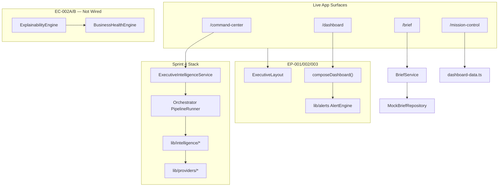

# Architecture Audit — ORION v0.4.0

**Document ID:** AA-2026-001  
**Sprint:** Sprint 0 — Architecture Audit  
**Classification:** Engineering Architecture Review  
**Version:** 1.0.0  
**Status:** READY FOR FOUNDER REVIEW  
**Author:** ORION CTO  
**Date:** 2026-07-27  
**Baseline:** Git tag `v0.4.0` · commit `c71df53` · branch `main`

**Governed by:**

- [ORION Constitution](../00_PROJECT/ORION_CONSTITUTION.md)
- [ORION Architecture Handbook](../03_Architecture/ORION_Architecture_Handbook.md)
- [ORION Engineering Principles](../09_Standards/ORION_Engineering_Principles.md)
- [Foundation Readiness Audit](../07_Engineering/Foundation_Readiness_Audit.md)
- [Post-Governance Action Items](../00_PROJECT/Post-Governance-Action-Items.md)

**Related specifications:**

- EP-001 Executive Platform Framework
- EP-002 Executive Dashboard
- EP-003 Executive Notification & Alert Center
- EC-002A Business Health Engine Core
- EC-002B Explainability & Confidence Engine
- EC-001 Morning Executive Brief

---

# 1. Executive Summary

ORION v0.4.0 delivers a **credible executive platform scaffold** — EP-001 shell, EP-002 configuration-driven dashboard, EP-003 alert center, EC-002A/B engines with strong test coverage — on top of a **mature Sprint 4 orchestrator stack** (`/command-center`, provider framework, plugins, integrations).

The platform **passes all quality gates** (typecheck, lint, 283 tests, production build). However, the codebase operates as **multiple parallel executive data paths** rather than a single unified architecture:

| Path | Route | Data source |
|------|-------|-------------|
| A — Orchestrator (Sprint 4) | `/command-center` | `ExecutiveIntelligenceService` → providers |
| B — EP-002 Dashboard | `/dashboard` | Mock `composeDashboard()` |
| C — EC-001 Brief | `/brief` | `MockBriefRepository` (default) |
| D — Legacy static | `/mission-control`, workspaces | `lib/*-data.ts` |
| E — EC-002A/B (isolated) | Tests only | `BusinessHealthEngine` → `ExplainabilityEngine` |

**Verdict:** v0.4.0 is **alpha-ready for internal development and Founder review**. It is **not production-ready** until executive paths are consolidated, EC-002A/B are wired to live surfaces, and legacy stacks are retired or quarantined.

**Overall Readiness Score: 62 / 100** (see §9)

---

# 2. Current Architecture

## 2.1 Layer Model

```
┌─────────────────────────────────────────────────────────────────┐
│  app/(platform)/          Next.js App Router (33 routes)      │
├─────────────────────────────────────────────────────────────────┤
│  components/              UI by domain (globals, dashboard,     │
│                           alerts, command-center, executive)    │
├─────────────────────────────────────────────────────────────────┤
│  lib/                     Domain logic & engines              │
│    platform/   EP-001 contracts + in-memory services            │
│    navigation/ EP-001 registry + breadcrumbs                    │
│    dashboard/  EP-002 composition + mock state                  │
│    alerts/     EP-003 mock alert engine                         │
│    business-health/  EC-002A scoring pipeline                   │
│    explainability/   EC-002B confidence + narrative             │
│    orchestrator/     Sprint 4 pipeline coordinator              │
│    intelligence/     Sprint 4 engines (health, brief, alert)    │
│    executive/brief/  EC-001 service boundary                    │
│    providers/        Provider framework + GA4                   │
│    persistence/      ES-010 in-memory repositories              │
│    auth/             Placeholder session/RBAC                   │
├─────────────────────────────────────────────────────────────────┤
│  types/                   Shared contracts                    │
│    executive/   EC-000 partial                                  │
│    intelligence.ts, alerts.ts, providers.ts                   │
├─────────────────────────────────────────────────────────────────┤
│  tests/                   53 test files · 283 tests             │
└─────────────────────────────────────────────────────────────────┘
```

## 2.2 Folder Structure Summary

| Area | Count / scope | Notes |
|------|---------------|-------|
| `app/` | 2 route groups: `(auth)`, `(platform)` | 33 pages; **0 API routes** |
| `lib/` | 18 domain subdirs + 21 root `*-data.ts` files | Dual intelligence + static fixtures |
| `components/` | 20+ domain subdirs | EP-001 shell live; legacy layout orphaned |
| `types/` | Root + `executive/` partial EC-000 | Three parallel alert/health type systems |
| `docs/` | 210+ markdown files across 22 folders | Split `01_Engineering` vs `02_Engineering` namespaces |
| `tests/` | 53 files mirroring lib domains | No E2E suite |

## 2.3 Executive Data Flow (as deployed)



## 2.4 Public API Surfaces (barrel exports)

| Module | Barrel | Completeness |
|--------|--------|--------------|
| `lib/platform/` | `index.ts` | **Complete** — EP-001 contracts + services |
| `lib/navigation/` | `index.ts` | **Complete** |
| `lib/dashboard/` | `index.ts` | **Complete** — includes mock exports |
| `lib/alerts/` | `index.ts` | **Complete** |
| `lib/explainability/` | `index.ts` | **Complete** |
| `lib/business-health/` | `index.ts` | **Complete** |
| `lib/intelligence/` | `index.ts` | **Incomplete** — omits `ExecutiveIntelligenceService`, alert/brief engines |
| `lib/orchestrator/` | — | **Missing barrel** |
| `lib/providers/` | — | **Missing barrel** |
| `lib/executive/` | `brief/index.ts` only | **Partial** |

## 2.5 Dependency Direction

**Intended:** `app → components → lib (barrels) → engines → types`

**Observed violations:**

| Severity | Violation | Example |
|----------|-----------|---------|
| High | `lib → components` | `lib/dashboard/WidgetRegistry.ts` imports `@/components/dashboard/widgets/*` |
| High | `types → lib` | `types/intelligence.ts` imports `HealthStatus` from `lib/command-center-data` |
| Medium | UI → engine internals | `command-center/page.tsx` deep-imports `ExecutiveIntelligenceService` |
| Medium | UI → legacy bus | Advisor components import `lib/intelligence/intelligence-bus` |
| Medium | Parallel registries | `lib/providers/ProviderRegistry` vs `lib/intelligence/provider-registry` |

**Clean boundaries (confirmed):**

- EC-002B → EC-002A only (`lib/explainability` → `lib/business-health`; no reverse import)
- EP-003 alert module is self-contained under `lib/alerts/`
- EP-001 platform contracts do not import UI

---

# 3. Strengths

1. **Quality gate discipline** — typecheck, lint, 283 tests, and production build all pass on v0.4.0 baseline.
2. **EP-001 platform shell is live** — `ExecutiveLayout`, `NavigationRegistry`, widget framework, platform route boundaries (`loading`, `error`, `not-found`).
3. **Configuration-driven dashboard (EP-002)** — `DashboardComposer`, layout config, widget registry pattern enables additive modules without page rewrites.
4. **Deterministic alert center (EP-003)** — deduplication, prioritization, filtering, and empty-state UX with full unit/integration test coverage.
5. **EC-002A/B engine quality** — `lib/business-health/` and `lib/explainability/` are well-structured, barrel-exported, and tested (~94% module coverage for explainability).
6. **Orchestrator pipeline (Sprint 4)** — clear entry point (`getDashboardSnapshot()`), provider framework, plugin lifecycle, integration center.
7. **EC-001 service boundary** — `BriefService` + repository pattern with `OrchestratorBriefRepository` ready for wiring.
8. **Documentation governance complete** — constitution ratified, ADR framework, documentation freeze (26 Jul 2026).
9. **Test mirroring** — tests follow lib domain structure (`tests/lib/alerts`, `tests/platform`, `tests/explainability`).

---

# 4. Findings

## 4.1 Folder Structure & Module Boundaries

| ID | Finding | Severity |
|----|---------|----------|
| F-01 | Five parallel executive data paths (orchestrator, EP-002 mock, EC-001 mock, legacy static, EC-002 isolated) | **Critical** |
| F-02 | 21 root-level `lib/*-data.ts` static fixtures coexist with service-layer modules | **High** |
| F-03 | `lib/executive/` contains only `brief/` — no unified executive service layer per EMP | **High** |
| F-04 | Missing barrels for `lib/orchestrator/` and `lib/providers/` | **Medium** |
| F-05 | Workspace components duplicated across `crm/`, `finance/`, `hospitality/`, `marketing/` | **Medium** |

## 4.2 Naming & Duplication

| ID | Finding | Locations |
|----|---------|-----------|
| F-06 | **Duplicate `AlertEngine`** | `lib/alerts/engine/` (EP-003) vs `lib/intelligence/alerts/` (Sprint 4) |
| F-07 | **Duplicate `AlertCard`** | `components/alerts/` vs `components/dashboard/` |
| F-08 | **Duplicate `WidgetRegistry`** | `lib/dashboard/` (renderers) vs `components/dashboard/` (metadata) |
| F-09 | **Duplicate `DashboardLayout`** | `components/layout/` (orphaned) vs `app/(platform)/dashboard/` (EP-002) |
| F-10 | **Three health score type families** | `lib/business-health/models`, `lib/intelligence/models`, `types/executive/health` |
| F-11 | **Three alert type systems** | `lib/alerts/models`, `types/alerts`, `types/intelligence` |
| F-12 | Aggregation logic duplicated 4× | `provider-aggregation`, `dashboard-aggregator`, orchestrator, alert engine |

## 4.3 Dead Code & Legacy

| Asset | Status |
|-------|--------|
| `components/layout/DashboardLayout.tsx` | **Orphaned** — zero importers; superseded by `ExecutiveLayout` |
| `components/layout/Sidebar.tsx`, `Header.tsx` | **Orphaned** — only used by orphaned layout |
| `components/dashboard/AlertPanel.tsx` | **Test-only** — not used in live routes |
| `OrchestratorBriefRepository` | **Implemented, unwired** — `BriefService` defaults to mock |
| `lib/business-health/*`, `lib/explainability/*` | **Zero app/component consumers** |
| `lib/intelligence/index.ts` barrel | **Unused** — no `@/lib/intelligence` imports |
| `/dashboard` route | **Not in navigation** — EP-002 surface hidden from sidebar |

## 4.4 Circular Imports

No hard circular import cycles detected. **Initialization-order risks** exist:

- `intelligence-bus.ts` side-effect-imports `register-executive-providers` at module load
- Tight coupling: `provider-registry` ↔ `pipeline` ↔ `brief-engine` (type-only back-edge)

## 4.5 Feature Isolation

| Feature | Code quality | App integration |
|---------|-------------|-----------------|
| EP-001 Platform | ✅ Strong | ✅ Live (`ExecutiveLayout`) |
| EP-002 Dashboard | ✅ Strong | ⚠️ Live but mock-only; not in nav |
| EP-003 Alert Center | ✅ Strong | ⚠️ Widget on `/dashboard` only; parallel to Sprint 4 alerts |
| EC-002A Health | ✅ Strong | ❌ Not wired — Sprint 4 uses `health-engine.ts` |
| EC-002B Explainability | ✅ Strong | ❌ Not wired — UI uses mock `types/executive` shapes |
| EC-001 Brief | ✅ Service boundary | ⚠️ Mock repository default |
| Sprint 4 Orchestrator | ✅ Production path | ✅ `/command-center` |

## 4.6 Documentation Consistency

| ID | Finding |
|----|---------|
| F-13 | **ES-011 collision** — Platform Services (`docs/02_Engineering/`) vs Morning Executive Brief (`docs/01_Engineering/`) |
| F-14 | **ES-010 collision** — Persistence Foundation vs Explainability Confidence Engine |
| F-15 | Engineering standards reference legacy `DashboardLayout`; runtime uses `ExecutiveLayout` |
| F-16 | `package.json` version `0.2.0` vs git tag / docs reference `v0.4.0` |
| F-17 | Split doc namespaces (`01_Engineering`, `02_Engineering`, `07_Engineering`) increase discovery friction |

---

# 5. Risks

| Risk | Impact | Likelihood | Mitigation |
|------|--------|------------|------------|
| **Dual-architecture drift** — EP and Sprint 4 stacks diverge further | High | High | ADR + consolidation sprint before EC-003 brief wiring |
| **Wrong health engine in production** — EC-002A bypassed for Sprint 4 `health-engine` | High | Medium | Wire EC-002A into orchestrator or formally deprecate legacy engine |
| **Alert domain confusion** — three alert stacks, three type systems | High | High | Unified alert facade; rename EP-003 or Sprint 4 engines |
| **Mock-default brief** — executives see stale mock data on `/brief` | Medium | Certain (today) | Switch `BriefService` default to `OrchestratorBriefRepository` |
| **lib→components coupling** — breaks layering if dashboard widgets grow | Medium | Medium | Move renderer wiring to app/components layer |
| **Hidden `/dashboard`** — EP-002 not discoverable | Low | Certain | Add to nav or document as dev-only |
| **No E2E tests** — regressions caught only by unit tests | Medium | Medium | Add Playwright smoke suite for executive paths |
| **Placeholder auth** — no real tenant isolation | High | Certain | ES-009 implementation before production |

---

# 6. Technical Debt

| Item | Origin | Effort | Priority |
|------|--------|--------|----------|
| Consolidate executive data paths (5 → 1–2) | Sprint 4 + EP-001/002/003 | 2–3 sprints | P0 |
| Wire EC-002A into orchestrator | EC-002A vs Sprint 4 parallel | 1 sprint | P0 |
| Wire EC-002B to brief/dashboard UI | EC-002B complete, UI mock | 1 sprint | P1 |
| Unify alert domain (EP-003 + Sprint 4) | EP-003 parallel implementation | 1 sprint | P1 |
| Retire legacy layout shell | EP-001 supersession | 0.5 sprint | P1 |
| Retire `/mission-control` static stack | Legacy surface | 0.5 sprint | P2 |
| Migrate `lib/*-data.ts` to services | Pre-Sprint 4 fixtures | Ongoing | P2 |
| Complete `lib/intelligence/index.ts` barrel | Incomplete public API | 0.5 sprint | P2 |
| Resolve doc ID collisions (ES-010, ES-011) | Split namespaces | 0.5 sprint | P2 |
| Add orchestrator/providers barrels | Missing public APIs | 0.5 sprint | P3 |
| Fix `types/intelligence.ts → lib` import | Layer violation | 0.5 sprint | P2 |
| Sync `package.json` version to v0.4.0 | Version drift | Trivial | P3 |

**Estimated total consolidation debt:** 4–6 sprints before production executive programme (EC-003 through EC-005).

---

# 7. Recommendations

## 7.1 Immediate (Sprint 1 post-audit)

1. **ADR: Executive Data Path Consolidation** — declare orchestrator as canonical runtime; EP-002/003 as composition layer over unified snapshot types.
2. **Add `/dashboard` to `NavigationConfig`** or formally mark dev-only in ES-022.
3. **Quarantine legacy shell** — move `components/layout/DashboardLayout`, `Sidebar`, `Header` to `components/_legacy/` or delete after confirmation.
4. **Rename conflicting engines** — e.g. `ExecutiveAlertEngine` (EP-003) vs `IntelligenceAlertEngine` (Sprint 4) to eliminate import ambiguity.

## 7.2 Short-term (Sprints 2–3)

5. **Wire EC-002A** — replace `lib/intelligence/health-engine.ts` usage in orchestrator with `BusinessHealthEngine` adapter.
6. **Wire EC-001 to orchestrator** — default `BriefService` to `OrchestratorBriefRepository`.
7. **Extract widget renderer wiring** — move `lib/dashboard/WidgetRegistry` component imports to `app/(platform)/dashboard/` or `components/dashboard/registry.tsx`.
8. **Unified executive snapshot type** — extend `types/executive/snapshot.ts` as single contract for dashboard, brief, and command center.

## 7.3 Medium-term (Sprints 4–6)

9. **Wire EC-002B** — connect `ExplainabilityEngine` to `ExplainabilityDrawer` and confidence widgets.
10. **Merge alert stacks** — EP-003 `AlertCenter` consumes Sprint 4 `AlertBundle` via adapter; retire duplicate mock path in production.
11. **Complete executive service layer** — scaffold `lib/executive/{health,recommendations,snapshot}/` per Engineering Master Plan.
12. **E2E smoke suite** — `/brief`, `/command-center`, `/dashboard` happy paths.

## 7.4 Documentation

13. **Renumber or prefix colliding doc IDs** — e.g. `ES-011-MEB` (Morning Executive Brief) vs `ES-011-PSF` (Platform Services).
14. **Update Engineering Standards** — reference `ExecutiveLayout` not `DashboardLayout`.
15. **Align `package.json` version** with release tag convention.

---

# 8. Priority Matrix

| Priority | Item | Impact | Effort | Owner |
|----------|------|--------|--------|-------|
| **P0** | Consolidate executive data paths | Critical | Large | CTO + Architect |
| **P0** | Wire EC-002A into orchestrator | Critical | Medium | Engineering |
| **P0** | ADR: canonical data path | Critical | Small | Architect |
| **P1** | Wire EC-001 to orchestrator | High | Medium | Engineering |
| **P1** | Unify alert domain | High | Medium | Engineering |
| **P1** | Retire legacy layout shell | Medium | Small | Engineering |
| **P1** | Wire EC-002B to UI | High | Medium | Engineering |
| **P2** | Fix lib→components layering | Medium | Small | Engineering |
| **P2** | Resolve doc ID collisions | Medium | Small | CTO |
| **P2** | Add `/dashboard` to nav | Low | Trivial | Product |
| **P2** | E2E smoke tests | Medium | Medium | QA |
| **P3** | Add missing barrels | Low | Small | Engineering |
| **P3** | Sync package version | Low | Trivial | Engineering |

```
         HIGH IMPACT
              │
    P0 ●      │      ● P0
  Consolidate │  EC-002A wire
              │
    P1 ●      │      ● P1
  EC-001 wire │  Alert unify
              │
    P2 ●      │      ● P2
  Layering    │  E2E tests
              │
         LOW IMPACT ────────────── HIGH EFFORT
              LOW EFFORT
```

---

# 9. Overall Readiness Score

Scores are 0–100. Grades: A ≥90 · B ≥80 · C ≥70 · D ≥60 · F <60

| Dimension | v0.4.0 Score | Grade | Delta vs FRA-2026-001 | Notes |
|-----------|-------------:|-------|----------------------|-------|
| Engineering Readiness | **68** | D+ | +16 | EP-001/002/003, 283 tests |
| Architecture Readiness | **58** | F | +3 | Parallel stacks remain |
| Frontend Readiness | **72** | C | +6 | EP shell live; still fragmented |
| Backend Readiness | **44** | F | 0 | No API routes; placeholder auth |
| AI Layer Readiness | **24** | F | 0 | No copilot service |
| Integration Readiness | **72** | C+ | 0 | Provider framework solid |
| Testing Readiness | **70** | C | +12 | 283 unit tests; no E2E |
| Deployment Readiness | **38** | F | 0 | CI only |
| Documentation Readiness | **65** | D | +5 | Governance complete; ID collisions |
| **Overall Readiness** | **62** | **D** | **+14** | Alpha-ready; not production-ready |

### Score interpretation

- **62/100 — Alpha Platform (D)** — Safe for internal development, Founder demos, and continued EP/EC vertical slices.
- **Not ready** for external production, multi-tenant deployment, or EC-003+ programme without P0 consolidation.
- **Strength concentration:** test discipline, EP framework, engine module quality.
- **Weakness concentration:** runtime fragmentation, unwired EC-002A/B, missing executive API layer.

---

# Validation Results

Audit performed **2026-07-27** on tag `v0.4.0` baseline. **No production code modified.**

| Command | Result | Details |
|---------|--------|---------|
| `npm run typecheck` | **PASS** | `tsc --noEmit` — 0 errors |
| `npm run lint` | **PASS** | 0 errors · 1 pre-existing warning (`coverage/block-navigation.js`) |
| `npm test` | **PASS** | 53 files · **283 tests** · 0 failures |
| `npm run build` | **PASS** | 33 routes compiled · `/dashboard` static |

---

# Files Reviewed

## Application & routing
- `app/(platform)/layout.tsx`, `page.tsx`, `loading.tsx`, `error.tsx`, `not-found.tsx`
- `app/(platform)/dashboard/*`, `brief/*`, `command-center/page.tsx`, `mission-control/page.tsx`

## EP-001 Platform Framework
- `components/globals/*`
- `lib/navigation/*`, `lib/navigation.ts`
- `lib/platform/index.ts`, `EventBus.ts`, `FeatureRegistry.ts`, `FeatureFlags.ts`, `PlatformContext.ts`

## EP-002 Executive Dashboard
- `lib/dashboard/*`, `components/dashboard/Widget*.tsx`, `components/dashboard/widgets/*`
- `app/(platform)/dashboard/DashboardLayout.tsx`

## EP-003 Alert Center
- `lib/alerts/models/*`, `lib/alerts/engine/*`, `lib/alerts/mock/*`
- `components/alerts/*`

## EC-002A / EC-002B
- `lib/business-health/*`, `lib/explainability/*`
- `tests/business-health/*`, `tests/explainability/*`

## Sprint 4 Stack
- `lib/orchestrator/*`, `lib/intelligence/*`, `lib/providers/*`
- `lib/executive/brief/*`, `components/command-center/*`

## Types & config
- `types/intelligence.ts`, `types/alerts.ts`, `types/executive/*`
- `vitest.config.ts`, `package.json`

## Documentation
- `docs/01_Engineering/*`, `docs/02_Engineering/ES-011-*`, `docs/07_Engineering/*`
- `docs/00_PROJECT/Post-Governance-Action-Items.md`
- `docs/07_Engineering/Foundation_Readiness_Audit.md`

## Tests
- `tests/platform/*`, `tests/lib/dashboard/*`, `tests/lib/alerts/*`, `tests/components/alerts/*`

**Total scope:** ~131 files in v0.4.0 commit · 210+ doc files · 53 test files reviewed representatively.

---

# Suggested Improvements (Summary)

1. **One canonical executive snapshot** feeding `/command-center`, `/dashboard`, and `/brief`.
2. **Wire EC-002A/B** — engines are built; integration is the gap.
3. **Retire or quarantine** legacy layout, static mission-control, and orphaned alert panels.
4. **Resolve naming collisions** — AlertEngine, AlertCard, WidgetRegistry, DashboardLayout, ES-010/ES-011.
5. **Fix layering violations** — `lib/dashboard/WidgetRegistry → components`, `types → lib`.
6. **Complete public APIs** — intelligence, orchestrator, providers barrels.
7. **Add E2E tests** for the three executive paths.
8. **Navigation IA decision** — `/dashboard` visibility, default landing route (`/` hub vs `/brief`).

---

**Status: AWAITING FOUNDER APPROVAL**

No production code was modified during this audit. No git operations were performed.
