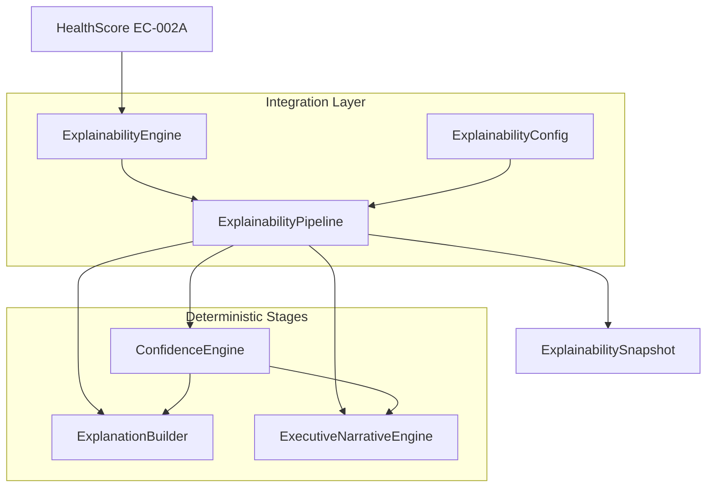

# EC-002B — Release Review

**Capability:** EC-002B — Explainability & Confidence Engine  
**Review Date:** 26 July 2026  
**Reviewer:** ORION CTO (Architecture Review)  
**Status:** Ready for Founder Approval  
**Module:** `lib/explainability/`

**References:**

- [ES-010 — Explainability & Confidence Engine](../07_Engineering/ES-010_Explainability_Confidence_Engine.md)
- [DC-010 — Development Contract](../07_Engineering/DC-010_Explainability_Confidence_Engine.md)
- [Explainability Architecture](../04_Design/Explainability_Architecture.md)
- [Explainability Integration Guide](./Explainability_Integration.md)
- [ORION Constitution](../09_Standards/ORION_Constitution_Ratified.md)

---

## Executive summary

EC-002B delivers a deterministic explainability layer that transforms EC-002A `HealthScore` output into confidence-aware, template-driven executive explanations. All five implementation phases are complete. The module passes TypeScript strict mode, ESLint, 253 unit/integration tests, and production build validation.

**Recommendation: Ready for Release** — subject to Founder approval before release commit.

---

## Architecture summary



### Component responsibilities

| Component | Responsibility | Layer |
|-----------|----------------|-------|
| `ExplainabilityEngine` | Public entry point, validation, KPI delegation | Integration |
| `ExplainabilityPipeline` | Stage orchestration, narrative merge | Integration |
| `ExplainabilityConfig` | Centralized thresholds and limits | Configuration |
| `ExplainabilityResult` | Immutable result types | Integration |
| `ConfidenceEngine` | Multi-factor confidence scoring | Engine |
| `ConfidenceCalculator` | Pure deduction algorithm | Engine |
| `ConfidenceRules` | Constants and thresholds only | Engine |
| `ExplanationBuilder` | Contributor analysis and formatting | Builder |
| `ContributionAnalyzer` | Ranking without score mutation | Builder |
| `ExplanationFormatter` | Executive-readable formatting | Builder |
| `NarrativeComposer` | Builder-phase narrative (Phase 3) | Builder |
| `ExecutiveNarrativeEngine` | Canonical executive narrative (Phase 4) | Narrative |
| Domain models | Typed bundles, no business logic | Models |

### Separation of concerns

| Rule | Status |
|------|--------|
| Scoring logic only in EC-002A | ✅ Verified |
| Confidence calculations only in `ConfidenceCalculator` | ✅ Verified |
| Template prose only in template files | ✅ Verified |
| Pipeline does not mutate `HealthScore` | ✅ Verified |
| No provider imports in explainability | ✅ Verified |
| No AI / LLM imports | ✅ Verified |

### Dependency graph

```
lib/explainability/
  → lib/business-health/models/
  → lib/business-health/engine/BusinessHealthEngine (integration only)
  ✗ No reverse imports from business-health
  ✗ No circular dependencies detected
```

### Deterministic execution

- All stages are pure functions or stateless classes with injectable config.
- No randomness, no `Date.now()` in scoring paths (reference time supplied via context).
- Identical input produces identical output — verified by repeatability tests in all major suites.
- Article IV (Deterministic Core) compliant.

---

## Completed features

| Phase | Deliverable | Status |
|-------|-------------|--------|
| 1 | Domain models (`models/`) | ✅ Complete |
| 2 | Confidence Engine (`engine/`) | ✅ Complete |
| 3 | Explanation Builder (`builder/`) | ✅ Complete |
| 4 | Executive Narrative Engine (`narrative/`) | ✅ Complete |
| 5 | Integration layer + docs | ✅ Complete |

### Functional capabilities

- Multi-factor confidence assessment with configurable deductions
- Contributor ranking (positive / negative / neutral)
- Template-driven executive narratives
- Full explainability pipeline via `ExplainabilityEngine.explain()`
- KPI-to-explain path via `ExplainabilityEngine.explainFromKPIs()`
- Immutable `ExplainabilitySnapshot` result type
- Central configuration via `ExplainabilityConfig`

---

## Review findings

### Architecture — PASS

- Component responsibilities are clearly bounded across five sub-modules.
- Integration layer correctly delegates to stage engines without embedding algorithms.
- Downward-only dependency on EC-002A confirmed.

### Code quality — PASS (minor notes)

| Item | Finding | Action |
|------|---------|--------|
| Dead code | Unused `standardInterpretation` template in `MessageTemplates.ts` | **Removed** during review |
| Duplication | Parallel template sets in `MessageTemplates.ts` and `NarrativeTemplates.ts` | Documented — deferred consolidation |
| Duplication | `NarrativeComposer` (builder) runs in pipeline but narrative is overridden by `ExecutiveNarrativeEngine` | Documented — acceptable for phase isolation |
| Naming | Consistent PascalCase types, camelCase functions across module | ✅ |
| JSDoc | Public classes documented; internal helpers partially documented | Acceptable for v1.0 |
| TypeScript | Strict mode, zero `any` in module | ✅ |

### Public API — STABLE

Primary consumer entry point:

```typescript
import {
  ExplainabilityEngine,
  DEFAULT_EXPLAINABILITY_CONFIG,
  isExplainabilitySuccess,
  type ExplainabilityEngineResult,
  type ExplainabilitySnapshot,
  type Explanation,
} from "@/lib/explainability";
```

**Breaking changes:** None — this is the initial public release of EC-002B.

**API notes for integrators:**

| Export | Stability | Notes |
|--------|-----------|-------|
| `ExplainabilityEngine` | Stable | Primary integration surface |
| `ExplainabilityPipeline` | Stable | Advanced/testing use |
| `ExplainabilityConfig` | Stable | Inject thresholds via constructor |
| Stage engines (Confidence, Builder, Narrative) | Stable | Direct use supported for testing |
| `defaultExplainabilityEngine` | Stable | Singleton convenience export |

### Testing — PASS

| Suite | Tests | Scope |
|-------|-------|-------|
| `ConfidenceEngine.test.ts` | 14 | Algorithm, clamping, levels, determinism |
| `ExplanationBuilder.test.ts` | 18 | Rankings, formatting, narratives, edge cases |
| `ExecutiveNarrativeEngine.test.ts` | 17 | Healthy, declining, mixed, confidence, templates |
| `ExplainabilityIntegration.test.ts` | 10 | End-to-end, performance, error paths |
| **Total EC-002B** | **59** | |
| **Full suite** | **253** | All pass |

#### Module coverage (v8, logic files)

| Metric | Coverage |
|--------|----------|
| Statements | 94.21% |
| Lines | 94.36% |
| Functions | 99.13% |
| Branches | 85.71% |

DC-010 target ≥ 90% — **exceeded**.

#### Edge cases covered

- Perfect / partial / missing data
- Stale KPIs, unavailable providers, validation failures
- Empty assessments
- All-positive / all-negative drivers
- Low and insufficient confidence
- Score clamping and level resolution
- Deterministic repeatability
- Pipeline performance budget (< 250ms)

### Documentation — PASS (with notes)

| Document | Alignment |
|----------|-----------|
| `ES-010` | Conceptually aligned; path differs (see limitations) |
| `DC-010` | Phases 1–5 implemented; Phases 6–8 partially deferred |
| `Explainability_Architecture.md` | Matches implementation |
| `Explainability_Integration.md` | Matches public API |

### Configuration — PASS

| Config surface | Location |
|----------------|----------|
| Confidence deductions and levels | `ConfidenceRules.ts` / `DEFAULT_CONFIDENCE_RULES` |
| Contributor importance thresholds | `ContributionAnalyzer` / `DEFAULT_CONTRIBUTION_IMPORTANCE_THRESHOLDS` |
| Highlight limit, perf budget | `ExplainabilityConfig.ts` / `DEFAULT_EXPLAINABILITY_CONFIG` |
| Builder templates | `builder/MessageTemplates.ts` |
| Executive narrative templates | `narrative/NarrativeTemplates.ts` |

No feature flags introduced. All configurable values centralized in config/rules/template files.

---

## Issues discovered

### Resolved during review

| ID | Severity | Issue | Resolution |
|----|----------|-------|------------|
| R-01 | Low | Unused `standardInterpretation` template | Removed from `MessageTemplates.ts` |
| R-02 | Low | `lib/explainability/` excluded from CI coverage glob | Added to `vitest.config.ts` coverage include |

### Open — non-blocking

| ID | Severity | Issue | Recommendation |
|----|----------|-------|----------------|
| L-01 | Low | Dual narrative paths (builder composer + narrative engine) | Consolidate in v1.1; pipeline override is intentional for Phase 5 |
| L-02 | Low | Parallel template registries (`MessageTemplates` vs `NarrativeTemplates`) | Merge into shared template module in future sprint |
| L-03 | Info | `ExplainabilityEngine.mapHealthResult` error branch partially uncovered | Add test in next maintenance window |
| L-04 | Info | JSDoc sparse on internal pure functions | Incremental improvement; not blocking |

No critical or high-severity defects found.

---

## Deferred items

| Item | DC-010 Phase | Rationale |
|------|--------------|-----------|
| `ExplainabilityService` facade | 5 | `ExplainabilityEngine` covers v1 integration needs |
| `lib/business-health/index.ts` barrel export | 6 | Explainability lives at `lib/explainability/` by convention |
| `EC-002B_Explainability_Confidence_Engine.md` engineering doc | 8 | Superseded by Architecture + Integration docs for v1.0 |
| ES-010 multi-factor category confidence model | 2 alt | Simplified deduction model implemented per CTO Phase 2 spec |
| Change detection / comparison pipeline | 4 alt | Requires prior snapshot context — future sprint |
| Orchestrator / Brief wiring | — | Consumer integration, not EC-002B core |
| Volatility confidence adjustment | ES-010 V1.1 | Explicitly deferred in ES-010 |

---

## Known limitations

1. **Module path:** Implementation uses `lib/explainability/` rather than `lib/business-health/explainability/` specified in ES-010/DC-010. Documented and intentional per sprint execution.
2. **ExecutiveNarrative model:** Phase 1 model uses `{ summary, strengths, concerns, interpretation }` rather than ES-010 `{ headline, body, confidenceStatement, templateId }`. Stable for v1.0 consumers.
3. **Pipeline narrative override:** `ExplanationBuilder` composes an interim narrative that is replaced by `ExecutiveNarrativeEngine` in the pipeline. Builder output remains valid when used standalone.
4. **Category confidence:** ES-010 per-category confidence aggregation not implemented; overall confidence only.
5. **Prior snapshot comparisons:** `changesSincePrior` and `comparisons` from ES-010 not in v1.0 scope.
6. **UI integration:** No Brief or Command Center wiring in this release.

---

## Risks

| Risk | Likelihood | Impact | Mitigation |
|------|------------|--------|------------|
| Integrators use builder narrative instead of pipeline output | Low | Medium | Integration guide specifies pipeline as canonical |
| Template duplication causes drift | Medium | Low | Release review documents; consolidate in v1.1 |
| Missing KPI context produces misleading confidence | Medium | Medium | Document required context fields in integration guide |
| Confidence insufficient but health score displayed prominently | Low | High | Integration guide includes low-confidence UI guidance |

---

## Extension points

| Extension | Mechanism |
|-----------|-----------|
| Confidence thresholds | `ExplainabilityConfig.confidenceRules` |
| Contributor highlights | `ExplainabilityConfig.highlightLimit` |
| Builder templates | `EXPLANATION_ITEM_TEMPLATES`, `FORMATTER_TEMPLATES` |
| Executive templates | `EXECUTIVE_NARRATIVE_TEMPLATES` |
| Custom pipeline | Inject config into `ExplainabilityEngine` constructor |
| Recommendation handoff | `ExplainabilityContext.recommendationContext` |
| Service facade | Wrap `ExplainabilityEngine` (deferred) |

---

## Validation results

Executed 26 July 2026:

| Command | Result |
|---------|--------|
| `npm run typecheck` | **PASS** |
| `npm run lint` | **PASS** (1 pre-existing warning in `coverage/block-navigation.js`) |
| `npm test` | **PASS** — 43 files, 253 tests |
| `npm run build` | **PASS** — Next.js 16.2.11 production build |

---

## Readiness assessment

| Criterion | Status |
|-----------|--------|
| ES-010 core objectives met | ✅ |
| DC-010 Phases 1–5 complete | ✅ |
| Deterministic core (Article IV) | ✅ |
| No AI / LLM | ✅ |
| EC-002A unchanged | ✅ |
| TypeScript strict | ✅ |
| Tests pass | ✅ |
| Coverage ≥ 90% | ✅ (94%+) |
| Build pass | ✅ |
| Documentation synchronized | ✅ |
| No blocking defects | ✅ |

### Recommendation

**Ready for Release.**

EC-002B is architecturally sound, deterministically correct, well-tested, and documented for consumer integration. Deferred items are explicitly scoped to future sprints and do not block v1.0 release.

---

## Post-release actions (awaiting Founder approval)

1. Create release commit and tag (Founder-approved).
2. Wire `ExplainabilityEngine` into Brief / Command Center surfaces.
3. Add `ExplainabilityService` facade if orchestrator requires it.
4. Consolidate template registries in v1.1 maintenance sprint.
5. Author `EC-002B_Explainability_Confidence_Engine.md` post-release engineering guide.

---

## Version history

| Version | Date | Author | Changes |
|---------|------|--------|---------|
| 1.0.0 | 26 July 2026 | ORION CTO | Final architecture review · EC-002B freeze |
