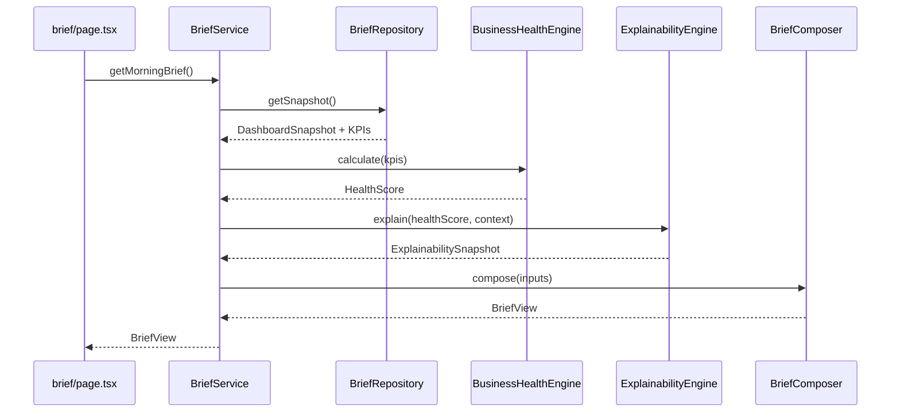

# ES-011 — Morning Executive Brief

**Document ID:** ES-011 (EC-003 Programme)  
**Executive Capability:** EC-003 — Morning Executive Brief  
**Classification:** Engineering Specification  
**Version:** 1.0.0  
**Status:** Approved for Implementation Planning  
**Author:** ORION CTO  
**Audience:** Founder · Chief Architect · Engineering · Design  

> **Document ID note:** ES-011 in the **EC-003 programme** denotes the Morning Executive Brief. This is distinct from [ES-011 — Platform Services Foundation](../02_Engineering/ES-011-Platform-Services-Foundation.md) (platform v0.4.0).

**Related:**

- [BP-003 — Morning Executive Brief](../00_BLUEPRINT/BP-003-Morning-Executive-Brief.md)
- [DC-011 — Morning Executive Brief](./DC-011-Morning-Executive-Brief.md)
- [Morning Executive Brief UI](../04_Design/Morning_Executive_Brief_UI.md)
- [EC-001 — Morning Executive Brief (Product)](../05_Product/EC-001_Morning_Executive_Brief.md)
- [EC-002A — Business Health Engine Core](../07_Engineering/EC-002A_Business_Health_Engine_Core.md)
- [ES-010 — Explainability & Confidence Engine](../07_Engineering/ES-010_Explainability_Confidence_Engine.md)
- [EC-002B Release Review](./EC-002B_Release_Review.md)
- [Explainability Integration Guide](./Explainability_Integration.md)
- [ES-028 — Executive Brief Engine](../02_Engineering/ES-028-Executive-Brief-Engine.md)
- [ORION Constitution](../09_Standards/ORION_Constitution_Ratified.md)
- [ORION Engineering Principles](../09_Standards/ORION_Engineering_Principles.md)

---

# Objectives

EC-003 delivers the **Morning Executive Brief** — the primary executive intelligence surface that composes deterministic outputs from EC-002A and EC-002B into a single `BriefView` consumed by `/brief`.

The Morning Brief Engine SHALL:

1. Consume `HealthScore` from EC-002A without modifying scores.
2. Consume `ExplainabilitySnapshot` from EC-002B for confidence, narrative, and drill-down.
3. Compose deterministic brief sections in fixed urgency order.
4. Surface recommendations and alerts from existing intelligence engines without re-ranking logic in the UI.
5. Support brief lifecycle states with graceful degradation.
6. Meet performance and accessibility targets defined in BP-003.
7. Preserve Article IV (Deterministic Core) — AI summary is optional with template fallback.

**Executive outcome:** The executive reaches decision confidence in under five minutes.

---

# Scope

## In scope

| Area | Description |
|------|-------------|
| Brief composition service | `BriefComposer` maps engine outputs → `BriefView` |
| Brief service facade | `BriefService` public API |
| EC-002A integration | KPI → `BusinessHealthEngine` → `HealthScore` |
| EC-002B integration | `ExplainabilityEngine.explain()` |
| Orchestrator integration | Snapshot → KPI extraction context |
| `/brief` route wiring | Server component data fetch |
| Lifecycle + degradation | Fresh / updated / stale / incomplete / offline |
| Deterministic end summary | Template-based closing lines |
| Unit + integration tests | Composer, service, contract tests |

## Out of scope

| Area | Rationale |
|------|-----------|
| Health score formulas | EC-002A frozen |
| Confidence algorithms | EC-002B frozen |
| Recommendation scoring rewrite | ES-029 owns ranking |
| AI Copilot | EC-005 |
| Provider normalizers | EC-002A / Provider Framework |
| Database persistence | Future platform sprint |
| Git / release operations | Governance process |

---

# Architecture

## Layer placement

```
Presentation Layer
  app/(platform)/brief/
  components/executive/

Executive Intelligence Layer
  lib/executive/brief/          ← EC-003 primary module (target)
  lib/intelligence/brief/       ← legacy brief engine (migrate/consume)

Business Intelligence Layer
  lib/business-health/          ← EC-002A
  lib/explainability/           ← EC-002B
  lib/intelligence/             ← recommendations, alerts, orchestrator
```

## Component diagram

```mermaid
flowchart TD
  ORCH[Orchestrator Snapshot]

  subgraph ec002a [EC-002A]
    BHE[BusinessHealthEngine]
    HS[HealthScore]
  end

  subgraph ec002b [EC-002B]
    EE[ExplainabilityEngine]
    EXP[ExplainabilitySnapshot]
  end

  subgraph ec003 [EC-003]
    BR[BriefRepository]
    BC[BriefComposer]
    BS[BriefService]
  end

  subgraph intel [Intelligence Engines]
    REC[RecommendationEngine]
    ALR[Alerts]
  end

  ORCH --> BR
  BR --> BHE
  BHE --> HS
  HS --> EE
  EE --> EXP
  HS --> BC
  EXP --> BC
  ORCH --> BC
  REC --> BC
  ALR --> BC
  BC --> BS
  BS --> BV[BriefView]
  BV --> UI[/brief UI]
```

## Dependency rules

| Rule | Requirement |
|------|-------------|
| Downward only | EC-003 imports EC-002A, EC-002B, orchestrator — never reverse |
| No score mutation | BriefComposer MUST NOT alter health or confidence math |
| No provider imports in composer | Only normalized types and snapshot DTOs |
| Deterministic first | AI summary loaded after deterministic shell |
| UI is dumb | Components render `BriefView`; no business logic |

---

# Workflow

## Composition pipeline stages

| Stage | Component | Input | Output |
|-------|-----------|-------|--------|
| 1. Fetch | `BriefRepository` | Session / org context | `DashboardSnapshot` |
| 2. Score | `BusinessHealthEngine` | Normalized KPIs | `HealthScore` |
| 3. Explain | `ExplainabilityEngine` | `HealthScore`, KPI context | `ExplainabilitySnapshot` |
| 4. Collect | `BriefComposer` | Snapshot, health, explainability, recs, alerts | Section DTOs |
| 5. Prioritize | `BriefComposer` | Recommendations + alerts | Top recommendation + priorities |
| 6. Summarize | `BriefComposer` | Top signals | `BriefEndSummary`, greeting copy |
| 7. Assemble | `BriefComposer` | All sections | `BriefView` |
| 8. Deliver | `BriefService` | `BriefView` | `/brief` page |

## Sequence diagram



---

# Components

## BriefService

Public facade for Brief consumption.

```typescript
interface BriefService {
  getMorningBrief(context?: BriefRequestContext): Promise<BriefResult>;
}

type BriefResult =
  | { success: true; data: BriefView }
  | { success: false; error: BriefError };
```

**Responsibilities:**

- Select repository (orchestrator vs mock)
- Invoke composition pipeline
- Attach lifecycle metadata
- Never expose raw provider payloads to UI

## BriefComposer

Deterministic mapping layer.

**Responsibilities:**

- Map `HealthScore` → `HealthSnapshot` (UI DTO)
- Map `ExplainabilitySnapshot` → health drawer + confidence badge + narrative headline
- Map orchestrator alerts → `BriefAlert[]`
- Map recommendations → `ExecutiveRecommendation[]` (max 3 above fold)
- Compose `BriefGreeting` from time + executive narrative summary
- Compose `BriefEndSummary` from templates
- Compute `BriefLifecycleState`

**Rules:**

- No LLM calls inside composer
- Template strings in `BriefTemplates.ts` (centralized)
- Sorting and truncation only — no new scoring formulas

## BriefRepository

```typescript
interface BriefRepository {
  getSnapshot(): Promise<BriefSnapshotBundle>;
}

type BriefSnapshotBundle = {
  dashboard: DashboardSnapshot;
  kpis: KPI[];
  recommendations: ExecutiveRecommendation[];
  alerts: BriefAlert[];
  priorViewAt?: string;
};
```

Implementations:

| Implementation | Use |
|----------------|-----|
| `OrchestratorBriefRepository` | Production |
| `MockBriefRepository` | Development / offline demo |

## Presentation components

See [Morning Executive Brief UI](../04_Design/Morning_Executive_Brief_UI.md).

| Component | BriefView field |
|-----------|-----------------|
| `ExecutiveGreeting` | `greeting` |
| `BriefStatusBanner` | `lifecycle`, `changesSinceLastView` |
| `BusinessHealthCard` | `businessHealth` + explainability drill-down |
| `CriticalAlertsSection` | `criticalAlerts` |
| `OvernightChangesStrip` | `overnightChanges` |
| `ExecutiveRecommendationCard` | `recommendations` |
| `TodaysPrioritiesSection` | `priorities` |
| `AiExecutiveSummaryCard` | `aiSummary` |
| `BriefEndSummary` | `endSummary` |

---

# Deterministic behaviour

## Constitution compliance

| Article | EC-003 implementation |
|---------|----------------------|
| IV — Deterministic Core | Health + confidence + deterministic sections from engines |
| VI — Explainability | "Why this score?" uses EC-002B `Explanation` bundle |
| III — Executive Trust | Confidence badge; incomplete data disclosure |

## Deterministic section rules

1. **Greeting headline** — derived from `executiveNarrative.summary` (EC-002B) or lifecycle fallback template  
2. **Business Health card** — score and status from EC-002A; confidence level from EC-002B  
3. **Alerts** — sorted by severity desc, then age asc  
4. **Top recommendation** — highest priority from recommendation engine (no re-score in composer)  
5. **Priorities** — max 5; deterministic tie-break by id  
6. **End summary** — template `{condition} · {priority} · {firstAction}`  

## AI summary rules (optional async)

- Loaded after deterministic shell renders  
- Evidence packet from composed brief sections only  
- Template fallback from `AiExecutiveSummary` deterministic builder if AI unavailable  
- Hidden when EC-002B confidence level is `insufficient` unless explicit override config  

---

# Data contracts

## BriefView (presentation contract)

Location: `types/executive/snapshot.ts`

```typescript
type BriefView = {
  id: string;
  generatedAt: string;
  lastSyncedAt: string;
  lifecycle: BriefLifecycleState;
  changesSinceLastView?: number;
  greeting: BriefGreeting;
  businessHealth: HealthSnapshot;
  criticalAlerts: BriefAlert[];
  overnightChanges: OvernightChange[];
  recommendations: ExecutiveRecommendation[];
  priorities: BriefPriority[];
  aiSummary: AiExecutiveSummary;
  endSummary: BriefEndSummary;
};
```

## HealthSnapshot (UI DTO)

Maps from EC-002A + EC-002B:

```typescript
type HealthSnapshot = {
  score: number;
  status: HealthStatusLabel;
  trend: "up" | "down" | "neutral";
  confidence: ConfidenceScore;
  summary: string;                    // EC-002B executive narrative summary
  explainabilityRef?: string;         // snapshot id for drawer
};
```

## Explainability attachment (drill-down)

Not embedded in `BriefView` by default — fetched on demand or embedded as optional field in V1.1:

```typescript
type BriefExplainabilityBundle = {
  explanation: Explanation;
  executionMs: number;
};
```

## Engine input contract

```typescript
type BriefCompositionInput = {
  healthScore: HealthScore;
  explainability: ExplainabilitySnapshot;
  alerts: BriefAlert[];
  recommendations: ExecutiveRecommendation[];
  overnightChanges: OvernightChange[];
  generatedAt: string;
  lastSyncedAt: string;
  priorViewAt?: string;
};
```

---

# Configuration

Central configuration: `BriefConfig.ts` (to be created in implementation).

| Setting | Default | Purpose |
|---------|---------|---------|
| `maxAboveFoldRecommendations` | 3 | Above-fold cap |
| `maxPriorities` | 5 | Priority list cap |
| `staleAfterMinutes` | 240 | Lifecycle stale threshold |
| `syncSlaMinutes` | 60 | Incomplete provider SLA |
| `enableAsyncAiSummary` | true | Non-blocking AI section |
| `suppressAiWhenInsufficientConfidence` | true | Trust guardrail |

Explainability and health thresholds remain in EC-002B / EC-002A config — not duplicated.

---

# Performance goals

| Target | Budget | Owner |
|--------|--------|-------|
| BriefService p95 | ≤ 2000ms | EC-003 |
| Explainability embed | ≤ 250ms | EC-002B |
| Business health calc | ≤ 100ms | EC-002A |
| Server TTFB `/brief` | ≤ 800ms | Platform |
| Client hydration | ≤ 500ms | Presentation |
| AI summary async | ≤ 5000ms | Intelligence (non-blocking) |

Caching:

| Layer | TTL | Invalidation |
|-------|-----|--------------|
| Orchestrator snapshot | Request-scoped | Sync event |
| BriefView | None server-side V1 | Fresh compose each request |
| Client offline | 24h | Successful sync |

---

# Accessibility

- WCAG 2.2 AA on all `/brief` components  
- `aria-label="Morning Executive Brief"` on main section  
- Alert severity: icon + text + border (not colour alone)  
- Focus order matches visual urgency order  
- Skip link to Top Recommendation  
- Live region on `BriefStatusBanner` for lifecycle changes  

---

# Testing strategy

Location: `tests/executive/brief/` · `tests/integration/brief/`

| Suite | Coverage |
|-------|------------|
| `BriefComposer.test.ts` | Mapping, lifecycle, truncation, templates |
| `BriefService.test.ts` | Repository selection, error handling |
| `BriefIntegration.test.ts` | BHE + EE + composer → BriefView |
| `BriefContract.test.ts` | `BriefView` schema validation |
| `BriefDeterminism.test.ts` | Golden fixture repeatability |
| `BriefPerformance.test.ts` | Composition budget |
| Playwright `brief.spec.ts` | E2E load, a11y, keyboard actions |

Edge cases (mandatory):

- Empty provider snapshot  
- Insufficient confidence (EC-002B)  
- Zero recommendations  
- All-critical alerts  
- Stale / offline lifecycle  
- Missing executive name  
- Duplicate recommendation IDs  

Coverage target: ≥ 85% on `lib/executive/brief/` composer and service logic.

---

# Extension points

| Extension | Interface |
|-----------|-----------|
| New brief section | Register in `BriefComposer` section map |
| Alternate repository | Implement `BriefRepository` |
| Custom templates | `BriefTemplates.ts` |
| AI summary provider | Inject `AiSummaryProvider` adapter |
| Lifecycle rules | `BriefLifecycleResolver` |
| Post-brief navigation | `BriefEndSummary` CTA config |

---

# Relationship to legacy brief engine

| Module | Status | EC-003 action |
|--------|--------|---------------|
| `lib/intelligence/brief/ExecutiveBriefEngine.ts` | Legacy pipeline | Consume or wrap; do not duplicate ranking |
| `lib/executive/brief/BriefService.ts` | Partial vertical slice | Extend with EC-002A/002B composition |
| `lib/advisor-data.ts` static data | Deprecated path | Remove wiring in implementation phase |

ES-028 remains the historical Mission 17B reference. EC-003 supersedes ES-028 for new development.

---

# Definition of Done

EC-003 V1 is complete when:

| Criterion | Verification |
|-----------|--------------|
| `/brief` renders live EC-002A health score | Integration test |
| Confidence badge from EC-002B | Integration test |
| "Why this score?" drill-down uses `ExplainabilitySnapshot` | Manual + test |
| Deterministic sections match golden fixtures | Golden tests |
| Performance budget met | Performance test |
| WCAG 2.2 AA axe scan pass | E2E a11y |
| TypeScript + lint + test + build pass | CI |
| BP-003 / ES-011 / DC-011 aligned | Architecture review |

---

# Version history

| Version | Date | Author | Changes |
|---------|------|--------|---------|
| 1.0.0 | 26 July 2026 | ORION CTO | Initial specification · EC-003 programme |

---

**Status:** Approved for Implementation Planning — await Founder approval.
