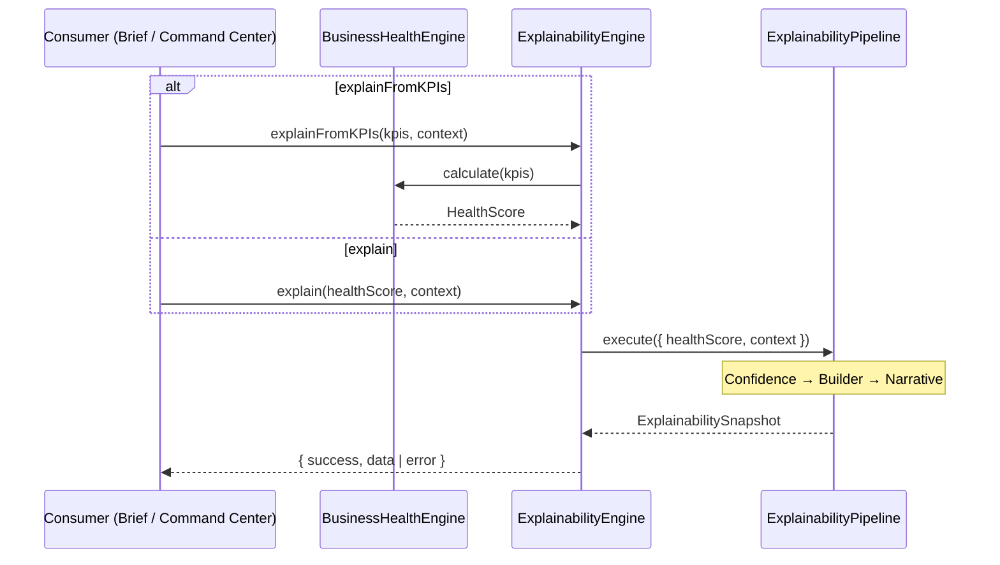

# Explainability Integration Guide

**Capability:** EC-002B — Explainability & Confidence Engine  
**Module:** `lib/explainability/`  
**Version:** 1.0.0  
**Status:** Implemented  
**Audience:** Engineering · Brief · Command Center integrators

**Related:** [Explainability Architecture](../04_Design/Explainability_Architecture.md) · [ES-010](../07_Engineering/ES-010_Explainability_Confidence_Engine.md) · [DC-010](../07_Engineering/DC-010_Explainability_Confidence_Engine.md)

---

## Overview

The explainability integration layer exposes a single public entry point — `ExplainabilityEngine` — that coordinates the Confidence Engine, Explanation Builder, and Executive Narrative Engine into one immutable `ExplainabilitySnapshot`.

Integrators should import from the barrel:

```typescript
import {
  ExplainabilityEngine,
  DEFAULT_EXPLAINABILITY_CONFIG,
  isExplainabilitySuccess,
} from "@/lib/explainability";
```

---

## Quick start

### From an existing HealthScore

```typescript
const engine = new ExplainabilityEngine();
const result = engine.explain(healthScore, {
  referenceTime: healthScore.timestamp,
  kpis: normalizedKpis,
  expectedKpiCount: 6,
});

if (isExplainabilitySuccess(result)) {
  const { explanation, executionMs } = result.data;
  // explanation.executiveNarrative.summary
  // explanation.confidence.level
  // explanation.explanationItems
}
```

### From normalized KPIs

```typescript
const result = engine.explainFromKPIs(normalizedKpis, {
  expectedKpiCount: normalizedKpis.length,
  missingProviders: ["shopify"],
});
```

`explainFromKPIs` delegates scoring to EC-002A `BusinessHealthEngine`, then runs the explainability pipeline on the resulting `HealthScore`.

---

## Execution flow

| Step | Component | Input | Output |
|------|-----------|-------|--------|
| 1 | `ExplainabilityEngine` | `HealthScore`, optional context | Validated input |
| 2 | `ConfidenceEngine` | KPI quality signals | `Confidence` |
| 3 | `ExplanationBuilder` | Health score + confidence | `Explanation` (items + interim narrative) |
| 4 | `ExecutiveNarrativeEngine` | Health score + confidence | Canonical `ExecutiveNarrative` |
| 5 | `ExplainabilityPipeline` | Merged bundle | `ExplainabilitySnapshot` |

---

## Sequence diagram



---

## Configuration

Central configuration lives in `ExplainabilityConfig`:

| Field | Default | Purpose |
|-------|---------|---------|
| `highlightLimit` | `3` | Top contributors in narrative bullets |
| `confidenceRules` | `DEFAULT_CONFIDENCE_RULES` | Deduction thresholds (Phase 2) |
| `maxExecutionMs` | `250` | Integration performance budget |

```typescript
import { createExplainabilityConfig, ExplainabilityEngine } from "@/lib/explainability";

const engine = new ExplainabilityEngine(
  createExplainabilityConfig({ highlightLimit: 5 }),
);
```

---

## Context fields

`ExplainabilityContext` extends confidence assessment context:

| Field | Used by | Purpose |
|-------|---------|---------|
| `kpis` | Confidence Engine | Freshness, estimation, completeness signals |
| `expectedKpiCount` | Confidence Engine | Missing KPI detection |
| `missingProviders` / `unavailableProviders` | Confidence Engine | Provider availability deductions |
| `incompleteNormalizationCount` | Confidence Engine | Normalization quality flag |
| `validationFailureCount` | Confidence Engine | Validation failure deductions |
| `referenceTime` | All stages | Deterministic timestamp anchor |
| `recommendationContext` | Explanation Builder | EC-003 passthrough (future) |

---

## Result handling

```typescript
type ExplainabilityEngineResult =
  | { success: true; data: ExplainabilitySnapshot }
  | { success: false; error: ExplainabilityError };
```

| Error code | Meaning |
|------------|---------|
| `INVALID_HEALTH_SCORE` | Missing timestamp or invalid score |
| `HEALTH_SCORE_FAILED` | EC-002A scoring failed |
| `EMPTY_INPUT` | `explainFromKPIs([])` called with no KPIs |

`ExplainabilitySnapshot` fields:

| Field | Description |
|-------|-------------|
| `explanation` | Full `Explanation` bundle |
| `executionMs` | Pipeline wall time (ms) |
| `generatedAt` | ISO timestamp for the snapshot |

---

## Integration patterns

### Brief / Command Center

1. Obtain `HealthScore` from EC-002A (or call `explainFromKPIs`).
2. Pass KPI context for accurate confidence scoring.
3. Render `executiveNarrative.summary` as the headline.
4. Surface `confidence.level` as a trust badge.
5. Expand `explanationItems` for drill-down.

### Low-confidence suppression

When `confidence.level` is `insufficient`:

- Show `executiveNarrative.summary` (includes confidence caveat).
- Prefer `confidence.factors` over numeric health score in UI copy.
- Do not hide the health score silently — narrative explains the limitation.

---

## Extension points

| Need | Approach |
|------|----------|
| Custom confidence weights | Override `confidenceRules` in config |
| Additional narrative templates | Extend `EXECUTIVE_NARRATIVE_TEMPLATES` |
| New pipeline stage | Wrap or extend `ExplainabilityPipeline` (Phase 6+) |
| Orchestrator wiring | Inject `ExplainabilityEngine` into intelligence pipeline |
| Recommendation handoff | Populate `recommendationContext` in explain context |

---

## Design rationale

- **Single entry point** reduces coupling for UI and orchestrator teams.
- **Pipeline isolation** keeps stage ordering explicit and testable.
- **Immutable snapshots** support audit trails and deterministic replay.
- **No algorithm changes in integration phase** — Phase 5 wires existing engines only.
- **Template traceability** — every executive sentence maps to structured data + template ID.

---

## Testing

Integration tests: `tests/explainability/ExplainabilityIntegration.test.ts`

Coverage includes:

- Healthy, mixed, and declining business scenarios
- Low confidence and missing KPI context
- Empty assessments via `explain()`
- Deterministic repeatability
- Execution performance budget

Run validation:

```bash
npm run typecheck
npm run lint
npm test
npm run build
```

---

## Version history

| Version | Date | Author | Changes |
|---------|------|--------|---------|
| 1.0.0 | 26 July 2026 | ORION CTO | Initial integration guide · EC-002B Phase 5 |
