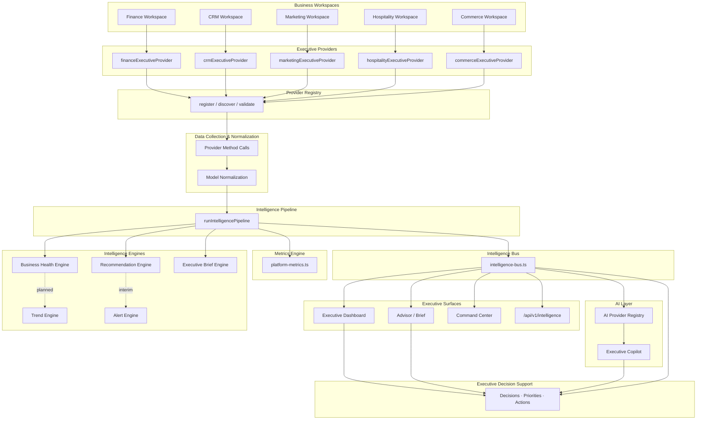
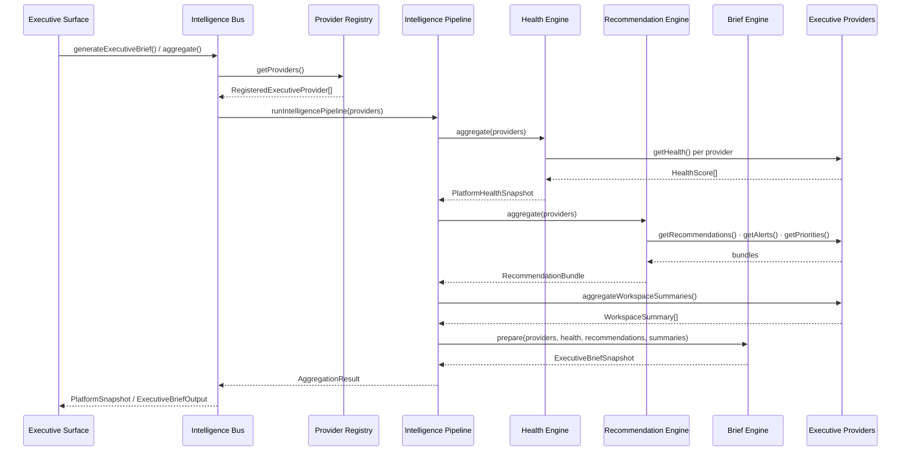
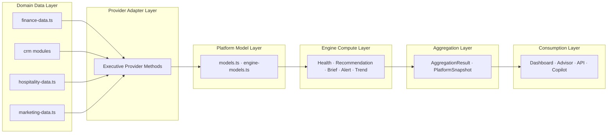
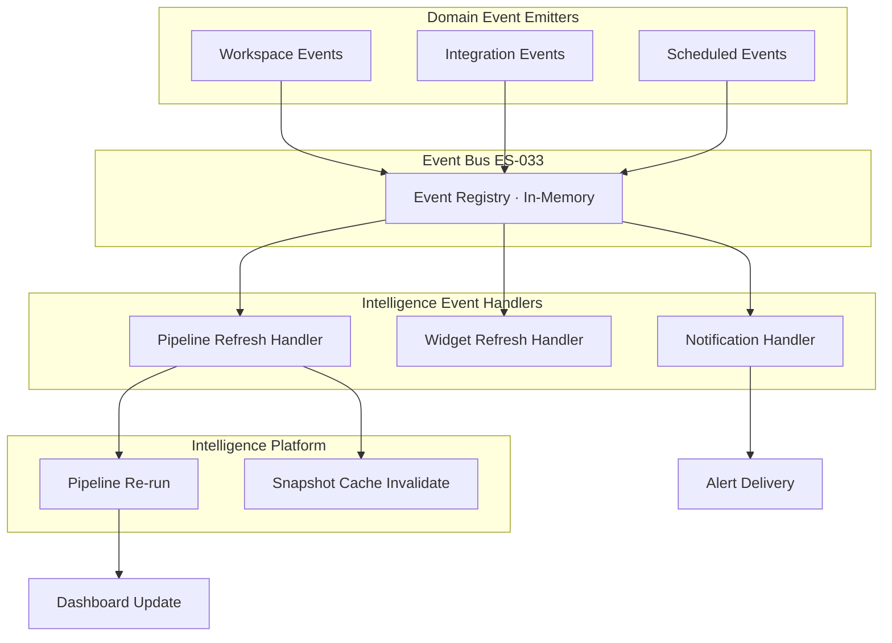
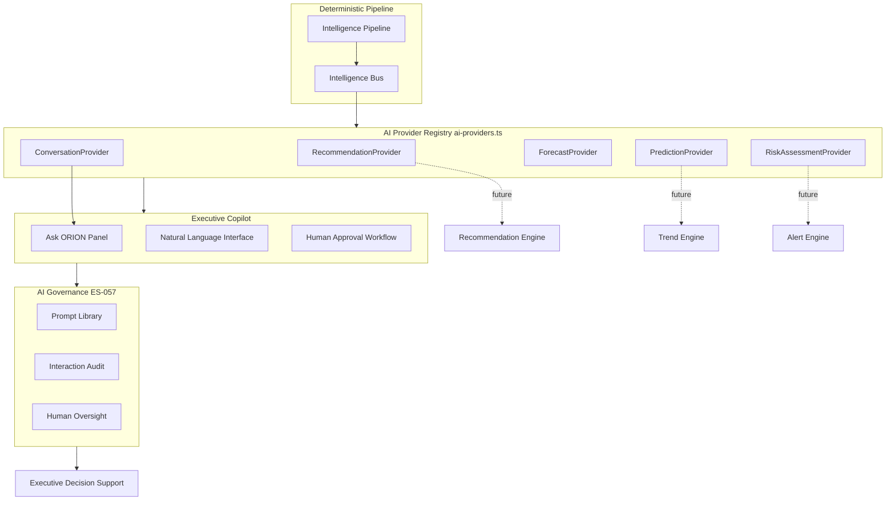
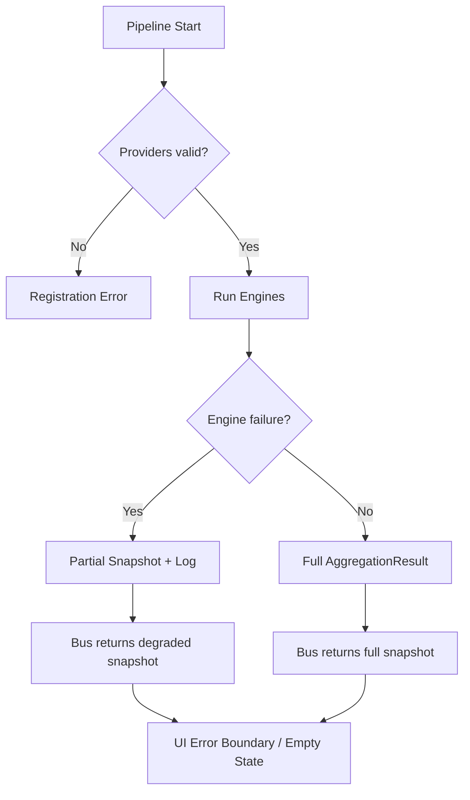

# ES-065 — Executive Intelligence Architecture

**Version:** 1.0.0

**Status:** Approved

**Classification:** Enterprise Engineering Specification

**Author:** Founder & Chief Architect

**Related specifications:** [ES-020 — Executive Intelligence Foundation](./ES-020-Executive-Intelligence-Foundation.md) · [ES-021 — Executive Intelligence Engines](./ES-021-Executive-Intelligence-Engines.md) · [ES-028–ES-032 Intelligence Engines](./ES-028-Executive-Brief-Engine.md) · [ES-039 — AI Orchestration](./ES-039-AI-Orchestration-Agent-Framework.md) · [ES-057 — AI Governance](./ES-057-ORION-AI-Governance-Responsible-Intelligence-Framework.md) · [ES-061 — v0.4 Master Plan](./ES-061-ORION-v0.4-Master-Development-Plan.md) · [ES-064 — Sprint 4 Task Catalogue](./ES-064-Sprint-4-Engineering-Task-Catalogue.md) · [ADR-006 — Executive Intelligence Provider Framework](../10_Decisions/ADR-006-Executive-Intelligence-Provider-Framework.md)

**Code baseline:** `lib/intelligence/` · [Intelligence README](../../lib/intelligence/README.md)

---

# Executive Summary

The Executive Intelligence Architecture defines the complete intelligence pipeline powering ORION — the system that transforms business workspace data into executive-ready insights, briefs, recommendations, alerts, trends, health scores, and AI-assisted decision support.

ORION implements a **provider-driven, engine-based intelligence platform** (Mission 17A–17B · ADR-006). Business workspaces publish intelligence through **Executive Providers**. The **Provider Registry** discovers providers and delegates aggregation to **Intelligence Engines**. The **Intelligence Pipeline** orchestrates engine execution. The **Intelligence Bus** exposes a single entry point for the Executive Shell, Advisor, Dashboard, and future AI Copilot.

| Layer | Baseline Status | v0.4 Target |
|-------|-----------------|-------------|
| Executive Providers | Finance · CRM registered | Six workspace providers |
| Data collection & normalization | Provider methods · static `lib/*-data.ts` | Provider-only · TD-001/002 closed |
| Metrics Engine | `platform-metrics.ts` delivered | Pipeline-integrated · no duplicate runs |
| Intelligence Engines | Health · Recommendation · Brief delivered | + Alert · Trend extracted |
| Executive Dashboard | `/advisor` partial · no `/dashboard` registry | ES-022 unified dashboard |
| AI Copilot | `AI_PROVIDER_REGISTRY` all null | Governed LLM via Intelligence Bus |
| Event-driven updates | In-memory event registry · ES-033 planned | Domain event emitters |

**Architecture maturity:** **Substantial foundation** · **operational completion pending** ([ES-061](./ES-061-ORION-v0.4-Master-Development-Plan.md) · [ES-064](./ES-064-Sprint-4-Engineering-Task-Catalogue.md)).

---

# Purpose

This Engineering Specification is the **authoritative architectural reference** for ORION Executive Intelligence — how data becomes executive insight, how engines compose, how the pipeline flows, and how AI participates without violating governance constraints.

It consolidates Mission 17A–17B delivery, ES-028–032 engine specifications, ADR-006 provider framework, and v0.4 completion plans into a single architecture document mapped against the `lib/intelligence/` codebase.

**Audience:** Engineers · architects · AI engineers · QA · founders · integration partners.

**Non-goals:** This document does not replace workspace domain specifications (ES-023–ES-027) or AI agent orchestration detail (ES-039) — it defines the **intelligence pipeline architecture** they plug into.

---

# Architectural Principles

| # | Principle | Description | ORION Status |
|---|-----------|-------------|--------------|
| P1 | **Provider-driven intelligence** | Workspaces publish intelligence via `ExecutiveProvider`; engines never import workspace modules | **Delivered** · ADR-006 |
| P2 | **Single intelligence bus** | Executive surfaces consume `intelligence-bus.ts` — not individual workspaces | **Delivered** · partial UI bypass remains |
| P3 | **Engine separation** | Health, Recommendation, Brief, Alert, Trend engines are standalone modules with interfaces | **Partial** · 3 engines · Alert/Trend interim/open |
| P4 | **Deterministic before AI** | Pipeline produces governed deterministic output; LLM augments, never replaces accountability | **Delivered** · ES-057 |
| P5 | **No UI in engines** | Engines are pure TypeScript — no React, no Tailwind | **Delivered** |
| P6 | **Replaceable engines** | `engine-interfaces.ts` allows engine swap without provider changes | **Delivered** |
| P7 | **Fail isolated** | Provider or engine failure must not crash the platform snapshot | **Partial** · errors typed · isolation incomplete |
| P8 | **Observable execution** | Pipeline records per-engine timing statistics | **Delivered** · `pipeline.statistics` |
| P9 | **Event-ready** | Intelligence refresh triggered by domain events (target) | **Planned** · ES-033 · in-memory registry only |
| P10 | **Governed AI** | LLM participates only through registered AI providers with audit | **Planned** · `ai-providers.ts` contracts only |

**Alignment:** [ORION Intelligence Constitution](../05_AI/ORION_Intelligence_Constitution.md) · [ORION Decision Framework](../05_AI/ORION_Decision_Framework.md) · [Engineering Standards](../09_Standards/Engineering_Standards.md)

---

# Intelligence Pipeline

The Executive Intelligence Pipeline transforms workspace business data into executive decision support through a sequential and composable flow.

## Canonical Pipeline Flow

```
Providers
        ↓
Data Collection
        ↓
Normalization
        ↓
Metrics Engine
        ↓
Executive Dashboard
        ↓
Executive Brief Engine
        ↓
Recommendation Engine
        ↓
Alert Engine
        ↓
Trend Engine
        ↓
Business Health Engine
        ↓
AI Copilot
        ↓
Executive Decision Support
```

**Implementation note:** In the **as-built pipeline** (`runIntelligencePipeline`), engine execution order is **Health → Recommendation → Summaries → Brief**. Alert aggregation is **interim** (via `RecommendationBundle.criticalAlerts`). Trend Engine and AI Copilot are **not yet implemented**. Metrics collection runs **adjacent to** the pipeline via `platform-metrics.ts`. The diagram above represents the **target canonical architecture**; the as-built mapping is documented below.

## Pipeline Architecture Diagram



## As-Built vs Target Mapping

| Pipeline Stage | Code Location | Status | Notes |
|----------------|---------------|--------|-------|
| **Providers** | `workspace-providers/` · `register-executive-providers.ts` | **Partial** | Finance · CRM registered |
| **Data Collection** | Provider `getHealth()` · `getMetrics()` · etc. | **Partial** | Static `lib/*-data.ts` behind providers |
| **Normalization** | `models.ts` · `engine-models.ts` | **Delivered** | Typed platform models |
| **Metrics Engine** | `platform-metrics.ts` | **Delivered** | Invokes pipeline · records statistics |
| **Executive Dashboard** | `/advisor` · `/command-center` · ES-022 target `/dashboard` | **Partial** | Not registry-driven |
| **Executive Brief Engine** | `brief-engine.ts` | **Delivered** | Engine + pipeline integration |
| **Recommendation Engine** | `recommendation-engine.ts` | **Delivered** | Explainability pending ES-057 |
| **Alert Engine** | Interim via `recommendation-engine.ts` · `getAlerts()` | **Partial** | Dedicated `alert-engine.ts` pending |
| **Trend Engine** | — | **Open** | ES-031 · ES-064 S4T-060–068 |
| **Business Health Engine** | `health-engine.ts` | **Delivered** | Finance/CRM only today |
| **AI Copilot** | `ai-providers.ts` · `AskOrionPanel` placeholder | **Open** | ES-039 · ES-057 |
| **Executive Decision Support** | `DecisionCard` · `PrioritiesCard` · Advisor UI | **Partial** | Mixed static + pipeline |

## Runtime Sequence Diagram



---

# Component Responsibilities

## Executive Providers

**Location:** `lib/intelligence/provider.ts` · `lib/intelligence/workspace-providers/`

| Responsibility | Detail |
|----------------|--------|
| Publish workspace intelligence | Implement `ExecutiveProvider` contract per ADR-006 |
| Supply health, alerts, recommendations, metrics | Methods: `getHealth()` · `getAlerts()` · `getRecommendations()` · `getExecutiveSummary()` · `getMetrics()` |
| Extended registration methods | `getRisks()` · `getPriorities()` · `getBriefingLine()` · `getBriefCardSnapshot()` |
| Isolate workspace logic | Domain calculations live in workspace modules; provider adapts to platform models |
| Version compliance | Must declare supported provider version per `constants.ts` |

**Registered today:** `financeExecutiveProvider` · `crmExecutiveProvider`

**Target:** Marketing · Hospitality · Commerce providers ([ES-061](./ES-061-ORION-v0.4-Master-Development-Plan.md))

---

## Provider Registry

**Location:** `lib/intelligence/provider-registry.ts`

| Responsibility | Detail |
|----------------|--------|
| Registration lifecycle | `register()` · `unregister()` · validation · version checks |
| Discovery | `getProviders()` · `discover()` · `getProvider(id)` |
| Engine delegation | `aggregateHealth()` · `aggregateRecommendations()` · `prepareBrief()` |
| Platform snapshot | `aggregate()` → `PlatformSnapshot` via pipeline |
| Registry limits | `REGISTRY_MAX_PROVIDERS` enforced |

---

## Data Collection

**Location:** Provider methods · workspace data layers (`lib/finance-data.ts`, `lib/crm/`, etc.)

| Responsibility | Detail |
|----------------|--------|
| Gather domain signals | KPIs, alerts, opportunities, receivables, pipeline metrics |
| Adapter boundary | Providers translate workspace data into platform model shapes |
| No direct UI access | Workspace pages may read static data; intelligence surfaces use bus only |

**Gap:** Static data modules bypass persistence ([TD-001](../09_Standards/Technical_Debt_Register.md) · [TD-002](../09_Standards/Technical_Debt_Register.md))

---

## Normalization

**Location:** `lib/intelligence/models.ts` · `lib/intelligence/engine-models.ts`

| Responsibility | Detail |
|----------------|--------|
| Canonical types | `HealthScore` · `BusinessAlert` · `ExecutiveRecommendation` · `ExecutiveMetric` |
| Engine outputs | `PlatformHealthSnapshot` · `RecommendationBundle` · `ExecutiveBriefSnapshot` · `AggregationResult` |
| Consistent enums | Severity · trend direction · health status |
| Version-safe contracts | ES-034 provider data contract alignment |

---

## Metrics Engine

**Location:** `lib/intelligence/platform-metrics.ts`

| Responsibility | Detail |
|----------------|--------|
| Collect platform statistics | Provider count · healthy providers · platform score |
| Engine observability | Execution time ms · per-engine statistics from pipeline |
| Alert and recommendation counts | Critical alert count · recommendation count |
| Health endpoint feed | Supports `/api/health` intelligence status (target) |

**Note:** Currently invokes full pipeline per metrics call — caching optimisation pending ([ES-064](./ES-064-Sprint-4-Engineering-Task-Catalogue.md) S4T-038).

---

## Intelligence Pipeline

**Location:** `lib/intelligence/pipeline.ts`

| Responsibility | Detail |
|----------------|--------|
| Orchestrate engines | Sequential execution with timing measurement |
| Produce `AggregationResult` | Health · recommendations · summaries · brief · statistics |
| Remain domain-agnostic | No business calculations — delegation only |
| Implement `PipelineEngine` | Replaceable via `engine-interfaces.ts` |

---

## Executive Dashboard

**Location:** `/advisor` · `/command-center` · target `/dashboard` · ES-022

| Responsibility | Detail |
|----------------|--------|
| Visualise platform intelligence | KPI widgets · health · alerts · activity |
| Registry-driven widgets | Target: widget registry per ES-022 |
| Consume Intelligence Bus | No direct provider imports in dashboard components |
| Responsive executive layout | ES-022 zones · 12-column grid (target) |

**Status:** **Partial** — Advisor/Command Center operational · unified dashboard pending

---

## Executive Brief Engine

**Location:** `lib/intelligence/brief-engine.ts` · **Spec:** [ES-028](./ES-028-Executive-Brief-Engine.md)

| Responsibility | Detail |
|----------------|--------|
| Compose daily executive brief | `prepare()` · `prepareExecutiveBrief()` |
| Aggregate workspace summaries | `aggregateWorkspaceSummaries()` |
| Produce briefing line | Platform narrative from health + recommendations |
| Output `ExecutiveBriefOutput` | Consumed by Advisor · Brief API (target) |

**Status:** **Delivered** · UI wiring partial

---

## Recommendation Engine

**Location:** `lib/intelligence/recommendation-engine.ts` · **Spec:** [ES-029](./ES-029-Recommendation-Engine.md)

| Responsibility | Detail |
|----------------|--------|
| Aggregate provider recommendations | Cross-workspace priority ranking |
| Bundle outputs | `RecommendationBundle` — recommendations · priorities · opportunities · executive actions |
| Interim alert aggregation | `criticalAlerts` from provider alerts (until Alert Engine extracted) |
| Explainability (target) | Reasoning · evidence · confidence per ES-057 |

**Status:** **Delivered** · explainability pending

---

## Alert Engine

**Location:** Target `lib/intelligence/alert-engine.ts` · **Spec:** [ES-030](./ES-030-Alert-Engine.md)

| Responsibility | Detail |
|----------------|--------|
| Dedicated alert aggregation | Severity classification · deduplication · prioritisation |
| Notification bridge (target) | Interface to notification delivery · ES-033 events |
| Feed Alert Centre UI | Dashboard and Advisor alert panels |

**Status:** **Partial** — interim via Recommendation Engine · extraction pending ([ES-064](./ES-064-Sprint-4-Engineering-Task-Catalogue.md) S4T-050–058)

---

## Trend Engine

**Location:** Target `lib/intelligence/trend-engine.ts` · **Spec:** [ES-031](./ES-031-Trend-Engine.md)

| Responsibility | Detail |
|----------------|--------|
| Time-series aggregation | Provider `aggregateTrends()` (target contract extension) |
| Period comparison | Week-over-week · month-over-month deltas |
| Feed dashboard charts | Trend widgets · KPI trend indicators |

**Status:** **Open** — not implemented

---

## Business Health Engine

**Location:** `lib/intelligence/health-engine.ts` · **Spec:** [ES-032](./ES-032-Business-Health-Engine.md)

| Responsibility | Detail |
|----------------|--------|
| Aggregate workspace health | Per-provider health scores and drivers |
| Compute platform score | Weighted platform health snapshot |
| Status classification | Healthy · needs attention · at risk |
| Multi-provider scoring (target) | All six workspace providers |

**Status:** **Delivered** · Finance/CRM providers only

---

## Intelligence Bus

**Location:** `lib/intelligence/intelligence-bus.ts`

| Responsibility | Detail |
|----------------|--------|
| Single executive entry point | `generateExecutiveBrief()` · `getPlatformIntelligenceSnapshot()` |
| Facade over registry | Hides registry and pipeline complexity from UI |
| Side-effect registration | Imports `register-executive-providers.ts` on load |
| Stable API for surfaces | Advisor · Dashboard · API · Copilot consume bus only |

---

## AI Copilot

**Location:** `lib/intelligence/ai-providers.ts` · Advisor `AskOrionPanel` · **Spec:** [ES-039](./ES-039-AI-Orchestration-Agent-Framework.md)

| Responsibility | Detail |
|----------------|--------|
| Governed LLM interaction | Conversation via `ConversationProvider` contract |
| Context from pipeline | AI consumes bus output — never raw workspace modules |
| Human approval | High-impact actions require approval per ES-057 |
| Audit trail | All AI interactions logged (target) |

**Status:** **Open** — `AI_PROVIDER_REGISTRY` all null

---

## Executive Decision Support

**Location:** Advisor components · `DecisionCard` · `PrioritiesCard` · Intelligence workspace

| Responsibility | Detail |
|----------------|--------|
| Present actionable intelligence | Decisions · priorities · recommended actions |
| Link to workspace context | Navigate to Finance · CRM · Hospitality sources |
| Track acceptance (target) | Recommendation acceptance/dismissal per ES-029 |
| Executive accountability | Human remains decision-maker per Intelligence Constitution |

**Status:** **Partial** — mixed static and pipeline data

---

# Data Flow

Intelligence data moves **upward** from workspace domains to executive surfaces. No executive surface reads workspace modules directly.

## Data Flow Diagram



## Data Flow Stages

| Stage | Input | Output | Owner |
|-------|-------|--------|-------|
| 1 · Domain read | Workspace repositories · static modules · integrations | Raw domain records | Workspace modules |
| 2 · Provider adapt | Domain records | `HealthScore` · `BusinessAlert` · `ExecutiveRecommendation` · `ExecutiveMetric` | Executive Providers |
| 3 · Normalize | Provider outputs | Typed platform models | `models.ts` |
| 4 · Engine compute | Provider list | Engine snapshots and bundles | Intelligence Engines |
| 5 · Pipeline merge | Engine outputs | `AggregationResult` | `pipeline.ts` |
| 6 · Bus expose | Aggregation result | `PlatformSnapshot` · `ExecutiveBriefOutput` | `intelligence-bus.ts` |
| 7 · Surface render | Bus output | UI components · API JSON | Executive Shell |
| 8 · AI augment (target) | Bus snapshot + user prompt | Governed NL response | AI Copilot |

## Data Classification

Per [ES-056](./ES-056-ORION-Data-Governance-Information-Architecture.md):

| Data type | Classification | Pipeline handling |
|-----------|----------------|-----------------|
| Executive metrics | Internal · executive | Aggregated only on bus |
| Customer/financial detail | Confidential | Provider adapter boundary — not in brief by default |
| AI prompts/responses | Restricted (target) | Audit log · ES-057 retention |
| Engine statistics | Internal | `pipeline.statistics` · observability |

---

# Event Flow

Intelligence refresh shall be **event-driven** in production. Current implementation is **request-driven** (UI/API calls pipeline on render or fetch).

## Target Event Flow Diagram



## Event Categories (Target)

| Event | Source | Intelligence action | Status |
|-------|--------|---------------------|--------|
| `finance.receivable.overdue` | Finance workspace | Re-run pipeline · refresh alert panel | **Planned** |
| `crm.opportunity.stage_changed` | CRM workspace | Refresh recommendations · brief section | **Planned** |
| `hospitality.reservation.created` | Hospitality workspace | Refresh occupancy metrics · alerts | **Planned** |
| `integration.stripe.payment_received` | Stripe connector | Refresh Finance provider · pipeline | **Planned** |
| `intelligence.scheduled.brief` | Scheduler | Generate brief · notification | **Planned** |
| `intelligence.pipeline.completed` | Pipeline | Cache snapshot · widget refresh | **Partial** · statistics only |

**Current:** In-memory event registry per ES-033 foundation · no domain emitters · no streaming bus.

---

# AI Integration

AI participates **after** deterministic pipeline execution — augmenting, not replacing, governed intelligence.

## AI Integration Diagram



## LLM Participation Points

| Point | Role | Governance | Status |
|-------|------|------------|--------|
| **Brief narrative enhancement** | LLM polishes deterministic brief text | Human review · citation of pipeline facts | **Planned** |
| **Recommendation explainability** | LLM generates reasoning from evidence | ES-057 fields · no autonomous actions | **Planned** · ES-064 S4T-041 |
| **Copilot conversation** | NL queries over bus snapshot | Prompt library · audit · approval for actions | **Planned** · ES-064 S4T-083 |
| **Risk assessment** | AI assesses alert patterns | RiskAssessmentProvider · human oversight | **Planned** |
| **Forecast / prediction** | AI augments Trend Engine | Deterministic fallback when AI disabled | **Planned** |

## AI Non-Negotiables

- AI **never** executes financial, legal, or irreversible business actions autonomously
- AI **always** cites pipeline/evidence sources when presenting facts
- AI **disabled by default** until provider registered and ES-057 gates passed
- `isAiEnabled()` returns false today — deterministic pipeline is authoritative

**Reference:** [ES-057 — AI Governance](./ES-057-ORION-AI-Governance-Responsible-Intelligence-Framework.md) · [ES-039 — AI Orchestration](./ES-039-AI-Orchestration-Agent-Framework.md)

---

# Security

| Control | Application | Status |
|---------|-------------|--------|
| **Provider validation** | Registry validates id, version, required methods | **Delivered** |
| **No workspace leakage** | Engines cannot import workspace modules | **Delivered** · enforced by architecture |
| **Authentication** | Intelligence API requires auth (target) | **Partial** · placeholder session |
| **Authorisation** | RBAC on executive surfaces | **Partial** · types only |
| **Data minimisation** | Providers expose executive summaries — not raw PII bulk | **Partial** · static data risk |
| **AI audit** | All LLM interactions logged | **Planned** · ES-057 |
| **Secrets** | Integration and LLM keys in vault — not code | **Planned** · ES-059 |
| **Tenant isolation** | Provider registry scoped per tenant (target) | **Planned** · single-tenant dev |

**Reference:** [ES-059 — Platform Security & Zero Trust](./ES-059-ORION-Platform-Security-Zero-Trust-Architecture.md)

---

# Performance

| Metric | Target | Baseline | Notes |
|--------|--------|----------|-------|
| Pipeline p95 execution | < 500ms | Not benchmarked | `pipeline.statistics.totalMs` recorded |
| Per-engine timing | Visible | **Delivered** | healthEngineMs · recommendationEngineMs · briefEngineMs |
| Metrics duplicate runs | Cache pipeline result | **Gap** | `platform-metrics.ts` re-runs pipeline |
| Dashboard widget lazy load | On viewport | **Planned** | ES-064 S4T-038 |
| Provider count limit | `REGISTRY_MAX_PROVIDERS` | **Delivered** | Prevents unbounded aggregation |
| AI response timeout | Configurable | **Planned** | ES-039 |

**Optimisation roadmap:** Pipeline result cache · incremental provider refresh · event-driven partial re-aggregation ([ES-064](./ES-064-Sprint-4-Engineering-Task-Catalogue.md) S4T-033 · S4T-038 · S4T-087)

---

# Scalability

| Dimension | Current | Target |
|-----------|---------|--------|
| **Providers** | In-process registry · max limit enforced | Plugin registry · ES-060 |
| **Engines** | Synchronous in-process | Parallel engine execution where independent |
| **Pipeline** | Single Node.js process | Horizontal API tier · cached snapshots |
| **Events** | In-memory | Streaming bus · ES-033 Phase 2 |
| **AI** | Null registry | External LLM provider · rate limited |
| **Multi-tenant** | Development single-tenant | Tenant-scoped provider registry · ES-050 |

**Scaling principle:** Intelligence computation scales by **caching aggregation results** and **event-driven incremental refresh** — not by duplicating workspace logic.

---

# Error Handling

**Location:** `lib/intelligence/errors.ts`

| Error | Type | When |
|-------|------|------|
| `InvalidProviderError` | Registration | Missing id · workspace · methods |
| `ProviderAlreadyRegisteredError` | Registration | Duplicate provider id |
| `ProviderNotFoundError` | Lookup | Unregister · get unknown id |
| `VersionMismatchError` | Registration | Unsupported provider version |
| `RegistrationFailedError` | Registration | Registry limit exceeded |

## Error Handling Strategy

| Layer | Strategy | Status |
|-------|----------|--------|
| Provider registration | Fail fast with typed errors | **Delivered** |
| Provider runtime | Provider method failure should not crash pipeline (target) | **Partial** · not all paths wrapped |
| Engine execution | Isolate engine errors · return partial snapshot (target) | **Planned** |
| Bus / UI | Graceful degradation · empty states · error boundaries | **Partial** · ES-064 S4T-019 |
| AI provider | Fallback to deterministic when LLM unavailable | **Planned** · `isAiEnabled()` gate |



---

# Acceptance Criteria

The Executive Intelligence Architecture is complete when:

| Criterion | Status |
|-----------|--------|
| Executive Summary documents pipeline scope and baseline | **Delivered** · this document |
| Architectural principles defined and mapped | **Delivered** |
| Complete pipeline flow documented with diagrams | **Delivered** |
| Component responsibilities defined for all stages | **Delivered** |
| Data flow and event flow documented | **Delivered** |
| AI integration points and governance documented | **Delivered** |
| Security · performance · scalability · error handling addressed | **Delivered** |
| As-built vs target status mapped to codebase | **Delivered** |
| Founder approval received | **Approved** |

**Architecture documentation:** **Complete**.

**Pipeline operational maturity:** **Substantial** — 3 engines delivered · Alert/Trend/Copilot/API/event-driven refresh pending ([ES-061](./ES-061-ORION-v0.4-Master-Development-Plan.md) · [ES-064](./ES-064-Sprint-4-Engineering-Task-Catalogue.md)).

---

# Approval

| Role | Name | Decision | Date |
|------|------|----------|------|
| Founder | Founder | **Approved** | 2026 |
| Chief Architect | Chief Architect | **Approved** | 2026 |

**Authorisation:** Executive Intelligence Architecture is the **authoritative reference** for `lib/intelligence/` and all intelligence engine implementations.

**Next actions:**

1. Extract Alert Engine per ES-030 · [ES-064](./ES-064-Sprint-4-Engineering-Task-Catalogue.md) S4T-050
2. Implement Trend Engine per ES-031 · S4T-060–068
3. Remove Advisor static bypass · S4T-022 · S4T-034
4. Register remaining workspace providers · S4T-072–074
5. Integrate governed AI Copilot · ES-039 · ES-057 · S4T-079–085

---

# References

| Document | Location |
|----------|----------|
| Intelligence README | [lib/intelligence/README.md](../../lib/intelligence/README.md) |
| ADR-006 Executive Intelligence Provider Framework | [ADR-006-Executive-Intelligence-Provider-Framework.md](../10_Decisions/ADR-006-Executive-Intelligence-Provider-Framework.md) |
| ES-020 Executive Intelligence Foundation | [ES-020-Executive-Intelligence-Foundation.md](./ES-020-Executive-Intelligence-Foundation.md) |
| ES-021 Executive Intelligence Engines | [ES-021-Executive-Intelligence-Engines.md](./ES-021-Executive-Intelligence-Engines.md) |
| ES-028 Executive Brief Engine | [ES-028-Executive-Brief-Engine.md](./ES-028-Executive-Brief-Engine.md) |
| ES-029 Recommendation Engine | [ES-029-Recommendation-Engine.md](./ES-029-Recommendation-Engine.md) |
| ES-030 Alert Engine | [ES-030-Alert-Engine.md](./ES-030-Alert-Engine.md) |
| ES-031 Trend Engine | [ES-031-Trend-Engine.md](./ES-031-Trend-Engine.md) |
| ES-032 Business Health Engine | [ES-032-Business-Health-Engine.md](./ES-032-Business-Health-Engine.md) |
| ES-033 Event & Messaging Architecture | [ES-033-Event-Messaging-Architecture.md](./ES-033-Event-Messaging-Architecture.md) |
| ES-034 Provider Data Contract Standards | [ES-034-Provider-Data-Contract-Standards.md](./ES-034-Provider-Data-Contract-Standards.md) |
| ES-039 AI Orchestration & Agent Framework | [ES-039-AI-Orchestration-Agent-Framework.md](./ES-039-AI-Orchestration-Agent-Framework.md) |
| ES-057 AI Governance Framework | [ES-057-ORION-AI-Governance-Responsible-Intelligence-Framework.md](./ES-057-ORION-AI-Governance-Responsible-Intelligence-Framework.md) |
| ES-061 v0.4 Master Development Plan | [ES-061-ORION-v0.4-Master-Development-Plan.md](./ES-061-ORION-v0.4-Master-Development-Plan.md) |
| ES-064 Sprint 4 Task Catalogue | [ES-064-Sprint-4-Engineering-Task-Catalogue.md](./ES-064-Sprint-4-Engineering-Task-Catalogue.md) |
| ORION Intelligence Constitution | [ORION_Intelligence_Constitution.md](../05_AI/ORION_Intelligence_Constitution.md) |
| ARCHITECTURE_INDEX | [ARCHITECTURE_INDEX.md](../03_Architecture/ARCHITECTURE_INDEX.md) |

---

# Closing Statement

The Executive Intelligence Architecture establishes how ORION transforms business workspace data into governed, explainable, executive-ready intelligence — through providers, engines, pipeline, bus, and surfaces — with AI augmentation bounded by human accountability.

By completing Alert Engine extraction, Trend Engine implementation, provider remediation, event-driven refresh, and governed AI Copilot integration, ORION delivers the intelligence pipeline executives expect from the world's leading AI-native operating system.

**Current assessment:** Architecture **documented and approved** · Foundation **substantially delivered** · **v0.4 completion path** defined in ES-061 and ES-064.

---

Approved

Founder

Chief Architect

---

ORION

Engineering clarity for better executive decisions.

Let's build something remarkable.
