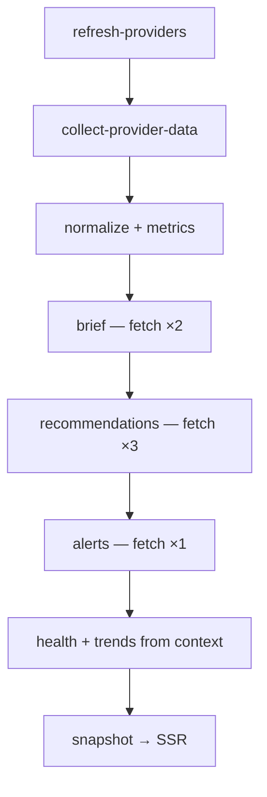
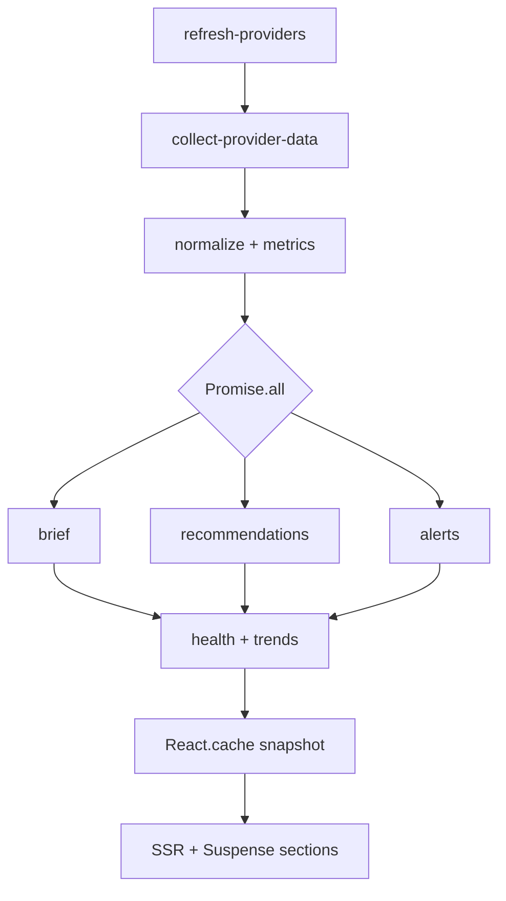

# ORION Performance Audit Report

| Field | Value |
|-------|-------|
| **Document ID** | QA-002 |
| **Title** | ORION Performance Audit Report |
| **Version** | 1.0.0 |
| **Date** | 25 July 2026 |
| **Scope** | Dashboard rendering, React rerenders, bundle size, intelligence pipeline, provider execution |
| **Branch** | `main` @ `cc4a282` (uncommitted local changes may exist) |
| **Auditor** | Automated performance audit (Sprint 4 post-implementation) |

---

## Executive Summary

ORION’s Executive Dashboard is **architecturally sound for rendering** — 14 of 16 dashboard widgets are Server Components, lists are bounded server-side, and intelligence work stays on the server. The dominant performance risks are **server-side redundancy** (7× provider collection per pipeline run) and **platform layout client JS** (~533 KB uncompressed first-load JS shared across routes), not React rerender churn on `/dashboard`.

With mock providers, a full dashboard pipeline completes in **~47 ms**. The Recommendation Engine stage accounts for **~81%** of that time today. Once real network providers are wired, redundant fetches will dominate latency unless pipeline context is shared.

**Overall performance grade: C+ (Good UI architecture, significant backend duplication, heavy shared client baseline)**

| Area | Rating | Primary concern |
|------|--------|-----------------|
| Dashboard rendering | B+ | Blocking monolithic fetch; no streaming/Suspense |
| Component rerenders | A− | Server-rendered dashboard; minimal client state |
| Bundle size | C | ~533 KB uncompressed shared baseline per route |
| Lazy loading | B− | Command palette split; dashboard widgets eager |
| Memoization | B | Appropriate absence on RSC; gaps only on client widgets |
| Pipeline execution | C | Sequential stages 5–7; duplicate engine work |
| Provider execution | C− | 7× `fetchProviderContributions()` per load |
| Intelligence execution | C | Nested fetches in Recommendation/Alert engines |
| Caching | D+ | No request-level or pipeline snapshot cache |

---

## Audit Methodology

- Static analysis of `app/(platform)/dashboard/`, `components/dashboard/`, `lib/orchestrator/`, `lib/providers/`, `lib/intelligence/`
- Production build: `npm run build` (Next.js 16.2.10 · Turbopack)
- Route bundle stats: `.next/diagnostics/route-bundle-stats.json`
- Pipeline timing: direct invocation of `runDashboardPipeline()` via `tsx` (mock providers, local Node runtime)
- Grep for `React.memo`, `useMemo`, `useCallback`, `dynamic()`, `React.cache()`, `unstable_cache`

---

## 1. Dashboard Rendering

### Current architecture

`/dashboard` is an **async Server Component** that awaits a single intelligence call before emitting HTML:

```42:43:app/(platform)/dashboard/page.tsx
export default async function ExecutiveDashboardPage() {
  const snapshot = await executiveIntelligenceService.getDashboardSnapshot();
```

**Render tree (server-only):**

```
ExecutiveDashboardPage
├── Header (inline greeting/date)
├── HealthScore + MetricCard × 4
├── BriefCard
├── RecommendationCard × N (N ≤ 6)
├── AlertPanel (critical + recent≤8 + resolved≤5)
└── TaskList
```

Build output classifies the route as **static prerender**:

```
○ /dashboard  (Static)  prerendered as static content
```

There is no `export const dynamic = 'force-dynamic'`, no `revalidate`, and no `loading.tsx`. The full orchestrator pipeline runs at **build time**; runtime users receive a frozen snapshot until the next build.

### Measurements

| Metric | Value | Notes |
|--------|-------|-------|
| Time to first byte (TTFB) | Build-time bound | No runtime pipeline on static delivery |
| Server pipeline (mock) | **47 ms** | Measured via `runDashboardPipeline()` |
| Dashboard list caps | Recs ≤ 6, recent alerts ≤ 8, resolved ≤ 5 | Enforced in prioritizers |
| `loading.tsx` / Suspense | **None** | Entire page blocks on snapshot |

### Findings

| ID | Severity | Finding |
|----|----------|---------|
| DR-01 | High | Monolithic blocking fetch — no progressive section rendering |
| DR-02 | High | Static prerender serves stale intelligence at runtime |
| DR-03 | Medium | No route-level loading skeleton for future dynamic mode |
| DR-04 | Low | Duplicate greeting/date helpers in `page.tsx` and `CommandCenterHeader.tsx` |

---

## 2. Component Rerenders

### Client vs server boundaries

| Component | Boundary | Rerender risk |
|-----------|----------|---------------|
| `app/(platform)/dashboard/page.tsx` | Server | None after SSR |
| 14 dashboard widgets (`MetricCard`, `AlertPanel`, etc.) | Server | None |
| `OrionIntelligence` | Client (`useState`) | Keystroke rerenders — **not on `/dashboard`** |
| `CommandCenterHeader` | Client (unnecessary) | None — stateless |
| `CommandPaletteProvider` | Client | Cmd+K open state |
| `Sidebar` | Client (`usePathname`) | Route navigation only |

**Dashboard-specific rerender assessment:** `/dashboard` has **no client-side dashboard state**. Rerender risk is limited to shared layout chrome (`Sidebar`, `CommandPaletteProvider`), not executive widgets.

### Layout impact on all platform routes

```30:52:components/layout/DashboardLayout.tsx
export function DashboardLayout({ children }: DashboardLayoutProps) {
  return (
    <CommandPaletteProvider>
      ...
      <Sidebar />
      ...
      <main>{children}</main>
```

Every platform page — including `/dashboard` — wraps content in two persistent client boundaries. Opening the command palette rerenders the provider subtree, but RSC `children` remain stable slots.

### Findings

| ID | Severity | Finding |
|----|----------|---------|
| RR-01 | Low | No dashboard widget rerender problem today (RSC-first) |
| RR-02 | Medium | Unnecessary `"use client"` on `CommandCenterHeader` adds client bundle without benefit |
| RR-03 | Low | `OrionIntelligence` inline `onChange` handler is fine in isolation; would matter if children were memoized |
| RR-04 | Low | `TaskList.normalizeTasks()` recomputes on every render — relevant only if moved client-side |

---

## 3. Bundle Size

### Route-level measurements (production build)

Source: `.next/diagnostics/route-bundle-stats.json`

| Route | First Load JS (uncompressed) | Approx. |
|-------|------------------------------|---------|
| `/dashboard` | 546,221 bytes | **~533 KB** |
| `/mission-control` | 552,446 bytes | ~539 KB |
| `/intelligence` | 550,747 bytes | ~538 KB |
| `/command-center` | 547,462 bytes | ~534 KB |
| `/login` | 530,349 bytes | ~518 KB |

Dashboard does **not** carry a route-specific intelligence chunk — pipeline code executes server-side. Client weight is almost entirely **shared platform layout + React/Next runtime**.

### Largest shared chunks (`/dashboard`)

| Chunk | Size (bytes) | Share |
|-------|-------------|-------|
| `0kb1anrs0q0f8.js` | 227,538 | ~42% |
| `3ys9ernvtd1v6.js` | 141,598 | ~26% |
| `27jktro2p5rq9.js` | 44,414 | ~8% |
| `14mrh2-p_w84d.js` | 54,646 | ~10% |
| Other chunks | 78,025 | ~14% |

**Total:** 546,221 bytes uncompressed (gzip size not reported by Next 16 Turbopack diagnostics).

### Tooling gap

- `@next/bundle-analyzer` is **not installed**
- `next.config.ts` has no analyzer or split-chunk configuration
- No `analyze` npm script

### Findings

| ID | Severity | Finding |
|----|----------|---------|
| BS-01 | High | ~533 KB uncompressed baseline exceeds typical executive dashboard needs |
| BS-02 | Medium | No bundle analyzer — largest modules unidentified at symbol level |
| BS-03 | Low | Dashboard intelligence code correctly excluded from client bundles |

---

## 4. Lazy Loading Opportunities

### Current usage

**Implemented (good pattern):**

```14:20:components/layout/CommandPaletteProvider.tsx
const CommandPalette = dynamic(
  () =>
    import("@/components/search/CommandPalette").then((module) => ({
      default: module.CommandPalette,
    })),
  { ssr: false },
);
```

Command palette loads only when opened — appropriate deferral of search UI.

### Missing opportunities

| Target | Rationale | Priority |
|--------|-----------|----------|
| `OrionIntelligence` on `/mission-control` | Client widget with static content + input; not needed for first paint | Medium |
| `QuickActionsCard` / `PlatformHealthCard` | Below-fold on Mission Control | Low |
| Dashboard sections (future dynamic mode) | Split Brief / Alerts / Recommendations with `Suspense` | High (when live data enabled) |
| `Sidebar` nav icons / heavy modules | Evaluate if nav can stay server with client island for active state | Low |

**Dashboard route today:** all widgets are imported statically in `page.tsx` — acceptable while lists are small and server-rendered.

### Findings

| ID | Severity | Finding |
|----|----------|---------|
| LL-01 | Medium | No `loading.tsx` or section-level Suspense on `/dashboard` |
| LL-02 | Medium | `OrionIntelligence` eagerly loaded on Mission Control despite below-fold placement |
| LL-03 | Low | No `React.lazy()` usage outside command palette |

---

## 5. Memoization Opportunities

### Current state

| Location | Pattern |
|----------|---------|
| `components/dashboard/*` | **No** `memo` / `useMemo` / `useCallback` |
| `CommandPaletteProvider` | `useCallback` + `useMemo` for stable context |
| `CommandPalette` | Heavy `useMemo` for search results |
| `usePermissions` / `SessionProvider` | Memoized callbacks and context values |

Dashboard widgets use **module-level constants** (good):

- `TREND_CLASS` in `MetricCard.tsx`
- `CATEGORY_LABEL` in `AlertCard.tsx`
- `COLUMN_CLASS` in `DashboardGrid.tsx`
- `SUMMARY_ITEMS` / `RECOMMENDATIONS` in `OrionIntelligence.tsx`

### Recommendation matrix

| Technique | Apply? | Where | Why |
|-----------|--------|-------|-----|
| `React.memo` | **No (now)** | Dashboard cards | Server Components — no rerender benefit |
| `React.memo` | **Maybe (future)** | `AlertCard`, `MetricCard` | Only if wrapped by client parent with live updates |
| `useMemo` | **No (now)** | Dashboard lists | Mapped on server once per request |
| `useMemo` | **Yes** | `TaskList.normalizeTasks` | If component becomes client-side |
| `useCallback` | **Yes** | `OrionIntelligence` input handler | If extracting memoized child components |
| `React.cache()` | **Yes (server)** | `getDashboardSnapshot()` | Dedupe within request (see §8) |

### Findings

| ID | Severity | Finding |
|----|----------|---------|
| MO-01 | Info | Memoization correctly omitted for RSC dashboard widgets |
| MO-02 | Low | Premature `React.memo` on server components would add complexity without gain |
| MO-03 | Medium | Server-side `React.cache()` not used for intelligence accessors |

---

## 6. Pipeline Execution

### Stage flow

Defined in `lib/orchestrator/OrchestratorPipeline.ts`, executed by `PipelineRunner.runDashboardPipeline()`.

```
1. refresh-providers        (connect → refresh → sync)
2. collect-provider-data    (fetchProviderContributions)
3. normalize-data
4. update-business-metrics   (uses context ✓)
5. generate-executive-brief (re-fetches ✗)
6. generate-recommendations (re-fetches ×3 ✗)
7. evaluate-alerts          (re-fetches ✗)
8–9. health + trends        (Promise.all, uses context ✓)
10. produce-dashboard-snapshot
```

Stages 5–7 run **sequentially** despite being independent after stage 4.

### Measured timings (mock providers, local Node)

| Stage | Duration (ms) | % of total |
|-------|--------------|------------|
| `generate-recommendations` | 38 | **81%** |
| `generate-executive-brief` | 4 | 9% |
| `refresh-providers` | 1 | 2% |
| `evaluate-alerts` | 1 | 2% |
| `calculate-business-health` | 1 | 2% |
| Other stages | 2 | 4% |
| **Total pipeline** | **47** | 100% |

Reported `pipelineDurationMs` sums stage durations (including parallel stages), so it **overstates wall-clock** vs. true elapsed time.

### Duplicate work in brief stage

```318:323:lib/orchestrator/PipelineRunner.ts
          const [brief, dailyBrief] = await Promise.all([
            buildExecutiveBriefForDashboard(),
            buildDailyExecutiveBrief(),
          ]);
```

`buildExecutiveBriefForDashboard()` already calls `generateDailyBrief()` internally (`ExecutiveBriefEngine.ts:68-70`), so the daily brief is generated **twice**.

### Findings

| ID | Severity | Finding |
|----|----------|---------|
| PE-01 | Critical | Stages 5–7 ignore `context.normalizedContributions` and re-fetch |
| PE-02 | High | Stages 5–7 should run in `Promise.all` after stage 4 |
| PE-03 | High | Brief stage duplicates `generateDailyBrief()` |
| PE-04 | Medium | Stage 1 runs `refreshAll()` then `syncAll()` — redundant (`refresh()` aliases `sync()`) |
| PE-05 | Medium | `pipelineDurationMs` sums stages instead of wall-clock timing |
| PE-06 | Low | Aggregation logic duplicated in `PipelineRunner` and 3 engines |

---

## 7. Provider Execution

### Per-pipeline provider fan-out

`fetchProviderContributions()` always reconnects and fetches all dashboard-capable providers:

```29:38:lib/providers/dashboard-aggregator.ts
export async function fetchProviderContributions(): Promise<ProviderDashboardContribution[]> {
  await providerManager.connectAll();
  ...
  const results = await Promise.all(
    providers.map((provider) => provider.fetchDashboardContribution()),
  );
```

**Estimated calls per dashboard pipeline run:**

| Call site | `connectAll()` | Provider contribution fetches |
|-----------|---------------|----------------------------|
| Stage 1 `refresh-providers` | 1 | — |
| Stage 2 `collect-provider-data` | 1 | 7 providers |
| Stage 5 brief (×2 parallel) | 2 | 14 |
| Stage 6 recommendations context | 3 | 21 |
| Stage 7 alerts | 1 | 7 |
| **Total** | **~8×** | **~49 fetches** |

With 7 registered mock providers, **one fetch would suffice**.

### ProviderManager parallelism

```29:43:lib/providers/ProviderManager.ts
  async syncAll(): Promise<void> {
    await Promise.all(this.getAllProviders().map((provider) => provider.sync()));
  }
  ...
  async connectAll(): Promise<void> {
    await Promise.all(this.getAllProviders().map((provider) => provider.connect()));
  }
```

Operations parallelize across providers (good), but there is **no execution-scoped deduplication** or connection guard.

### Findings

| ID | Severity | Finding |
|----|----------|---------|
| PV-01 | Critical | ~7× redundant full provider collection per pipeline |
| PV-02 | High | `connectAll()` inside every fetch — wasteful after stage 1 |
| PV-03 | Medium | Mock cost is negligible; real I/O will expose this as primary bottleneck |
| PV-04 | Low | `build*FromProviders()` helpers each re-fetch independently |

---

## 8. Intelligence Execution

### Service entry points

```39:86:lib/intelligence/ExecutiveIntelligenceService.ts
  async getDashboardSnapshot() { return getOrchestratorDashboardSnapshot(); }
  async getExecutiveBrief() { return buildExecutiveBriefForDashboard(); }
  async getRecommendations() { return buildRecommendationsFromProviders(); }
  async getAlerts() { return buildAlertsFromProviders(); }
  ...
```

Dashboard page uses the orchestrator path (correct). Individual accessors each trigger **independent provider fetches** — dangerous for API routes or future multi-widget SSR.

### Recommendation Engine nested fetches (hot path)

```280:290:lib/intelligence/recommendations/RecommendationEngine.ts
async function buildRecommendationContext(): Promise<RecommendationContext> {
  const contributions = await fetchProviderContributions();
  return {
    contributions,
    businessHealth: aggregateBusinessHealth(contributions),
    alerts: await buildDashboardAlerts(),           // → another fetch + full alert eval
    trends: aggregateTrends(contributions),
    metrics: aggregateMetrics(contributions),
    dailyBrief: await executiveBriefEngine.generateDailyBrief(),  // → another fetch
  };
}
```

This explains **81% of pipeline time** on mock data: three sequential fetches plus nested alert and brief evaluation.

### Alert Engine

`buildAlertEvaluationContext()` in `AlertEngine.ts` independently calls `fetchProviderContributions()` and re-implements aggregation helpers (duplicated from `PipelineRunner` and `RecommendationEngine`).

### Existing caching

| Mechanism | Scope | Helps dashboard? |
|-----------|-------|------------------|
| `pipelineMetrics.getLastExecution()` | Last run metadata | Observability only |
| `executionLogger` | In-memory logs | No |
| `alertHistory` | Session alert dedup/history | Partial |
| `CRM_INTELLIGENCE` module cache | CRM workspace only | No |
| `React.cache()` / `unstable_cache` | — | **Not used** |
| Static prerender | Build-time snapshot | Hides runtime cost; stale data |

### Findings

| ID | Severity | Finding |
|----|----------|---------|
| IE-01 | Critical | Recommendation context performs 3 nested full fetches |
| IE-02 | High | Alert evaluation runs twice per pipeline (stage 6 nested + stage 7) |
| IE-03 | High | No request-scoped memoization on intelligence accessors |
| IE-04 | Medium | Duplicate aggregation in 4+ modules |
| IE-05 | Medium | `ExecutiveIntelligenceService` dual paths bypass orchestrator cache |

---

## 9. Virtualization

### List sizes (server-capped)

| UI list | Cap | Source |
|---------|-----|--------|
| Recommendations | 6 | `RecommendationEngine.generateRecommendations(limit = 6)` |
| Recent alerts | 8 | `AlertPrioritizer.buildAlertBundle` → `slice(0, 8)` |
| Resolved alerts | 5 | `AlertHistory.getResolved(limit = 5)` |
| Tasks | Unbounded | Provider aggregation — typically small |

**Verdict:** Virtualization (`react-window`, `@tanstack/react-virtual`) is **not applicable today**. Lists render ≤ 20 DOM nodes. Revisit if provider task/alert volumes grow beyond ~50 visible items or client-side live updates are added.

---

## 10. Recommendations

Prioritized action plan with technique mapping.

### P0 — Backend: fetch once, share context (highest ROI)

| Action | Techniques | Effort |
|--------|------------|--------|
| Pass `ExecutionContext.normalizedContributions` into Brief, Recommendation, and Alert stages | Caching (execution-scoped) | 1–2 days |
| Remove `connectAll()` from `fetchProviderContributions()` when pipeline stage 1 completed | Caching / guard flag | 2–4 hours |
| Run stages 5–7 in `Promise.all` after stage 4 | Pipeline parallelization | 4–8 hours |
| Call `generateDailyBrief()` once; derive dashboard brief via formatter | Deduplication | 1–2 hours |
| Extract shared aggregators to `lib/intelligence/shared/aggregators.ts` | Code consolidation | 4–8 hours |

### P1 — Rendering: live dashboard mode

| Action | Techniques | Effort |
|--------|------------|--------|
| Add `export const revalidate = 60` or `dynamic = 'force-dynamic'` to `/dashboard` | Caching (ISR / dynamic) | 1 hour |
| Add `app/(platform)/dashboard/loading.tsx` skeleton | Code splitting (route-level) | 2–4 hours |
| Split dashboard sections with `<Suspense>` boundaries | Dynamic imports + streaming | 1 day |
| Wrap `getDashboardSnapshot()` in `React.cache()` | Caching (request dedup) | 1–2 hours |

**Example — request-scoped cache:**

```typescript
import { cache } from "react";

export const getCachedDashboardSnapshot = cache(async () => {
  return intelligenceOrchestrator.getDashboardSnapshot();
});
```

### P2 — Client bundle reduction

| Action | Techniques | Effort |
|--------|------------|--------|
| Install `@next/bundle-analyzer` and add `"analyze": "ANALYZE=true next build"` | Observability | 30 min |
| Remove `"use client"` from `CommandCenterHeader` | Code splitting (boundary reduction) | 15 min |
| Lazy-load `OrionIntelligence` on Mission Control | `next/dynamic` | 1 hour |
| Audit `0kb1anrs0q0f8.js` (~228 KB) after analyzer install | Code splitting | TBD |

**Example — defer Mission Control intelligence panel:**

```typescript
const OrionIntelligence = dynamic(
  () => import("@/components/dashboard/OrionIntelligence").then((m) => ({
    default: m.OrionIntelligence,
  })),
  { loading: () => <CardSkeleton /> },
);
```

### P3 — React memoization (only where client state exists)

| Action | Techniques | When |
|--------|------------|------|
| Keep dashboard cards as Server Components | Avoid premature `React.memo` | Now |
| `useCallback` for `OrionIntelligence` input if extracting child components | `useCallback` | If refactoring client widget |
| `useMemo` for `TaskList.normalizeTasks` | `useMemo` | If `TaskList` becomes client-side |
| `React.memo(AlertCard)` | `React.memo` | Only if live alert feed added client-side |

### P4 — Future scale

| Action | Techniques | Trigger |
|--------|------------|---------|
| Provider contribution TTL cache per execution window | Caching | Real network providers |
| Background pre-warm via `ExecutionScheduler` | Caching | SLA < 200 ms TTFB |
| List virtualization in `AlertPanel` / `TaskList` | Virtualization | > 50 visible items |
| Edge cache for `DashboardSnapshot` JSON | Caching | Multi-region deployment |

---

## 11. Target Metrics

Suggested targets after P0–P1 remediation:

| Metric | Current (mock) | Target |
|--------|----------------|--------|
| Provider fetches per dashboard load | ~49 | **7** (1× fan-out) |
| `connectAll()` calls per pipeline | ~8 | **1** |
| Pipeline wall-clock (mock) | 47 ms | **< 20 ms** |
| Pipeline wall-clock (real providers) | TBD | **< 500 ms** p95 |
| `/dashboard` first-load JS (gzip) | ~533 KB uncompressed | **< 200 KB** gzip |
| Dashboard TTFB (dynamic mode) | N/A (static) | **< 300 ms** p95 |
| Client rerenders on `/dashboard` | 0 (post-SSR) | **0** (maintain RSC) |

---

## 12. Architecture Diagram

### Current (sequential + redundant)



### Recommended (fetch once, parallelize engines)



---

## 13. Key File Index

| File | Performance role |
|------|------------------|
| `app/(platform)/dashboard/page.tsx` | Blocking SSR entry |
| `components/layout/DashboardLayout.tsx` | Shared client layout wrapper |
| `components/layout/CommandPaletteProvider.tsx` | Only dynamic import in layout |
| `components/dashboard/*` | Server-first widgets (14/16) |
| `lib/orchestrator/PipelineRunner.ts` | Pipeline execution + duplication source |
| `lib/providers/dashboard-aggregator.ts` | Provider fetch hub |
| `lib/providers/ProviderManager.ts` | connect/sync fan-out |
| `lib/intelligence/recommendations/RecommendationEngine.ts` | Hot path (~81% mock time) |
| `lib/intelligence/alerts/AlertEngine.ts` | Independent re-fetch |
| `lib/intelligence/brief/ExecutiveBriefEngine.ts` | Duplicate brief generation |
| `lib/intelligence/ExecutiveIntelligenceService.ts` | Service facade (dual paths) |
| `.next/diagnostics/route-bundle-stats.json` | Route bundle measurements |
| `next.config.ts` | Empty — no perf tuning |

---

## 14. Summary

ORION’s dashboard UI layer is **performance-conscious by default** — Server Components, bounded lists, and deferred command palette loading are the right patterns. The urgent work is **server-side**: eliminate redundant provider and intelligence fetches, parallelize independent pipeline stages, and introduce request-level caching before real providers replace mocks.

Client-side `React.memo` / `useMemo` / `useCallback` are **not priorities** for `/dashboard` today. Virtualization is **not needed** at current list sizes. Bundle size reduction should focus on **shared layout chunks** and **lazy-loading Mission Control client widgets**, not dashboard intelligence cards.

---

*End of Performance Audit Report · QA-002 · v1.0.0*
