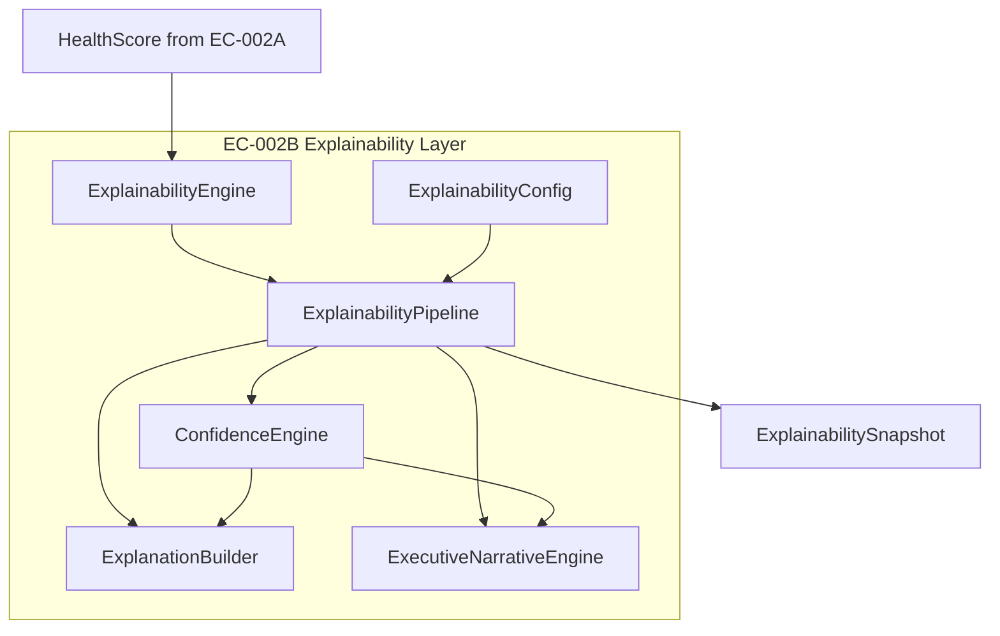
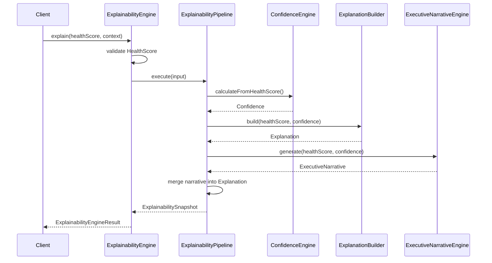

# Explainability Architecture

**Capability:** EC-002B — Explainability & Confidence Engine  
**Module:** `lib/explainability/`  
**Version:** 1.0.0  
**Status:** Implemented  
**Governed by:** [ORION Constitution](../09_Standards/ORION_Constitution_Ratified.md) · [Engineering Principles](../09_Standards/ORION_Engineering_Principles.md) · [ES-010](../07_Engineering/ES-010_Explainability_Confidence_Engine.md)

---

## Purpose

EC-002B transforms deterministic Business Health Scores from EC-002A into **confidence-aware, board-ready explanations** without modifying score calculations or introducing AI narration.

The explainability layer answers the North Star questions:

| Question | Output |
|----------|--------|
| Why? | Ranked `ExplanationItem[]` with contribution evidence |
| How certain are we? | Multi-factor `Confidence` assessment |
| What should executives read? | Deterministic `ExecutiveNarrative` |

---

## Architecture overview



---

## Module structure

```
lib/explainability/
├── ExplainabilityEngine.ts      # Public entry point
├── ExplainabilityPipeline.ts    # Stage orchestration
├── ExplainabilityResult.ts      # Immutable result types
├── ExplainabilityConfig.ts      # Central configuration
├── index.ts                     # Public barrel exports
├── models/                      # Domain types (Phase 1)
├── engine/                      # Confidence Engine (Phase 2)
├── builder/                     # Explanation Builder (Phase 3)
└── narrative/                   # Executive Narrative Engine (Phase 4)
```

---

## Execution flow

1. **Ingest** — `ExplainabilityEngine` validates `HealthScore` input.
2. **Confidence** — `ConfidenceEngine` derives quality signals from KPI context.
3. **Explanation** — `ExplanationBuilder` ranks contributors and formats evidence.
4. **Narrative** — `ExecutiveNarrativeEngine` composes the executive summary bundle.
5. **Assemble** — `ExplainabilityPipeline` merges stages into `ExplainabilitySnapshot`.

No stage mutates EC-002A scores. All narrative text is template-driven.

---

## Sequence diagram



---

## Design rationale

| Decision | Rationale |
|----------|-----------|
| Pipeline separate from engine | Engine handles validation and KPI delegation; pipeline stays pure orchestration |
| Narrative engine overrides builder narrative | Phase 4 narrative engine is the canonical executive voice; builder supplies structured evidence |
| Config object over env vars | Deterministic, testable, injectable thresholds without hidden globals |
| Result type with `{ success, data \| error }` | Matches EC-002A patterns; safe for Brief / Command Center consumption |
| Template-only prose | Article IV (Deterministic Core) — no LLM in V1 |
| Downward dependency on EC-002A only | Explainability reads `HealthScore`; never reverse-imports |

---

## Extension points

| Extension | Mechanism |
|-----------|-----------|
| Confidence thresholds | `ExplainabilityConfig.confidenceRules` |
| Contributor highlight count | `ExplainabilityConfig.highlightLimit` |
| Executive templates | `lib/explainability/narrative/NarrativeTemplates.ts` |
| Explanation formatting | `ExplanationFormatter` + `MessageTemplates` |
| Custom pipeline wiring | Inject `ExplainabilityConfig` into `ExplainabilityEngine` constructor |
| KPI-to-explain path | `ExplainabilityEngine.explainFromKPIs()` delegates to EC-002A then pipeline |

---

## Dependency rules

- EC-002B imports EC-002A models and `BusinessHealthEngine` — never the reverse.
- No provider normalizers in explainability layer.
- No UI or persistence in this module.
- No AI / LLM imports permitted.

---

## Related documents

- [ES-010 — Explainability & Confidence Engine](../07_Engineering/ES-010_Explainability_Confidence_Engine.md)
- [DC-010 — Development Contract](../07_Engineering/DC-010_Explainability_Confidence_Engine.md)
- [EC-002A — Business Health Engine Core](../07_Engineering/EC-002A_Business_Health_Engine_Core.md)
- [Explainability Integration Guide](../01_Engineering/Explainability_Integration.md)

---

## Version history

| Version | Date | Author | Changes |
|---------|------|--------|---------|
| 1.0.0 | 26 July 2026 | ORION CTO | Initial architecture document · EC-002B Phase 5 |
