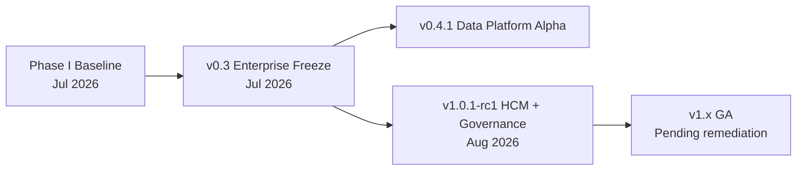

# ORION Architecture Baselines

**Authority:** [Release-Policy.md](./Release-Policy.md) · [G-001 Enterprise Architecture Governance Charter](../11_Governance/Governance/G-001-Enterprise-Architecture-Governance-Charter.md) · [ES-097 Architecture Governance & ADR Policy](../00_Governance/ES-097-ORION-Architecture-Governance-ADR-Policy.md)

This document tracks **architecture freezes**, **governance milestones**, **reference architectures**, and **platform maturity** across ORION releases. Each baseline is immutable once frozen — evolution requires ADR and a new baseline entry.

---

## Baseline Index

| Baseline | Date | Status | Primary Document | Release Line |
|----------|------|--------|------------------|--------------|
| **Phase I** | 24 Jul 2026 | Frozen | [ORION v1.0 Architecture Baseline](../03_Architecture/ORION_v1.0_Architecture_Baseline.md) | v1.0.0 · v1.1.0 · v1.2.0 |
| **v0.3 Enterprise Freeze** | 30 Jul 2026 | Frozen | [ARCHITECTURE_FREEZE_v0.3.md](../11_Governance/Architecture/ARCHITECTURE_FREEZE_v0.3.md) | v0.4.x · P-007 · P-008 |
| **v1.0 Candidate** | Aug 2026 | Active RC | [Enterprise Architecture Handbook v1.0](../00_Governance/ORION_Enterprise_Architecture_Handbook_v1.0.md) | v1.0.1-rc1 |

---

## Baseline: Phase I (July 2026)

| Field | Value |
|-------|-------|
| **Document** | [ORION v1.0 Architecture Baseline](../03_Architecture/ORION_v1.0_Architecture_Baseline.md) |
| **Date frozen** | 24 July 2026 |
| **Scope** | Executive Experience · Intelligence Platform · Business Workspaces (Finance, CRM) |
| **Git tag** | `v1.0.0` |

**Layers frozen:**

1. Executive Experience — Shell, Brief, Command Palette, Design System
2. Executive Intelligence Platform — Provider Registry, Intelligence Bus, engines
3. Business Workspaces — Finance, CRM patterns (ADR-005)

**Reference architectures:**

- [ADR-001 Executive Shell](../11_Governance/ADR/ADR-001-Executive-Shell.md) · Pending acceptance
- [ADR-005 Business Workspace](../11_Governance/ADR/ADR-005-Business-Workspace-Architecture.md) · Accepted
- [ADR-006 Intelligence Provider Framework](../11_Governance/ADR/ADR-006-Executive-Intelligence-Provider-Framework.md) · Accepted

**Platform maturity:** Phase I complete — executive UX and first business workspaces

---

## Baseline: v0.3 Enterprise Freeze (July 2026)

| Field | Value |
|-------|-------|
| **Document** | [ARCHITECTURE_FREEZE_v0.3.md](../11_Governance/Architecture/ARCHITECTURE_FREEZE_v0.3.md) |
| **Date frozen** | 30 July 2026 |
| **Authority** | Chief Enterprise Architect |
| **Scope** | Platform services · Hospitality · Commercial domains before Finance engineering |

**Certified domains at freeze:**

| Domain | Certification | Reference |
|--------|---------------|-----------|
| Hospitality | CONDITIONAL GO | [P-007.8](../11_Governance/Certification/P-007.8-Hospitality-Workspace-Certification.md) |
| Commercial (CRM) | CONDITIONAL GO | [P-008.8](../11_Governance/Certification/P-008.8-Commercial-Domain-Certification.md) |

**Platform services frozen:** Identity · Organization · IIL · Executive Brief · Executive Memory · Decision Intelligence · Notifications · Search · Analytics · Audit

**Platform maturity:** Enterprise domain map established · Finance marked next

---

## Baseline: v1.0 Candidate (August 2026)

| Field | Value |
|-------|-------|
| **Document** | [Enterprise Architecture Handbook v1.0](../00_Governance/ORION_Enterprise_Architecture_Handbook_v1.0.md) |
| **Mission** | P-013.1 |
| **Date** | August 2026 |
| **Status** | Active — governing RC releases |
| **Release** | v1.0.1-rc1 |

**Major governance milestones (P-013):**

| Document | ID | Mission | Status |
|----------|-----|---------|--------|
| Enterprise Architecture Handbook | EA-HANDBOOK-001 | P-013.1 | Ratified |
| Next.js Enterprise Standards | ES-090 | P-013.2 | Ratified |
| Enterprise Development Standards | ES-091 | P-013.3 | Ratified |
| Testing & Certification Standards | ES-096 | P-013.8 | Ratified |
| Architecture Governance & ADR Policy | ES-097 | P-013.9 | Ratified |
| UI/UX Standards | ES-092 | P-013.4 | Planned |
| API Standards | ES-093 | P-013.5 | Planned |
| Event & Integration Standards | ES-094 | P-013.6 | Planned |
| Workflow & Orchestration Standards | ES-095 | P-013.7 | Planned |

**Reference domain implementation:**

| Domain | Package | ES | Release Status |
|--------|---------|-----|----------------|
| **HCM** | `lib/hcm/` | ES-HCM-001 | v1.0.1-rc1 · CONDITIONAL GO |
| Finance | `lib/finance/` | ES-FIN-001 | Workspace · pre-enterprise API |
| CRM | `lib/crm/` | ES-027+ | Certified P-008 |
| Hospitality | `lib/hospitality/` | Workspace ES | Certified P-007 |
| Data Platform | `lib/platform/data/` | ES-DATA-001 | v0.4.1-alpha · CONDITIONAL GO |

**Architectural patterns codified:**

```
REST API → Domain Facade → Service → Repository → Store
Cross-domain: IIL events only
Workflow: Domain orchestrator → Workflow Platform
Public import: @/lib/<domain> facade only
Tenancy: ServiceContext.organizationId
```

**Platform maturity:** Enterprise reference architecture complete · HCM is certification reference · GA pending P0 debt remediation

---

## Architecture Freeze Policy

| Rule | Detail |
|------|--------|
| **Immutability** | Frozen baselines are not edited — supersede with new baseline + ADR |
| **ADR required** | Changes to frozen patterns require ADR per [ES-097 §3](../00_Governance/ES-097-ORION-Architecture-Governance-ADR-Policy.md#3-when-adrs-are-mandatory) |
| **Release linkage** | GA releases update architecture baseline document if structural change |
| **Domain conformance** | New domains must conform to active baseline before Gate 5 |

---

## Reference Architecture Documents

| Layer | Document |
|-------|----------|
| Platform architecture | [ORION Platform Architecture](../03_Architecture/ORION_Platform_Architecture.md) |
| Business workspace pattern | [BUSINESS_WORKSPACE_PATTERN.md](../03_Architecture/BUSINESS_WORKSPACE_PATTERN.md) |
| IIL | [P-006 Intelligence Integration Layer](../03_Architecture/P-006-Intelligence-Integration-Layer.md) |
| Enterprise reference | [ES-050 Enterprise Reference Architecture](../02_Engineering/ES-050-ORION-Enterprise-Reference-Architecture.md) |
| HCM reference | [HCM Architecture Guide](../HCM/Engineering/HCM-Architecture-Guide.md) |
| Data platform | [ES-DATA-001](../Data/Engineering/ES-DATA-001-Enterprise-Data-Platform-Engineering-Specification.md) |
| Financial events | [D-008 Financial Event Model](../Finance/Blueprints/D-008_Enterprise_Financial_Event_Model.md) |

---

## Maturity Progression



| Stage | Characteristics |
|-------|-----------------|
| **Foundation** (v0.3–v0.7) | Shell, design system, persistence contracts |
| **Phase I** (v1.0–v1.2) | Executive UX, Finance/CRM workspaces, intelligence |
| **Enterprise Alpha** (v0.4.1) | Data platform Phase I |
| **Enterprise RC** (v1.0.1-rc1) | HCM reference domain + governance framework |
| **GA** (target) | Persistent stores · permissions · full suite green |

---

## Baseline Update Procedure

1. Complete certification (Gate 6) for scope
2. Publish release notes and certification report in [docs/06_Releases/](./)
3. ADR if architectural change from prior baseline
4. Update this document with new baseline entry
5. Update [RELEASE_HISTORY.md](./RELEASE_HISTORY.md)
6. Founder / Chief Architect sign-off (Gate 7)

---

*ORION Enterprise Platform · Architecture Baselines · Mission P-013.11*
