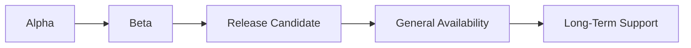

# ORION Release Policy

**Document ID:** REL-POLICY-001  
**Mission:** P-013.11 — Release Management Documentation Consolidation  
**Version:** 1.0  
**Status:** Ratified — Governing Release Standard  
**Effective Date:** August 2026  
**Authority:** Chief Enterprise Architect  

**Parent:** [G-001 Release Governance Guide](../11_Governance/Governance/G-001-Release-Governance-Guide.md) · [G-001 Enterprise Architecture Governance Charter](../11_Governance/Governance/G-001-Enterprise-Architecture-Governance-Charter.md)  
**Related:** [ES-091 Development Standards §6](../00_Governance/ES-091-ORION-Enterprise-Development-Standards.md#6-git-standards) · [ES-096 Testing & Certification Standards §6](../00_Governance/ES-096-ORION-Enterprise-Testing-Certification-Standards.md#6-release-readiness) · [Release-Policy canonical artifacts](./RELEASE_HISTORY.md)

---

## Purpose

This policy defines how ORION versions, tags, branches, certifies, and supports releases. It consolidates release rules from G-001, ES-091, and ES-096 into a single operational reference for all domains.

**Canonical release documentation:** `docs/06_Releases/`

---

## Semantic Versioning

ORION follows [Semantic Versioning 2.0.0](https://semver.org/) adapted for pre-release development.

| Component | Meaning | Example |
|-----------|---------|---------|
| **MAJOR (x)** | Breaking public facade, API, or event contract | v2.0.0 |
| **MINOR (y)** | Additive features within approved ES scope | v1.1.0 |
| **PATCH (z)** | Bug fixes, security patches — no contract change | v1.0.1 |

### Pre-Release Suffixes

| Suffix | Stage | Stability |
|--------|-------|-----------|
| `-alpha` | Internal validation | Unstable |
| `-beta` | Pilot partners | Stabilizing |
| `-rc.n` | Release candidate | Frozen · P0 fixes only |

**Examples:** `v0.4.1-alpha` · `v1.0.1-rc1` · `v1.0.1` (GA)

### Version Scope

| Surface | Versioning Rule |
|---------|-----------------|
| Platform release tag | Semver on git tag |
| Domain facade | Breaking change → platform major or domain ADR |
| REST API | Additive in-place; breaking → new namespace or major |
| IIL events | Additive payload; breaking → new event type + ADR |
| Architecture baseline | Updated at GA when structure changes |

---

## Release Lifecycle



| Stage | Tag Pattern | Certification Minimum | Audience |
|-------|-------------|----------------------|----------|
| **Alpha** | `v0.x.y-alpha` | CONDITIONAL GO acceptable | Internal engineering |
| **Beta** | `v0.x.y-beta` | CONDITIONAL GO · P1 documented | Design partners |
| **RC** | `v0.x.y-rc.n` | GO or CONDITIONAL GO · P0 plan for GA | Production candidate |
| **GA** | `v0.x.y` | **GO** · zero open P0 debt | Production default |
| **LTS** | `v0.x.y-lts` | GA + LTS declaration | Maintenance customers |

Full criteria: [G-001 Release Governance Guide §3](../11_Governance/Governance/G-001-Release-Governance-Guide.md#3-stage-entry--exit-criteria)

---

## Release Candidates

### Purpose

Validate production deployment with **feature freeze** — only P0/P1 fixes allowed.

### RC Rules

1. Certification complete (Gate 6) with recorded GO or CONDITIONAL GO
2. Create branch `release/v<semver>` from certified commit
3. Feature freeze declared in release notes
4. All four validation gates pass on release branch
5. Annotated tag `v<semver>-rc<n>`
6. Two consecutive RC cycles with zero P0/P1 regressions before GA promotion

### Current RC

| Tag | Branch | Certification | Notes |
|-----|--------|---------------|-------|
| `v1.0.1-rc1` | `release/v1.0.1` | CONDITIONAL GO | [Certification](./v1.0.1-rc1-Certification.md) |

---

## Production Releases (GA)

### Entry Criteria

- RC exit criteria met
- Certification decision **GO**
- Zero open P0 technical debt (or ADR-accepted with migration plan)
- Gate 7 Founder / Chief Architect approval
- Release record published · CHANGELOG updated · architecture baseline updated if applicable

### GA Artifacts (Required)

| Artifact | Location |
|----------|----------|
| Release notes | `docs/06_Releases/v<semver>-Release-Notes.md` |
| Certification report | `docs/06_Releases/` or `docs/11_Governance/Certification/` |
| CHANGELOG entry | [CHANGELOG.md](./CHANGELOG.md) |
| RELEASE_HISTORY entry | [RELEASE_HISTORY.md](./RELEASE_HISTORY.md) |
| Technical debt review | [TECHNICAL_DEBT.md](../11_Governance/TECHNICAL_DEBT.md) |

---

## Hotfixes

Emergency production fixes on GA tags.

### Process

1. Branch from GA tag: `hotfix/v<semver>-<short-desc>`
2. Minimal scope — correctness or security only
3. All four validation gates pass
4. Patch version bump: `v1.0.1` → `v1.0.2`
5. Annotated tag pushed
6. Post-incident ADR or TD entry within 5 business days if architectural gap exposed

### Emergency Exception

May bypass Gates 1–4 of **new feature** governance — not validation gates. Requires Founder or Chief Architect written approval per [G-001 §3.2](../11_Governance/Governance/G-001-Enterprise-Architecture-Governance-Charter.md#32-exceptions).

---

## Patch Releases

| Type | Allowed Changes | Version Bump |
|------|-----------------|--------------|
| **Patch** | Bug fix, security, docs correction (no contract change) | z |
| **Minor** | Additive features per approved ES | y |
| **Major** | Breaking changes | x · requires ADR + migration guide |

Patch releases do **not** require full Gate 1–4 cycle — code review + quality gates + updated release notes sufficient.

---

## Support Policy

| Stage | Support Level | Duration |
|-------|---------------|----------|
| **RC** | Engineering stabilization · P0 fixes | Until GA or superseded RC |
| **GA** | Full support · patches and minors | Until next major or LTS declaration |
| **LTS** | Security and critical fixes only | Minimum 12 months from GA declaration |

LTS branch pattern: `release/v<x.y>-lts` when applicable.

**Not supported:** alpha and beta tags in production without explicit waiver.

---

## Branch Strategy

| Branch | Purpose | Lifecycle |
|--------|---------|-----------|
| `main` | Integration trunk | Permanent |
| `feature/<mission>-<desc>` | Feature development | Merge to main · delete after merge |
| `release/v<semver>` | Release stabilization | Created at RC · maintained until GA + patch window |
| `hotfix/v<semver>-<desc>` | Emergency GA fix | Merge to main and release branch |

### Branch Rules

- Lowercase hyphen-separated names with mission ID when applicable
- Release branches created from **certified commit** — not unvalidated feature work
- No force-push to `main` or release tags
- RC branches accept P0/P1 fixes only after feature freeze

Reference: [ES-091 §6 Git Standards](../00_Governance/ES-091-ORION-Enterprise-Development-Standards.md#6-git-standards)

---

## Tagging Strategy

### Tag Format

```bash
git tag -a v1.0.1-rc1 -m "Enterprise HCM RC1 · Governance Framework"
git push origin v1.0.1-rc1
```

| Rule | Detail |
|------|--------|
| **Annotated tags only** | `-a` with descriptive message |
| **Immutable** | Never force-move release tags |
| **Sequential RC** | `-rc1`, `-rc2`, … for same semver line |
| **Match branch** | Tag points to commit on `release/v<semver>` |

### Published Tags (Reference)

| Tag | Meaning |
|-----|---------|
| `v1.0.1-rc1` | Current enterprise RC |
| `v1.0.0-rc1` | Prior RC tag · same baseline as v1.0.1-rc1 |
| `v0.4.1-alpha` | Not tagged (alpha policy) · documented release only |
| `v1.2.0` · `v1.1.0` · `v0.7` | Phase I milestones |

---

## Validation Gates (All Releases)

```bash
npm run typecheck   # Blocking
npm run lint        # Blocking · zero errors
npm test            # Blocking
npm run build       # Blocking
```

| Stage | Additional Requirements |
|-------|------------------------|
| RC | Certification report · debt register current |
| GA | GO decision · coverage targets · P0 debt = 0 |
| Hotfix | Post-incident review if architectural |

Reference: [ES-096 §4 Validation Gates](../00_Governance/ES-096-ORION-Enterprise-Testing-Certification-Standards.md#4-validation-gates)

---

## Certification Decisions

| Decision | Release Action |
|----------|----------------|
| **GO** | Proceed to Gate 7 · tag authorized |
| **CONDITIONAL GO** | RC tag permitted · GA blocked until numbered remediation complete |
| **NO-GO** | No tag · remediation sprint |

Record in `docs/06_Releases/` or `docs/11_Governance/Certification/`.

---

## Release Documentation Checklist

Before any tagged release:

- [ ] Validation gates recorded with pass/fail counts
- [ ] Release notes in `docs/06_Releases/`
- [ ] CHANGELOG updated
- [ ] RELEASE_HISTORY updated
- [ ] Certification decision recorded
- [ ] Technical debt register reviewed
- [ ] Architecture baseline updated if structural change
- [ ] Cross-references to domain release notes (e.g. HCM) verified
- [ ] No duplicate conflicting release info in other folders

---

## Document Hierarchy

| Need | Document |
|------|----------|
| Release timeline | [RELEASE_HISTORY.md](./RELEASE_HISTORY.md) |
| Notable changes | [CHANGELOG.md](./CHANGELOG.md) |
| Architecture freezes | [ORION-Architecture-Baselines.md](./ORION-Architecture-Baselines.md) |
| This policy | Release-Policy.md |
| Constitutional authority | [G-001 Release Governance Guide](../11_Governance/Governance/G-001-Release-Governance-Guide.md) |
| Mission release records | `RR-xxx` in this folder |
| Domain release notes | `docs/<Domain>/Engineering/*-Release-Notes.md` |

Legacy `docs/releases/` content is **superseded** by this folder — see [docs/releases/README.md](../releases/README.md).

---

*ORION Enterprise Platform · Release Policy v1.0 · Mission P-013.11*
