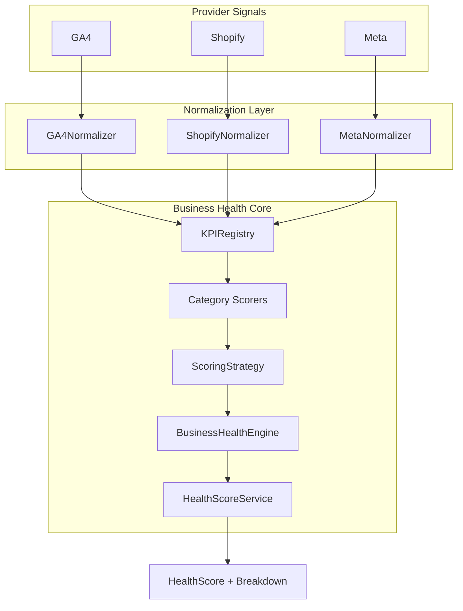

# EC-002A — Business Health Engine Core

**Engineering Specification:** ES-009  
**Development Contract:** DC-009  
**Status:** Implemented  
**Module:** `lib/business-health/` (ORION convention; DC-009 `src/` mapped to `lib/`)

---

## Purpose

EC-002A delivers the provider-independent Business Health Engine responsible for calculating a single Executive Business Health Score from standardized KPI signals.

The engine is deterministic, explainable, extensible via strategy and scorer composition, and fully unit tested. No AI, recommendations, forecasting, or narrative generation is included.

---

## Component diagram



---

## Architecture

```
Provider Raw Signals
        ↓
   Normalizer (GA4 / Shopify / Meta)
        ↓
   Normalized KPI[]
        ↓
   KPI Registry
        ↓
   Category Scorers (delegate to strategy)
        ↓
   ScoringStrategy (WeightedAverageStrategy)
        ↓
   Business Health Score
```

---

## Public interfaces

| Interface | Location | Responsibility |
|-----------|----------|----------------|
| `KPI` | `models/KPI.ts` | Normalized KPI signal |
| `Category` / `CategoryDefinition` | `models/Category.ts` | Weighted KPI grouping |
| `HealthScore` | `models/HealthScore.ts` | Composite executive score |
| `ScoreBreakdown` | `models/ScoreBreakdown.ts` | Explainability record |
| `ScoringStrategy` | `interfaces/ScoringStrategy.ts` | KPI, category, and overall scoring contract |
| `CategoryScorer` | `scorers/CategoryScorer.ts` | Independent category evaluation |
| `KPISignalNormalizer` | `normalizers/types.ts` | Provider signal normalization |
| `BusinessHealthEngine` | `engine/BusinessHealthEngine.ts` | Orchestration pipeline |
| `HealthScoreService` | `services/HealthScoreService.ts` | Executive-facing facade |

### ScoringStrategy methods (DC-009)

- `calculateKPIScore(kpi)` — deterministic 0–100 KPI score
- `calculateCategoryScore(kpis)` — weighted category score + confidence + breakdown
- `calculateOverallScore(categoryScores, categories)` — weighted overall score + confidence + breakdown

---

## Extension points

| Extension | Mechanism |
|-----------|-----------|
| New scoring model | Implement `ScoringStrategy` (e.g. BalancedScorecardStrategy) |
| New provider | Implement `KPISignalNormalizer<TRaw>` |
| New category | Add `CategoryScorer` + category definition |
| Custom thresholds | Pass `HealthStatusThresholds` to `BusinessHealthEngine` |
| Dependency injection | Inject `registry`, `strategy`, `scorers`, `categories` via constructor options |

---

## Health status thresholds

| Score | Status |
|-------|--------|
| 90–100 | Excellent |
| 75–89 | Healthy |
| 60–74 | Fair |
| 40–59 | Poor |
| 0–39 | Critical |

---

## Directory structure

```
lib/business-health/
  engine/BusinessHealthEngine.ts
  interfaces/ScoringStrategy.ts
  models/
  normalizers/GA4Normalizer.ts
  normalizers/ShopifyNormalizer.ts
  normalizers/MetaNormalizer.ts
  registry/KPIRegistry.ts
  scorers/RevenueScorer.ts
  scorers/MarketingScorer.ts
  scorers/CustomerScorer.ts
  scorers/OperationsScorer.ts
  services/HealthScoreService.ts
  strategies/WeightedAverageStrategy.ts
  utils/

tests/business-health/
```

---

## Usage

```typescript
import {
  BusinessHealthEngine,
  GA4Normalizer,
  HealthScoreService,
} from "@/lib/business-health";

const engine = new BusinessHealthEngine();
const result = engine.calculateFromNormalizer(new GA4Normalizer(), {
  sessions: 1200,
  users: 900,
  revenue: 50000,
  bounceRate: 0.42,
});
```

---

## Testing

Unit tests in `tests/business-health/` cover registry, normalizers, utilities, strategy, scorers, engine, and edge cases (empty KPIs, invalid weights, duplicate IDs, zero confidence).

```bash
npm test -- tests/business-health
npm run test:coverage
```

---

## Relationship to ES-032

Mission 17B health aggregation (`lib/intelligence/health-engine.ts`) remains unchanged. EC-002A introduces the canonical KPI-driven engine for orchestrator integration in a follow-on sprint.

---

## Definition of Done (DC-009)

- [x] Domain models
- [x] KPI Registry
- [x] ScoringStrategy interface (three methods, no implementation)
- [x] WeightedAverageStrategy
- [x] BusinessHealthEngine (delegates scoring, provider independent)
- [x] Utilities (stateless pure functions)
- [x] Category scorers (separate files, strategy injection)
- [x] Normalizers (separate files, no scoring)
- [x] Unit tests with edge cases
- [x] Documentation updated
- [x] Validation passing

**Ready for Architecture Review.**
