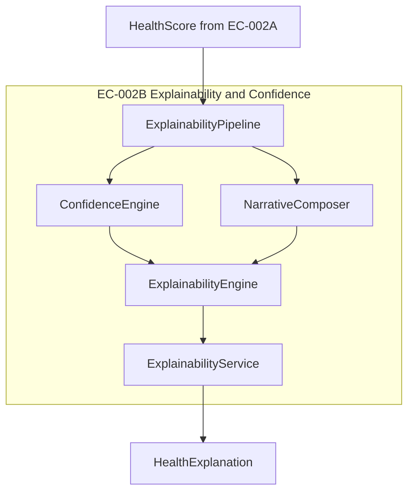

# ES-010 — Explainability & Confidence Engine

**Document ID:** ES-010 (EC-002B Programme)  
**Executive Capability:** EC-002B  
**Classification:** Engineering Specification  
**Version:** 1.0.0  
**Status:** Approved for Implementation  
**Author:** ORION CTO  
**Audience:** Founder · Chief Architect · Engineering  

**Related:**

- [EC-002 — Business Health Engine (Product)](../05_Product/EC-002_Business_Health_Engine.md)
- [EC-002A — Business Health Engine Core](./EC-002A_Business_Health_Engine_Core.md)
- [ES-032 — Business Health Engine](../02_Engineering/ES-032-Business-Health-Engine.md)
- [ORION Constitution (Ratified)](../09_Standards/ORION_Constitution_Ratified.md)
- [ORION Engineering Principles](../09_Standards/ORION_Engineering_Principles.md)
- [ORION Architecture Handbook](../03_Architecture/ORION_Architecture_Handbook.md)

> **Document ID note:** ES-010 in the **EC-002B programme** denotes the Explainability & Confidence Engine. This is distinct from [ES-010 — Persistence Foundation](../02_Engineering/ES-010-Persistence-Foundation.md) (platform v0.4.0).

---

# Objectives

EC-002A delivers deterministic Business Health Scores with structural breakdowns. EC-002B completes the executive trust layer by transforming scores into **defensible, confidence-aware, board-ready explanations**.

The Explainability & Confidence Engine SHALL:

1. Consume `HealthScore` output from EC-002A without modifying scores.
2. Produce a structured **HealthExplanation** bundle answering North Star questions *Why?*, *What changed?*, and *How certain are we?*
3. Generate a **deterministic executive narrative** (template-driven, no LLM in V1).
4. Calculate **multi-factor confidence** aligned with EC-002 product specification.
5. Remain provider-independent, UI-independent, and fully unit testable.
6. Preserve Article IV (Deterministic Core) — AI narration is out of scope for EC-002B.

**Executive outcome:** Every health score is explainable in one sentence and defensible in a board meeting.

---

# Scope

## In scope

| Area | Description |
|------|-------------|
| Confidence Engine | Multi-factor confidence scoring and breakdown |
| Explainability Pipeline | Transform `HealthScore` → `HealthExplanation` |
| Executive Narrative | Deterministic summary sentence and driver statements |
| Domain models | Typed explanation and confidence models |
| Service facade | `ExplainabilityService` for Brief / Command Center consumption |
| Unit tests | ≥90% coverage on new module |
| Documentation | EC-002B implementation guide |

## Out of scope

| Area | Rationale |
|------|-----------|
| Score calculation | EC-002A / `BusinessHealthEngine` |
| AI / LLM narration | EC-005 / future V2 |
| Recommendations | EC-003 |
| Forecasting | ES-031 / future |
| UI components | Presentation layer |
| Database persistence | Future platform sprint |
| Provider integration | Normalizers remain in EC-002A |

---

# Architecture

## Layer placement

```
Business Intelligence Layer (EC-002)
├── EC-002A  Business Health Engine Core     ✓ implemented
└── EC-002B  Explainability & Confidence    ← this specification
        ↓
Executive Intelligence Layer (EC-001 Brief, future surfaces)
```

## Component diagram



## Data flow

```
HealthScore (EC-002A)
        ↓
ExplainabilityPipeline
        ↓
  ┌─────┴─────┐
  │           │
ConfidenceEngine   NarrativeComposer
  │           │
  └─────┬─────┘
        ↓
ExplainabilityEngine
        ↓
HealthExplanation
```

## Dependency rules

| Rule | Requirement |
|------|-------------|
| Downward only | EC-002B imports EC-002A models/services — never reverse |
| No score mutation | Engine MUST NOT alter `overallScore`, category scores, or breakdown math |
| No provider imports | Only normalized `HealthScore` / `KPI` types |
| No UI | Pure TypeScript module |

---

# Domain models

All models are **interfaces or readonly types** with no business logic embedded in model files.

## Confidence models

```typescript
/** Individual confidence factor with weighted impact. */
type ConfidenceFactor = {
  factorId: ConfidenceFactorId;
  label: string;
  score: number;          // 0–100
  weight: number;           // contribution weight (sums to 1.0)
  impact: number;           // weighted contribution to overall confidence
};

type ConfidenceFactorId =
  | "data_completeness"
  | "data_freshness"
  | "source_reliability"
  | "historical_consistency"
  | "cross_provider_agreement";

/** Confidence result for a category or overall health. */
type ConfidenceScore = {
  value: number;            // 0–100
  level: ConfidenceLevel;
  factors: ConfidenceFactor[];
  disclosure: string;       // human-readable caveat
};

type ConfidenceLevel = "high" | "moderate" | "low" | "insufficient";
```

## Explainability models

```typescript
/** Evidence-backed driver contributing to health. */
type HealthDriver = {
  id: string;
  category: string;
  direction: "positive" | "negative";
  magnitude: number;
  metricLabel: string;
  evidence: string;
  rank: number;
};

/** Period-over-period change record. */
type HealthChange = {
  metricLabel: string;
  period: "daily" | "weekly" | "monthly";
  delta: number;
  direction: "up" | "down" | "flat";
  explanation: string;
};

/** Comparison against a baseline reference. */
type HealthComparison = {
  reference: string;
  referenceValue: number;
  currentValue: number;
  delta: number;
  explanation: string;
};

/** Complete explainability bundle for executive surfaces. */
type HealthExplanation = {
  snapshotId: string;
  generatedAt: string;
  overallScore: number;
  overallStatus: HealthStatusLabel;
  overallConfidence: ConfidenceScore;
  summarySentence: string;           // ≤ 20 words
  primaryDrivers: HealthDriver[];
  positiveDrivers: HealthDriver[];
  negativeDrivers: HealthDriver[];
  changesSincePrior: HealthChange[];
  comparisons: HealthComparison[];
  impactStatements: string[];
  confidenceBreakdown: ConfidenceFactor[];
  evidenceRefs: string[];
  narrative: ExecutiveNarrative;
};
```

## Narrative models

```typescript
/** Deterministic executive narrative (no AI). */
type ExecutiveNarrative = {
  headline: string;
  body: string;
  confidenceStatement: string;
  templateId: string;
  variables: Record<string, string | number>;
};
```

---

# Interfaces

## ConfidenceEngine

```typescript
interface ConfidenceEngine {
  calculateCategoryConfidence(kpis: KPI[]): ConfidenceScore;
  calculateOverallConfidence(
    categoryConfidences: ConfidenceScore[],
    weights: number[],
  ): ConfidenceScore;
  resolveConfidenceLevel(value: number): ConfidenceLevel;
}
```

## NarrativeComposer

```typescript
interface NarrativeComposer {
  composeSummary(explanation: Partial<HealthExplanation>): string;
  composeExecutiveNarrative(
    healthScore: HealthScore,
    explanation: Partial<HealthExplanation>,
  ): ExecutiveNarrative;
}
```

## ExplainabilityPipeline

```typescript
interface ExplainabilityPipeline {
  process(healthScore: HealthScore, context?: ExplainabilityContext): HealthExplanation;
}

type ExplainabilityContext = {
  priorScore?: number;
  priorSnapshotId?: string;
  missingProviders?: string[];
  staleProviders?: string[];
};
```

## ExplainabilityEngine

```typescript
interface ExplainabilityEngine {
  explain(
    healthScore: HealthScore,
    context?: ExplainabilityContext,
  ): ExplainabilityResult;
}

type ExplainabilityResult =
  | { success: true; data: HealthExplanation }
  | { success: false; error: ExplainabilityError };
```

## ExplainabilityService

```typescript
interface ExplainabilityService {
  explainFromHealthScore(
    healthScore: HealthScore,
    context?: ExplainabilityContext,
  ): ExplainabilityResult;
  explainFromKPIs(kpis: KPI[], context?: ExplainabilityContext): ExplainabilityResult;
}
```

---

# Confidence calculation algorithm

EC-002B implements the EC-002 product confidence model. All calculations are **deterministic** and **configurable**.

## Category confidence

For each category, derive factor scores from its KPIs:

| Factor | Weight | Calculation (V1) |
|--------|--------|------------------|
| Data completeness | 40% | `(present KPIs / expected KPIs) × 100` |
| Data freshness | 25% | Decay from KPI `lastUpdated` metadata (see freshness table) |
| Source reliability | 20% | Mean of KPI `confidence` values (0–100) |
| Historical consistency | 10% | Stable if ≥2 periods of data; else 50 |
| Cross-provider agreement | 5% | 100 if single provider; 80 default multi-provider V1 |

```
CategoryConfidence = Σ (factorScore × factorWeight)
CategoryConfidence = clamp(0, 100)
```

## Freshness decay

| Age | Grade | Score multiplier |
|-----|-------|------------------|
| < 1 hour | Live | 100% |
| 1–4 hours | Recent | 95% |
| 4–24 hours | Stale | 85% |
| > 24 hours | Expired | 70% (metric flagged in disclosure) |

## Overall confidence

```
OverallConfidence = weightedAverage(categoryConfidences, categoryWeights)
```

Uses existing `aggregateConfidence()` from EC-002A utilities where compatible.

## Confidence levels

| Value | Level | Display rule |
|-------|-------|--------------|
| ≥ 75 | high | Green badge |
| 60–74 | moderate | Standard display |
| 40–59 | low | Amber "Low confidence" badge |
| < 40 | insufficient | Suppress numeric score; show missing-data disclosure |

## Volatility adjustment (optional V1.1)

If 14-day score standard deviation > threshold, reduce confidence by 5–10%. Deferred to Phase 2 unless time permits.

---

# Explainability pipeline

## Pipeline stages

| Stage | Component | Output |
|-------|-----------|--------|
| 1. Ingest | Pipeline | Validated `HealthScore` |
| 2. Rank drivers | DriverRanker | Top positive/negative drivers from `ScoreBreakdown` |
| 3. Detect changes | ChangeDetector | `HealthChange[]` from prior snapshot context |
| 4. Build comparisons | ComparisonBuilder | Baseline comparisons (target, prior period) |
| 5. Calculate confidence | ConfidenceEngine | `ConfidenceScore` per category + overall |
| 6. Compose narrative | NarrativeComposer | `ExecutiveNarrative` + `summarySentence` |
| 7. Assemble | ExplainabilityEngine | `HealthExplanation` |

## Driver ranking rules

1. Sort breakdown entries by absolute `contribution` descending.
2. Split into positive (`contribution ≥ 0`) and negative (`contribution < 0`).
3. Take top 3 from each pool.
4. Attach evidence string from KPI/category metadata.

## Mandatory questions mapping

| Question | Pipeline output |
|----------|-----------------|
| Why? | `primaryDrivers`, `positiveDrivers`, `negativeDrivers` |
| What changed? | `changesSincePrior` |
| Compared to what? | `comparisons` |
| How certain are we? | `overallConfidence`, `confidenceBreakdown` |
| What should be done? | `evidenceRefs` only — links to EC-003 in future integration |

---

# Executive narrative generation (deterministic)

EC-002B V1 uses **template-based** narrative generation only. No LLM. No randomness.

## Summary sentence template

```
"Health is {score} ({status}) driven by {topPositive}, partially offset by {topNegative}."
```

Fallback when no negative driver:

```
"Health is {score} ({status}) with strength in {topPositive}."
```

Constraints:

- Maximum 20 words.
- Must include score, status, and at least one driver.
- Must include confidence caveat when `overallConfidence.level === "low" | "insufficient"`.

## Executive narrative templates

| Template ID | Condition | Headline pattern |
|-------------|-----------|------------------|
| `healthy-stable` | score ≥ 75, trend flat | "Business health remains strong" |
| `healthy-improving` | score ≥ 75, trend up | "Business health is improving" |
| `fair-attention` | score 60–74 | "Business health needs attention" |
| `poor-critical` | score < 60 | "Business health requires immediate review" |
| `low-confidence` | confidence < 60 | "Health assessment has limited data confidence" |

## Template engine

- Pure function: `(templateId, variables) → ExecutiveNarrative`
- Variables extracted deterministically from `HealthScore` + ranked drivers.
- `templateId` selected by rule chain (highest matching priority wins).
- Same input → same output (Article IV compliant).

---

# Testing strategy

## Unit tests

Location: `tests/business-health/explainability/`

| Suite | Coverage target |
|-------|-----------------|
| `ConfidenceEngine.test.ts` | Factor weights, level thresholds, edge cases |
| `NarrativeComposer.test.ts` | Template selection, word limits, fallbacks |
| `ExplainabilityPipeline.test.ts` | Stage integration, driver ranking |
| `ExplainabilityEngine.test.ts` | End-to-end from fixture `HealthScore` |
| `ExplainabilityService.test.ts` | Facade delegation |

## Edge cases (mandatory)

| Case | Expected behaviour |
|------|-------------------|
| Empty category scores | Graceful error result, no throw |
| Zero confidence KPIs | `insufficient` level, disclosure text |
| Missing prior snapshot | Skip change detection; no failure |
| All positive drivers | Negative section omitted in narrative |
| All negative drivers | Positive fallback wording |
| Score suppressed (< 40% confidence) | Narrative explains insufficient data |

## Coverage

- Module target: **≥90%** lines, statements, functions
- Global Quality Gate thresholds unchanged
- Contract tests: `HealthExplanation` shape validation against EC-002 product schema

## Integration tests (Phase 2)

- `BusinessHealthEngine` → `ExplainabilityService` pipeline (no UI)
- Deferred until orchestrator wiring sprint

---

# Folder structure

ORION convention maps specification `src/` to `lib/`:

```
lib/business-health/
  explainability/
    models/
      ConfidenceScore.ts
      HealthExplanation.ts
      HealthDriver.ts
      ExecutiveNarrative.ts
      index.ts
    interfaces/
      ConfidenceEngine.ts
      NarrativeComposer.ts
      ExplainabilityPipeline.ts
      ExplainabilityEngine.ts
    confidence/
      DefaultConfidenceEngine.ts
    narrative/
      TemplateRegistry.ts
      NarrativeComposer.ts
    pipeline/
      DriverRanker.ts
      ChangeDetector.ts
      ComparisonBuilder.ts
      ExplainabilityPipeline.ts
    engine/
      ExplainabilityEngine.ts
    services/
      ExplainabilityService.ts
    utils/
      ConfidenceUtils.ts
      NarrativeUtils.ts
    index.ts

tests/business-health/explainability/
  ConfidenceEngine.test.ts
  NarrativeComposer.test.ts
  ExplainabilityPipeline.test.ts
  ExplainabilityEngine.test.ts
  ExplainabilityService.test.ts
  fixtures/explainability.ts

docs/07_Engineering/
  EC-002B_Explainability_Confidence_Engine.md   (post-implementation)
```

---

# Definition of Done

EC-002B is complete when:

| Criterion | Verification |
|-----------|--------------|
| All domain models compile | `npm run typecheck` |
| Lint clean | `npm run lint` |
| Unit tests pass | `npm test` |
| Coverage ≥ 90% on `lib/business-health/explainability/` | `npm run test:coverage` |
| Build succeeds | `npm run build` |
| No score mutation | Code review + unit assertion |
| No AI / LLM usage | Code review |
| No provider dependencies | Import audit |
| Deterministic output | Golden-file tests for narrative |
| Documentation updated | EC-002B engineering doc |
| DC-010 acceptance criteria met | Architecture review |

---

# Version History

| Version | Date | Author | Changes |
|---------|------|--------|---------|
| 1.0.0 | 26 July 2026 | ORION CTO | Initial specification · EC-002B approved for implementation |

---

**Status:** Approved for Implementation — await [DC-010](./DC-010_Explainability_Confidence_Engine.md) execution.

**Ready for Founder approval before code implementation.**
