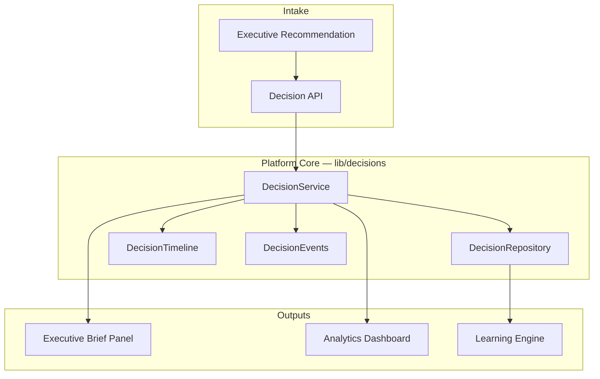

# Mission S1B+ — Executive Decision Intelligence (EDI)

**Status:** Complete  
**Date:** 2026-07-29  
**Mission type:** Platform (no workspace-specific implementations)

---

## Executive Summary

ORION now treats executive decisions as first-class platform entities. Every recommendation can become a persisted decision with full recommendation intelligence, executive actions, measurable outcomes, immutable timeline memory, learning metrics, analytics, and brief integration.

The platform delivers:

- **Decision Service** — create, search, action, timeline, analytics, brief intelligence
- **Decision API** — REST endpoints under `/api/decisions`
- **Executive Brief integration** — Decision Intelligence panel on `/brief`
- **Analytics dashboard** — `/decisions` with trend and learning charts
- **Recommendation wiring** — Act / Delegate / Snooze on recommendation cards records decisions

Verification: typecheck, lint, test (371), and build all pass.

---

## Decision Architecture

### Decision Entity

Each `ExecutiveDecision` includes:

| Field | Purpose |
|-------|---------|
| `id`, `organizationId`, `workspaceId`, `workspace` | Identity and tenancy |
| `entityReference` | Link to CRM, hospitality, finance entities |
| `recommendation` | Permanent recommendation intelligence |
| `status` | Lifecycle (`new` → `accepted` / `delegated` / `snoozed` / `completed` / …) |
| `actions` | Executive action audit trail |
| `outcomes` | Measurable business results |
| `timeline` | Executive memory — never lose history |
| `createdAt`, `updatedAt` | Audit timestamps |

### Recommendation Intelligence

Stored permanently on every decision: text, evidence, confidence score, business impact, trigger, source services, priority, risk level, estimated value, and recommendation type.

### Executive Actions

Supported via `recordAction`: accepted, rejected, delegated, snoozed, completed, reopened, archived. Each action records executive, notes, timestamp, delegate, and due date.

---

## Learning Architecture

`DecisionLearningEngine` calculates platform learning metrics from decision history:

| Metric | Description |
|--------|-------------|
| Acceptance Rate | Accepted + delegated + completed vs total |
| Completion Rate | Completed vs total |
| Delegation Rate | Delegated vs total |
| Dismissal Rate | Rejected + archived + dismissed vs total |
| Average Resolution Time | Hours from creation to completion |
| Average Decision Age | Mean age of open decisions |
| Most Successful Types | Top recommendation types by completion |
| Most Ignored Types | Top types by dismissal |
| Business Value Delivered | Sum of outcome metric values |
| Confidence Accuracy | Completed decisions where confidence ≥ 70 |

Learning feeds both the analytics dashboard and the Executive Brief intelligence panel.

---

## Analytics Architecture

`DecisionAnalytics` builds `DecisionAnalyticsSnapshot` with:

- Decision trend (created vs completed by day)
- Acceptance trend
- Outcome trend
- Business value delivered
- Average confidence
- Top executives by action count
- Top recommendation types

Exposed via `GET /api/decisions/analytics` and rendered in `DecisionAnalyticsDashboard` at `/decisions`.

### Decision Search

`DecisionRepository.search` supports filters: status, executive, workspace, outcome, priority, date range, entity. Exposed via `GET /api/decisions`.

---

## Shared Services

| Service | Location | Responsibility |
|---------|----------|----------------|
| DecisionService | `lib/decisions/DecisionService.ts` | Orchestration — create, search, actions, brief, analytics |
| DecisionRepository | `lib/decisions/repository/` | Persistence abstraction (in-memory + seed) |
| DecisionTimeline | `lib/decisions/timeline/DecisionTimeline.ts` | Executive memory entries |
| DecisionLearningEngine | `lib/decisions/learning/` | Learning metrics |
| DecisionAnalytics | `lib/decisions/analytics/` | Dashboard snapshots |
| DecisionEvents | `lib/decisions/events/` | In-process event bus |
| Public API | `lib/decisions/index.ts` | Single import surface for all workspaces |

### API Routes

| Route | Method | Purpose |
|-------|--------|---------|
| `/api/decisions` | GET, POST | Search and create |
| `/api/decisions/[id]` | GET | Decision + timeline |
| `/api/decisions/[id]/actions` | POST | Record executive action |
| `/api/decisions/analytics` | GET | Analytics snapshot |
| `/api/decisions/brief-intelligence` | GET | Brief intelligence block |
| `/api/decisions/recommendations/action` | POST | Unified recommendation action |

All routes use session context via `getDecisionServiceContext`.

---

## Files Modified

### New — Platform Core

- `types/decisions.ts`
- `lib/decisions/DecisionService.ts`
- `lib/decisions/index.ts`
- `lib/decisions/server-context.ts`
- `lib/decisions/repository/DecisionRepository.ts`
- `lib/decisions/repository/InMemoryDecisionRepository.ts`
- `lib/decisions/timeline/DecisionTimeline.ts`
- `lib/decisions/learning/DecisionLearningEngine.ts`
- `lib/decisions/analytics/DecisionAnalytics.ts`
- `lib/decisions/events/DecisionEvents.ts`
- `lib/decisions/mappers/recommendation-to-decision.ts`
- `lib/decisions/data/seed-decisions.ts`

### New — API

- `app/api/decisions/route.ts`
- `app/api/decisions/[id]/route.ts`
- `app/api/decisions/[id]/actions/route.ts`
- `app/api/decisions/analytics/route.ts`
- `app/api/decisions/brief-intelligence/route.ts`
- `app/api/decisions/recommendations/action/route.ts`

### New — UI

- `hooks/useDecisionActions.ts`
- `components/decisions/DecisionIntelligencePanel.tsx`
- `components/decisions/DecisionAnalyticsDashboard.tsx`
- `app/(platform)/decisions/page.tsx`

### New — Tests

- `tests/lib/decisions/ExecutiveDecisionIntelligence.test.ts`

### Modified

- `components/executive/ExecutiveRecommendationCard.tsx` — decision actions wired
- `components/executive/BriefPageContent.tsx` — Decision Intelligence panel
- `app/(platform)/brief/page.tsx` — brief intelligence fetch
- `lib/identity/route-access.ts` — `/decisions` RBAC
- `lib/navigation/NavigationConfig.ts` — sidebar nav entry
- `lib/observability/ReadinessAssessmentService.ts` — TD-005 persistence note
- `tests/setup.ts` — router and decision hook mocks for component tests

---

## Verification Results

| Check | Result |
|-------|--------|
| `npm run typecheck` | PASS |
| `npm run lint` | PASS (4 pre-existing warnings) |
| `npm test` | PASS — 371 tests, 67 files |
| `npm run build` | PASS — 41 routes |

---

## Technical Debt

| ID | Item | Impact |
|----|------|--------|
| TD-005 | Decision persistence is in-memory with seed data | Decisions reset on restart; blocks production multi-tenant use |
| TD-EDI-001 | No dedicated decision search UI | Search API exists; UI deferred |
| TD-EDI-002 | Complete / Reopen / Archive not exposed in recommendation card UI | API supports all action types |
| TD-EDI-003 | Outcome metrics use sample generator on completion | Real outcome ingestion from workspace providers pending |
| TD-EDI-004 | Brief intelligence falls back to demo defaults when yesterday has no data | Acceptable for beta; replace with pure computed values |

---

## CTO Recommendation

**Proceed to conditional GO for ORION v1.0 RC1 Private Beta.**

Mission S1B+ closes the primary S1E blocker (Decision Lifecycle). The architecture is correct: single platform service, no workspace duplication, full type safety, API surface, brief integration, and analytics dashboard.

**Before production:**

1. Persist decisions to durable storage (PostgreSQL or equivalent) — resolves TD-005
2. Wire real outcome metrics from workspace data providers
3. Add decision search UI for executive audit workflows
4. Connect DecisionEvents to platform observability / audit log pipeline

**Immediate next step:** Re-run S1E certification checklist with S1B+ complete; expect upgrade from NO-GO to conditional GO pending persistence hardening.
