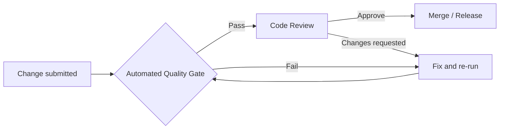

# ORION Quality Gate

| Field | Value |
|-------|-------|
| **Document ID** | OS-003 |
| **Title** | ORION Quality Gate |
| **Version** | 1.0.0 |
| **Status** | Active |
| **Effective Date** | 25 July 2026 |
| **Owner** | Engineering · QA |
| **Related** | [DEFINITION_OF_DONE.md](./DEFINITION_OF_DONE.md) · [CODE_REVIEW_CHECKLIST.md](./CODE_REVIEW_CHECKLIST.md) · [ES-054](../02_Engineering/ES-054-ORION-Quality-Assurance-Engineering-Excellence-Framework.md) · [ES-055](../02_Engineering/ES-055-ORION-DevSecOps-Continuous-Delivery-Architecture.md) |

---

## Purpose

The ORION Quality Gate is a **mandatory, non-bypassable verification barrier** that every feature branch and pull request must pass before merge to `main` and before any release tag.

No exceptions without **Founder or CTO written approval** recorded in the PR or release record.

---

## Scope

Applies to:

- All feature work (product, platform, intelligence, workspace)
- Bug fixes and refactors touching application code
- Documentation-only changes (subset of gates — see §Documentation-only changes)
- Release candidates and tagged versions

Does **not** replace:

- [Release Checklist](./RELEASE_CHECKLIST.md) for version cuts
- [v0.4.0-alpha Release Checklist](../releases/v0.4.0-alpha-Release-Checklist.md) for version-specific items
- Founder acceptance for major milestones (M9, RR-018)

---

## Gate model



| Layer | Mechanism | Blocking |
|-------|-----------|----------|
| **L1 — Automated** | GitHub Actions `quality-gate.yml` | Yes |
| **L2 — Definition of Done** | Author attestation in PR | Yes |
| **L3 — Code Review** | [CODE_REVIEW_CHECKLIST.md](./CODE_REVIEW_CHECKLIST.md) | Yes |
| **L4 — Release** | [RELEASE_CHECKLIST.md](./RELEASE_CHECKLIST.md) | Yes (releases only) |

---

## Automated checks

Executed by [`.github/workflows/quality-gate.yml`](../../.github/workflows/quality-gate.yml) on **push** and **pull_request** to `main`.

| # | Check | Command | Blocking | Notes |
|---|-------|---------|----------|-------|
| G1 | Install | `npm ci` | Yes | Lockfile must be committed |
| G2 | Type check | `npx tsc --noEmit` | Yes | TypeScript strict mode |
| G3 | Lint | `npm run lint` | Yes | ESLint · zero errors |
| G4 | Build | `npm run build` | Yes | Next.js production build |
| G5 | Unit tests | `npm run test` | Yes | Vitest |
| G6 | Coverage | `npm run test:coverage` | Yes | Thresholds in `vitest.config.ts` |
| G7 | Dependency audit | `npm audit --audit-level=high` | Yes | No high/critical vulnerabilities |
| G8 | Unused exports | Manual / future automation | No* | See §Outstanding automation |
| G9 | Formatting | Manual / future automation | No* | Prettier not yet configured |

\* G8 and G9 are **required by Definition of Done** but not yet fully automated. Reviewers must verify manually until tooling is wired.

### Coverage thresholds (Sprint 4 scope)

Defined in `vitest.config.ts`:

| Metric | Minimum |
|--------|---------|
| Lines | 80% |
| Statements | 80% |
| Functions | 80% |
| Branches | 75% |

Changes that expand scope must update `vitest.config.ts` coverage `include` and maintain thresholds for affected modules.

---

## Manual checks (Definition of Done)

Every PR author must confirm in the pull request template:

| Check | Verification |
|-------|--------------|
| No console errors | Manual smoke in affected routes |
| No dead code introduced | Reviewer + optional static analysis |
| Documentation updated | Paths listed in PR |
| CHANGELOG updated | Unreleased section for user-facing changes |
| Architecture unaffected or documented | ADR / Architecture Index / ES update |
| Accessibility maintained | Keyboard · labels · contrast spot-check |
| Responsive layout verified | Mobile + desktop for UI changes |
| Security review completed | Auth · input · secrets · dependencies |
| Performance reviewed | Pipeline · bundle · rerenders for hot paths |
| Code reviewed | At least one approving reviewer |

See [DEFINITION_OF_DONE.md](./DEFINITION_OF_DONE.md) for the full checklist.

---

## Documentation-only changes

Minimum automated gate:

- G1 Install (if workflow files changed)
- G2 Type check (if TS-adjacent)
- G3 Lint (if markdown lint added in future)

Author must still confirm documentation accuracy and cross-links. CHANGELOG update required only when documenting shipped behaviour.

---

## Failure policy

| Outcome | Action |
|---------|--------|
| Any blocking gate fails | PR cannot merge |
| Flaky test | Fix or quarantine with issue + owner; no silent skip |
| Audit failure | Upgrade dependency or document accepted risk in Decision Log |
| Emergency hotfix | Post-merge gate run within 24 hours; retro in Decision Log |

---

## Local verification (before push)

Run the full gate locally:

```bash
npm ci
npx tsc --noEmit
npm run lint
npm run build
npm run test
npm run test:coverage
npm audit --audit-level=high
```

---

## Enforcement

| Control | Status |
|---------|--------|
| GitHub Actions workflow | `.github/workflows/quality-gate.yml` |
| Branch protection (require status checks) | **TODO** — enable in repository settings |
| Required reviewers | **TODO** — enable in repository settings |
| Pre-commit hooks | **TODO** — optional local acceleration |

### Required status check name (GitHub)

After first workflow run, enable branch protection for `main`:

- **Required check:** `Quality Gate`

---

## References

| Document | Purpose |
|----------|---------|
| [DEFINITION_OF_DONE.md](./DEFINITION_OF_DONE.md) | Feature completion criteria |
| [CODE_REVIEW_CHECKLIST.md](./CODE_REVIEW_CHECKLIST.md) | Reviewer checklist |
| [RELEASE_CHECKLIST.md](./RELEASE_CHECKLIST.md) | Version release process |
| [Engineering Standards](../09_Standards/Engineering_Standards.md) | Coding standards |
| [ES-054](../02_Engineering/ES-054-ORION-Quality-Assurance-Engineering-Excellence-Framework.md) | QA framework |
| [ES-055](../02_Engineering/ES-055-ORION-DevSecOps-Continuous-Delivery-Architecture.md) | CI/CD architecture |

---

*Mandatory for all ORION engineering work effective v0.4.0-alpha onward.*
