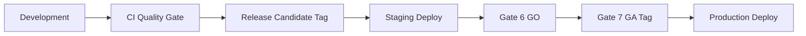

# ADR-012 — Deployment & Release Strategy

**Identifier:** ADR-012  
**Mission:** P-015.3 — Production Architecture Decision Records  
**Status:** Accepted  
**Date:** 2026-08-01  
**Authors:** Chief Enterprise Architect  
**Reviewers:** Architecture Review Board · Engineering Lead · PMO  
**Version:** 1.0

**Implements:** [Release Policy](../../06_Releases/Release-Policy.md) · [G-001 Release Governance Guide](../Governance/G-001-Release-Governance-Guide.md) · [P-015.2 Plan](../../00_Governance/P-015.2-Production-Readiness-Implementation-Plan.md)

---

## Problem Statement

ORION release discipline is **documented** (P-013.11, Release Policy) but **deployment pipelines, environment promotion, rollback, and blue/green readiness** are not architecturally defined. GA requires repeatable deploy paths from CI through staging to production with verified rollback.

---

## Context

- CI: `.github/workflows/quality-gate.yml` on `main` — typecheck · lint · build · test · coverage · audit.
- Release: `release/v1.0.1` branch · tag `v1.0.1-rc1` · semver per Release Policy.
- [P-015.1](../../00_Governance/P-015.1-Enterprise-Production-Readiness-Assessment.md): DEP-001–DEP-004 gaps.
- GA target: v1.0.x tag 2027 Q2 (P-015.11).

---

## Decision

ORION adopts a **four-environment promotion pipeline** with **semver-gated releases** and **documented rollback**.

### Environments

| Environment | Purpose | Data | Deploy trigger |
|-------------|---------|------|----------------|
| **Development** | Engineer local · SQLite or local PostgreSQL | Synthetic · disposable | Manual |
| **CI** | Automated quality gates | Ephemeral | Every PR/push to protected branches |
| **Staging** | Pre-production validation | PostgreSQL · anonymized seed | RC tag · release branch |
| **Production** | GA customer / design partner | PostgreSQL · real | GA tag · Gate 7 approval only |

### Release Flow

1. **RC** — `-rc.n` suffix · P0 fixes only · feature freeze per Release Policy.
2. **Staging** — Mandatory validation before Gate 6 GO (P-015.9).
3. **GA** — Semver tag without suffix · zero P0 debt · Gate 7 sign-off.
4. **LTS** — Declared post-GA per Release Policy (future).

### CI/CD (GA minimum)

| Stage | Gate |
|-------|------|
| Build | `npm run build` |
| Test | `npm test` — 800/800 at GA |
| Lint/Type | zero errors |
| Audit | `npm run audit:production` |
| Migrate | Database migrations on staging/prod deploy |
| Smoke | Post-deploy health + HCM API smoke (P-015.9) |

**Branch policy:** Quality gate on `main` **and** active release branch (`release/v1.0.1` → update per release).

### Rollback

| Scenario | Procedure |
|----------|-----------|
| **Bad deploy** | Redeploy previous git tag · immutable artifacts |
| **Bad migration** | Run migration down script · restore DB snapshot if needed |
| **Breaking change** | Forbidden in patch — semver major + ADR required |

Rollback must complete within documented RTO (Wave 2 ops doc).

### Blue/Green Readiness

| GA | v1.0.x |
|----|--------|
| **Architecture** | Stateless Next.js app tier · state in PostgreSQL — **blue/green capable** |
| **Implementation** | Single active production slot for GA · dual-slot deferred |
| **Requirement** | Runbook documents blue/green steps for future without code rewrite |

### Version Compatibility

| Surface | Rule |
|---------|------|
| Platform tag | Semver |
| Database schema | Forward-only migrations per release |
| API | Additive in patch/minor · breaking → major + ADR |
| Session | Backward compatible within major |
| Facade/events | Per ES-097 breaking change policy |

---

## Alternatives Considered

| Alternative | Pros | Cons | Reason Not Selected |
|-------------|------|------|---------------------|
| **Four-env promotion (selected)** | Industry standard | Staging cost | Required for GA confidence |
| **Direct to prod from main** | Fast | High risk | Rejected |
| **Blue/green GA day one** | Zero downtime | Double infra cost | Deferred implementation |
| **Manual deploy only** | Simple | Error-prone | CI/CD minimum required |

---

## Consequences

### Positive

- Aligns deployment with existing Release Policy and G-001 gates.
- Staging mandatory before GA certification.
- Rollback and semver rules explicit.

### Negative

- Staging environment operational cost.
- Migration discipline adds release overhead.

---

## Risks

| Risk | Likelihood | Impact | Mitigation |
|------|------------|--------|------------|
| Staging not parity with prod | Medium | High | Parity checklist in runbook |
| Migration failure on deploy | Medium | High | Staging first · backup before migrate |
| Release branch CI gap | Medium | Medium | P-015.7 DEP-002 |
| Long rollback time | Low | High | Drill in Wave 2 |

---

## Dependencies

| Dependency | Type | Notes |
|------------|------|-------|
| ADR-007 | Requires | Migrations on deploy |
| ADR-010 | Requires | Env-specific secrets |
| ADR-011 | Enables | Post-deploy health smoke |
| P-015.8 | Mission | Runbooks |
| P-015.11 | Mission | GA release |

---

## Implementation Guidance

1. Extend CI workflow to `release/*` branches (P-015.7).
2. Create staging deploy script/pipeline with migration step.
3. Publish deployment + rollback runbook in `docs/06_Releases/` (P-015.8).
4. Gate 6 blocked until staging smoke passes.
5. Tag GA only after Gate 7 — never retag moving target.

---

## Future Review Criteria

- Zero-downtime SLA required → implement blue/green or canary.
- Multi-region production.
- Container orchestration platform selection (K8s vs PaaS).

**Next review:** Wave 2 exit · each major release.

---

## Version History

| Version | Date | Author | Changes |
|---------|------|--------|---------|
| 1.0 | 2026-08-01 | Chief Enterprise Architect | Accepted — P-015.3 |

---

*ORION Architecture Decision Record · ADR-012 · docs/11_Governance/ADR/*
