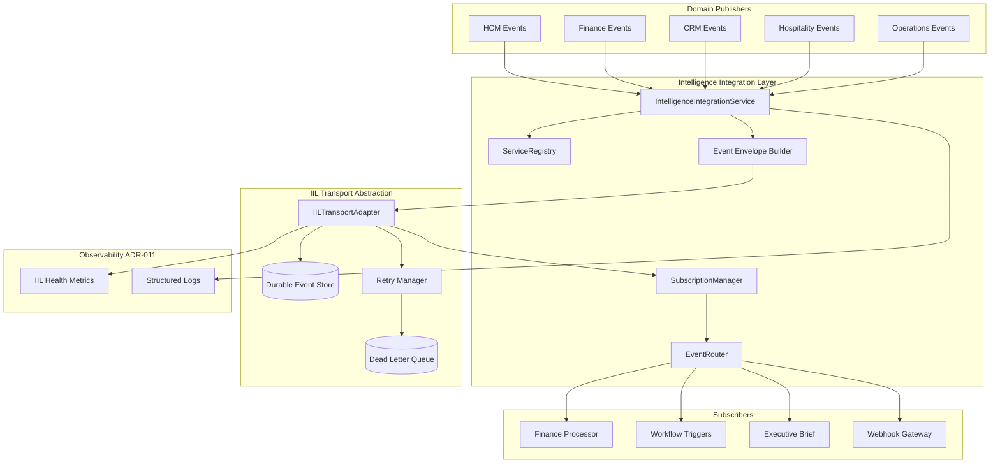
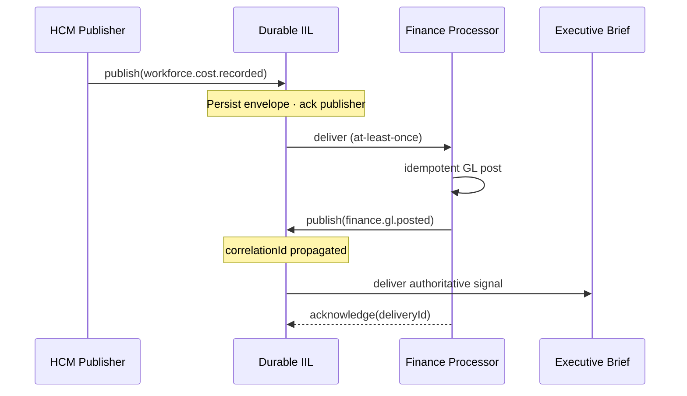

# ADR-013 — Durable Intelligent Integration Layer (IIL)

**Identifier:** ADR-013  
**Mission:** ADR-013 — Durable Intelligent Integration Layer (IIL)  
**Program:** P-016 — ORION Enterprise Platform v2.0  
**Status:** Implemented  
**Implementation Date:** 2026-08-03 (P-009.16)  
**Date:** 2026-08-02  
**Authors:** Chief Enterprise Architect · Platform Engineering Lead  
**Reviewers:** Architecture Review Board · Security Architect · Finance Domain Lead · HCM Domain Lead  
**Version:** 1.0  
**Architecture Baseline:** v1.0 GA Candidate → v2.0 Multi-Domain Baseline

**Implements:** [P-016.2 Architecture Charter](../../00_Governance/P-016.2-ORION-v2-Architecture-Charter.md) · [P-016.3 ADR Program](../../00_Governance/P-016.3-ORION-v2-ADR-Program.md)  
**Remediates:** [TD-PLATFORM-003](../../11_Governance/TECHNICAL_DEBT.md) · AG-002  
**Extends:** [P-006 IIL Architecture](../../03_Architecture/P-006-Intelligence-Integration-Layer.md) · ADR-007 · ADR-011 · ADR-012  
**Enables:** ADR-014 (Cross-Domain Event Contracts) · ADR-016 (Platform Workflow Engine) · ADR-017 (Cross-Domain Reporting & Analytics) · ADR-018 (Platform AI Integration Principles) · P-009 Finance Gate 5

---

## Decision Summary

ORION adopts a **durable event architecture** for the Intelligence Integration Layer (IIL). Cross-domain integration shall persist events before publisher acknowledgment, survive process restarts, and deliver through a **vendor-neutral transport abstraction** with standardized envelopes, idempotency, retry, dead-letter handling, and replay.

The in-process `MessageQueue` and in-memory `EventReplayStore` / `DeadLetterQueue` remain permitted **development and unit-test environments only**. Production, staging, and CI certification environments shall use a **durable IIL transport adapter**.

**Implementation is deferred** until this ADR reaches **Accepted** status and a Gate 4 engineering specification is published. This record defines constitutional architecture only.

---

## 1. Context

### 1.1 Why ORION Requires a Durable Event Platform

ORION v2.0 is a **multi-domain authoritative Executive Operating System**. Financial truth (Finance), commercial intelligence (CRM), workforce operations (HCM), vertical operations (Hospitality), and executive signals (Intelligence) must integrate through a single governed event backbone — not through direct repository reads or ad-hoc service calls.

The [Architecture Handbook v1.0](../../00_Governance/ORION_Enterprise_Architecture_Handbook_v1.0.md) mandates **event-driven integration**: domains publish versioned IIL events; consumers subscribe through platform services. The [P-016.2 Charter](../../00_Governance/P-016.2-ORION-v2-Architecture-Charter.md) commits to:

- **Finance as the hub** — HCM workforce cost, CRM revenue, and Hospitality folio events converge on Finance
- **Events before analytics** — no analytics read models until durable domain events exist
- **ADR-013 before Finance Gate 5** — cross-domain chains require reliable delivery

v1.0 delivered a functional IIL with 67+ HCM events, CRM/Finance/Hospitality publishers, workflow triggers, and Executive Brief consumption. That foundation is architecturally correct but **operationally incomplete** for v2.0.

### 1.2 Problems with In-Process Messaging

The current IIL implementation ([P-006](../../03_Architecture/P-006-Intelligence-Integration-Layer.md) · `lib/platform/intelligence/`) uses:

| Component | Current State | Production Risk |
|-----------|---------------|-----------------|
| `MessageQueue` | In-memory array · async processor | **Events lost on process restart or crash** |
| `EventReplayStore` | In-memory deduplication | **No cross-restart idempotency** |
| `DeadLetterQueue` | In-memory retention | **Failed events lost on restart** |
| `EventBus` (platform) | In-process pub/sub | **No durable cross-instance delivery** |

Documented as [TD-PLATFORM-003](../../11_Governance/TECHNICAL_DEBT.md): *"Event bus is in-process; events lost on crash."* Severity: **High**. Owner: Platform Engineering.

**Concrete failure modes at v2.0 scale:**

1. **HCM → Finance workforce cost chain** — payroll cost event published; process restarts before Finance consumer processes; GL posting never occurs; financial truth diverges from workforce truth
2. **CRM → Finance revenue chain** — `opportunity.won` lost; revenue recognition incomplete; Executive Brief shows stale pipeline intelligence
3. **Hospitality folio → Finance** — folio closure event lost; revenue not posted; vertical operator reconciliation fails
4. **Workflow triggers** — HCM workflow events lost mid-orchestration; approval state inconsistent
5. **Certification gap** — GA staging proves PostgreSQL persistence for HCM data but **not** for cross-domain event delivery

In-process messaging was an acceptable v1.0 learning trade-off. It is **not** an acceptable v2.0 end state.

### 1.3 Business Drivers for Multi-Domain Integration

| Driver | Requirement | Durable IIL Role |
|--------|-------------|------------------|
| **Executive Operating System narrative** | Unified truth across finance, workforce, commercial | Reliable event chains feed Brief and analytics |
| **Design partner bundle (HCM + Finance + CRM)** | Credible cross-domain automation | Events survive restarts and deploy cycles |
| **ERP replacement path** | Authoritative ledger fed by domain events | At-least-once delivery with idempotent consumers |
| **Audit and compliance** | Traceable cross-domain mutations | Event envelopes with actor, correlation, versioning |
| **Operational resilience** | Production deploy without event loss | Persistent queue + replay |
| **Certification discipline (G-001)** | Gate 6 evidence for integration | CI certification with durable transport |

### 1.4 Architectural Baseline

| Document | Relevance |
|----------|-----------|
| [ADR-007](./ADR-007-Production-Persistence-Strategy.md) | PostgreSQL as production datastore · adapter pattern precedent |
| [ADR-011](./ADR-011-Observability-Architecture.md) | Health endpoints · structured logging for IIL metrics |
| [ADR-012](./ADR-012-Deployment-Release-Strategy.md) | Staging certification · release branch CI |
| [ES-097](../../00_Governance/ES-097-ORION-Architecture-Governance-ADR-Policy.md) | ADR lifecycle · Gate 4 before Gate 5 |
| [P-016.3 ADR Program](../../00_Governance/P-016.3-ORION-v2-ADR-Program.md) | ADR-013 P0 · Finance Gate 5 blocker |

---

## 2. Problem Statement

ORION cannot achieve v2.0 multi-domain authoritative integration while the IIL transport is in-process only. Without a durable event architecture decision:

- **Finance Gate 5 is blocked** — workforce cost and revenue chains cannot be certified
- **TD-PLATFORM-003 remains open** — High severity debt blocks v2.0 GA narrative
- **AG-002 remains unresolved** — no ratified durable transport plan
- **Cross-domain certification lacks evidence** — restart survival cannot be demonstrated
- **Implementation teams will invent parallel buses** — CRM, Finance, or Hospitality may build local queues without governance

This ADR resolves the architectural question. It does **not** authorize implementation until Accepted.

---

## 3. Decision

ORION adopts a **Durable Intelligent Integration Layer (IIL)** as the constitutional event integration architecture for v2.0 and beyond.

### 3.1 Core Decision

1. **Durable-first** — Every production-published domain event is persisted to durable storage **before** the publisher receives success acknowledgment.
2. **Transport abstraction** — Domains and platform services interact with `IntelligenceIntegrationService` public API only; durable transport is selected via **`IILTransportAdapter`** at the composition root (same pattern as `PlatformStore` in ADR-007).
3. **At-least-once delivery** — Consumers must be **idempotent**; duplicates are expected and harmless.
4. **No cross-domain repository reads** — Integration remains IIL-only per Architecture Handbook.
5. **In-memory transport** — Permitted in **development and unit tests only**; rejected for staging, production, and CI certification.

### 3.2 Event Bus Abstraction

Introduce a platform-level **`IILTransportAdapter`** interface that encapsulates all durable messaging operations:

| Operation | Responsibility |
|-----------|----------------|
| `publish(envelope)` | Persist event · enqueue for delivery · return publish receipt |
| `subscribe(subscription)` | Register consumer handler with filter criteria |
| `acknowledge(deliveryId)` | Confirm successful consumer processing |
| `nack(deliveryId, reason)` | Signal failure · trigger retry or dead-letter |
| `getDeadLetter(limit)` | Query failed events for operator review |
| `replay(criteria)` | Re-deliver persisted events matching filter |
| `health()` | Transport connectivity · queue depth · lag metrics |

**Composition root rule:** `IntelligenceIntegrationService` receives an `IILTransportAdapter` implementation via constructor injection. Domain code never imports transport adapters directly.

**Adapter implementations (planned — not selected in this Proposed ADR):**

| Adapter | Role | Evaluation Phase |
|---------|------|------------------|
| `PostgresIILTransportAdapter` | Primary candidate — transactional outbox aligned with ADR-007 | Gate 4 ES |
| `RedisStreamsIILTransportAdapter` | Optional high-throughput adapter | Post-primary evaluation |
| `InMemoryIILTransportAdapter` | Dev/unit test only | Existing behavior preserved |

Final adapter selection requires Gate 4 engineering specification and ARB review — not this ADR alone.

### 3.3 Durable Persistence

| Rule | Requirement |
|------|-------------|
| **Write-ahead** | Event record committed to durable store before publisher `ack` |
| **Tenant scope** | Every persisted event includes `organizationId` · queries scoped |
| **Retention** | Minimum 30 days hot retention · archive policy per ADR-012 ops runbooks |
| **Schema ownership** | Platform owns `iil_*` namespace (aligned with ADR-007 `platform_*` convention) |
| **Co-location** | Primary adapter SHOULD co-locate with PostgreSQL production datastore unless ADR supersedes |
| **Outbox pattern** | Domain mutations and event publish SHOULD share transactional boundary where Finance/HCM posting requires atomicity |

### 3.4 Publisher / Subscriber Model

Extend the existing P-006 model without breaking domain publisher contracts:

```
Domain Facade / Event Publisher
        │
        │ publishIntelligenceEvent(input, context)
        ▼
IntelligenceIntegrationService  ──►  ServiceRegistry (authorized publishers)
        │
        │ validate · envelope · dedupe key
        ▼
IILTransportAdapter.publish()
        │
        ├──► Durable Event Store
        │
        └──► Delivery to Subscribers
                    │
        ┌───────────┼───────────┬──────────────┐
        ▼           ▼           ▼              ▼
    Finance      CRM       Workflow      Intelligence
   Processor    Handlers    Triggers       Brief Feed
```

| Role | Rule |
|------|------|
| **Publisher** | Domain facade wrapper or dedicated `*-events.ts` module · registered in `ServiceRegistry` |
| **Subscriber** | Platform or domain handler registered via `SubscriptionManager` · no direct adapter access |
| **Platform EventBus** | Remains in-process fan-out for **intra-process** platform signals · not a substitute for durable IIL |
| **WebhookGateway** | Outbound webhooks consume durable queue · delivery log persisted |

### 3.5 Event Envelopes

Every durable IIL event SHALL use a canonical envelope extending the P-006 event model:

| Field | Required | Description |
|-------|----------|-------------|
| `eventId` | Yes | Globally unique · UUID v4 |
| `eventType` | Yes | Namespaced type · e.g. `hcm.workforce.cost.recorded` |
| `eventVersion` | Yes | Schema version · semver or integer · see §3.11 |
| `sourceService` | Yes | Registered service ID · e.g. `hcm-workspace` |
| `sourceDomain` | Yes | Bounded context · `hcm` · `finance` · `crm` · `hospitality` · `operations` · `platform` |
| `organizationId` | Yes | Tenant scope · mandatory isolation |
| `entityType` | Yes | Business entity type |
| `entityId` | Yes | Business entity identifier |
| `timestamp` | Yes | ISO-8601 UTC publish time |
| `actorId` | Yes | Verified identity from `ServiceContext` |
| `correlationId` | Yes | Trace identifier · see §3.6 |
| `causationId` | No | Parent `eventId` when chain exists |
| `idempotencyKey` | Yes | Dedupe key · see §3.7 |
| `partitionKey` | Yes | Ordering key · see §3.10 |
| `priority` | Yes | `low` · `normal` · `high` · `critical` |
| `securityClassification` | Yes | `public` · `internal` · `confidential` · `restricted` |
| `payload` | Yes | Versioned JSON · validated against schema registry (ADR-014) |
| `auditMetadata` | Yes | Actor role · workspace · publish audit trail |
| `deliveryMetadata` | Transport | Attempt count · last error · adapter receipt ID |

**Envelope immutability:** Persisted envelopes are append-only. Corrections publish new events with `causationId` referencing the original.

### 3.6 Correlation IDs

| Rule | Requirement |
|------|-------------|
| **Generation** | Platform generates `correlationId` if not supplied by publisher |
| **Propagation** | All derived events (Finance posting from HCM cost) MUST inherit or explicitly link via `causationId` |
| **Scope** | Correlation chains scoped by `organizationId` |
| **Observability** | ADR-011 logging MUST include `correlationId` on all IIL operations |
| **Trace goal** | Operator can reconstruct HCM cost → Finance GL → Brief signal chain from IDs alone |

### 3.7 Idempotency

| Rule | Requirement |
|------|-------------|
| **Publisher idempotency key** | `{organizationId}:{sourceService}:{eventType}:{entityId}:{businessSequence}` |
| **Dedupe window** | Minimum 24 hours · configurable per event type |
| **Consumer idempotency** | Subscribers MUST tolerate duplicate delivery · use `eventId` or `idempotencyKey` store |
| **Finance consumers** | GL posting handlers MUST be strictly idempotent — duplicate events cannot double-post |
| **Replay safety** | Replay reuses original `eventId` · consumers dedupe on `eventId` |

### 3.8 Retry Strategy

| Parameter | Default | Notes |
|-----------|---------|-------|
| **Delivery guarantee** | At-least-once | Exactly-once end-to-end rejected — too costly for v2.0 scope |
| **Max attempts** | 5 | Configurable per subscription |
| **Backoff** | Exponential · base 1s · max 300s · jitter | Extends existing `RetryManager` policy |
| **Retryable errors** | Transient infra · consumer timeout · downstream 503 | |
| **Non-retryable errors** | Schema validation failure · authorization failure · business rule rejection | Immediate dead-letter |
| **Poison message** | After max attempts → dead-letter queue | Operator alert via ADR-011 |

### 3.9 Dead-Letter Queue (DLQ)

| Rule | Requirement |
|------|-------------|
| **Durability** | DLQ entries persisted · not in-memory |
| **Retention** | Minimum 90 days |
| **Fields** | Original envelope · failure reason · attempt history · last error stack (sanitized) |
| **Operator API** | Existing `/api/intelligence/dead-letter` surfaces preserved · backed by durable store |
| **Reprocessing** | Operator may replay individual DLQ entries after fix · audit logged |
| **Alerting** | DLQ depth threshold triggers ops alert · ADR-011 health integration |

### 3.10 Event Replay

| Rule | Requirement |
|------|-------------|
| **Scope** | Replay by `eventId` · `correlationId` · time range · `eventType` · `organizationId` |
| **Authorization** | Replay requires elevated platform permission · audited |
| **Use cases** | Consumer bug recovery · new subscriber backfill · certification evidence |
| **Behavior** | Replay creates new delivery attempts · does not mutate original envelope |
| **Finance backfill** | Finance processor MAY replay HCM cost events from durable store for GL reconstruction |

### 3.11 Event Ordering

| Rule | Requirement |
|------|-------------|
| **Partition key** | `{organizationId}:{entityType}:{entityId}` default |
| ** Guarantee** | **Ordered delivery within partition** · no global order guarantee |
| **Cross-entity** | Events across different entities MAY arrive out of order |
| **Finance sequencing** | Period close events MUST use dedicated partition · processed serially per org |
| **Parallelism** | Multiple partitions processed concurrently |

### 3.12 Event Versioning

| Rule | Requirement |
|------|-------------|
| **Schema version field** | `eventVersion` on every envelope |
| **Additive changes** | New optional payload fields · no ADR required |
| **Breaking changes** | New major version · new `eventType` suffix or version increment · requires ADR-014 / ADR-020 |
| **Consumer tolerance** | Subscribers SHOULD accept unknown optional fields |
| **Dual publishing** | During migration · publisher MAY emit v1 and v2 in parallel · bounded time · documented in ADR-014 |

---

## 4. Scope

This ADR governs durable IIL architecture across all v2.0 product lines and platform services.

### 4.1 Shared Platform

| Component | Impact |
|-----------|--------|
| `IntelligenceIntegrationService` | Receives transport adapter injection |
| `MessageQueue` | Becomes thin wrapper over adapter or deprecated in favor of adapter |
| `EventReplayStore` · `DeadLetterQueue` | Backed by durable adapter |
| `EventRouter` · `SubscriptionManager` | Unchanged public behavior |
| `ServiceRegistry` | Extended for Finance · CRM enterprise publishers |
| CI certification | GA staging workflow validates durable adapter |
| Observability | Queue depth · lag · DLQ metrics per ADR-011 |

### 4.2 Finance

| Event Flow | Requirement |
|------------|-------------|
| Inbound | HCM workforce cost · CRM revenue · Hospitality folio |
| Outbound | `finance.period.closed` · `finance.gl.posted` · ledger mutation events |
| Consumer | Finance event processor · idempotent GL posting |
| Gate 5 blocker | ADR-013 **Accepted** before implementation |

### 4.3 CRM

| Event Flow | Requirement |
|------------|-------------|
| Outbound | `crm.opportunity.won` · pipeline · account events |
| Inbound | Optional Finance acknowledgment events |
| Dependency | ADR-013 **Implemented** before CRM Gate 5 |

### 4.4 Hospitality

| Event Flow | Requirement |
|------------|-------------|
| Outbound | `hospitality.folio.closed` · reservation lifecycle |
| Inbound | Finance posting confirmations (optional) |
| Dependency | Finance alpha + ADR-013 **Implemented** |

### 4.5 Operations

| Event Flow | Requirement |
|------------|-------------|
| Outbound | Procurement · inventory cost events (Wave 5) |
| Inbound | Finance sub-ledger events |
| Scope | Framework only at v2.0 GA · durable IIL architecture inherited |

### 4.6 Intelligence

| Consumer | Requirement |
|----------|-------------|
| Executive Brief | Subscribes to authoritative domain events via durable feed |
| Analytics (ADR-017) | Read models project from durable event store |
| AI pipeline (ADR-018) | Signal sourcing from durable events only |
| TD-003 | Unified pipeline consumes same durable transport |

---

## 5. Architecture Diagram

### 5.1 Target Durable IIL Architecture



### 5.2 Cross-Domain Event Chain (Finance as Hub)



---

## 6. Consequences

### 6.1 Benefits

| Benefit | Impact |
|---------|--------|
| **Cross-domain reliability** | HCM → Finance → Brief chains survive restarts and deploys |
| **TD-PLATFORM-003 closure path** | High severity debt resolved through governed decision |
| **Finance Gate 5 unblocked** | After Accepted · implementation can proceed |
| **Certification evidence** | Restart survival demonstrable in CI and staging |
| **Audit trail** | Correlation IDs · immutable envelopes · replay capability |
| **Platform consistency** | Same adapter pattern as ADR-007 PlatformStore |
| **Consumer safety** | Idempotency rules prevent duplicate GL posting |
| **Operational visibility** | DLQ · lag · depth metrics integrate with ADR-011 |

### 6.2 Risks

| Risk | Likelihood | Impact | Mitigation |
|------|------------|--------|------------|
| Adapter selection delays implementation | Medium | High | Gate 4 ES with Postgres outbox as primary candidate |
| Duplicate delivery causes Finance double-post | Medium | Critical | Mandatory idempotent consumers · certification tests |
| Migration breaks existing IIL tests | Medium | Medium | Retain `InMemoryIILTransportAdapter` for unit tests |
| Queue lag under multi-domain load | Medium | Medium | Partition parallelism · ADR-019 scalability planning |
| Schema drift across domains | Medium | High | ADR-014 event contract registry |
| Operational complexity | Medium | Medium | ADR-011 health · runbooks · DLQ operator API |
| Over-engineering before Finance alpha | Low | Medium | Phased migration · HCM → Finance chain first |

### 6.3 Migration Strategy

| Phase | Action | Environment |
|-------|--------|-------------|
| **M0** | ADR-013 **Accepted** | Governance |
| **M1** | Gate 4 ES — `IILTransportAdapter` spec · adapter selection | Architecture |
| **M2** | Implement durable adapter · retain in-memory for unit tests | Development |
| **M3** | Wire adapter in composition root · feature flag `ORION_IIL_TRANSPORT=memory\|durable` | Dev/staging |
| **M4** | CI certification — publish · restart · consume · verify survival | CI |
| **M5** | HCM → Finance chain certification on durable transport | Staging |
| **M6** | Remove in-memory as default in staging/production configs | Staging/prod |
| **M7** | Close TD-PLATFORM-003 · AG-002 · status → **Implemented** | Release |

**Backward compatibility:** Domain publisher APIs (`publishIntelligenceEvent`) unchanged. Transport swap is composition-root only.

**Rollback:** Environment flag reverts to in-memory in development only. Production rollback requires ADR-012 release procedure and consumer state assessment.

### 6.4 Compatibility

| Area | Compatibility Rule |
|------|-------------------|
| **Domain publisher API** | Unchanged — facade event modules continue using `getIntelligenceIntegrationService()` |
| **Event envelope** | Superset of P-006 fields — additive fields only in v2.0 migration |
| **Existing subscribers** | Must add idempotency handling — breaking consumer change documented in Gate 4 ES |
| **Platform EventBus** | Coexists — intra-process only · not cross-domain substitute |
| **ADR-007 PostgreSQL** | Primary durable store co-location preferred |
| **ADR-014 / ADR-020** | Event contracts and versioning governed separately |

### 6.5 Operational Impact

| Area | Implication |
|------|-------------|
| **Monitoring** | Queue depth · consumer lag · DLQ count · publish latency — ADR-011 dashboards |
| **Backup** | Durable event store included in PostgreSQL backup scope |
| **DR** | Event replay supports consumer recovery after DR failover |
| **Deploy** | Rolling deploy safe — unconsumed events persist across instances |
| **Runbooks** | DLQ triage · replay procedure · partition lag investigation |
| **CI** | GA staging certification extended with IIL restart survival test |
| **Capacity** | Partition-based scaling · ADR-019 for multi-region deferral |

---

## 7. Alternatives Considered

| Alternative | Summary | Pros | Cons | Verdict |
|-------------|---------|------|------|---------|
| **A — Durable IIL with transport abstraction** ✅ | Persist events · adapter pattern · at-least-once · idempotent consumers | Aligns with ADR-007 · governed · certifiable · closes TD-PLATFORM-003 | Engineering cost · ops complexity | **Selected** — constitutional v2.0 architecture |
| **B — Continue in-process IIL** | Retain current `MessageQueue` · in-memory stores | Zero migration cost · tests unchanged | Events lost on crash · Finance Gate 5 blocked · TD-PLATFORM-003 open · not v2.0 credible | **Rejected** — violates P-016.2 Charter |
| **C — Direct service calls** | Finance invokes HCM/CRM repositories or REST directly | Simple request/response · strong consistency per call | Violates Handbook · tight coupling · no audit event chain · org isolation risk | **Rejected** — anti-pattern per ES-097 |
| **D — External message broker only (Kafka/RabbitMQ)** | Mandate external broker · bypass platform abstraction | High throughput · industry standard | New infra dependency · ops burden · diverges from ADR-007 co-location · premature for v2.0 | **Rejected as sole solution** — optional adapter post-primary evaluation |
| **E — Database triggers / CDC only** | PostgreSQL CDC replaces explicit publish | No publisher code | Hidden coupling · schema knowledge leaks · untestable event contracts | **Rejected** — breaks facade/event catalogue discipline |
| **F — Exactly-once delivery** | Broker exactly-once semantics | Theoretical simplicity for consumers | Distributed complexity · cost · unavailable across all adapters | **Rejected for v2.0** — at-least-once + idempotency sufficient |

---

## 8. Dependencies

| Dependency | Type | Notes |
|------------|------|-------|
| ADR-007 | Requires | PostgreSQL production baseline · adapter pattern precedent |
| ADR-011 | Enables | IIL health metrics · structured logging |
| ADR-012 | Enables | Staging certification · release rollback |
| ADR-014 | Enables | Event contract registry · schema validation (follows ADR-013) |
| ADR-020 | Enables | Event versioning policy |
| ES-097 | Governance | ADR lifecycle · Gate 4 before Gate 5 |
| P-016.2 Charter | Program | Commitment A4 · Finance Gate 5 blocker |
| P-016.3 ADR Program | Program | ADR-013 P0 priority |
| P-006 | Architecture | Existing IIL service model extended |
| TD-PLATFORM-003 | Remediates | Closed on Implemented |
| AG-002 | Remediates | Closed on Accepted |

---

## 9. Acceptance Criteria

Criteria for ADR-013 progression from **Proposed** → **Accepted** → **Implemented**.

### 9.1 Architecture Complete (Accepted Gate)

| # | Criterion | Status |
|---|-----------|--------|
| AC-1 | Durable event architecture decision documented | ✅ This ADR |
| AC-2 | Transport abstraction defined (`IILTransportAdapter`) | ✅ §3.2 |
| AC-3 | Envelope · correlation · idempotency · retry · DLQ · replay · ordering · versioning defined | ✅ §3.5–3.12 |
| AC-4 | Scope covers Finance · CRM · Hospitality · Operations · Intelligence · Platform | ✅ §4 |
| AC-5 | Migration strategy documented | ✅ §6.3 |
| AC-6 | Alternatives evaluated with rejection rationale | ✅ §7 |
| AC-7 | Architecture diagram provided | ✅ §5 |

### 9.2 Governance Aligned

| # | Criterion | Status |
|---|-----------|--------|
| G-1 | ES-097 lifecycle followed · Proposed status set | ✅ |
| G-2 | P-016.2 Charter alignment verified | ✅ |
| G-3 | P-016.3 ADR Program priority P0 confirmed | ✅ |
| G-4 | ARB review scheduled | Pending |
| G-5 | Security Architect review for tenant isolation | Pending |
| G-6 | TECHNICAL_DEBT.md update on Accepted | Pending |

### 9.3 Release Blockers Satisfied (on Accepted)

| Milestone | ADR-013 Requirement | Unlocked On |
|-----------|----------------------|-------------|
| Finance Gate 5 planning | **Accepted** | Gate 4 ES for Finance |
| CRM Gate 5 | **Implemented** | CRM revenue chain |
| Hospitality Gate 5 | **Implemented** | Folio → Finance chain |
| v2.0 GA | **Implemented** | Multi-domain chain certification |

### 9.4 Dependencies Identified

| Downstream | Relationship |
|------------|--------------|
| ADR-014 | Event contracts depend on envelope spec §3.5 |
| ADR-016 | Workflow triggers consume durable delivery |
| ADR-017 | Analytics projects from durable store |
| ADR-018 | Intelligence pipeline sources durable events |
| P-009 Finance | Gate 5 blocked until Accepted |

### 9.5 Implementation Deferred

| Rule | Status |
|------|--------|
| No Gate 5 IIL transport code until **Accepted** | ✅ Enforced |
| Gate 4 ES required before adapter implementation | Pending |
| Adapter technology selection deferred to Gate 4 ES | ✅ §3.2 |
| Status remains **Proposed** until ARB approval | ✅ |

---

## 10. Release Impact

| Milestone | Impact of ADR-013 |
|-----------|-------------------|
| **Finance Gate 5** | **Hard blocker** — requires **Accepted** minimum |
| **CRM Gate 5** | **Hard blocker** — requires **Implemented** |
| **Hospitality Gate 5** | **Hard blocker** — requires **Implemented** + Finance alpha |
| **v2.0.0 GA tag** | **Hard blocker** — requires **Implemented** · cross-domain chain demonstrated |
| **v1.0.x maintenance** | No impact — in-memory IIL continues on release/v1.0.1 until v2.0 merge |
| **CI (current)** | No change until implementation mission |
| **TD-PLATFORM-003** | Resolution path defined · closes on **Implemented** |
| **AG-002** | Resolution path defined · closes on **Accepted** |

---

## 11. Implementation Impact (Future — Not Authorized)

| Area | Planned Impact |
|------|----------------|
| Code packages | `lib/platform/intelligence/` · new `lib/platform/iil/transport/` |
| Public API | Unchanged domain publisher surface |
| Events | Envelope fields extended · backward compatible |
| Tests | Durable adapter integration tests · restart survival · idempotency |
| Documentation | P-006 update · ES-IIL-001 Gate 4 spec |
| Migration | Phased M0–M7 per §6.3 |

---

## 12. Related Documents

| Document | Location |
|----------|----------|
| P-016.2 Architecture Charter | [P-016.2-ORION-v2-Architecture-Charter.md](../../00_Governance/P-016.2-ORION-v2-Architecture-Charter.md) |
| P-016.3 ADR Program | [P-016.3-ORION-v2-ADR-Program.md](../../00_Governance/P-016.3-ORION-v2-ADR-Program.md) |
| P-006 IIL Architecture | [P-006-Intelligence-Integration-Layer.md](../../03_Architecture/P-006-Intelligence-Integration-Layer.md) |
| Architecture Handbook | [ORION_Enterprise_Architecture_Handbook_v1.0.md](../../00_Governance/ORION_Enterprise_Architecture_Handbook_v1.0.md) |
| ES-097 ADR Policy | [ES-097-ORION-Architecture-Governance-ADR-Policy.md](../../00_Governance/ES-097-ORION-Architecture-Governance-ADR-Policy.md) |
| Technical Debt Register | [TECHNICAL_DEBT.md](../TECHNICAL_DEBT.md) |
| ADR-007 Persistence | [ADR-007-Production-Persistence-Strategy.md](./ADR-007-Production-Persistence-Strategy.md) |
| ADR-011 Observability | [ADR-011-Observability-Architecture.md](./ADR-011-Observability-Architecture.md) |
| ADR-012 Release | [ADR-012-Deployment-Release-Strategy.md](./ADR-012-Deployment-Release-Strategy.md) |

---

## 13. Superseded ADRs

| ADR | Relationship |
|-----|--------------|
| None | — |

**Superseded by:** *(empty)*

---

## 14. Version History

| Version | Date | Author | Changes |
|---------|------|--------|---------|
| 1.0 | 2026-08-02 | Chief Enterprise Architect | Initial proposal — ADR-013 mission |
| 1.1 | 2026-08-03 | Chief Enterprise Architect | Accepted (P-016.5) · Implemented (P-009.16) · status sync (P-016.6) |

---

## 15. Implementation Evidence

| Artifact | Location |
|----------|----------|
| Transport adapter · DLQ · Replay · Metrics | `lib/platform/iil/` |
| Service integration | `lib/platform/intelligence/IntelligenceIntegrationService.ts` |
| Unit / integration tests | `tests/platform/iil/DurableIIL.test.ts` |
| Cross-domain certification | `tests/ga/FinanceGA001Certification.test.ts` |
| Architecture documentation | [Durable-IIL-Architecture.md](../../Platform/IIL/Durable-IIL-Architecture.md) |
| Governance baseline | [P-016.6 Architecture Baseline](../../00_Governance/P-016.6-Architecture-Baseline.md) |
| Commit | `9cddb12` — P-009.16 |
| Closes | TD-PLATFORM-003 · AG-002 · FIN-R-002 |

**Dependencies satisfied:** ADR-007 (PlatformStore) · ADR-011 (observability hooks) · ADR-012 (deployment guard `ORION_IIL_TRANSPORT`)

---

## 16. Status

| Field | Value |
|-------|-------|
| **Current Status** | **IMPLEMENTED** |
| **Accepted** | 2026-08-03 — [P-016.5 ARB Ratification](../../00_Governance/P-016.5-Architecture-Review-Board-Ratification.md) |
| **Implemented** | 2026-08-03 — P-009.16 on `develop/v2.0` @ `9cddb12` |
| **May Implement?** | **Complete** — staging cutover via `ORION_IIL_TRANSPORT=durable` |
| **Next Step** | Live PostgreSQL staging GA-001 · Gate 6 multi-domain chains |

---

*ORION Architecture Decision Record · ADR-013 · docs/11_Governance/ADR/ · Implemented P-009.16*
