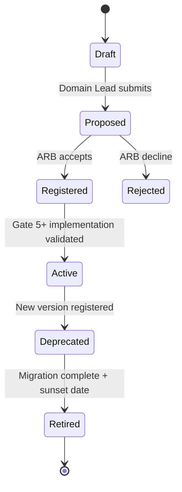

# ADR-014 — Cross-Domain Event Contracts

**Identifier:** ADR-014  
**Mission:** ADR-014 — Cross-Domain Event Contracts  
**Program:** P-016 — ORION Enterprise Platform v2.0  
**Status:** Proposed  
**Date:** 2026-08-02  
**Authors:** Chief Enterprise Architect · Platform Engineering Lead · Finance Domain Lead  
**Reviewers:** Architecture Review Board · Security Architect · HCM Domain Lead  
**Version:** 1.0  
**Architecture Baseline:** v1.0 GA Candidate → v2.0 Multi-Domain Baseline

**Builds on:** [ADR-013 Durable IIL](./ADR-013-Durable-Intelligent-Integration-Layer.md) · [D-008 Enterprise Financial Event Model](../../Finance/Blueprints/D-008_Enterprise_Financial_Event_Model.md) · [P-006 IIL Architecture](../../03_Architecture/P-006-Intelligence-Integration-Layer.md)  
**Enables:** [ES-FIN-002 Finance Engineering Specification](../../Finance/Engineering/ES-FIN-002-Finance-Engineering-Specification.md) · P-009 Gate 5 · P-008 CRM Phase II · ADR-017 Analytics · ADR-018 Intelligence  
**Related:** [ADR-020 Versioning & Domain Compatibility](./ADR-020-Versioning-Domain-Compatibility.md) *(planned)* · [ES-097 ADR Policy](../../00_Governance/ES-097-ORION-Architecture-Governance-ADR-Policy.md) · [P-016.3 ADR Program](../../00_Governance/P-016.3-ORION-v2-ADR-Program.md)

---

## Decision Summary

ORION adopts **enterprise-wide cross-domain event contracts** — a governed schema registry, naming standard, ownership model, and lifecycle for every event published on the durable IIL ([ADR-013](./ADR-013-Durable-Intelligent-Integration-Layer.md)).

Cross-domain integration shall use **versioned, validated event contracts** — not ad-hoc payloads, implicit conventions, or direct repository reads. ADR-013 defines **transport**; ADR-014 defines **contracts**.

**Implementation is deferred** until this ADR reaches **Accepted** status and domain catalogues are registered. This record defines constitutional architecture only.

---

## 1. Context

### 1.1 Why ORION Requires Standardized Event Contracts

ORION v2.0 is a **multi-domain authoritative platform**. HCM, Finance, CRM, Hospitality, and Intelligence integrate through the IIL. [P-016.2](../../00_Governance/P-016.2-ORION-v2-Architecture-Charter.md) commits to:

- **Finance as the hub** — workforce cost, revenue, and folio events converge on Finance
- **Events before analytics** — no authoritative intelligence without versioned domain events
- **Replicate, do not reinvent** — every domain publishes governed catalogues

Without standardized contracts, each domain invents incompatible payloads. Finance cannot reliably transform HCM workforce cost into GL postings. CRM cannot chain to Finance revenue recognition. Certification cannot prove cross-domain chains. Operators cannot trace correlation across domains.

### 1.2 Problems Solved

| Problem | Current State | ADR-014 Resolution |
|---------|---------------|-------------------|
| **Inconsistent naming** | HCM uses `CustomEvent` + `payload.hcmEventType`; Finance spec uses `hcm.workforce.cost.recorded` | Canonical `eventType` namespace |
| **No schema registry** | Payload shapes implicit in code | Registered JSON schemas per contract version |
| **Unclear ownership** | Who may publish/subscribe undefined at platform level | Contract ownership matrix |
| **Breaking changes silent** | Payload drift breaks consumers | Versioning · deprecation · migration rules |
| **Weak validation** | Partial validation in domain code | Platform contract validation before delivery |
| **Certification gap** | No doc tests for cross-domain schemas | Catalogue + certification requirement |
| **Finance Gate 5 blocked** | ES-FIN-002 inbound catalogue requires ADR-014 | Explicit contract standard |

### 1.3 Benefits

| Benefit | Impact |
|---------|--------|
| **Cross-domain reliability** | Finance · CRM · HCM chains validated before processing |
| **Idempotent consumers** | Schema + idempotency keys enable safe at-least-once delivery (ADR-013) |
| **Audit traceability** | Correlation + contract version in every envelope |
| **Independent evolution** | Domains version contracts without breaking unrelated consumers |
| **Certification evidence** | Gate 6 demonstrates schema conformance and chain traces |
| **AI-safe development** | Explicit contracts reduce agent-improvised event shapes |
| **Commercial credibility** | Design partner integrations use published contracts |

### 1.4 Architectural Baseline

| Document | Relevance |
|----------|-----------|
| [ADR-013](./ADR-013-Durable-Intelligent-Integration-Layer.md) | Envelope fields · idempotency · correlation · transport |
| [ES-FIN-002 §4](../../Finance/Engineering/ES-FIN-002-Finance-Engineering-Specification.md) | Priority inbound/outbound catalogue |
| [HCM Event Catalogue](../../HCM/Engineering/HCM-Event-Catalogue.md) | Reference catalogue · migration to canonical types |
| [D-008](../../Finance/Blueprints/D-008_Enterprise_Financial_Event_Model.md) | Business · financial · accounting · intelligence layers |
| [Architecture Handbook](../../00_Governance/ORION_Enterprise_Architecture_Handbook_v1.0.md) | Event-driven integration · backward-compatible events |
| [ES-097](../../00_Governance/ES-097-ORION-Architecture-Governance-ADR-Policy.md) | ADR lifecycle · Gate 4 before Gate 5 |

---

## 2. Problem Statement

ADR-013 resolves **how** events are delivered durably. It references a schema registry (ADR-014) but does not define contract structure, ownership, versioning, or validation governance.

Without ADR-014:

- **Finance Gate 5 is blocked** — inbound events cannot be certified (P-016.3 release blockers)
- **HCM → Finance chain lacks constitutional schema** — ES-FIN-002 §4.2 undefined at platform level
- **CRM and Hospitality catalogues will diverge** — pre-handbook patterns persist
- **Breaking payload changes have no governance path** — ES-097 violation risk
- **Implementation teams embed schemas in code** — no single audit trail

This ADR resolves the **contract** question. It does **not** authorize implementation until Accepted.

---

## 3. Decision

ORION adopts **enterprise-wide cross-domain event contracts** as the mandatory standard for all IIL-published events that cross bounded context boundaries or feed authoritative domain processors (Finance · Intelligence · Analytics).

### 3.1 Canonical Event Structure

Every cross-domain event contract comprises two layers:

```
┌─────────────────────────────────────────────────────────┐
│  ENVELOPE (platform · ADR-013)                          │
│  eventId · eventType · eventVersion · tenant · trace    │
├─────────────────────────────────────────────────────────┤
│  PAYLOAD (domain · ADR-014 contract schema)             │
│  business fields · amounts · party refs · dimensions    │
├─────────────────────────────────────────────────────────┤
│  METADATA (platform + domain)                           │
│  auditMetadata · contractId · schemaUri                 │
└─────────────────────────────────────────────────────────┘
```

**Contract ID format:** `{sourceDomain}.{eventName}` at version — e.g. `hcm.workforce.cost.recorded@v1`

### 3.2 Mandatory Envelope Fields

Inherited from [ADR-013 §3.5](./ADR-013-Durable-Intelligent-Integration-Layer.md) — **required on every cross-domain event**:

| Field | Type | Rule |
|-------|------|------|
| `eventId` | UUID v4 | Globally unique · immutable |
| `eventType` | string | Canonical namespaced type · §3.4 |
| `eventVersion` | integer or semver | Payload schema version · §5 |
| `sourceService` | string | Registered in IIL ServiceRegistry |
| `sourceDomain` | enum | `hcm` · `finance` · `crm` · `hospitality` · `operations` · `platform` · `intelligence` |
| `organizationId` | string | Tenant scope · mandatory |
| `entityType` | string | Primary entity classification |
| `entityId` | string | Primary entity identifier |
| `timestamp` | ISO-8601 UTC | Publish time |
| `actorId` | string | Verified identity |
| `correlationId` | string | Trace chain identifier |
| `idempotencyKey` | string | Dedupe key · ADR-013 §3.7 |
| `partitionKey` | string | `{organizationId}:{entityType}:{entityId}` default |
| `priority` | enum | `low` · `normal` · `high` · `critical` |
| `securityClassification` | enum | `public` · `internal` · `confidential` · `restricted` |
| `payload` | object | Validated against registered schema |
| `auditMetadata` | object | Actor role · workspace · publish context |

### 3.3 Optional Envelope Fields

| Field | When Used |
|-------|-----------|
| `causationId` | Derived events · links to parent `eventId` |
| `companyId` | Multi-company dimension (Finance) |
| `sourceWorkspace` | UI workspace origin (legacy compatibility) |
| `deliveryMetadata` | Transport adapter · not publisher-authored |
| `payloadSchemaUri` | Reference to registry entry · recommended |
| `businessSequence` | Ordering within entity stream |
| `replayFlag` | Operator replay · audit required |

### 3.4 Envelope Standards — `eventType` Naming

**Canonical format:**

```
{sourceDomain}.{domain-area}.{action}[.{detail}]
```

| Rule | Example | Anti-pattern |
|------|---------|----------------|
| Lowercase · dot-separated | `hcm.workforce.cost.recorded` | `CustomEvent` |
| Domain prefix matches `sourceDomain` | `finance.journal.posted` | `JournalPosted` |
| Past tense for facts | `crm.opportunity.won` | `crm.opportunity.win` |
| No version in type string | `hcm.expense.approved` | `hcm.expense.approved.v2` |
| Max 5 segments | `hospitality.folio.payment.settled` | Deep nesting |

**Legacy migration:** HCM `CustomEvent` + `payload.hcmEventType` maps to canonical types via compatibility shim until HCM catalogue v2 (Gate 5+). New cross-domain contracts **must** use canonical `eventType` from first publication.

### 3.5 Payload Standards

| Rule | Requirement |
|------|-------------|
| **Format** | JSON object |
| **Schema** | JSON Schema Draft 2020-12 (or equivalent) registered in contract registry |
| **Required fields** | Documented per contract · minimum: business identity + material attributes |
| **Money** | `{ "amount": number, "currencyCode": "ISO4217" }` |
| **Party reference** | `{ "partyType": string, "partyId": string }` — ID only · no embedded domain records |
| **Dates** | ISO-8601 strings |
| **Enums** | Closed sets documented in schema |
| **PII/financial** | `securityClassification` must reflect payload sensitivity |
| **Prohibited** | Embedded cross-domain entity snapshots · repository primary keys from foreign domains except as opaque IDs |

### 3.6 Metadata Standards

**`auditMetadata` (required object):**

| Field | Required | Description |
|-------|----------|-------------|
| `actorRole` | Yes | RBAC role at publish time |
| `sourceWorkspace` | Yes | Originating workspace ID |
| `publishedAt` | Yes | Duplicate of envelope timestamp allowed for audit immutability |
| `publishChannel` | No | `api` · `facade` · `system` · `replay` |
| `approvalReference` | No | Workflow instance ID when governed |

**Contract metadata (registry entry — not in every envelope):**

| Field | Description |
|-------|-------------|
| `contractId` | Stable identifier |
| `schemaVersion` | Matches `eventVersion` |
| `schemaUri` | Path in registry |
| `category` | §4 event category |
| `materiality` | Executive intelligence threshold hint |

### 3.7 Correlation Standards

| Rule | Requirement |
|------|-------------|
| **Generation** | Platform generates if absent at ingress |
| **Propagation** | All derived cross-domain events inherit root `correlationId` |
| **Causation** | Set `causationId` = immediate parent `eventId` |
| **Scope** | Correlation chains scoped by `organizationId` |
| **Uniqueness** | `correlationId` unique per business transaction · reusable across derived events |
| **Observability** | ADR-011 logs must include `correlationId` + `eventType` + `eventVersion` |

**Reference chain (v2.0 certification target):**

```
hcm.workforce.cost.recorded  →  finance.journal.posted  →  finance.kpi.updated
     correlationId = COR-001        correlationId = COR-001      correlationId = COR-001
                          causationId = EVT-HCM-123       causationId = EVT-FIN-456
```

### 3.8 Tenant Scope

| Rule | Requirement |
|------|-------------|
| **organizationId** | Mandatory on envelope · validated against ServiceContext |
| **companyId** | Required when Finance or multi-company contract applies |
| **Cross-tenant** | Prohibited — validation rejects mismatched context |
| **Subscription filter** | Consumers register with org-scoped filters only |
| **Registry** | Contracts global · event instances tenant-scoped |

### 3.9 Schema Evolution

| Change Type | Rule | Approval |
|-------------|------|----------|
| **Additive optional field** | Minor version bump optional · backward compatible | Domain Lead |
| **Additive required field** | Major version · migration period | ARB |
| **Rename field** | Major version · never in-place | ARB |
| **Semantic change** | Major version or new `eventType` | ARB |
| **Remove field** | Major version · deprecation period | ARB |
| **Split event** | New `eventType` · old deprecated | ARB |

**Registry location (planned — not implemented by this ADR):**

```
docs/11_Governance/EventContracts/
  {sourceDomain}/
    {eventType}.v{version}.schema.json
    {sourceDomain}-event-catalogue.md
```

---

## 4. Event Categories

Aligned with [D-008](../../Finance/Blueprints/D-008_Enterprise_Financial_Event_Model.md) and platform layers:

| Category | Definition | Typical Publisher | Typical Consumer | Ledger Impact |
|----------|------------|-------------------|------------------|---------------|
| **Domain Events** | Material state change within one bounded context | Domain facade | Same domain · workflow | None cross-domain |
| **Business Events** | Operational fact intended for cross-domain consumption | HCM · CRM · Hospitality · Operations | Finance · workflow | None directly |
| **Financial Events** | Finance interpretation of business activity | Finance | Finance sub-ledgers · CRM read | Triggers posting |
| **Operational Events** | Platform ops · health · deployment | Platform | Observability · ops | None |
| **Integration Events** | External system boundary (future P-010.7) | Integration Hub | Domains | Varies |
| **Intelligence Events** | Executive signals · KPIs · alerts | Finance · Intelligence | Brief · analytics | None |
| **Audit Events** | Compliance · security · governance | Platform · domains | Audit store | None |

### 4.1 Category Rules

| Rule | Requirement |
|------|-------------|
| **Cross-domain contracts required** | Business · Financial · Integration · Intelligence (when cross-domain) |
| **Domain-only optional** | Internal domain events may use domain catalogue without platform registry until cross-domain promotion |
| **Promotion** | Domain event becomes business event when Finance or Intelligence subscribes cross-domain |
| **Misclassification** | Financial impact events must not be published as Domain-only without contract |

### 4.2 Priority v2.0 Cross-Domain Contracts

From [ES-FIN-002 §4.2](../../Finance/Engineering/ES-FIN-002-Finance-Engineering-Specification.md):

| eventType | Category | Producer | Consumer |
|-----------|----------|----------|----------|
| `hcm.workforce.cost.recorded` | Business | HCM | Finance |
| `hcm.expense.approved` | Business | HCM | Finance |
| `crm.opportunity.won` | Business | CRM | Finance |
| `crm.invoice.issued` | Business | CRM | Finance |
| `hospitality.folio.closed` | Business | Hospitality | Finance |
| `hospitality.payment.settled` | Business | Hospitality | Finance |
| `finance.journal.posted` | Financial/Accounting | Finance | Intelligence · Audit |
| `finance.kpi.updated` | Intelligence | Finance | Brief |

---

## 5. Contract Ownership

### 5.1 Ownership Matrix

| Role | Responsibility |
|------|----------------|
| **Producer (Publisher)** | Domain that owns authoritative operational/financial fact · registers in ServiceRegistry · publishes only contracted `eventType` versions |
| **Consumer (Subscriber)** | Domain or platform service that subscribes via IIL · implements idempotent handler · tolerates unknown optional fields |
| **Contract Owner** | Domain Lead of **producer** domain · maintains schema · approves changes |
| **Approval Authority** | ARB for cross-domain · Chief Enterprise Architect for platform-wide · Security Architect when PII/financial |
| **Lifecycle Owner** | Platform Engineering — registry infrastructure · validation pipeline · certification tests |

### 5.2 Producer × Consumer Matrix (v2.0 Priority)

| Contract | Producer | Contract Owner | Primary Consumers | Approval |
|----------|----------|----------------|-------------------|----------|
| `hcm.workforce.cost.recorded` | HCM | HCM Domain Lead | Finance | ARB |
| `hcm.expense.approved` | HCM | HCM Domain Lead | Finance | ARB |
| `crm.opportunity.won` | CRM | CRM Domain Lead | Finance | ARB |
| `crm.invoice.issued` | CRM | CRM Domain Lead | Finance | ARB |
| `hospitality.folio.closed` | Hospitality | Hospitality Domain Lead | Finance | ARB |
| `finance.journal.posted` | Finance | Finance Domain Lead | Intelligence · Platform Audit | ARB |
| `finance.period.hard_closed` | Finance | Finance Domain Lead | Intelligence · Reporting | ARB |
| `finance.kpi.updated` | Finance | Finance Domain Lead | Intelligence | Platform + ARB |

**Rule:** Finance owns **financial interpretation** contracts it publishes. Finance does **not** own HCM/CRM business event schemas — only subscribes.

### 5.3 Contract Lifecycle



| Status | May Publish? | May Consume in Production? |
|--------|--------------|----------------------------|
| **Draft** | Dev only | No |
| **Proposed** | Staging with flag | No |
| **Registered** | Staging | Certification only |
| **Active** | Production | Yes |
| **Deprecated** | Production (dual publish) | Yes with migration plan |
| **Retired** | No | No — replay read-only |

---

## 6. Versioning

### 6.1 Semantic Versioning

| Component | Scheme |
|-----------|--------|
| **Envelope `eventVersion`** | **Integer major** for v2.0 (`1`, `2`, …) — maps to schema major |
| **Schema file** | `{eventType}.v{N}.schema.json` |
| **Catalogue doc** | Domain catalogue lists active + deprecated versions |

**Alignment with ADR-020 (planned):** ADR-014 defines contract versioning; ADR-020 extends to facade and domain API compatibility. No conflict — complementary scope.

### 6.2 Backward Compatibility

| Consumer Rule | Requirement |
|---------------|-------------|
| **Tolerant reader** | Ignore unknown optional payload fields |
| **Required fields** | Must handle all required fields for subscribed major version |
| **Major mismatch** | Reject · dead-letter · alert contract owner |
| **Dual subscribe** | Consumer may subscribe to v1 and v2 during migration |

### 6.3 Breaking Changes

A breaking change requires **new major `eventVersion`** and ARB approval:

- New required payload field
- Removed or renamed field
- Changed field type or semantic meaning
- Changed `eventType` string (prefer new type over redefinition)
- Tightened enum (removed value)
- Changed idempotency key composition

### 6.4 Deprecation

| Rule | Requirement |
|------|-------------|
| **Notice** | Minimum 90 days deprecated before retire (production) |
| **Dual publish** | Producer publishes old + new major during migration |
| **Catalogue** | Deprecated contracts marked with `successorVersion` |
| **Certification** | Gate 6 verifies no retired contracts in active chains |

### 6.5 Replacement

| Step | Action |
|------|--------|
| 1 | Register new major version or new `eventType` |
| 2 | Update consumers with idempotent dual handling |
| 3 | Mark old version Deprecated |
| 4 | Monitor DLQ and rejection rates |
| 5 | Retire old version after sunset |
| 6 | Update domain catalogues and certification tests |

### 6.6 Migration

| Scenario | Migration Path |
|----------|----------------|
| **HCM CustomEvent → canonical** | Compatibility adapter maps `payload.hcmEventType` → canonical `eventType` · catalogue v2 |
| **Finance inbound** | ES-FIN-002 types already canonical · schemas registered at Gate 5 |
| **Replay** | Original `eventVersion` preserved · consumers handle all active majors |

---

## 7. Validation Rules

Platform contract validation executes **after** ADR-013 ingress and **before** domain transformation.

### 7.1 Required Metadata Validation

| Rule ID | Check |
|---------|-------|
| **VAL-C-001** | All mandatory envelope fields present (§3.2) |
| **VAL-C-002** | `eventType` matches naming standard (§3.4) |
| **VAL-C-003** | `sourceDomain` matches `eventType` prefix |
| **VAL-C-004** | `sourceService` registered in ServiceRegistry |
| **VAL-C-005** | `auditMetadata` complete |

### 7.2 Schema Validation

| Rule ID | Check |
|---------|-------|
| **VAL-C-010** | `(eventType, eventVersion)` exists in registry |
| **VAL-C-011** | Payload validates against registered JSON Schema |
| **VAL-C-012** | Contract status Active or Deprecated (not Draft/Retired) |
| **VAL-C-013** | Unknown contract → reject · DLQ · alert owner |

### 7.3 Duplicate Detection

| Rule ID | Check |
|---------|-------|
| **VAL-C-020** | `idempotencyKey` format valid |
| **VAL-C-021** | Duplicate within dedupe window → idempotent ack (ADR-013) |
| **VAL-C-022** | Duplicate `eventId` → reject as replay attack or error |

### 7.4 Correlation Validation

| Rule ID | Check |
|---------|-------|
| **VAL-C-030** | `correlationId` present or generated |
| **VAL-C-031** | If `causationId` present · referenced event exists in lineage store (soft check · warn if missing) |
| **VAL-C-032** | `partitionKey` consistent with org + entity |

### 7.5 Organization Validation

| Rule ID | Check |
|---------|-------|
| **VAL-C-040** | `organizationId` matches subscriber context |
| **VAL-C-041** | `companyId` valid for org when required |
| **VAL-C-042** | Cross-tenant patterns rejected |

### 7.6 Timestamp Validation

| Rule ID | Check |
|---------|-------|
| **VAL-C-050** | `timestamp` valid ISO-8601 UTC |
| **VAL-C-051** | Clock skew within configured tolerance (default 5 minutes) |
| **VAL-C-052** | Future-dated events beyond tolerance → reject or warn per policy |

---

## 8. Compatibility Rules

### 8.1 Producer Compatibility

| Rule | Requirement |
|------|-------------|
| **P-COMPAT-001** | Producer must not publish Retired contract versions |
| **P-COMPAT-002** | Producer must register contract before first production publish |
| **P-COMPAT-003** | Deprecated major must dual-publish during migration window |
| **P-COMPAT-004** | Producer must not embed foreign domain authoritative data in payload |

### 8.2 Consumer Compatibility

| Rule | Requirement |
|------|-------------|
| **C-COMPAT-001** | Consumers must be idempotent (ADR-013 · ADR-014) |
| **C-COMPAT-002** | Consumers must tolerate unknown optional fields |
| **C-COMPAT-003** | Consumers must declare subscribed `(eventType, majorVersion)` explicitly |
| **C-COMPAT-004** | Finance GL handlers must dedupe on `eventId` AND `idempotencyKey` |

### 8.3 Replay Compatibility

| Rule | Requirement |
|------|-------------|
| **R-COMPAT-001** | Replay preserves original envelope including `eventVersion` |
| **R-COMPAT-002** | Consumers must handle replayed events idempotently |
| **R-COMPAT-003** | Retired contracts available for replay read · not new publish |

### 8.4 Multi-Version Support

| Rule | Requirement |
|------|-------------|
| **MV-COMPAT-001** | Registry may hold multiple active majors during migration (max 2) |
| **MV-COMPAT-002** | Consumers should migrate to latest major within deprecation window |
| **MV-COMPAT-003** | Certification tests cover all active majors per priority chain |

---

## 9. Governance

### 9.1 Approval Process

Per [ES-097](../../00_Governance/ES-097-ORION-Architecture-Governance-ADR-Policy.md):

| Step | Actor | Action |
|------|-------|--------|
| 1 | Contract Owner | Draft schema + catalogue entry |
| 2 | Consumer Domain Leads | Review impact |
| 3 | Security Architect | Review PII/classification |
| 4 | ARB | Accept contract registration |
| 5 | Platform Engineering | Add to registry · validation pipeline |
| 6 | Certification | Doc/schema tests in CI |

**Cross-domain contracts:** ARB quorum including producer and primary consumer domain leads.

### 9.2 Change Control

| Change | Approval |
|--------|----------|
| Additive optional field | Contract Owner + consumer notification |
| New major version | ARB |
| Deprecate version | ARB + migration plan |
| Retire version | ARB + evidence of zero production traffic |
| New cross-domain contract | ARB |

### 9.3 Certification

| Requirement | Gate |
|-------------|------|
| Domain event catalogue doc exists | Gate 4 |
| Schema files for all cross-domain contracts | Gate 5 |
| Certification tests validate catalogue paths | Gate 5 |
| Cross-domain chain schema conformance | Gate 6 |
| No Retired contracts in active processors | Gate 6 |

### 9.4 Compliance

| Standard | ADR-014 Compliance |
|----------|-------------------|
| ES-094 CP-V2-ADR | Cross-domain contracts registered before Gate 5 |
| ES-096 | Event catalogue certification tests |
| P-009.3 IEV-* | Inbound validation rules implemented |
| ADR-013 | Envelope superset · transport separate |

### 9.5 Release Impact

| Milestone | ADR-014 Requirement |
|-----------|---------------------|
| **Finance Gate 5** | **Accepted** · priority schemas **Registered** minimum |
| **CRM Gate 5** | **Accepted** · CRM revenue contracts Registered |
| **Hospitality Gate 5** | Folio contracts Registered |
| **v2.0 GA** | **Implemented** · ≥3 chains certified · zero Retired in active path |

---

## 10. Alternatives Considered

| Alternative | Summary | Verdict |
|-------------|---------|---------|
| **A — Enterprise event contracts (this ADR)** ✅ | Registry · schemas · ownership · versioning | **Selected** |
| **B — Implicit code-only schemas** | Types in TypeScript only | **Rejected** — no audit trail · certification gap |
| **C — Shared database views** | Cross-domain read tables | **Rejected** — violates handbook · IIL-only rule |
| **D — Per-domain ad hoc JSON** | No registry | **Rejected** — Finance Gate 5 blocked |
| **E — External schema registry (Confluent etc.)** | Third-party tooling | **Deferred** — may adopt adapter post-v2.0; ORION registry first |
| **F — Single global eventType enum** | Central enum file | **Rejected** — does not scale · domain ownership blurred |

---

## 11. Consequences

### 11.1 Positive

- Finance · CRM · HCM chains governable and certifiable
- Clear ownership and change control
- Versioning enables safe evolution
- Aligns ES-FIN-002 catalogue with platform law
- Closes P-016.3 ADR-014 program intent

### 11.2 Negative

- Migration effort from HCM CustomEvent pattern
- Registry maintenance overhead
- ARB review latency for new contracts
- Dual-version periods increase consumer complexity

### 11.3 Risks

| Risk | Mitigation |
|------|------------|
| HCM migration breaks workflow subscribers | Compatibility shim · phased catalogue v2 |
| Schema drift from code | CI certification tests · registry as source of truth |
| Over-registration of domain-only events | Promotion rule · cross-domain focus |
| ADR-020 overlap confusion | Complementary scope documented in §6.1 |

---

## 12. Dependencies

| Dependency | Type | Notes |
|------------|------|-------|
| ADR-013 | **Requires** | Transport · envelope · idempotency |
| ADR-020 | Enables | Facade/API versioning extension |
| ES-FIN-002 | Enables | Finance inbound/outbound catalogue |
| HCM Event Catalogue | Migrates | Canonical type alignment |
| D-008 | Aligns | Event category taxonomy |
| ES-097 | Governance | ADR lifecycle |
| P-016.3 | Program | Release blockers |

---

## 13. Acceptance Criteria

| # | Criterion | Status |
|---|-----------|--------|
| AC-1 | Cross-domain contract standard documented | ✅ This ADR |
| AC-2 | Envelope · payload · metadata · correlation · tenant rules defined | ✅ §3 |
| AC-3 | Event categories defined | ✅ §4 |
| AC-4 | Ownership matrix defined | ✅ §5 |
| AC-5 | Versioning · deprecation · migration rules defined | ✅ §6 |
| AC-6 | Validation rules defined | ✅ §7 |
| AC-7 | Compatibility rules defined | ✅ §8 |
| AC-8 | Governance process defined | ✅ §9 |
| AC-9 | ARB review scheduled | Pending |

---

## 14. Release Impact

| Milestone | Impact |
|-----------|--------|
| Finance Gate 5 | **Hard blocker** — requires **Accepted** + Registered schemas |
| CRM Gate 5 | **Hard blocker** — revenue contracts |
| v2.0 GA | **Implemented** — certified chains |
| HCM v1.x | Compatibility shim · no breaking change until catalogue v2 |
| ADR-013 | Complementary — transport without contracts insufficient |

---

## 15. Implementation Impact (Future — Not Authorized)

| Area | Planned Impact |
|------|----------------|
| Registry files | `docs/11_Governance/EventContracts/` |
| Validation | Platform middleware post-ADR-013 ingress |
| Domain catalogues | HCM · Finance · CRM · Hospitality updates |
| Tests | Schema certification · chain integration |
| HCM | Canonical `eventType` migration from CustomEvent |

---

## 16. Related Documents

| Document | Location |
|----------|----------|
| ADR-013 | [ADR-013-Durable-Intelligent-Integration-Layer.md](./ADR-013-Durable-Intelligent-Integration-Layer.md) |
| ES-FIN-002 | [ES-FIN-002-Finance-Engineering-Specification.md](../../Finance/Engineering/ES-FIN-002-Finance-Engineering-Specification.md) |
| HCM Event Catalogue | [HCM-Event-Catalogue.md](../../HCM/Engineering/HCM-Event-Catalogue.md) |
| P-016.3 ADR Program | [P-016.3-ORION-v2-ADR-Program.md](../../00_Governance/P-016.3-ORION-v2-ADR-Program.md) |
| D-008 | [D-008_Enterprise_Financial_Event_Model.md](../../Finance/Blueprints/D-008_Enterprise_Financial_Event_Model.md) |
| ES-097 | [ES-097-ORION-Architecture-Governance-ADR-Policy.md](../../00_Governance/ES-097-ORION-Architecture-Governance-ADR-Policy.md) |

---

## 17. Superseded ADRs

| ADR | Relationship |
|-----|--------------|
| None | — |

---

## 18. Version History

| Version | Date | Author | Changes |
|---------|------|--------|---------|
| 1.0 | 2026-08-02 | Chief Enterprise Architect | Initial proposal — ADR-014 mission |

---

## 19. Status

| Field | Value |
|-------|-------|
| **Current Status** | **PROPOSED** |
| **May Implement?** | **No** — requires Accepted status |
| **Next Step** | ARB review · consumer domain sign-off · Proposed → Accepted |
| **Registry creation** | Deferred until Accepted |

---

## 20. Executive Recommendation

| Assessment | Verdict |
|------------|---------|
| ADR-014 mission complete (architecture) | **GO** |
| Cross-domain contract standard | **GO** |
| Alignment with ADR-013 · ES-FIN-002 · D-008 | **GO** |
| HCM migration path adequate | **GO** — shim + phased catalogue v2 |
| Implementation authorized | **NO-GO** — pending Accepted |
| Finance Gate 5 unblocked on acceptance | **CONDITIONAL GO** |

**Conditions for Accepted:**

1. ARB approves contract standard and ownership matrix
2. HCM and Finance Domain Leads acknowledge priority contract list
3. Security Architect approves classification and PII rules
4. ADR-020 scope boundary acknowledged (no duplicate versioning conflict)

---

*ORION Architecture Decision Record · ADR-014 · docs/11_Governance/ADR/ · Architecture only · No implementation · No message broker selection*
