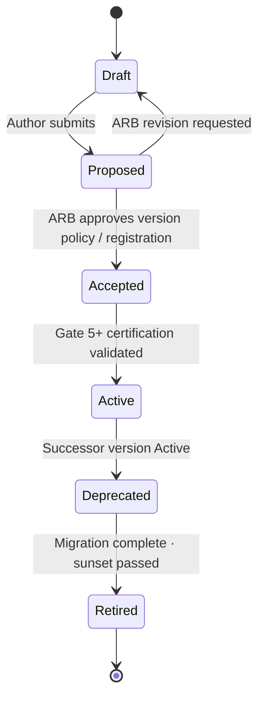

# ADR-020 — Versioning & Domain Compatibility

**Identifier:** ADR-020  
**Mission:** ADR-020 — Versioning & Domain Compatibility  
**Program:** P-016 — ORION Enterprise Platform v2.0  
**Status:** Proposed  
**Date:** 2026-08-02  
**Authors:** Chief Enterprise Architect · Platform Engineering Lead · Finance Domain Lead  
**Reviewers:** Architecture Review Board · Security Architect · HCM Domain Lead · CRM Domain Lead  
**Version:** 1.0  
**Architecture Baseline:** v1.0 GA Candidate → v2.0 Multi-Domain Baseline

**Builds on:** [ADR-013 Durable IIL](./ADR-013-Durable-Intelligent-Integration-Layer.md) · [ADR-014 Cross-Domain Event Contracts](./ADR-014-Cross-Domain-Event-Contracts.md) · [ADR-015 Domain Service Boundaries](./ADR-015-Domain-Service-Boundaries.md) · [P-016.2 Architecture Charter](../../00_Governance/P-016.2-ORION-v2-Architecture-Charter.md) · [ES-097 ADR Policy](../../00_Governance/ES-097-ORION-Architecture-Governance-ADR-Policy.md)  
**Enables:** [ES-FIN-002 Finance Engineering Specification](../../Finance/Engineering/ES-FIN-002-Finance-Engineering-Specification.md) · P-009 Gate 5 · P-008 CRM Phase II · P-016.3 ADR Program  
**Related:** [ADR-012 Deployment & Release Strategy](./ADR-012-Deployment-Release-Strategy.md) · [Release Policy](../../06_Releases/Release-Policy.md) · [ES-HCM-001 Reference Domain](../../HCM/Engineering/ES-HCM-001_Enterprise_HCM_Engineering_Specification.md) · [Architecture Handbook v1.0](../../00_Governance/ORION_Enterprise_Architecture_Handbook_v1.0.md)

---

## Decision Summary

ORION adopts an **enterprise-wide versioning and compatibility strategy** governing how domains, event contracts, public facades, REST APIs, repositories, and configuration evolve without breaking multi-domain integration.

**Semantic versioning** applies to platform releases, domain packages, and public contracts. **Backward compatibility** is the default. **Breaking changes** require ADR approval, major version increment, migration guide, deprecation period, and re-certification per [ES-097 §7](../../00_Governance/ES-097-ORION-Architecture-Governance-ADR-Policy.md).

[ADR-014](./ADR-014-Cross-Domain-Event-Contracts.md) defines **event contract** versioning detail. ADR-020 defines the **enterprise compatibility model** spanning all artifact types and migration governance.

**Implementation is deferred** until this ADR reaches **Accepted** status. This record defines constitutional architecture only — no APIs, no production code, no implementation authorization.

---

## 1. Context

### 1.1 Why Compatibility Governance Is Required

ORION v2.0 is a **multi-domain authoritative platform** where HCM, Finance, CRM, Hospitality, and Intelligence integrate through durable IIL events ([ADR-013](./ADR-013-Durable-Intelligent-Integration-Layer.md)) under governed contracts ([ADR-014](./ADR-014-Cross-Domain-Event-Contracts.md)) within explicit boundaries ([ADR-015](./ADR-015-Domain-Service-Boundaries.md)).

Domains evolve independently — new aggregates, facade methods, event fields, REST endpoints, and persistence schemas ship across waves. Without constitutional compatibility law:

- Finance consumers break when HCM payload shapes drift
- CRM facade changes silently break presentation layers
- Repository schema migrations corrupt authoritative data
- Rolling deploys cause mixed-version event processing failures
- Certification cannot prove safe evolution paths

[P-016.2 Commitment A5](../../00_Governance/P-016.2-ORION-v2-Architecture-Charter.md): **Breaking changes via ADR only.**

### 1.2 Enterprise Evolution Goals

| Goal | Measure |
|------|---------|
| **Independent domain evolution** | Domains ship MINOR/PATCH without breaking foreign consumers |
| **Safe cross-domain chains** | HCM → Finance → Intelligence chains survive version transitions |
| **Predictable breaking change process** | ADR · major bump · migration · deprecation · certification |
| **Rolling upgrade safety** | Mixed-version deploy tolerates in-flight events and replay |
| **Audit trail** | Every version transition documented and certifiable |
| **Design partner confidence** | Published compatibility matrix for integration partners |
| **v2.0 GA integrity** | Zero Retired contracts in active processors at Gate 6 |

### 1.3 Problems Addressed

| Problem | Current / Risk State | ADR-020 Resolution |
|---------|---------------------|-------------------|
| **Ad-hoc breaking changes** | ES-097 violation risk across v2.0 waves | Unified breaking change law |
| **Event payload drift** | Partial rules in ADR-014 only | Enterprise compatibility model + ADR-014 detail |
| **Facade versioning undefined** | Handbook rule without constitutional ADR | Facade semver policy |
| **API versioning absent** | REST namespaces without version strategy | API compatibility rules |
| **Repository migration ungoverned** | PlatformStore rollout per ADR-007 without domain law | Repository compatibility + data migration governance |
| **Configuration breaks deploys** | Env var changes without compatibility window | Configuration compatibility rules |
| **Finance Gate 5 blocked** | ES-FIN-002 requires Accepted ADR-020 | Constitutional versioning standard |
| **Dual-version periods ad hoc** | No maximum window or certification rule | Dual-version support policy |

### 1.4 Architectural Baseline

| Document | Relevance |
|----------|-----------|
| [ADR-014 §6](./ADR-014-Cross-Domain-Event-Contracts.md) | Event contract versioning · deprecation · migration |
| [ADR-015 §3.5](./ADR-015-Domain-Service-Boundaries.md) | Public facade as versioned contract surface |
| [ES-097 §7](../../00_Governance/ES-097-ORION-Architecture-Governance-ADR-Policy.md) | Change classification · breaking change requirements |
| [ES-FIN-002 §4.4](../../Finance/Engineering/ES-FIN-002-Finance-Engineering-Specification.md) | Finance catalogue `eventVersion: 1` baseline |
| [Release Policy](../../06_Releases/Release-Policy.md) | Platform semver · RC · patch rules |
| [Handbook §7.4 · §13.1](../../00_Governance/ORION_Enterprise_Architecture_Handbook_v1.0.md) | Facade rules · semver definitions |
| [ES-HCM-001](../../HCM/Engineering/ES-HCM-001_Enterprise_HCM_Engineering_Specification.md) | Reference domain · stable facade pattern |

---

## 2. Problem Statement

ADR-014 resolves **event contract** versioning within the schema registry. ADR-015 resolves **boundary** law. Neither defines the **enterprise-wide compatibility model** for domain packages, facades, REST APIs, repositories, configuration, rolling upgrades, or unified version lifecycle.

Without ADR-020:

- **Finance Gate 5 is blocked** — ES-FIN-002 §4.4 · §13 reference ADR-020
- **Multi-domain event chains lack unified migration law** — ADR-014 alone insufficient for facade/API co-evolution
- **CRM facade convergence** lacks breaking change process ([ADR-015](./ADR-015-Domain-Service-Boundaries.md))
- **Platform release semver** ([Release Policy](../../06_Releases/Release-Policy.md)) lacks domain artifact alignment
- **Rolling upgrades** risk mixed-version consumer failures
- **Data migrations** proceed without governance linkage to public contracts

This ADR resolves the **compatibility** question. It does **not** authorize implementation until Accepted.

---

## 3. Decision

ORION adopts an **enterprise-wide versioning and domain compatibility strategy** as constitutional law for all authoritative domains and platform services.

### 3.1 Semantic Versioning

ORION follows [Semantic Versioning 2.0.0](https://semver.org/) per [Release Policy](../../06_Releases/Release-Policy.md) and [Handbook §13.1](../../00_Governance/ORION_Enterprise_Architecture_Handbook_v1.0.md):

```
MAJOR.MINOR.PATCH[-prerelease][+build]
```

| Component | Meaning | ORION Application |
|-----------|---------|-------------------|
| **MAJOR** | Breaking public contract | Facade removal · required event field removal · REST break · store schema break |
| **MINOR** | Additive backward-compatible capability | New facade method · optional event field · new REST endpoint |
| **PATCH** | Bug fix · no public contract change | Internal fix · documentation correction · performance |
| **Prerelease** | `-alpha` · `-beta` · `-rc.n` | Pre-GA certification stages |

**Platform release tag** (e.g. `v2.0.0`) reflects the **highest breaking surface** in the release scope. Domain-internal PATCH does not require platform MAJOR bump.

### 3.2 Domain Versioning

Each authoritative domain maintains a **declared domain version** aligned with platform releases and domain ES:

| Element | Version Identifier | Rule |
|---------|-------------------|------|
| **Domain package** | Platform release + domain ES version | Documented in ES-{DOM}-00x |
| **Public facade** | Facade contract version (semver) | Breaking change → facade MAJOR |
| **Domain ES** | ES document version (semver) | Tracks engineering specification evolution |
| **Mission modules** | Mission ID (P-009.x · P-012.x) | Traceability — not semver substitute |

**Domain version rules:**

| Rule ID | Rule |
|---------|------|
| **DOM-V-001** | Domain version declared in engineering specification header |
| **DOM-V-002** | Domain MINOR may ship without foreign domain code changes |
| **DOM-V-003** | Domain MAJOR requires ADR + consumer migration plan |
| **DOM-V-004** | New authoritative domain starts at `1.0.0` facade contract at Gate 5 |
| **DOM-V-005** | HCM v1.0 is reference baseline — Finance · CRM · Hospitality replicate compatibility discipline |

### 3.3 Event Contract Versioning

Event contract versioning is **governed by [ADR-014 §6](./ADR-014-Cross-Domain-Event-Contracts.md)**. ADR-020 establishes enterprise alignment:

| Element | Version Scheme | Authority |
|---------|----------------|-----------|
| **`eventVersion` (envelope)** | Integer major for v2.0 (`1`, `2`, …) | ADR-014 |
| **Schema file** | `{eventType}.v{N}.schema.json` | ADR-014 registry |
| **Contract lifecycle** | Draft → Registered → Active → Deprecated → Retired | ADR-014 |
| **Breaking event change** | New major `eventVersion` or new `eventType` | ADR-014 + ARB |

**ADR-020 additions:**

| Rule ID | Rule |
|---------|------|
| **EVT-V-001** | All cross-domain catalogue entries declare `eventVersion` from first publication |
| **EVT-V-002** | Platform release MUST NOT Retire event major without ADR-014 migration complete |
| **EVT-V-003** | Finance inbound catalogue ([ES-FIN-002 §4](../../Finance/Engineering/ES-FIN-002-Finance-Engineering-Specification.md)) starts at version `1` |
| **EVT-V-004** | HCM legacy `CustomEvent` migration preserves original version semantics in replay |
| **EVT-V-005** | Maximum **two active majors** per `eventType` during migration window |

**Scope boundary:** ADR-014 owns schema registry mechanics. ADR-020 owns enterprise semver alignment and cross-artifact migration coordination.

### 3.4 API Versioning

REST APIs under `app/api/<domain>/` follow **URL-path major versioning** at architecture level:

| Element | Convention |
|---------|--------------|
| **Namespace** | `/api/<domain>/v<major>/...` |
| **Initial v2.0 domains** | `v1` path segment at Gate 5 entry |
| **Additive endpoint** | Same major — MINOR domain release |
| **Breaking endpoint** | New major path · old major Deprecated |
| **Deprecation notice** | `Sunset` header + ES/API catalogue marker |
| **Internal-only routes** | Not versioned — not public contract |

**API compatibility rules:**

| Rule ID | Rule |
|---------|------|
| **API-V-001** | Public REST contract documented in domain API catalogue |
| **API-V-002** | Request/response breaking change → new major path |
| **API-V-003** | Additive optional response fields — same major (tolerant readers) |
| **API-V-004** | RBAC permission changes follow ADR-009 — may require migration guide |
| **API-V-005** | Presentation layer MUST NOT depend on undocumented API fields |

### 3.5 Repository Compatibility

Repository and persistence evolution follows **adapter pattern** per [ADR-007](./ADR-007-Production-Persistence-Strategy.md):

| Change Type | Version Impact | Governance |
|-------------|----------------|------------|
| **Additive nullable column/field** | Repository PATCH | Domain Lead |
| **Additive required field with default** | Repository MINOR | Domain Lead + migration script |
| **Rename/remove column** | Repository MAJOR | ADR + data migration plan |
| **Aggregate boundary change** | Domain MAJOR | ADR + ARB |
| **Cross-domain FK** | **Forbidden** | ADR-015 — identifiers only |

**Repository rules:**

| Rule ID | Rule |
|---------|------|
| **REP-V-001** | Repository interface changes MUST NOT break facade public contract without facade version bump |
| **REP-V-002** | Store schema migrations are **domain-internal** — invisible to foreign domains |
| **REP-V-003** | Optimistic concurrency versioning on aggregates when persistent (planned ES-036) |
| **REP-V-004** | Migration scripts versioned and linked to domain ES version |
| **REP-V-005** | Rollback script required for MAJOR store migrations until Gate 6 certified |

### 3.6 Configuration Compatibility

Configuration and environment evolution per [ADR-010](./ADR-010-Configuration-Secrets-Management.md):

| Element | Compatibility Rule |
|---------|-------------------|
| **Environment variables** | Additive vars — compatible; removed vars — breaking |
| **Feature flags** | Default-off additive flags — MINOR; behavior change — ADR if public impact |
| **Secrets rotation** | PATCH — no contract change |
| **Platform bootstrap config** | Breaking change requires deploy runbook update |
| **Domain policy config** | Versioned in domain ES · org-scoped |

| Rule ID | Rule |
|---------|------|
| **CFG-V-001** | Removed env var = breaking — requires migration guide |
| **CFG-V-002** | Renamed env var = breaking — dual-read period recommended |
| **CFG-V-003** | Configuration changes affecting IIL transport require ADR-013 review |
| **CFG-V-004** | Staging and production config parity required for certification |

---

## 4. Compatibility Model

### 4.1 Backward Compatibility

**Definition:** A new version is backward compatible if existing consumers compiled against or subscribed to the prior contract continue to function without modification.

| Artifact | Backward Compatible Change |
|----------|---------------------------|
| **Facade** | Add optional method · add optional parameter with default |
| **Event payload** | Add optional field · extend enum with new value only if consumers tolerate unknown |
| **REST API** | Add optional request field · add response field |
| **Repository** | Add nullable persistence field · internal optimization |
| **Configuration** | Add new env var with safe default |

| Rule ID | Rule |
|---------|------|
| **BC-001** | Default posture: **additive only** within MINOR release |
| **BC-002** | Consumers MUST be tolerant readers for unknown optional fields (ADR-014) |
| **BC-003** | Producers MUST NOT remove or rename published fields within same major |

### 4.2 Forward Compatibility

**Definition:** Older producers remain consumable by newer consumers during rolling upgrade.

| Rule ID | Rule |
|---------|------|
| **FC-001** | Consumers MUST ignore unknown optional envelope and payload fields |
| **FC-002** | Consumers MUST declare subscribed major version explicitly |
| **FC-003** | New consumer version MUST process prior major during dual-version window |
| **FC-004** | Platform validation MUST NOT reject unknown optional metadata |

### 4.3 Breaking Changes

A change is **breaking** if it requires consumer modification to avoid failure:

| Breaking Change | Example |
|-----------------|---------|
| Facade method removal or signature change | Remove `createInvoice` parameter |
| Required event field added | New mandatory `companyId` in payload |
| Event field removed or renamed | `amount` → `totalAmount` |
| REST path or required body change | `/v1/invoices` → `/v2/bills` |
| Store schema break | Drop column · change type |
| Semantic meaning change | `status: approved` now means different state |
| Configuration removal | Delete required env var |

**Breaking change requirements** (per ES-097 §7.4):

1. **ADR** approved by ARB
2. **Major version** increment on affected artifact
3. **Migration guide** published
4. **Deprecation period** where consumers exist (minimum 90 days production)
5. **Dual-version support** during migration window
6. **Re-certification** at affected gate

### 4.4 Deprecation

| Rule ID | Rule |
|---------|------|
| **DEP-001** | Deprecated artifacts remain functional until sunset date |
| **DEP-002** | Deprecation announced in ES · API catalogue · event catalogue |
| **DEP-003** | `successorVersion` documented for all deprecated artifacts |
| **DEP-004** | Minimum **90 days** production deprecation before Retire |
| **DEP-005** | Observability alerts on deprecated artifact usage — target zero before Retire |
| **DEP-006** | Deprecated event majors may still publish during dual-publish window (ADR-014) |

### 4.5 Dual-Version Support

| Rule ID | Rule |
|---------|------|
| **DUAL-001** | Maximum **two active majors** per public contract (facade group · event type · API major) |
| **DUAL-002** | Dual-version window maximum **180 days** in production unless ARB extends |
| **DUAL-003** | Producers dual-publish · consumers dual-subscribe during window |
| **DUAL-004** | Certification tests cover both active majors for priority chains |
| **DUAL-005** | Retire prior major only after zero production traffic evidence |

### 4.6 Migration Windows

| Window | Duration | Applies To |
|--------|----------|------------|
| **Development** | Unlimited | Draft · Proposed artifacts |
| **Staging certification** | Per sprint | Active + Deprecated testing |
| **Production deprecation** | Minimum 90 days | Deprecated → Retired |
| **Dual-major production** | Maximum 180 days | Event · API · facade majors |
| **Emergency break-fix** | ARB expedited | P0 only — still requires migration guide |

---

## 5. Version Lifecycle

Unified lifecycle for **versioned public artifacts** (event contracts, facade contract groups, API majors, domain ES):



### 5.1 Lifecycle States

| State | Definition | May Use in Production? |
|-------|------------|------------------------|
| **Draft** | Work in progress · not registered | No |
| **Proposed** | Submitted for ARB · staging with feature flag only | No |
| **Accepted** | ARB approved · registered · awaiting implementation proof | Staging certification only |
| **Active** | Implemented · certified · current supported version | **Yes** |
| **Deprecated** | Successor Active · migration period open | Yes — with migration plan |
| **Retired** | Sunset passed · no new use | No — replay/read-only where ADR-014 permits |

### 5.2 Lifecycle by Artifact Type

| Artifact | Draft | Proposed | Accepted | Active | Deprecated | Retired |
|----------|-------|----------|----------|--------|------------|---------|
| **Event contract (ADR-014)** | Schema draft | ARB review | Registered | Active publish | Dual-publish window | No publish |
| **Domain facade contract** | ES draft | Gate 4 review | Gate 4 ratified | Gate 5+ production | Old major supported | Removed |
| **REST API major** | Catalogue draft | Gate 4 review | Gate 4 ratified | Gate 5+ production | Old path supported | Path removed |
| **Domain ES** | Author draft | ARB review | Gate 4 ratified | Gate 5 aligned | Superseded ES marked | Archive only |
| **Platform release** | develop branch | RC branch | Gate 6 GO | GA tag | Maintenance mode | EOL |

### 5.3 Lifecycle Transitions

| Transition | Trigger | Approval |
|------------|---------|----------|
| Draft → Proposed | Author complete | Domain Lead |
| Proposed → Accepted | ARB quorum | ARB |
| Accepted → Active | Gate 5 certification pass | Certification authority |
| Active → Deprecated | Successor Active | Domain Lead + consumer notification |
| Deprecated → Retired | Zero traffic + sunset date | ARB |
| Any → Draft (rollback) | Critical defect | ARB emergency |

**Note:** ADR record lifecycle (Proposed → Accepted → Implemented) per ES-097 is **separate** from artifact version lifecycle above. This ADR's own status follows ES-097 ADR lifecycle.

---

## 6. Governance

### 6.1 Approval Process

Per [ES-097](../../00_Governance/ES-097-ORION-Architecture-Governance-ADR-Policy.md):

| Change Class | Approval | Documentation |
|--------------|----------|---------------|
| **PATCH** (compatible) | Code review · quality gates | ES patch note |
| **MINOR** (additive) | Domain Lead · ES update | API/event catalogue update |
| **MAJOR** (breaking) | ARB + ADR | Migration guide · re-certification plan |
| **Cross-domain breaking** | ARB + producer + consumer Domain Leads | Joint impact assessment |

**Breaking change ADR shall specify** (ES-097 §7.5):

| Element | Required Content |
|---------|------------------|
| Consumer impact | Domains · APIs · events affected |
| Migration steps | Ordered upgrade path |
| Dual-run period | Old + new parallel duration |
| Rollback | Revert procedure |
| Validation | Certification tests proving success |

### 6.2 Compatibility Certification

| Requirement | Gate | Evidence |
|-------------|------|----------|
| Event catalogue declares `eventVersion` | Gate 4 | Doc tests · ES-FIN-002 §4 |
| Facade export audit — no breaking drift | Gate 5 | Integration tests |
| Forbidden import law (ADR-015) | Gate 5 | Architecture tests |
| Dual-major chain tests | Gate 5–6 | HCM → Finance integration |
| Deprecated artifact usage monitored | Gate 6 | Observability dashboard |
| Zero Retired in active processors | Gate 6 | Certification report |
| API major documented | Gate 4–5 | API catalogue |
| Migration guide exists for MAJOR | Gate 5 | Published doc |

### 6.3 Release Impact

| Milestone | ADR-020 Requirement |
|-----------|----------------------|
| **Finance Gate 5** | **Accepted** · Finance catalogue at `eventVersion: 1` |
| **CRM Gate 5** | **Accepted** · CRM facade/API version declared |
| **Hospitality Gate 5** | **Accepted** · folio event versions declared |
| **Wave 1 exit (2027 Q1)** | ADR-013 · ADR-014 · ADR-015 · ADR-020 **Accepted** |
| **v2.0 GA** | ADR-020 **Implemented** · compatibility certification green |
| **v1.0 HCM** | Stable reference — no breaking facade without ADR |

### 6.4 Compliance Requirements

| Standard | ADR-020 Compliance |
|----------|-------------------|
| **ES-097 §7** | Change classification enforced |
| **ES-092 Gate 5 blockers** | Accepted ADR-020 required |
| **ES-094 CP-V2-ADR** | Versioning policy before multi-domain Gate 5 |
| **ES-FIN-002 §4.4 · §13** | Finance event versioning aligned |
| **Release Policy** | Platform semver aligned with contract semver |
| **ADR-014** | Event versioning detail — no conflict |
| **ADR-015** | Facade breaking changes reference ADR-020 |
| **P-016.2 A5** | Breaking changes via ADR only |

---

## 7. Migration Strategy

### 7.1 Upgrade Principles

| # | Principle |
|---|-----------|
| **UP-1** | **Expand → Migrate → Contract** — add new version alongside old before removing old |
| **UP-2** | **Consumers before producers** — deploy tolerant consumers before breaking producer publish |
| **UP-3** | **Certify in staging** — full dual-version chain before production |
| **UP-4** | **Idempotent migration** — safe to retry (ADR-013 · ADR-014) |
| **UP-5** | **Document every MAJOR** — migration guide is release gate |
| **UP-6** | **Rollback plan mandatory** until Gate 6 stable |

### 7.2 Rolling Upgrades

Mixed-version deployment during rolling platform upgrade:

| Phase | Order | Rule |
|-------|-------|------|
| **1** | Deploy tolerant consumers | Handle old + new event majors · tolerant API readers |
| **2** | Deploy platform IIL (ADR-013) | Durable transport unchanged envelope |
| **3** | Deploy producer dual-publish | Old + new event major if breaking |
| **4** | Migrate consumers to new major | Within dual-version window |
| **5** | Retire old producer major | After zero consumer dependency |
| **6** | Remove deprecated API path | After sunset |

| Rule ID | Rule |
|---------|------|
| **ROLL-001** | Rolling deploy MUST NOT require full stop except MAJOR store migration |
| **ROLL-002** | In-flight events processed at original `eventVersion` |
| **ROLL-003** | Health checks validate version compatibility before traffic shift |
| **ROLL-004** | ADR-012 release strategy governs deploy mechanics |

### 7.3 Replay Compatibility

Per [ADR-013](./ADR-013-Durable-Intelligent-Integration-Layer.md) · [ADR-014 §8.3](./ADR-014-Cross-Domain-Event-Contracts.md):

| Rule ID | Rule |
|---------|------|
| **RPL-001** | Replay preserves original envelope including `eventVersion` |
| **RPL-002** | Consumers MUST handle all **Active** and **Deprecated** majors on replay |
| **RPL-003** | Retired majors available for historical replay read — not reprocessed into active ledger without operator approval |
| **RPL-004** | Finance GL replay dedupes on `eventId` + `idempotencyKey` regardless of consumer version |
| **RPL-005** | Gate 6 certification includes staging replay of HCM → Finance chain |

### 7.4 Data Migration Governance

| Element | Governance |
|---------|------------|
| **Ownership** | Domain Lead owns domain store migrations |
| **Timing** | Store MAJOR migrations ship in dedicated release — not bundled with unrelated MINOR |
| **Script versioning** | `{domain}/migrations/v{major}.{minor}.{patch}-{description}` |
| **Proof** | Staging run with production-scale sample before Gate 6 |
| **Rollback** | Down migration script or restore-from-backup plan documented |
| **Cross-domain impact** | **None** — foreign domains unaffected (ADR-015) |
| **Audit** | Migration execution logged in platform audit trail |

**Priority v2.0 data migration paths:**

| Migration | Domain | Trigger |
|-----------|--------|---------|
| HCM PostgreSQL (complete) | HCM | ADR-007 — v1.0 path |
| Finance PlatformStore persister | Finance | Gate 5 |
| CRM facade convergence | CRM | Gate 4–5 under ADR-015 |
| HCM CustomEvent → canonical types | HCM | ADR-014 compatibility shim · catalogue v2 |
| Event contract registry population | Platform | ADR-014 Accepted |

---

## 8. Compatibility Matrix Summary

| Surface | Version Identifier | Breaking = | Dual Support | Detail ADR |
|---------|-------------------|------------|--------------|------------|
| **Platform release** | `vMAJOR.MINOR.PATCH` | MAJOR | N/A | Release Policy |
| **Domain package** | ES version + release tag | Facade/API/event break | Per artifact | ADR-020 |
| **Public facade** | Facade contract semver | Method/signature removal | 2 majors max | ADR-015 · ADR-020 |
| **Event contract** | `eventVersion` integer | ADR-014 rules | 2 majors max | ADR-014 |
| **REST API** | URL `/v{major}/` | Path/body break | 2 majors max | ADR-020 |
| **Repository store** | Migration script version | Schema break | Expand-contract | ADR-007 · ADR-020 |
| **Configuration** | Env var catalogue | Var removal/rename | Dual-read period | ADR-010 · ADR-020 |

---

## 9. Alternatives Considered

| Alternative | Summary | Verdict |
|-------------|---------|---------|
| **A — Enterprise compatibility model (this ADR)** ✅ | Unified semver · lifecycle · migration | **Selected** |
| **B — Event-only versioning (ADR-014 alone)** | Contracts only | **Rejected** — facade/API/repo gaps |
| **C — Calendar versioning** | Date-based releases | **Rejected** — breaks semver consumer expectations |
| **D — No deprecation period** | Immediate breaking removal | **Rejected** — multi-domain chain risk |
| **E — Unlimited dual-version** | Indefinite parallel majors | **Rejected** — certification and ops burden |
| **F — Per-domain ad hoc semver** | No enterprise law | **Rejected** — Finance Gate 5 blocked |

---

## 10. Consequences

### 10.1 Positive

- Predictable evolution across all domains
- Finance · CRM · HCM chains migrate safely
- Aligns ES-097 · Release Policy · ADR-014 · ADR-015
- Closes ES-FIN-002 · P-016.3 ADR-020 program intent
- Rolling upgrades and replay governed

### 10.2 Negative

- Dual-version periods increase operational complexity
- MAJOR changes require ARB latency
- Migration guide maintenance overhead
- Certification scope expands

### 10.3 Risks

| Risk | Mitigation |
|------|------------|
| ADR-014 / ADR-020 overlap confusion | Scope boundary in §3.3 · §8 |
| Developers skip deprecation window | CI + observability on deprecated usage |
| Store migration failure | Rollback script · staging proof |
| HCM legacy event migration | ADR-014 shim · phased catalogue v2 |

---

## 11. Dependencies

| Dependency | Type | Notes |
|------------|------|-------|
| ADR-013 | **Requires** | Replay · rolling upgrade transport |
| ADR-014 | **Requires** | Event contract versioning detail |
| ADR-015 | **Requires** | Facade as versioned public surface |
| ADR-012 | Extends | Deploy · release alignment |
| ADR-007 | Extends | Repository migration pattern |
| ES-097 | Governance | Change management |
| ES-FIN-002 | Enables | Finance catalogue versioning |
| P-016.3 | Program | Wave 1 exit blocker |

---

## 12. Acceptance Criteria

| # | Criterion | Status |
|---|-----------|--------|
| AC-1 | Enterprise semver strategy defined | ✅ §3.1 |
| AC-2 | Domain · event · API · repository · config versioning defined | ✅ §3.2–3.6 |
| AC-3 | Compatibility rules defined | ✅ §4 |
| AC-4 | Version lifecycle defined | ✅ §5 |
| AC-5 | Governance and certification defined | ✅ §6 |
| AC-6 | Migration strategy defined | ✅ §7 |
| AC-7 | ADR-014 scope boundary clear | ✅ §3.3 · §8 |
| AC-8 | ARB review scheduled | Pending |

---

## 13. Release Impact

| Milestone | Impact |
|-----------|--------|
| **Finance Gate 5** | **Hard blocker** — requires **Accepted** |
| **CRM · Hospitality Gate 5** | **Hard blocker** |
| **Wave 1 exit** | ADR-020 **Accepted** with ADR-013–015 |
| **v2.0 GA** | ADR-020 **Implemented** · compatibility certification |
| **HCM v1.x** | Reference — existing facade stable |

---

## 14. Implementation Impact (Future — Not Authorized)

| Area | Planned Impact |
|------|----------------|
| CI certification | Version inventory tests · deprecated usage scans |
| API catalogues | Major version paths documented |
| Event registry | `eventVersion` on all contracts |
| Migration guides | Published per MAJOR |
| Observability | Deprecated artifact usage metrics |

---

## 15. Related Documents

| Document | Location |
|----------|----------|
| ADR-013 | [ADR-013-Durable-Intelligent-Integration-Layer.md](./ADR-013-Durable-Intelligent-Integration-Layer.md) |
| ADR-014 | [ADR-014-Cross-Domain-Event-Contracts.md](./ADR-014-Cross-Domain-Event-Contracts.md) |
| ADR-015 | [ADR-015-Domain-Service-Boundaries.md](./ADR-015-Domain-Service-Boundaries.md) |
| ES-FIN-002 | [ES-FIN-002-Finance-Engineering-Specification.md](../../Finance/Engineering/ES-FIN-002-Finance-Engineering-Specification.md) |
| ES-097 | [ES-097-ORION-Architecture-Governance-ADR-Policy.md](../../00_Governance/ES-097-ORION-Architecture-Governance-ADR-Policy.md) |
| P-016.3 | [P-016.3-ORION-v2-ADR-Program.md](../../00_Governance/P-016.3-ORION-v2-ADR-Program.md) |

---

## 16. Superseded ADRs

| ADR | Relationship |
|-----|--------------|
| None | — |

**Note:** P-016.2 §2.2 "ADR-016 Cross-Domain Event Catalogue Versioning" consolidated into **ADR-014 + ADR-020** per [P-016.3 §ADR Renumbering](../../00_Governance/P-016.3-ORION-v2-ADR-Program.md).

---

## 17. Version History

| Version | Date | Author | Changes |
|---------|------|--------|---------|
| 1.0 | 2026-08-02 | Chief Enterprise Architect | Initial proposal — ADR-020 mission |

---

## 18. Status

| Field | Value |
|-------|-------|
| **Current Status** | **PROPOSED** |
| **May Implement?** | **No** — requires Accepted status |
| **Next Step** | ARB review · domain lead sign-off · Wave 1 exit alignment |
| **Compatibility CI** | Deferred until Accepted |

---

## 19. Executive Recommendation

| Assessment | Verdict |
|------------|---------|
| ADR-020 mission complete (architecture) | **GO** |
| Enterprise compatibility model adequate | **GO** |
| ADR-014 scope boundary clear (no conflict) | **GO** |
| Migration · rolling upgrade · replay rules | **GO** |
| ES-097 · Release Policy alignment | **GO** |
| Implementation authorized | **NO-GO** — pending Accepted |
| Finance Gate 5 unblocked on acceptance | **CONDITIONAL GO** |

**Conditions for Accepted:**

1. ARB approves compatibility model and version lifecycle
2. Finance · HCM · CRM Domain Leads acknowledge dual-version windows
3. Platform Engineering confirms rolling upgrade order (§7.2)
4. ADR-014 event versioning scope boundary accepted — no duplicate governance
5. Wave 1 exit criteria aligned with P-016.3 (Accepted alongside ADR-013–015)

---

*ORION Architecture Decision Record · ADR-020 · docs/11_Governance/ADR/ · Architecture only · No implementation · No APIs · No production code*
