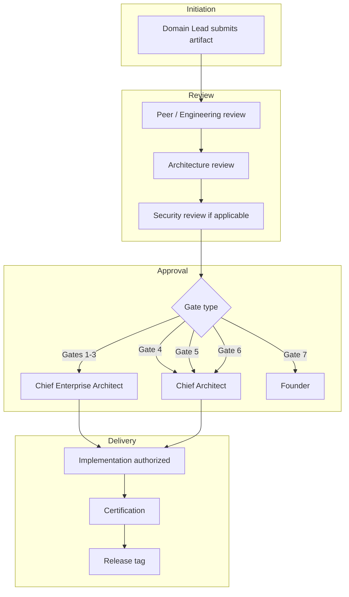

# G-001 — Approval Workflow

**Parent:** [G-001 Enterprise Architecture Governance Charter](./G-001-Enterprise-Architecture-Governance-Charter.md)  
**Version:** 1.0  
**Effective Date:** 31 July 2026  

---

## 1. Purpose

Defines the **sign-off workflow** for mandatory review gates (Gates 1–7) and routine change approval paths.

---

## 2. Gate Workflow

---

## 3. Gate Approval Matrix

| Gate | Primary Approver | Secondary Approver | Evidence Required |
|------|------------------|-------------------|-------------------|
| **1 — Blueprint** | Chief Enterprise Architect | Domain Lead | D-xxx markdown in `docs/` |
| **2 — Domain Model** | Chief Enterprise Architect | Data Governance Lead | Entity/aggregate catalogue |
| **3 — Governance Rules** | Chief Enterprise Architect | Compliance | Policy tables, retention, access |
| **4 — Engineering Spec** | Chief Architect | Domain Engineering Lead | ES-xxx complete per template |
| **5 — Implementation** | Engineering Lead | Code reviewer (2+) | PR merged; quality gates green |
| **6 — Certification** | Chief Architect | Domain Lead | Certification report + test evidence |
| **7 — Release** | Founder | Chief Architect | Release record RR-xxx |

---

## 4. Pull Request Workflow

| Step | Actor | Action |
|------|-------|--------|
| 1 | Author | Branch from `main`; implement within approved ES scope |
| 2 | Author | Self-check: typecheck, lint, test, build |
| 3 | Author | Complete PR template (DoD attestation) |
| 4 | Reviewer | Code review per [CODE_REVIEW_CHECKLIST](../../08_Standards/CODE_REVIEW_CHECKLIST.md) |
| 5 | Reviewer | Architecture checklist for facade/API/domain changes |
| 6 | CI | Automated quality gate must pass |
| 7 | Approver | Merge to `main` |
| 8 | Author | Update certification/debt/docs if scope requires |

**Blocking conditions:** failing CI · missing TD entry for known debt · breaking API without ADR · cross-domain import introduced.

---

## 5. Emergency Change Workflow

For production incidents requiring immediate fix:

1. **Implement** minimal corrective change (Gate 5 only)
2. **Deploy** with Founder or Chief Architect verbal approval
3. **Document** within 24 hours: incident summary, change description
4. **File** ADR or TD-xxx within 5 business days if architectural implication
5. **Retrofit** tests and certification if not covered at time of fix

---

## 6. Escalation

| Situation | Escalate To |
|-----------|-------------|
| Architecture boundary dispute | Chief Enterprise Architect |
| Security concern | Security Architect + Founder |
| Cross-domain integration conflict | Architecture Review (CEA + Domain Leads) |
| Release GO/NO-GO disagreement | Founder final decision |
| Canon interpretation | Founder + Canon Compliance review |

---

## 7. Record Keeping

| Artifact | Storage |
|----------|---------|
| Approved blueprints | `docs/{Domain}/Blueprints/` |
| Engineering specs | `docs/{Domain}/Engineering/` |
| ADRs | `docs/11_Governance/ADR/` |
| Certification reports | `docs/11_Governance/Certification/` |
| Release records | `docs/06_Releases/` |
| Gate sign-off | PR comment, release record, or certification header |

---

*G-001 · Approval Workflow · ORION Enterprise Platform*
