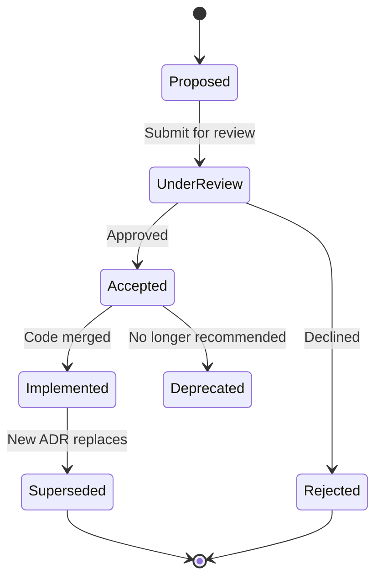

# G-001 — Architecture Decision Process

**Parent:** [G-001 Enterprise Architecture Governance Charter](./G-001-Enterprise-Architecture-Governance-Charter.md)  
**Version:** 1.0  
**Effective Date:** 31 July 2026  

**Detailed framework:** [ES-052 — Architecture Decision Record Framework](../../02_Engineering/ES-052-Architecture-Decision-Record-Framework.md)

---

## 1. Purpose

Operationalizes how ORION records, reviews, approves, and archives **Architecture Decision Records (ADRs)**.

---

## 2. When an ADR Is Required

Create an ADR before implementation when the decision:

| Trigger | Example |
|---------|---------|
| Affects platform or domain architecture | New facade pattern, new domain boundary |
| Selects persistent technology | Database, cache, message broker |
| Defines authentication or authorization model | Session strategy, RBAC model |
| Changes public API contract | Breaking facade method signature |
| Adopts third-party platform | External payroll engine, identity provider |
| Introduces breaking change | Event payload field removal |
| Resolves significant trade-off | Dual stack vs consolidation |

**Not required:** routine bug fixes, internal refactors within approved ES, additive fields on events.

---

## 3. ADR Lifecycle



| Status | Meaning |
|--------|---------|
| **Proposed** | Draft; under author development |
| **Under Review** | Submitted to Chief Architect / CEA |
| **Accepted** | Approved for implementation |
| **Implemented** | Reflected in codebase; validated in release |
| **Superseded** | Replaced by newer ADR (link required) |
| **Deprecated** | Discouraged; retained for history |
| **Rejected** | Not adopted; rationale preserved |

---

## 4. ADR Process Steps

| Step | Actor | Action |
|------|-------|--------|
| 1 | Author | Copy template from ES-052; assign next ADR number |
| 2 | Author | Write Context, Decision, Consequences |
| 3 | Author | Submit PR with ADR in `docs/11_Governance/ADR/` |
| 4 | Reviewer | Technical review (Engineering Lead) |
| 5 | Approver | Architecture review (Chief Architect + CEA for major) |
| 6 | Approver | Set status to **Accepted** |
| 7 | Implementer | Implement; reference ADR in PR and ES |
| 8 | Validator | Confirm in release; update status to **Implemented** |

---

## 5. ADR Format

```markdown
# ADR-NNN – Title

## Status
Proposed | Accepted | Implemented | Superseded | Deprecated | Rejected

## Date
YYYY-MM-DD

## Context
What is the issue? What forces apply?

## Decision
What is the change that we're proposing and/or doing?

## Consequences
### Positive
### Negative

## Related Documents
Links to ES, D-xxx, missions, superseding ADR
```

**Location:** `docs/11_Governance/ADR/ADR-NNN-{Title}.md`  
**Index:** [docs/10_Decisions/README.md](../../10_Decisions/README.md)  
**Next available:** ADR-007

---

## 6. Approval Authority

| ADR Impact | Approvers Required |
|------------|-------------------|
| Single domain, non-breaking | Chief Architect |
| Cross-domain or platform | Chief Architect + Chief Enterprise Architect |
| Breaking public API or Canon | Founder + Chief Enterprise Architect |
| Security architecture | Security Architect + Chief Architect |

---

## 7. Supersession Rules

1. Superseded ADRs **remain in repository** — never delete
2. New ADR must link to superseded ADR(s)
3. Superseded ADR header updated: `Superseded by ADR-NNN`
4. Engineering specs updated to reference new decision
5. Migration guide required if implementation changed

---

## 8. Decision Log (DL) Alternative

Use [Decision Log entries](../../10_Decisions/ORION_Decision_Log.md) (`DL-YYYY-NNN`) when:

- Decision is product or process oriented, not purely architectural
- Broader options analysis should be preserved
- ADR would be too narrow

ADRs and DL entries shall cross-reference each other.

---

*G-001 · Architecture Decision Process · ORION Enterprise Platform*
