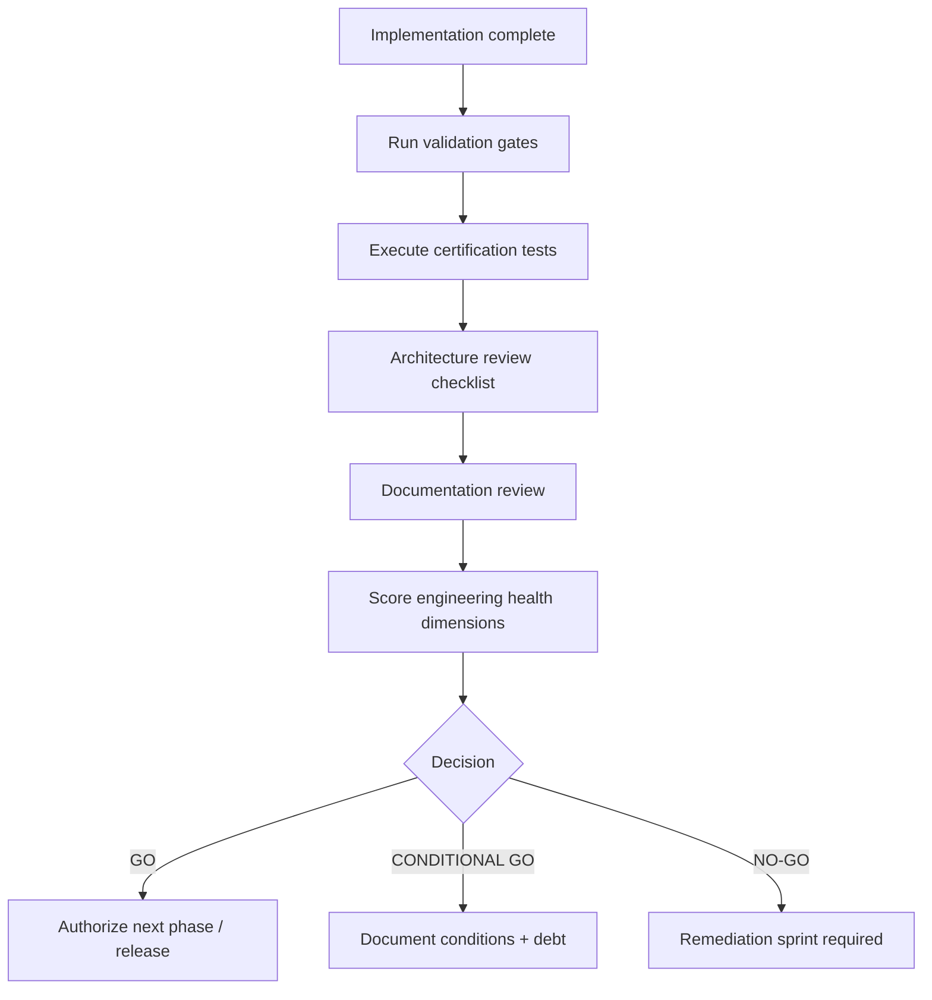

# G-001 — Certification Process

**Parent:** [G-001 Enterprise Architecture Governance Charter](./G-001-Enterprise-Architecture-Governance-Charter.md)  
**Version:** 1.0  
**Effective Date:** 31 July 2026  

---

## 1. Purpose

Defines **Gate 6 — Certification**: how domains, platform modules, and releases are evaluated and assigned GO / CONDITIONAL GO / NO-GO decisions.

---

## 2. Certification Types

| Type | Scope | Example |
|------|-------|---------|
| **Domain Certification** | Full business domain | P-008.8 Commercial Domain |
| **Mission Certification** | Single P-xxx.x mission | P-011.1 Master Data Registry |
| **Platform Certification** | Cross-cutting platform module | P-010.6 Compliance Platform |
| **Release Certification** | Tagged platform release | v0.5.0-beta |
| **Sprint Certification** | Stabilization / audit sprint | S-001 Green Dashboard |

---

## 3. Certification Workflow



---

## 4. Validation Gates (Mandatory)

All certification runs require recorded results:

| Command | Blocking for GO |
|---------|-----------------|
| `npm run typecheck` | Yes |
| `npm run lint` (zero errors) | Yes |
| `npm test` (full suite green) | Yes |
| `npm run build` | Yes |
| `npm run test:coverage` | Yes for GA; recommended for Beta |

Record: execution time · pass/fail · warning count · coverage percentage if available.

---

## 5. Certification Test Categories

| Category | Location | Purpose |
|----------|----------|---------|
| **Operations tests** | `tests/{domain}/*Operations.test.ts` | Service behavior, CRUD, isolation |
| **Certification tests** | `tests/{domain}/*Certification.test.ts` | Mission ID, docs, routes, facade shape |
| **Integration tests** | `tests/platform/` | Cross-module, IIL, subscriber wiring |
| **Event tests** | Co-located with domain | Publish/subscribe contracts |
| **API tests** | Route existence in certification | `app/api/` structure |

Every new domain shall include at minimum: **Operations** + **Certification** test files.

---

## 6. Documentation Requirements

| Artifact | Required For |
|----------|--------------|
| Domain Blueprint (D-xxx) | Domain certification |
| Engineering Specification (ES-xxx) | Domain / platform certification |
| Platform architecture doc | Platform module certification |
| Certification report | All types — stored in `docs/11_Governance/Certification/` |
| Release notes | Release certification |
| Technical debt entries | CONDITIONAL GO — all P0/P1 items registered |

---

## 7. Engineering Health Scoring

For platform and sprint certifications, recalculate score using S-001.1 dimensions:

| Dimension | Weight |
|-----------|--------|
| Build & type safety | 15% |
| Test reliability | 20% |
| Lint & code hygiene | 10% |
| Architecture consistency | 20% |
| Public API boundaries | 10% |
| Domain isolation | 10% |
| Documentation accuracy | 10% |
| Dead code / completeness | 5% |

| Score | Grade | Typical Decision |
|-------|-------|------------------|
| ≥ 85 | A | GO |
| 75–84 | B+ | GO or CONDITIONAL GO |
| 65–74 | C+ | CONDITIONAL GO |
| < 65 | D or below | NO-GO |

Reference: [S-001.1 Engineering Health Audit](../../03_Quality/S-001.1-Engineering-Health-Audit.md)

---

## 8. Decision Criteria

### GO

- All validation gates pass
- Zero P0 test failures
- Architecture review checklist approved
- Documentation complete for certified scope
- No unresolved P0 technical debt
- Public API conforms to facade rules

### CONDITIONAL GO

- Validation gates pass with documented warnings only
- P1 issues enumerated with owner and target release
- Core capability demonstrably works
- Acceptable for Beta or next mission start with remediation plan

**Examples:** partial platform epic · missing non-blocking docs · known P1 debt with plan

### NO-GO

- Any validation gate fails
- P0 test failures unresolved
- Architecture boundary violations
- Missing Gate 1–4 artifacts
- Undocumented breaking public API change

---

## 9. Certification Report Template

```markdown
# {Mission ID} — Certification Report

**Date:** YYYY-MM-DD
**Scope:** ...
**Architecture Baseline:** v0.x

## Validation Results
| Gate | Result | Detail |

## Test Summary
| Passed | Failed | Pass Rate |

## Architecture Findings
...

## Technical Debt Summary
...

## Engineering Health
| Dimension | Score |
| **Total** | **NN / 100** |

## Decision
GO | CONDITIONAL GO | NO-GO

## Rationale
...
```

Store in: `docs/11_Governance/Certification/` or `docs/03_Quality/` for sprint audits.

---

## 10. Post-Certification Actions

| Decision | Action |
|----------|--------|
| **GO** | Proceed to Gate 7 release approval; update ARCHITECTURE_INDEX |
| **CONDITIONAL GO** | File TD-xxx entries; schedule remediation; may authorize dependent design work only |
| **NO-GO** | Block release and dependent implementation; remediation sprint required |

---

*G-001 · Certification Process · ORION Enterprise Platform*
