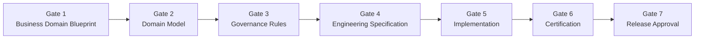

# G-001 — Enterprise Architecture Governance Charter

**Mission:** G-001 — Enterprise Architecture Governance Charter  
**Document ID:** G-001  
**Version:** 1.0  
**Effective Date:** 31 July 2026  
**Architecture Baseline:** v0.5.0-beta  
**Status:** Ratified — Constitutional Engineering Document  
**Classification:** Governance  
**Authority:** Chief Enterprise Architect  
**Owner:** Founder & Chief Architect  

**Supersedes:** Informal governance practices only — does not replace ORION Canon, Constitution, or Product Bible  
**Consolidates:** [ORION Governance Framework](../../09_Standards/ORION_Governance_Framework.md) · [ES-043](../../02_Engineering/ES-043-Engineering-Governance-Delivery-Standards.md) · [ES-052](../../02_Engineering/ES-052-Architecture-Decision-Record-Framework.md) · [ES-053](../../02_Engineering/ES-053-ORION-Risk-Management-Technical-Debt-Framework.md) · [QUALITY_GATE](../../08_Standards/QUALITY_GATE.md)

---

## 1. Purpose

This Charter is the **permanent constitutional document for ORION engineering governance**. It governs every future domain, platform service, engineering specification, implementation mission, and release.

Every engineer, architect, and domain lead shall treat G-001 as the **mandatory governance contract** for:

- What may be built
- How it may be built
- When it may ship
- How change is managed
- How debt and risk are recorded

Where G-001 operationalizes existing standards, those standards remain authoritative for detail. Where conflict exists, resolve per [Governance Index](../../09_Standards/Governance_Index.md) document hierarchy.

---

## 2. Scope of Governance

### 2.1 Governance Responsibilities

| Domain | Owner | Charter Section | Supporting Document |
|--------|-------|-----------------|---------------------|
| **Enterprise Architecture** | Chief Enterprise Architect | §4 · §5 | [Architecture Review Checklist](./G-001-Architecture-Review-Checklist.md) |
| **Engineering Standards** | Chief Architect | §6 · §7 | [Engineering Standards](../../09_Standards/Engineering_Standards.md) |
| **Public API Review** | Platform Engineering Lead | §4.3 · §8 | [Architecture Review Checklist](./G-001-Architecture-Review-Checklist.md) |
| **Domain Modeling** | Domain Lead + Enterprise Architect | §5 Gate 1–2 | Domain Blueprint + Domain Model (D-xxx) |
| **Security Review** | Security Architect | §7 | [ES-059](../../02_Engineering/ES-059-ORION-Platform-Security-Zero-Trust-Architecture.md) |
| **Performance Review** | Platform Engineering Lead | §7 | Mission-specific NFR section |
| **Scalability Review** | Chief Enterprise Architect | §7 | ES-050 · domain blueprint |
| **Documentation Review** | Domain Lead | §5 Gate 1–4 | [Canon Compliance Checklist](../../00_FOUNDATION/CANON_COMPLIANCE_CHECKLIST.md) |
| **Release Certification** | Chief Architect | §9 | [Certification Process](./G-001-Certification-Process.md) |
| **Technical Debt Management** | Chief Enterprise Architect | §10 | [Technical Debt Register](../TECHNICAL_DEBT.md) |

### 2.2 Applicability

G-001 applies to:

- All business domains (Finance, Hospitality, Commercial, HCM, future domains)
- All platform services (P-010.x, P-011.x)
- All engineering specifications (ES-xxx, ES-DOM-xxx)
- All implementation missions (P-xxx.x, S-xxx)
- All releases (alpha through LTS)

G-001 does **not** replace product discovery, founder vision documents, or Canon chapters C-001–C-010. It **implements** Canon C-003 (Architecture), C-006 (Engineering), and C-010 (Integration) at the operational level.

---

## 3. Mandatory Review Gates

**No implementation may begin before approval of Gates 1–4.**

Every new initiative — domain, platform module, major feature epic, or cross-cutting capability — shall complete the following gates in order:



| Gate | Deliverable | Approval Authority | Blocking |
|------|-------------|-------------------|----------|
| **1** | Business Domain Blueprint (D-xxx) | Chief Enterprise Architect + Domain Lead | Yes — before design |
| **2** | Domain Model (D-xxx or annex) | Chief Enterprise Architect | Yes — before ES |
| **3** | Governance Rules (domain-specific) | Chief Enterprise Architect + Compliance | Yes — before ES |
| **4** | Engineering Specification (ES-xxx) | Chief Architect + Engineering Lead | Yes — before code |
| **5** | Implementation (mission P-xxx.x) | Engineering Lead + Code Review | Yes — before cert |
| **6** | Certification report | Chief Architect | Yes — before release |
| **7** | Release approval | Founder / Chief Architect | Yes — before tag |

### 3.1 Gate Evidence

Each gate produces a **signed artifact** stored under `docs/` with traceable mission ID. Certification tests in `tests/` may enforce documentation presence but shall not substitute for governance approval.

### 3.2 Exceptions

Emergency production fixes may bypass Gates 1–4 only when:

1. No architectural or public API change occurs
2. Change is scoped to correctness or security
3. Post-incident ADR or debt entry filed within 5 business days
4. Founder or Chief Architect approves in writing

---

## 4. Architectural Principles

The following principles are **non-negotiable** for all ORION engineering unless changed through ADR and architecture baseline update.

| Principle | Requirement |
|-----------|-------------|
| **SOLID** | Single responsibility per service; depend on abstractions; extend via composition |
| **Domain-Driven Design** | Bounded contexts; aggregate roots; ubiquitous language in types |
| **Clean Architecture** | Dependencies point inward; domain logic independent of framework |
| **Repository Pattern** | Persistence behind interfaces; no direct store access from API routes |
| **Facade Pattern** | Single public entry per domain/platform module (`index.ts`) |
| **Event-Driven Architecture** | Material state changes publish IIL events; correlation IDs mandatory |
| **Dependency Injection** | Services receive repositories via constructor; testable without globals |
| **Organization Isolation** | All operations scoped by `ServiceContext.organizationId` |
| **Metadata-Driven Configuration** | Extensions via metadata/reference data — not hard-coded forks |
| **Backward Compatibility** | Public APIs evolve additively; breaking changes require ADR + version bump |

### 4.1 Layer Model

```
┌─────────────────────────────────────────────────────────┐
│  Presentation (app/, components/)                       │
├─────────────────────────────────────────────────────────┤
│  Public Facade (lib/{domain}/index.ts)                  │
├─────────────────────────────────────────────────────────┤
│  Domain Services (lib/{domain}/services/)               │
├─────────────────────────────────────────────────────────┤
│  Repository Interfaces (lib/{domain}/repositories/)     │
├─────────────────────────────────────────────────────────┤
│  Persistence Implementations (internal — not exported)  │
└─────────────────────────────────────────────────────────┘
```

**Rule:** External code imports from `@/lib/{domain}` or approved platform facade only.

### 4.2 Public API Rules

| Rule | Description |
|------|-------------|
| API-01 | No `InMemory*` implementations exported from public index |
| API-02 | No repository implementations exported from public index |
| API-03 | Repository **interfaces** (types) exported only when required for DI in tests |
| API-04 | Platform root (`lib/platform/index.ts`) exports contracts and factories — not internal stores |
| API-05 | Breaking public API changes require ADR, version increment, and migration guide |

### 4.3 Domain Isolation Rules

| Allowed | Forbidden |
|---------|-----------|
| Domain → Platform public API | Domain → Domain direct import (Finance → CRM) |
| Domain → Data Platform facade | Domain → another domain's repository |
| Platform → types only | Platform → domain business logic |
| IIL events for cross-domain | Shared mutable static `*-data.ts` as authority |

---

## 5. Change Management

### 5.1 Change Classification

| Class | Definition | Process |
|-----|------------|---------|
| **Major Architecture Change** | New domain, new platform layer, breaking public API, persistence strategy change | ADR + Gates 1–4 + baseline update |
| **Minor Enhancement** | New mission within approved ES scope; additive API | Gate 4 review (delta) + Gate 5–7 |
| **Breaking Change** | Removes or incompatible-modifies public contract | ADR + deprecation period + migration guide |
| **Patch / Fix** | Correctness, security, performance within contract | Code review + quality gates |

### 5.2 Deprecation Policy

1. Mark deprecated in public API JSDoc and release notes
2. Maintain deprecated surface for **minimum one minor release**
3. Emit runtime warning in development builds where feasible
4. Remove only after migration guide published and certification updated
5. Record in ADR if deprecation affects cross-domain contracts

### 5.3 Migration Policy

- Migrations shall be **documented**, **tested**, and **reversible** where data is involved
- In-memory → production persistence migrations follow [ES-036](../../02_Engineering/ES-036-Database-Persistence-Architecture.md)
- Domain consumers migrate to new events/APIs before old surface removal

### 5.4 API Versioning

| Surface | Version Strategy |
|---------|------------------|
| REST API routes | `/api/v{n}/` when breaking; additive changes in-place |
| Domain facades | Semantic versioning on domain package; mission IDs for traceability |
| Event contracts | Additive payload fields; never remove required fields without new event type |
| TypeScript types | Breaking changes require major domain version bump |

---

## 6. Quality Gates

All implementation missions and releases shall pass automated and manual quality gates.

### 6.1 Automated Gates (Mandatory)

| Gate | Command | Blocking |
|------|---------|----------|
| Type safety | `npm run typecheck` | Yes |
| Lint compliance | `npm run lint` (zero errors) | Yes |
| Unit tests | `npm test` | Yes |
| Production build | `npm run build` | Yes |
| Coverage | `npm run test:coverage` | Yes (release candidates) |
| Dependency audit | `npm run audit:production` | Yes (release candidates) |

Reference: [QUALITY_GATE](../../08_Standards/QUALITY_GATE.md)

### 6.2 Manual Gates (Mandatory)

| Gate | When | Checklist |
|------|------|-----------|
| Architecture validation | Gate 4 approval, major PRs | [Architecture Review Checklist](./G-001-Architecture-Review-Checklist.md) |
| Documentation review | Gate 6 certification | [Canon Compliance Checklist](../../00_FOUNDATION/CANON_COMPLIANCE_CHECKLIST.md) |
| Public API review | New facade or export change | Architecture Review Checklist §Public API |
| Security review | Auth, PII, cross-tenant access | ES-059 trust checklist |
| Performance review | High-volume paths, batch jobs | Mission NFR + load test evidence |

---

## 7. Release Governance

Release lifecycle stages and criteria are defined in [Release Governance Guide](./G-001-Release-Governance-Guide.md).

| Stage | Purpose | Certification |
|-------|---------|---------------|
| **Alpha** | Internal validation; APIs unstable | Engineering gates pass |
| **Beta** | Partner / pilot use; APIs stabilizing | Domain certification CONDITIONAL GO minimum |
| **Release Candidate (RC)** | Production candidate | Full certification GO; zero P0 debt |
| **General Availability (GA)** | Production default | Founder sign-off; LTS plan declared |
| **Long-Term Support (LTS)** | Maintenance branch | Security patches only; no breaking changes |

---

## 8. Technical Debt & Risk Registers

### 8.1 Registers

| Register | Location | Owner |
|----------|----------|-------|
| Technical Debt Register | [docs/11_Governance/TECHNICAL_DEBT.md](../TECHNICAL_DEBT.md) | Chief Enterprise Architect |
| Risk Register | Mission certification + ES-053 | Domain Lead |
| Architecture Decision Records | [docs/11_Governance/ADR/](../ADR/) | Chief Architect |
| Deferred Work Register | Product Backlog + TECHNICAL_DEBT | Product + Engineering |

### 8.2 Debt Rules (ADR-004)

- Every conscious compromise requires TD-xxx entry before merge
- Every debt item requires **owner** and **target release**
- Release certification blocked if P0 debt lacks remediation plan
- Inline code references: `// TD-xxx: description`

---

## 9. Governance Bodies & Roles

| Role | Responsibility |
|------|----------------|
| **Founder** | Final release approval; vision alignment |
| **Chief Enterprise Architect** | Architecture gates; baseline; domain boundaries |
| **Chief Architect** | Engineering standards; certification sign-off |
| **Domain Lead** | Domain blueprint; ES authorship; mission delivery |
| **Platform Engineering Lead** | Platform facades; public API hygiene |
| **Security Architect** | Security gate; trust review |

Detailed workflow: [Approval Workflow](./G-001-Approval-Workflow.md)

---

## 10. Supporting Documents

| Document | Purpose |
|----------|---------|
| [G-001 Architecture Review Checklist](./G-001-Architecture-Review-Checklist.md) | Gate reviews and PR architecture validation |
| [G-001 Approval Workflow](./G-001-Approval-Workflow.md) | Gate sign-off process |
| [G-001 Release Governance Guide](./G-001-Release-Governance-Guide.md) | Alpha through LTS lifecycle |
| [G-001 Architecture Decision Process](./G-001-Architecture-Decision-Process.md) | ADR lifecycle |
| [G-001 Certification Process](./G-001-Certification-Process.md) | Gate 6 certification |

---

## 11. Compliance & Enforcement

| Mechanism | Enforcement |
|-----------|-------------|
| CI quality gate | Automated block on merge |
| Certification tests | Documentation and structure presence |
| Code review | [CODE_REVIEW_CHECKLIST](../../08_Standards/CODE_REVIEW_CHECKLIST.md) |
| Release record | Manual Founder/CTO attestation |
| Canon Compliance Checklist | Per-mission close |

Non-compliance without approved exception constitutes **NO-GO** for release.

---

## 12. Certification Decision (Mission G-001)

### **GO**

**Rationale:** G-001 establishes a complete, traceable, and enforceable architecture governance framework that consolidates existing ORION standards into a single constitutional engineering document with operational checklists, workflows, and processes. The framework aligns with Canon, existing ES documents, ADR programme, and stabilization sprint outcomes.

| Criterion | Status |
|-----------|--------|
| Governance responsibilities defined | ✓ |
| Mandatory review gates codified | ✓ |
| Architectural principles codified | ✓ |
| Change management defined | ✓ |
| Quality gates referenced | ✓ |
| Release governance defined | ✓ |
| Technical debt governance linked | ✓ |
| Supporting documents complete | ✓ |

---

## Version History

| Version | Date | Author | Changes |
|---------|------|--------|---------|
| 1.0 | 31 July 2026 | Chief Enterprise Architect | Initial ratified charter — Mission G-001 |

---

*G-001 · Enterprise Architecture Governance Charter · ORION Enterprise Platform*
