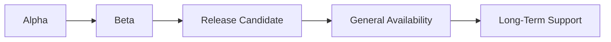

# G-001 — Release Governance Guide

**Parent:** [G-001 Enterprise Architecture Governance Charter](./G-001-Enterprise-Architecture-Governance-Charter.md)  
**Version:** 1.0  
**Effective Date:** 31 July 2026  

---

## 1. Purpose

Defines the **release lifecycle** from alpha through Long-Term Support (LTS), including entry criteria, exit criteria, and certification requirements for each stage.

---

## 2. Release Lifecycle Overview

| Stage | Tag Pattern | Audience | API Stability |
|-------|-------------|----------|---------------|
| **Alpha** | `v0.x.y-alpha` | Internal engineering | Unstable — may change without deprecation |
| **Beta** | `v0.x.y-beta` | Pilot partners, early adopters | Stabilizing — deprecation notices begin |
| **RC** | `v0.x.y-rc.n` | Production candidate | Frozen — only P0 fixes |
| **GA** | `v0.x.y` | Production default | Stable — semver applies |
| **LTS** | `v0.x.y-lts` | Maintenance customers | Security patches only |

---

## 3. Stage Entry & Exit Criteria

### 3.1 Alpha

**Purpose:** Validate engineering implementation against ES; internal dogfooding.

| Entry | Exit (promote to Beta) |
|-------|------------------------|
| Gate 4 ES approved | All automated quality gates pass |
| Core missions complete | Domain certification ≥ CONDITIONAL GO |
| | Documentation for implemented scope complete |
| | Known P0 issues = 0 |

**Required artifacts:** Release notes (alpha) · mission summary · validation log

---

### 3.2 Beta

**Purpose:** External pilot; gather feedback; stabilize APIs.

| Entry | Exit (promote to RC) |
|-------|----------------------|
| Alpha exit criteria met | Full test suite green |
| Public facade stable for scope | Certification GO or CONDITIONAL GO with documented P1 only |
| | Security review complete for scope |
| | Technical debt register current |

**Required artifacts:** Beta release notes · certification report · known limitations list

---

### 3.3 Release Candidate (RC)

**Purpose:** Production deployment candidate; no new features.

| Entry | Exit (promote to GA) |
|-------|----------------------|
| Beta exit criteria met | Two consecutive RC cycles with zero P0/P1 regressions |
| Feature freeze declared | Performance review complete (if applicable) |
| Coverage thresholds met | Founder release approval (Gate 7) |

**Required artifacts:** RC release notes · full validation matrix · rollback plan

---

### 3.4 General Availability (GA)

**Purpose:** Production default release; semver commitment begins.

| Entry | Maintenance |
|-------|-------------|
| RC exit criteria met | Patch releases: `v0.x.y+1` — bug/security only |
| Release record RR-xxx published | Minor releases: additive features per ES |
| LTS decision documented | Major releases: breaking changes + ADR + migration |

**Required artifacts:** GA release notes · changelog entry · architecture baseline update if applicable

---

### 3.5 Long-Term Support (LTS)

**Purpose:** Extended maintenance for production deployments.

| Policy | Detail |
|--------|--------|
| Duration | Minimum 12 months from GA (declared at GA) |
| Changes allowed | Security patches, critical bug fixes |
| Changes forbidden | New features, breaking API changes, dependency major upgrades |
| Branch | `release/v{x.y}-lts` when applicable |

---

## 4. Release Checklist (All Stages)

Before any tagged release:

- [ ] `npm run typecheck` — PASS
- [ ] `npm run lint` — PASS (zero errors)
- [ ] `npm test` — PASS
- [ ] `npm run build` — PASS
- [ ] `npm run test:coverage` — PASS (RC and GA)
- [ ] Release notes drafted
- [ ] CHANGELOG updated
- [ ] Technical debt register reviewed
- [ ] Certification decision recorded (GO / CONDITIONAL GO / NO-GO)
- [ ] Gate 7 approval obtained (Beta and above)

Reference: [RELEASE_CHECKLIST](../../08_Standards/RELEASE_CHECKLIST.md) · [Release Record Template](../../09_Standards/Release_Record_Template.md)

---

## 5. Version Numbering

ORION uses **Semantic Versioning** for platform releases:

| Component | Meaning |
|-----------|---------|
| **Major** | Breaking public API or architecture baseline change |
| **Minor** | Additive domain or platform capability |
| **Patch** | Bug fix, security patch, documentation correction |

Pre-release suffixes: `-alpha`, `-beta`, `-rc.n`

**Example progression:** `v0.4.1-alpha` → `v0.5.0-beta` → `v0.5.0-rc.1` → `v0.5.0` → `v0.5.x` (LTS patches)

---

## 6. Release Roles

| Role | Responsibility |
|------|----------------|
| Release Manager | Coordinates checklist, notes, tag |
| Domain Lead | Domain certification attestation |
| Chief Architect | Gate 6–7 technical sign-off |
| Founder | Gate 7 business sign-off (GA+) |

---

## 7. Rollback Policy

- Every GA release shall document rollback procedure
- Database migrations (when introduced) must be reversible or have compensating migration
- Event schema changes require dual-publish period during migration

---

*G-001 · Release Governance Guide · ORION Enterprise Platform*
