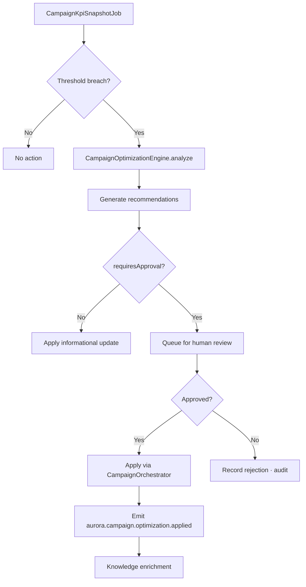
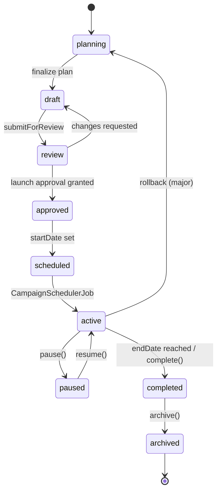
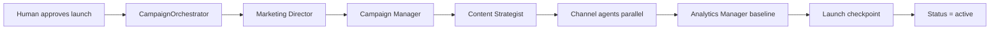

# ES-AURORA-011 — Aurora Campaign Planning & Orchestration Implementation Specification

**Document ID:** ES-AURORA-011  
**Program:** Project Aurora — AI Marketing Platform  
**Mission:** A-013 — Campaign Planning & Orchestration  
**Prior Missions:** A-007 (ES-AURORA-005) · A-008 (ES-AURORA-006) · A-009 (ES-AURORA-007) · A-010 (ES-AURORA-008) · A-011 (ES-AURORA-009) · A-012 (ES-AURORA-010)  
**Version:** 1.0  
**Status:** Ratified — Authoritative Engineering Specification  
**Classification:** Engineering Specification · Campaign Planning · Orchestration · Budget · Multi-Channel  
**Authority:** Founder & Chief Architect · Aurora Architecture Review Board  
**Architecture Source:** [A-001 Aurora Constitution](../A-001-Aurora-Constitution.md) · [A-002 Enterprise Engineering Blueprint](../A-002-Aurora-Enterprise-Engineering-Blueprint.md) · [A-003 AI Workforce Architecture](../A-003-Aurora-AI-Workforce-Architecture.md)  
**Platform Parent:** [ES-AURORA-005](./ES-AURORA-005-Platform-Foundation-Implementation-Specification.md) · [ES-AURORA-006](./ES-AURORA-006-Identity-Tenant-and-Configuration-Foundation.md) · [ES-AURORA-007](./ES-AURORA-007-Enterprise-Knowledge-Graph-and-Memory-Infrastructure.md) · [ES-AURORA-008](./ES-AURORA-008-AI-Workforce-Runtime-Implementation-Specification.md) · [ES-AURORA-009](./ES-AURORA-009-Content-Studio-and-Asset-Management-Implementation-Specification.md) · [ES-AURORA-010](./ES-AURORA-010-SEO-Intelligence-Engine-Implementation-Specification.md)  
**Effective Date:** 7 August 2026  
**Subordinate To:** A-001 · A-002 · A-003 · A-005 · ES-AURORA-005 · ES-AURORA-006 · ES-AURORA-007 · ES-AURORA-008 · ES-AURORA-009 · ES-AURORA-010

**Rule:** This document is the **authoritative engineering specification** for Aurora Campaign Planning & Orchestration (Mission A-013). All code in `lib/aurora/campaign/` must comply. **No production implementation in this document.** **Specification only.**

**Scope:** Campaign workspace · lifecycle · orchestration · AI workforce coordination · channel planning · optimization engine · budget governance · ORION integration. **Excludes:** Publish pipeline (A-015) · Ads connectors (A-021+) · Campaign UI (A-019).

---

## Engineering Principles (Binding)

| # | Principle | Enforcement |
|---|-----------|-------------|
| **CAM-1** | **Campaigns are tenant scoped** | tenant_id · brand_id · RLS on all campaign data |
| **CAM-2** | **Every campaign has measurable objectives** | CampaignGoal required before approval |
| **CAM-3** | **Human approval mandatory before launch** | Launch gate · no auto-start |
| **CAM-4** | **Campaigns are channel independent** | Channel plans separate from campaign entity |
| **CAM-5** | **AI proposes · humans approve** | Workforce recommendations · approval workflow |
| **CAM-6** | **Execution is auditable** | Every state transition · task · delegation logged |
| **CAM-7** | **Rollback is always available** | RollbackManager for active campaigns |
| **CAM-8** | **Complete traceability** | correlationId on all orchestration steps |
| **CAM-9** | **Optimization recommendations are explainable** | Rationale · evidence · confidence on every recommendation |

---

## Table of Contents

1. [Executive Overview](#1-executive-overview)
2. [Campaign Workspace](#2-campaign-workspace)
3. [Campaign Lifecycle](#3-campaign-lifecycle)
4. [Campaign Orchestration](#4-campaign-orchestration)
5. [AI Workforce Coordination](#5-ai-workforce-coordination)
6. [Channel Planning](#6-channel-planning)
7. [Optimization Engine](#7-optimization-engine)
8. [ORION Integration](#8-orion-integration)
9. [Testing Strategy](#9-testing-strategy)
10. [Engineering Standards](#10-engineering-standards)
11. [Acceptance Criteria](#11-acceptance-criteria)
12. [Executive Recommendation](#12-executive-recommendation)

**Appendices:** [A — Campaign Taxonomy](#appendix-a--campaign-taxonomy) · [B — Lifecycle Diagrams](#appendix-b--lifecycle-diagrams) · [C — Workflow Diagrams](#appendix-c--workflow-diagrams) · [D — Approval Matrix](#appendix-d--approval-matrix) · [E — Scheduling Model](#appendix-e--scheduling-model) · [F — Implementation Checklist](#appendix-f--implementation-checklist)

---

# Preamble

Campaigns are where strategy becomes execution.

Aurora's Campaign Planning & Orchestration layer coordinates objectives, budgets, channels, content, agents, and approvals into **governed, traceable, multi-channel marketing initiatives** — with AI proposing and humans authorizing every launch.

Plan with intelligence. Launch with discipline. Optimize with evidence.

---

# 1. Executive Overview

## 1.1 Purpose

| Field | Definition |
|-------|------------|
| **Document purpose** | Implementation specification for Campaign Planning & Orchestration |
| **Audience** | Campaign engineers · backend engineers · marketing ops · AI architects |
| **Binding authority** | Mission A-013 · all `lib/aurora/campaign/` code |
| **Deliverable type** | Engineering specification — no code |

## 1.2 Scope

### In Scope (A-013)

| Area | Coverage |
|------|----------|
| **Campaign workspace** | Repository · templates · objectives · KPIs · timeline · budget · calendar |
| **Lifecycle** | Plan → draft → review → approve → schedule → execute → monitor → complete |
| **Orchestration** | Task planner · dependencies · scheduling · workflow · execution · rollback |
| **AI coordination** | 14-agent delegation · approval hierarchy · escalation |
| **Channel planning** | 11 Phase 1 channels · calendars · allocation |
| **Optimization** | Budget · timeline · risk · forecasting · recommendations |
| **Budget governance** | Allocation · pacing · threshold alerts |
| **ORION integration** | Workforce · Content · SEO · Knowledge · Analytics · Events |

### Out of Scope

| Exclusion | Mission |
|-----------|---------|
| Channel publish execution | A-015 |
| Google/Meta Ads API | A-021+ |
| Email send infrastructure | A-022 |
| Campaign UI | A-019 |
| Full Analytics ingestion | A-014 (hooks only) |

## 1.3 Objectives

| # | Objective | Success Criteria |
|---|-----------|-----------------|
| 1 | **Campaign CRUD + lifecycle** | Full status machine |
| 2 | **Measurable objectives** | CampaignGoal on every campaign |
| 3 | **Launch approval gate** | No launch without human approval |
| 4 | **Campaign orchestration** | Multi-step workflows with dependencies |
| 5 | **AI workforce coordination** | WF-02 campaign launch pattern |
| 6 | **Channel planning** | 11 channels · independent calendars |
| 7 | **Budget pacing** | Hourly job · threshold alerts |
| 8 | **Rollback capability** | Active campaign rollback tested |
| 9 | **Campaign knowledge enrichment** | Completion → CampaignKnowledge |
| 10 | **Tenant isolation** | Zero cross-tenant leakage |

## 1.4 Relationship with Architecture Documents

| Document | ES-AURORA-011 Response |
|----------|------------------------|
| **A-001 Aurora Constitution** | Marketing Planner mandate · campaign governance · budget caps · human-in-the-loop launch |
| **A-002 Enterprise Blueprint** | Marketing domain · `Campaign` · `CampaignGoal` · `BudgetAllocation` · `PlannerEntry` canonical entities |
| **A-003 AI Workforce Architecture** | Campaign Manager · Marketing Director · 14-agent roster · WF-02 launch · TD-1–TD-6 delegation |
| **A-004 Knowledge Architecture** | Campaign Knowledge · Campaign Memory · completion learning · optimization records |
| **A-005 Module Runtime Spec** | `CampaignModuleRuntime` · scheduled jobs · module wiring · health checks |
| **A-006 Mission Backlog** | Mission A-013 · EP-CAMPAIGN epic · features F-100–F-108 |
| **A-007 Platform Foundation** | ES-AURORA-005 · PlatformStore · Event Bus · AuroraRuntimeContext |
| **A-008 Identity & Tenant** | ES-AURORA-006 · RBAC permissions · tenant/brand scoping · tier approval defaults |
| **A-009 Knowledge Graph** | ES-AURORA-007 · campaign completion enrichment · CampaignLesson ingestion |
| **A-010 AI Workforce Runtime** | ES-AURORA-008 · orchestration via `AuroraWorkforceRuntime` · audit · token budget |
| **A-011 Content Studio** | ES-AURORA-009 · content briefs · asset links · publish readiness |
| **A-012 SEO Intelligence** | ES-AURORA-010 · keyword groups · launch pre-flight audits · content SEO scores |

### Dependency Chain

```
ES-AURORA-005 (Platform)
    └── ES-AURORA-006 (Identity)
        └── ES-AURORA-007 (Knowledge)
            └── ES-AURORA-008 (Workforce)
                └── ES-AURORA-009 (Content) + ES-AURORA-010 (SEO)
                    └── ES-AURORA-011 (Campaign) ← this document
                        └── ES-AURORA-012 (Analytics) ← authorized next
```

---

# 2. Campaign Workspace

## 2.1 CampaignModuleRuntime

**File:** `lib/aurora/campaign/CampaignModuleRuntime.ts`

```typescript
export class CampaignModuleRuntime implements AuroraModuleRuntime {
  readonly moduleKey = 'campaign';
  readonly displayName = 'Campaign Planning & Orchestration';
  readonly phase = 1 as const;
  readonly tier = 2;
  readonly dependencies = ['admin', 'knowledge', 'workforce', 'content', 'seo'] as const;
}
```

## 2.2 CampaignWorkspace

**File:** `lib/aurora/campaign/workspace/CampaignWorkspace.ts`

```typescript
export interface CampaignWorkspace {
  getSnapshot(ctx: AuroraRuntimeContext): Promise<CampaignWorkspaceSnapshot>;
  getActiveCampaigns(ctx: AuroraRuntimeContext): Promise<readonly CampaignSummary[]>;
  getPendingApprovals(ctx: AuroraRuntimeContext): Promise<readonly CampaignSummary[]>;
  getCalendar(ctx: AuroraRuntimeContext, range: DateRange): Promise<CampaignCalendar>;
  getBudgetOverview(ctx: AuroraRuntimeContext): Promise<BudgetOverview>;
}
```

## 2.3 CampaignService

**File:** `lib/aurora/campaign/services/CampaignService.ts`

```typescript
export interface CampaignService {
  create(ctx: AuroraRuntimeContext, input: CreateCampaignInput): Promise<Campaign>;
  update(ctx: AuroraRuntimeContext, id: string, input: UpdateCampaignInput): Promise<Campaign>;
  getById(ctx: AuroraRuntimeContext, id: string): Promise<Campaign | null>;
  list(ctx: AuroraRuntimeContext, filter: CampaignFilter): Promise<PaginatedResult<Campaign>>;
  archive(ctx: AuroraRuntimeContext, id: string): Promise<Campaign>;
  restore(ctx: AuroraRuntimeContext, id: string): Promise<Campaign>;
  submitForReview(ctx: AuroraRuntimeContext, id: string): Promise<Campaign>;
  submitForLaunchApproval(ctx: AuroraRuntimeContext, id: string): Promise<Campaign>;
}
```

## 2.4 CampaignRepository

**File:** `lib/aurora/campaign/repositories/CampaignRepository.ts`

**Tables:**
- `aurora_campaign`
- `aurora_campaign_goal`
- `aurora_campaign_milestone`
- `aurora_campaign_channel_plan`
- `aurora_campaign_task`
- `aurora_campaign_budget_allocation`
- `aurora_campaign_approval`
- `aurora_campaign_orchestration_state`

## 2.5 CampaignTemplateLibrary

**File:** `lib/aurora/campaign/templates/CampaignTemplateLibrary.ts`

| Template ID | Objective | Channels | Duration |
|-------------|-----------|----------|:----------:|
| `tpl.product_launch` | Product launch | Blog · social · email · ads | 6 weeks |
| `tpl.seasonal_promo` | Seasonal promotion | Social · email · ads | 4 weeks |
| `tpl.brand_awareness` | Brand awareness | Social · blog · video | 8 weeks |
| `tpl.lead_generation` | Lead gen | Landing · email · ads · LinkedIn | 4 weeks |
| `tpl.content_series` | Content series | Blog · social · SEO | 12 weeks |
| `tpl.event_promotion` | Event promotion | Email · social · ads | 3 weeks |

```typescript
export interface CampaignTemplate {
  readonly templateId: string;
  readonly name: string;
  readonly objective: CampaignObjective;
  readonly defaultGoals: readonly GoalTemplate[];
  readonly channelPlan: readonly ChannelPlanTemplate[];
  readonly milestoneTemplates: readonly MilestoneTemplate[];
  readonly suggestedBudget: BudgetTemplate;
  readonly workflowTemplateId: string;       // WF-02 variant
}
```

## 2.6 Objectives & Goals

**CAM-2:** Every campaign requires measurable objectives.

```typescript
export interface CampaignGoal {
  readonly id: string;
  readonly campaignId: string;
  readonly metric: CampaignMetric;
  readonly target: number;
  readonly current: number;
  readonly unit: string;
  readonly deadline?: string;
  readonly weight: number;                  // KPI weight in success score
}

export type CampaignMetric =
  | 'roas' | 'cpa' | 'conversions' | 'leads'
  | 'impressions' | 'clicks' | 'engagement_rate'
  | 'email_open_rate' | 'content_published_count';
```

| Rule | Description |
|------|-------------|
| **GOAL-1** | Minimum 1 goal · maximum 5 per campaign |
| **GOAL-2** | At least one primary metric (ROAS · conversions · leads) |
| **GOAL-3** | Goals linked to Analytics for auto-tracking (A-014) |

## 2.7 KPIs

**File:** `lib/aurora/campaign/services/CampaignKpiService.ts`

```typescript
export interface CampaignKpiService {
  recordSnapshot(ctx: AuroraRuntimeContext, campaignId: string): Promise<CampaignKpiSnapshot>;
  getProgress(ctx: AuroraRuntimeContext, campaignId: string): Promise<CampaignProgress>;
  computeSuccessScore(ctx: AuroraRuntimeContext, campaignId: string): Promise<number>;
}
```

## 2.8 Timeline & Milestones

```typescript
export interface CampaignTimeline {
  readonly startDate: string;
  readonly endDate: string;
  readonly timezone: string;
  readonly milestones: readonly CampaignMilestone[];
}

export interface CampaignMilestone {
  readonly id: string;
  readonly name: string;
  readonly dueDate: string;
  readonly status: 'pending' | 'completed' | 'overdue' | 'skipped';
  readonly dependencies: readonly string[];
  readonly ownerRole?: string;
}
```

## 2.9 Budget

**File:** `lib/aurora/campaign/services/BudgetService.ts`

```typescript
export interface BudgetService {
  setBudget(ctx: AuroraRuntimeContext, campaignId: string, total: Money): Promise<CampaignBudget>;
  allocateChannel(ctx: AuroraRuntimeContext, campaignId: string, allocation: ChannelBudgetInput): Promise<BudgetAllocation>;
  getSpent(ctx: AuroraRuntimeContext, campaignId: string): Promise<Money>;
  getRemaining(ctx: AuroraRuntimeContext, campaignId: string): Promise<Money>;
  checkPacing(ctx: AuroraRuntimeContext, campaignId: string): Promise<PacingReport>;
}
```

| Rule | Description |
|------|-------------|
| **BUD-1** | Campaign budget cannot go negative |
| **BUD-2** | Channel allocations sum ≤ total budget |
| **BUD-3** | Changes > 10% require approval (configurable) |
| **BUD-4** | Hourly pacing job · alert at 80% · 100% |

## 2.10 Campaign Calendar

**File:** `lib/aurora/campaign/calendar/CampaignCalendarService.ts`

Integrates PlannerEntry with channel calendars · content schedule · publish intents.

```typescript
export interface CampaignCalendar {
  readonly campaignId: string;
  readonly entries: readonly CalendarEntry[];
  readonly channelViews: Readonly<Record<ChannelId, readonly CalendarEntry[]>>;
}

export interface CalendarEntry {
  readonly id: string;
  readonly date: string;
  readonly entryType: 'content' | 'publish' | 'milestone' | 'review' | 'ad_launch';
  readonly channel?: ChannelId;
  readonly title: string;
  readonly status: CalendarEntryStatus;
  readonly linkedEntityId?: string;
}
```

---

# 3. Campaign Lifecycle

## 3.1 Status Machine

**CAM-3:** Human approval mandatory before launch.

```
planning ──→ draft ──→ in_review ──→ approved ──→ scheduled ──→ active
    │          │           │            │             │           │
    │          │           └── rejected ┘             │           ├── paused
    │          │                ↓                      │           │
    │          └────────── draft (revise)              │           ├── optimizing
    │                                                  │           │
    └──────────────────────────────────────────────────┘           ├── completed
                                                                     │
                                                                     └── archived
                                                                          │
                                                                          └── recovered → draft
```

## 3.2 Lifecycle States

| Status | Description | Editable | Launch Allowed |
|--------|-------------|:--------:|:--------------:|
| `planning` | Template applied · objectives defined | ✅ | ❌ |
| `draft` | Full plan in progress | ✅ | ❌ |
| `in_review` | Internal review | ❌ | ❌ |
| `approved` | Launch approval granted | ❌ | ❌ (needs schedule) |
| `scheduled` | Start date set · pre-flight checks | ❌ | ⏳ |
| `active` | Campaign executing | Limited | ✅ |
| `paused` | Temporarily halted | ❌ | ❌ |
| `optimizing` | Agent optimization in progress | ❌ | ✅ |
| `completed` | Objectives closed · knowledge captured | ❌ | ❌ |
| `archived` | Retired | ❌ | ❌ |

## 3.3 Planning Phase

Apply template · define objectives · allocate budget · select channels · set timeline.

## 3.4 Draft Phase

Channel plans · content briefs · task graph · milestone assignment. AI assistance via Marketing Director + Campaign Manager.

## 3.5 Review Phase

Internal stakeholder review. Campaign Manager validates feasibility · Analytics validates KPI measurability.

## 3.6 Approval Phase

**CAM-3 · CAM-5:** Launch approval required.

| Gate | Approver | Trigger |
|------|----------|---------|
| Plan approval | Marketing Director (human) | Budget > threshold |
| Launch approval | CMO · Marketing Director | Always before `scheduled` |
| Budget change > 10% | CMO · Finance | BudgetService.change |

## 3.7 Scheduling Phase

Pre-flight checklist:
- [ ] All goals defined
- [ ] Budget allocated
- [ ] Channel plans complete
- [ ] Content approved or scheduled
- [ ] SEO baseline (optional)
- [ ] Launch approval recorded

Transition `approved` → `scheduled` → `active` on start date (Scheduler job).

## 3.8 Execution Phase

CampaignOrchestrator runs task graph · delegates to workforce · monitors milestones.

## 3.9 Monitoring Phase

Continuous KPI tracking · budget pacing · agent optimization proposals · anomaly alerts.

## 3.10 Optimization Phase

Campaign Manager + Analytics Manager propose optimizations. Human approval for budget/channel changes.

## 3.11 Completion Phase

On end date or manual complete:
- Final KPI snapshot
- Emit `aurora.campaign.completed`
- Campaign Knowledge acquisition (ES-AURORA-007)
- Campaign Memory consolidation
- Learning signals

## 3.12 Archive & Recovery

**CAM-7:** Rollback available for active campaigns. Archive read-only. Recovery creates new draft version.

---

# 4. Campaign Orchestration

## 4.1 CampaignOrchestrator

**File:** `lib/aurora/campaign/orchestration/CampaignOrchestrator.ts`

```typescript
export interface CampaignOrchestrator {
  start(ctx: AuroraRuntimeContext, campaignId: string): Promise<OrchestrationRun>;
  pause(ctx: AuroraRuntimeContext, campaignId: string): Promise<void>;
  resume(ctx: AuroraRuntimeContext, campaignId: string): Promise<void>;
  complete(ctx: AuroraRuntimeContext, campaignId: string): Promise<CampaignCompletionResult>;
  getState(ctx: AuroraRuntimeContext, campaignId: string): Promise<OrchestrationState>;
}
```

## 4.2 TaskPlanner

**File:** `lib/aurora/campaign/orchestration/TaskPlanner.ts`

Builds campaign task graph from template + channel plans + content requirements.

```typescript
export interface CampaignTask {
  readonly taskId: string;
  readonly campaignId: string;
  readonly taskType: CampaignTaskType;
  readonly assignedAgent?: AgentCodename;
  readonly dependencies: readonly string[];
  readonly scheduledAt?: string;
  readonly status: TaskStatus;
  readonly correlationId: string;
}

export type CampaignTaskType =
  | 'content.brief' | 'content.create' | 'content.approve'
  | 'seo.optimize' | 'creative.brief' | 'ad.setup'
  | 'social.schedule' | 'analytics.setup' | 'launch.review';
```

## 4.3 TaskDependencyEngine

**File:** `lib/aurora/campaign/orchestration/TaskDependencyEngine.ts`

| Rule | Description |
|------|-------------|
| **DEP-T1** | DAG only · no cycles |
| **DEP-T2** | Critical path computed on plan save |
| **DEP-T3** | Blocked tasks cannot start until dependencies complete |
| **DEP-T4** | Failed dependency → escalate · optional skip with approval |

## 4.4 SchedulingEngine

**File:** `lib/aurora/campaign/orchestration/SchedulingEngine.ts`

```typescript
export interface SchedulingEngine {
  schedule(ctx: AuroraRuntimeContext, campaignId: string, startDate: string): Promise<ScheduleResult>;
  rescheduleTask(ctx: AuroraRuntimeContext, taskId: string, newDate: string): Promise<void>;
  getCriticalPath(ctx: AuroraRuntimeContext, campaignId: string): Promise<readonly CampaignTask[]>;
}
```

## 4.5 WorkflowCoordinator

Executes ES-AURORA-008 workflow WF-02 (Campaign Launch) and custom campaign workflows.

```typescript
export interface WorkflowCoordinator {
  executeLaunchWorkflow(ctx: AuroraRuntimeContext, campaignId: string): Promise<WorkflowExecutionResult>;
  executeOptimizationWorkflow(ctx: AuroraRuntimeContext, campaignId: string): Promise<WorkflowExecutionResult>;
  getWorkflowStatus(ctx: AuroraRuntimeContext, campaignId: string): Promise<WorkflowStatus>;
}
```

## 4.6 ExecutionController

**File:** `lib/aurora/campaign/orchestration/ExecutionController.ts`

| Action | Behavior |
|--------|----------|
| Start task | Invoke workforce · content · SEO services |
| Complete task | Update graph · trigger dependents |
| Fail task | Retry policy · escalate · block dependents |
| Skip task | Requires approver · audit log |

**CAM-6 · CAM-8:** Every execution step audited with correlationId.

## 4.7 RollbackManager

**File:** `lib/aurora/campaign/orchestration/RollbackManager.ts`

**CAM-7:** Rollback always available for active campaigns.

```typescript
export interface RollbackManager {
  createCheckpoint(ctx: AuroraRuntimeContext, campaignId: string): Promise<CampaignCheckpoint>;
  rollback(ctx: AuroraRuntimeContext, campaignId: string, checkpointId: string): Promise<RollbackResult>;
  listCheckpoints(ctx: AuroraRuntimeContext, campaignId: string): Promise<readonly CampaignCheckpoint[]>;
}
```

| Rollback Scope | Restored State |
|----------------|---------------|
| Task graph | Pending tasks reverted |
| Budget allocation | Previous allocation snapshot |
| Schedule | Previous calendar entries |
| Channel plans | Previous plan version |

Checkpoints: on launch · on major budget change · manual · daily during active.

---

# 5. AI Workforce Coordination

## 5.1 Campaign Workforce Integration

All agent coordination via ES-AURORA-008 AuroraWorkforceRuntime — no direct agent calls.

**File:** `lib/aurora/campaign/workforce/CampaignWorkforceCoordinator.ts`

```typescript
export interface CampaignWorkforceCoordinator {
  delegateTask(ctx: AuroraRuntimeContext, delegation: CampaignDelegation): Promise<DelegationResult>;
  runLaunchWorkflow(ctx: AuroraRuntimeContext, campaignId: string): Promise<WorkflowExecutionResult>;
  requestOptimization(ctx: AuroraRuntimeContext, campaignId: string): Promise<readonly SeoRecommendation[]>;
  escalate(ctx: AuroraRuntimeContext, escalation: CampaignEscalation): Promise<EscalationResult>;
}
```

## 5.2 Agent Roles in Campaign Context

| Agent | Codename | Campaign Role |
|-------|----------|---------------|
| Marketing Director | `agent.director` | Plan synthesis · launch decision · conflict arbitration |
| Campaign Manager | `agent.campaign` | Lifecycle · pacing · optimization · monitoring |
| Content Strategist | `agent.strategist` | Content plan · editorial calendar |
| Copywriter | `agent.copywriter` | Campaign copy · ad text |
| Creative Director | `agent.creative` | Visual direction · asset briefs |
| SEO Specialist | `agent.seo` | Keyword strategy · landing page SEO |
| Advertising Manager | `agent.ads` | Ad channel setup · audience (Phase 2 active) |
| Social Media Manager | `agent.social` | Social schedule · platform adaptation |
| Analytics Manager | `agent.analytics` | Tracking setup · KPI monitoring |
| Executive Advisor | `agent.advisor` | Executive summary · ROI report |
| Knowledge Manager | `agent.knowledge` | Fact validation · Phase 2 |
| Brand Intelligence Manager | `agent.brand_intel` | Competitive context · Phase 2 |
| Customer Experience Advisor | `agent.cx` | CX monitoring · Phase 2 |
| Sales Intelligence Advisor | `agent.sales_intel` | Pipeline tracking · Phase 2 |

Phase 1 active: Director · Campaign · Strategist · Copywriter · Creative · SEO · Social · Analytics · Advisor (9 agents).

## 5.3 Delegation Rules (A-003 TD-1–TD-6)

| Rule | Campaign Application |
|------|---------------------|
| **TD-1** | Director is entry point for cross-department campaign tasks |
| **TD-2** | Strategist delegates content tasks within content dept |
| **TD-3** | Copywriter produces · does not delegate |
| **TD-4** | Cross-dept requests route through Director |
| **TD-5** | Every delegation includes task · context · deadline · success criteria |
| **TD-6** | correlationId on all delegations |

## 5.4 WF-02 Campaign Launch Workflow

```
Marketing Director (campaign plan validation)
    → Campaign Manager (lifecycle setup)
    → Content Strategist (content plan)
    → Copywriter + Creative Director (assets)
    → SEO Specialist (optimization)
    → Advertising Manager (ad setup) [Phase 2]
    → Social Media Manager (social schedule)
    → Analytics Manager (tracking setup)
    → Approval Gate (launch authorization)
    → ExecutionController (go live)
    → Campaign Manager (monitor)
```

Max duration: 120s SLA (ES-AURORA-008).

## 5.5 Approval Hierarchy

```
Human CMO / Founder (Level 0)
    ↓
Executive Advisor (advise only)
    ↓
Marketing Director (agent + human)
    ↓
Campaign Manager
    ↓
Department specialists
```

| Decision | Minimum Approver |
|----------|-----------------|
| Campaign launch | Marketing Director (human) |
| Budget > tenant threshold | CMO |
| Channel addition mid-campaign | Marketing Director |
| Optimization auto-apply (Tier 3) | Pre-configured guardrails only |
| Rollback | Campaign Manager + human ack |

## 5.6 Escalation Paths

| Condition | Escalate To |
|-----------|------------|
| Budget threshold exceeded | Director → CMO · `aurora.budget.threshold.exceeded` |
| KPI critical miss (< 50% target at midpoint) | Analytics → Director → human |
| Launch checklist failure | Campaign Manager → human |
| Agent failure in critical path | Director → human · system alert |
| Brand safety flag | Halt · Brand Manager |

---

# 6. Channel Planning

## 6.1 ChannelPlanService

**File:** `lib/aurora/campaign/channels/ChannelPlanService.ts`

**CAM-4:** Channels independent of campaign core entity.

```typescript
export interface ChannelPlanService {
  addChannel(ctx: AuroraRuntimeContext, campaignId: string, channel: ChannelPlanInput): Promise<ChannelPlan>;
  updateChannel(ctx: AuroraRuntimeContext, planId: string, input: UpdateChannelPlanInput): Promise<ChannelPlan>;
  removeChannel(ctx: AuroraRuntimeContext, planId: string): Promise<void>;
  listChannels(ctx: AuroraRuntimeContext, campaignId: string): Promise<readonly ChannelPlan[]>;
  getChannelCalendar(ctx: AuroraRuntimeContext, campaignId: string, channelId: ChannelId): Promise<ChannelCalendar>;
}
```

## 6.2 Supported Channels (Phase 1)

| Channel ID | Display Name | Phase | Connector Mission |
|------------|--------------|:-----:|-------------------|
| `website` | Website | 1 | — |
| `blog` | Blog | 1 | — |
| `email` | Email | 1 | A-022 |
| `instagram` | Instagram | 1 | A-023 |
| `facebook` | Facebook | 1 | A-023 |
| `linkedin` | LinkedIn | 1 | A-023 |
| `x` | X (Twitter) | 1 | A-023 |
| `youtube` | YouTube | 1 | A-023 |
| `google_business` | Google Business Profile | 2 | A-016 |
| `google_ads` | Google Ads | 2 | A-021 |
| `meta_ads` | Meta Ads | 2 | A-021 |

Phase 1: Plan + calendar + content linkage. Publish via A-015 when connectors available.

## 6.6 Per-Channel Planning Specifications

Each channel plan defines **content requirements**, **publish intents**, **KPI targets**, and **budget slice** independent of other channels.

### 6.6.1 Website

| Field | Requirement |
|-------|-------------|
| Landing pages | URL · hero · CTA · conversion goal |
| SEO baseline | Required before launch (ES-AURORA-010) |
| Content linkage | ContentBrief → approved Content |
| KPIs | Sessions · conversion rate · bounce rate |

### 6.6.2 Blog

| Field | Requirement |
|-------|-------------|
| Post count | Min 1 · recommended 3–6 per campaign |
| Keyword groups | Linked via `campaignId` |
| Publish cadence | Weekly default · configurable |
| KPIs | Organic traffic · time on page · leads |

### 6.6.3 Email

| Field | Requirement |
|-------|-------------|
| Sequence length | 1–7 emails |
| Audience segment | From Identity/CRM (A-006) |
| Send windows | Brand timezone · quiet hours |
| KPIs | Open rate · CTR · conversions |

**Note:** Send execution deferred to A-022. A-013 stores intents only.

### 6.6.4 Instagram · Facebook · LinkedIn · X · YouTube

| Field | Requirement |
|-------|-------------|
| Post count | Per template defaults |
| Asset requirements | Image/video specs from Content Studio |
| Hashtag strategy | Brand Intelligence Manager review |
| KPIs | Reach · engagement · clicks |

Social publish via A-023 connectors. Phase 1: plan + schedule + content link.

### 6.6.5 Google Business Profile

Phase 2 channel. Plan accepted · publish blocked until A-016 connector registered.

### 6.6.6 Google Ads · Meta Ads

| Field | Requirement |
|-------|-------------|
| Campaign type | Search · display · retargeting |
| Daily cap | From budget allocation |
| Creative linkage | Approved ad assets |
| KPIs | ROAS · CPA · impressions |

Phase 2: budget pacing hooks active · API sync via A-021.

## 6.7 ContentRequirement Entity

```typescript
export interface ContentRequirement {
  readonly id: string;
  readonly channelId: ChannelId;
  readonly contentType: ContentType;
  readonly quantity: number;
  readonly dueDate: string;
  readonly briefId?: string;
  readonly contentId?: string;
  readonly status: 'pending' | 'briefed' | 'draft' | 'approved' | 'ready';
}
```

## 6.8 PublishIntent Entity

```typescript
export interface PublishIntent {
  readonly id: string;
  readonly channelId: ChannelId;
  readonly contentId?: string;
  readonly scheduledAt: string;
  readonly timezone: string;
  readonly status: 'planned' | 'scheduled' | 'published' | 'failed' | 'cancelled';
  readonly publishJobId?: string;         // Set by A-015
}
```

## 6.9 Channel Calendar

**File:** `lib/aurora/campaign/channels/ChannelCalendarService.ts`

```typescript
export interface ChannelCalendar {
  readonly campaignId: string;
  readonly channelId: ChannelId;
  readonly entries: readonly ChannelCalendarEntry[];
  readonly conflicts: readonly ScheduleConflict[];
}

export interface ChannelCalendarEntry {
  readonly publishIntentId: string;
  readonly scheduledAt: string;
  readonly contentTitle: string;
  readonly status: PublishIntent['status'];
}
```

**Rules:**
- No two publish intents on same channel within brand-configured minimum gap (default 4 hours social · 24 hours email)
- Conflicts surfaced in workspace · resolution requires human override
- All times stored UTC · displayed in brand timezone

## 6.10 Channel Budget Allocation

Channel plans reference `BudgetAllocation` rows. Sum of channel allocations ≤ `Campaign.totalBudget`. Unallocated budget reported in workspace overview.

## 6.11 Channel Readiness Gate

Before campaign moves to `approved`, each active channel plan must pass:

| Check | Rule |
|-------|------|
| Content requirements | All `ready` or waived with approval |
| Budget | Allocation set if channel requires spend |
| Calendar | No unresolved conflicts |
| KPI targets | At least one target per active channel |
| Connector | Registered or marked Phase 2 stub |

## 6.12 Future Connectors

```typescript
export interface ChannelConnectorRegistry {
  isRegistered(channelId: ChannelId): boolean;
  getConnectorMission(channelId: ChannelId): string | null;
  canPublish(channelId: ChannelId): boolean;
}
```

Stub channels: plan accepted · publish blocked · `canPublish === false` until connector mission complete.

---

```typescript
export interface ChannelPlan {
  readonly id: string;
  readonly campaignId: string;
  readonly channelId: ChannelId;
  readonly budgetAllocation?: Money;
  readonly objectives?: readonly string[];
  readonly contentRequirements: readonly ContentRequirement[];
  readonly publishSchedule: readonly PublishIntent[];
  readonly status: 'planned' | 'ready' | 'active' | 'paused' | 'completed';
  readonly kpiTargets?: readonly ChannelKpiTarget[];
}
```

## 6.13 Channel Plan Entity

# 7. Optimization Engine

## 7.1 CampaignOptimizationEngine

**File:** `lib/aurora/campaign/optimization/CampaignOptimizationEngine.ts`

**CAM-9:** Explainable recommendations.

```typescript
export interface CampaignOptimizationEngine {
  analyze(ctx: AuroraRuntimeContext, campaignId: string): Promise<CampaignOptimizationReport>;
  recommendBudgetReallocation(ctx: AuroraRuntimeContext, campaignId: string): Promise<readonly OptimizationRecommendation[]>;
  recommendTimelineAdjustment(ctx: AuroraRuntimeContext, campaignId: string): Promise<readonly OptimizationRecommendation[]>;
  assessRisk(ctx: AuroraRuntimeContext, campaignId: string): Promise<RiskAssessment>;
  forecastPerformance(ctx: AuroraRuntimeContext, campaignId: string): Promise<PerformanceForecast>;
}
```

## 7.2 Budget Optimization

| Signal | Recommendation |
|--------|---------------|
| Channel ROAS > target | Increase allocation (within cap) |
| Channel ROAS < target | Decrease · reallocate |
| Pacing ahead | Slow spend · extend timeline |
| Pacing behind | Increase daily cap (with approval) |

Evidence: Analytics snapshots · channel KPIs · historical CampaignLesson entities.

## 7.3 Timeline Optimization

Critical path analysis · slack identification · milestone rescheduling proposals.

## 7.4 Risk Assessment

| Risk | Severity | Trigger |
|------|:--------:|---------|
| Budget overrun | Critical | Spent > 100% |
| KPI miss trajectory | High | Projected < 70% at 50% elapsed |
| Content delay | Medium | Milestone overdue |
| Channel underperformance | Medium | ROAS < 50% target |
| Compliance | Critical | Brand/legal flag |

## 7.5 Performance Forecasting

Linear projection from current KPIs + historical similar campaigns (Campaign Knowledge). Confidence interval included.

## 7.6 Dependency Analysis

TaskDependencyEngine + critical path · blocked task impact on launch date.

## 7.7 Adaptive Scheduling

Auto-reschedule non-critical tasks when dependencies slip. Critical path changes require human approval.

## 7.8 Resource Balancing

Token budget · agent capacity · content production rate — prevent over-allocation across concurrent campaigns.

## 7.9 Recommendation Entity

```typescript
export interface OptimizationRecommendation {
  readonly id: string;
  readonly campaignId: string;
  readonly type: 'budget' | 'timeline' | 'channel' | 'content' | 'pause';
  readonly title: string;
  readonly rationale: string;
  readonly evidence: readonly EvidenceRecord[];
  readonly confidence: number;
  readonly estimatedImpact: number;
  readonly requiresApproval: boolean;
  readonly agentCodename: string;
}
```

## 7.10 Optimization Workflow



## 7.11 CampaignOptimizationReport

```typescript
export interface CampaignOptimizationReport {
  readonly campaignId: string;
  readonly generatedAt: string;
  readonly riskAssessment: RiskAssessment;
  readonly performanceForecast: PerformanceForecast;
  readonly recommendations: readonly OptimizationRecommendation[];
  readonly budgetUtilization: BudgetUtilizationSummary;
  readonly timelineHealth: TimelineHealthSummary;
  readonly agentCodename: string;
}
```

## 7.12 Performance Forecast Model

| Input | Weight |
|-------|:------:|
| Current KPI trajectory | 40% |
| Historical similar campaigns | 30% |
| Channel-specific ROAS | 20% |
| Seasonality factor | 10% |

Output: projected KPI values at campaign end · confidence interval (p10/p50/p90) · success probability.

## 7.13 Recommendation Approval Matrix

| Type | Approver | Auto-apply |
|------|----------|:----------:|
| Informational report | — | Yes |
| Budget reallocation < 10% | Campaign Manager | No |
| Budget reallocation ≥ 10% | Marketing Director | No |
| Timeline shift (non-critical) | Campaign Manager | No |
| Timeline shift (critical path) | Marketing Director | No |
| Channel pause | Marketing Director | No |
| Campaign pause | CMO / tier approver | No |

**CAM-5 · CAM-9:** All applied changes retain rationale · evidence · approver audit trail.

## 7.14 Optimization Job Schedule

| Job | Frequency | Action |
|-----|-----------|--------|
| `CampaignKpiSnapshotJob` | Daily | Record KPIs · trigger analyze if thresholds breached |
| `CampaignOptimizationScanJob` | Every 6 hours (active campaigns) | Full analyze · queue recommendations |
| `BudgetPacingJob` | Hourly | Pacing signals feed budget optimization |

---

# 8. ORION Integration

## 8.1 AI Workforce Runtime

CampaignOrchestrator invokes `AuroraWorkforceRuntime.executeWorkflow(WF-02)` and task-level `execute()` for agent tasks.

| Integration Point | ES-AURORA-008 Reference |
|-------------------|-------------------------|
| Workflow execution | `AuroraWorkforceRuntime.executeWorkflow` |
| Task delegation | TD-1 through TD-6 |
| Agent registry | 14 marketing agents |
| Token budget | Per-tenant campaign token cap |
| Audit trail | `WorkforceExecutionRecord` linked via `correlationId` |

## 8.2 Content Studio

| Integration | Direction |
|-------------|-----------|
| ContentBrief from campaign | Campaign → ContentGenerationService |
| Content.campaignId | Link approved content to campaign |
| Campaign asset links | ES-AURORA-009 campaign_asset_link |
| Publish intents | Campaign calendar → Publish pipeline (A-015) |

**Content readiness flow:**

```
Campaign content requirement created
    ↓
ContentBrief generated (Copywriter / Strategist via workforce)
    ↓
Content draft in Content Studio
    ↓
Brand + legal approval (ES-AURORA-009)
    ↓
ContentRequirement.status = 'ready'
    ↓
PublishIntent.contentId set
    ↓
Channel readiness gate passes
```

## 8.3 SEO Intelligence

| Integration | Direction |
|-------------|-----------|
| Campaign keyword groups | Campaign → KeywordService |
| SEO baseline audit | Launch pre-flight |
| ContentSeoScore | Per campaign content aggregate |

**Launch pre-flight (mandatory for website/blog channels):**

| Check | Source | Block launch if fail |
|-------|--------|:--------------------:|
| SEO baseline audit | SeoAuditService | Yes |
| Target keywords assigned | KeywordGroupService | Yes |
| Critical technical issues | TechnicalSeoAudit | Yes (configurable) |

## 8.4 Knowledge Graph

| Event | Knowledge Action |
|-------|-----------------|
| Campaign completed | CampaignRecord · CampaignLesson · ChannelPerformance |
| Optimization applied | OptimizationRecord |
| KPI achieved | Learning Memory signal |

**Campaign completion enrichment (ES-AURORA-007):**

```typescript
export interface CampaignCompletionKnowledgePayload {
  readonly campaignId: string;
  readonly objective: CampaignObjective;
  readonly successScore: number;
  readonly goalsAchieved: readonly GoalAchievement[];
  readonly channelPerformance: readonly ChannelPerformanceSummary[];
  readonly lessons: readonly string[];
  readonly recommendationsForFuture: readonly string[];
}
```

Published on `aurora.campaign.completed` → `KnowledgeAcquisitionService.ingestCampaignCompletion`.

## 8.5 Identity & RBAC

| Permission | Scope |
|------------|-------|
| `aurora.campaign.read` | View campaigns · workspace · calendar |
| `aurora.campaign.write` | Create · edit · submit · pause |
| `aurora.campaign.approve` | Approve launch · budget changes |
| `aurora.campaign.launch` | Execute launch transition |
| `aurora.campaign.admin` | Rollback · archive · force status |

**Tier defaults (ES-AURORA-006):**

| Role | Starter | Professional | Enterprise |
|------|---------|-------------|------------|
| Viewer | read | read | read |
| Editor | write | write | write |
| Campaign Manager | write | write + approve | write + approve |
| Marketing Director | approve | approve + launch | approve + launch |
| Admin | — | admin | admin |

## 8.6 Analytics

KPI auto-tracking hooks for A-014. Campaign metrics feed Marketing Health Score (25% campaign performance dimension).

| Hook | Event | Payload |
|------|-------|---------|
| KPI snapshot | Daily job | goalId · current · target |
| Channel metric | Connector callback (A-015+) | channelId · metric · value |
| Campaign ROAS | Completion | totalRevenue / totalSpend |
| Health score input | Weekly aggregate | successScore · pacing · KPI attainment |

Analytics ingestion fully implemented in ES-AURORA-012 (A-014). A-013 emits events and stores snapshots only.

## 8.7 Event Bus

| Event | Payload |
|-------|---------|
| `aurora.campaign.created` | campaignId · brandId · objective |
| `aurora.campaign.submitted` | campaignId · submittedBy |
| `aurora.campaign.approved` | campaignId · approverId |
| `aurora.campaign.scheduled` | campaignId · startDate |
| `aurora.campaign.launched` | campaignId · channels |
| `aurora.campaign.paused` | campaignId · reason |
| `aurora.campaign.completed` | campaignId · kpis · roas |
| `aurora.campaign.archived` | campaignId |
| `aurora.budget.threshold.exceeded` | campaignId · channel · amount |
| `aurora.campaign.optimization.recommended` | recommendationId · type |
| `aurora.campaign.optimization.applied` | recommendationId · appliedBy |
| `aurora.campaign.rollback` | campaignId · checkpointId |
| `aurora.campaign.task.completed` | taskId · agentCodename |
| `aurora.campaign.checkpoint.created` | checkpointId · trigger |

All events include: `tenantId` · `brandId` · `correlationId` · `timestamp` · `actorId`.

## 8.8 PlatformStore

**Migration:** `migrations/aurora/011_campaign.sql`

**RLS policy pattern (all campaign tables):**

```sql
ALTER TABLE aurora_campaign ENABLE ROW LEVEL SECURITY;
CREATE POLICY aurora_campaign_tenant_isolation ON aurora_campaign
  USING (tenant_id = current_setting('app.tenant_id')::uuid);
```

### Database Schema

```sql
CREATE TABLE aurora_campaign (
  id UUID PRIMARY KEY DEFAULT gen_random_uuid(),
  tenant_id UUID NOT NULL,
  brand_id UUID NOT NULL,
  name TEXT NOT NULL,
  objective TEXT NOT NULL,
  status TEXT NOT NULL DEFAULT 'planning',
  total_budget NUMERIC(14,2),
  currency TEXT NOT NULL DEFAULT 'USD',
  start_date TIMESTAMPTZ,
  end_date TIMESTAMPTZ,
  timezone TEXT NOT NULL,
  template_id TEXT,
  success_score NUMERIC(5,2),
  created_by UUID NOT NULL,
  created_at TIMESTAMPTZ NOT NULL DEFAULT now(),
  updated_at TIMESTAMPTZ NOT NULL DEFAULT now(),
  deleted_at TIMESTAMPTZ
);

CREATE TABLE aurora_campaign_goal (
  id UUID PRIMARY KEY DEFAULT gen_random_uuid(),
  tenant_id UUID NOT NULL,
  campaign_id UUID NOT NULL REFERENCES aurora_campaign(id),
  metric TEXT NOT NULL,
  target NUMERIC NOT NULL,
  current NUMERIC NOT NULL DEFAULT 0,
  unit TEXT NOT NULL,
  weight NUMERIC(3,2) NOT NULL DEFAULT 1.0,
  deadline TIMESTAMPTZ
);

CREATE TABLE aurora_campaign_budget_allocation (
  id UUID PRIMARY KEY DEFAULT gen_random_uuid(),
  tenant_id UUID NOT NULL,
  campaign_id UUID NOT NULL REFERENCES aurora_campaign(id),
  channel_id TEXT NOT NULL,
  allocated NUMERIC(14,2) NOT NULL,
  spent NUMERIC(14,2) NOT NULL DEFAULT 0
);

CREATE TABLE aurora_campaign_milestone (
  id UUID PRIMARY KEY DEFAULT gen_random_uuid(),
  tenant_id UUID NOT NULL,
  campaign_id UUID NOT NULL REFERENCES aurora_campaign(id),
  name TEXT NOT NULL,
  due_date TIMESTAMPTZ NOT NULL,
  status TEXT NOT NULL DEFAULT 'pending',
  completed_at TIMESTAMPTZ
);

CREATE TABLE aurora_campaign_channel_plan (
  id UUID PRIMARY KEY DEFAULT gen_random_uuid(),
  tenant_id UUID NOT NULL,
  campaign_id UUID NOT NULL REFERENCES aurora_campaign(id),
  channel_id TEXT NOT NULL,
  status TEXT NOT NULL DEFAULT 'planned',
  budget_allocation_id UUID REFERENCES aurora_campaign_budget_allocation(id),
  objectives JSONB,
  kpi_targets JSONB,
  created_at TIMESTAMPTZ NOT NULL DEFAULT now()
);

CREATE TABLE aurora_campaign_task (
  id UUID PRIMARY KEY DEFAULT gen_random_uuid(),
  tenant_id UUID NOT NULL,
  campaign_id UUID NOT NULL REFERENCES aurora_campaign(id),
  name TEXT NOT NULL,
  agent_codename TEXT,
  status TEXT NOT NULL DEFAULT 'pending',
  depends_on UUID[],
  scheduled_at TIMESTAMPTZ,
  completed_at TIMESTAMPTZ,
  correlation_id UUID NOT NULL
);

CREATE TABLE aurora_campaign_approval (
  id UUID PRIMARY KEY DEFAULT gen_random_uuid(),
  tenant_id UUID NOT NULL,
  campaign_id UUID NOT NULL REFERENCES aurora_campaign(id),
  approval_type TEXT NOT NULL,
  status TEXT NOT NULL DEFAULT 'pending',
  requested_by UUID NOT NULL,
  approver_id UUID,
  decided_at TIMESTAMPTZ,
  rationale TEXT
);

CREATE TABLE aurora_campaign_orchestration_state (
  campaign_id UUID PRIMARY KEY REFERENCES aurora_campaign(id),
  tenant_id UUID NOT NULL,
  current_phase TEXT NOT NULL,
  active_checkpoint_id UUID,
  task_graph JSONB NOT NULL,
  updated_at TIMESTAMPTZ NOT NULL DEFAULT now()
);

CREATE TABLE aurora_campaign_checkpoint (
  id UUID PRIMARY KEY DEFAULT gen_random_uuid(),
  tenant_id UUID NOT NULL,
  campaign_id UUID NOT NULL REFERENCES aurora_campaign(id),
  snapshot JSONB NOT NULL,
  trigger TEXT NOT NULL,
  created_at TIMESTAMPTZ NOT NULL DEFAULT now()
);

CREATE INDEX idx_campaign_tenant_brand ON aurora_campaign(tenant_id, brand_id);
CREATE INDEX idx_campaign_status ON aurora_campaign(tenant_id, status);
CREATE INDEX idx_campaign_dates ON aurora_campaign(start_date, end_date);
```

## 8.9 Executive Dashboards

| Widget | Source | Refresh |
|--------|--------|---------|
| Active campaigns | CampaignWorkspace | Real-time |
| Pending approvals | CampaignWorkspace.getPendingApprovals | Real-time |
| Budget utilization | BudgetService.getOverview | Hourly |
| Campaign ROAS leaderboard | CampaignKpiService | Daily |
| At-risk campaigns | CampaignOptimizationEngine | Every 6 hours |
| Upcoming launches | CampaignCalendarService | Real-time |

Feeds Executive Brief (A-003 Executive Advisor) and Mission Control dashboard (A-019 UI).

## 8.10 API Route Catalogue

| Method | Route | Permission |
|--------|-------|------------|
| `GET` | `/api/aurora/campaigns` | `aurora.campaign.read` |
| `POST` | `/api/aurora/campaigns` | `aurora.campaign.write` |
| `GET` | `/api/aurora/campaigns/:id` | `aurora.campaign.read` |
| `PATCH` | `/api/aurora/campaigns/:id` | `aurora.campaign.write` |
| `POST` | `/api/aurora/campaigns/:id/submit` | `aurora.campaign.write` |
| `POST` | `/api/aurora/campaigns/:id/approve-launch` | `aurora.campaign.approve` |
| `POST` | `/api/aurora/campaigns/:id/launch` | `aurora.campaign.launch` |
| `POST` | `/api/aurora/campaigns/:id/pause` | `aurora.campaign.write` |
| `POST` | `/api/aurora/campaigns/:id/complete` | `aurora.campaign.write` |
| `POST` | `/api/aurora/campaigns/:id/rollback` | `aurora.campaign.admin` |
| `GET` | `/api/aurora/campaigns/:id/calendar` | `aurora.campaign.read` |
| `GET` | `/api/aurora/campaigns/:id/kpis` | `aurora.campaign.read` |
| `GET` | `/api/aurora/campaigns/workspace` | `aurora.campaign.read` |

## 8.11 CampaignFacadeOperations

```typescript
export interface CampaignOperations {
  create(ctx: AuroraRuntimeContext, input: CreateCampaignInput): Promise<Campaign>;
  getById(ctx: AuroraRuntimeContext, id: string): Promise<Campaign | null>;
  list(ctx: AuroraRuntimeContext, filter: CampaignFilter): Promise<PaginatedResult<Campaign>>;
  submitForLaunchApproval(ctx: AuroraRuntimeContext, id: string): Promise<Campaign>;
  launch(ctx: AuroraRuntimeContext, id: string): Promise<Campaign>;
  pause(ctx: AuroraRuntimeContext, id: string): Promise<Campaign>;
  complete(ctx: AuroraRuntimeContext, id: string): Promise<CampaignCompletionResult>;
  rollback(ctx: AuroraRuntimeContext, id: string, checkpointId: string): Promise<RollbackResult>;
  getWorkspace(ctx: AuroraRuntimeContext): Promise<CampaignWorkspaceSnapshot>;
  getOptimizationReport(ctx: AuroraRuntimeContext, id: string): Promise<CampaignOptimizationReport>;
}
```

## 8.12 Canonical Campaign Entity

```typescript
export interface Campaign {
  readonly id: string;                    // cmp_{uuid}
  readonly tenantId: string;
  readonly brandId: string;
  readonly name: string;
  readonly objective: CampaignObjective;
  readonly status: CampaignStatus;
  readonly totalBudget?: Money;
  readonly goals: readonly CampaignGoal[];
  readonly timeline: CampaignTimeline;
  readonly channelPlans: readonly ChannelPlan[];
  readonly templateId?: string;
  readonly successScore?: number;
  readonly createdBy: string;
  readonly createdAt: string;
  readonly updatedAt: string;
}
```

---

# 9. Testing Strategy

## 9.1 Test Structure

```
tests/aurora/
├── unit/campaign/
│   ├── CampaignService.test.ts
│   ├── BudgetService.test.ts
│   ├── TaskPlanner.test.ts
│   ├── TaskDependencyEngine.test.ts
│   ├── RollbackManager.test.ts
│   └── CampaignOptimizationEngine.test.ts
├── integration/campaign/
│   ├── campaignLifecycle.test.ts
│   ├── launchApproval.test.ts
│   ├── orchestrationWorkflow.test.ts
│   ├── budgetPacing.test.ts
│   ├── rollbackRecovery.test.ts
│   └── workforceCoordination.test.ts
└── integration/security/
    └── campaignTenantIsolation.test.ts
```

## 9.2 Coverage Targets

| Layer | Minimum |
|-------|:-------:|
| `lib/aurora/campaign/services/` | 90% |
| `lib/aurora/campaign/orchestration/` | 85% |
| `lib/aurora/campaign/optimization/` | 85% |
| **A-013 overall** | **85%** |

## 9.3 Required Tests

| Suite | Minimum |
|-------|:-------:|
| Campaign lifecycle | 30+ |
| Orchestration | 25+ |
| Budget/pacing | 20+ |
| Approval/launch gate | 15+ |
| Rollback/recovery | 15+ |
| Workforce integration | 15+ |
| Security/isolation | 15+ |
| **Total** | **135+** |

## 9.4 Campaign Lifecycle Test Scenarios

| ID | Scenario | Expected |
|----|----------|----------|
| LC-01 | Create campaign from template | Status `planning` · goals seeded |
| LC-02 | Submit without goals | Error `AURORA_CMP_005` |
| LC-03 | Full lifecycle happy path | planning → archived |
| LC-04 | Launch without approval | Error `AURORA_CMP_003` |
| LC-05 | Pause active campaign | Status `paused` · tasks suspended |
| LC-06 | Resume paused campaign | Status `active` · tasks resumed |
| LC-07 | Complete with KPI snapshot | successScore calculated |
| LC-08 | Archive completed campaign | Status `archived` · read-only |

## 9.5 Orchestration Test Scenarios

| ID | Scenario | Expected |
|----|----------|----------|
| OR-01 | WF-02 full execution | All tasks complete · audit trail |
| OR-02 | Blocked dependency | Downstream tasks wait |
| OR-03 | Failed agent task | Retry · escalate per TD rules |
| OR-04 | Critical path delay | Optimization recommendation generated |
| OR-05 | Concurrent campaign limit | Resource balancing rejects excess |

## 9.6 Rollback & Recovery Test Scenarios

| ID | Scenario | Expected |
|----|----------|----------|
| RB-01 | Rollback to launch checkpoint | Status · budget · tasks restored |
| RB-02 | Rollback mid-optimization | Recommendations cleared |
| RB-03 | Invalid checkpoint | Error `AURORA_CMP_006` |
| RB-04 | Recovery after orchestrator crash | State restored from orchestration_state |

## 9.7 Tenant Isolation Test Scenarios

| ID | Scenario | Expected |
|----|----------|----------|
| TI-01 | Cross-tenant campaign read | 404 · no data leak |
| TI-02 | Cross-tenant rollback | 403/404 |
| TI-03 | RLS bypass attempt | Policy blocks |
| TI-04 | Event payload tenant scope | Events filtered by tenant |

## 9.8 Performance Benchmarks

| Operation | Target (p95) |
|-----------|:------------:|
| Campaign list (50 items) | < 200ms |
| Workspace snapshot | < 500ms |
| Launch orchestration start | < 2s |
| Optimization analyze | < 5s |
| Rollback execution | < 10s |

---

# 10. Engineering Standards

## 10.1 Folder Layout

```
lib/aurora/campaign/
├── CampaignModuleRuntime.ts
├── services/
│   ├── CampaignService.ts
│   ├── BudgetService.ts
│   ├── CampaignKpiService.ts
│   └── PlannerService.ts
├── orchestration/
│   ├── CampaignOrchestrator.ts
│   ├── TaskPlanner.ts
│   ├── TaskDependencyEngine.ts
│   ├── SchedulingEngine.ts
│   ├── WorkflowCoordinator.ts
│   ├── ExecutionController.ts
│   └── RollbackManager.ts
├── optimization/
│   └── CampaignOptimizationEngine.ts
├── channels/
│   └── ChannelPlanService.ts
├── workforce/
│   └── CampaignWorkforceCoordinator.ts
├── workspace/
│   └── CampaignWorkspace.ts
├── calendar/
│   └── CampaignCalendarService.ts
├── templates/
│   └── CampaignTemplateLibrary.ts
├── repositories/
├── jobs/
│   ├── BudgetPacingJob.ts
│   ├── CampaignSchedulerJob.ts
│   └── CampaignKpiSnapshotJob.ts
└── facade/
    └── CampaignFacadeOperations.ts
```

## 10.2 Service Contracts

All campaign services implement:

```typescript
export interface AuroraCampaignService {
  readonly serviceName: string;
  execute<T>(ctx: AuroraRuntimeContext, operation: () => Promise<T>): Promise<T>;
}
```

**Contract rules:**
- Every public method accepts `AuroraRuntimeContext` as first argument
- Tenant and brand resolved from context — never from input payload
- All mutations emit audit events
- All errors use `AuroraCampaignError` with code from §10.3

## 10.3 Error Codes

| Code | Name | HTTP |
|------|------|:----:|
| `AURORA_CMP_001` | CAMPAIGN_NOT_FOUND | 404 |
| `AURORA_CMP_002` | INVALID_STATUS_TRANSITION | 400 |
| `AURORA_CMP_003` | LAUNCH_APPROVAL_REQUIRED | 403 |
| `AURORA_CMP_004` | BUDGET_EXCEEDED | 422 |
| `AURORA_CMP_005` | GOAL_REQUIRED | 422 |
| `AURORA_CMP_006` | ROLLBACK_FAILED | 500 |

| `AURORA_CMP_006` | ROLLBACK_FAILED | 500 |
| `AURORA_CMP_007` | CHANNEL_NOT_READY | 422 |
| `AURORA_CMP_008` | SCHEDULE_CONFLICT | 422 |
| `AURORA_CMP_009` | ORCHESTRATION_IN_PROGRESS | 409 |

## 10.4 Workflow Contracts

| Workflow | ID | Trigger | Outcome |
|----------|-----|---------|---------|
| Campaign Launch | WF-02 | `launch()` after approval | Active campaign · tasks scheduled |
| Launch Approval | WF-CAM-APPROVE | `submitForLaunchApproval()` | Approval record · notify approver |
| Content Brief Generation | WF-01 (subset) | Content requirement created | ContentBrief in Content Studio |
| Optimization Apply | WF-CAM-OPT | Recommendation approved | Budget/timeline/channel updated |
| Rollback | WF-CAM-RB | `rollback()` | Checkpoint restored · audit |

## 10.5 Repository Contracts

```typescript
export interface CampaignRepository {
  create(ctx: AuroraRuntimeContext, entity: CreateCampaignEntity): Promise<Campaign>;
  update(ctx: AuroraRuntimeContext, id: string, patch: UpdateCampaignPatch): Promise<Campaign>;
  findById(ctx: AuroraRuntimeContext, id: string): Promise<Campaign | null>;
  findMany(ctx: AuroraRuntimeContext, filter: CampaignFilter): Promise<PaginatedResult<Campaign>>;
  softDelete(ctx: AuroraRuntimeContext, id: string): Promise<void>;
}
```

All queries scoped by `tenant_id`. Brand filter optional per operation.

## 10.6 Review Checklist

- [ ] tenant_id · brand_id · RLS
- [ ] Goals before launch approval
- [ ] No launch without human approval
- [ ] Rollback tested
- [ ] All transitions audited
- [ ] Workforce via runtime only
- [ ] Coverage ≥ 85%

---

# 11. Acceptance Criteria

## 11.1 Definition of Done

| # | Criterion |
|---|-----------|
| 1 | CampaignService + full lifecycle |
| 2 | BudgetService + pacing job |
| 3 | Launch approval gate enforced |
| 4 | CampaignOrchestrator + task graph |
| 5 | RollbackManager operational |
| 6 | WF-02 launch workflow integration |
| 7 | 6 campaign templates |
| 8 | 11 channel plans (Phase 1 planning) |
| 9 | Optimization recommendations explainable |
| 10 | `aurora.campaign.completed` enriches knowledge |
| 11 | 135+ tests · 85% coverage |

## 11.2 Campaign Certification

| ID | Criterion |
|----|-----------|
| CAM-C1 | CAM-1–CAM-9 verified |
| CAM-C2 | No launch without approval |
| CAM-C3 | Rollback succeeds on test campaign |
| CAM-C4 | Zero cross-tenant access |

## 11.3 Engineering Sign-Off

A-013 Mission Lead · Campaign Product Owner · Workforce Owner · Security Lead · Architecture Review Board.

---

# 12. Executive Recommendation

## 12.1 Implementation Readiness

ES-AURORA-005 through ES-AURORA-010 ratified. ES-AURORA-011 complete. A-013 authorized after prior missions implemented.

## 12.2 Approval

| Authorization | Status |
|---------------|:------:|
| ES-AURORA-011 Campaign Planning & Orchestration | **✅ RATIFIED** |
| A-013 implementation | **✅ AUTHORIZED** |
| ES-AURORA-012 Analytics Engine spec | **✅ AUTHORIZED TO DRAFT** |

## 12.3 Authorize ES-AURORA-012

| Field | Value |
|-------|-------|
| **Next Spec** | ES-AURORA-012 — Analytics Engine Implementation |
| **Mission** | A-014 — Analytics Implementation |
| **Dependency** | A-007–A-013 |
| **Scope** | AnalyticsIngestion · Marketing Health Score · campaign KPI tracking |

---

### Mohammad Shafi Goroo

Founder & Chief Architect

ORION Enterprise Platform · Project Aurora

7 August 2026

---

# Appendices

## Appendix A — Campaign Taxonomy

| Objective | Primary Metrics | Typical Channels | Template |
|-----------|----------------|------------------|----------|
| Brand awareness | Impressions · reach | Social · blog · video | `tpl.brand_awareness` |
| Lead generation | Leads · CPA | Landing · email · ads | `tpl.lead_gen` |
| Product launch | Conversions · ROAS | All channels | `tpl.product_launch` |
| Seasonal promo | ROAS · revenue | Email · social · ads | `tpl.seasonal_promo` |
| Content series | Engagement · traffic | Blog · SEO · social | `tpl.content_series` |
| Event promotion | Registrations · attendance | Email · social · ads | `tpl.event_promo` |

### Campaign Types by Duration

| Duration | Type | Orchestration Pattern |
|----------|------|----------------------|
| 1–2 weeks | Sprint | Minimal milestones · fast approval |
| 3–6 weeks | Standard | Full WF-02 · weekly optimization |
| 7–12 weeks | Extended | Phase gates · monthly reviews |
| 12+ weeks | Program | Parent campaign · child sub-campaigns (Phase 2) |

## Appendix B — Lifecycle Diagrams

### B.1 Status State Machine



### B.2 Checkpoint Triggers

| Trigger | Checkpoint Created | Rollback Scope |
|---------|:------------------:|----------------|
| Launch | Yes | Full campaign state |
| Budget change > 10% | Yes | Budget + allocations |
| Daily (active) | Yes | Last 7 days retained |
| Manual | Yes | User-selected scope |
| Optimization applied | Yes | Pre-optimization state |

## Appendix C — Workflow Diagrams

### C.1 WF-02 Campaign Launch (Summary)

See §5.4 for full agent sequence. High-level:



### C.2 Optimization Workflow

Analytics signal → Campaign Manager analysis → Director review → Human approval → Apply → Knowledge enrichment.

### C.3 Approval Workflow

```
Editor submits → Notification to approver → Review workspace
    → Approve / Request changes / Reject
    → Audit record · event emitted
```

## Appendix D — Approval Matrix

| Action | Starter | Professional | Enterprise |
|--------|---------|-------------|------------|
| Create campaign | Editor+ | Editor+ | Editor+ |
| Submit for review | Editor+ | Editor+ | Editor+ |
| Approve launch | Director+ | Director+ | Director+ |
| Budget change > 10% | Director+ | CMO | CMO |
| Budget change ≤ 10% | Manager+ | Director+ | Director+ |
| Rollback active | Manager+ | Director+ | Director+ |
| Archive | Manager+ | Director+ | Admin |
| Force status (admin) | — | — | Admin |

### Escalation Timeline

| Stage | Timeout | Escalate To |
|-------|:-------:|-------------|
| Launch approval pending | 48 hours | Next tier approver |
| Content requirement overdue | 72 hours | Campaign Manager |
| Budget threshold exceeded | Immediate | Marketing Director |
| Critical risk detected | Immediate | CMO + Executive Advisor |

## Appendix E — Scheduling Model

### E.1 Job Schedule

```
CampaignSchedulerJob (every 15 min)
    ├── approved + startDate <= now → scheduled → active
    ├── active + endDate <= now → completed
    └── scheduled pre-flight failures → alert · remain scheduled

BudgetPacingJob (hourly)
    └── checkPacing → alert at 80%/100%

CampaignKpiSnapshotJob (daily)
    └── recordSnapshot → update goal.current

CampaignOptimizationScanJob (every 6 hours, active only)
    └── analyze → queue recommendations
```

### E.2 Task Scheduling Rules

| Rule | Description |
|------|-------------|
| SR-1 | Tasks respect dependency graph — no out-of-order execution |
| SR-2 | Agent tasks scheduled within workforce capacity |
| SR-3 | Publish intents respect channel minimum gap |
| SR-4 | Critical path tasks prioritized |
| SR-5 | Timezone: all display in brand TZ · storage UTC |

### E.3 Pacing Model

```
dailyCap = allocation.remaining / daysRemaining
if spentToday > dailyCap * 1.2 → alert (ahead)
if spentToday < dailyCap * 0.5 at midday → alert (behind)
if totalSpent > allocation * 1.0 → block spend · critical alert
```

## Appendix F — Implementation Checklist

### Sprint 1 — Campaign Foundation
- [ ] Campaign entity · goals · repository · RLS
- [ ] CampaignService · lifecycle states
- [ ] CampaignTemplateLibrary (6 templates)
- [ ] Unit tests (30+)

### Sprint 2 — Budget & Calendar
- [ ] BudgetService · allocations · pacing job
- [ ] CampaignCalendarService · PlannerService
- [ ] ChannelPlanService (11 channels)

### Sprint 3 — Orchestration
- [ ] TaskPlanner · TaskDependencyEngine
- [ ] CampaignOrchestrator · ExecutionController
- [ ] SchedulingEngine · CampaignSchedulerJob

### Sprint 4 — Workforce & Approval
- [ ] CampaignWorkforceCoordinator · WF-02
- [ ] Launch approval workflow
- [ ] RollbackManager · checkpoints

### Sprint 5 — Optimization & Integration
- [ ] CampaignOptimizationEngine
- [ ] Event publishers · knowledge enrichment
- [ ] CampaignFacadeOperations · wiring

### Sprint 6 — Certification
- [ ] Integration tests · isolation · 85% coverage
- [ ] Mission completion report

---

## Document Approval

| Field | Value |
|-------|-------|
| **Document** | ES-AURORA-011 — Campaign Planning & Orchestration |
| **Mission** | A-013 |
| **Next** | A-014 Analytics (ES-AURORA-012) |

---

*End of ES-AURORA-011*


