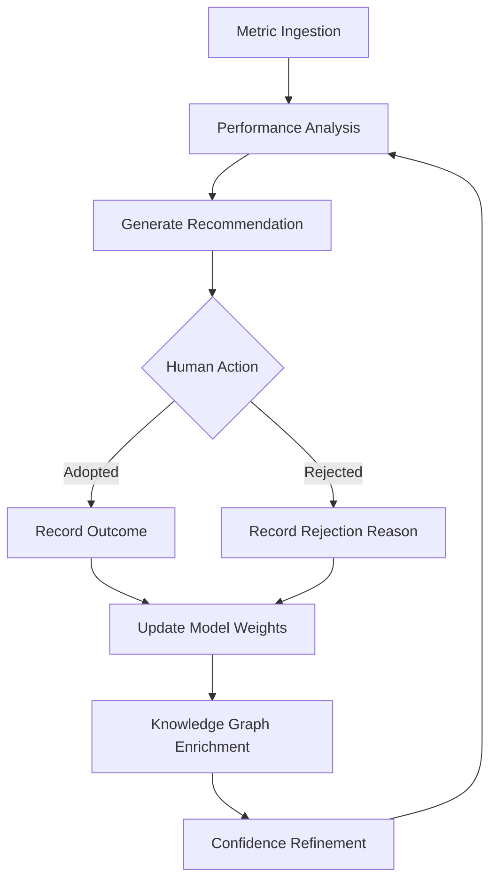
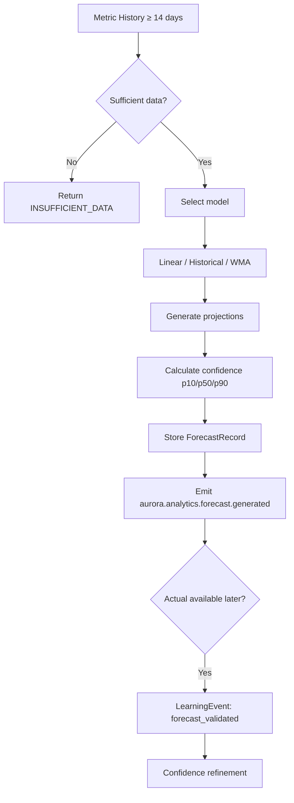

# ES-AURORA-012 — Aurora Analytics & Performance Intelligence Implementation Specification

**Document ID:** ES-AURORA-012  
**Program:** Project Aurora — AI Marketing Platform  
**Mission:** A-014 — Analytics & Performance Intelligence  
**Prior Missions:** A-007 (ES-AURORA-005) · A-008 (ES-AURORA-006) · A-009 (ES-AURORA-007) · A-010 (ES-AURORA-008) · A-011 (ES-AURORA-009) · A-012 (ES-AURORA-010) · A-013 (ES-AURORA-011)  
**Version:** 1.0  
**Status:** Ratified — Authoritative Engineering Specification  
**Classification:** Engineering Specification · Analytics · Performance Intelligence · Attribution · Executive Dashboards  
**Authority:** Founder & Chief Architect · Aurora Architecture Review Board  
**Architecture Source:** [A-001 Aurora Constitution](../A-001-Aurora-Constitution.md) · [A-002 Enterprise Engineering Blueprint](../A-002-Aurora-Enterprise-Engineering-Blueprint.md) · [A-003 AI Workforce Architecture](../A-003-Aurora-AI-Workforce-Architecture.md) · [A-004 Enterprise Knowledge & Memory](../A-004-Aurora-Enterprise-Knowledge-and-Memory-Architecture.md)  
**Platform Parent:** [ES-AURORA-005](./ES-AURORA-005-Platform-Foundation-Implementation-Specification.md) · [ES-AURORA-006](./ES-AURORA-006-Identity-Tenant-and-Configuration-Foundation.md) · [ES-AURORA-007](./ES-AURORA-007-Enterprise-Knowledge-Graph-and-Memory-Infrastructure.md) · [ES-AURORA-008](./ES-AURORA-008-AI-Workforce-Runtime-Implementation-Specification.md) · [ES-AURORA-009](./ES-AURORA-009-Content-Studio-and-Asset-Management-Implementation-Specification.md) · [ES-AURORA-010](./ES-AURORA-010-SEO-Intelligence-Engine-Implementation-Specification.md) · [ES-AURORA-011](./ES-AURORA-011-Campaign-Planning-and-Orchestration-Implementation-Specification.md)  
**Effective Date:** 7 August 2026  
**Subordinate To:** A-001 · A-002 · A-003 · A-004 · A-005 · ES-AURORA-005 · ES-AURORA-006 · ES-AURORA-007 · ES-AURORA-008 · ES-AURORA-009 · ES-AURORA-010 · ES-AURORA-011

**Rule:** This document is the **authoritative engineering specification** for Aurora Analytics & Performance Intelligence (Mission A-014). All code in `lib/aurora/analytics/` must comply. **No production implementation in this document.** **Specification only.**

**Scope:** Enterprise analytics platform · campaign performance · performance intelligence · attribution · executive dashboards · continuous learning · ORION integration. **Excludes:** Analytics UI pages (A-019) · connector implementations (A-016) · advanced autonomous optimization (A-032).

---

## Engineering Principles (Binding)

| # | Principle | Enforcement |
|---|-----------|-------------|
| **AN-1** | **Analytics are tenant isolated** | tenant_id · brand_id · RLS on all analytics data |
| **AN-2** | **Every KPI is reproducible** | Deterministic formulas · versioned metric definitions |
| **AN-3** | **Metrics are explainable** | Definition · source · calculation logged on every metric |
| **AN-4** | **Forecasts include confidence scores** | p10/p50/p90 · confidence field mandatory |
| **AN-5** | **Recommendations are evidence-based** | Rationale · evidence · citations on every insight |
| **AN-6** | **Dashboards update in near real time** | Cache TTL ≤ 60s for live widgets · event-driven invalidation |
| **AN-7** | **Knowledge Graph receives learning events** | Learning events on anomaly · forecast · campaign feedback |
| **AN-8** | **Executive dashboards are read-only** | No mutation endpoints on executive scorecards |
| **AN-9** | **Every analytics event is auditable** | Ingestion · calculation · export logged |
| **AN-10** | **Performance intelligence continuously improves** | Model evaluation · confidence refinement loops |

---

## Table of Contents

1. [Executive Overview](#1-executive-overview)
2. [Enterprise Analytics Platform](#2-enterprise-analytics-platform)
3. [Campaign Performance](#3-campaign-performance)
4. [Performance Intelligence](#4-performance-intelligence)
5. [Attribution Intelligence](#5-attribution-intelligence)
6. [Executive Dashboards](#6-executive-dashboards)
7. [Continuous Learning](#7-continuous-learning)
8. [ORION Integration](#8-orion-integration)
9. [Testing Strategy](#9-testing-strategy)
10. [Engineering Standards](#10-engineering-standards)
11. [Acceptance Criteria](#11-acceptance-criteria)
12. [Executive Recommendation](#12-executive-recommendation)

**Appendices:** [A — Analytics Taxonomy](#appendix-a--analytics-taxonomy) · [B — KPI Catalogue](#appendix-b--kpi-catalogue) · [C — Dashboard Catalogue](#appendix-c--dashboard-catalogue) · [D — Attribution Models](#appendix-d--attribution-models) · [E — Forecasting Workflow](#appendix-e--forecasting-workflow) · [F — Implementation Checklist](#appendix-f--implementation-checklist)

---

# Preamble

Data without context is noise. Context without action is waste.

Aurora's Analytics & Performance Intelligence layer transforms multi-channel marketing signals into **reproducible KPIs, explainable forecasts, evidence-based recommendations, and executive-grade visibility** — with every metric traceable, every insight auditable, and every learning event enriching the Knowledge Graph.

Measure with precision. Decide with confidence. Improve continuously.

---

# 1. Executive Overview

## 1.1 Purpose

| Field | Definition |
|-------|------------|
| **Document purpose** | Implementation specification for Analytics & Performance Intelligence |
| **Audience** | Analytics engineers · data engineers · backend engineers · AI architects · executive stakeholders |
| **Binding authority** | Mission A-014 · all `lib/aurora/analytics/` code |
| **Deliverable type** | Engineering specification — no code |

## 1.2 Scope

### In Scope (A-014)

| Area | Coverage |
|------|----------|
| **Analytics platform** | AnalyticsEngine · workspace · repository · metric registry · dashboard engine |
| **Campaign performance** | KPI tracking · reach · engagement · conversions · revenue · ROI · channel comparison |
| **Performance intelligence** | Trends · forecasting · anomalies · root cause · recommendations |
| **Attribution** | 6 models · customer journey · funnel analytics |
| **Executive dashboards** | Marketing · campaign · SEO · content · financial · custom · real-time monitoring |
| **Continuous learning** | Campaign feedback · knowledge updates · workforce feedback · optimization loops |
| **Marketing Health Score** | 6-dimension composite (0–100) · daily snapshot · ORION Executive Brief |
| **ORION integration** | Knowledge · campaign · content · SEO · identity · events · executive provider |

### Out of Scope

| Exclusion | Mission |
|-----------|---------|
| Analytics UI pages | A-019 |
| GA4/GSC/Meta connector implementations | A-016 |
| Publish-side event ingestion | A-015 |
| Advanced autonomous optimization | A-032 |
| CRM/Finance attribution bridge | A-033 |

### Phase Delivery

| Phase | Capability |
|-------|------------|
| **A-014 Phase 1** | Ingestion · KPI registry · campaign reports · Marketing Health Score · executive dashboards |
| **A-014 Phase 1 complete** | Attribution · forecasting · anomaly detection · performance intelligence |
| **Phase 2 (A-032)** | Advanced predictive · autonomous optimization tiers · custom ML models |

## 1.3 Objectives

| # | Objective | Success Criteria |
|---|-----------|-----------------|
| 1 | **Multi-source metric ingestion** | AnalyticsIngestionService operational |
| 2 | **Reproducible KPI catalogue** | MetricRegistry with versioned definitions |
| 3 | **Campaign performance tracking** | Goal actuals synced from ES-AURORA-011 |
| 4 | **Marketing Health Score** | 6 dimensions · daily calculation · 0–100 score |
| 5 | **Executive dashboards** | Read-only scorecards · near real-time refresh |
| 6 | **Attribution modeling** | 6 models · journey analytics |
| 7 | **Performance intelligence** | Forecasting · anomalies · recommendations |
| 8 | **Continuous learning** | Learning events → Knowledge Graph |
| 9 | **ORION Executive Provider** | `aurora.analytics.snapshot` daily |
| 10 | **Tenant isolation** | Zero cross-tenant metric leakage |

## 1.4 Relationship with Architecture Documents

| Document | ES-AURORA-012 Response |
|----------|------------------------|
| **A-001 Aurora Constitution** | Analytics Engine mandate · Marketing Health Score · executive visibility |
| **A-002 Enterprise Blueprint** | `lib/aurora/analytics/` · MetricSnapshot · Report · HealthScore entities |
| **A-003 AI Workforce Architecture** | Analytics Manager agent · Tier 0 informational · anomaly escalation |
| **A-004 Knowledge Architecture** | PerformanceRecord · CampaignLesson feedback · learning memory |
| **A-005 Module Runtime Spec** | AnalyticsModuleRuntime · scheduled ingestion · health score jobs |
| **A-006 Mission Backlog** | Mission A-014 · EP-ANALYTICS · F-140–F-149 · F-170–F-173 |
| **A-007 Platform Foundation** | ES-AURORA-005 · PlatformStore · Event Bus · connector infrastructure |
| **A-008 Identity & Tenant** | ES-AURORA-006 · `aurora.analytics.read` · `aurora.analytics.export` |
| **A-009 Knowledge Graph** | ES-AURORA-007 · learning event ingestion · performance records |
| **A-010 AI Workforce Runtime** | ES-AURORA-008 · Analytics Manager task routing · report generation |
| **A-011 Content Studio** | ES-AURORA-009 · content performance metrics · engagement KPIs |
| **A-012 SEO Intelligence** | ES-AURORA-010 · organic traffic · visibility score · GSC metrics |
| **A-013 Campaign Planning** | ES-AURORA-011 · campaign KPI snapshots · budget pacing · completion events |

### Dependency Chain

```
ES-AURORA-005 (Platform)
    └── ES-AURORA-006 (Identity)
        └── ES-AURORA-007 (Knowledge)
            └── ES-AURORA-008 (Workforce)
                └── ES-AURORA-009 (Content) + ES-AURORA-010 (SEO)
                    └── ES-AURORA-011 (Campaign)
                        └── ES-AURORA-012 (Analytics) ← this document
                            └── ES-AURORA-013 (Publish Pipeline) ← authorized next
```

---

# 2. Enterprise Analytics Platform

## 2.1 AnalyticsModuleRuntime

**File:** `lib/aurora/analytics/AnalyticsModuleRuntime.ts`

```typescript
export class AnalyticsModuleRuntime implements AuroraModuleRuntime {
  readonly moduleKey = 'analytics';
  readonly displayName = 'Analytics & Performance Intelligence';
  readonly phase = 1 as const;
  readonly tier = 2;
  readonly dependencies = ['admin', 'knowledge', 'workforce', 'content', 'seo', 'campaign'] as const;
}
```

## 2.2 AnalyticsWorkspace

**File:** `lib/aurora/analytics/workspace/AnalyticsWorkspace.ts`

```typescript
export interface AnalyticsWorkspace {
  getSnapshot(ctx: AuroraRuntimeContext): Promise<AnalyticsWorkspaceSnapshot>;
  getMarketingHealthScore(ctx: AuroraRuntimeContext): Promise<MarketingHealthScore>;
  getRecentAnomalies(ctx: AuroraRuntimeContext, limit?: number): Promise<readonly AnomalyAlert[]>;
  getDataFreshness(ctx: AuroraRuntimeContext): Promise<DataFreshnessReport>;
  getActiveCampaignsSummary(ctx: AuroraRuntimeContext): Promise<readonly CampaignPerformanceSummary[]>;
}
```

## 2.3 AnalyticsEngine

**File:** `lib/aurora/analytics/AnalyticsEngine.ts`

Central orchestrator for ingestion, calculation, reporting, and intelligence.

```typescript
export interface AnalyticsEngine {
  ingest(ctx: AuroraRuntimeContext, batch: MetricIngestionBatch): Promise<IngestionResult>;
  calculateKpi(ctx: AuroraRuntimeContext, kpiId: string, params: KpiCalculationParams): Promise<KpiValue>;
  generateReport(ctx: AuroraRuntimeContext, request: ReportRequest): Promise<AnalyticsReport>;
  runIntelligenceCycle(ctx: AuroraRuntimeContext): Promise<IntelligenceCycleResult>;
  getMetricHistory(ctx: AuroraRuntimeContext, metricId: string, range: DateRange): Promise<readonly MetricDataPoint[]>;
}
```

## 2.4 AnalyticsRepository

**File:** `lib/aurora/analytics/repositories/AnalyticsRepository.ts`

**Tables:**
- `aurora_metric_definition`
- `aurora_metric_snapshot`
- `aurora_kpi_value`
- `aurora_analytics_report`
- `aurora_marketing_health_score`
- `aurora_attribution_touchpoint`
- `aurora_attribution_result`
- `aurora_anomaly_alert`
- `aurora_forecast_record`
- `aurora_performance_recommendation`
- `aurora_learning_event`
- `aurora_dashboard_config`

## 2.5 MetricRegistry

**File:** `lib/aurora/analytics/metrics/MetricRegistry.ts`

**AN-2 · AN-3:** Versioned, reproducible metric definitions.

```typescript
export interface MetricRegistry {
  register(ctx: AuroraRuntimeContext, definition: MetricDefinition): Promise<MetricDefinition>;
  getDefinition(ctx: AuroraRuntimeContext, metricId: string): Promise<MetricDefinition | null>;
  listDefinitions(ctx: AuroraRuntimeContext, filter?: MetricFilter): Promise<readonly MetricDefinition[]>;
  calculate(ctx: AuroraRuntimeContext, metricId: string, params: MetricCalculationParams): Promise<MetricValue>;
  validateReproducibility(ctx: AuroraRuntimeContext, metricId: string): Promise<ReproducibilityReport>;
}

export interface MetricDefinition {
  readonly id: string;                    // mtr_{slug}
  readonly tenantId: string;
  readonly brandId?: string;
  readonly name: string;
  readonly category: MetricCategory;
  readonly formula: string;                 // Human-readable formula
  readonly formulaVersion: string;         // semver
  readonly unit: MetricUnit;
  readonly aggregation: AggregationType;
  readonly sources: readonly MetricSource[];
  readonly refreshInterval: RefreshInterval;
}
```

## 2.6 DashboardEngine

**File:** `lib/aurora/analytics/dashboards/DashboardEngine.ts`

```typescript
export interface DashboardEngine {
  getDashboard(ctx: AuroraRuntimeContext, dashboardId: string): Promise<DashboardSnapshot>;
  listDashboards(ctx: AuroraRuntimeContext): Promise<readonly DashboardSummary[]>;
  createCustomDashboard(ctx: AuroraRuntimeContext, config: CustomDashboardConfig): Promise<DashboardConfig>;
  refreshWidget(ctx: AuroraRuntimeContext, widgetId: string): Promise<WidgetData>;
  invalidateCache(ctx: AuroraRuntimeContext, dashboardId: string): Promise<void>;
}
```

**AN-6:** Widget cache TTL ≤ 60s. Event-driven invalidation on `aurora.metric.updated`.

## 2.7 ExecutiveScorecards

**File:** `lib/aurora/analytics/executive/ExecutiveScorecards.ts`

**AN-8:** Read-only executive views.

```typescript
export interface ExecutiveScorecards {
  getMarketingScorecard(ctx: AuroraRuntimeContext): Promise<MarketingScorecard>;
  getCampaignScorecard(ctx: AuroraRuntimeContext, campaignId?: string): Promise<CampaignScorecard>;
  getFinancialScorecard(ctx: AuroraRuntimeContext): Promise<FinancialScorecard>;
  getExecutiveBriefData(ctx: AuroraRuntimeContext): Promise<ExecutiveBriefAnalyticsPayload>;
}
```

## 2.8 AnalyticsIngestionService

**File:** `lib/aurora/analytics/ingestion/AnalyticsIngestionService.ts`

```typescript
export interface AnalyticsIngestionService {
  ingestBatch(ctx: AuroraRuntimeContext, batch: MetricIngestionBatch): Promise<IngestionResult>;
  ingestFromConnector(ctx: AuroraRuntimeContext, connectorId: string): Promise<IngestionResult>;
  ingestCampaignSnapshot(ctx: AuroraRuntimeContext, campaignId: string): Promise<IngestionResult>;
  ingestContentMetrics(ctx: AuroraRuntimeContext, contentId: string): Promise<IngestionResult>;
  ingestSeoMetrics(ctx: AuroraRuntimeContext): Promise<IngestionResult>;
  getIngestionStatus(ctx: AuroraRuntimeContext): Promise<IngestionStatusReport>;
}
```

## 2.9 Analytics APIs

| Method | Route | Permission |
|--------|-------|------------|
| `GET` | `/api/aurora/analytics/workspace` | `aurora.analytics.read` |
| `GET` | `/api/aurora/analytics/health-score` | `aurora.analytics.read` |
| `GET` | `/api/aurora/analytics/metrics` | `aurora.analytics.read` |
| `GET` | `/api/aurora/analytics/metrics/:id/history` | `aurora.analytics.read` |
| `GET` | `/api/aurora/analytics/campaigns/:id/performance` | `aurora.analytics.read` |
| `GET` | `/api/aurora/analytics/reports/:id` | `aurora.analytics.read` |
| `POST` | `/api/aurora/analytics/reports/generate` | `aurora.analytics.read` |
| `GET` | `/api/aurora/analytics/dashboards/:id` | `aurora.analytics.read` |
| `GET` | `/api/aurora/analytics/attribution/:model` | `aurora.analytics.read` |
| `GET` | `/api/aurora/analytics/forecasts/:metricId` | `aurora.analytics.read` |
| `GET` | `/api/aurora/analytics/anomalies` | `aurora.analytics.read` |
| `GET` | `/api/aurora/analytics/recommendations` | `aurora.analytics.read` |
| `GET` | `/api/aurora/analytics/executive/scorecard` | `aurora.analytics.read` |
| `POST` | `/api/aurora/analytics/export` | `aurora.analytics.export` |

---

# 3. Campaign Performance

## 3.1 CampaignPerformanceService

**File:** `lib/aurora/analytics/campaign/CampaignPerformanceService.ts`

Integrates with ES-AURORA-011 campaign goals and KPI snapshots.

```typescript
export interface CampaignPerformanceService {
  getPerformance(ctx: AuroraRuntimeContext, campaignId: string): Promise<CampaignPerformanceReport>;
  trackGoalProgress(ctx: AuroraRuntimeContext, campaignId: string): Promise<readonly GoalProgress[]>;
  compareChannels(ctx: AuroraRuntimeContext, campaignId: string): Promise<ChannelComparisonReport>;
  getCampaignHealth(ctx: AuroraRuntimeContext, campaignId: string): Promise<CampaignHealthScore>;
  syncFromCampaignModule(ctx: AuroraRuntimeContext, campaignId: string): Promise<void>;
}
```

## 3.2 Campaign KPIs

| KPI | Formula | Source | Unit |
|-----|---------|--------|------|
| **Reach** | Sum of unique impressions | Channel connectors · GA | count |
| **Engagement Rate** | (likes + comments + shares + clicks) / reach | Social · email | % |
| **Conversion Rate** | conversions / sessions | GA · landing pages | % |
| **Revenue** | Sum attributed revenue | E-commerce · CRM stub | currency |
| **ROI** | (revenue - spend) / spend × 100 | Budget + revenue | % |
| **ROAS** | revenue / ad spend | Ads connectors | ratio |
| **CPA** | spend / conversions | Budget + conversions | currency |
| **Cost per Lead** | spend / leads | Budget + leads | currency |

**AN-2:** All formulas versioned in MetricRegistry (`formulaVersion`).

## 3.3 Goal Tracking

Syncs with `aurora_campaign_goal` from ES-AURORA-011:

```typescript
export interface GoalProgress {
  readonly goalId: string;
  readonly metric: string;
  readonly target: number;
  readonly current: number;
  readonly attainment: number;            // current / target (0–1+)
  readonly trend: TrendDirection;
  readonly projectedEnd: number;
  readonly onTrack: boolean;
}
```

**Job:** `CampaignKpiSyncJob` — consumes `aurora.campaign.task.completed` and daily snapshots from campaign module.

## 3.4 Reach · Engagement · Conversions · Revenue

| Dimension | Metrics | Aggregation |
|-----------|---------|-------------|
| **Reach** | Impressions · unique visitors · email opens | Sum · deduplicated where possible |
| **Engagement** | CTR · time on page · social interactions | Rate · average |
| **Conversions** | Form submits · purchases · sign-ups | Count · rate |
| **Revenue** | Gross · net · attributed | Sum · by channel |

## 3.5 ROI & Cost Analysis

```typescript
export interface CostAnalysisReport {
  readonly campaignId: string;
  readonly totalSpend: Money;
  readonly spendByChannel: readonly ChannelSpend[];
  readonly revenue: Money;
  readonly roi: number;
  readonly roas: number;
  readonly cpa: number;
  readonly budgetUtilization: number;     // spent / allocated
  readonly pacingStatus: PacingStatus;
}
```

Budget data sourced from ES-AURORA-011 `BudgetService`. Spend from connector ingestion (A-016).

## 3.6 Channel Comparison

| Comparison | Metrics |
|------------|---------|
| Side-by-side | Reach · engagement · conversions · ROAS per channel |
| Efficiency ranking | ROAS · CPA · engagement rate |
| Budget efficiency | Spend vs. attainment per channel |
| Trend | 7-day · 30-day delta per channel |

## 3.7 Campaign Health Score

Per-campaign health (0–100) distinct from Marketing Health Score:

| Component | Weight |
|-----------|:------:|
| Goal attainment | 35% |
| Budget pacing | 20% |
| Channel performance | 20% |
| Timeline adherence | 15% |
| Content readiness | 10% |

Feeds campaign dashboard and ES-AURORA-011 optimization engine.

---

# 4. Performance Intelligence

## 4.1 PerformanceEngine

**File:** `lib/aurora/analytics/intelligence/PerformanceEngine.ts`

```typescript
export interface PerformanceEngine {
  analyzeTrends(ctx: AuroraRuntimeContext, params: TrendAnalysisParams): Promise<TrendAnalysisReport>;
  generateForecast(ctx: AuroraRuntimeContext, metricId: string, horizon: ForecastHorizon): Promise<ForecastRecord>;
  detectAnomalies(ctx: AuroraRuntimeContext, params?: AnomalyDetectionParams): Promise<readonly AnomalyAlert[]>;
  performRootCauseAnalysis(ctx: AuroraRuntimeContext, anomalyId: string): Promise<RootCauseAnalysis>;
  generateRecommendations(ctx: AuroraRuntimeContext): Promise<readonly PerformanceRecommendation[]>;
}
```

## 4.2 Trend Analysis

| Trend Type | Method | Output |
|------------|--------|--------|
| Linear | Least-squares regression | Slope · direction · significance |
| Seasonal | Week-over-week · year-over-year | Seasonality factor |
| Moving average | 7-day · 30-day MA | Smoothed trend line |
| Comparative | vs. benchmark · vs. prior campaign | Relative performance |

## 4.3 Forecasting

**AN-4:** Confidence scores mandatory.

```typescript
export interface ForecastRecord {
  readonly id: string;
  readonly metricId: string;
  readonly horizon: ForecastHorizon;
  readonly modelVersion: string;
  readonly projections: readonly ForecastPoint[];
  readonly confidence: ForecastConfidence;
  readonly generatedAt: string;
  readonly agentCodename?: string;
}

export interface ForecastConfidence {
  readonly overall: number;               // 0–1
  readonly p10: number;
  readonly p50: number;
  readonly p90: number;
  readonly sampleSize: number;
}
```

**Models (Phase 1):**
- Linear extrapolation (default)
- Historical campaign similarity (Campaign Knowledge from ES-AURORA-007)
- Weighted moving average

## 4.4 Predictive Analytics

| Prediction | Input | Output |
|------------|-------|--------|
| Campaign success probability | Current KPIs · elapsed time · historical | 0–1 probability |
| Budget exhaustion date | Pacing · remaining budget | Projected date |
| KPI attainment at end | Current trajectory | Projected value + confidence |
| Channel ROAS trajectory | 14-day trend | 30-day projection |

## 4.5 Anomaly Detection

| Method | Sensitivity | Use Case |
|--------|:-----------:|----------|
| Z-score (> 2.5σ) | Medium | Single metric spikes |
| IQR outlier | Medium | Distribution shifts |
| Rate-of-change | High | Sudden drops (> 30% day-over-day) |
| Composite health drop | Critical | Marketing Health Score > 15% drop |

```typescript
export interface AnomalyAlert {
  readonly id: string;
  readonly metricId: string;
  readonly severity: 'low' | 'medium' | 'high' | 'critical';
  readonly detectedAt: string;
  readonly expectedValue: number;
  readonly actualValue: number;
  readonly deviation: number;
  readonly status: 'open' | 'investigating' | 'resolved' | 'false_positive';
}
```

Escalation per A-003: Marketing Health Score drop > 15% → Executive Advisor · Marketing Director.

## 4.6 Root Cause Analysis

```typescript
export interface RootCauseAnalysis {
  readonly anomalyId: string;
  readonly primaryCause: RootCauseHypothesis;
  readonly contributingFactors: readonly RootCauseHypothesis[];
  readonly evidence: readonly EvidenceRecord[];
  readonly confidence: number;
  readonly recommendedActions: readonly string[];
  readonly agentCodename: string;
}
```

Analysis dimensions: channel breakdown · content performance · budget change · external events · data source failure.

## 4.7 Recommendation Engine

**AN-5:** Evidence-based recommendations.

```typescript
export interface PerformanceRecommendation {
  readonly id: string;
  readonly type: RecommendationType;
  readonly title: string;
  readonly rationale: string;
  readonly evidence: readonly EvidenceRecord[];
  readonly confidence: number;
  readonly estimatedImpact: number;
  readonly targetModule: 'campaign' | 'content' | 'seo' | 'budget';
  readonly requiresApproval: boolean;
  readonly agentCodename: string;
  readonly citations: readonly KnowledgeCitation[];
}
```

Recommendations routed to appropriate module (campaign optimization, content brief, SEO audit) — never auto-applied.

## 4.8 Confidence Scoring

| Level | Range | Action |
|-------|-------|--------|
| High | 0.80–1.00 | Present in dashboard · brief |
| Medium | 0.50–0.79 | Present with uncertainty flag |
| Low | 0.20–0.49 | Require Analytics Manager review |
| Insufficient | < 0.20 | Do not surface · log only |

---

# 5. Attribution Intelligence

## 5.1 AttributionEngine

**File:** `lib/aurora/analytics/attribution/AttributionEngine.ts`

```typescript
export interface AttributionEngine {
  recordTouchpoint(ctx: AuroraRuntimeContext, touchpoint: TouchpointInput): Promise<AttributionTouchpoint>;
  calculateAttribution(ctx: AuroraRuntimeContext, params: AttributionParams): Promise<AttributionResult>;
  getCustomerJourney(ctx: AuroraRuntimeContext, customerId: string): Promise<CustomerJourney>;
  getFunnelAnalytics(ctx: AuroraRuntimeContext, funnelId: string, range: DateRange): Promise<FunnelReport>;
  compareModels(ctx: AuroraRuntimeContext, conversionId: string): Promise<ModelComparisonReport>;
}
```

## 5.2 Attribution Models

| Model ID | Name | Description |
|----------|------|-------------|
| `first_touch` | First Touch | 100% credit to first interaction |
| `last_touch` | Last Touch | 100% credit to last interaction before conversion |
| `linear` | Linear | Equal credit across all touchpoints |
| `position_based` | Position Based | 40% first · 40% last · 20% middle |
| `time_decay` | Time Decay | Exponential decay · half-life 7 days default |
| `multi_touch` | Multi-Touch (Data-Driven) | Weighted by channel contribution patterns |

Default model configurable per brand in `BrandConfig.attributionModel`.

## 5.3 Touchpoint Entity

```typescript
export interface AttributionTouchpoint {
  readonly id: string;
  readonly tenantId: string;
  readonly brandId: string;
  readonly customerId: string;            // Anonymous ID until CRM link (A-033)
  readonly channelId: ChannelId;
  readonly campaignId?: string;
  readonly contentId?: string;
  readonly touchpointType: 'impression' | 'click' | 'engagement' | 'conversion';
  readonly timestamp: string;
  readonly metadata?: Record<string, unknown>;
}
```

## 5.4 Customer Journey

```typescript
export interface CustomerJourney {
  readonly customerId: string;
  readonly touchpoints: readonly AttributionTouchpoint[];
  readonly conversions: readonly ConversionEvent[];
  readonly journeyDuration: number;       // days
  readonly touchpointCount: number;
  readonly primaryChannel: ChannelId;
}
```

## 5.5 Funnel Analytics

| Funnel Stage | Default Events |
|--------------|---------------|
| Awareness | Impression · page view |
| Interest | Click · time on page > 30s |
| Consideration | Form start · content download |
| Intent | Add to cart · demo request |
| Conversion | Purchase · sign-up · lead submit |

```typescript
export interface FunnelReport {
  readonly funnelId: string;
  readonly stages: readonly FunnelStageMetrics[];
  readonly overallConversionRate: number;
  readonly dropOffPoints: readonly FunnelDropOff[];
  readonly attributionByModel: Record<AttributionModelId, readonly ChannelAttribution[]>;
}
```

## 5.6 Attribution Result

```typescript
export interface AttributionResult {
  readonly conversionId: string;
  readonly model: AttributionModelId;
  readonly channelCredits: readonly ChannelCredit[];
  readonly campaignCredits: readonly CampaignCredit[];
  readonly totalRevenue: Money;
  readonly calculatedAt: string;
}
```

---

# 6. Executive Dashboards

## 6.1 Executive Workspace

**File:** `lib/aurora/analytics/executive/ExecutiveWorkspace.ts`

**AN-8:** Read-only. No mutation endpoints.

```typescript
export interface ExecutiveWorkspace {
  getOverview(ctx: AuroraRuntimeContext): Promise<ExecutiveOverview>;
  getMarketingHealthTrend(ctx: AuroraRuntimeContext, range: DateRange): Promise<readonly HealthScoreDataPoint[]>;
  getTopCampaigns(ctx: AuroraRuntimeContext, limit?: number): Promise<readonly CampaignPerformanceSummary[]>;
  getAlertsSummary(ctx: AuroraRuntimeContext): Promise<AlertsSummary>;
}
```

## 6.2 Marketing Dashboard

| Widget | Data Source | Refresh |
|--------|-------------|---------|
| Marketing Health Score | MarketingHealthService | 60s |
| Health dimension breakdown | 6 dimensions | 60s |
| Channel performance summary | CampaignPerformanceService | 5 min |
| Top content by engagement | Content metrics | 5 min |
| SEO visibility trend | ES-AURORA-010 | 1 hour |
| Budget utilization | ES-AURORA-011 | 15 min |
| Anomaly alerts | PerformanceEngine | Real-time |

## 6.3 Campaign Dashboard

| Widget | Scope |
|--------|-------|
| Active campaigns | Status · health · pacing |
| Goal attainment | Per-campaign progress bars |
| Channel comparison | Side-by-side ROAS · CPA |
| Timeline | Milestones · overdue alerts |
| Forecast | End-of-campaign KPI projection |

## 6.4 SEO Dashboard

| Widget | Source |
|--------|--------|
| Visibility score | ES-AURORA-010 |
| Keyword rank trends | RankTrackingService |
| Organic traffic | GSC · GA ingestion |
| Technical issues | SeoAuditService |
| Content SEO scores | ContentSeoService |

## 6.5 Content Dashboard

| Widget | Source |
|--------|--------|
| Top performing content | Page views · engagement · conversions |
| Content by type | Blog · landing · social |
| Approval pipeline | Content status counts |
| SEO score distribution | ContentSeoScore aggregate |

## 6.6 Financial Dashboard

| Widget | Metrics |
|--------|---------|
| Total marketing spend | Budget allocations · actual spend |
| Revenue attributed | Attribution engine |
| ROAS by channel | Ads + organic |
| CPA trend | 30-day rolling |
| Budget forecast | Projected spend vs. budget |

## 6.7 Custom Dashboards

```typescript
export interface CustomDashboardConfig {
  readonly name: string;
  readonly widgets: readonly WidgetConfig[];
  readonly refreshPolicy: RefreshPolicy;
  readonly sharedWith?: readonly string[];  // Role IDs
}

export interface WidgetConfig {
  readonly type: WidgetType;
  readonly metricIds?: readonly string[];
  readonly campaignId?: string;
  readonly dateRange: DateRangePreset;
  readonly visualization: 'line' | 'bar' | 'pie' | 'table' | 'score' | 'gauge';
}
```

Tier limits: Starter 1 custom · Professional 5 · Enterprise unlimited.

## 6.9 AnalyticsReportService

**File:** `lib/aurora/analytics/reports/AnalyticsReportService.ts`

```typescript
export interface AnalyticsReportService {
  generate(ctx: AuroraRuntimeContext, request: ReportRequest): Promise<AnalyticsReport>;
  scheduleReport(ctx: AuroraRuntimeContext, schedule: ReportSchedule): Promise<ScheduledReport>;
  exportReport(ctx: AuroraRuntimeContext, reportId: string, format: ExportFormat): Promise<ExportResult>;
  listReports(ctx: AuroraRuntimeContext, filter: ReportFilter): Promise<PaginatedResult<AnalyticsReport>>;
}
```

| Report Type | Frequency | Audience |
|-------------|-----------|----------|
| `campaign_performance` | On-demand · weekly | Campaign Manager |
| `marketing_summary` | Weekly | Marketing Director |
| `executive_brief` | Weekly | CMO · Executive Advisor |
| `channel_comparison` | Monthly | Analytics team |
| `attribution_summary` | Monthly | Finance · CMO |
| `seo_performance` | Weekly | SEO Specialist |
| `budget_utilization` | Weekly | Finance |

## 6.10 Real-time Monitoring

| Component | Mechanism |
|-----------|-----------|
| Live metric stream | WebSocket `/api/aurora/analytics/stream` (A-019 UI) |
| Event-driven refresh | `aurora.metric.updated` invalidates cache |
| Anomaly push | `aurora.analytics.anomaly.detected` → notification |
| Health score update | Daily job + on-demand after major ingestion |

**AN-6:** Near real-time = cache TTL ≤ 60s + event invalidation within 5s.

## 6.11 Marketing Health Score

**File:** `lib/aurora/analytics/health/MarketingHealthService.ts`

Composite 0–100 score across 6 dimensions:

| Dimension | Weight | Source |
|-----------|:------:|--------|
| Campaign Performance | 25% | ES-AURORA-011 goal attainment · ROAS |
| SEO Visibility | 15% | ES-AURORA-010 visibility score · organic traffic |
| Content Engagement | 15% | ES-AURORA-009 content metrics |
| Social Performance | 15% | Social channel engagement · reach |
| Budget Efficiency | 15% | Spend vs. ROI · pacing |
| Brand & CX Health | 15% | Brand compliance · CX signals (Phase 2) |

```typescript
export interface MarketingHealthScore {
  readonly id: string;
  readonly tenantId: string;
  readonly brandId: string;
  readonly overall: number;                 // 0–100
  readonly dimensions: readonly HealthDimensionScore[];
  readonly trend: TrendDirection;
  readonly previousScore?: number;
  readonly calculatedAt: string;
  readonly modelVersion: string;
}
```

**Job:** `MarketingHealthScoreJob` — daily at 06:00 brand timezone · publishes `aurora.analytics.snapshot`.

## 6.12 Scheduled Jobs

| Job | Schedule | Responsibility |
|-----|----------|---------------|
| `DailyIngestionJob` | Daily 02:00 UTC | Connector + internal metric ingestion |
| `MarketingHealthScoreJob` | Daily 06:00 brand TZ | 6-dimension score · snapshot event |
| `CampaignKpiSyncJob` | Every 4 hours | Sync campaign goal actuals |
| `AnomalyDetectionJob` | Every 6 hours | Scan metrics · create alerts |
| `AnalyticsModelEvaluationJob` | Weekly Sunday | Model accuracy · confidence refinement |
| `ReportDeliveryJob` | Per schedule | Scheduled report generation · export |

---

# 7. Continuous Learning

## 7.1 LearningEventService

**File:** `lib/aurora/analytics/learning/LearningEventService.ts`

**AN-7 · AN-10:** Knowledge Graph enrichment and model refinement.

```typescript
export interface LearningEventService {
  recordEvent(ctx: AuroraRuntimeContext, event: LearningEventInput): Promise<LearningEvent>;
  processFeedbackLoop(ctx: AuroraRuntimeContext): Promise<FeedbackLoopResult>;
  evaluateModels(ctx: AuroraRuntimeContext): Promise<ModelEvaluationReport>;
  refineConfidence(ctx: AuroraRuntimeContext, modelId: string): Promise<ConfidenceRefinementResult>;
}
```

## 7.2 Campaign Feedback

| Trigger | Learning Action |
|---------|----------------|
| Campaign completed | Ingest ES-AURORA-011 completion payload |
| Optimization applied | Record outcome vs. prediction |
| Goal missed | CampaignLesson with root cause |
| Goal exceeded | Success pattern → Campaign Knowledge |

## 7.3 Knowledge Graph Updates

| Event | Knowledge Entity |
|-------|-----------------|
| `aurora.analytics.anomaly.resolved` | PerformanceRecord |
| `aurora.analytics.forecast.validated` | ForecastAccuracyRecord |
| `aurora.analytics.recommendation.outcome` | RecommendationOutcomeRecord |
| `aurora.analytics.snapshot` | MarketingHealthHistory |

Published via `KnowledgeAcquisitionService.ingestAnalyticsLearning`.

## 7.4 AI Workforce Feedback

Analytics Manager receives:
- Forecast accuracy reports
- Anomaly false-positive rates
- Recommendation adoption rates

Workforce prompt refinement via ES-AURORA-008 `PromptRegistry` — governed by learning governance rules.

## 7.5 Learning Events

```typescript
export interface LearningEvent {
  readonly id: string;
  readonly type: LearningEventType;
  readonly sourceModule: string;
  readonly payload: Record<string, unknown>;
  readonly confidenceImpact?: number;
  readonly processedAt?: string;
  readonly knowledgeEntityId?: string;
}
```

| Event Type | Description |
|------------|-------------|
| `forecast_validated` | Actual vs. predicted comparison |
| `anomaly_confirmed` | True positive anomaly |
| `anomaly_dismissed` | False positive |
| `recommendation_adopted` | Human applied recommendation |
| `recommendation_rejected` | Human rejected with reason |
| `campaign_outcome` | Campaign completion feedback |

## 7.6 Optimization Loops



## 7.7 Confidence Refinement

| Signal | Adjustment |
|--------|------------|
| Forecast within p10–p90 | +confidence for model |
| Forecast outside p90 | -confidence · trigger model review |
| Recommendation adopted + positive outcome | +confidence for recommendation type |
| Recommendation rejected 3+ times | -confidence · suppress type |

## 7.8 Model Evaluation

**Job:** `AnalyticsModelEvaluationJob` — weekly

| Model | Metric | Target |
|-------|--------|:------:|
| Forecast (linear) | MAPE | < 20% |
| Anomaly detection | Precision | > 80% |
| Health score | Correlation with outcomes | > 90% |
| Attribution | Validated conversion match | > 85% |

## 7.9 Learning Governance

| Rule | Enforcement |
|------|-------------|
| No auto-modification of production models | Human review for model version bump |
| Learning events tenant-scoped | RLS · no cross-tenant training |
| PII exclusion | No customer PII in learning payloads |
| Audit trail | Every model version change logged |
| Rollback | Previous model version restorable |

---

# 8. ORION Integration

## 8.1 Knowledge Graph

| Direction | Integration |
|-----------|-------------|
| Analytics → Knowledge | Learning events · performance records · health history |
| Knowledge → Analytics | Campaign Knowledge for forecasting · historical benchmarks |
| Pre-flight | KnowledgeRetrievalService before AI-generated insights |

## 8.2 Campaign Runtime

| Event (from ES-AURORA-011) | Analytics Action |
|---------------------------|-----------------|
| `aurora.campaign.launched` | Initialize campaign performance tracking |
| `aurora.campaign.completed` | Final report · learning event · health dimension update |
| `aurora.budget.threshold.exceeded` | Cost anomaly · financial dashboard alert |
| `aurora.campaign.optimization.applied` | Track recommendation outcome |
| Campaign KPI snapshot | Sync goal.current values |

## 8.3 Content Studio

| Metric | Source |
|--------|--------|
| Page views · time on page | GA ingestion |
| Content engagement | Social · email metrics |
| Conversion attribution | Touchpoint linking via contentId |
| Content performance rank | ContentPerformanceService |

## 8.4 SEO Intelligence

| Metric | Source |
|--------|--------|
| Organic traffic | GSC · GA |
| Visibility score | ES-AURORA-010 |
| Keyword rankings | RankTrackingService |
| SEO dimension of Health Score | 15% weight |

## 8.5 Identity & RBAC

| Permission | Scope |
|------------|-------|
| `aurora.analytics.read` | View all analytics · dashboards · reports |
| `aurora.analytics.export` | PDF · CSV export |
| `aurora.analytics.admin` | Custom dashboards · model config (Enterprise) |

Executive scorecards: `aurora.analytics.read` minimum · CMO/Director roles default.

## 8.6 PlatformStore

**Migration:** `migrations/aurora/012_analytics.sql`

```sql
CREATE TABLE aurora_metric_definition (
  id TEXT PRIMARY KEY,
  tenant_id UUID NOT NULL,
  brand_id UUID,
  name TEXT NOT NULL,
  category TEXT NOT NULL,
  formula TEXT NOT NULL,
  formula_version TEXT NOT NULL,
  unit TEXT NOT NULL,
  aggregation TEXT NOT NULL,
  sources JSONB NOT NULL,
  refresh_interval TEXT NOT NULL,
  created_at TIMESTAMPTZ NOT NULL DEFAULT now()
);

CREATE TABLE aurora_metric_snapshot (
  id UUID PRIMARY KEY DEFAULT gen_random_uuid(),
  tenant_id UUID NOT NULL,
  brand_id UUID NOT NULL,
  metric_id TEXT NOT NULL,
  value NUMERIC NOT NULL,
  dimensions JSONB,
  recorded_at TIMESTAMPTZ NOT NULL,
  source TEXT NOT NULL,
  ingestion_batch_id UUID
);

CREATE TABLE aurora_marketing_health_score (
  id UUID PRIMARY KEY DEFAULT gen_random_uuid(),
  tenant_id UUID NOT NULL,
  brand_id UUID NOT NULL,
  overall NUMERIC(5,2) NOT NULL,
  dimensions JSONB NOT NULL,
  model_version TEXT NOT NULL,
  calculated_at TIMESTAMPTZ NOT NULL DEFAULT now()
);

CREATE TABLE aurora_attribution_touchpoint (
  id UUID PRIMARY KEY DEFAULT gen_random_uuid(),
  tenant_id UUID NOT NULL,
  brand_id UUID NOT NULL,
  customer_id TEXT NOT NULL,
  channel_id TEXT NOT NULL,
  campaign_id UUID,
  content_id UUID,
  touchpoint_type TEXT NOT NULL,
  occurred_at TIMESTAMPTZ NOT NULL,
  metadata JSONB
);

CREATE TABLE aurora_anomaly_alert (
  id UUID PRIMARY KEY DEFAULT gen_random_uuid(),
  tenant_id UUID NOT NULL,
  brand_id UUID NOT NULL,
  metric_id TEXT NOT NULL,
  severity TEXT NOT NULL,
  expected_value NUMERIC,
  actual_value NUMERIC NOT NULL,
  deviation NUMERIC,
  status TEXT NOT NULL DEFAULT 'open',
  detected_at TIMESTAMPTZ NOT NULL DEFAULT now()
);

CREATE TABLE aurora_forecast_record (
  id UUID PRIMARY KEY DEFAULT gen_random_uuid(),
  tenant_id UUID NOT NULL,
  brand_id UUID NOT NULL,
  metric_id TEXT NOT NULL,
  horizon TEXT NOT NULL,
  projections JSONB NOT NULL,
  confidence JSONB NOT NULL,
  model_version TEXT NOT NULL,
  generated_at TIMESTAMPTZ NOT NULL DEFAULT now()
);

CREATE TABLE aurora_learning_event (
  id UUID PRIMARY KEY DEFAULT gen_random_uuid(),
  tenant_id UUID NOT NULL,
  event_type TEXT NOT NULL,
  source_module TEXT NOT NULL,
  payload JSONB NOT NULL,
  processed_at TIMESTAMPTZ,
  knowledge_entity_id UUID
);

CREATE INDEX idx_metric_snapshot_tenant ON aurora_metric_snapshot(tenant_id, brand_id, recorded_at);
CREATE INDEX idx_health_score_tenant ON aurora_marketing_health_score(tenant_id, brand_id, calculated_at);
CREATE INDEX idx_touchpoint_customer ON aurora_attribution_touchpoint(tenant_id, customer_id, occurred_at);
```

**RLS:** All tables tenant-scoped per ES-AURORA-006 pattern.

## 8.7 Analytics Bus

Internal event stream for metric propagation (distinct from ORION Event Bus):

| Topic | Payload |
|-------|---------|
| `analytics.metric.ingested` | metricId · value · batchId |
| `analytics.kpi.calculated` | kpiId · value · campaignId? |
| `analytics.health.updated` | score · dimensions |
| `analytics.anomaly.detected` | anomalyId · severity |
| `analytics.forecast.generated` | forecastId · metricId |

Subscribers: DashboardEngine (cache invalidation) · PerformanceEngine · LearningEventService.

## 8.8 Executive Provider

**File:** `lib/aurora/analytics/executive/AuroraExecutiveProvider.ts`

Contributes to ORION Executive Brief:

```typescript
export interface ExecutiveBriefAnalyticsPayload {
  readonly marketingHealthScore: number;
  readonly healthTrend: TrendDirection;
  readonly topAlerts: readonly AnomalyAlert[];
  readonly campaignHighlights: readonly CampaignPerformanceSummary[];
  readonly budgetSummary: BudgetUtilizationSummary;
  readonly aiInsights: readonly PerformanceRecommendation[];
  readonly generatedAt: string;
}
```

Published daily via `aurora.analytics.snapshot` event.

## 8.9 Event Bus

| Event | Payload |
|-------|---------|
| `aurora.analytics.snapshot` | healthScore · dimensions · trend |
| `aurora.analytics.report.generated` | reportId · type |
| `aurora.analytics.anomaly.detected` | anomalyId · metricId · severity |
| `aurora.analytics.anomaly.resolved` | anomalyId · resolution |
| `aurora.analytics.forecast.generated` | forecastId · metricId |
| `aurora.analytics.recommendation.created` | recommendationId · type |
| `aurora.analytics.learning.processed` | eventId · knowledgeEntityId |
| `aurora.analytics.ingestion.completed` | batchId · recordCount · source |

All events: `tenantId` · `brandId` · `correlationId` · `timestamp`.

## 8.10 AnalyticsFacadeOperations

```typescript
export interface AnalyticsOperations {
  getWorkspace(ctx: AuroraRuntimeContext): Promise<AnalyticsWorkspaceSnapshot>;
  getMarketingHealthScore(ctx: AuroraRuntimeContext): Promise<MarketingHealthScore>;
  getCampaignPerformance(ctx: AuroraRuntimeContext, campaignId: string): Promise<CampaignPerformanceReport>;
  generateReport(ctx: AuroraRuntimeContext, request: ReportRequest): Promise<AnalyticsReport>;
  getDashboard(ctx: AuroraRuntimeContext, dashboardId: string): Promise<DashboardSnapshot>;
  getAttribution(ctx: AuroraRuntimeContext, params: AttributionParams): Promise<AttributionResult>;
  getForecast(ctx: AuroraRuntimeContext, metricId: string, horizon: ForecastHorizon): Promise<ForecastRecord>;
  getAnomalies(ctx: AuroraRuntimeContext): Promise<readonly AnomalyAlert[]>;
  getRecommendations(ctx: AuroraRuntimeContext): Promise<readonly PerformanceRecommendation[]>;
  getExecutiveBriefData(ctx: AuroraRuntimeContext): Promise<ExecutiveBriefAnalyticsPayload>;
  exportReport(ctx: AuroraRuntimeContext, reportId: string, format: 'pdf' | 'csv'): Promise<ExportResult>;
}
```

---

# 9. Testing Strategy

## 9.1 Test Structure

```
tests/aurora/
├── unit/analytics/
│   ├── MetricRegistry.test.ts
│   ├── MarketingHealthService.test.ts
│   ├── CampaignPerformanceService.test.ts
│   ├── AttributionEngine.test.ts
│   ├── PerformanceEngine.test.ts
│   └── ForecastModel.test.ts
├── integration/analytics/
│   ├── ingestionPipeline.test.ts
│   ├── healthScoreCalculation.test.ts
│   ├── dashboardRendering.test.ts
│   ├── attributionModels.test.ts
│   ├── anomalyDetection.test.ts
│   ├── learningLoop.test.ts
│   └── executiveProvider.test.ts
└── integration/security/
    └── analyticsTenantIsolation.test.ts
```

## 9.2 Coverage Targets

| Layer | Minimum |
|-------|:-------:|
| `lib/aurora/analytics/metrics/` | 90% |
| `lib/aurora/analytics/intelligence/` | 85% |
| `lib/aurora/analytics/attribution/` | 85% |
| `lib/aurora/analytics/health/` | 90% |
| **A-014 overall** | **85%** |

## 9.3 Required Tests

| Suite | Minimum |
|-------|:-------:|
| Metric registry · KPI calculation | 25+ |
| Ingestion pipeline | 20+ |
| Marketing Health Score | 20+ |
| Campaign performance | 20+ |
| Dashboard rendering | 15+ |
| Attribution models (6) | 18+ |
| Forecasting | 15+ |
| Anomaly detection | 15+ |
| Learning loop | 12+ |
| Security/isolation | 15+ |
| **Total** | **175+** |

## 9.4 Analytics Validation Scenarios

| ID | Scenario | Expected |
|----|----------|----------|
| AV-01 | Ingest batch of 1000 metrics | All stored · deduplicated |
| AV-02 | KPI reproducibility check | Same input → same output |
| AV-03 | Health score 6 dimensions sum to overall | Weighted average correct |
| AV-04 | Cross-tenant metric read | 404 · no leak |
| AV-05 | Executive scorecard mutation attempt | 405 Method Not Allowed |

## 9.5 KPI Accuracy Scenarios

| ID | Scenario | Expected |
|----|----------|----------|
| KPI-01 | ROI calculation | (revenue - spend) / spend × 100 |
| KPI-02 | ROAS with zero spend | Error · not infinity |
| KPI-03 | Engagement rate | Correct formula · capped at 100% |
| KPI-04 | Goal attainment sync | Matches campaign module snapshot |

## 9.6 Performance Benchmarks

| Operation | Target (p95) |
|-----------|:------------:|
| Health score calculation | < 2s |
| Dashboard snapshot (10 widgets) | < 500ms |
| Attribution (100 touchpoints) | < 1s |
| Forecast generation | < 3s |
| Report generation (PDF) | < 10s |

---

# 10. Engineering Standards

## 10.1 Folder Layout

```
lib/aurora/analytics/
├── AnalyticsModuleRuntime.ts
├── AnalyticsEngine.ts
├── workspace/
│   └── AnalyticsWorkspace.ts
├── ingestion/
│   └── AnalyticsIngestionService.ts
├── metrics/
│   ├── MetricRegistry.ts
│   └── KpiCalculationService.ts
├── campaign/
│   └── CampaignPerformanceService.ts
├── intelligence/
│   └── PerformanceEngine.ts
├── attribution/
│   └── AttributionEngine.ts
├── health/
│   └── MarketingHealthService.ts
├── dashboards/
│   └── DashboardEngine.ts
├── executive/
│   ├── ExecutiveScorecards.ts
│   ├── ExecutiveWorkspace.ts
│   └── AuroraExecutiveProvider.ts
├── learning/
│   └── LearningEventService.ts
├── reports/
│   └── AnalyticsReportService.ts
├── repositories/
├── jobs/
│   ├── DailyIngestionJob.ts
│   ├── MarketingHealthScoreJob.ts
│   ├── AnomalyDetectionJob.ts
│   ├── CampaignKpiSyncJob.ts
│   └── AnalyticsModelEvaluationJob.ts
└── facade/
    └── AnalyticsFacadeOperations.ts
```

## 10.2 Service Contracts

All analytics services implement:

```typescript
export interface AuroraAnalyticsService {
  readonly serviceName: string;
  execute<T>(ctx: AuroraRuntimeContext, operation: () => Promise<T>): Promise<T>;
}
```

**Contract rules:**
- `AuroraRuntimeContext` first argument on all public methods
- Tenant/brand from context — never from payload
- All calculations log metric definition version
- All mutations emit audit events

## 10.3 Metric Contracts

```typescript
export interface MetricValue {
  readonly metricId: string;
  readonly value: number;
  readonly unit: MetricUnit;
  readonly formulaVersion: string;
  readonly calculatedAt: string;
  readonly sources: readonly MetricSourceReference[];
  readonly explainability: MetricExplainability;
}

export interface MetricExplainability {
  readonly formula: string;
  readonly inputs: readonly MetricInput[];
  readonly notes?: string;
}
```

**AN-3:** Every returned metric includes explainability block.

## 10.4 Error Codes

| Code | Name | HTTP |
|------|------|:----:|
| `AURORA_ANL_001` | METRIC_NOT_FOUND | 404 |
| `AURORA_ANL_002` | INSUFFICIENT_DATA | 422 |
| `AURORA_ANL_003` | INGESTION_FAILED | 502 |
| `AURORA_ANL_004` | FORECAST_FAILED | 500 |
| `AURORA_ANL_005` | ATTRIBUTION_INVALID | 422 |
| `AURORA_ANL_006` | DASHBOARD_NOT_FOUND | 404 |
| `AURORA_ANL_007` | EXPORT_FAILED | 500 |
| `AURORA_ANL_008` | EXECUTIVE_READ_ONLY | 405 |

## 10.5 Caching

| Cache | Key | TTL |
|-------|-----|-----|
| Health score | `aurora:anl:health:{tenant}:{brand}` | 60s |
| Dashboard snapshot | `aurora:anl:dash:{tenant}:{id}` | 60s |
| Metric history (7d) | `aurora:anl:mtr:{tenant}:{id}:7d` | 300s |
| KPI value | `aurora:anl:kpi:{tenant}:{id}` | 60s |
| Forecast | `aurora:anl:fcst:{tenant}:{id}:{horizon}` | 3600s |

Invalidation: `aurora.metric.updated` · `aurora.analytics.ingestion.completed`.

## 10.7 Permission Matrix

| Permission | admin | director | manager | analyst | viewer |
|------------|:-----:|:--------:|:-------:|:-------:|:------:|
| `aurora.analytics.read` | ✅ | ✅ | ✅ | ✅ | ✅ |
| `aurora.analytics.export` | ✅ | ✅ | ✅ | ✅ | — |
| `aurora.analytics.admin` | ✅ | ✅ | — | — | — |
| Custom dashboards | ✅ | ✅ | ✅ | ✅ | — |
| Executive scorecard | ✅ | ✅ | ✅ | — | — |

## 10.8 Implementation Roadmap

| Sprint | Focus | Deliverables |
|:------:|-------|-------------|
| **S1** | Foundation · ingestion | MetricRegistry · repository · ingestion job |
| **S2** | Campaign · health score | CampaignPerformance · MarketingHealth · sync jobs |
| **S3** | Dashboards · reports | DashboardEngine · 6 dashboards · report service |
| **S4** | Intelligence | PerformanceEngine · forecast · anomaly |
| **S5** | Attribution · learning | AttributionEngine · LearningEventService |
| **S6** | Integration · certification | Executive provider · wiring · 85% coverage |

**Duration:** 6 weeks · depends on A-007–A-013 · A-016 for production connector data.

## 10.9 Critical Path & Risks

```
A-007 Platform → A-008 Identity → A-009 Knowledge → A-010 Workforce
    → A-011 Content → A-012 SEO → A-013 Campaign → A-014 Analytics
```

| Risk | Mitigation |
|------|------------|
| GA4 connector unavailable (A-016) | Manual metric entry · stub ingestion |
| Insufficient historical data | Require 14-day minimum for forecasts · graceful degradation |
| Cross-module KPI drift | Contract tests with campaign · SEO · content modules |
| Health score accuracy | Versioned model · weekly evaluation job |
| Executive Brief delay | Alert if snapshot event not published by 08:00 |

## 10.10 Review Checklist

- [ ] tenant_id · brand_id · RLS on all tables
- [ ] Every KPI has MetricDefinition with formulaVersion
- [ ] Forecasts include confidence (p10/p50/p90)
- [ ] Executive endpoints read-only
- [ ] Learning events reach Knowledge Graph
- [ ] `aurora.analytics.snapshot` published daily
- [ ] No cross-tenant data access
- [ ] Coverage ≥ 85%

---

# 11. Acceptance Criteria

## 11.1 Definition of Done

| # | Criterion |
|---|-----------|
| 1 | AnalyticsIngestionService + daily job |
| 2 | MetricRegistry with standard KPI catalogue |
| 3 | MarketingHealthService · 6 dimensions · daily job |
| 4 | CampaignPerformanceService integrated with ES-AURORA-011 |
| 5 | DashboardEngine · 6 standard dashboards |
| 6 | AttributionEngine · 6 models |
| 7 | PerformanceEngine · forecast · anomaly · recommendations |
| 8 | LearningEventService · Knowledge Graph integration |
| 9 | AuroraExecutiveProvider · `aurora.analytics.snapshot` |
| 10 | 175+ tests · 85% coverage |

## 11.2 Analytics Certification

| ID | Criterion |
|----|-----------|
| AN-C1 | AN-1–AN-10 verified |
| AN-C2 | KPI reproducibility test passes |
| AN-C3 | Health score correlates with test fixtures |
| AN-C4 | Zero cross-tenant access |
| AN-C5 | Executive endpoints reject mutations |

## 11.3 Operational Readiness

| Check | Requirement |
|-------|-------------|
| Data freshness | < 24 hours |
| Health score job | Daily success |
| Ingestion job | Daily success · alert on failure |
| Dashboard p95 | < 500ms |
| Executive Brief | Snapshot event daily |

## 11.4 Engineering Sign-Off

A-014 Mission Lead · Analytics Product Owner · Data Engineering Lead · Security Lead · Architecture Review Board.

---

# 12. Executive Recommendation

## 12.1 Implementation Readiness

ES-AURORA-005 through ES-AURORA-011 ratified. ES-AURORA-012 complete. A-014 authorized after prior missions implemented. Connector data (GA4 · GSC · Meta) requires A-016 for production ingestion — stub connectors acceptable for Phase 1 certification.

## 12.2 Approval

| Authorization | Status |
|---------------|:------:|
| ES-AURORA-012 Analytics & Performance Intelligence | **✅ RATIFIED** |
| A-014 implementation | **✅ AUTHORIZED** |
| ES-AURORA-013 Publish Pipeline spec | **✅ AUTHORIZED TO DRAFT** |

## 12.3 Authorize ES-AURORA-013

| Field | Value |
|-------|-------|
| **Next Spec** | ES-AURORA-013 — Automation & Publish Pipeline Implementation |
| **Mission** | A-015 — Automation & Publish Pipeline |
| **Dependency** | A-007–A-014 |
| **Scope** | ApprovalEngine · WorkflowService · PublishPipeline · ScheduleService · retry · DLQ |

---

### Mohammad Shafi Goroo

Founder & Chief Architect

ORION Enterprise Platform · Project Aurora

7 August 2026

---

# Appendices

## Appendix A — Analytics Taxonomy

| Category | Subcategories | Examples |
|----------|--------------|----------|
| **Traffic** | Organic · paid · direct · referral | Sessions · page views · bounce rate |
| **Engagement** | Social · email · content | CTR · time on page · shares |
| **Conversion** | Lead · sale · signup | Conversion rate · CPA · funnel |
| **Revenue** | Gross · net · attributed | Revenue · ROAS · ROI |
| **Cost** | Ad spend · production · tools | Spend · budget utilization · CPA |
| **Health** | Composite · dimensional | Marketing Health Score · campaign health |
| **Intelligence** | Forecast · anomaly · recommendation | Projections · alerts · insights |

## Appendix B — KPI Catalogue

| KPI ID | Name | Category | Formula | Unit |
|--------|------|----------|---------|------|
| `kpi.sessions` | Sessions | Traffic | COUNT(sessions) | count |
| `kpi.organic_traffic` | Organic Traffic | Traffic | SUM(sessions WHERE source=organic) | count |
| `kpi.bounce_rate` | Bounce Rate | Engagement | bounces / sessions × 100 | % |
| `kpi.engagement_rate` | Engagement Rate | Engagement | engagements / reach × 100 | % |
| `kpi.conversion_rate` | Conversion Rate | Conversion | conversions / sessions × 100 | % |
| `kpi.leads` | Leads | Conversion | COUNT(lead_events) | count |
| `kpi.revenue` | Revenue | Revenue | SUM(order_value) | currency |
| `kpi.roas` | ROAS | Revenue | revenue / ad_spend | ratio |
| `kpi.roi` | ROI | Revenue | (revenue - spend) / spend × 100 | % |
| `kpi.cpa` | CPA | Cost | spend / conversions | currency |
| `kpi.cpl` | Cost per Lead | Cost | spend / leads | currency |
| `kpi.budget_utilization` | Budget Utilization | Cost | spent / allocated × 100 | % |
| `kpi.visibility_score` | SEO Visibility | Health | ES-AURORA-010 formula | 0–100 |
| `kpi.marketing_health` | Marketing Health Score | Health | Weighted 6 dimensions | 0–100 |
| `kpi.campaign_health` | Campaign Health | Health | Weighted 5 components | 0–100 |

## Appendix C — Dashboard Catalogue

| Dashboard ID | Name | Audience | Widgets |
|--------------|------|----------|:-------:|
| `dash.executive` | Executive Overview | CMO · Founder | 8 |
| `dash.marketing` | Marketing Performance | Marketing team | 12 |
| `dash.campaign` | Campaign Performance | Campaign managers | 10 |
| `dash.seo` | SEO Performance | SEO team | 8 |
| `dash.content` | Content Performance | Content team | 8 |
| `dash.financial` | Financial Performance | Finance · CMO | 10 |
| `dash.realtime` | Real-time Monitor | Operations | 6 |

## Appendix D — Attribution Models

### D.1 Model Formulas

| Model | Credit Assignment |
|-------|------------------|
| **First Touch** | credit(t) = 1 if t = first, else 0 |
| **Last Touch** | credit(t) = 1 if t = last, else 0 |
| **Linear** | credit(t) = 1 / N for all N touchpoints |
| **Position Based** | credit(first) = 0.4 · credit(last) = 0.4 · credit(middle) = 0.2 / (N-2) |
| **Time Decay** | credit(t) = 2^(-days_before_conversion / half_life) / Σ weights |
| **Multi-Touch** | credit(t) = learned_weight(channel, position) |

### D.2 Default Configuration

| Brand Tier | Default Model |
|------------|---------------|
| Starter | Last Touch |
| Professional | Linear |
| Enterprise | Position Based (configurable) |

## Appendix E — Forecasting Workflow



### Forecast Horizons

| Horizon | Days | Use Case |
|---------|:----:|----------|
| `7d` | 7 | Weekly planning |
| `14d` | 14 | Campaign mid-flight |
| `30d` | 30 | Monthly forecast |
| `90d` | 90 | Quarterly planning |

## Appendix F — Implementation Checklist

### Sprint 1 — Analytics Foundation
- [ ] MetricRegistry · standard KPI catalogue
- [ ] AnalyticsRepository · migrations · RLS
- [ ] AnalyticsIngestionService · batch ingestion
- [ ] Unit tests (30+)

### Sprint 2 — Campaign & Health Score
- [ ] CampaignPerformanceService · goal sync
- [ ] MarketingHealthService · 6 dimensions
- [ ] MarketingHealthScoreJob · snapshot event
- [ ] CampaignKpiSyncJob

### Sprint 3 — Dashboards & Reports
- [ ] DashboardEngine · 6 standard dashboards
- [ ] ExecutiveScorecards · read-only enforcement
- [ ] AnalyticsReportService · PDF/CSV export

### Sprint 4 — Intelligence
- [ ] PerformanceEngine · trends · forecasts
- [ ] AnomalyDetectionJob · alert pipeline
- [ ] Recommendation engine · workforce integration

### Sprint 5 — Attribution & Learning
- [ ] AttributionEngine · 6 models · funnel analytics
- [ ] LearningEventService · Knowledge Graph integration
- [ ] AnalyticsModelEvaluationJob

### Sprint 6 — Integration & Certification
- [ ] AuroraExecutiveProvider · facade wiring
- [ ] Integration tests · isolation · 85% coverage
- [ ] Mission completion report

---

## Document Approval

| Field | Value |
|-------|-------|
| **Document** | ES-AURORA-012 — Analytics & Performance Intelligence |
| **Mission** | A-014 |
| **Next** | A-015 Publish Pipeline (ES-AURORA-013) |

---

*End of ES-AURORA-012*

