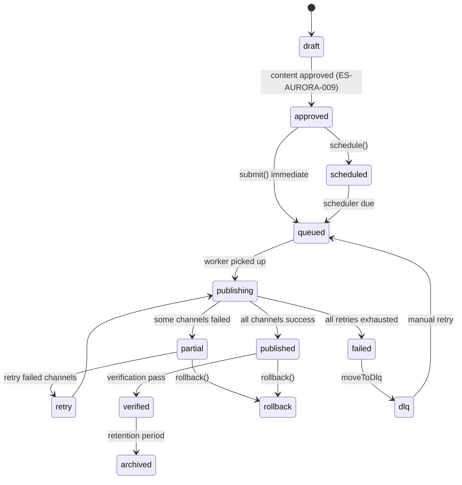
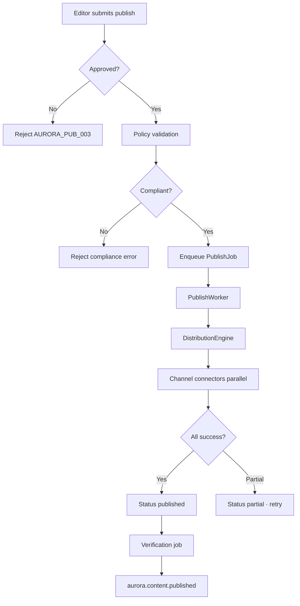

# ES-AURORA-013 — Aurora Channel Publishing & Distribution Implementation Specification

**Document ID:** ES-AURORA-013  
**Program:** Project Aurora — AI Marketing Platform  
**Mission:** A-015 — Channel Publishing & Distribution  
**Prior Missions:** A-007 (ES-AURORA-005) · A-008 (ES-AURORA-006) · A-009 (ES-AURORA-007) · A-010 (ES-AURORA-008) · A-011 (ES-AURORA-009) · A-012 (ES-AURORA-010) · A-013 (ES-AURORA-011) · A-014 (ES-AURORA-012)  
**Version:** 1.0  
**Status:** Ratified — Authoritative Engineering Specification  
**Classification:** Engineering Specification · Publishing · Distribution · Scheduling · Channel Connectors · Governance  
**Authority:** Founder & Chief Architect · Aurora Architecture Review Board  
**Architecture Source:** [A-001 Aurora Constitution](../A-001-Aurora-Constitution.md) · [A-002 Enterprise Engineering Blueprint](../A-002-Aurora-Enterprise-Engineering-Blueprint.md) · [A-003 AI Workforce Architecture](../A-003-Aurora-AI-Workforce-Architecture.md) · [A-004 Enterprise Knowledge & Memory](../A-004-Aurora-Enterprise-Knowledge-and-Memory-Architecture.md)  
**Platform Parent:** [ES-AURORA-005](./ES-AURORA-005-Platform-Foundation-Implementation-Specification.md) · [ES-AURORA-006](./ES-AURORA-006-Identity-Tenant-and-Configuration-Foundation.md) · [ES-AURORA-007](./ES-AURORA-007-Enterprise-Knowledge-Graph-and-Memory-Infrastructure.md) · [ES-AURORA-008](./ES-AURORA-008-AI-Workforce-Runtime-Implementation-Specification.md) · [ES-AURORA-009](./ES-AURORA-009-Content-Studio-and-Asset-Management-Implementation-Specification.md) · [ES-AURORA-010](./ES-AURORA-010-SEO-Intelligence-Engine-Implementation-Specification.md) · [ES-AURORA-011](./ES-AURORA-011-Campaign-Planning-and-Orchestration-Implementation-Specification.md) · [ES-AURORA-012](./ES-AURORA-012-Analytics-and-Performance-Intelligence-Implementation-Specification.md)  
**Effective Date:** 7 August 2026  
**Subordinate To:** A-001 · A-002 · A-003 · A-004 · A-005 · ES-AURORA-005 · ES-AURORA-006 · ES-AURORA-007 · ES-AURORA-008 · ES-AURORA-009 · ES-AURORA-010 · ES-AURORA-011 · ES-AURORA-012

**Rule:** This document is the **authoritative engineering specification** for Aurora Channel Publishing & Distribution (Mission A-015). All code in `lib/aurora/publish/` must comply. **No production implementation in this document.** **Specification only.**

**Scope:** Publishing platform · lifecycle · channel connectors · scheduling · distribution · governance · ORION integration. **Excludes:** Connector OAuth implementations (A-016) · Publishing UI (A-019) · email send infrastructure detail (A-022).

---

## Engineering Principles (Binding)

| # | Principle | Enforcement |
|---|-----------|-------------|
| **PUB-1** | **Publishing is channel independent** | ChannelConnector interface · per-channel jobs |
| **PUB-2** | **Every publication is auditable** | PublishAuditRecord on every state transition |
| **PUB-3** | **Human approval precedes publication** | Approved-content-only gate · no bypass |
| **PUB-4** | **Publishing is retryable** | Exponential backoff · max retries · DLQ |
| **PUB-5** | **Rollback is always available** | Unpublish/delete where API supports · audit |
| **PUB-6** | **Connectors are replaceable** | ChannelConnectorRegistry · stub → live swap |
| **PUB-7** | **Publishing is tenant isolated** | tenant_id · brand_id · RLS on all publish data |
| **PUB-8** | **Channel failures never affect other channels** | Isolated workers · per-channel circuit breaker |
| **PUB-9** | **Every publication has a verification record** | Post-publish verification job mandatory |
| **PUB-10** | **Publishing events emitted through ORION Event Bus** | All lifecycle events on platform bus |

---

## Table of Contents

1. [Executive Overview](#1-executive-overview)
2. [Publishing Platform](#2-publishing-platform)
3. [Publishing Lifecycle](#3-publishing-lifecycle)
4. [Channel Connectors](#4-channel-connectors)
5. [Scheduling Engine](#5-scheduling-engine)
6. [Distribution Engine](#6-distribution-engine)
7. [Publishing Governance](#7-publishing-governance)
8. [ORION Integration](#8-orion-integration)
9. [Testing Strategy](#9-testing-strategy)
10. [Engineering Standards](#10-engineering-standards)
11. [Acceptance Criteria](#11-acceptance-criteria)
12. [Executive Recommendation](#12-executive-recommendation)

**Appendices:** [A — Publishing Taxonomy](#appendix-a--publishing-taxonomy) · [B — Connector Catalogue](#appendix-b--connector-catalogue) · [C — Scheduling Model](#appendix-c--scheduling-model) · [D — Publishing Workflows](#appendix-d--publishing-workflows) · [E — Failure Recovery Matrix](#appendix-e--failure-recovery-matrix) · [F — Implementation Checklist](#appendix-f--implementation-checklist)

---

# Preamble

Approved content earns the right to reach an audience.

Aurora's Channel Publishing & Distribution layer executes **governed, auditable, multi-channel publication** — with human approval enforced, channel failures isolated, every delivery verified, and rollback always within reach.

Approve with discipline. Publish with reliability. Verify every delivery.

---

# 1. Executive Overview

## 1.1 Purpose

| Field | Definition |
|-------|------------|
| **Document purpose** | Implementation specification for Channel Publishing & Distribution |
| **Audience** | Publishing engineers · integration engineers · backend engineers · DevOps · AI architects |
| **Binding authority** | Mission A-015 · all `lib/aurora/publish/` code |
| **Deliverable type** | Engineering specification — no code |

## 1.2 Scope

### In Scope (A-015)

| Area | Coverage |
|------|----------|
| **Publishing platform** | Runtime · workspace · repository · scheduler · queue · history · policies |
| **Lifecycle** | Draft → approved → scheduled → queued → publishing → published → verification |
| **Channel connectors** | 11 Phase 1 channels · connector framework · stub/live pattern |
| **Scheduling** | Campaign scheduling · timezones · recurring · blackout · conflict detection |
| **Distribution** | Multi-channel parallel · retry · verification · failure isolation |
| **Governance** | Approval validation · permissions · brand/legal compliance · rollback auth |
| **ORION integration** | Content · campaign · SEO · analytics · knowledge · events |

### Out of Scope

| Exclusion | Mission |
|-----------|---------|
| OAuth connector implementations | A-016 (ES-AURORA-014) |
| Publishing UI | A-019 |
| Email SMTP/send infrastructure | A-022 |
| Ads campaign API management | A-021 |
| Full WorkflowEngine automation rules | Phase 2 (stub hooks only) |

### Phase Delivery

| Phase | Capability |
|-------|------------|
| **A-015 Phase 1** | Publish pipeline · queue · scheduler · website/blog stubs · governance |
| **A-015 Phase 1 complete** | Social connectors via A-016 · verification · rollback |
| **Phase 2** | Recurring publish · advanced workflow triggers · emergency stop UI |

## 1.3 Objectives

| # | Objective | Success Criteria |
|---|-----------|-----------------|
| 1 | **End-to-end publish pipeline** | Approved content → channel publish |
| 2 | **Approved-content-only gate** | Unapproved content rejected at queue |
| 3 | **Multi-channel distribution** | Parallel publish · isolated failures |
| 4 | **Scheduling engine** | Timezone-aware · campaign calendar integration |
| 5 | **Retry & DLQ** | Exponential backoff · exhausted failures captured |
| 6 | **Verification records** | Every publish verified post-delivery |
| 7 | **Rollback capability** | Unpublish where supported · audit trail |
| 8 | **Publish audit trail** | Every action logged · correlationId |
| 9 | **Analytics event emission** | `aurora.content.published` per channel |
| 10 | **Tenant isolation** | Zero cross-tenant publish access |

## 1.4 Relationship with Architecture Documents

| Document | ES-AURORA-013 Response |
|----------|------------------------|
| **A-001 Aurora Constitution** | Publish Pipeline Standard · approval gates · emergency stop · audit mandate |
| **A-002 Enterprise Blueprint** | `lib/aurora/publish/` · PublishJob · PublishRecord · ChannelConnector |
| **A-003 AI Workforce Architecture** | Social Media Manager publish tasks · Tier 2+ approval for external publish |
| **A-004 Knowledge Architecture** | PublishRecord enrichment · content performance learning |
| **A-005 Module Runtime Spec** | PublishingModuleRuntime · scheduled jobs · worker pool |
| **A-006 Mission Backlog** | Mission A-015 · EP-PUBLISH · EP-AUTOMATION · F-150–F-167 |
| **A-007 Platform Foundation** | ES-AURORA-005 · Event Bus · connector infrastructure · DLQ pattern |
| **A-008 Identity & Tenant** | ES-AURORA-006 · `aurora.publish.*` permissions · tier limits |
| **A-009 Knowledge Graph** | ES-AURORA-007 · publish outcome learning events |
| **A-010 AI Workforce Runtime** | ES-AURORA-008 · Social Media Manager · publish task delegation |
| **A-011 Content Studio** | ES-AURORA-009 · PublishReadyPayload · approval status · publish intents |
| **A-012 SEO Intelligence** | ES-AURORA-010 · SEO metadata in publish payload · slug/canonical |
| **A-013 Campaign Planning** | ES-AURORA-011 · PublishIntent · campaign calendar · channel plans |
| **A-014 Analytics** | ES-AURORA-012 · post-publish metrics ingestion · attribution touchpoints |

### Dependency Chain

```
ES-AURORA-005 (Platform)
    └── ES-AURORA-006 (Identity)
        └── ES-AURORA-009 (Content) + ES-AURORA-011 (Campaign)
            └── ES-AURORA-013 (Publish) ← this document
                └── ES-AURORA-014 (Integrations) ← authorized next
```

---

# 2. Publishing Platform

## 2.1 PublishingModuleRuntime

**File:** `lib/aurora/publish/PublishingModuleRuntime.ts`

```typescript
export class PublishingModuleRuntime implements AuroraModuleRuntime {
  readonly moduleKey = 'publish';
  readonly displayName = 'Channel Publishing & Distribution';
  readonly phase = 1 as const;
  readonly tier = 2;
  readonly dependencies = ['admin', 'content', 'campaign'] as const;
}
```

## 2.2 PublishingRuntime

**File:** `lib/aurora/publish/PublishingRuntime.ts`

Central orchestrator wiring scheduler, queue, distribution, and connectors.

```typescript
export interface PublishingRuntime {
  initialize(ctx: AuroraRuntimeContext): Promise<void>;
  shutdown(ctx: AuroraRuntimeContext): Promise<void>;
  getHealth(ctx: AuroraRuntimeContext): Promise<PublishingHealthStatus>;
  emergencyStop(ctx: AuroraRuntimeContext, reason: string): Promise<EmergencyStopResult>;
  resumePublishing(ctx: AuroraRuntimeContext): Promise<void>;
}
```

## 2.3 PublishingWorkspace

**File:** `lib/aurora/publish/workspace/PublishingWorkspace.ts`

```typescript
export interface PublishingWorkspace {
  getSnapshot(ctx: AuroraRuntimeContext): Promise<PublishingWorkspaceSnapshot>;
  getPendingQueue(ctx: AuroraRuntimeContext): Promise<readonly PublishJobSummary[]>;
  getScheduled(ctx: AuroraRuntimeContext, range: DateRange): Promise<readonly ScheduledPublish[]>;
  getRecentHistory(ctx: AuroraRuntimeContext, limit?: number): Promise<readonly PublishHistoryEntry[]>;
  getFailedJobs(ctx: AuroraRuntimeContext): Promise<readonly PublishJobSummary[]>;
  getChannelStatus(ctx: AuroraRuntimeContext): Promise<readonly ChannelPublishStatus[]>;
}
```

## 2.4 PublishPipeline

**File:** `lib/aurora/publish/PublishPipeline.ts`

```typescript
export interface PublishPipeline {
  submit(ctx: AuroraRuntimeContext, request: PublishRequest): Promise<PublishJob>;
  schedule(ctx: AuroraRuntimeContext, request: ScheduledPublishRequest): Promise<PublishJob>;
  cancel(ctx: AuroraRuntimeContext, jobId: string): Promise<PublishJob>;
  retry(ctx: AuroraRuntimeContext, jobId: string): Promise<PublishJob>;
  rollback(ctx: AuroraRuntimeContext, jobId: string): Promise<RollbackResult>;
  getJob(ctx: AuroraRuntimeContext, jobId: string): Promise<PublishJob | null>;
  listJobs(ctx: AuroraRuntimeContext, filter: PublishJobFilter): Promise<PaginatedResult<PublishJob>>;
}
```

## 2.5 PublishingRepository

**File:** `lib/aurora/publish/repositories/PublishingRepository.ts`

**Tables:**
- `aurora_publish_job`
- `aurora_publish_attempt`
- `aurora_publish_verification`
- `aurora_publish_schedule`
- `aurora_publish_audit`
- `aurora_publish_rollback`
- `aurora_publish_dlq`
- `aurora_publish_policy`
- `aurora_channel_connector_state`

## 2.6 PublishingScheduler

**File:** `lib/aurora/publish/scheduling/PublishingScheduler.ts`

```typescript
export interface PublishingScheduler {
  schedule(ctx: AuroraRuntimeContext, input: ScheduleInput): Promise<ScheduledPublish>;
  reschedule(ctx: AuroraRuntimeContext, scheduleId: string, newTime: string): Promise<ScheduledPublish>;
  cancelSchedule(ctx: AuroraRuntimeContext, scheduleId: string): Promise<void>;
  processDueSchedules(ctx: AuroraRuntimeContext): Promise<ProcessingResult>;
  detectConflicts(ctx: AuroraRuntimeContext, input: ScheduleInput): Promise<readonly ScheduleConflict[]>;
}
```

## 2.7 PublishingQueue

**File:** `lib/aurora/publish/queue/PublishingQueue.ts`

```typescript
export interface PublishingQueue {
  enqueue(ctx: AuroraRuntimeContext, job: PublishJob): Promise<void>;
  dequeue(ctx: AuroraRuntimeContext, channelId?: ChannelId): Promise<PublishJob | null>;
  acknowledge(ctx: AuroraRuntimeContext, jobId: string, result: PublishAttemptResult): Promise<void>;
  moveToDlq(ctx: AuroraRuntimeContext, jobId: string, reason: string): Promise<void>;
  getQueueDepth(ctx: AuroraRuntimeContext): Promise<QueueDepthReport>;
  purge(ctx: AuroraRuntimeContext, filter: QueuePurgeFilter): Promise<PurgeResult>;
}
```

**Queue topology:** Per-tenant priority queue · per-channel worker pools · DLQ per tenant.

## 2.8 PublishingHistory

**File:** `lib/aurora/publish/history/PublishingHistoryService.ts`

```typescript
export interface PublishingHistoryService {
  recordAttempt(ctx: AuroraRuntimeContext, attempt: PublishAttemptRecord): Promise<void>;
  recordVerification(ctx: AuroraRuntimeContext, verification: PublishVerification): Promise<void>;
  getHistory(ctx: AuroraRuntimeContext, jobId: string): Promise<PublishHistoryTimeline>;
  search(ctx: AuroraRuntimeContext, filter: HistoryFilter): Promise<PaginatedResult<PublishHistoryEntry>>;
}
```

## 2.9 PublishingPolicies

**File:** `lib/aurora/publish/governance/PublishingPolicies.ts`

```typescript
export interface PublishingPolicies {
  validatePublishRequest(ctx: AuroraRuntimeContext, request: PublishRequest): Promise<PolicyValidationResult>;
  getEffectivePolicy(ctx: AuroraRuntimeContext): Promise<PublishPolicy>;
  checkBrandCompliance(ctx: AuroraRuntimeContext, payload: PublishReadyPayload): Promise<ComplianceResult>;
  checkLegalCompliance(ctx: AuroraRuntimeContext, payload: PublishReadyPayload): Promise<ComplianceResult>;
}
```

## 2.10 Canonical PublishJob Entity

```typescript
export interface PublishJob {
  readonly id: string;                    // pub_{uuid}
  readonly tenantId: string;
  readonly brandId: string;
  readonly contentId: string;
  readonly contentVersion: number;
  readonly campaignId?: string;
  readonly publishIntentId?: string;
  readonly channels: readonly ChannelId[];
  readonly status: PublishJobStatus;
  readonly priority: PublishPriority;
  readonly scheduledAt?: string;
  readonly correlationId: string;
  readonly requestedBy: string;
  readonly approvedBy: string;
  readonly approvedAt: string;
  readonly createdAt: string;
  readonly updatedAt: string;
}
```

## 2.11 API Route Catalogue

| Method | Route | Permission |
|--------|-------|------------|
| `GET` | `/api/aurora/publish/workspace` | `aurora.publish.read` |
| `POST` | `/api/aurora/publish/jobs` | `aurora.publish.write` |
| `GET` | `/api/aurora/publish/jobs/:id` | `aurora.publish.read` |
| `POST` | `/api/aurora/publish/jobs/:id/cancel` | `aurora.publish.write` |
| `POST` | `/api/aurora/publish/jobs/:id/retry` | `aurora.publish.admin` |
| `POST` | `/api/aurora/publish/jobs/:id/rollback` | `aurora.publish.rollback` |
| `POST` | `/api/aurora/publish/schedule` | `aurora.publish.write` |
| `GET` | `/api/aurora/publish/schedule` | `aurora.publish.read` |
| `GET` | `/api/aurora/publish/history` | `aurora.publish.read` |
| `POST` | `/api/aurora/publish/emergency-stop` | `aurora.publish.admin` |
| `POST` | `/api/aurora/publish/resume` | `aurora.publish.admin` |

---

# 3. Publishing Lifecycle

## 3.1 Status State Machine



## 3.2 Lifecycle States

| Status | Description | Transitions |
|--------|-------------|-------------|
| `draft` | Content not yet approved | — (Content Studio owns) |
| `approved` | Content approved · ready to publish | → scheduled · queued |
| `scheduled` | Future publish time set | → queued (on due) |
| `queued` | In publish queue awaiting worker | → publishing |
| `publishing` | Worker executing channel publish | → published · partial · failed |
| `published` | All target channels succeeded | → verified |
| `verified` | Post-publish verification complete | → archived |
| `partial` | Some channels failed · others succeeded | → retry · rollback |
| `failed` | All channels failed after retries | → dlq |
| `dlq` | Dead letter queue · manual intervention | → queued (retry) |
| `archived` | Historical record · read-only | terminal |
| `cancelled` | Cancelled before publish | terminal |
| `rolled_back` | Rollback executed | terminal |

## 3.3 Draft Phase

Content in `draft` status (ES-AURORA-009). Publish module rejects any publish request until `status === 'approved'` or `publish_ready`.

## 3.4 Approved Phase

**PUB-3:** Mandatory gate.

```typescript
export async function validateApprovalGate(
  ctx: AuroraRuntimeContext,
  contentId: string
): Promise<ApprovalGateResult> {
  const content = await contentService.getById(ctx, contentId);
  if (!content || content.status !== 'approved' && content.status !== 'publish_ready') {
    throw new AuroraPublishError('AURORA_PUB_003', 'APPROVAL_REQUIRED');
  }
  const approval = await contentService.getLatestApproval(ctx, contentId);
  if (!approval || approval.status !== 'approved') {
    throw new AuroraPublishError('AURORA_PUB_003', 'APPROVAL_REQUIRED');
  }
  return { approvedBy: approval.approverId, approvedAt: approval.decidedAt };
}
```

## 3.5 Scheduled Phase

Publish time set via PublishingScheduler. Integrates with ES-AURORA-011 `PublishIntent.scheduledAt`.

## 3.6 Queued Phase

Job enqueued with priority. Campaign launches receive `priority: high`.

## 3.7 Publishing Phase

DistributionEngine executes per-channel. **PUB-8:** Each channel in isolated try/catch · circuit breaker per connector.

## 3.8 Published Phase

All target channels returned success. Emit `aurora.content.published` per channel.

## 3.9 Verification Phase

**PUB-9:** Mandatory verification job within 15 minutes of publish.

| Channel | Verification Method |
|---------|-------------------|
| Website/Blog | HTTP 200 on published URL |
| Email | Delivery webhook (A-022) |
| Social | Platform API post existence check |
| Ads | Campaign/ad active status |

## 3.10 Retry Phase

| Attempt | Delay | Action |
|:-------:|-------|--------|
| 1 | Immediate | First try |
| 2 | 30s | Exponential backoff |
| 3 | 2 min | Exponential backoff |
| 4 | 10 min | Exponential backoff |
| 5 | 30 min | Final attempt |
| Exhausted | — | Move to DLQ · alert |

## 3.11 Rollback Phase

**PUB-5:** RollbackManager unpublishes/deletes where channel API supports.

## 3.12 Archive & Recovery

Jobs archived after 90 days (configurable). Recovery from DLQ via manual retry with admin permission.

---

# 4. Channel Connectors

## 4.1 ChannelConnector Interface

**File:** `lib/aurora/publish/connectors/ChannelConnector.ts`

**PUB-6:** Replaceable connector pattern.

```typescript
export interface ChannelConnector {
  readonly channelId: ChannelId;
  readonly displayName: string;
  readonly phase: 1 | 2 | 3;
  isAvailable(ctx: AuroraRuntimeContext): Promise<boolean>;
  validatePayload(ctx: AuroraRuntimeContext, payload: PublishReadyPayload): Promise<ValidationResult>;
  publish(ctx: AuroraRuntimeContext, payload: PublishReadyPayload, options: PublishOptions): Promise<PublishResult>;
  verify(ctx: AuroraRuntimeContext, publishResult: PublishResult): Promise<VerificationResult>;
  rollback(ctx: AuroraRuntimeContext, publishResult: PublishResult): Promise<RollbackResult>;
  getHealth(ctx: AuroraRuntimeContext): Promise<ConnectorHealth>;
}
```

## 4.2 ChannelConnectorRegistry

```typescript
export interface ChannelConnectorRegistry {
  register(connector: ChannelConnector): void;
  get(channelId: ChannelId): ChannelConnector | null;
  listAvailable(ctx: AuroraRuntimeContext): Promise<readonly ChannelConnectorSummary[]>;
  getHealth(ctx: AuroraRuntimeContext): Promise<readonly ConnectorHealth[]>;
}
```

## 4.3 Supported Channels

| Channel ID | Display Name | Phase | Connector | Mission |
|------------|--------------|:-----:|-----------|---------|
| `website` | Website | 1 | WebsiteConnector | A-015 |
| `blog` | Blog | 1 | BlogConnector | A-015 |
| `email` | Email | 1 | EmailConnector (stub) | A-022 |
| `instagram` | Instagram | 1 | InstagramConnector | A-016 |
| `facebook` | Facebook | 1 | FacebookConnector | A-016 |
| `linkedin` | LinkedIn | 1 | LinkedInConnector | A-023 |
| `x` | X (Twitter) | 1 | XConnector | A-023 |
| `youtube` | YouTube | 1 | YouTubeConnector | A-023 |
| `google_business` | Google Business Profile | 2 | GbpConnector | A-024 |
| `google_ads` | Google Ads | 2 | GoogleAdsConnector | A-021 |
| `meta_ads` | Meta Ads | 2 | MetaAdsConnector | A-021 |

Phase 1: Website · Blog connectors fully specified. Social connectors delegate to A-016 with stub returning `CONNECTOR_NOT_AVAILABLE` until live.

## 4.4 Website Connector

| Field | Specification |
|-------|--------------|
| Payload | HTML/MD body · SEO metadata · assets |
| Action | Deploy to configured CMS/hosting endpoint |
| Verification | HTTP GET published URL → 200 |
| Rollback | Unpublish · revert to previous version |

## 4.5 Blog Connector

| Field | Specification |
|-------|--------------|
| Payload | Title · slug · body · featured image · categories · tags |
| Action | Create/update blog post via CMS API or internal renderer |
| SEO | Canonical URL · meta from ES-AURORA-010 |
| Verification | URL accessible · slug matches |

## 4.6 Email Connector

Stub until A-022. Accepts schedule · stores intent · returns `scheduled` status. No SMTP in A-015.

## 4.7 Social Connectors (Instagram · Facebook · LinkedIn · X · YouTube)

| Field | Specification |
|-------|--------------|
| Payload | Text · media assets · hashtags · link |
| Formatting | Channel-specific from PublishReadyPayload.channelHints |
| Media | Asset URLs from Content Studio object storage |
| OAuth | Credentials from A-016 IntegrationCredentialService |
| Rate limits | Per-connector circuit breaker |

## 4.8 Google Business Profile · Google Ads · Meta Ads

Phase 2 connectors. Plan accepted · publish via stub until respective mission complete.

## 4.9 Future Connector Framework

```typescript
export interface ConnectorPlugin {
  readonly manifest: ConnectorManifest;
  createConnector(deps: ConnectorDependencies): ChannelConnector;
}

export interface ConnectorManifest {
  readonly channelId: ChannelId;
  readonly version: string;
  readonly requiredScopes: readonly string[];
  readonly supportedContentTypes: readonly ContentType[];
  readonly capabilities: ConnectorCapabilities;
}
```

New connectors register via `ChannelConnectorRegistry.register()` without modifying PublishPipeline core.

## 4.10 Connector Health & Circuit Breaker

| State | Behavior |
|-------|----------|
| Closed | Normal operation |
| Open | Fail fast · skip channel · alert |
| Half-open | Single probe request |

Threshold: 5 failures in 5 minutes → open for 10 minutes.

---

# 5. Scheduling Engine

## 5.1 ScheduleService

**File:** `lib/aurora/publish/scheduling/ScheduleService.ts`

```typescript
export interface ScheduleService {
  createSchedule(ctx: AuroraRuntimeContext, input: CreateScheduleInput): Promise<ScheduledPublish>;
  updateSchedule(ctx: AuroraRuntimeContext, id: string, input: UpdateScheduleInput): Promise<ScheduledPublish>;
  cancelSchedule(ctx: AuroraRuntimeContext, id: string): Promise<void>;
  listSchedules(ctx: AuroraRuntimeContext, filter: ScheduleFilter): Promise<PaginatedResult<ScheduledPublish>>;
  processDue(ctx: AuroraRuntimeContext): Promise<ScheduleProcessingResult>;
}
```

## 5.2 Campaign Scheduling

Integrates with ES-AURORA-011:
- `PublishIntent.scheduledAt` → `ScheduledPublish`
- Campaign calendar entries trigger batch scheduling
- Campaign launch (WF-02) may enqueue immediate multi-channel publish

## 5.3 Time Zones

| Rule | Implementation |
|------|---------------|
| Storage | All times UTC in database |
| Display | Brand timezone from ES-AURORA-006 BrandConfig |
| Scheduling | User selects time in brand TZ · converted to UTC |
| DST | Use IANA timezone database · no manual offset |

## 5.4 Recurring Publishing

```typescript
export interface RecurringSchedule {
  readonly frequency: 'daily' | 'weekly' | 'monthly';
  readonly interval: number;
  readonly daysOfWeek?: readonly number[];   // 0=Sun
  readonly endDate?: string;
  readonly maxOccurrences?: number;
}
```

Phase 2 feature. Phase 1: single-occurrence schedules only.

## 5.5 Dependencies

| Dependency Type | Rule |
|-----------------|------|
| Content approval | Must be approved before schedule created |
| Campaign milestone | Optional · schedule blocked until milestone complete |
| Channel readiness | Connector must be available or stub accepted |
| SEO pre-flight | Website/blog require SEO audit pass (configurable) |

## 5.6 Blackout Periods

```typescript
export interface BlackoutPeriod {
  readonly start: string;
  readonly end: string;
  readonly reason: string;
  readonly channels?: readonly ChannelId[];  // All if omitted
}
```

Configured in BrandConfig. Scheduler rejects schedules falling in blackout.

## 5.7 Business Hours

Default quiet hours: 22:00–07:00 brand timezone for social/email (configurable). Schedules in quiet hours shifted to next business window unless `force: true` with approval.

## 5.8 Priority Handling

| Priority | Use Case | Queue Position |
|----------|----------|:--------------:|
| `critical` | Emergency communications | Front |
| `high` | Campaign launch · time-sensitive | Ahead of normal |
| `normal` | Standard scheduled publish | FIFO |
| `low` | Batch · non-urgent | Back |

## 5.9 Conflict Detection

| Conflict | Detection | Resolution |
|----------|-------------|------------|
| Same channel · same time | Min gap violation (ES-AURORA-011) | Block · surface in workspace |
| Same content · duplicate channel | Duplicate publish intent | Block |
| Blackout overlap | Time in blackout period | Block · suggest alternative |
| Connector unavailable | Circuit breaker open | Queue with delay · alert |

## 5.10 PublishingSchedulerJob

**Schedule:** Every 1 minute

```
PublishingSchedulerJob
    ├── Fetch due schedules (scheduledAt <= now)
    ├── Validate approval still valid
    ├── Create PublishJob · enqueue
    └── Mark schedule processed
```

---

# 6. Distribution Engine

## 6.1 DistributionEngine

**File:** `lib/aurora/publish/distribution/DistributionEngine.ts`

```typescript
export interface DistributionEngine {
  distribute(ctx: AuroraRuntimeContext, job: PublishJob): Promise<DistributionResult>;
  distributeToChannel(ctx: AuroraRuntimeContext, job: PublishJob, channelId: ChannelId): Promise<ChannelPublishResult>;
  synchronizeStatus(ctx: AuroraRuntimeContext, jobId: string): Promise<PublishJobStatus>;
}
```

## 6.2 Multi-Channel Publishing

**PUB-1 · PUB-8:** Channels execute independently.

```typescript
export async function distributeMultiChannel(
  ctx: AuroraRuntimeContext,
  job: PublishJob,
  payload: PublishReadyPayload
): Promise<DistributionResult> {
  const results = await Promise.allSettled(
    job.channels.map(channelId =>
      distributeToChannel(ctx, job, channelId, payload)
    )
  );
  return aggregateResults(job.id, results);
}
```

Partial success → `partial` status · failed channels eligible for retry.

## 6.3 Parallel Execution

| Configuration | Default |
|---------------|---------|
| Max concurrent channels per job | All channels parallel |
| Max concurrent jobs per tenant | 10 |
| Max concurrent jobs platform-wide | 1000 |
| Worker pool size | Configurable per deployment |

## 6.4 Channel Sequencing

Optional `sequencing: sequential` for dependent channels:

| Sequence | Use Case |
|----------|----------|
| Blog → Social | Blog published first · social links to blog URL |
| Email → Landing | Email references live landing page |

Default: parallel. Sequential opt-in per publish request.

## 6.5 Retry Policies

```typescript
export interface RetryPolicy {
  readonly maxAttempts: number;           // Default 5
  readonly initialDelayMs: number;        // 30000
  readonly maxDelayMs: number;            // 1800000
  readonly backoffMultiplier: number;     // 2
  readonly retryableErrors: readonly string[];
}
```

Non-retryable: `APPROVAL_REQUIRED` · `VALIDATION_FAILED` · `BRAND_COMPLIANCE_FAILED`.

## 6.6 Delivery Verification

**PUB-9:**

```typescript
export interface PublishVerification {
  readonly id: string;
  readonly jobId: string;
  readonly channelId: ChannelId;
  readonly verified: boolean;
  readonly publishedUrl?: string;
  readonly verifiedAt: string;
  readonly method: VerificationMethod;
  readonly evidence?: Record<string, unknown>;
}
```

**Job:** `PublishVerificationJob` — runs 5 minutes after publish · retries verification 3 times.

## 6.7 Status Synchronization

PublishJob.status derived from channel results:

| Channel Results | Job Status |
|-----------------|------------|
| All success | `published` |
| Some success · some fail | `partial` |
| All fail | `failed` |
| Retry in progress | `retry` |

## 6.8 Failure Isolation

| Isolation Layer | Mechanism |
|-----------------|-----------|
| Per-channel | Separate try/catch · independent retry |
| Per-connector | Circuit breaker · no cascade |
| Per-tenant | Queue isolation · rate limits |
| Per-job | Failed channel does not rollback successful channels (unless explicit rollback) |

## 6.9 Publish Workers

**File:** `lib/aurora/publish/workers/PublishWorker.ts`

```
PublishWorker (pool)
    ├── Dequeue job (per channel or multi)
    ├── Load PublishReadyPayload from Content Studio
    ├── Validate approval gate + policies
    ├── Resolve connector from registry
    ├── Execute connector.publish()
    ├── Record attempt in history
    ├── On success → schedule verification
    ├── On failure → retry or DLQ
    └── Emit events
```

## 6.10 DLQ Processing

```typescript
export interface DlqService {
  list(ctx: AuroraRuntimeContext): Promise<readonly DlqEntry[]>;
  retry(ctx: AuroraRuntimeContext, entryId: string): Promise<PublishJob>;
  dismiss(ctx: AuroraRuntimeContext, entryId: string, reason: string): Promise<void>;
  alert(ctx: AuroraRuntimeContext, entryId: string): Promise<void>;
}
```

Exhausted retries → DLQ · notification to tenant admin · `aurora.publish.dlq` event.

---

# 7. Publishing Governance

## 7.1 Approval Validation

**PUB-3:** No publish without approval.

| Check | Source | Block if fail |
|-------|--------|:-------------:|
| Content status | ES-AURORA-009 | Yes |
| Approval record exists | ContentApprovalWorkflow | Yes |
| Approval not expired | Brand policy (default 30 days) | Yes |
| Approver has permission | ES-AURORA-006 RBAC | Yes |
| Campaign launch approval | ES-AURORA-011 (if campaignId) | Yes |

## 7.2 Publishing Permissions

| Permission | Scope |
|------------|-------|
| `aurora.publish.read` | View jobs · history · workspace |
| `aurora.publish.write` | Submit · schedule publish |
| `aurora.publish.rollback` | Rollback published content |
| `aurora.publish.admin` | Retry · DLQ · emergency stop |

| Role | Starter | Professional | Enterprise |
|------|---------|-------------|------------|
| Submit publish | Editor+ | Editor+ | Editor+ |
| Schedule publish | Editor+ | Editor+ | Editor+ |
| Rollback | Manager+ | Director+ | Director+ |
| Emergency stop | — | Admin | Admin |
| DLQ retry | — | Admin | Admin |

## 7.3 Brand Compliance

Uses ES-AURORA-009 BrandComplianceValidator + ES-AURORA-007 Brand Knowledge:

| Check | Action |
|-------|--------|
| Prohibited terms | Block publish |
| Voice/tone deviation | Warning · require re-approval (configurable) |
| Missing brand assets | Block if required assets absent |
| Logo/colour usage | Validate against BrandKit |

## 7.4 Legal Compliance

| Check | Action |
|-------|--------|
| Required disclaimers | Block if missing on regulated content |
| Copyright notices | Validate asset licensing |
| GDPR marketing consent | Email channel · block if no consent flag (Phase 2) |
| Industry regulations | Configurable rule set per tenant tier |

## 7.5 Audit Logging

**PUB-2 · PUB-10:**

```typescript
export interface PublishAuditRecord {
  readonly id: string;
  readonly jobId: string;
  readonly action: PublishAuditAction;
  readonly actorId: string;
  readonly channelId?: ChannelId;
  readonly previousStatus?: PublishJobStatus;
  readonly newStatus?: PublishJobStatus;
  readonly metadata?: Record<string, unknown>;
  readonly correlationId: string;
  readonly timestamp: string;
}
```

| Action | Trigger |
|--------|---------|
| `job_created` | submit() · schedule() |
| `job_queued` | enqueue |
| `publish_started` | worker begin |
| `publish_succeeded` | channel success |
| `publish_failed` | channel failure |
| `verification_passed` | verify success |
| `verification_failed` | verify failure |
| `rollback_executed` | rollback |
| `emergency_stop` | emergencyStop() |
| `dlq_moved` | moveToDlq |

Stored in ORION AuditStore + `aurora_publish_audit`.

## 7.6 Rollback Authorization

| Scope | Approver |
|-------|----------|
| Single channel rollback | Campaign Manager+ |
| Full job rollback | Marketing Director+ |
| Emergency unpublish all | Admin |

Rollback audit includes reason · approver · affected URLs.

## 7.7 Publishing Certificates

Pre-launch certification checklist for tenant go-live:

| ID | Criterion |
|----|-----------|
| PUB-C1 | PUB-1–PUB-10 verified |
| PUB-C2 | End-to-end website publish test passed |
| PUB-C3 | Approval gate blocks unapproved content |
| PUB-C4 | DLQ captures exhausted failures |
| PUB-C5 | Zero cross-tenant publish access |

## 7.8 Emergency Stop

```typescript
export interface EmergencyStopResult {
  readonly stoppedAt: string;
  readonly stoppedBy: string;
  readonly reason: string;
  readonly jobsCancelled: number;
  readonly schedulesPaused: number;
}
```

Halts all pending · queued · scheduled publishes tenant-wide. Active in-flight jobs complete but no new dequeues until `resumePublishing()`.

---

# 8. ORION Integration

## 8.1 Campaign Runtime

| Integration | Direction |
|-------------|-----------|
| PublishIntent | Campaign → PublishPipeline.schedule() |
| Campaign calendar | Scheduled publishes in workspace |
| Campaign launch | WF-02 triggers multi-channel enqueue |
| Publish completion | Update channel plan status → `published` |

## 8.2 Content Studio

| Integration | Direction |
|-------------|-----------|
| PublishReadyPayload | Content → PublishPipeline input |
| Approval status | Gate validation |
| Content status update | On publish → `published` |
| Version pinning | Publish uses approved version number |

**Flow:**

```
Content approved (ES-AURORA-009)
    ↓
PublishReadyPayload generated
    ↓
PublishPipeline.submit() or schedule()
    ↓
DistributionEngine → ChannelConnector
    ↓
Content.status = 'published' · publishedAt set
    ↓
aurora.content.published event
```

## 8.3 SEO Intelligence

| Integration | Direction |
|-------------|-----------|
| SEO metadata in payload | Title · description · canonical · schema |
| Slug validation | SeoService before website/blog publish |
| Post-publish sitemap ping | Optional · Phase 2 |

## 8.4 Knowledge Graph

| Event | Knowledge Action |
|-------|-----------------|
| Publish verified | ContentPublishRecord |
| Publish failed | PublishFailureRecord |
| Rollback | PublishRollbackRecord |

## 8.5 Identity & RBAC

Permissions defined in §7.2. All publish operations require authenticated context with brand scope.

## 8.6 Analytics

| Event | Analytics Action |
|-------|-----------------|
| `aurora.content.published` | Ingest metrics hook · attribution touchpoint |
| Verification URL | Page view tracking baseline |
| Channel publish | Campaign channel KPI update |

ES-AURORA-012 AnalyticsIngestionService consumes publish events.

## 8.7 Event Bus

| Event | Payload |
|-------|---------|
| `aurora.publish.job.created` | jobId · contentId · channels |
| `aurora.publish.job.queued` | jobId · priority |
| `aurora.publish.started` | jobId · channelId |
| `aurora.content.published` | contentId · channelId · url · campaignId? |
| `aurora.publish.failed` | jobId · channelId · error |
| `aurora.publish.verified` | jobId · channelId · url |
| `aurora.publish.rollback` | jobId · channelId · reason |
| `aurora.publish.dlq` | jobId · reason · attempts |
| `aurora.publish.emergency_stop` | tenantId · stoppedBy · reason |

All events: `tenantId` · `brandId` · `correlationId` · `timestamp` · `actorId`.

## 8.8 PlatformStore

**Migration:** `migrations/aurora/013_publish.sql`

```sql
CREATE TABLE aurora_publish_job (
  id UUID PRIMARY KEY DEFAULT gen_random_uuid(),
  tenant_id UUID NOT NULL,
  brand_id UUID NOT NULL,
  content_id UUID NOT NULL,
  content_version INT NOT NULL,
  campaign_id UUID,
  publish_intent_id UUID,
  channels TEXT[] NOT NULL,
  status TEXT NOT NULL DEFAULT 'queued',
  priority TEXT NOT NULL DEFAULT 'normal',
  scheduled_at TIMESTAMPTZ,
  correlation_id UUID NOT NULL,
  requested_by UUID NOT NULL,
  approved_by UUID NOT NULL,
  approved_at TIMESTAMPTZ NOT NULL,
  created_at TIMESTAMPTZ NOT NULL DEFAULT now(),
  updated_at TIMESTAMPTZ NOT NULL DEFAULT now()
);

CREATE TABLE aurora_publish_attempt (
  id UUID PRIMARY KEY DEFAULT gen_random_uuid(),
  tenant_id UUID NOT NULL,
  job_id UUID NOT NULL REFERENCES aurora_publish_job(id),
  channel_id TEXT NOT NULL,
  attempt_number INT NOT NULL,
  status TEXT NOT NULL,
  error_code TEXT,
  error_message TEXT,
  published_url TEXT,
  started_at TIMESTAMPTZ NOT NULL,
  completed_at TIMESTAMPTZ
);

CREATE TABLE aurora_publish_verification (
  id UUID PRIMARY KEY DEFAULT gen_random_uuid(),
  tenant_id UUID NOT NULL,
  job_id UUID NOT NULL REFERENCES aurora_publish_job(id),
  channel_id TEXT NOT NULL,
  verified BOOLEAN NOT NULL,
  published_url TEXT,
  method TEXT NOT NULL,
  evidence JSONB,
  verified_at TIMESTAMPTZ NOT NULL DEFAULT now()
);

CREATE TABLE aurora_publish_schedule (
  id UUID PRIMARY KEY DEFAULT gen_random_uuid(),
  tenant_id UUID NOT NULL,
  brand_id UUID NOT NULL,
  content_id UUID NOT NULL,
  channels TEXT[] NOT NULL,
  scheduled_at TIMESTAMPTZ NOT NULL,
  timezone TEXT NOT NULL,
  status TEXT NOT NULL DEFAULT 'pending',
  job_id UUID REFERENCES aurora_publish_job(id),
  created_at TIMESTAMPTZ NOT NULL DEFAULT now()
);

CREATE TABLE aurora_publish_audit (
  id UUID PRIMARY KEY DEFAULT gen_random_uuid(),
  tenant_id UUID NOT NULL,
  job_id UUID NOT NULL,
  action TEXT NOT NULL,
  actor_id UUID NOT NULL,
  channel_id TEXT,
  previous_status TEXT,
  new_status TEXT,
  metadata JSONB,
  correlation_id UUID NOT NULL,
  created_at TIMESTAMPTZ NOT NULL DEFAULT now()
);

CREATE TABLE aurora_publish_dlq (
  id UUID PRIMARY KEY DEFAULT gen_random_uuid(),
  tenant_id UUID NOT NULL,
  job_id UUID NOT NULL REFERENCES aurora_publish_job(id),
  reason TEXT NOT NULL,
  attempts INT NOT NULL,
  last_error TEXT,
  moved_at TIMESTAMPTZ NOT NULL DEFAULT now(),
  resolved_at TIMESTAMPTZ
);

CREATE INDEX idx_publish_job_tenant ON aurora_publish_job(tenant_id, brand_id, status);
CREATE INDEX idx_publish_schedule_due ON aurora_publish_schedule(scheduled_at, status);
CREATE INDEX idx_publish_job_correlation ON aurora_publish_job(correlation_id);
```

**RLS:** All tables tenant-scoped per ES-AURORA-006.

## 8.9 Executive Dashboards

| Widget | Source |
|--------|--------|
| Publish success rate | PublishingHistoryService |
| Pending queue depth | PublishingQueue |
| Failed/DLQ count | DlqService |
| Scheduled next 24h | PublishingScheduler |
| Channel health | ChannelConnectorRegistry |

Feeds ES-AURORA-012 executive dashboards · Mission Control (A-019).

## 8.10 PublishFacadeOperations

```typescript
export interface PublishOperations {
  submit(ctx: AuroraRuntimeContext, request: PublishRequest): Promise<PublishJob>;
  schedule(ctx: AuroraRuntimeContext, request: ScheduledPublishRequest): Promise<PublishJob>;
  cancel(ctx: AuroraRuntimeContext, jobId: string): Promise<PublishJob>;
  retry(ctx: AuroraRuntimeContext, jobId: string): Promise<PublishJob>;
  rollback(ctx: AuroraRuntimeContext, jobId: string): Promise<RollbackResult>;
  getJob(ctx: AuroraRuntimeContext, jobId: string): Promise<PublishJob | null>;
  listJobs(ctx: AuroraRuntimeContext, filter: PublishJobFilter): Promise<PaginatedResult<PublishJob>>;
  getWorkspace(ctx: AuroraRuntimeContext): Promise<PublishingWorkspaceSnapshot>;
  getHistory(ctx: AuroraRuntimeContext, jobId: string): Promise<PublishHistoryTimeline>;
  emergencyStop(ctx: AuroraRuntimeContext, reason: string): Promise<EmergencyStopResult>;
}
```

---

# 9. Testing Strategy

## 9.1 Test Structure

```
tests/aurora/
├── unit/publish/
│   ├── PublishPipeline.test.ts
│   ├── PublishingScheduler.test.ts
│   ├── DistributionEngine.test.ts
│   ├── ApprovalGate.test.ts
│   ├── RetryPolicy.test.ts
│   └── ChannelConnectorRegistry.test.ts
├── integration/publish/
│   ├── publishLifecycle.test.ts
│   ├── multiChannelPublish.test.ts
│   ├── schedulingEngine.test.ts
│   ├── retryAndDlq.test.ts
│   ├── rollbackRecovery.test.ts
│   ├── verificationJob.test.ts
│   └── contentStudioIntegration.test.ts
└── integration/security/
    └── publishTenantIsolation.test.ts
```

## 9.2 Coverage Targets

| Layer | Minimum |
|-------|:-------:|
| `lib/aurora/publish/` core | 90% |
| `lib/aurora/publish/connectors/` | 85% |
| `lib/aurora/publish/distribution/` | 90% |
| **A-015 overall** | **85%** |

## 9.3 Required Tests

| Suite | Minimum |
|-------|:-------:|
| Publishing lifecycle | 30+ |
| Connector validation | 25+ |
| Scheduling | 20+ |
| Retry/DLQ | 20+ |
| Rollback/recovery | 15+ |
| Governance/approval | 20+ |
| Multi-channel isolation | 15+ |
| Security/isolation | 15+ |
| **Total** | **160+** |

## 9.4 Lifecycle Test Scenarios

| ID | Scenario | Expected |
|----|----------|----------|
| LC-01 | Submit unapproved content | Error `AURORA_PUB_003` |
| LC-02 | Happy path publish | approved → published → verified |
| LC-03 | Scheduled publish | Fires at scheduledAt |
| LC-04 | Partial channel failure | Status `partial` · retry failed only |
| LC-05 | All retries exhausted | DLQ · alert |
| LC-06 | Rollback published job | Status `rolled_back` · audit |

## 9.5 Connector Test Scenarios

| ID | Scenario | Expected |
|----|----------|----------|
| CN-01 | Website connector publish | URL returned · verification pass |
| CN-02 | Stub social connector | `CONNECTOR_NOT_AVAILABLE` · graceful |
| CN-03 | Circuit breaker open | Fail fast · no cascade |
| CN-04 | Invalid payload | Validation error before publish |

## 9.6 Performance Benchmarks

| Operation | Target (p95) |
|-----------|:------------:|
| Enqueue job | < 100ms |
| Single channel publish | < 5s |
| Multi-channel (5) parallel | < 8s |
| Scheduler process due (100) | < 30s |
| Verification job | < 10s |

---

# 10. Engineering Standards

## 10.1 Folder Layout

```
lib/aurora/publish/
├── PublishingModuleRuntime.ts
├── PublishingRuntime.ts
├── PublishPipeline.ts
├── workspace/
│   └── PublishingWorkspace.ts
├── scheduling/
│   ├── PublishingScheduler.ts
│   └── ScheduleService.ts
├── queue/
│   └── PublishingQueue.ts
├── distribution/
│   └── DistributionEngine.ts
├── connectors/
│   ├── ChannelConnector.ts
│   ├── ChannelConnectorRegistry.ts
│   ├── WebsiteConnector.ts
│   ├── BlogConnector.ts
│   └── StubConnector.ts
├── governance/
│   ├── PublishingPolicies.ts
│   ├── ApprovalGate.ts
│   └── RollbackManager.ts
├── history/
│   └── PublishingHistoryService.ts
├── workers/
│   ├── PublishWorker.ts
│   └── PublishVerificationJob.ts
├── dlq/
│   └── DlqService.ts
├── repositories/
├── jobs/
│   ├── PublishingSchedulerJob.ts
│   └── PublishVerificationJob.ts
└── facade/
    └── PublishFacadeOperations.ts
```

## 10.2 Connector Contracts

Every connector must implement:

```typescript
export interface ChannelConnectorContract {
  validatePayload(payload: PublishReadyPayload): ValidationResult;
  publish(payload: PublishReadyPayload, options: PublishOptions): Promise<PublishResult>;
  verify(result: PublishResult): Promise<VerificationResult>;
  rollback(result: PublishResult): Promise<RollbackResult>;
  getHealth(): Promise<ConnectorHealth>;
}
```

Connectors must not access database directly — all persistence via PublishingRepository.

## 10.3 Service Contracts

- All public methods accept `AuroraRuntimeContext` first
- Tenant/brand from context — never from payload alone
- All state transitions emit audit records + events
- Errors use `AuroraPublishError` with codes from §10.4

## 10.4 Error Codes

| Code | Name | HTTP |
|------|------|:----:|
| `AURORA_PUB_001` | JOB_NOT_FOUND | 404 |
| `AURORA_PUB_002` | CONTENT_NOT_FOUND | 404 |
| `AURORA_PUB_003` | APPROVAL_REQUIRED | 403 |
| `AURORA_PUB_004` | VALIDATION_FAILED | 422 |
| `AURORA_PUB_005` | CONNECTOR_NOT_AVAILABLE | 424 |
| `AURORA_PUB_006` | SCHEDULE_CONFLICT | 422 |
| `AURORA_PUB_007` | BLACKOUT_PERIOD | 422 |
| `AURORA_PUB_008` | BRAND_COMPLIANCE_FAILED | 422 |
| `AURORA_PUB_009` | ROLLBACK_FAILED | 500 |
| `AURORA_PUB_010` | EMERGENCY_STOP_ACTIVE | 503 |
| `AURORA_PUB_011` | PUBLISH_FAILED | 502 |

## 10.5 Workflow Contracts

| Workflow | Trigger | Outcome |
|----------|---------|---------|
| Immediate publish | submit() | Job queued → published |
| Scheduled publish | schedule() | Job at scheduledAt |
| Campaign launch publish | WF-02 completion | Multi-channel enqueue |
| Retry | retry() · auto-retry | Re-attempt failed channels |
| Rollback | rollback() | Unpublish · audit |
| Emergency stop | emergencyStop() | All pending halted |

## 10.6 Permission Matrix

| Permission | admin | director | manager | editor | viewer |
|------------|:-----:|:--------:|:-------:|:------:|:------:|
| `aurora.publish.read` | ✅ | ✅ | ✅ | ✅ | ✅ |
| `aurora.publish.write` | ✅ | ✅ | ✅ | ✅ | — |
| `aurora.publish.rollback` | ✅ | ✅ | ✅ | — | — |
| `aurora.publish.admin` | ✅ | — | — | — | — |

## 10.7 Review Checklist

- [ ] tenant_id · brand_id · RLS on all tables
- [ ] Approval gate enforced · no bypass path
- [ ] Per-channel failure isolation verified
- [ ] Verification record on every successful publish
- [ ] DLQ tested · alerts fire
- [ ] Rollback tested where connector supports
- [ ] All events on ORION Event Bus
- [ ] Coverage ≥ 85%

## 10.8 Implementation Roadmap

| Sprint | Focus | Deliverables |
|:------:|-------|-------------|
| **S1** | Platform · pipeline | PublishPipeline · repository · approval gate |
| **S2** | Queue · workers | PublishingQueue · PublishWorker · audit |
| **S3** | Scheduling | ScheduleService · scheduler job · conflicts |
| **S4** | Connectors | Website · Blog · registry · stubs |
| **S5** | Distribution · retry | DistributionEngine · retry · DLQ · verification |
| **S6** | Governance · certification | Rollback · emergency stop · integration tests |

**Duration:** 8 weeks · depends on A-007–A-014 · A-016 for live social connectors.

---

# 11. Acceptance Criteria

## 11.1 Definition of Done

| # | Criterion |
|---|-----------|
| 1 | PublishPipeline end-to-end operational |
| 2 | Approved-content-only gate enforced |
| 3 | PublishingScheduler · timezone-aware scheduling |
| 4 | DistributionEngine · parallel multi-channel |
| 5 | Retry · DLQ · exponential backoff |
| 6 | PublishVerificationJob · verification records |
| 7 | Website · Blog connectors operational |
| 8 | ChannelConnectorRegistry · stub pattern |
| 9 | RollbackManager · audit trail |
| 10 | 160+ tests · 85% coverage |

## 11.2 Publishing Certification

| ID | Criterion |
|----|-----------|
| PUB-C1 | PUB-1–PUB-10 verified |
| PUB-C2 | Unapproved content blocked |
| PUB-C3 | Channel failure isolation proven |
| PUB-C4 | DLQ captures exhausted failures |
| PUB-C5 | Zero cross-tenant access |

## 11.3 Operational Readiness

| Check | Requirement |
|-------|-------------|
| Publish success rate | > 99% (excl. connector unavailable) |
| Queue processing latency | p95 < 30s from enqueue |
| Verification completion | Within 15 min of publish |
| DLQ alert | Within 5 min of move |
| Emergency stop | Halts new publishes within 10s |

## 11.4 Engineering Sign-Off

A-015 Mission Lead · Publishing Product Owner · Integration Lead · Security Lead · Architecture Review Board.

---

# 12. Executive Recommendation

## 12.1 Implementation Readiness

ES-AURORA-005 through ES-AURORA-012 ratified. ES-AURORA-013 complete. A-015 authorized after prior missions implemented. Live social publishing requires ES-AURORA-014 connector implementations — stub connectors acceptable for Phase 1 pipeline certification.

## 12.2 Approval

| Authorization | Status |
|---------------|:------:|
| ES-AURORA-013 Channel Publishing & Distribution | **✅ RATIFIED** |
| A-015 implementation | **✅ AUTHORIZED** |
| ES-AURORA-014 Integrations spec | **✅ AUTHORIZED TO DRAFT** |

## 12.3 Authorize ES-AURORA-014

| Field | Value |
|-------|-------|
| **Next Spec** | ES-AURORA-014 — Google & Meta Integrations Implementation |
| **Mission** | A-016 — Google & Meta Integrations |
| **Dependency** | A-007–A-015 |
| **Scope** | GSC · GA4 · Meta Facebook · Meta Instagram · OAuth · health probes · circuit breaker |

---

### Mohammad Shafi Goroo

Founder & Chief Architect

ORION Enterprise Platform · Project Aurora

7 August 2026

---

# Appendices

## Appendix A — Publishing Taxonomy

| Type | Description | Channels |
|------|-------------|----------|
| **Immediate** | Publish on submit | All |
| **Scheduled** | Future publish time | All |
| **Campaign launch** | WF-02 triggered batch | Per campaign plan |
| **Recurring** | Repeat schedule (Phase 2) | Social · blog · email |
| **Sequential** | Ordered channel publish | Blog → social |
| **Rollback** | Unpublish/delete | Where API supports |

## Appendix B — Connector Catalogue

| Connector | Content Types | Media | OAuth Scopes | Rollback |
|-----------|--------------|:-----:|--------------|:--------:|
| WebsiteConnector | page · landing | Yes | Internal | Yes |
| BlogConnector | blog_post | Yes | Internal/CMS | Yes |
| EmailConnector | email | No | SMTP/API (A-022) | N/A |
| InstagramConnector | post · story · reel | Yes | instagram_content_publish | Delete |
| FacebookConnector | post · link | Yes | pages_manage_posts | Delete |
| LinkedInConnector | post · article | Yes | w_member_social | Delete |
| XConnector | post · thread | Yes | tweet.write | Delete |
| YouTubeConnector | video | Yes | youtube.upload | Delete |
| GbpConnector | post · offer | Yes | business.manage | Delete |
| GoogleAdsConnector | ad · campaign | Yes | adwords | Pause |
| MetaAdsConnector | ad · campaign | Yes | ads_management | Pause |

## Appendix C — Scheduling Model

```
PublishingSchedulerJob (every 1 min)
    ├── Fetch schedules where scheduledAt <= now AND status = pending
    ├── Validate approval still valid
    ├── Check blackout · conflicts
    ├── Create PublishJob · enqueue
    └── Update schedule status = processed

Schedule conflict rules:
    ├── Min gap: 4h social · 24h email (brand config)
    ├── Blackout: reject or shift to next window
    └── Quiet hours: shift to 07:00 unless force approved
```

## Appendix D — Publishing Workflows

### D.1 Immediate Publish



### D.2 Campaign Launch Publish

Campaign WF-02 completion → batch PublishIntent → ScheduleService → multi-channel enqueue at launch time.

### D.3 Rollback Workflow

Admin/Director authorizes → RollbackManager → per-channel connector.rollback() → audit → `aurora.publish.rollback` event.

## Appendix E — Failure Recovery Matrix

| Failure | Detection | Recovery | Escalation |
|---------|-----------|----------|------------|
| Transient API error | HTTP 5xx · timeout | Auto-retry (5 attempts) | DLQ after exhaustion |
| Rate limit | HTTP 429 | Backoff · retry | Circuit breaker |
| Invalid credentials | HTTP 401 | No retry · alert | Admin · re-auth (A-016) |
| Content validation | Pre-publish | No retry · fix content | Editor notification |
| Brand compliance | Pre-publish | No retry · re-approve | Brand Manager |
| Verification failure | Post-publish | Manual investigation | Campaign Manager |
| Connector unavailable | Circuit open | Queue with delay | Integration alert |
| Emergency incident | Admin action | emergencyStop() | All publishing halted |

## Appendix F — Implementation Checklist

### Sprint 1 — Publishing Foundation
- [ ] PublishPipeline · PublishJob entity · repository · RLS
- [ ] ApprovalGate · PublishingPolicies
- [ ] Unit tests (30+)

### Sprint 2 — Queue & Workers
- [ ] PublishingQueue · PublishWorker pool
- [ ] Publish audit logging
- [ ] Event publishers

### Sprint 3 — Scheduling
- [ ] ScheduleService · PublishingSchedulerJob
- [ ] Conflict detection · blackout · timezone
- [ ] Campaign PublishIntent integration

### Sprint 4 — Connectors
- [ ] ChannelConnector interface · registry
- [ ] WebsiteConnector · BlogConnector
- [ ] StubConnector for unavailable channels

### Sprint 5 — Distribution & Recovery
- [ ] DistributionEngine · parallel · isolation
- [ ] Retry policy · DLQ · DlqService
- [ ] PublishVerificationJob

### Sprint 6 — Governance & Certification
- [ ] RollbackManager · emergency stop
- [ ] Content Studio · campaign integration
- [ ] Integration tests · 85% coverage
- [ ] Mission completion report

---

## Document Approval

| Field | Value |
|-------|-------|
| **Document** | ES-AURORA-013 — Channel Publishing & Distribution |
| **Mission** | A-015 |
| **Next** | A-016 Integrations (ES-AURORA-014) |

---

*End of ES-AURORA-013*

