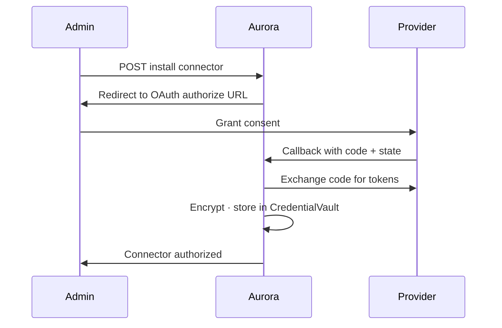
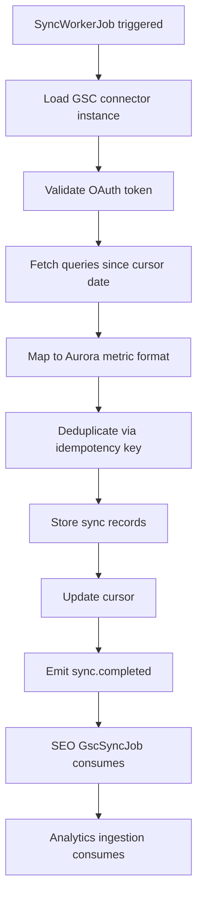
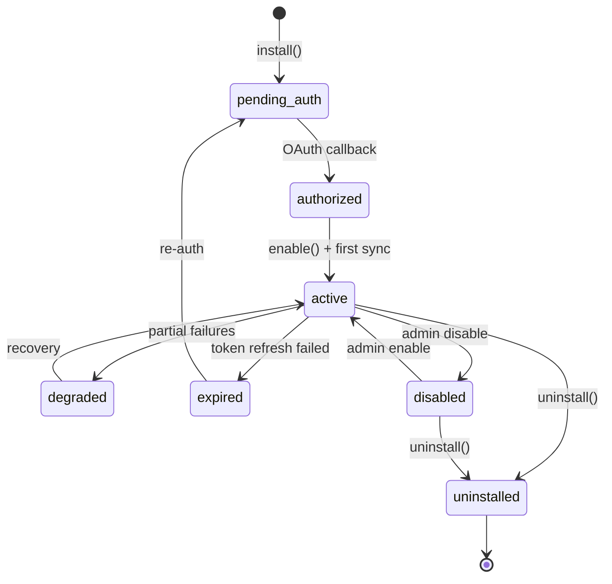

# ES-AURORA-014 — Aurora Enterprise Integrations & Connector Framework Implementation Specification

**Document ID:** ES-AURORA-014  
**Program:** Project Aurora — AI Marketing Platform  
**Mission:** A-016 — Enterprise Integrations & Connector Framework  
**Prior Missions:** A-007 (ES-AURORA-005) · A-008 (ES-AURORA-006) · A-009 (ES-AURORA-007) · A-010 (ES-AURORA-008) · A-011 (ES-AURORA-009) · A-012 (ES-AURORA-010) · A-013 (ES-AURORA-011) · A-014 (ES-AURORA-012) · A-015 (ES-AURORA-013)  
**Version:** 1.0  
**Status:** Ratified — Authoritative Engineering Specification  
**Classification:** Engineering Specification · Integrations · Connectors · OAuth · Synchronization · Enterprise Systems  
**Authority:** Founder & Chief Architect · Aurora Architecture Review Board  
**Architecture Source:** [A-001 Aurora Constitution](../A-001-Aurora-Constitution.md) · [A-002 Enterprise Engineering Blueprint](../A-002-Aurora-Enterprise-Engineering-Blueprint.md) · [A-003 AI Workforce Architecture](../A-003-Aurora-AI-Workforce-Architecture.md) · [A-004 Enterprise Knowledge & Memory](../A-004-Aurora-Enterprise-Knowledge-and-Memory-Architecture.md)  
**Platform Parent:** [ES-AURORA-005](./ES-AURORA-005-Platform-Foundation-Implementation-Specification.md) · [ES-AURORA-006](./ES-AURORA-006-Identity-Tenant-and-Configuration-Foundation.md) · [ES-AURORA-007](./ES-AURORA-007-Enterprise-Knowledge-Graph-and-Memory-Infrastructure.md) · [ES-AURORA-008](./ES-AURORA-008-AI-Workforce-Runtime-Implementation-Specification.md) · [ES-AURORA-009](./ES-AURORA-009-Content-Studio-and-Asset-Management-Implementation-Specification.md) · [ES-AURORA-010](./ES-AURORA-010-SEO-Intelligence-Engine-Implementation-Specification.md) · [ES-AURORA-011](./ES-AURORA-011-Campaign-Planning-and-Orchestration-Implementation-Specification.md) · [ES-AURORA-012](./ES-AURORA-012-Analytics-and-Performance-Intelligence-Implementation-Specification.md) · [ES-AURORA-013](./ES-AURORA-013-Channel-Publishing-and-Distribution-Implementation-Specification.md)  
**Effective Date:** 7 August 2026  
**Subordinate To:** A-001 · A-002 · A-003 · A-004 · A-005 · ES-AURORA-005 · ES-AURORA-006 · ES-AURORA-007 · ES-AURORA-008 · ES-AURORA-009 · ES-AURORA-010 · ES-AURORA-011 · ES-AURORA-012 · ES-AURORA-013

**Rule:** This document is the **authoritative engineering specification** for Aurora Enterprise Integrations & Connector Framework (Mission A-016). All code in `lib/aurora/integrations/` must comply. **No production implementation in this document.** **Specification only.**

**Scope:** Connector platform · authentication · credential management · enterprise connectors · synchronization · connector runtime · security · ORION integration. **Excludes:** Integration UI (A-019) · marketplace distribution (Phase 3) · native email sending (A-048).

---

## Engineering Principles (Binding)

| # | Principle | Enforcement |
|---|-----------|-------------|
| **INT-1** | **All connectors are replaceable** | ConnectorPlugin · registry · versioned manifests |
| **INT-2** | **Connectors are isolated** | Per-connector workers · circuit breakers · no shared mutable state |
| **INT-3** | **No connector contains business logic** | Connectors transport data only · domain logic in Aurora modules |
| **INT-4** | **Authentication is centralized** | CredentialVault · OAuthService · no ad-hoc token storage |
| **INT-5** | **Secrets are never exposed** | Encrypted at rest · never logged · never returned in API responses |
| **INT-6** | **Synchronization is idempotent** | Idempotency keys · deduplication · safe replay |
| **INT-7** | **Failures are isolated** | One connector failure does not affect others |
| **INT-8** | **Every connector emits events** | Lifecycle · sync · auth · health events on ORION Event Bus |
| **INT-9** | **All connector activity is auditable** | ConnectorAuditRecord on every operation |
| **INT-10** | **Future connectors require zero runtime changes** | Plugin registration · ConnectorSDK · manifest-driven |

---

## Table of Contents

1. [Executive Overview](#1-executive-overview)
2. [Connector Platform](#2-connector-platform)
3. [Authentication & Credential Management](#3-authentication--credential-management)
4. [Enterprise Connectors](#4-enterprise-connectors)
5. [Synchronization Engine](#5-synchronization-engine)
6. [Connector Runtime](#6-connector-runtime)
7. [Security & Compliance](#7-security--compliance)
8. [ORION Integration](#8-orion-integration)
9. [Testing Strategy](#9-testing-strategy)
10. [Engineering Standards](#10-engineering-standards)
11. [Acceptance Criteria](#11-acceptance-criteria)
12. [Executive Recommendation](#12-executive-recommendation)

**Appendices:** [A — Connector Catalogue](#appendix-a--connector-catalogue) · [B — Authentication Matrix](#appendix-b--authentication-matrix) · [C — Synchronization Flows](#appendix-c--synchronization-flows) · [D — Security Matrix](#appendix-d--security-matrix) · [E — Connector Lifecycle](#appendix-e--connector-lifecycle) · [F — Implementation Checklist](#appendix-f--implementation-checklist)

---

# Preamble

External platforms are Aurora's reach beyond the boundary.

The Enterprise Integrations & Connector Framework provides **secure, auditable, replaceable connectivity** to Google · Meta · CRM · commerce · and enterprise systems — with centralized authentication, idempotent synchronization, isolated failures, and a plugin architecture that welcomes tomorrow's connectors without rewriting today's runtime.

Connect once. Govern always. Sync with confidence.

---

# 1. Executive Overview

## 1.1 Purpose

| Field | Definition |
|-------|------------|
| **Document purpose** | Implementation specification for Enterprise Integrations & Connector Framework |
| **Audience** | Integration engineers · security engineers · backend engineers · DevOps · enterprise architects |
| **Binding authority** | Mission A-016 · all `lib/aurora/integrations/` code |
| **Deliverable type** | Engineering specification — no code |

## 1.2 Scope

### In Scope (A-016)

| Area | Coverage |
|------|----------|
| **Connector platform** | Runtime · registry · factory · manager · lifecycle · configuration · policies |
| **Authentication** | OAuth 2.0 · OIDC · API keys · refresh tokens · secret storage · rotation |
| **Enterprise connectors** | 18 Phase 1–3 connectors · ConnectorSDK |
| **Synchronization** | Bidirectional · incremental · full · event-driven · conflict resolution · DLQ |
| **Connector runtime** | Health · heartbeat · circuit breaker · rate limiting · versioning |
| **Security** | Tenant isolation · encryption · audit · compliance · data residency |
| **ORION integration** | Identity · PlatformStore · modules · Event Bus · Executive Provider |

### Out of Scope

| Exclusion | Mission |
|-----------|---------|
| Integration management UI | A-019 |
| Connector marketplace | Phase 3 |
| Advertising Studio campaign UI | A-021 |
| Native SMTP email sending | A-048 |
| CRM/Finance knowledge bridge detail | A-033 |

### Phase Delivery

| Phase | Connectors |
|-------|------------|
| **A-016 Phase 1 (P0)** | GSC · GA4 · Meta Facebook · Meta Instagram · OAuth framework |
| **A-016 Phase 1 complete** | Google Ads · GBP · LinkedIn · X · YouTube |
| **Phase 2** | WordPress · Shopify · Mailchimp · HubSpot · Salesforce |
| **Phase 3** | WooCommerce · Brevo · Microsoft 365 · marketplace SDK |

## 1.3 Objectives

| # | Objective | Success Criteria |
|---|-----------|-----------------|
| 1 | **Connector platform operational** | Registry · factory · lifecycle |
| 2 | **Centralized OAuth** | CredentialVault · token refresh · rotation |
| 3 | **Phase 1 connectors live** | GSC · GA4 · Facebook · Instagram |
| 4 | **Sync engine idempotent** | Incremental sync · deduplication |
| 5 | **Health monitoring** | Heartbeat · circuit breaker · alerts |
| 6 | **Publish integration** | ES-AURORA-013 live social connectors |
| 7 | **Analytics integration** | ES-AURORA-012 GA4/GSC ingestion |
| 8 | **SEO integration** | ES-AURORA-010 GSC daily sync |
| 9 | **Tenant isolation** | Zero cross-tenant credential access |
| 10 | **ConnectorSDK documented** | Third-party connector path defined |

## 1.4 Relationship with Architecture Documents

| Document | ES-AURORA-014 Response |
|----------|------------------------|
| **A-001 Aurora Constitution** | Integration Layer · ORION Integration Hub · connector registry · OAuth patterns |
| **A-002 Enterprise Blueprint** | `lib/aurora/integrations/` · Connector · Credential · SyncRecord entities |
| **A-003 AI Workforce Architecture** | Connectors supply data to Analytics Manager · Social Media Manager |
| **A-004 Knowledge Architecture** | Sync outcomes enrich external data records |
| **A-005 Module Runtime Spec** | IntegrationsModuleRuntime · sync workers · health jobs |
| **A-006 Mission Backlog** | Mission A-016 · EP-INTEGRATE · F-190–F-200 |
| **A-007 Platform Foundation** | ES-AURORA-005 · connector infrastructure stub · Event Bus |
| **A-008 Identity & Tenant** | ES-AURORA-006 · `aurora.integrations.*` permissions · OAuth consent |
| **A-009 Knowledge Graph** | ES-AURORA-007 · external entity ingestion |
| **A-010 AI Workforce Runtime** | ES-AURORA-008 · agent tasks consuming connector data |
| **A-011 Content Studio** | ES-AURORA-009 · WordPress publish · asset URLs |
| **A-012 SEO Intelligence** | ES-AURORA-010 · GSC connector · rank/query sync |
| **A-013 Campaign Planning** | ES-AURORA-011 · ads connector data · channel readiness |
| **A-014 Analytics** | ES-AURORA-012 · GA4 metric ingestion |
| **A-015 Publishing** | ES-AURORA-013 · ChannelConnector implementations via integration layer |

### Dependency Chain

```
ES-AURORA-005 (Platform)
    └── ES-AURORA-006 (Identity)
        └── ES-AURORA-013 (Publish) + ES-AURORA-010 (SEO) + ES-AURORA-012 (Analytics)
            └── ES-AURORA-014 (Integrations) ← this document
                └── A-016.1 Phase I Certification ← authorized next
```

---

# 2. Connector Platform

## 2.1 IntegrationsModuleRuntime

**File:** `lib/aurora/integrations/IntegrationsModuleRuntime.ts`

```typescript
export class IntegrationsModuleRuntime implements AuroraModuleRuntime {
  readonly moduleKey = 'integrations';
  readonly displayName = 'Enterprise Integrations & Connectors';
  readonly phase = 1 as const;
  readonly tier = 1;
  readonly dependencies = ['admin'] as const;
}
```

## 2.2 ConnectorRuntime

**File:** `lib/aurora/integrations/ConnectorRuntime.ts`

```typescript
export interface ConnectorRuntime {
  initialize(ctx: AuroraRuntimeContext): Promise<void>;
  shutdown(ctx: AuroraRuntimeContext): Promise<void>;
  getHealth(ctx: AuroraRuntimeContext): Promise<IntegrationsHealthStatus>;
  startSyncWorkers(ctx: AuroraRuntimeContext): Promise<void>;
  stopSyncWorkers(ctx: AuroraRuntimeContext): Promise<void>;
}
```

## 2.3 ConnectorRegistry

**File:** `lib/aurora/integrations/registry/ConnectorRegistry.ts`

**INT-1 · INT-10:** Plugin-based registration.

```typescript
export interface ConnectorRegistry {
  register(manifest: ConnectorManifest, factory: ConnectorFactory): void;
  unregister(connectorId: string): void;
  get(connectorId: string): RegisteredConnector | null;
  list(ctx: AuroraRuntimeContext): Promise<readonly ConnectorSummary[]>;
  listAvailable(ctx: AuroraRuntimeContext): Promise<readonly ConnectorSummary[]>;
  getManifest(connectorId: string): ConnectorManifest | null;
}
```

## 2.4 ConnectorFactory

```typescript
export interface ConnectorFactory {
  create(ctx: AuroraRuntimeContext, config: ConnectorInstanceConfig): Promise<EnterpriseConnector>;
}

export interface EnterpriseConnector {
  readonly manifest: ConnectorManifest;
  connect(ctx: AuroraRuntimeContext): Promise<ConnectionResult>;
  disconnect(ctx: AuroraRuntimeContext): Promise<void>;
  sync(ctx: AuroraRuntimeContext, options: SyncOptions): Promise<SyncResult>;
  getHealth(ctx: AuroraRuntimeContext): Promise<ConnectorHealth>;
  publish?(ctx: AuroraRuntimeContext, payload: PublishPayload): Promise<PublishResult>;
  verify?(ctx: AuroraRuntimeContext, result: PublishResult): Promise<VerificationResult>;
}
```

## 2.5 ConnectorManager

**File:** `lib/aurora/integrations/ConnectorManager.ts`

```typescript
export interface ConnectorManager {
  install(ctx: AuroraRuntimeContext, connectorId: string, config: InstallConfig): Promise<ConnectorInstance>;
  configure(ctx: AuroraRuntimeContext, instanceId: string, config: UpdateConfig): Promise<ConnectorInstance>;
  enable(ctx: AuroraRuntimeContext, instanceId: string): Promise<ConnectorInstance>;
  disable(ctx: AuroraRuntimeContext, instanceId: string): Promise<ConnectorInstance>;
  uninstall(ctx: AuroraRuntimeContext, instanceId: string): Promise<void>;
  getInstance(ctx: AuroraRuntimeContext, instanceId: string): Promise<ConnectorInstance | null>;
  listInstances(ctx: AuroraRuntimeContext): Promise<readonly ConnectorInstance[]>;
  triggerSync(ctx: AuroraRuntimeContext, instanceId: string, mode: SyncMode): Promise<SyncResult>;
}
```

## 2.6 ConnectorLifecycle

| State | Description | Transitions |
|-------|-------------|-------------|
| `pending_auth` | Installed · awaiting OAuth | → authorized · uninstalled |
| `authorized` | Credentials valid | → active · disabled |
| `active` | Syncing · operational | → degraded · disabled |
| `degraded` | Partial failure · circuit half-open | → active · disabled |
| `disabled` | Admin disabled | → active |
| `expired` | Token expired · refresh failed | → pending_auth · disabled |
| `uninstalled` | Removed | terminal |

## 2.7 ConnectorConfiguration

```typescript
export interface ConnectorInstanceConfig {
  readonly connectorId: string;
  readonly brandId: string;
  readonly settings: Record<string, unknown>;
  readonly syncSchedule?: SyncSchedule;
  readonly enabledCapabilities: readonly ConnectorCapability[];
}
```

## 2.8 ConnectorPolicies

```typescript
export interface ConnectorPolicies {
  validateInstall(ctx: AuroraRuntimeContext, connectorId: string): Promise<PolicyResult>;
  validateSync(ctx: AuroraRuntimeContext, instanceId: string): Promise<PolicyResult>;
  getRateLimits(connectorId: string): RateLimitConfig;
  getDataResidencyPolicy(ctx: AuroraRuntimeContext): DataResidencyPolicy;
}
```

## 2.9 IntegrationRepository

**Tables:**
- `aurora_connector_instance`
- `aurora_connector_credential`
- `aurora_connector_sync_state`
- `aurora_connector_sync_record`
- `aurora_connector_audit`
- `aurora_connector_dlq`
- `aurora_oauth_state`

## 2.10 Connector APIs

| Method | Route | Permission |
|--------|-------|------------|
| `GET` | `/api/aurora/integrations/connectors` | `aurora.integrations.read` |
| `GET` | `/api/aurora/integrations/instances` | `aurora.integrations.read` |
| `POST` | `/api/aurora/integrations/instances` | `aurora.integrations.admin` |
| `PATCH` | `/api/aurora/integrations/instances/:id` | `aurora.integrations.admin` |
| `DELETE` | `/api/aurora/integrations/instances/:id` | `aurora.integrations.admin` |
| `POST` | `/api/aurora/integrations/instances/:id/sync` | `aurora.integrations.write` |
| `GET` | `/api/aurora/integrations/instances/:id/health` | `aurora.integrations.read` |
| `GET` | `/api/aurora/integrations/oauth/authorize/:connectorId` | `aurora.integrations.admin` |
| `GET` | `/api/aurora/integrations/oauth/callback` | Public (state-validated) |
| `POST` | `/api/aurora/integrations/instances/:id/refresh` | `aurora.integrations.admin` |

---

# 3. Authentication & Credential Management

## 3.1 OAuthService

**File:** `lib/aurora/integrations/auth/OAuthService.ts`

**INT-4 · INT-5:** Centralized authentication.

```typescript
export interface OAuthService {
  initiateAuthorization(ctx: AuroraRuntimeContext, connectorId: string, redirectUri: string): Promise<OAuthAuthorizationUrl>;
  handleCallback(ctx: AuroraRuntimeContext, code: string, state: string): Promise<CredentialRecord>;
  refreshToken(ctx: AuroraRuntimeContext, instanceId: string): Promise<CredentialRecord>;
  revokeToken(ctx: AuroraRuntimeContext, instanceId: string): Promise<void>;
  validateToken(ctx: AuroraRuntimeContext, instanceId: string): Promise<TokenValidationResult>;
}
```

## 3.2 OAuth 2.0 Flow



**State parameter:** CSRF-protected · tenant-scoped · 10-minute expiry.

## 3.3 OpenID Connect

Used for Google · Microsoft 365 connectors. ID token validated · `sub` stored as external account reference.

## 3.4 API Keys

Non-OAuth connectors (legacy APIs · webhooks):

```typescript
export interface ApiKeyCredential {
  readonly keyId: string;
  readonly encryptedKey: string;          // Never plaintext in DB
  readonly headerName: string;            // e.g. X-API-Key
  readonly prefix?: string;
}
```

Stored via CredentialVault · rotatable without connector reinstall.

## 3.5 CredentialVault

**File:** `lib/aurora/integrations/auth/CredentialVault.ts`

```typescript
export interface CredentialVault {
  store(ctx: AuroraRuntimeContext, instanceId: string, credential: EncryptedCredential): Promise<void>;
  retrieve(ctx: AuroraRuntimeContext, instanceId: string): Promise<DecryptedCredential>;
  rotate(ctx: AuroraRuntimeContext, instanceId: string, newCredential: EncryptedCredential): Promise<void>;
  delete(ctx: AuroraRuntimeContext, instanceId: string): Promise<void>;
}
```

**Encryption:** AES-256-GCM · tenant-specific data encryption key · master key in HSM/env.

**INT-5:** Credentials never appear in logs · API responses · error messages.

## 3.6 Refresh Tokens

| Rule | Implementation |
|------|---------------|
| Auto-refresh | TokenRefreshJob · 24h before expiry |
| Refresh failure | Status → `expired` · notify admin |
| Max refresh attempts | 3 · then require re-auth |
| Refresh token rotation | Store new refresh token on each refresh |

## 3.7 Credential Rotation

Admin-initiated or scheduled rotation:

```
Admin triggers rotation
    → New OAuth flow or API key entry
    → Validate new credential
    → Atomic swap in CredentialVault
    → Revoke old token
    → Audit record
```

## 3.8 Token Validation

Pre-operation validation on every connector call:

| Check | Action |
|-------|--------|
| Token exists | Proceed |
| Token expired | Auto-refresh |
| Refresh failed | Fail · status `expired` |
| Scope insufficient | Fail · alert admin |

## 3.9 Session Management

OAuth state sessions stored in `aurora_oauth_state` with TTL. No long-lived browser sessions — server-side token storage only.

---

# 4. Enterprise Connectors

## 4.1 Connector Manifest

```typescript
export interface ConnectorManifest {
  readonly id: string;                    // e.g. google.gsc
  readonly displayName: string;
  readonly version: string;
  readonly phase: 1 | 2 | 3;
  readonly authType: 'oauth2' | 'oidc' | 'api_key';
  readonly oauthConfig?: OAuthConfig;
  readonly scopes: readonly string[];
  readonly capabilities: readonly ConnectorCapability[];
  readonly supportedOperations: readonly ConnectorOperation[];
  readonly rateLimits: RateLimitConfig;
  readonly dataClassification: DataClassification;
}
```

**INT-3:** Connectors implement transport only — no campaign logic · no content approval.

## 4.2 Phase 1 Connectors (P0)

| Connector ID | Platform | Auth | Capabilities | Consumer Modules |
|--------------|----------|------|-------------|-----------------|
| `google.gsc` | Google Search Console | OAuth 2.0 | sync.read | SEO · Analytics |
| `google.ga4` | Google Analytics 4 | OAuth 2.0 | sync.read | Analytics |
| `meta.facebook` | Meta Facebook Pages | OAuth 2.0 | sync.read · publish.write | Publish · Analytics |
| `meta.instagram` | Meta Instagram | OAuth 2.0 | sync.read · publish.write | Publish · Analytics |

## 4.3 Google Search Console Connector

| Operation | Direction | Data |
|-----------|-----------|------|
| Query sync | Inbound | Queries · impressions · clicks · CTR · position |
| Page sync | Inbound | Top pages · performance |
| Sitemap status | Inbound | Index coverage |

**Schedule:** Daily 03:00 UTC · incremental by date.  
**Consumer:** ES-AURORA-010 GscSyncJob · ES-AURORA-012 ingestion.

## 4.4 Google Analytics 4 Connector

| Operation | Direction | Data |
|-----------|-----------|------|
| Session metrics | Inbound | Sessions · users · bounce rate |
| Event metrics | Inbound | Conversions · goals |
| Page metrics | Inbound | Page views · engagement |

**Schedule:** Daily 04:00 UTC.  
**Consumer:** ES-AURORA-012 AnalyticsIngestionService.

## 4.5 Meta Facebook Connector

| Operation | Direction | Data |
|-----------|-----------|------|
| Page insights | Inbound | Reach · engagement |
| Publish post | Outbound | ES-AURORA-013 FacebookConnector |
| Post insights | Inbound | Per-post metrics |

## 4.6 Meta Instagram Connector

| Operation | Direction | Data |
|-----------|-----------|------|
| Publish post/reel | Outbound | ES-AURORA-013 InstagramConnector |
| Account insights | Inbound | Follower · reach metrics |
| Media insights | Inbound | Per-post engagement |

## 4.7 Phase 1 Complete Connectors

| Connector ID | Platform | Phase | Primary Use |
|--------------|----------|:-----:|-------------|
| `google.gbp` | Google Business Profile | 1 | Local · publish |
| `google.ads` | Google Ads | 1 | Campaign sync · ROAS |
| `linkedin` | LinkedIn | 1 | B2B publish · ads |
| `x.twitter` | X (Twitter) | 1 | Social publish |
| `youtube` | YouTube | 1 | Video publish · analytics |

## 4.8 Phase 2 Connectors

| Connector ID | Platform | Capabilities |
|--------------|----------|-------------|
| `wordpress` | WordPress | publish.write · sync.read |
| `shopify` | Shopify | sync.read · product catalog |
| `mailchimp` | Mailchimp | sync.read · publish.write |
| `hubspot` | HubSpot | sync.read · CRM contacts |
| `salesforce` | Salesforce | sync.read · leads · opportunities |

## 4.9 Phase 3 Connectors

| Connector ID | Platform | Notes |
|--------------|----------|-------|
| `woocommerce` | WooCommerce | E-commerce sync |
| `brevo` | Brevo (Sendinblue) | Email · SMS |
| `microsoft.m365` | Microsoft 365 | Outlook · Teams |
| `canva` | Canva | Design import (A-028) |

## 4.10 Future Connector SDK

**File:** `lib/aurora/integrations/sdk/ConnectorSDK.ts`

```typescript
export abstract class BaseConnector implements EnterpriseConnector {
  abstract readonly manifest: ConnectorManifest;
  protected abstract doSync(ctx: AuroraRuntimeContext, options: SyncOptions): Promise<SyncResult>;
  // Standard: connect · disconnect · getHealth · audit · events
}

export function registerConnector(manifest: ConnectorManifest, factory: ConnectorFactory): void {
  ConnectorRegistry.register(manifest, factory);
}
```

Third-party connectors register via manifest + factory — zero runtime core changes (**INT-10**).

## 4.11 Google Business Profile Connector

| Operation | Direction | Data |
|-----------|-----------|------|
| Local post publish | Outbound | ES-AURORA-013 GbpConnector |
| Review sync | Inbound | Rating · response status |
| Insights | Inbound | Views · actions · search queries |

## 4.12 Google Ads Connector

| Operation | Direction | Data |
|-----------|-----------|------|
| Campaign sync | Inbound | Campaign · ad group · ad status |
| Performance sync | Inbound | Spend · impressions · clicks · conversions |
| Budget sync | Inbound | Daily budget · pacing |

**Consumer:** ES-AURORA-011 BudgetService · ES-AURORA-012 ROAS metrics.

## 4.13 LinkedIn · X · YouTube Connectors

| Connector | Publish | Sync | Notes |
|-----------|:-------:|:----:|-------|
| LinkedIn | ✅ | ✅ | Company page · article · B2B focus |
| X (Twitter) | ✅ | ✅ | Thread support · media attachments |
| YouTube | ✅ | ✅ | Video upload · thumbnail · analytics |

Phase 1 complete · OAuth via respective platforms · rate limits per manifest.

## 4.14 WordPress Connector

| Operation | Direction | Data |
|-----------|-----------|------|
| Create/update post | Outbound | Blog publish via REST API |
| Media upload | Outbound | Featured images from Content Studio |
| Category/tag sync | Bidirectional | Taxonomy alignment |
| SEO plugin meta | Outbound | Yoast/RankMath meta fields |

**Consumer:** ES-AURORA-013 BlogConnector · ES-AURORA-009 content publish.

## 4.15 Shopify · WooCommerce Connectors

| Operation | Direction | Data |
|-----------|-----------|------|
| Product catalog | Inbound | SKU · price · inventory |
| Order sync | Inbound | Revenue · attribution (A-033) |
| Customer sync | Inbound | Anonymous ID mapping |

Phase 2/3 · supports e-commerce attribution in ES-AURORA-012.

## 4.16 Mailchimp · Brevo Connectors

| Operation | Direction | Data |
|-----------|-----------|------|
| List sync | Inbound | Audience segments |
| Campaign send | Outbound | Email publish (replaces A-015 stub) |
| Campaign analytics | Inbound | Opens · clicks · bounces |

## 4.17 HubSpot · Salesforce Connectors

| Operation | Direction | Data |
|-----------|-----------|------|
| Contact sync | Bidirectional | Lead · customer records |
| Deal/opportunity | Inbound | Pipeline · revenue |
| Activity log | Outbound | Campaign touchpoints |

Phase 2 · CRM bridge for attribution and lead tracking (A-033 extension).

## 4.18 Microsoft 365 Connector

| Operation | Direction | Data |
|-----------|-----------|------|
| Outlook calendar | Inbound | Campaign milestone alignment (Phase 3) |
| Teams notifications | Outbound | Approval alerts (ORION Notifications) |
| SharePoint assets | Inbound | Enterprise document references |

OIDC auth · enterprise tier only.

---

# 5. Synchronization Engine

## 5.1 SyncEngine

**File:** `lib/aurora/integrations/sync/SyncEngine.ts`

```typescript
export interface SyncEngine {
  runSync(ctx: AuroraRuntimeContext, instanceId: string, mode: SyncMode): Promise<SyncResult>;
  runIncrementalSync(ctx: AuroraRuntimeContext, instanceId: string): Promise<SyncResult>;
  runFullSync(ctx: AuroraRuntimeContext, instanceId: string): Promise<SyncResult>;
  handleWebhook(ctx: AuroraRuntimeContext, instanceId: string, payload: WebhookPayload): Promise<SyncResult>;
  reconcile(ctx: AuroraRuntimeContext, instanceId: string): Promise<ReconciliationReport>;
}
```

## 5.2 Sync Modes

| Mode | Description | Use Case |
|------|-------------|----------|
| `incremental` | Delta since last sync cursor | Daily scheduled sync |
| `full` | Complete data refresh | Initial connect · weekly reconciliation |
| `event_driven` | Triggered by webhook/event | Real-time updates (Phase 2) |
| `manual` | Admin-triggered | On-demand refresh |

## 5.3 Bidirectional Sync

| Direction | Description | Example |
|-----------|-------------|---------|
| **Inbound** | External → Aurora | GSC queries · GA4 metrics |
| **Outbound** | Aurora → External | WordPress publish · Mailchimp campaign |
| **Bidirectional** | Both directions | HubSpot contacts · Shopify products |

Default Phase 1: inbound-heavy · outbound via publish connectors.

## 5.4 Incremental Sync

```typescript
export interface SyncCursor {
  readonly instanceId: string;
  readonly cursorType: string;
  readonly cursorValue: string;
  readonly lastSyncAt: string;
  readonly recordsSynced: number;
}
```

**INT-6:** Idempotency key = `{instanceId}:{externalId}:{recordType}:{version}`.

## 5.5 Full Sync

Weekly reconciliation job compares external record count vs. Aurora store · flags drift > 5%.

## 5.6 Event-Driven Sync

Webhook endpoints: `/api/aurora/integrations/webhooks/:connectorId`

| Event | Action |
|-------|--------|
| Meta page update | Trigger insights sync |
| Shopify order | Attribution touchpoint (A-033) |
| HubSpot contact change | CRM sync (Phase 2) |

## 5.7 Conflict Resolution

| Strategy | When |
|----------|------|
| **External wins** | Analytics metrics · platform insights |
| **Aurora wins** | Published content metadata |
| **Latest timestamp** | Bidirectional CRM fields |
| **Manual review** | Unresolvable conflicts · queue for admin |

## 5.8 Reconciliation

**Job:** `SyncReconciliationJob` — weekly

```typescript
export interface ReconciliationReport {
  readonly instanceId: string;
  readonly externalCount: number;
  readonly auroraCount: number;
  readonly drift: number;
  readonly missingInAurora: readonly string[];
  readonly missingExternal: readonly string[];
  readonly conflicts: readonly SyncConflict[];
}
```

## 5.9 Retry Policies

| Attempt | Delay | Action |
|:-------:|-------|--------|
| 1 | Immediate | First try |
| 2 | 1 min | Backoff |
| 3 | 5 min | Backoff |
| 4 | 15 min | Backoff |
| 5 | 1 hour | Final |
| Exhausted | — | DLQ · alert |

Non-retryable: `AUTH_EXPIRED` · `SCOPE_INSUFFICIENT` · `RATE_LIMIT_PERMANENT`.

## 5.10 Dead Letter Queue

```typescript
export interface SyncDlqEntry {
  readonly id: string;
  readonly instanceId: string;
  readonly syncMode: SyncMode;
  readonly errorCode: string;
  readonly errorMessage: string;
  readonly payload?: Record<string, unknown>;
  readonly attempts: number;
  readonly movedAt: string;
}
```

## 5.11 Recovery

| Scenario | Recovery |
|----------|----------|
| Transient failure | Auto-retry |
| Auth expired | Re-auth flow · admin notification |
| DLQ entry | Manual retry or dismiss |
| Data corruption | Full sync · reconciliation |

## 5.12 SyncWorkerJob

**Schedule:** Per connector instance schedule (default daily) + on-demand

```
SyncWorkerJob
    ├── Load connector instance
    ├── Validate token
    ├── Execute sync (incremental default)
    ├── Update cursor
    ├── Emit aurora.integration.sync.completed
    └── On failure → retry or DLQ
```

---

# 6. Connector Runtime

## 6.1 ConnectorHealthService

**File:** `lib/aurora/integrations/health/ConnectorHealthService.ts`

```typescript
export interface ConnectorHealthService {
  checkHealth(ctx: AuroraRuntimeContext, instanceId: string): Promise<ConnectorHealth>;
  getPlatformHealth(ctx: AuroraRuntimeContext): Promise<IntegrationsHealthStatus>;
  recordHeartbeat(ctx: AuroraRuntimeContext, instanceId: string): Promise<void>;
}
```

## 6.2 Health States

| State | Criteria |
|-------|----------|
| `healthy` | Token valid · last sync success · circuit closed |
| `degraded` | Last sync partial · circuit half-open |
| `unhealthy` | Auth failed · circuit open · sync failing |
| `unknown` | Never synced · pending auth |

## 6.3 Heartbeat

**Job:** `ConnectorHeartbeatJob` — every 5 minutes

Probes each active connector with lightweight API call (e.g. GSC sites list · Meta `/me`).

## 6.4 Circuit Breaker

| State | Behavior |
|-------|----------|
| Closed | Normal |
| Open | Fail fast · skip sync/publish · alert |
| Half-open | Single probe |

Threshold: 5 failures in 5 minutes → open for 10 minutes. **INT-7:** Per-connector isolation.

## 6.5 Rate Limiting

```typescript
export interface RateLimitConfig {
  readonly requestsPerMinute: number;
  readonly requestsPerDay?: number;
  readonly burstSize: number;
  readonly strategy: 'token_bucket' | 'sliding_window';
}
```

Per-connector limits from manifest · enforced by RateLimiterService.

## 6.6 Timeout Management

| Operation | Default Timeout |
|-----------|:---------------:|
| OAuth token exchange | 30s |
| Sync batch | 5 min |
| Publish operation | 60s |
| Health probe | 10s |

## 6.7 Backoff Strategy

Exponential backoff with jitter for retries. Max delay 1 hour. Documented per connector in manifest.

## 6.8 Version Management

| Field | Purpose |
|-------|---------|
| `manifest.version` | Connector plugin version |
| `apiVersion` | External API version pinned |
| `minRuntimeVersion` | Minimum Aurora runtime |

Breaking API changes → new connector plugin version · old version deprecated.

## 6.9 Deprecation Policy

| Stage | Duration | Action |
|-------|:--------:|--------|
| Announce | 90 days before | Notify tenants |
| Deprecated | 90 days | Warning on use |
| Removed | After period | Block new installs · migrate existing |

---

# 7. Security & Compliance

## 7.1 Tenant Isolation

**INT-7 · INT-5:**
- RLS on all integration tables
- Credentials scoped to tenant + brand
- OAuth state tenant-bound
- No cross-tenant token access possible

## 7.2 Permission Validation

| Permission | Scope |
|------------|-------|
| `aurora.integrations.read` | View connectors · instances · health |
| `aurora.integrations.write` | Trigger sync |
| `aurora.integrations.admin` | Install · configure · OAuth · revoke |

Install/uninstall requires `admin` role or `aurora.integrations.admin`.

## 7.3 Encryption

| Data | Method |
|------|--------|
| Credentials at rest | AES-256-GCM · tenant DEK |
| Credentials in transit | TLS 1.3 |
| OAuth state | Signed · encrypted cookie |
| Sync payloads | TLS · no PII in logs |

## 7.4 Secret Management

**INT-5:** Secrets never in:
- Application logs
- Error responses
- Event payloads
- Database plaintext columns
- Git repositories

Master encryption key in environment/HSM · rotated annually.

## 7.5 Audit Logging

**INT-9:**

```typescript
export interface ConnectorAuditRecord {
  readonly id: string;
  readonly instanceId: string;
  readonly action: ConnectorAuditAction;
  readonly actorId: string;
  readonly connectorId: string;
  readonly outcome: 'success' | 'failure';
  readonly metadata?: Record<string, unknown>;  // No secrets
  readonly correlationId: string;
  readonly timestamp: string;
}
```

| Action | Trigger |
|--------|---------|
| `installed` | ConnectorManager.install |
| `authorized` | OAuth callback success |
| `sync_started` | SyncEngine.runSync |
| `sync_completed` | Sync success |
| `sync_failed` | Sync failure |
| `token_refreshed` | OAuthService.refreshToken |
| `token_revoked` | OAuthService.revokeToken |
| `disabled` | Admin disable |
| `uninstalled` | ConnectorManager.uninstall |

## 7.6 Compliance

| Requirement | Implementation |
|-------------|---------------|
| GDPR | Data minimization · consent tracking · deletion on uninstall |
| SOC 2 | Audit trail · access controls · encryption |
| OAuth best practices | PKCE · state validation · scope minimization |
| Platform ToS | Rate limits · data retention per provider policy |

## 7.7 Data Residency

Configurable per tenant tier (Enterprise):

| Policy | Behavior |
|--------|----------|
| `default` | Process in primary region |
| `eu_only` | Sync workers in EU region · EU credential storage |
| `us_only` | US region enforcement |

## 7.8 Privacy Controls

| Control | Description |
|---------|-------------|
| PII minimization | Store external IDs only · no raw PII in sync records |
| Data retention | Sync records 90 days · credentials until uninstall |
| Right to deletion | Uninstall removes credentials + sync state |
| Scope limitation | Request minimum OAuth scopes per connector |

---

# 8. ORION Integration

## 8.1 Identity

OAuth consent flows require authenticated Aurora admin. Brand context enforced on connector instance creation.

## 8.2 PlatformStore

**Migration:** `migrations/aurora/014_integrations.sql`

```sql
CREATE TABLE aurora_connector_instance (
  id UUID PRIMARY KEY DEFAULT gen_random_uuid(),
  tenant_id UUID NOT NULL,
  brand_id UUID NOT NULL,
  connector_id TEXT NOT NULL,
  status TEXT NOT NULL DEFAULT 'pending_auth',
  settings JSONB,
  sync_schedule JSONB,
  enabled_capabilities TEXT[],
  installed_by UUID NOT NULL,
  installed_at TIMESTAMPTZ NOT NULL DEFAULT now(),
  updated_at TIMESTAMPTZ NOT NULL DEFAULT now()
);

CREATE TABLE aurora_connector_credential (
  id UUID PRIMARY KEY DEFAULT gen_random_uuid(),
  tenant_id UUID NOT NULL,
  instance_id UUID NOT NULL REFERENCES aurora_connector_instance(id),
  credential_type TEXT NOT NULL,
  encrypted_payload BYTEA NOT NULL,
  expires_at TIMESTAMPTZ,
  scopes TEXT[],
  external_account_id TEXT,
  created_at TIMESTAMPTZ NOT NULL DEFAULT now(),
  rotated_at TIMESTAMPTZ
);

CREATE TABLE aurora_connector_sync_state (
  instance_id UUID PRIMARY KEY REFERENCES aurora_connector_instance(id),
  tenant_id UUID NOT NULL,
  cursor_type TEXT NOT NULL,
  cursor_value TEXT NOT NULL,
  last_sync_at TIMESTAMPTZ,
  last_sync_status TEXT,
  records_synced BIGINT DEFAULT 0
);

CREATE TABLE aurora_connector_sync_record (
  id UUID PRIMARY KEY DEFAULT gen_random_uuid(),
  tenant_id UUID NOT NULL,
  instance_id UUID NOT NULL,
  external_id TEXT NOT NULL,
  record_type TEXT NOT NULL,
  idempotency_key TEXT NOT NULL UNIQUE,
  payload_hash TEXT NOT NULL,
  synced_at TIMESTAMPTZ NOT NULL DEFAULT now()
);

CREATE TABLE aurora_connector_audit (
  id UUID PRIMARY KEY DEFAULT gen_random_uuid(),
  tenant_id UUID NOT NULL,
  instance_id UUID NOT NULL,
  action TEXT NOT NULL,
  actor_id UUID NOT NULL,
  connector_id TEXT NOT NULL,
  outcome TEXT NOT NULL,
  metadata JSONB,
  correlation_id UUID NOT NULL,
  created_at TIMESTAMPTZ NOT NULL DEFAULT now()
);

CREATE TABLE aurora_oauth_state (
  state TEXT PRIMARY KEY,
  tenant_id UUID NOT NULL,
  connector_id TEXT NOT NULL,
  redirect_uri TEXT NOT NULL,
  expires_at TIMESTAMPTZ NOT NULL
);

CREATE INDEX idx_connector_instance_tenant ON aurora_connector_instance(tenant_id, brand_id);
CREATE INDEX idx_sync_record_idempotency ON aurora_connector_sync_record(idempotency_key);
```

## 8.3 Knowledge Graph

Sync outcomes may enrich external reference entities (competitor profiles · product catalog stubs). No raw platform data stored in Knowledge Graph — references only.

## 8.4 AI Workforce

| Agent | Connector Data |
|-------|---------------|
| Analytics Manager | GA4 · social insights |
| SEO Specialist | GSC queries · rankings |
| Social Media Manager | Publish via Meta connectors |
| Advertising Manager | Google/Meta Ads (Phase 2) |

## 8.5 Content Studio

WordPress connector enables blog publish. Canva connector (Phase 3) imports designs.

## 8.6 Campaign Runtime

Ads connectors supply spend · ROAS to ES-AURORA-011 BudgetService. Channel readiness gates check connector `active` status.

## 8.7 Analytics

GA4 + GSC sync feeds ES-AURORA-012 AnalyticsIngestionService. Social insights feed engagement metrics.

## 8.8 Publishing

ES-AURORA-013 ChannelConnector implementations delegate to integration layer:

```
PublishPipeline → ChannelConnector (publish module)
    → ConnectorManager.getInstance(meta.instagram)
    → EnterpriseConnector.publish()
    → Meta Instagram API
```

## 8.9 Event Bus

**INT-8:**

| Event | Payload |
|-------|---------|
| `aurora.integration.installed` | instanceId · connectorId |
| `aurora.integration.authorized` | instanceId · scopes |
| `aurora.integration.sync.started` | instanceId · mode |
| `aurora.integration.sync.completed` | instanceId · recordsCount |
| `aurora.integration.sync.failed` | instanceId · errorCode |
| `aurora.integration.health.degraded` | instanceId · reason |
| `aurora.integration.token.expired` | instanceId |
| `aurora.integration.uninstalled` | instanceId · connectorId |

## 8.10 Executive Provider

Integration health summary in executive dashboards:
- Connected platforms count
- Failed syncs last 24h
- Connectors requiring re-auth

## 8.11 IntegrationsFacadeOperations

```typescript
export interface IntegrationsOperations {
  listConnectors(ctx: AuroraRuntimeContext): Promise<readonly ConnectorSummary[]>;
  listInstances(ctx: AuroraRuntimeContext): Promise<readonly ConnectorInstance[]>;
  install(ctx: AuroraRuntimeContext, connectorId: string, config: InstallConfig): Promise<ConnectorInstance>;
  uninstall(ctx: AuroraRuntimeContext, instanceId: string): Promise<void>;
  initiateOAuth(ctx: AuroraRuntimeContext, connectorId: string): Promise<OAuthAuthorizationUrl>;
  triggerSync(ctx: AuroraRuntimeContext, instanceId: string, mode?: SyncMode): Promise<SyncResult>;
  getHealth(ctx: AuroraRuntimeContext, instanceId: string): Promise<ConnectorHealth>;
  getPlatformHealth(ctx: AuroraRuntimeContext): Promise<IntegrationsHealthStatus>;
}
```

---

# 9. Testing Strategy

## 9.1 Test Structure

```
tests/aurora/
├── unit/integrations/
│   ├── ConnectorRegistry.test.ts
│   ├── OAuthService.test.ts
│   ├── CredentialVault.test.ts
│   ├── SyncEngine.test.ts
│   ├── CircuitBreaker.test.ts
│   └── Idempotency.test.ts
├── integration/integrations/
│   ├── oauthFlow.test.ts
│   ├── gscSync.test.ts
│   ├── ga4Sync.test.ts
│   ├── metaPublish.test.ts
│   ├── syncRetryDlq.test.ts
│   ├── reconciliation.test.ts
│   └── publishIntegration.test.ts
├── contract/integrations/
│   ├── gscConnector.contract.test.ts
│   ├── ga4Connector.contract.test.ts
│   └── metaConnector.contract.test.ts
└── integration/security/
    └── integrationsTenantIsolation.test.ts
```

## 9.2 Coverage Targets

| Layer | Minimum |
|-------|:-------:|
| `lib/aurora/integrations/auth/` | 90% |
| `lib/aurora/integrations/sync/` | 85% |
| `lib/aurora/integrations/connectors/` | 85% |
| **A-016 overall** | **85%** |

## 9.3 Required Tests

| Suite | Minimum |
|-------|:-------:|
| OAuth flow | 20+ |
| Credential vault | 15+ |
| Sync engine | 25+ |
| Connector health | 15+ |
| Circuit breaker | 12+ |
| Idempotency | 15+ |
| Phase 1 connectors | 30+ |
| Security/isolation | 20+ |
| **Total** | **175+** |

## 9.4 Connector Test Scenarios

| ID | Scenario | Expected |
|----|----------|----------|
| CN-01 | OAuth happy path | Credentials stored encrypted |
| CN-02 | Token refresh | New token · no re-auth |
| CN-03 | GSC incremental sync | Cursor updated · no duplicates |
| CN-04 | GA4 metric ingestion | Analytics module receives data |
| CN-05 | Meta publish | ES-AURORA-013 publish succeeds |
| CN-06 | Circuit breaker open | Fail fast · no cascade |

## 9.5 Security Test Scenarios

| ID | Scenario | Expected |
|----|----------|----------|
| SEC-01 | Cross-tenant credential read | 404 · no leak |
| SEC-02 | Secret in API response | Never present |
| SEC-03 | Secret in audit log | Never present |
| SEC-04 | Invalid OAuth state | Rejected |

## 9.6 Performance Benchmarks

| Operation | Target (p95) |
|-----------|:------------:|
| OAuth token exchange | < 3s |
| GSC incremental sync (1 day) | < 30s |
| GA4 daily sync | < 60s |
| Health probe | < 5s |
| Meta publish | < 10s |

---

# 10. Engineering Standards

## 10.1 Folder Layout

```
lib/aurora/integrations/
├── IntegrationsModuleRuntime.ts
├── ConnectorRuntime.ts
├── ConnectorManager.ts
├── registry/
│   ├── ConnectorRegistry.ts
│   └── ConnectorFactory.ts
├── auth/
│   ├── OAuthService.ts
│   ├── CredentialVault.ts
│   └── TokenRefreshJob.ts
├── sync/
│   ├── SyncEngine.ts
│   ├── SyncReconciliationJob.ts
│   └── SyncWorkerJob.ts
├── health/
│   ├── ConnectorHealthService.ts
│   ├── CircuitBreaker.ts
│   └── ConnectorHeartbeatJob.ts
├── connectors/
│   ├── google/
│   │   ├── GscConnector.ts
│   │   ├── Ga4Connector.ts
│   │   ├── GbpConnector.ts
│   │   └── GoogleAdsConnector.ts
│   ├── meta/
│   │   ├── FacebookConnector.ts
│   │   └── InstagramConnector.ts
│   └── ...
├── sdk/
│   ├── ConnectorSDK.ts
│   └── BaseConnector.ts
├── dlq/
│   └── SyncDlqService.ts
├── repositories/
└── facade/
    └── IntegrationsFacadeOperations.ts
```

## 10.2 Connector Contracts

Every connector must implement `EnterpriseConnector`:

- No business logic — transport and mapping only
- All external IDs mapped to idempotency keys
- All operations emit audit records + events
- Health probe implemented
- Rate limits respected

## 10.3 Error Codes

| Code | Name | HTTP |
|------|------|:----:|
| `AURORA_INT_001` | CONNECTOR_NOT_FOUND | 404 |
| `AURORA_INT_002` | INSTANCE_NOT_FOUND | 404 |
| `AURORA_INT_003` | AUTH_REQUIRED | 401 |
| `AURORA_INT_004` | TOKEN_EXPIRED | 401 |
| `AURORA_INT_005` | SCOPE_INSUFFICIENT | 403 |
| `AURORA_INT_006` | SYNC_FAILED | 502 |
| `AURORA_INT_007` | RATE_LIMITED | 429 |
| `AURORA_INT_008` | CIRCUIT_OPEN | 503 |
| `AURORA_INT_009` | CONNECTOR_UNAVAILABLE | 424 |
| `AURORA_INT_010` | OAUTH_STATE_INVALID | 400 |

## 10.4 Caching

| Cache | Key | TTL |
|-------|-----|-----|
| Connector health | `aurora:int:health:{tenant}:{instanceId}` | 60s |
| OAuth token (in-memory) | `aurora:int:token:{instanceId}` | Until expiry - 5min |
| Sync cursor | Database only · not cached |
| Connector manifest | `aurora:int:manifest:{connectorId}` | 3600s |

## 10.5 Configuration

| Env Var | Purpose | Default |
|---------|---------|---------|
| `AURORA_OAUTH_REDIRECT_BASE` | OAuth callback base URL | Required |
| `AURORA_CREDENTIAL_MASTER_KEY` | Encryption master key | Required |
| `AURORA_SYNC_WORKER_CONCURRENCY` | Parallel sync jobs | 5 |
| `AURORA_CIRCUIT_FAILURE_THRESHOLD` | Failures before open | 5 |

## 10.7 Permission Matrix

| Permission | admin | director | manager | editor | viewer |
|------------|:-----:|:--------:|:-------:|:------:|:------:|
| `aurora.integrations.read` | ✅ | ✅ | ✅ | ✅ | ✅ |
| `aurora.integrations.write` | ✅ | ✅ | ✅ | — | — |
| `aurora.integrations.admin` | ✅ | — | — | — | — |
| Install connector | ✅ | — | — | — | — |
| Trigger sync | ✅ | ✅ | ✅ | — | — |
| OAuth authorize | ✅ | — | — | — | — |

## 10.8 Implementation Roadmap

| Sprint | Focus | Deliverables |
|:------:|-------|-------------|
| **S1** | Platform · auth | Registry · OAuth · CredentialVault |
| **S2** | Sync engine | SyncEngine · idempotency · DLQ |
| **S3** | Google connectors | GSC · GA4 · module integration |
| **S4** | Meta connectors | Facebook · Instagram · publish E2E |
| **S5** | Runtime · health | Circuit breaker · heartbeat · alerts |
| **S6** | SDK · certification | ConnectorSDK · tests · 85% coverage |

**Duration:** 6 weeks · depends on A-007–A-015 · OAuth app registration per platform.

## 10.9 Critical Path & Risks

```
A-007 Platform → A-008 Identity → A-009 Content → A-013 Publish → A-016 Integrations
                                    ↓                ↓
                              A-010 SEO          A-012 Analytics
```

| Risk | Mitigation |
|------|------------|
| OAuth app approval delayed | Stub connectors · manual data entry |
| Platform API changes | Versioned connectors · contract tests |
| Rate limit exhaustion | Circuit breaker · backoff · caching |
| Token refresh failure | Proactive refresh · admin alerts |
| Cross-module integration drift | Contract tests with SEO · Analytics · Publish |

## 10.10 Review Checklist

- [ ] tenant_id · brand_id · RLS
- [ ] Credentials encrypted · never logged
- [ ] OAuth PKCE + state validation
- [ ] Sync idempotent · deduplication tested
- [ ] Circuit breaker per connector
- [ ] All events on ORION Event Bus
- [ ] No business logic in connectors
- [ ] Coverage ≥ 85%

---

# 11. Acceptance Criteria

## 11.1 Definition of Done

| # | Criterion |
|---|-----------|
| 1 | ConnectorRegistry · ConnectorManager operational |
| 2 | OAuthService · CredentialVault · token refresh |
| 3 | SyncEngine · incremental · idempotent |
| 4 | GSC connector · daily sync → SEO module |
| 5 | GA4 connector · daily sync → Analytics module |
| 6 | Meta Facebook · Instagram · publish + insights |
| 7 | Circuit breaker · heartbeat · health probes |
| 8 | DLQ · retry · reconciliation |
| 9 | ES-AURORA-013 social publish live |
| 10 | 175+ tests · 85% coverage |

## 11.2 Connector Certification

| ID | Criterion |
|----|-----------|
| INT-C1 | INT-1–INT-10 verified |
| INT-C2 | Credentials never exposed in tests |
| INT-C3 | Cross-tenant isolation proven |
| INT-C4 | GSC + GA4 sync operational |
| INT-C5 | Meta publish end-to-end |

## 11.3 Operational Readiness

| Check | Requirement |
|-------|-------------|
| Sync success rate | > 98% |
| Token auto-refresh | > 99% |
| Health probe frequency | Every 5 min |
| DLQ alert | Within 5 min |
| OAuth re-auth notification | Within 1 hour of expiry |

## 11.4 Security Validation

- [ ] Penetration test on OAuth flow
- [ ] Credential encryption verified
- [ ] RLS policy audit passed
- [ ] No secrets in logs scan passed

## 11.5 Engineering Approval

A-016 Mission Lead · Integration Product Owner · Security Lead · Architecture Review Board.

---

# 12. Executive Recommendation

## 12.1 Implementation Readiness

ES-AURORA-005 through ES-AURORA-013 ratified. ES-AURORA-014 complete. A-016 authorized after platform foundation. Phase 1 connectors (GSC · GA4 · Meta Facebook · Meta Instagram) unblock SEO sync · analytics ingestion · social publishing — completing the Aurora Phase I engineering stack.

## 12.2 Architecture Verdict

The Enterprise Integrations & Connector Framework completes Aurora's **external connectivity layer**. With ES-AURORA-005 through ES-AURORA-014 specified, Aurora Phase I has full engineering coverage:

| Layer | Spec | Status |
|-------|------|:------:|
| Platform | ES-AURORA-005 | ✅ Ratified |
| Identity | ES-AURORA-006 | ✅ Ratified |
| Knowledge | ES-AURORA-007 | ✅ Ratified |
| Workforce | ES-AURORA-008 | ✅ Ratified |
| Content | ES-AURORA-009 | ✅ Ratified |
| SEO | ES-AURORA-010 | ✅ Ratified |
| Campaign | ES-AURORA-011 | ✅ Ratified |
| Analytics | ES-AURORA-012 | ✅ Ratified |
| Publishing | ES-AURORA-013 | ✅ Ratified |
| Integrations | ES-AURORA-014 | ✅ Ratified |

**Verdict:** Aurora Phase I engineering specification stack is **COMPLETE**.

## 12.3 Approval

| Authorization | Status |
|---------------|:------:|
| ES-AURORA-014 Enterprise Integrations & Connector Framework | **✅ RATIFIED** |
| A-016 implementation | **✅ AUTHORIZED** |
| A-016.1 Aurora Engineering Phase I Certification | **✅ AUTHORIZED** |

## 12.4 Authorize A-016.1

| Field | Value |
|-------|-------|
| **Mission** | A-016.1 — Aurora Engineering Phase I Certification |
| **Type** | Certification · not implementation spec |
| **Scope** | Verify ES-AURORA-005 through ES-AURORA-014 compliance · integration test matrix · security audit · architecture sign-off |
| **Outcome** | Phase I Engineering Certification Report · Internal Alpha gate |
| **Prerequisite** | A-007 through A-016 implemented per specs |
| **Authority** | Aurora Architecture Review Board · Founder & Chief Architect |

---

### Mohammad Shafi Goroo

Founder & Chief Architect

ORION Enterprise Platform · Project Aurora

7 August 2026

---

# Appendices

## Appendix A — Connector Catalogue

| ID | Platform | Phase | Auth | Sync | Publish |
|----|----------|:-----:|------|:----:|:-------:|
| `google.gsc` | Google Search Console | 1 | OAuth | ✅ | — |
| `google.ga4` | Google Analytics 4 | 1 | OAuth | ✅ | — |
| `google.gbp` | Google Business Profile | 1 | OAuth | ✅ | ✅ |
| `google.ads` | Google Ads | 1 | OAuth | ✅ | — |
| `meta.facebook` | Facebook Pages | 1 | OAuth | ✅ | ✅ |
| `meta.instagram` | Instagram | 1 | OAuth | ✅ | ✅ |
| `linkedin` | LinkedIn | 1 | OAuth | ✅ | ✅ |
| `x.twitter` | X (Twitter) | 1 | OAuth | ✅ | ✅ |
| `youtube` | YouTube | 1 | OAuth | ✅ | ✅ |
| `wordpress` | WordPress | 2 | OAuth/API | ✅ | ✅ |
| `shopify` | Shopify | 2 | OAuth | ✅ | — |
| `woocommerce` | WooCommerce | 3 | API Key | ✅ | — |
| `mailchimp` | Mailchimp | 2 | OAuth | ✅ | ✅ |
| `brevo` | Brevo | 3 | API Key | ✅ | ✅ |
| `hubspot` | HubSpot | 2 | OAuth | ✅ | — |
| `salesforce` | Salesforce | 2 | OAuth | ✅ | — |
| `microsoft.m365` | Microsoft 365 | 3 | OIDC | ✅ | — |

## Appendix B — Authentication Matrix

| Connector | Auth Type | Scopes (minimum) | Refresh |
|-----------|-----------|-----------------|:-------:|
| google.gsc | OAuth 2.0 | `webmasters.readonly` | ✅ |
| google.ga4 | OAuth 2.0 | `analytics.readonly` | ✅ |
| google.gbp | OAuth 2.0 | `business.manage` | ✅ |
| google.ads | OAuth 2.0 | `adwords` | ✅ |
| meta.facebook | OAuth 2.0 | `pages_manage_posts` · `pages_read_engagement` | ✅ |
| meta.instagram | OAuth 2.0 | `instagram_content_publish` · `instagram_manage_insights` | ✅ |
| linkedin | OAuth 2.0 | `w_member_social` · `r_organization_social` | ✅ |
| x.twitter | OAuth 2.0 | `tweet.read` · `tweet.write` | ✅ |
| youtube | OAuth 2.0 | `youtube.upload` · `yt-analytics.readonly` | ✅ |
| wordpress | OAuth/API Key | `posts` · `media` | ✅ |
| shopify | OAuth 2.0 | `read_products` · `read_orders` | ✅ |
| mailchimp | OAuth 2.0 | Campaign · list read/write | ✅ |
| hubspot | OAuth 2.0 | `crm.objects.contacts.read` | ✅ |
| salesforce | OAuth 2.0 | `api` · `refresh_token` | ✅ |

## Appendix C — Synchronization Flows

### C.1 Inbound Sync (GSC Example)



### C.2 Outbound Publish (Meta Example)

PublishPipeline → InstagramConnector → MetaConnector.publish() → Meta Graph API → verification → analytics event.

## Appendix D — Security Matrix

| Control | OAuth | API Key | Sync | Publish |
|---------|:-----:|:-------:|:----:|:-------:|
| Encryption at rest | ✅ | ✅ | N/A | N/A |
| TLS in transit | ✅ | ✅ | ✅ | ✅ |
| Tenant RLS | ✅ | ✅ | ✅ | ✅ |
| Audit logging | ✅ | ✅ | ✅ | ✅ |
| Rate limiting | ✅ | ✅ | ✅ | ✅ |
| Circuit breaker | ✅ | ✅ | ✅ | ✅ |
| PII minimization | ✅ | ✅ | ✅ | ✅ |
| Scope minimization | ✅ | N/A | N/A | ✅ |

## Appendix E — Connector Lifecycle



## Appendix F — Implementation Checklist

### Sprint 1 — Platform & Auth
- [ ] ConnectorRegistry · ConnectorManager · repository · RLS
- [ ] OAuthService · CredentialVault · encryption
- [ ] OAuth callback · state validation · PKCE
- [ ] Unit tests (35+)

### Sprint 2 — Sync Engine
- [ ] SyncEngine · incremental · idempotency
- [ ] SyncWorkerJob · cursor management
- [ ] Retry · DLQ · SyncDlqService

### Sprint 3 — Phase 1 Connectors (Google)
- [ ] GscConnector · daily sync
- [ ] Ga4Connector · daily sync
- [ ] SEO + Analytics module integration
- [ ] Contract tests

### Sprint 4 — Phase 1 Connectors (Meta)
- [ ] FacebookConnector · publish + insights
- [ ] InstagramConnector · publish + insights
- [ ] ES-AURORA-013 publish integration
- [ ] End-to-end publish test

### Sprint 5 — Runtime & Health
- [ ] CircuitBreaker · RateLimiter
- [ ] ConnectorHeartbeatJob · health probes
- [ ] ConnectorHealthService · alerts

### Sprint 6 — Certification Prep
- [ ] Reconciliation job
- [ ] ConnectorSDK documentation
- [ ] Integration tests · security · 85% coverage
- [ ] Phase I certification readiness report

---

## Document Approval

| Field | Value |
|-------|-------|
| **Document** | ES-AURORA-014 — Enterprise Integrations & Connector Framework |
| **Mission** | A-016 |
| **Next** | A-016.1 Aurora Engineering Phase I Certification |

---

*End of ES-AURORA-014*

